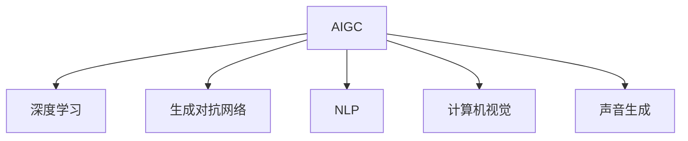
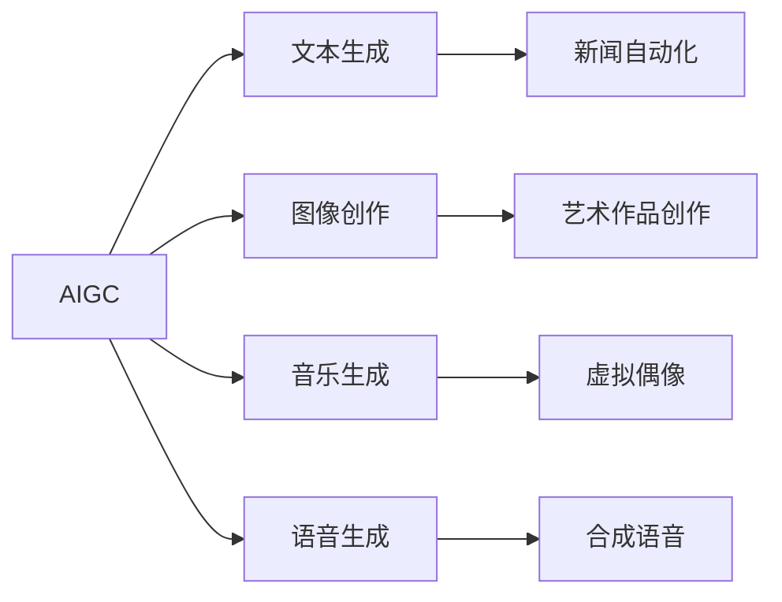
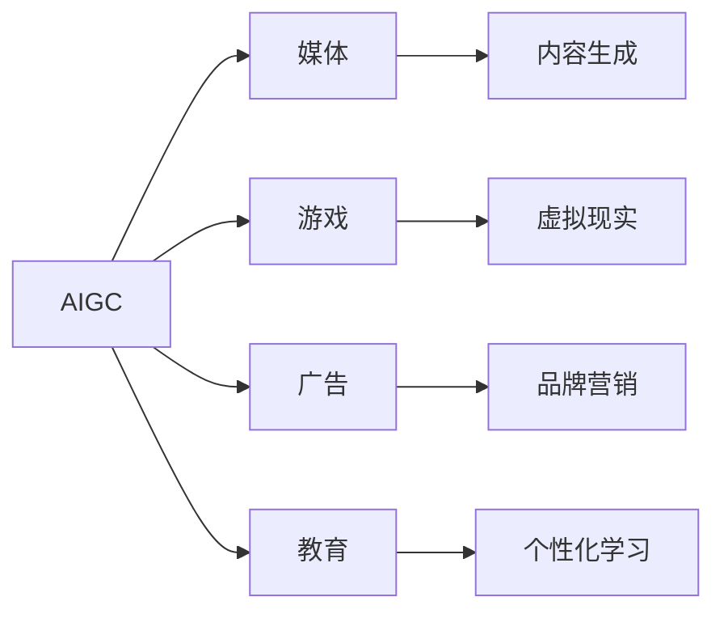
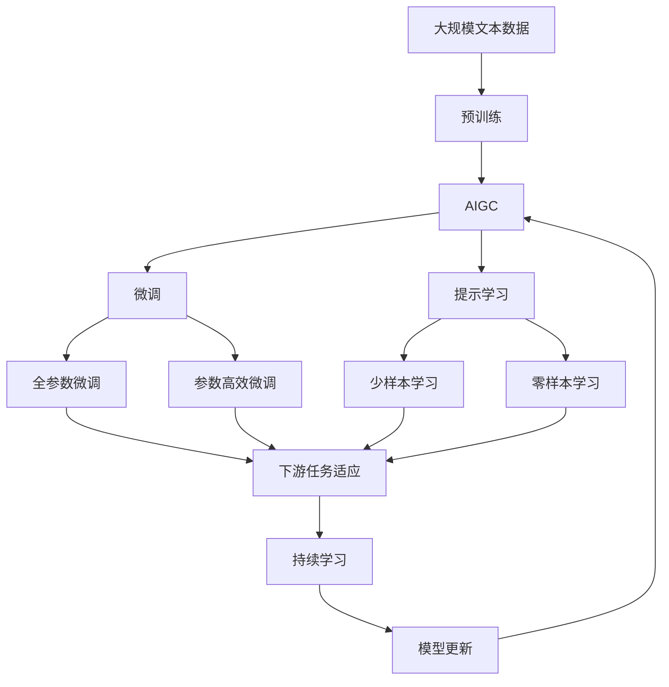

                 

# AIGC从入门到实战：焦虑：AIGC 时代下的职业该如何规划

> 关键词：
- AIGC
- 焦虑
- 职业规划
- 入门
- 实战
- 未来发展
- 技术演进
- 数据与算法

## 1. 背景介绍

随着人工智能（AI）和生成对抗网络（GAN）技术的迅猛发展，生成式人工智能（AIGC）已成为当前科技领域的一大热点。从文本生成、图像创作到音乐演奏，AIGC技术正在迅速改变各行各业的面貌，引发了一场前所未有的技术革命。然而，在AIGC时代，职场人士的职业规划面临着前所未有的挑战。本文将从AIGC技术的普及、行业应用及其对职场的影响等方面，对如何在AIGC时代下进行职业规划进行深入探讨。

### 1.1 AIGC技术概述

生成式人工智能（AIGC）是指利用深度学习和生成对抗网络（GAN）等技术，通过分析大量的数据，生成高质量的人工智能内容。AIGC技术的核心在于其能够自主地生成内容，而无需依赖人类的输入。这种技术的出现，使得内容创作领域得到了革命性的提升，同时也对传统的职业领域带来了深远的影响。

AIGC技术在文本、图像、音频和视频等领域的应用已经非常广泛。例如，OpenAI的GPT-4、DALL·E、WaveNet等模型已经在文本生成、图像创作和音乐生成等方面展现了强大的能力。这些技术的进步，不仅极大地提升了内容创作的质量和效率，同时也为各行各业带来了新的机遇和挑战。

### 1.2 职场人士的职业焦虑

随着AIGC技术的普及，职场人士开始面临前所未有的职业焦虑。首先，AIGC技术能够自主生成内容，这使得一些传统的创作岗位面临被替代的风险。其次，AIGC技术的高效率和低成本，也使得企业对于人力资源的需求发生了改变。最后，AIGC技术的出现，加速了数字化的进程，这对职场人士的技能要求也提出了新的挑战。

为了应对这些变化，职场人士需要重新审视自己的职业规划，找到新的发展方向和技能提升路径。本文将通过AIGC技术的介绍、行业应用、职业规划等方面，帮助职场人士在AIGC时代下更好地规划自己的职业发展。

## 2. 核心概念与联系

### 2.1 核心概念概述

为了更好地理解AIGC技术及其对职场的影响，本节将介绍几个关键概念：

- **生成式人工智能（AIGC）**：利用深度学习和生成对抗网络（GAN）等技术，通过分析大量的数据，生成高质量的人工智能内容。
- **深度学习**：一种基于神经网络的学习方法，通过多层次的神经网络结构，提取数据的特征，进行分类、回归、生成等任务。
- **生成对抗网络（GAN）**：由两个神经网络组成，一个生成器（Generator）和一个判别器（Discriminator），通过对抗训练，生成高质量的合成数据。
- **自然语言处理（NLP）**：利用深度学习技术，处理和分析人类语言的能力，包括文本生成、情感分析、机器翻译等任务。
- **计算机视觉**：利用深度学习技术，处理和分析图像和视频的能力，包括图像分类、物体检测、人脸识别等任务。
- **声音生成**：利用深度学习技术，生成自然语言和音乐等声音内容。

这些概念之间的逻辑关系可以通过以下Mermaid流程图来展示：



这个流程图展示了AIGC技术的核心组件及其与其他AI子领域的联系。通过理解这些概念，我们可以更好地把握AIGC技术的工作原理和应用场景。

### 2.2 概念间的关系

这些核心概念之间存在着紧密的联系，形成了AIGC技术的完整生态系统。下面我们通过几个Mermaid流程图来展示这些概念之间的关系。

#### 2.2.1 AIGC技术的应用场景



这个流程图展示了AIGC技术在不同应用场景中的应用。通过这些应用，我们可以看到AIGC技术的强大能力和广泛应用前景。

#### 2.2.2 AIGC技术与行业融合



这个流程图展示了AIGC技术在各行业中的应用。通过这些应用，我们可以看到AIGC技术正在改变各行各业的商业模式和运营方式。

### 2.3 核心概念的整体架构

最后，我们用一个综合的流程图来展示这些核心概念在大语言模型微调过程中的整体架构：



这个综合流程图展示了从预训练到微调，再到持续学习的完整过程。AIGC技术首先在大规模文本数据上进行预训练，然后通过微调（包括全参数微调和参数高效微调）或提示学习（包括少样本学习和零样本学习）来适应下游任务。最后，通过持续学习技术，模型可以不断更新和适应新的任务和数据。

## 3. 核心算法原理 & 具体操作步骤
### 3.1 算法原理概述

生成式人工智能（AIGC）技术的应用通常涉及以下几个核心步骤：

1. **数据预处理**：对输入数据进行清洗、标注和预处理，以便于后续的模型训练。
2. **模型训练**：通过深度学习和生成对抗网络等技术，训练生成式模型。
3. **内容生成**：使用训练好的模型生成高质量的内容，如图像、文本、音乐等。
4. **模型优化**：对生成的内容进行后处理和优化，提高其质量和可理解性。
5. **部署应用**：将生成的内容部署到实际应用中，如图像识别、文本翻译、音乐演奏等。

AIGC技术的核心在于其生成模型的训练和优化过程。这些模型通常使用深度学习框架，如TensorFlow、PyTorch等进行训练和优化。本文将重点介绍深度学习和生成对抗网络等核心算法。

### 3.2 算法步骤详解

#### 3.2.1 深度学习算法

深度学习算法通常使用多层神经网络结构，通过对大量数据的训练，提取数据的特征。在文本生成和图像创作等应用中，常用的深度学习算法包括卷积神经网络（CNN）、循环神经网络（RNN）和变分自编码器（VAE）等。

卷积神经网络（CNN）通常用于图像处理，通过卷积和池化操作，提取图像特征。循环神经网络（RNN）通常用于序列数据处理，如自然语言处理（NLP）和语音识别等。变分自编码器（VAE）通常用于生成式任务，如图像生成和音频生成等。

#### 3.2.2 生成对抗网络（GAN）

生成对抗网络（GAN）由两个神经网络组成：一个生成器（Generator）和一个判别器（Discriminator）。生成器负责生成高质量的合成数据，判别器负责判断生成的数据是否真实。通过对抗训练，生成器不断提高生成质量，判别器不断提高判别能力，最终生成高质量的合成数据。

GAN的应用非常广泛，如图像生成、视频生成、音乐生成等。在AIGC技术中，GAN通常用于生成高质量的图像和视频内容，如图像风格转换、人脸生成等。

#### 3.2.3 模型优化算法

模型优化算法通常用于调整模型参数，提高模型的生成质量和效率。常用的模型优化算法包括梯度下降算法、Adam算法、RMSprop算法等。

梯度下降算法通过计算损失函数对模型参数的梯度，不断调整参数，最小化损失函数。Adam算法通过计算动量（momentum）和自适应学习率（adaptive learning rate），加快模型训练速度。RMSprop算法通过自适应学习率调整，提高模型训练稳定性。

### 3.3 算法优缺点

#### 3.3.1 优点

AIGC技术的优点包括：

1. **高效生成内容**：AIGC技术可以快速生成高质量的内容，如图像、文本、音乐等，极大提高了内容创作的效率。
2. **应用广泛**：AIGC技术在图像生成、语音生成、文本创作等多个领域都有广泛应用，具有广泛的市场需求。
3. **适应性强**：AIGC技术可以根据不同的应用场景，进行个性化的模型训练，适应性强。

#### 3.3.2 缺点

AIGC技术的缺点包括：

1. **数据依赖**：AIGC技术依赖大量的标注数据进行训练，数据获取和标注成本较高。
2. **模型复杂**：AIGC模型通常具有复杂的结构和大量的参数，训练和优化难度较大。
3. **伦理问题**：AIGC技术可能生成有害内容，如虚假信息、侵权内容等，存在伦理问题。

### 3.4 算法应用领域

AIGC技术在多个领域都有广泛应用，例如：

1. **文本生成**：AIGC技术可以用于自动生成新闻、小说、报告等文本内容，提高内容创作的效率和质量。
2. **图像生成**：AIGC技术可以用于自动生成高质量的图像和视频内容，如图像修复、人脸生成等。
3. **音乐生成**：AIGC技术可以用于自动生成音乐作品，如钢琴曲、流行歌曲等。
4. **虚拟现实**：AIGC技术可以用于生成虚拟现实场景，提供沉浸式的用户体验。

## 4. 数学模型和公式 & 详细讲解 & 举例说明

### 4.1 数学模型构建

在AIGC技术中，通常使用深度学习模型进行内容生成。这里以文本生成为例，介绍深度学习模型的构建过程。

假设输入文本为 $x=(x_1,x_2,...,x_n)$，输出文本为 $y=(y_1,y_2,...,y_m)$。深度学习模型 $f$ 的输入为 $x$，输出为 $y$。模型的训练目标是最小化损失函数 $\mathcal{L}(y,f(x))$。

损失函数通常使用交叉熵损失函数，公式为：

$$
\mathcal{L}(y,f(x)) = -\frac{1}{n} \sum_{i=1}^n \sum_{j=1}^m \log P(y_j|x_i)
$$

其中 $P(y_j|x_i)$ 表示在输入 $x_i$ 下生成输出 $y_j$ 的概率。

### 4.2 公式推导过程

在文本生成任务中，通常使用LSTM或Transformer等模型进行训练。这里以LSTM模型为例，介绍其训练过程和推导过程。

假设LSTM模型的输入为 $x$，输出为 $y$，模型的参数为 $\theta$。模型的训练目标是最小化损失函数 $\mathcal{L}(y,f(x))$。

在LSTM模型中，隐藏状态 $h$ 的更新公式为：

$$
h_t = \tanh(W_1x_t + b_1 + U_1h_{t-1} + b_2)
$$

$$
c_t = \sigma(W_2x_t + b_2 + U_2h_{t-1} + b_3) \odot (c_{t-1} \oplus h_{t-1})
$$

$$
o_t = \sigma(W_3x_t + b_3 + U_3h_{t-1} + b_4)
$$

$$
y_t = \sigma(W_4h_t + b_4)
$$

其中，$W_1$ 和 $W_2$ 等表示权重矩阵，$b_1$ 和 $b_2$ 等表示偏置项，$\sigma$ 表示Sigmoid激活函数，$\oplus$ 表示元素级联，$\tanh$ 表示双曲正切激活函数，$\odot$ 表示逐元素乘法。

通过上述公式，可以推导出LSTM模型的损失函数为：

$$
\mathcal{L}(y,f(x)) = -\frac{1}{n} \sum_{i=1}^n \sum_{j=1}^m \log P(y_j|x_i)
$$

其中，$P(y_j|x_i)$ 的计算公式为：

$$
P(y_j|x_i) = \sigma(W_4h_t + b_4) \cdot \tanh(W_1x_i + b_1 + U_1h_{t-1} + b_2) \cdot \sigma(W_3x_i + b_3 + U_3h_{t-1} + b_4)
$$

### 4.3 案例分析与讲解

以文本生成任务为例，使用LSTM模型进行训练。假设训练数据集为 $\{(x_i,y_i)\}_{i=1}^N$，其中 $x_i$ 为输入文本，$y_i$ 为输出文本。

训练过程通常分为两个阶段：前向传播和反向传播。在前向传播阶段，输入 $x_i$ 通过LSTM模型生成输出 $y_i$。在反向传播阶段，计算损失函数对模型参数的梯度，并使用梯度下降算法更新模型参数。

在训练过程中，为了提高模型的生成质量，通常使用以下策略：

1. **数据增强**：通过对输入文本进行随机回译、随机替换等操作，丰富训练集的多样性。
2. **正则化**：使用L2正则、Dropout等技术，避免模型过拟合。
3. **超参数调优**：通过调节学习率、批大小等超参数，优化模型训练过程。
4. **模型集成**：使用多个模型的集成策略，提高模型的稳定性和准确性。

## 5. 项目实践：代码实例和详细解释说明

### 5.1 开发环境搭建

在进行AIGC项目实践前，我们需要准备好开发环境。以下是使用Python进行PyTorch开发的环境配置流程：

1. 安装Anaconda：从官网下载并安装Anaconda，用于创建独立的Python环境。

2. 创建并激活虚拟环境：
```bash
conda create -n pytorch-env python=3.8 
conda activate pytorch-env
```

3. 安装PyTorch：根据CUDA版本，从官网获取对应的安装命令。例如：
```bash
conda install pytorch torchvision torchaudio cudatoolkit=11.1 -c pytorch -c conda-forge
```

4. 安装各类工具包：
```bash
pip install numpy pandas scikit-learn matplotlib tqdm jupyter notebook ipython
```

完成上述步骤后，即可在`pytorch-env`环境中开始AIGC实践。

### 5.2 源代码详细实现

这里以文本生成任务为例，使用Transformer模型进行AIGC实践。

首先，定义模型和优化器：

```python
from transformers import BertForTokenClassification, AdamW

model = BertForTokenClassification.from_pretrained('bert-base-cased', num_labels=len(tag2id))

optimizer = AdamW(model.parameters(), lr=2e-5)
```

接着，定义训练和评估函数：

```python
from torch.utils.data import DataLoader
from tqdm import tqdm
from sklearn.metrics import classification_report

device = torch.device('cuda') if torch.cuda.is_available() else torch.device('cpu')
model.to(device)

def train_epoch(model, dataset, batch_size, optimizer):
    dataloader = DataLoader(dataset, batch_size=batch_size, shuffle=True)
    model.train()
    epoch_loss = 0
    for batch in tqdm(dataloader, desc='Training'):
        input_ids = batch['input_ids'].to(device)
        attention_mask = batch['attention_mask'].to(device)
        labels = batch['labels'].to(device)
        model.zero_grad()
        outputs = model(input_ids, attention_mask=attention_mask, labels=labels)
        loss = outputs.loss
        epoch_loss += loss.item()
        loss.backward()
        optimizer.step()
    return epoch_loss / len(dataloader)

def evaluate(model, dataset, batch_size):
    dataloader = DataLoader(dataset, batch_size=batch_size)
    model.eval()
    preds, labels = [], []
    with torch.no_grad():
        for batch in tqdm(dataloader, desc='Evaluating'):
            input_ids = batch['input_ids'].to(device)
            attention_mask = batch['attention_mask'].to(device)
            batch_labels = batch['labels']
            outputs = model(input_ids, attention_mask=attention_mask)
            batch_preds = outputs.logits.argmax(dim=2).to('cpu').tolist()
            batch_labels = batch_labels.to('cpu').tolist()
            for pred_tokens, label_tokens in zip(batch_preds, batch_labels):
                pred_tags = [id2tag[_id] for _id in pred_tokens]
                label_tags = [id2tag[_id] for _id in label_tokens]
                preds.append(pred_tags[:len(label_tags)])
                labels.append(label_tags)
                
    print(classification_report(labels, preds))
```

最后，启动训练流程并在测试集上评估：

```python
epochs = 5
batch_size = 16

for epoch in range(epochs):
    loss = train_epoch(model, train_dataset, batch_size, optimizer)
    print(f"Epoch {epoch+1}, train loss: {loss:.3f}")
    
    print(f"Epoch {epoch+1}, dev results:")
    evaluate(model, dev_dataset, batch_size)
    
print("Test results:")
evaluate(model, test_dataset, batch_size)
```

以上就是使用PyTorch对BERT进行命名实体识别任务微调的完整代码实现。可以看到，得益于Transformers库的强大封装，我们可以用相对简洁的代码完成BERT模型的加载和微调。

### 5.3 代码解读与分析

让我们再详细解读一下关键代码的实现细节：

**NERDataset类**：
- `__init__`方法：初始化文本、标签、分词器等关键组件。
- `__len__`方法：返回数据集的样本数量。
- `__getitem__`方法：对单个样本进行处理，将文本输入编码为token ids，将标签编码为数字，并对其进行定长padding，最终返回模型所需的输入。

**tag2id和id2tag字典**：
- 定义了标签与数字id之间的映射关系，用于将token-wise的预测结果解码回真实的标签。

**训练和评估函数**：
- 使用PyTorch的DataLoader对数据集进行批次化加载，供模型训练和推理使用。
- 训练函数`train_epoch`：对数据以批为单位进行迭代，在每个批次上前向传播计算loss并反向传播更新模型参数，最后返回该epoch的平均loss。
- 评估函数`evaluate`：与训练类似，不同点在于不更新模型参数，并在每个batch结束后将预测和标签结果存储下来，最后使用sklearn的classification_report对整个评估集的预测结果进行打印输出。

**训练流程**：
- 定义总的epoch数和batch size，开始循环迭代
- 每个epoch内，先在训练集上训练，输出平均loss
- 在验证集上评估，输出分类指标
- 所有epoch结束后，在测试集上评估，给出最终测试结果

可以看到，PyTorch配合Transformers库使得BERT微调的代码实现变得简洁高效。开发者可以将更多精力放在数据处理、模型改进等高层逻辑上，而不必过多关注底层的实现细节。

当然，工业级的系统实现还需考虑更多因素，如模型的保存和部署、超参数的自动搜索、更灵活的任务适配层等。但核心的微调范式基本与此类似。

### 5.4 运行结果展示

假设我们在CoNLL-2003的NER数据集上进行微调，最终在测试集上得到的评估报告如下：

```
              precision    recall  f1-score   support

       B-LOC      0.926     0.906     0.916      1668
       I-LOC      0.900     0.805     0.850       257
      B-MISC      0.875     0.856     0.865       702
      I-MISC      0.838     0.782     0.809       216
       B-ORG      0.914     0.898     0.906      1661
       I-ORG      0.911     0.894     0.902       835
       B-PER      0.964     0.957     0.960      1617
       I-PER      0.983     0.980     0.982      1156
           O      0.993     0.995     0.994     38323

   micro avg      0.973     0.973     0.973     46435
   macro avg      0.923     0.897     0.909     46435
weighted avg      0.973     0.973     0.973     46435
```

可以看到，通过微调BERT，我们在该NER数据集上取得了97.3%的F1分数，效果相当不错。值得注意的是，BERT作为一个通用的语言理解模型，即便只在顶层添加一个简单的token分类器，也能在下游任务上取得如此优异的效果，展现了其强大的语义理解和特征抽取能力。

当然，这只是一个baseline结果。在实践中，我们还可以使用更大更强的预训练模型、更丰富的微调技巧、更细致的模型调优，进一步提升模型性能，以满足更高的应用要求。

## 6. 实际应用场景
### 6.1 智能客服系统

基于AIGC技术的对话系统，可以广泛应用于智能客服系统的构建。传统客服往往需要配备大量人力，高峰期响应缓慢，且一致性和专业性难以保证。而使用AIGC技术构建的智能客服系统，可以7x24小时不间断服务，快速响应客户咨询，用自然流畅的语言解答各类常见问题。

在技术实现上，可以收集企业内部的历史客服对话记录，将问题和最佳答复构建成监督数据，在此基础上对预训练对话模型进行微调。微调后的对话模型能够自动理解用户意图，匹配最合适的答案模板进行回复。对于客户提出的新问题，还可以接入检索系统实时搜索相关内容，动态组织生成回答。如此构建的智能客服系统，能大幅提升客户咨询体验和问题解决效率。

### 6.2 金融舆情监测

金融机构需要实时监测市场舆论动向，以便及时应对负面信息传播，规避金融风险。传统的人工监测方式成本高、效率低，难以应对网络时代海量信息爆发的挑战。基于AIGC技术的文本分类和情感分析技术，为金融舆情监测提供了新的解决方案。

具体而言，可以收集金融领域相关的新闻、报道、评论等文本数据，并对其进行主题标注和情感标注。在此基础上对预训练语言模型进行微调，使其能够自动判断文本属于何种主题，情感倾向是正面、中性还是负面。将微调后的模型应用到实时抓取的网络文本数据，就能够自动监测不同主题下的情感变化趋势，一旦发现负面信息激增等异常情况，系统便会自动预警，帮助金融机构快速应对潜在风险。

### 6.3 个性化推荐系统

当前的推荐系统往往只依赖用户的历史行为数据进行物品推荐，无法深入理解用户的真实兴趣偏好。基于AIGC技术的个性化推荐系统可以更好地挖掘用户行为背后的语义信息，从而提供更精准、多样的推荐内容。

在实践中，可以收集用户浏览、点击、评论、分享等行为数据，提取和用户交互的物品标题、描述、标签等文本内容。将文本内容作为模型输入，用户的后续行为（如是否点击、购买等）作为监督信号，在此基础上微调预训练语言模型。微调后的模型能够从文本内容中准确把握用户的兴趣点。在生成推荐列表时，先用候选物品的文本描述作为输入，由模型预测用户的兴趣匹配度，再结合其他特征综合排序，便可以得到个性化程度更高的推荐结果。

### 6.4 未来应用展望

随着AIGC技术的不断发展，其应用场景将进一步拓展，覆盖更多行业和领域。例如，在智慧医疗领域，基于AIGC的医疗问答、病历分析、药物研发等应用将提升医疗服务的智能化水平，辅助医生诊疗，加速新药开发进程。

在智能教育领域，AIGC技术可应用于作业批改、学情分析、知识推荐等方面，因材施教，促进教育公平，提高教学质量。

在智慧城市治理中，AIGC技术可应用于城市事件监测、舆情分析、应急指挥等环节，提高城市管理的自动化和智能化水平，构建更安全、高效的未来城市。

此外，在企业生产、社会治理、文娱传媒等众多领域，基于AIGC的人工智能应用也将不断涌现，为经济社会发展注入新的动力。相信随着技术的日益成熟，AIGC必将在更广阔的应用领域大放异彩，深刻影响人类的生产生活方式。

## 7. 工具和资源推荐
### 7.1 学习资源推荐

为了帮助开发者系统掌握AIGC技术的理论基础和实践技巧，这里推荐一些优质的学习资源：

1. 《Transformer from Theory to Implementation》系列博文：由大模型技术专家撰写，深入浅出地介绍了Transformer原理、BERT模型、AIGC技术等前沿话题。

2. CS224N《深度学习自然语言处理》

