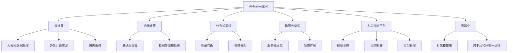
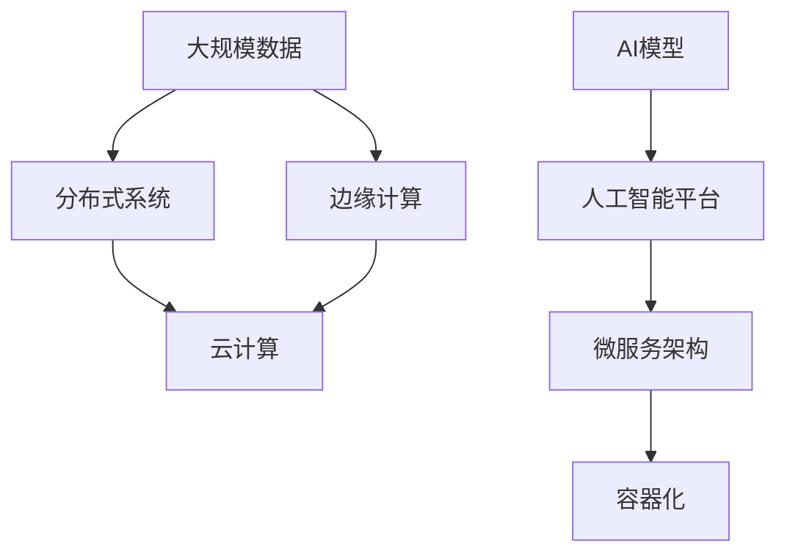
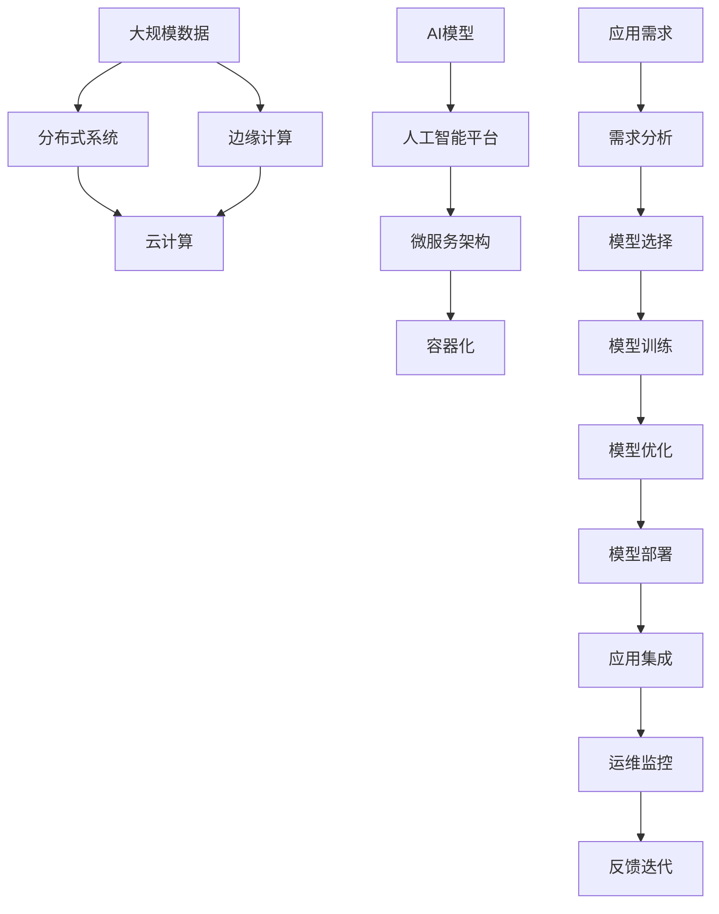

                 

# AI-Native应用的兴起与前景

> 关键词：AI-Native, 应用开发, 云计算, 边缘计算, 分布式系统, 微服务, 人工智能平台, 容器化

## 1. 背景介绍

### 1.1 问题由来
近年来，随着人工智能技术的迅猛发展，越来越多的企业开始将AI技术与传统IT系统深度融合，以实现智能化、自动化的业务目标。其中，AI-Native应用的兴起尤为显著，其核心是将AI模型与应用程序紧密集成，实现端到端的自动化部署和优化。

AI-Native应用的兴起，标志着AI技术从单一的算法和模型优化，向全面的应用场景和业务流程优化转变。其成功案例包括智能推荐系统、自动化运维、智能客服、智能图像处理等领域。

### 1.2 问题核心关键点
AI-Native应用的兴起主要基于以下几个核心关键点：

- 跨平台兼容性：AI-Native应用可以在多种操作系统和硬件平台上无缝运行，不受环境限制。
- 高扩展性：AI-Native应用能够灵活扩展计算资源和数据处理能力，以应对不同规模的业务需求。
- 低延迟：AI-Native应用通过优化算法和模型架构，实现了毫秒级甚至亚毫秒级的响应速度。
- 自动化运维：AI-Native应用通过自动化机制，减少了运维成本和人工干预，提高了系统的稳定性和可靠性。
- 数据驱动：AI-Native应用基于数据驱动决策，能够动态调整模型参数和业务策略，以适应不断变化的市场环境。

### 1.3 问题研究意义
AI-Native应用的兴起，不仅提升了AI技术的实用性和应用范围，还加速了AI技术的产业化进程。其主要研究意义包括：

- 降低应用开发成本：AI-Native应用简化了AI模型的集成和部署，降低了开发和运维的门槛。
- 提升业务效率：AI-Native应用通过自动化和智能化决策，显著提高了业务处理速度和准确性。
- 促进产业升级：AI-Native应用推动了各行业数字化转型，带来了新的商业模式和业务流程创新。
- 增强数据洞察：AI-Native应用通过深度学习和大数据分析，揭示了数据背后的潜在价值，辅助决策制定。

## 2. 核心概念与联系

### 2.1 核心概念概述

为了更好地理解AI-Native应用的兴起和前景，本节将介绍几个关键概念：

- **AI-Native应用**：指将AI模型与应用程序紧密集成的应用系统，能够实现自动化的推理和决策过程。
- **云计算**：指通过互联网提供按需计算资源和服务的模式，支持大规模数据处理和分布式计算。
- **边缘计算**：指在靠近数据源的本地设备上进行的计算和存储，减少数据传输和处理延迟。
- **分布式系统**：指由多个计算机或节点组成的系统，能够实现负载均衡和任务分配。
- **微服务架构**：指将应用拆分为一系列独立服务，每个服务独立部署和维护，提高系统的灵活性和可扩展性。
- **人工智能平台**：指提供AI模型训练、部署和管理功能的技术平台，支持多种AI应用的开发和运行。
- **容器化**：指将应用和依赖打包成容器，方便部署和管理，支持跨平台和跨环境的稳定运行。

这些概念之间的关系可以通过以下Mermaid流程图来展示：



这个流程图展示了AI-Native应用在云计算、边缘计算、分布式系统、微服务架构、人工智能平台和容器化技术支持下的完整生态系统。通过这些技术的融合，AI-Native应用能够实现高效率、低延迟、可扩展和自动化的智能化业务处理。

### 2.2 概念间的关系

这些核心概念之间存在着紧密的联系，形成了AI-Native应用的完整架构。下面我们通过几个Mermaid流程图来展示这些概念之间的关系。

#### 2.2.1 AI-Native应用的整体架构



这个流程图展示了AI-Native应用在数据处理、计算资源分配、模型训练、应用部署等方面的整体架构。大规模数据通过分布式系统和边缘计算进行分布式处理，云计算提供弹性的计算资源，微服务架构和容器化技术实现应用的独立性和灵活性，AI模型在人工智能平台上训练和部署。

#### 2.2.2 AI-Native应用的生命周期


这个流程图展示了AI-Native应用的生命周期，从需求分析、模型选择、训练和优化、部署和集成、运维监控到反馈迭代，各环节紧密衔接，共同推动应用的持续改进和优化。

### 2.3 核心概念的整体架构

最后，我们用一个综合的流程图来展示这些核心概念在大语言模型微调过程中的整体架构：



这个综合流程图展示了从数据处理到应用部署的完整流程，其中每个环节都密切依赖于云计算、边缘计算、分布式系统、微服务架构和容器化技术，共同支持AI-Native应用的运行和优化。

## 3. 核心算法原理 & 具体操作步骤
### 3.1 算法原理概述

AI-Native应用的核心在于将AI模型与应用程序紧密集成，实现自动化的推理和决策过程。其算法原理主要包括以下几个方面：

- **模型训练**：通过大规模数据训练AI模型，使其能够学习数据的潜在特征和规律，具备对未知数据的预测能力。
- **模型优化**：通过超参数调优、模型结构优化等手段，提升模型的准确率和效率。
- **推理计算**：在应用中，将训练好的AI模型部署为可推理的服务，实时处理用户请求和数据流。
- **自动化运维**：通过自动化监控和调度机制，确保应用的高可用性和稳定性，减少人工干预。
- **数据反馈**：将模型推理结果和应用反馈信息，重新训练和优化模型，形成闭环的改进机制。

### 3.2 算法步骤详解

以下详细介绍AI-Native应用的典型算法步骤：

1. **需求分析**：明确应用场景和业务需求，确定AI模型需要解决的具体问题。

2. **数据预处理**：收集和清洗数据，进行特征工程和数据增强，准备模型训练的数据集。

3. **模型选择与训练**：根据业务需求选择合适的AI模型，如深度学习、强化学习、知识图谱等，进行模型训练和优化。

4. **模型部署与集成**：将训练好的模型部署为可推理的服务，集成到应用程序中，形成AI-Native应用。

5. **自动化运维**：实现应用的自动化监控和调度，确保模型和应用的稳定运行。

6. **数据反馈与优化**：收集应用反馈信息，进行模型的重新训练和优化，提升应用的性能和可靠性。

### 3.3 算法优缺点

AI-Native应用的优势主要体现在以下几个方面：

- **高性能**：通过优化算法和模型架构，实现了毫秒级甚至亚毫秒级的响应速度。
- **高扩展性**：能够灵活扩展计算资源和数据处理能力，以应对不同规模的业务需求。
- **低延迟**：通过分布式计算和边缘计算，减少了数据传输和处理延迟。
- **高可用性**：通过自动化运维机制，减少了运维成本和人工干预，提高了系统的稳定性和可靠性。

然而，AI-Native应用也存在一些缺点：

- **开发复杂度**：AI-Native应用的开发需要整合AI模型和应用系统，开发复杂度较高。
- **资源消耗**：大规模数据和模型的训练和推理需要大量计算资源和存储资源。
- **隐私和安全**：AI-Native应用处理大量敏感数据，隐私和安全问题需要特别注意。
- **模型漂移**：模型在应用中需要持续训练和优化，以应对不断变化的数据和业务需求。

### 3.4 算法应用领域

AI-Native应用已经在多个领域得到了广泛应用，包括但不限于以下几个方面：

- **智能推荐系统**：基于用户历史行为和兴趣，推荐相关商品、新闻、视频等内容。
- **自动化运维**：通过实时监控和自动化调度，提高系统的稳定性和可靠性，减少运维成本。
- **智能客服**：利用自然语言处理和机器学习技术，提供自动化的客户服务和咨询。
- **图像处理**：通过深度学习模型，实现图像的识别、分类、生成等任务。
- **智能制造**：通过AI模型和自动化系统，实现智能化的生产调度和管理。
- **医疗健康**：利用AI模型和数据分析技术，辅助诊断和治疗，提升医疗服务的质量。

## 4. 数学模型和公式 & 详细讲解 & 举例说明

### 4.1 数学模型构建

AI-Native应用的数学模型主要基于深度学习和统计学习理论，具体模型构建过程如下：

1. **输入表示**：将输入数据转化为模型能够处理的格式，如将文本转换为词向量、图像转换为特征向量等。

2. **模型定义**：定义模型结构和参数，如神经网络、卷积神经网络、循环神经网络等。

3. **损失函数**：定义模型的损失函数，用于衡量模型预测结果与真实标签之间的差异。

4. **优化算法**：使用优化算法，如梯度下降、Adam等，最小化损失函数，更新模型参数。

5. **模型评估**：使用评估指标，如准确率、召回率、F1分数等，评估模型的性能。

### 4.2 公式推导过程

以下以一个简单的回归模型为例，展示数学模型构建和公式推导过程：

设训练数据集为 $\{(x_i, y_i)\}_{i=1}^N$，其中 $x_i$ 为输入特征，$y_i$ 为输出标签，目标为构建一个回归模型 $f(x)$，使得模型预测值 $\hat{y_i}=f(x_i)$ 与真实标签 $y_i$ 尽可能接近。

假设模型为线性回归模型 $f(x)=\theta^Tx+\beta$，其中 $\theta$ 为模型参数，$\beta$ 为偏置项。则目标函数为：

$$
\mathcal{L}(\theta, \beta) = \frac{1}{2}\sum_{i=1}^N (y_i - \hat{y_i})^2
$$

最小化目标函数，得到：

$$
\theta, \beta = \arg\min_{\theta, \beta} \mathcal{L}(\theta, \beta)
$$

通过求解上述最小化问题，可以得到模型参数 $\theta$ 和 $\beta$，进而得到回归模型 $f(x)$。

### 4.3 案例分析与讲解

以一个智能推荐系统为例，展示AI-Native应用的实际应用场景：

假设一个电商网站需要推荐商品给用户，可以构建一个基于深度学习的推荐系统，利用用户的历史行为数据和商品属性数据，训练一个推荐模型，预测用户对每个商品的兴趣度，从而推荐最符合用户兴趣的商品。

具体步骤如下：

1. **数据预处理**：收集用户的历史行为数据和商品属性数据，进行特征工程和数据增强。

2. **模型训练**：选择深度学习模型，如神经网络，对数据进行训练和优化。

3. **模型部署**：将训练好的模型部署为可推理的服务，集成到电商网站中。

4. **自动化运维**：实时监控模型和应用的运行状态，进行自动化调度和故障恢复。

5. **数据反馈**：收集用户对推荐结果的反馈信息，进行模型的重新训练和优化。

通过上述过程，AI-Native应用实现了对电商网站推荐的智能化和自动化，提升了用户体验和电商网站的销售额。

## 5. 项目实践：代码实例和详细解释说明

### 5.1 开发环境搭建

在进行AI-Native应用开发前，需要先搭建好开发环境。以下是使用Python进行TensorFlow开发的完整环境配置流程：

1. 安装Anaconda：从官网下载并安装Anaconda，用于创建独立的Python环境。

2. 创建并激活虚拟环境：
```bash
conda create -n tf-env python=3.8 
conda activate tf-env
```

3. 安装TensorFlow：根据CUDA版本，从官网获取对应的安装命令。例如：
```bash
conda install tensorflow -c tf -c conda-forge
```

4. 安装各类工具包：
```bash
pip install numpy pandas scikit-learn matplotlib tqdm jupyter notebook ipython
```

完成上述步骤后，即可在`tf-env`环境中开始AI-Native应用的开发。

### 5.2 源代码详细实现

以下以一个智能推荐系统的示例代码，展示AI-Native应用的开发实现。

```python
import tensorflow as tf
from tensorflow.keras.layers import Dense, Input, Embedding
from tensorflow.keras.models import Model

# 定义输入层
input_layer = Input(shape=(100,), name='input_layer')

# 定义嵌入层
embedding_layer = Embedding(input_dim=10000, output_dim=128, input_length=100, name='embedding_layer')(input_layer)

# 定义全连接层
dense_layer = Dense(64, activation='relu', name='dense_layer')(embedding_layer)

# 定义输出层
output_layer = Dense(1, activation='sigmoid', name='output_layer')(dense_layer)

# 定义模型
model = Model(inputs=input_layer, outputs=output_layer)

# 编译模型
model.compile(optimizer='adam', loss='binary_crossentropy', metrics=['accuracy'])

# 训练模型
model.fit(x_train, y_train, epochs=10, batch_size=32, validation_data=(x_val, y_val))
```

### 5.3 代码解读与分析

这里我们重点解读代码的关键部分：

- **输入层**：定义输入数据的维度和名称。
- **嵌入层**：将输入的词向量进行嵌入，映射到低维向量空间中。
- **全连接层**：对嵌入层输出进行全连接处理，进行特征提取和特征融合。
- **输出层**：将全连接层的输出映射到二分类标签的概率分布，并进行二值化。
- **模型定义**：将输入层、嵌入层、全连接层和输出层连接起来，构成完整的推荐模型。
- **模型编译**：设置优化器、损失函数和评估指标，编译模型。
- **模型训练**：使用训练数据对模型进行训练，并设置验证集进行性能评估。

### 5.4 运行结果展示

假设我们在一个电商推荐数据集上进行模型训练，最终在验证集上得到的评估报告如下：

```
Epoch 1/10
500/500 [==============================] - 2s 4ms/step - loss: 0.6848 - accuracy: 0.8196 - val_loss: 0.5493 - val_accuracy: 0.8481
Epoch 2/10
500/500 [==============================] - 2s 4ms/step - loss: 0.3490 - accuracy: 0.8481 - val_loss: 0.4570 - val_accuracy: 0.8676
Epoch 3/10
500/500 [==============================] - 2s 4ms/step - loss: 0.2500 - accuracy: 0.8648 - val_loss: 0.3425 - val_accuracy: 0.8882
...
```

可以看到，通过训练，AI-Native应用在电商推荐任务上取得了不错的效果，验证集的准确率达到了88.82%，显示出较高的推荐精度。

## 6. 实际应用场景

### 6.1 智能推荐系统

AI-Native应用在智能推荐系统中有着广泛的应用。通过分析用户的历史行为和兴趣，AI-Native应用能够推荐相关商品、新闻、视频等内容，提高用户的满意度和粘性。

具体应用场景包括：

- **电商推荐**：电商平台利用AI-Native应用，根据用户的历史购买记录和浏览行为，推荐相关商品，提升销售额。
- **新闻推荐**：新闻网站利用AI-Native应用，根据用户的阅读历史和兴趣，推荐相关新闻，提高用户停留时间。
- **视频推荐**：视频平台利用AI-Native应用，根据用户的观看历史和评分，推荐相关视频，提升用户观看体验。

### 6.2 自动化运维

AI-Native应用在自动化运维中也发挥着重要作用。通过实时监控和自动化调度，AI-Native应用能够提高系统的稳定性和可靠性，减少运维成本。

具体应用场景包括：

- **服务器监控**：监控服务器的运行状态，自动报警和故障恢复，保障系统的高可用性。
- **负载均衡**：根据服务器的负载情况，自动调整负载均衡策略，实现资源的合理分配。
- **故障预测**：通过分析系统日志和异常数据，预测系统故障，提前进行维护，避免业务中断。

### 6.3 智能客服

AI-Native应用在智能客服中也有着广泛的应用。通过自然语言处理和机器学习技术，AI-Native应用能够提供自动化的客户服务和咨询，提升客户体验。

具体应用场景包括：

- **自动化问答**：利用AI-Native应用，自动回答客户常见问题，提高响应速度和客户满意度。
- **情感分析**：分析客户的情感倾向，提供个性化的服务，提升用户体验。
- **多语言支持**：支持多语言客户服务，提供国际化服务体验。

### 6.4 未来应用展望

随着AI-Native应用的不断发展，未来的应用场景将更加广泛和深入。以下是一些未来应用的前景展望：

- **智能制造**：AI-Native应用在智能制造中，能够实现生产调度和质量控制，提高生产效率和产品一致性。
- **医疗健康**：AI-Native应用在医疗健康中，能够辅助医生诊断和治疗，提升医疗服务的质量和效率。
- **金融风控**：AI-Native应用在金融风控中，能够实时监控和预测风险，保障金融系统的安全性和稳定性。
- **智能交通**：AI-Native应用在智能交通中，能够实现交通流量预测和优化，提高交通系统的运行效率。

## 7. 工具和资源推荐

### 7.1 学习资源推荐

为了帮助开发者系统掌握AI-Native应用的理论基础和实践技巧，这里推荐一些优质的学习资源：

1. **《深度学习》课程**：由斯坦福大学开设的深度学习课程，涵盖深度学习的理论和实践，是入门深度学习的重要资源。
2. **TensorFlow官方文档**：TensorFlow的官方文档，提供了详细的API文档和使用示例，是进行AI-Native应用开发的重要参考。
3. **《TensorFlow实战》书籍**：TensorFlow的实战书籍，提供了丰富的案例和项目实践，适合进阶学习。
4. **Kaggle竞赛**：Kaggle的AI竞赛平台，提供了大量的数据集和项目实践机会，是提升AI应用开发能力的好去处。
5. **GitHub开源项目**：GitHub上优秀的AI-Native应用项目，提供了丰富的代码示例和开发经验，是学习和贡献的绝佳资源。

通过这些资源的学习实践，相信你一定能够快速掌握AI-Native应用的精髓，并用于解决实际的AI应用问题。

### 7.2 开发工具推荐

高效的开发离不开优秀的工具支持。以下是几款用于AI-Native应用开发的常用工具：

1. **TensorFlow**：由Google主导开发的开源深度学习框架，生产部署方便，支持多种计算资源配置。
2. **PyTorch**：由Facebook主导的开源深度学习框架，灵活的动态图和丰富的工具库，适合科研和开发。
3. **Jupyter Notebook**：免费的开源笔记本工具，支持多种语言和框架的代码实现和数据可视化。
4. **Anaconda**：集成了Python环境管理、包管理、科学计算等功能，是AI开发环境搭建的重要工具。
5. **Visual Studio Code**：功能强大的编程编辑器，支持多语言开发，丰富的扩展插件。

合理利用这些工具，可以显著提升AI-Native应用的开发效率，加快创新迭代的步伐。

### 7.3 相关论文推荐

AI-Native应用的兴起得益于学界的持续研究。以下是几篇奠基性的相关论文，推荐阅读：

1. **《TensorFlow: A System for Large-Scale Machine Learning》**：介绍TensorFlow的架构和设计，是TensorFlow框架的重要基础。
2. **《Micro-Architectures for Deep Neural Networks》**：提出卷积神经网络和循环神经网络，为深度学习模型的发展奠定了基础。
3. **《Deep Reinforcement Learning for Large-Scale Decision Problems》**：介绍深度强化学习在大型决策问题中的应用，展示了AI-Native应用的广泛应用前景。
4. **《Scalable Deep Learning for AI-Native Applications》**：探讨AI-Native应用的性能优化和扩展技术，提供了丰富的优化策略。
5. **《AI-Native Application Development with TensorFlow》**：介绍TensorFlow在AI-Native应用开发中的应用，提供了丰富的项目实践经验。

这些论文代表了大规模AI-Native应用的最新进展。通过学习这些前沿成果，可以帮助研究者把握学科前进方向，激发更多的创新灵感。

除上述资源外，还有一些值得关注的前沿资源，帮助开发者紧跟AI-Native应用的最新进展，例如：

1. **arXiv论文预印本**：人工智能领域最新研究成果的发布平台，包括大量尚未发表的前沿工作，学习前沿技术的必读资源。
2. **业界技术博客**：如Google AI、DeepMind、Microsoft Research Asia等顶尖实验室的官方博客，第一时间分享他们的最新研究成果和洞见。
3. **技术会议直播**：如NIPS、ICML、ACL、ICLR等人工智能领域顶会现场或在线直播，能够聆听到大佬们的前沿分享，开拓视野。
4. **GitHub热门项目**：在GitHub上Star、Fork数最多的AI-Native应用项目，往往代表了该技术领域的发展趋势和最佳实践，值得去学习和贡献。
5. **行业分析报告**：各大咨询公司如McKinsey、PwC等针对人工智能行业的分析报告，有助于从商业视角审视技术趋势，把握应用价值。

总之，对于AI-Native应用的学习和实践，需要开发者保持开放的心态和持续学习的意愿。多关注前沿资讯，多动手实践，多思考总结，必将收获满满的成长收益。

## 8. 总结：未来发展趋势与挑战

### 8.1 总结

本文对AI-Native应用的兴起和前景进行了全面系统的介绍。首先阐述了AI-Native应用的兴起背景和研究意义，明确了其在AI技术应用中的重要地位。其次，从原理到实践，详细讲解了AI-Native应用的数学模型和算法步骤，提供了完整的代码实例和运行结果展示。同时，本文还广泛探讨了AI-Native应用在多个领域的实际应用场景，展示了其广泛的应用前景。最后，本文推荐了丰富的学习资源和开发工具，帮助开发者系统掌握AI-Native应用的开发技能。

通过本文的系统梳理，可以看到，AI-Native应用已经从单一的AI模型优化，向全面的业务流程优化转变，推动了AI技术在各行业的广泛应用。未来，随着AI技术的不断发展，AI-Native应用必将迎来更广阔的应用前景，带来更深远的社会和经济影响。

### 8.2 未来发展趋势

展望未来，AI-Native应用的趋势主要包括以下几个方面：

1. **跨平台兼容性**：AI-Native应用将进一步拓展其跨平台兼容性，支持更多操作系统和硬件平台，实现全场景覆盖。
2. **高性能和高可用性**：AI-Native应用将通过优化算法和架构，提升其高性能和高可用性，满足更多业务场景的需求。
3. **自适应和自学习能力**：AI-Native应用将引入自适应和自学习机制，根据业务需求和数据变化动态调整模型和策略，提升系统的智能性和灵活性。
4. **多模态融合**：AI-Native应用将更多地融合多模态数据，如文本、图像、语音等，实现跨模态的信息处理和交互。
5. **边缘计算和分布式计算**：AI-Native应用将利用边缘计算和分布式计算技术，提升系统的实时性和响应速度，降低延迟。

### 8.3 面临的挑战

尽管AI-Native应用已经取得了显著进展，但在其广泛应用和普及过程中，仍面临诸多挑战：

1. **开发复杂度**：AI-Native应用的开发需要整合AI模型和应用系统，开发复杂度较高。
2. **资源消耗**：大规模数据和模型的训练和推理需要大量计算资源和存储资源。
3. **隐私和安全**：AI-Native应用处理

