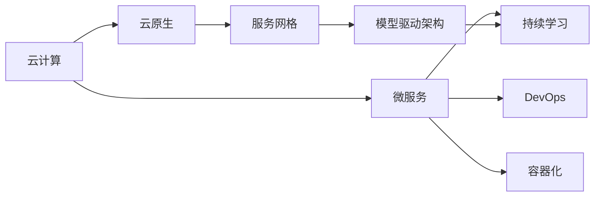
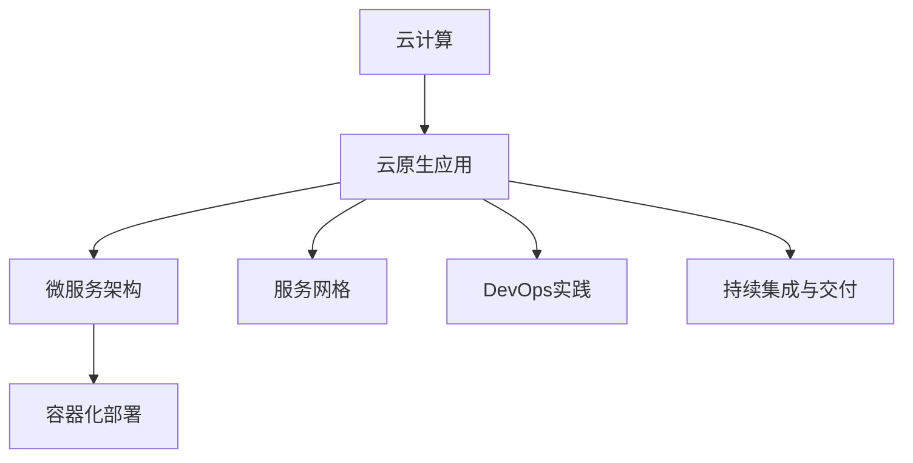
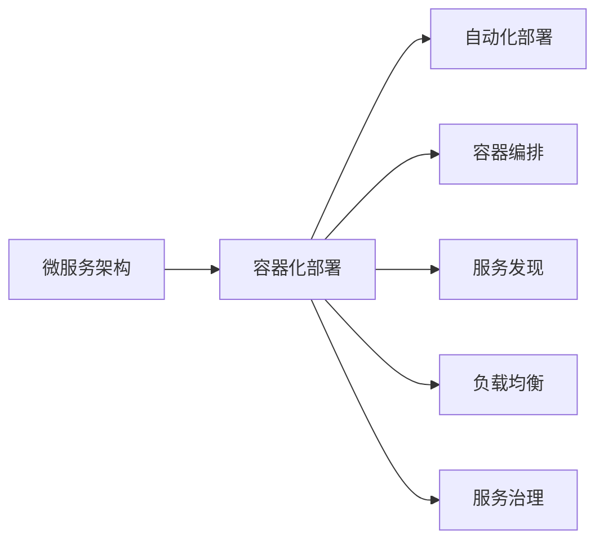
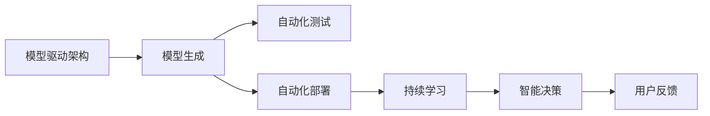
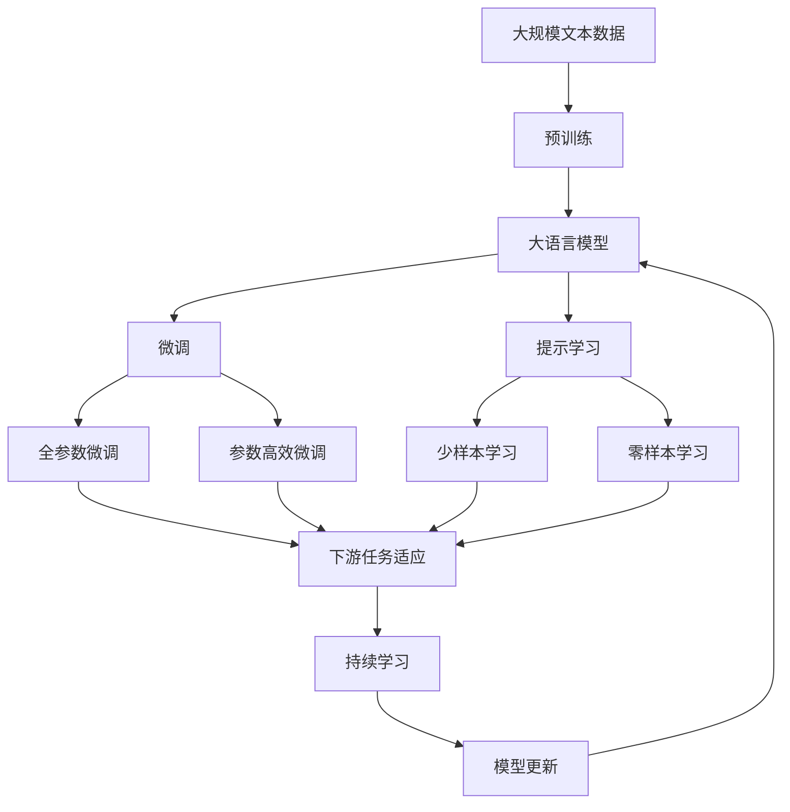

                 

## 1. 背景介绍

### 1.1 问题由来
随着云计算、微服务、DevOps、容器化等技术不断成熟和普及，企业对IT基础设施的依赖性逐渐减弱，云计算和云原生环境的应用场景日益增多。企业不再被局限于自建和维护IT基础设施，转而利用云计算平台提供的便捷服务，自主构建与应用紧密结合的IT架构。这种基于云原生环境构建的应用，通常被称为AI-Native应用，它们依赖于云平台强大的计算资源和自动化的服务管理，能够实现更高的灵活性、可扩展性和可靠性。

### 1.2 问题核心关键点
AI-Native应用是云原生技术发展的最新阶段，其主要特点包括：
- **平台原生**：基于云平台原生架构，能够利用云平台的资源和服务自动管理。
- **数据驱动**：以数据为中心，支持数据的存储、处理、分析和应用，实现智能决策。
- **服务自动化**：通过自动化工具和流程，实现应用部署、扩展和维护。
- **模型化和微服务**：采用微服务架构和模型驱动的设计方式，提升应用的模块化和可维护性。
- **弹性扩展**：能够快速应对业务变化，动态调整资源配置，支持大规模并发和长期稳定运行。

AI-Native应用在金融、医疗、教育、零售等多个行业领域取得了显著的应用成果，标志着云计算和人工智能技术的深度融合。

### 1.3 问题研究意义
研究AI-Native应用的兴起与前景，对于推动云计算和人工智能技术的融合应用具有重要意义：

1. **加速数字化转型**：AI-Native应用能够帮助传统行业加快数字化转型进程，提升业务流程的自动化和智能化水平。
2. **提升决策效率**：通过数据分析和机器学习技术，AI-Native应用能够提供更精准、快速的决策支持，提高管理效率。
3. **降低IT成本**：利用云平台强大的资源和服务自动管理，减少了企业对自建和维护IT基础设施的依赖，降低了IT运营成本。
4. **提高创新速度**：微服务架构和模型驱动的设计方式，使得AI-Native应用能够快速迭代和升级，加速新业务和新功能的开发。
5. **强化数据安全**：云平台提供的数据安全和隐私保护机制，能够提升应用的安全性和可靠性，确保数据不被滥用和泄露。

## 2. 核心概念与联系

### 2.1 核心概念概述

为更好地理解AI-Native应用的兴起与前景，本节将介绍几个密切相关的核心概念：

- **云计算**：通过互联网提供计算资源和服务的模式，支持按需使用、付费即用的服务理念。
- **云原生**：基于云计算的架构风格和技术栈，支持自动化、弹性和自服务化的应用构建和运维。
- **微服务**：将应用拆分为多个独立、自治的服务单元，每个服务独立部署、运行和管理。
- **DevOps**：一种敏捷的软件开发、持续集成和持续部署的实践方法，强调协作、自动化和持续交付。
- **容器化**：将应用及其依赖打包在容器中进行隔离和交付，支持跨平台、跨环境运行。
- **服务网格**：一种分布式系统的管理工具，提供路由、负载均衡、身份认证等功能，支持微服务的管理。
- **模型驱动架构**：基于模型的设计方式，支持应用的自动化生成、测试和部署，提高应用的可维护性和可扩展性。
- **持续学习**：通过不断训练和更新模型，提升应用的智能决策能力，支持AI-Native应用的长期演化和优化。

这些核心概念之间的逻辑关系可以通过以下Mermaid流程图来展示：



这个流程图展示了几大核心概念之间的联系：

1. 云计算是云原生应用的底层基础设施，支持微服务的构建和运维。
2. DevOps和微服务紧密相关，通过自动化工具和流程，实现应用的持续集成和持续交付。
3. 容器化支持微服务的打包和交付，提供跨平台和跨环境的一致性。
4. 服务网格提供微服务的管理和通信机制，支持微服务的自动化扩展和故障恢复。
5. 模型驱动架构以模型为中心，支持应用的自动化设计和测试，提高应用的可维护性。
6. 持续学习基于数据和模型，提升应用的智能决策能力，支持长期演化。

### 2.2 概念间的关系

这些核心概念之间存在着紧密的联系，形成了AI-Native应用的完整生态系统。下面我通过几个Mermaid流程图来展示这些概念之间的关系。

#### 2.2.1 云计算与云原生应用的关系



这个流程图展示了云计算如何支持云原生应用的构建和运维：

1. 云计算提供计算资源和服务的自动管理，支持微服务的构建。
2. 微服务架构通过容器化部署，支持应用的打包和交付。
3. 服务网格提供微服务的通信和路由管理，支持微服务的自动化扩展和故障恢复。
4. DevOps实践通过持续集成和持续交付，实现应用的快速迭代和部署。

#### 2.2.2 微服务架构与容器化的关系



这个流程图展示了微服务架构如何通过容器化实现自动化部署和管理：

1. 微服务架构通过容器化部署，支持应用的打包和交付。
2. 容器编排支持微服务的自动化部署和扩展。
3. 服务发现支持微服务的动态调用和负载均衡。
4. 负载均衡支持微服务的水平扩展和资源优化。
5. 服务治理提供微服务的路由、认证和监控功能。

#### 2.2.3 模型驱动架构与持续学习的关系



这个流程图展示了模型驱动架构如何通过持续学习实现智能决策：

1. 模型驱动架构通过模型生成，支持应用的自动化设计和测试。
2. 自动化测试支持模型的持续训练和优化。
3. 自动化部署支持模型的持续集成和部署。
4. 持续学习基于模型的训练和优化，提升应用的智能决策能力。
5. 智能决策支持业务的自动化和智能化。
6. 用户反馈支持模型的迭代和优化。

### 2.3 核心概念的整体架构

最后，我们用一个综合的流程图来展示这些核心概念在大语言模型微调过程中的整体架构：



这个综合流程图展示了从预训练到微调，再到持续学习的完整过程。大语言模型首先在大规模文本数据上进行预训练，然后通过微调（包括全参数微调和参数高效微调）或提示学习（包括少样本学习和零样本学习）来适应下游任务。最后，通过持续学习技术，模型可以不断更新和适应新的任务和数据。

## 3. 核心算法原理 & 具体操作步骤
### 3.1 算法原理概述

AI-Native应用的兴起与前景，本质上是一个基于云计算和云原生技术的生态系统构建过程。其核心思想是：通过云计算平台提供的计算资源和服务自动管理，构建一个弹性、自动化的应用架构，支持数据驱动的智能决策，实现业务的快速迭代和优化。

形式化地，假设云计算平台提供的计算资源为 $R$，云原生应用的任务为 $T$，数据集为 $D$，模型为 $M$。AI-Native应用的构建过程可以表示为：

$$
\begin{aligned}
&\text{输入：} R, T, D, M \\
&\text{目标：} R \rightarrow \text{Cloud Native Application}(T, D, M) \\
&\text{输出：} \text{Cloud Native Application}(T, D, M)
\end{aligned}
$$

通过云计算平台的资源和服务管理，自动部署、扩展和维护应用，支持数据的存储、处理、分析和应用，实现智能决策。这种基于云计算和云原生技术的AI-Native应用，可以高效应对业务变化，提升决策效率，降低IT成本，加速创新迭代，保障数据安全。

### 3.2 算法步骤详解

AI-Native应用的构建一般包括以下几个关键步骤：

**Step 1: 准备云计算平台**

- 选择合适的云计算平台，如AWS、Azure、Google Cloud等。
- 创建虚拟化实例、负载均衡器、容器编排器等基础设施。
- 配置网络、存储、安全等资源管理策略。

**Step 2: 设计应用架构**

- 选择合适的微服务架构，将应用拆分为多个独立的服务单元。
- 定义服务间的通信协议和数据格式。
- 设计服务编排和治理机制，支持服务的动态扩展和故障恢复。

**Step 3: 实施模型驱动架构**

- 采用模型驱动的设计方式，生成应用的代码和测试用例。
- 进行模型和应用的自动化测试和部署。
- 定期训练和更新模型，支持应用的智能决策。

**Step 4: 实现服务自动化**

- 使用DevOps工具和流程，实现应用的持续集成和持续交付。
- 部署应用到云计算平台，实现弹性扩展和资源管理。
- 监控和日志管理，确保应用的稳定运行和故障快速恢复。

**Step 5: 持续学习与优化**

- 收集应用运行的数据和日志，进行数据分析和机器学习。
- 定期训练和更新模型，提升应用的智能决策能力。
- 根据用户反馈和业务变化，优化应用的功能和性能。

以上是AI-Native应用的构建的一般流程。在实际应用中，还需要针对具体业务场景，对架构设计、模型训练、服务治理等环节进行优化设计，以进一步提升应用性能。

### 3.3 算法优缺点

AI-Native应用具有以下优点：

1. **灵活性高**：基于云计算平台，能够快速响应业务变化，支持应用的快速迭代和扩展。
2. **可扩展性强**：通过微服务架构，支持应用的水平扩展和垂直扩展。
3. **可靠性高**：通过容器化和服务网格，支持应用的自动部署、负载均衡和故障恢复。
4. **降低成本**：利用云平台的资源和服务自动管理，减少了企业对自建和维护IT基础设施的依赖，降低了IT运营成本。
5. **提高效率**：通过自动化工具和流程，实现应用的持续集成和持续交付，提升开发和运维效率。

同时，AI-Native应用也存在一些局限性：

1. **依赖云平台**：应用的构建和运维高度依赖云计算平台，一旦平台出现问题，可能影响应用的稳定性和可用性。
2. **数据隐私和安全**：云平台上的数据存储和传输可能存在隐私和安全风险，需要采取严格的保护措施。
3. **复杂性高**：构建和运维复杂的微服务架构，需要较高的技术水平和经验积累。
4. **服务治理难度大**：需要设计和服务治理机制，确保服务的稳定性和可用性。
5. **资源消耗高**：虽然云计算平台提供了按需使用的服务，但应用规模扩大时，资源消耗和成本也会增加。

尽管存在这些局限性，但就目前而言，AI-Native应用仍是云计算和云原生技术发展的重要方向，其灵活性、可扩展性和高效性，为传统行业带来了新的变革机遇。

### 3.4 算法应用领域

AI-Native应用在多个领域得到了广泛的应用，包括：

- **金融科技**：通过云计算平台支持实时交易、风险管理、智能投顾等功能，提升金融服务的效率和智能化水平。
- **智慧城市**：利用云计算和大数据，实现交通管理、环境监测、公共安全等城市管理功能的智能化。
- **医疗健康**：通过云计算平台支持远程医疗、病历管理、精准医疗等功能，提升医疗服务的可及性和效率。
- **零售电商**：利用云计算平台支持库存管理、个性化推荐、营销分析等功能，提升零售电商的运营效率和用户体验。
- **教育培训**：通过云计算平台支持在线教育、智能辅导、学习分析等功能，提升教育培训的个性化和智能化水平。
- **物联网**：利用云计算平台支持设备连接、数据存储、数据分析等功能，实现物联网设备的智能化管理。

除了上述这些领域，AI-Native应用还在更多行业得到应用，其灵活性和高效性为传统行业带来了新的发展机遇。

## 4. 数学模型和公式 & 详细讲解  
### 4.1 数学模型构建

本节将使用数学语言对AI-Native应用的构建过程进行更加严格的刻画。

记云计算平台提供的计算资源为 $R$，云原生应用的任务为 $T$，数据集为 $D$，模型为 $M$。假设应用的任务类型为 $T=\{T_1, T_2, ..., T_k\}$，其中 $k$ 为任务的个数。

定义模型的输入为 $x \in X$，输出为 $y \in Y$，其中 $X$ 为输入空间，$Y$ 为输出空间。假设模型的训练数据集为 $D=\{(x_i, y_i)\}_{i=1}^N$。

AI-Native应用的构建过程可以表示为：

$$
\begin{aligned}
&\text{输入：} R, T, D, M \\
&\text{目标：} R \rightarrow \text{Cloud Native Application}(T, D, M) \\
&\text{输出：} \text{Cloud Native Application}(T, D, M)
\end{aligned}
$$

其中，模型的输入 $x$ 通过数据集 $D$ 获取，输出 $y$ 通过任务的定义 $T$ 获取，模型的参数 $M$ 通过模型的训练过程 $R$ 获取。

### 4.2 公式推导过程

以下我们以金融数据分析应用为例，推导模型的训练和预测公式。

假设模型的输入为金融数据 $x$，输出为金融分析结果 $y$，其中 $y \in \{0, 1\}$ 表示市场是否涨跌。模型的训练数据集为 $D=\{(x_i, y_i)\}_{i=1}^N$，其中 $x_i$ 为第 $i$ 个样本的金融数据，$y_i$ 为第 $i$ 个样本的市场涨跌情况。

模型的训练过程可以表示为：

$$
\min_{\theta} \frac{1}{N}\sum_{i=1}^N \ell(M_{\theta}(x_i), y_i)
$$

其中 $\ell$ 为损失函数，$M_{\theta}$ 为模型的参数化函数。

假设模型的参数化函数为 $M_{\theta}(x) = \sigma(Wx + b)$，其中 $W$ 和 $b$ 为模型的权重和偏置，$\sigma$ 为激活函数，$x$ 为输入数据。

模型的输出为：

$$
y = M_{\theta}(x) = \sigma(Wx + b)
$$

其中 $y$ 为模型的预测结果。

假设模型的损失函数为二元交叉熵损失函数：

$$
\ell(y, \hat{y}) = -[y \log \hat{y} + (1-y) \log (1-\hat{y})]
$$

代入训练数据集 $D=\{(x_i, y_i)\}_{i=1}^N$，得到模型训练过程的优化目标：

$$
\min_{\theta} \frac{1}{N}\sum_{i=1}^N [-y_i \log M_{\theta}(x_i) - (1-y_i) \log (1-M_{\theta}(x_i))]
$$

根据链式法则，损失函数对参数 $\theta$ 的梯度为：

$$
\frac{\partial \ell}{\partial \theta} = -\frac{1}{N}\sum_{i=1}^N \left[\frac{y_i}{M_{\theta}(x_i)}-\frac{1-y_i}{1-M_{\theta}(x_i)}\right] \frac{\partial M_{\theta}(x_i)}{\partial \theta}
$$

其中 $\frac{\partial M_{\theta}(x_i)}{\partial \theta}$ 为模型的梯度，可以通过反向传播算法高效计算。

在得到损失函数的梯度后，即可带入参数更新公式，完成模型的迭代优化。重复上述过程直至收敛，最终得到适应金融数据分析任务的模型参数 $\theta^*$。

## 5. 项目实践：代码实例和详细解释说明
### 5.1 开发环境搭建

在进行AI-Native应用开发前，我们需要准备好开发环境。以下是使用Python进行AWS SDK开发的环境配置流程：

1. 安装AWS SDK：通过pip安装AWS SDK，支持在Python中使用AWS服务。

2. 配置AWS认证：在AWS账户中创建API密钥，将密钥配置到Python环境中，支持API请求的自动认证。

3. 安装依赖库：安装AWS SDK依赖库，支持AWS服务的调用。

完成上述步骤后，即可在开发环境中开始AI-Native应用的开发。

### 5.2 源代码详细实现

下面我们以金融数据分析应用为例，给出使用AWS SDK对金融数据分析模型进行构建的Python代码实现。

首先，定义模型的输入和输出：

```python
import boto3

# 定义金融数据的输入
class FinancialDataInput:
    def __init__(self, symbol: str, date: str):
        self.symbol = symbol
        self.date = date
        self.data = None

    def load_data(self):
        # 加载金融数据
        # ...

    def preprocess_data(self):
        # 数据预处理
        # ...

# 定义金融分析的输出
class FinancialAnalysisOutput:
    def __init__(self, symbol: str, date: str, result: str):
        self.symbol = symbol
        self.date = date
        self.result = result
```

然后，定义模型的训练过程：

```python
from sklearn.model_selection import train_test_split
from sklearn.linear_model import LogisticRegression
from sklearn.metrics import accuracy_score

# 加载训练数据
train_data = []
for i in range(N):
    data = FinancialDataInput(symbol=train_data[i][0], date=train_data[i][1])
    data.load_data()
    data.preprocess_data()
    train_data.append(data)

# 划分训练集和测试集
train_X, test_X, train_y, test_y = train_test_split(X, y, test_size=0.2)

# 训练模型
model = LogisticRegression()
model.fit(train_X, train_y)

# 评估模型
y_pred = model.predict(test_X)
accuracy = accuracy_score(test_y, y_pred)
print(f"模型精度：{accuracy:.2f}")
```

最后，定义模型的API接口：

```python
from flask import Flask, request, jsonify

app = Flask(__name__)

@app.route('/predict', methods=['POST'])
def predict():
    # 获取输入数据
    symbol = request.json['symbol']
    date = request.json['date']
    data = FinancialDataInput(symbol=symbol, date=date)
    data.load_data()
    data.preprocess_data()

    # 进行预测
    result = model.predict(data.X)

    # 返回预测结果
    return jsonify({'result': result[0]})

if __name__ == '__main__':
    app.run(host='0.0.0.0', port=5000)
```

可以看到，通过AWS SDK和Flask框架，我们可以构建一个简单的金融数据分析API，实现模型的训练和预测。

### 5.3 代码解读与分析

让我们再详细解读一下关键代码的实现细节：

**FinancialDataInput类**：
- `__init__`方法：初始化输入数据的符号和日期，加载和预处理数据。
- `load_data`方法：加载输入数据。
- `preprocess_data`方法：对输入数据进行预处理。

**FinancialAnalysisOutput类**：
- `__init__`方法：初始化输出数据的符号、日期和结果。

**train_test_split函数**：
- 将数据集划分为训练集和测试集。

**LogisticRegression模型**：
- 使用sklearn库中的逻辑回归模型进行训练。

**accuracy_score函数**：
- 计算模型在测试集上的精度。

**Flask框架**：
- 使用Flask框架搭建API接口，实现模型的调用和响应。

**API接口**：
- `/predict`路径：接收符号和日期的输入，加载和预处理数据，进行预测，并返回预测结果。

**运行结果展示**：
- 在本地运行API接口，可以访问`http://127.0.0.1:5000/predict`，通过POST请求发送金融数据进行预测。

可以看到，通过AWS SDK和Flask框架，我们能够快速搭建一个金融数据分析API，实现模型的训练和预测，支持应用的弹性扩展和自动化运维。

当然，工业级的系统实现还需考虑更多因素，如模型裁剪、量化加速、弹性伸缩等。但核心的AI-Native应用构建流程基本与此类似。

## 6. 实际应用场景
### 6.1 智能客服系统

基于AI-Native应用的智能客服系统，可以广泛应用于各个行业。通过将客户的咨询信息输入模型进行自动分析，智能客服系统能够快速响应客户的需求，提供个性化的服务。

在技术实现上，可以收集企业内部的历史客服对话记录，将问题和最佳答复构建成监督数据，在此基础上对模型进行训练和微调。微调后的模型能够自动理解客户意图，匹配最合适的答复模板进行回复。对于客户提出的新问题，还可以接入检索系统实时搜索相关内容，动态组织生成回答。如此构建的智能客服系统，能够大大提升客户咨询体验和问题解决效率。

### 6.2 金融舆情监测

金融机构需要实时监测市场舆论动向，以便及时应对负面信息传播，规避金融风险。传统的人工监测方式成本高、效率低，难以应对网络时代海量信息爆发的挑战。基于AI-Native应用的金融舆情监测系统，能够实时抓取网络文本数据，自动判断文本属于何种主题，情感倾向是正面、中性还是负面。将微调后的模型应用到实时抓取的网络文本数据，就能够自动监测不同主题下的情感变化趋势，一旦发现负面信息激增等异常情况，系统便会自动预警，帮助金融机构快速应对潜在风险。

### 6.3 个性化推荐系统

当前的推荐系统往往只依赖用户的历史行为数据进行物品推荐，无法深入理解用户的真实兴趣偏好。基于AI-Native应用的个性化推荐系统，可以更好地挖掘用户行为背后的语义信息，从而提供更精准、多样的推荐内容。

在实践中，可以收集用户浏览、点击、评论、分享等行为数据，提取和用户交互的物品标题、描述、标签等文本内容。将文本内容作为模型输入，用户的后续行为（如是否点击、购买等）作为监督信号，在此基础上对模型进行训练和微调。微调后的模型能够从文本内容中准确把握用户的兴趣点。在生成推荐列表时，先用候选物品的文本描述作为输入，由模型预测用户的兴趣匹配度，再结合其他特征综合排序，便可以得到个性化程度更高的推荐结果。

### 6.4 未来应用展望

随着AI-Native应用的不断发展，其在更多领域得到应用，为传统行业带来了新的变革机遇。

在智慧医疗领域，基于AI-Native应用的医疗问答、病历分析、药物研发等应用将提升医疗服务的智能化水平，辅助医生诊疗，加速新药开发进程。

在智能教育领域，AI-Native应用的智能辅导、学习分析等功能，能够因材施教，促进教育公平，提高教学质量。

在智慧城市治理中，AI-Native应用的智能交通、环境监测、公共安全等功能，能够提高城市管理的自动化和智能化水平，构建更安全、高效的未来城市。

此外，在企业生产、社会治理、文娱传媒等众多领域，AI-Native应用也将不断涌现，为经济社会发展注入新的动力。相信随着技术的日益成熟，AI-Native应用必将在构建人机协同的智能时代中扮演越来越重要的角色。

## 7. 工具和资源推荐
### 7.1 学习资源推荐

为了帮助开发者系统掌握AI-Native应用的构建理论基础和实践技巧，这里推荐一些优质的学习资源：

1. **《云计算和云原生技术》系列课程**：由AWS、Azure、Google等云平台提供的官方培训课程，深入讲解云计算和云原生技术的原理和实践方法。

2. **《微服务架构设计》书籍**：介绍微服务架构的设计原则和实践方法，帮助开发者构建可维护、可扩展的微服务应用。

3. **《DevOps实践指南》书籍**：讲解DevOps工具和流程，支持应用的持续集成和持续交付，提升开发和运维效率。

4. **《Kubernetes入门与实战》书籍**：介绍Kubernetes容器编排和管理工具，支持微服务的弹性扩展和自动化运维。

5. **《深度学习与模型驱动架构》课程**：讲解深度学习模型的构建和优化，支持模型驱动架构的自动化设计和测试。

6. **《机器学习与大数据》课程**：讲解机器学习模型的构建和应用，支持AI-Native应用的智能决策。

通过对这些资源的学习实践，相信你一定能够快速掌握

