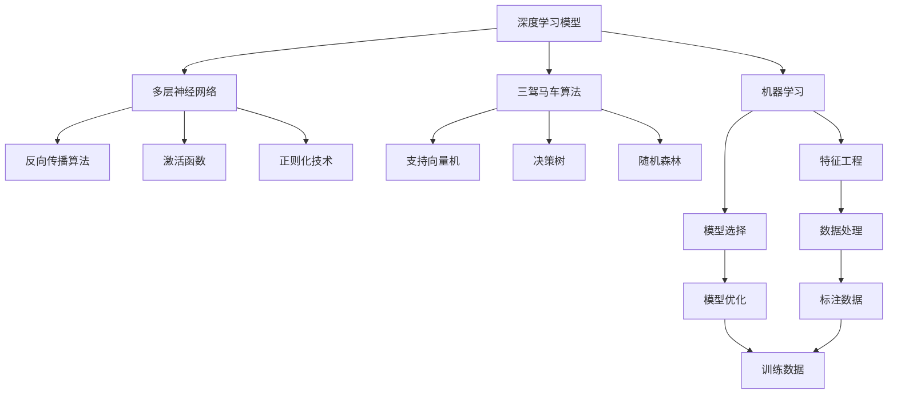
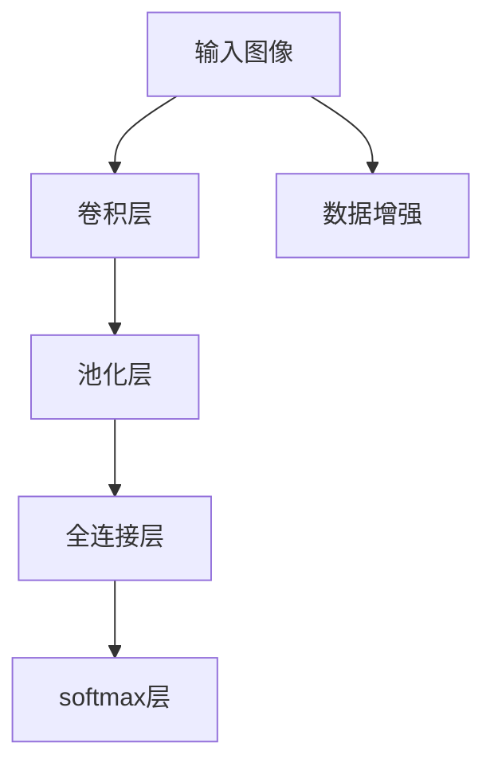

                 

## 1. 背景介绍

在过去的几十年里，人工智能(AI)领域经历了翻天覆地的变化，其技术从早期基于规则的专家系统，发展到了基于机器学习的智能模型。这些模型包括监督学习、无监督学习、强化学习等多种形式，而在这其中，三驾马车算法成为了引领AI发展的核心力量。

所谓三驾马车算法，指的是支持向量机(Support Vector Machine, SVM)、决策树(Decision Tree)和随机森林(Random Forest)。它们凭借在准确性、可解释性和效率等方面的优秀表现，广泛应用于机器学习和数据挖掘领域，几乎统治了整个20世纪90年代到2010年代的AI领域。

然而，随着深度学习技术的崛起，三驾马车算法逐渐失去了市场竞争力，逐渐被深度学习模型所取代。深度学习模型凭借其强大的表达能力、海量的数据需求和高效的计算性能，正在引领AI的新一轮革命。

## 2. 核心概念与联系

### 2.1 核心概念概述

深度学习模型以神经网络为核心，通过大量的训练数据和计算资源，可以自动学习和提取特征，从而实现复杂的分类、回归和生成任务。深度学习模型具有以下几个核心概念：

1. **多层神经网络**：深度学习模型的基础结构，可以自动提取输入数据的复杂特征表示。
2. **反向传播算法**：通过梯度下降等优化算法，自动更新模型参数，最小化损失函数，实现模型的训练。
3. **激活函数**：用于引入非线性因素，提升模型的表达能力。
4. **正则化技术**：防止模型过拟合，保持模型的泛化能力。

三驾马车算法则是基于传统的统计学习方法，通过特征工程和模型选择等手段，实现分类、回归和聚类等任务。这些算法主要包括：

1. **支持向量机**：通过寻找最优超平面，将数据分为不同类别。
2. **决策树**：通过决策树结构，自动选择特征，进行分类和回归。
3. **随机森林**：通过集成多个决策树，提升模型的鲁棒性和泛化能力。

这两种模型在方法论、应用场景和性能表现上有很大的不同。深度学习模型在处理复杂数据和任务上表现优异，但在解释性上存在不足；而三驾马车算法则强调模型的可解释性和结构简单性，但在处理复杂任务上表现一般。

### 2.2 核心概念间的关系

深度学习模型和三驾马车算法在概念和方法上有很大的区别，但也有一些相似之处。例如，两者都是基于数据驱动的统计学习方法，都需要大量标注数据进行训练，且在模型选择和优化方面也有相似之处。这些相似之处使得深度学习模型在三驾马车算法的基础上，进一步扩展和优化了机器学习的方法。

以下通过Mermaid流程图来展示深度学习模型和三驾马车算法之间的关系：



### 2.3 核心概念的整体架构

以下综合的流程图展示了深度学习模型和三驾马车算法的整体架构：


这个综合流程图展示了从机器学习到深度学习模型的演变过程。深度学习模型在三驾马车算法的基础上，通过引入多层神经网络、反向传播算法、激活函数和正则化技术，实现了更强的表达能力和更高效的训练过程，进一步推动了机器学习技术的发展。

## 3. 核心算法原理 & 具体操作步骤
### 3.1 算法原理概述

深度学习模型的核心思想是利用多层神经网络，自动学习和提取输入数据的复杂特征表示，从而实现复杂的分类、回归和生成任务。其训练过程通过反向传播算法，自动更新模型参数，最小化损失函数，实现模型的优化。

### 3.2 算法步骤详解

深度学习模型的训练过程主要包括以下几个步骤：

1. **数据准备**：收集和预处理训练数据，包括特征提取、数据增强、数据标准化等步骤。
2. **模型选择**：选择合适的神经网络结构，包括层数、神经元数量、激活函数等。
3. **模型训练**：通过反向传播算法，自动更新模型参数，最小化损失函数。
4. **模型评估**：在验证集或测试集上评估模型的性能，包括准确率、召回率、F1分数等指标。
5. **模型优化**：通过超参数调优、正则化技术等手段，进一步提升模型的性能。

### 3.3 算法优缺点

深度学习模型具有以下几个优点：

1. **强大表达能力**：多层神经网络可以自动学习和提取复杂特征，处理复杂数据和任务。
2. **高效训练**：通过反向传播算法，可以高效地更新模型参数，实现快速训练。
3. **泛化能力**：通过大规模数据训练，深度学习模型可以具有较好的泛化能力。

同时，深度学习模型也存在以下缺点：

1. **需要大量数据**：深度学习模型通常需要大规模的标注数据进行训练，数据获取成本较高。
2. **计算资源要求高**：深度学习模型的训练过程需要大量的计算资源，包括高性能计算设备和强大的GPU支持。
3. **可解释性差**：深度学习模型的决策过程通常缺乏可解释性，难以理解和调试。

### 3.4 算法应用领域

深度学习模型在多个领域都有广泛的应用，包括：

1. **计算机视觉**：如图像分类、物体检测、图像分割等任务。
2. **自然语言处理**：如文本分类、情感分析、机器翻译等任务。
3. **语音识别**：如语音识别、语音合成等任务。
4. **推荐系统**：如用户行为预测、商品推荐等任务。
5. **游戏AI**：如游戏策略优化、自动对战等任务。
6. **医疗诊断**：如医学图像分析、疾病预测等任务。

三驾马车算法也在多个领域得到应用，如支持向量机在分类和回归任务中表现优异，决策树和随机森林在特征选择和模型集成方面具有优势。

## 4. 数学模型和公式 & 详细讲解
### 4.1 数学模型构建

深度学习模型通常使用多层神经网络进行建模，其数学模型可以表示为：

$$
y = f(x; \theta)
$$

其中 $x$ 为输入数据， $y$ 为输出结果， $\theta$ 为模型参数。模型的训练过程是通过反向传播算法，自动更新模型参数，最小化损失函数：

$$
\min_{\theta} \mathcal{L}(y, f(x; \theta))
$$

其中 $\mathcal{L}$ 为损失函数，常用的损失函数包括交叉熵损失、均方误差损失等。

### 4.2 公式推导过程

以简单的二分类任务为例，假设模型的输出为概率值 $p$，损失函数为交叉熵损失，则其推导过程如下：

设 $y$ 为真实标签， $p$ 为模型预测的概率值，则交叉熵损失函数为：

$$
\mathcal{L}(p, y) = -y \log p - (1-y) \log (1-p)
$$

将其代入训练目标函数：

$$
\min_{\theta} \frac{1}{N} \sum_{i=1}^N \mathcal{L}(p_i, y_i)
$$

其中 $N$ 为样本数量， $p_i$ 和 $y_i$ 分别为第 $i$ 个样本的预测概率值和真实标签。

### 4.3 案例分析与讲解

以图像分类任务为例，假设使用卷积神经网络（CNN）模型，其结构如图：



模型的训练过程如下：

1. **数据准备**：收集和预处理图像数据，包括数据增强、标准化等步骤。
2. **模型选择**：选择卷积神经网络作为模型结构，设置卷积层、池化层和全连接层的数量和大小。
3. **模型训练**：通过反向传播算法，自动更新卷积层、全连接层和softmax层的权重和偏置，最小化交叉熵损失函数。
4. **模型评估**：在验证集或测试集上评估模型的性能，包括准确率、召回率、F1分数等指标。
5. **模型优化**：通过超参数调优、正则化技术等手段，进一步提升模型的性能。

## 5. 项目实践：代码实例和详细解释说明
### 5.1 开发环境搭建

在进行深度学习模型开发前，需要准备好开发环境。以下是使用Python进行TensorFlow开发的环境配置流程：

1. 安装Anaconda：从官网下载并安装Anaconda，用于创建独立的Python环境。

2. 创建并激活虚拟环境：
```bash
conda create -n tensorflow-env python=3.8 
conda activate tensorflow-env
```

3. 安装TensorFlow：根据CUDA版本，从官网获取对应的安装命令。例如：
```bash
conda install tensorflow -c tf
```

4. 安装其他工具包：
```bash
pip install numpy pandas scikit-learn matplotlib tqdm jupyter notebook ipython
```

完成上述步骤后，即可在`tensorflow-env`环境中开始深度学习模型开发。

### 5.2 源代码详细实现

下面我们以图像分类任务为例，给出使用TensorFlow实现卷积神经网络的代码实现。

首先，定义模型的数据处理函数：

```python
import tensorflow as tf
from tensorflow.keras.datasets import mnist
from tensorflow.keras.utils import to_categorical

(x_train, y_train), (x_test, y_test) = mnist.load_data()
x_train = x_train.reshape(-1, 28*28).astype('float32') / 255.0
x_test = x_test.reshape(-1, 28*28).astype('float32') / 255.0
y_train = to_categorical(y_train, 10)
y_test = to_categorical(y_test, 10)

train_dataset = tf.data.Dataset.from_tensor_slices((x_train, y_train))
train_dataset = train_dataset.shuffle(10000).batch(64).repeat()

test_dataset = tf.data.Dataset.from_tensor_slices((x_test, y_test))
test_dataset = test_dataset.batch(64)
```

然后，定义模型和优化器：

```python
from tensorflow.keras.models import Sequential
from tensorflow.keras.layers import Conv2D, MaxPooling2D, Flatten, Dense

model = Sequential([
    Conv2D(32, (3, 3), activation='relu', input_shape=(28, 28, 1)),
    MaxPooling2D((2, 2)),
    Conv2D(64, (3, 3), activation='relu'),
    MaxPooling2D((2, 2)),
    Flatten(),
    Dense(10, activation='softmax')
])

optimizer = tf.keras.optimizers.Adam(learning_rate=0.001)
```

接着，定义训练和评估函数：

```python
@tf.function
def train_step(images, labels):
    with tf.GradientTape() as tape:
        logits = model(images, training=True)
        loss = tf.losses.sparse_categorical_crossentropy(labels, logits)
    grads = tape.gradient(loss, model.trainable_variables)
    optimizer.apply_gradients(zip(grads, model.trainable_variables))

@tf.function
def evaluate_step(images, labels):
    logits = model(images, training=False)
    predictions = tf.argmax(logits, axis=1)
    accuracy = tf.metrics.accuracy(labels, predictions)
    return accuracy.numpy()[0]
```

最后，启动训练流程并在测试集上评估：

```python
epochs = 10

for epoch in range(epochs):
    epoch_loss = 0.0
    epoch_acc = 0.0
    for step, (images, labels) in enumerate(train_dataset):
        train_step(images, labels)
        epoch_loss += step_loss
        epoch_acc += step_acc

    test_acc = evaluate(test_dataset)

    print(f"Epoch {epoch+1}, loss={epoch_loss:.4f}, accuracy={epoch_acc:.4f}, test accuracy={test_acc:.4f}")
```

以上就是使用TensorFlow实现卷积神经网络模型并进行图像分类任务微调的完整代码实现。可以看到，TensorFlow提供了强大的计算图机制，使得深度学习模型的开发和训练变得简单高效。

### 5.3 代码解读与分析

让我们再详细解读一下关键代码的实现细节：

**数据处理函数**：
- `from_tensor_slices`方法：将输入数据和标签转换为TensorFlow的`Dataset`对象。
- `shuffle`方法：随机打乱数据，防止模型过拟合。
- `batch`方法：将数据分为多个batch，每个batch大小为64。
- `repeat`方法：重复数据集，使其可重复训练。

**模型定义函数**：
- `Sequential`方法：定义序列模型，自动排列模型层。
- `Conv2D`和`MaxPooling2D`方法：定义卷积层和池化层。
- `Flatten`方法：将卷积层的输出展平，输入全连接层。
- `Dense`方法：定义全连接层，输出10个节点的softmax层。

**训练和评估函数**：
- `train_step`方法：定义训练步骤，使用`GradientTape`自动求导。
- `evaluate_step`方法：定义评估步骤，使用`tf.argmax`获取预测结果，计算准确率。

**训练流程**：
- `epochs`变量：定义总训练轮数。
- `for`循环：遍历每个epoch。
- `step_loss`和`step_acc`变量：记录每个batch的损失和准确率。
- `print`方法：输出每个epoch的平均损失和准确率，以及测试集上的准确率。

可以看出，TensorFlow提供了强大的高层次API，使得深度学习模型的开发和训练变得非常简单和高效。通过这些API，开发者可以更加专注于模型设计和算法优化，而不必过多关注底层的实现细节。

## 6. 实际应用场景
### 6.1 计算机视觉

深度学习模型在计算机视觉领域具有广泛的应用，如图像分类、物体检测、图像分割等任务。以图像分类任务为例，使用卷积神经网络（CNN）模型可以自动提取图像的复杂特征表示，从而实现高精度的分类任务。

在实际应用中，深度学习模型可以用于自动驾驶、安防监控、医疗影像分析等多个领域。例如，在自动驾驶中，通过深度学习模型进行行人检测、车辆识别、交通信号分析等任务，可以显著提高驾驶安全性和效率。

### 6.2 自然语言处理

深度学习模型在自然语言处理领域也具有广泛的应用，如文本分类、情感分析、机器翻译等任务。以机器翻译为例，使用序列到序列（Seq2Seq）模型和注意力机制（Attention），可以实现高效的翻译任务。

在实际应用中，深度学习模型可以用于智能客服、智能问答、文本摘要等多个领域。例如，在智能客服中，通过深度学习模型对客户咨询进行语义理解和情感分析，可以自动回复常见问题，提高客户满意度。

### 6.3 语音识别

深度学习模型在语音识别领域具有广泛的应用，如语音识别、语音合成等任务。以语音识别为例，使用卷积神经网络（CNN）和循环神经网络（RNN）模型，可以实现高效的语音识别任务。

在实际应用中，深度学习模型可以用于智能家居、语音助手、医疗语音记录等多个领域。例如，在智能家居中，通过深度学习模型对语音指令进行识别，可以实现智能控制家电设备，提升用户的生活便利性。

## 7. 工具和资源推荐
### 7.1 学习资源推荐

为了帮助开发者系统掌握深度学习模型的理论基础和实践技巧，这里推荐一些优质的学习资源：

1. 《深度学习》（Ian Goodfellow、Yoshua Bengio和Aaron Courville合著）：深度学习领域的经典教材，涵盖了深度学习模型的基础、算法和应用等多个方面。
2. 《动手学深度学习》（李沐、施云、沈逸等著）：面向初学者的深度学习教材，提供了丰富的实例和代码，帮助读者快速上手实践。
3. 《深度学习入门》（斋藤康毅著）：一本面向日本读者的深度学习教材，通俗易懂，适合初学者入门。
4. Coursera深度学习课程（Andrew Ng主讲）：斯坦福大学开设的深度学习课程，提供了丰富的视频和作业，帮助读者系统掌握深度学习模型。
5. DeepLearning.AI深度学习课程（Andrew Ng主讲）：由深度学习领域的知名专家Andrew Ng开设的深度学习课程，涵盖深度学习模型的基础、算法和应用等多个方面。

通过对这些资源的学习实践，相信你一定能够快速掌握深度学习模型的精髓，并用于解决实际的AI问题。

### 7.2 开发工具推荐

高效的开发离不开优秀的工具支持。以下是几款用于深度学习模型开发的常用工具：

1. TensorFlow：由Google主导开发的深度学习框架，生产部署方便，适合大规模工程应用。
2. PyTorch：基于Python的开源深度学习框架，灵活动态，适合快速迭代研究。
3. Keras：一个高层次的深度学习API，支持TensorFlow、CNTK和Theano等多个深度学习框架。
4. Weights & Biases：模型训练的实验跟踪工具，可以记录和可视化模型训练过程中的各项指标，方便对比和调优。
5. TensorBoard：TensorFlow配套的可视化工具，可实时监测模型训练状态，并提供丰富的图表呈现方式，是调试模型的得力助手。
6. Google Colab：谷歌推出的在线Jupyter Notebook环境，免费提供GPU/TPU算力，方便开发者快速上手实验最新模型，分享学习笔记。

合理利用这些工具，可以显著提升深度学习模型的开发效率，加快创新迭代的步伐。

### 7.3 相关论文推荐

深度学习模型和相关技术的发展源于学界的持续研究。以下是几篇奠基性的相关论文，推荐阅读：

1. Deep Neural Networks for Image Recognition（AlexNet论文）：提出了深度神经网络在图像识别任务中的应用，开创了深度学习模型的时代。
2. ImageNet Classification with Deep Convolutional Neural Networks：提出了卷积神经网络（CNN）在图像分类任务中的应用，取得了当时最好的性能。
3. A Tutorial on Deep Learning：一篇综述论文，介绍了深度学习模型的基本概念和应用，是深度学习领域的经典教材。
4. Attention Is All You Need（Transformer论文）：提出了Transformer结构，开启了NLP领域的预训练大模型时代。
5. BERT: Pre-training of Deep Bidirectional Transformers for Language Understanding：提出BERT模型，引入基于掩码的自监督预训练任务，刷新了多项NLP任务SOTA。

这些论文代表了大模型和深度学习技术的发展脉络。通过学习这些前沿成果，可以帮助研究者把握学科前进方向，激发更多的创新灵感。

除上述资源外，还有一些值得关注的前沿资源，帮助开发者紧跟深度学习模型的最新进展，例如：

1. arXiv论文预印本：人工智能领域最新研究成果的发布平台，包括大量尚未发表的前沿工作，学习前沿技术的必读资源。
2. 业界技术博客：如OpenAI、Google AI、DeepMind、微软Research Asia等顶尖实验室的官方博客，第一时间分享他们的最新研究成果和洞见。
3. 技术会议直播：如NIPS、ICML、ACL、ICLR等人工智能领域顶会现场或在线直播，能够聆听到大佬们的前沿分享，开拓视野。
4. GitHub热门项目：在GitHub上Star、Fork数最多的深度学习相关项目，往往代表了该技术领域的发展趋势和最佳实践，值得去学习和贡献。
5. 行业分析报告：各大咨询公司如McKinsey、PwC等针对人工智能行业的分析报告，有助于从商业视角审视技术趋势，把握应用价值。

总之，对于深度学习模型的学习和实践，需要开发者保持开放的心态和持续学习的意愿。多关注前沿资讯，多动手实践，多思考总结，必将收获满满的成长收益。

## 8. 总结：未来发展趋势与挑战
### 8.1 总结

本文对深度学习模型和三驾马车算法进行了全面系统的介绍。首先阐述了深度学习模型和三驾马车算法的理论基础和核心概念，明确了它们在机器学习中的重要地位。其次，从原理到实践，详细讲解了深度学习模型的数学模型、公式推导和关键步骤，给出了深度学习模型开发的完整代码实例。同时，本文还广泛探讨了深度学习模型在计算机视觉、自然语言处理、语音识别等多个领域的应用前景，展示了深度学习模型的巨大潜力。此外，本文精选了深度学习模型的各类学习资源，力求为读者提供全方位的技术指引。

通过本文的系统梳理，可以看到，深度学习模型在三驾马车算法的基础上，进一步扩展和优化了机器学习的方法，实现了更强的表达能力和更高效的训练过程，从而引领了AI的新一轮革命。

### 8.2 未来发展趋势

展望未来，深度学习模型的发展将呈现以下几个趋势：

1. **模型规模持续增大**：随着算力成本的下降和数据规模的扩张，深度学习模型的参数量还将持续增长。超大规模语言模型蕴含的丰富语言知识，有望支撑更加复杂多变的下游任务。
2. **模型鲁棒性提升**：深度学习模型在面对域外数据时，泛化性能往往大打折扣。未来的模型将通过更加有效的正则化技术、对抗训练等手段，提升模型的鲁棒性和泛化能力。
3. **模型可解释性增强**：深度学习模型的决策过程通常缺乏可解释性，未来的模型将通过可解释性技术、知识蒸馏等手段，提升模型的可解释性和可解释性。
4. **跨模态融合增强**：深度学习模型在处理多种模态数据时，融合效果往往较差。未来的模型将通过多模态融合技术，实现视觉、语音、文本等多模态信息的协同建模。
5. **模型通用性增强**：深度学习模型在特定任务上的表现往往优于其他模型，但缺乏通用性。未来的模型将通过迁移学习、多任务学习等手段，提升模型的通用性和泛化能力。
6. **模型实时性增强**：深度学习模型通常需要大量计算资源和时间，未来的模型将通过模型压缩、优化器优化等手段，提升模型的实时性和计算效率。

这些趋势凸显了深度学习模型在机器学习和AI领域的巨大前景，也将推动深度学习模型向更加智能化、普适化方向发展。

### 8.3 面临的挑战

尽管深度学习模型已经取得了瞩目成就，但在迈向更加智能化、普适化应用的过程中，它仍面临着诸多挑战：

1. **数据需求高**：深度学习模型通常需要大规模的标注数据进行训练，数据获取成本较高。如何在数据需求高的情况下，实现高效数据获取和利用，将是重要的研究方向。
2. **计算资源要求高**：深度学习模型的训练过程需要大量的计算资源，包括高性能计算设备和强大的GPU支持。如何降低计算成本，提高计算效率，将是重要的优化方向。
3. **模型可解释性差**：深度学习模型的决策过程通常缺乏可解释性，难以理解和调试。如何提高模型的可解释性和可解释性，将是重要的研究方向。
4. **模型鲁棒性不足**：深度学习模型在面对域外数据时，泛化性能往往大打折扣。如何提高模型的鲁棒性和泛化能力，将是重要的研究方向。
5. **模型安全性不足**：深度学习模型在处理数据时，可能面临数据泄露、模型偏见等安全问题。如何提高模型的安全性，确保数据和模型的安全，将是重要的研究方向。
6. **模型公平性不足**：深度学习模型在处理数据时，可能存在数据偏见，导致模型输出不公平。如何提高模型的公平性和可解释性，将是重要的研究方向。

这些挑战凸显了深度学习模型在实际应用中的复杂性，也将推动深度学习模型向更加安全、可靠、可解释、可控的方向发展。

### 8.4 研究展望

面对深度学习模型面临的诸多挑战，未来的研究需要在以下几个方面寻求新的突破：

1. **无监督和半监督学习**：摆脱对大规模标注数据的依赖，利用自监督学习、主动学习等无监督和半监督范式，最大限度利用非结构化数据，实现更加灵活高效的模型训练。
2. **参数高效和计算高效**：开发更加参数高效的模型结构，通过模型压缩、优化器优化等手段，降低计算成本，提高计算效率，实现更加高效快速的模型训练。
3. **跨模态融合**：实现视觉、语音、文本等多模态信息的协同建模，提升模型的表达能力和泛化能力。
4. **可解释性增强**：引入可解释性技术、知识蒸馏等手段，提升模型的可解释性和可解释性，确保模型的透明度和可信度。
5. **模型公平性提升**：通过数据处理、模型设计等手段，提升模型的公平性和可解释性，确保模型的公平性和可靠性。
6. **安全性和隐私保护**：通过数据加密

