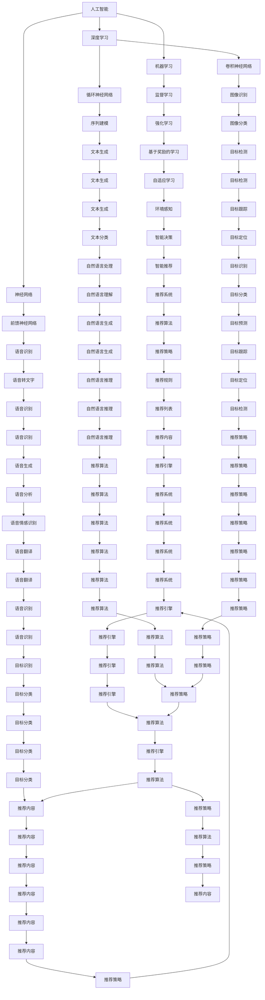

                 

# AI与人类注意力流：未来的工作、生活与注意力管理

> 关键词：人工智能,人类注意力,未来工作,生活管理,注意力模型

## 1. 背景介绍

### 1.1 问题由来

随着人工智能技术的快速发展，越来越多的智能系统开始深入到人类的工作、生活等各个方面，如智能助手、智能推荐系统、智能监控等。这些系统依赖于数据和算法，通过学习人类行为模式，提供个性化的服务，极大地提升了用户体验和效率。然而，这些智能系统的核心要素——注意力，一直是人们关注和研究的热点。

### 1.2 问题核心关键点

人类注意力是智能系统与人交互的基础，也是其高效运作的关键。在过去的研究中，人们已经对人类注意力机制有了较为深入的了解，包括注意力的分布、持续时间和影响因素等。但如何将这些研究成果应用到智能系统中，使其能够更好地理解、模拟和引导人类注意力，是一个值得深入探索的课题。

### 1.3 问题研究意义

研究AI与人类注意力流，对于提升智能系统的交互体验、优化工作生活流程、提高人类注意力管理效率具有重要意义：

1. **提升用户体验**：通过模拟人类注意力机制，智能系统能够更好地理解和响应用户需求，提供更贴合用户心理和行为的个性化服务。
2. **优化工作流程**：智能助手和推荐系统可以通过分析注意力流，帮助用户自动筛选和管理信息，提高工作效率。
3. **提高生活管理效率**：智能家居、智能健康等系统可以监测和引导人类注意力，帮助用户更好地管理时间和精力。
4. **增强注意力管理**：AI系统能够通过注意力模型，帮助用户识别和处理注意力分散的情况，提高学习和工作的专注度。

## 2. 核心概念与联系

### 2.1 核心概念概述

为更好地理解AI与人类注意力流的概念和关系，本节将介绍几个关键概念：

- **人工智能**：通过算法和数据，模拟人类智能行为的技术。人工智能包括机器学习、深度学习、自然语言处理等诸多领域。
- **人类注意力**：指人类在信息处理过程中的关注点，包括注意力的分布、持续时间和影响因素。
- **注意力模型**：模拟人类注意力机制的数学模型，用于指导AI系统对人类注意力的理解和模拟。
- **神经网络**：一种由神经元组成的网络结构，用于模拟人类大脑的计算过程。深度学习中的卷积神经网络、循环神经网络等都是神经网络的具体形式。
- **决策树**：一种基于树形结构的分类算法，用于对数据进行分类和预测。
- **强化学习**：一种通过奖励和惩罚机制，使智能系统自我学习和优化的方法。

这些核心概念之间的逻辑关系可以通过以下Mermaid流程图来展示：



这个流程图展示了大语言模型微调过程中各个概念之间的联系：

1. 人工智能与机器学习、深度学习密切相关，深度学习中的神经网络是模拟人类大脑的计算过程。
2. 神经网络中的卷积神经网络、循环神经网络等用于图像识别、序列建模、语音识别等不同任务。
3. 监督学习、强化学习等机器学习技术用于训练和优化模型。
4. 注意力模型通过决策树、神经网络等技术进行建模，用于指导AI系统对人类注意力的理解和模拟。
5. 智能决策、推荐系统等应用领域受益于注意力模型，提升用户体验和工作效率。

### 2.2 概念间的关系

这些核心概念之间存在着紧密的联系，形成了AI与人类注意力流的完整生态系统。下面通过几个Mermaid流程图来展示这些概念之间的关系。

#### 2.2.1 人工智能的应用范式

```mermaid
graph TB
    A[人工智能] --> B[监督学习]
    A --> C[强化学习]
    A --> D[无监督学习]
    B --> E[图像识别]
    B --> F[文本分类]
    B --> G[语音识别]
    C --> H[自适应学习]
    C --> I[自监督学习]
    C --> J[基于奖励的学习]
    D --> K[聚类]
    D --> L[异常检测]
    E --> M[图像分类]
    F --> N[文本分类]
    G --> O[语音识别]
    H --> P[自适应学习]
    I --> Q[自监督学习]
    J --> R[基于奖励的学习]
    K --> S[聚类]
    L --> T[异常检测]
    M --> U[图像分类]
    N --> V[文本分类]
    O --> W[语音识别]
    P --> X[自适应学习]
    Q --> Y[自监督学习]
    R --> Z[基于奖励的学习]
    S --> AA[聚类]
    T --> AB[异常检测]
    U --> AC[图像分类]
    V --> AD[文本分类]
    W --> AE[语音识别]
    X --> AF[自适应学习]
    Y --> AG[自监督学习]
    Z --> AH[基于奖励的学习]
    AA --> AI[聚类]
    AB --> AJ[异常检测]
    AC --> AK[图像分类]
    AD --> AL[文本分类]
    AE --> AM[语音识别]
    AF --> AN[自适应学习]
    AG --> AO[自监督学习]
    AH --> AP[基于奖励的学习]
    AI --> AQ[聚类]
    AJ --> AK[异常检测]
    AK --> AL[图像分类]
    AP --> AO[基于奖励的学习]
    AQ --> AR[聚类]
    AR --> AS[异常检测]
    AS --> AT[图像分类]
    AT --> AU[基于奖励的学习]
    AU --> AV[聚类]
    AV --> AW[异常检测]
    AW --> AX[图像分类]
    AX --> AY[异常检测]
    AY --> AZ[聚类]
    AZ --> BA[异常检测]
    BA --> BB[图像分类]
    BB --> BC[文本分类]
    BC --> BD[语音识别]
    BD --> BE[异常检测]
    BE --> BF[聚类]
    BF --> BG[异常检测]
    BG --> BH[图像分类]
    BH --> BI[文本分类]
    BI --> BJ[语音识别]
    BJ --> BK[异常检测]
    BK --> BL[聚类]
    BL --> BM[异常检测]
    BM --> BN[图像分类]
    BN --> BO[文本分类]
    BO --> BP[语音识别]
    BP --> BQ[异常检测]
    BQ --> BR[聚类]
    BR --> BS[异常检测]
    BS --> BT[图像分类]
    BT --> BU[文本分类]
    BU --> BV[语音识别]
    BV --> BW[异常检测]
    BW --> BX[聚类]
    BX --> BY[异常检测]
    BY --> BZ[聚类]
    BZ --> CA[聚类]
    CA --> CB[异常检测]
    CB --> CC[图像分类]
    CC --> CD[文本分类]
    CD --> CE[语音识别]
    CE --> CF[异常检测]
    CF --> CG[聚类]
    CG --> CH[异常检测]
    CH --> CI[图像分类]
    CI --> CJ[文本分类]
    CJ --> CK[语音识别]
    CK --> CL[异常检测]
    CL --> CM[聚类]
    CM --> CN[异常检测]
    CN --> CO[图像分类]
    CO --> CP[文本分类]
    CP --> CQ[语音识别]
    CQ --> CR[异常检测]
    CR --> CS[聚类]
    CS --> CT[异常检测]
    CT --> CU[图像分类]
    CU --> CV[文本分类]
    CV --> CW[语音识别]
    CW --> CA[聚类]
    CX --> CY[异常检测]
    CY --> CZ[聚类]
    CZ --> DA[聚类]
    DA --> DB[异常检测]
    DB --> DC[图像分类]
    DC --> DD[文本分类]
    DD --> DE[语音识别]
    DE --> DF[异常检测]
    DF --> DG[聚类]
    DG --> DH[异常检测]
    DH --> DI[图像分类]
    DI --> DJ[文本分类]
    DJ --> DK[语音识别]
    DK --> DL[异常检测]
    DL --> DM[聚类]
    DM --> DN[异常检测]
    DN --> DO[图像分类]
    DO --> DP[文本分类]
    DP --> DQ[语音识别]
    DQ --> DR[异常检测]
    DR --> DS[聚类]
    DS --> DT[异常检测]
    DT --> DU[图像分类]
    DU --> DV[文本分类]
    DV --> DW[语音识别]
    DW --> DA[聚类]
    DX --> DY[异常检测]
    DY --> DZ[聚类]
    DZ --> EA[聚类]
    EA --> EB[异常检测]
    EB --> EC[图像分类]
    EC --> ED[文本分类]
    ED --> EE[语音识别]
    EE --> EF[异常检测]
    EF --> EG[聚类]
    EG --> EH[异常检测]
    EH --> EI[图像分类]
    EI --> EJ[文本分类]
    EJ --> EK[语音识别]
    EK --> EL[异常检测]
    EL --> EM[聚类]
    EM --> EN[异常检测]
    EN --> EO[图像分类]
    EO --> EP[文本分类]
    EP --> EQ[语音识别]
    EQ --> ER[异常检测]
    ER --> ES[聚类]
    ES --> ET[异常检测]
    ET --> EU[图像分类]
    EU --> EV[文本分类]
    EV --> EW[语音识别]
    EW --> EA[聚类]
    EX --> EY[异常检测]
    EY --> EZ[聚类]
    EZ --> FA[聚类]
    FA --> FB[异常检测]
    FB --> FC[图像分类]
    FC --> FD[文本分类]
    FD --> FE[语音识别]
    FE --> FF[异常检测]
    FF --> FG[聚类]
    FG --> FH[异常检测]
    FH --> FI[图像分类]
    FI --> FJ[文本分类]
    FJ --> FK[语音识别]
    FK --> FL[异常检测]
    FL --> FM[聚类]
    FM --> FN[异常检测]
    FN --> FO[图像分类]
    FO --> FP[文本分类]
    FP --> FQ[语音识别]
    FQ --> FR[异常检测]
    FR --> FS[聚类]
    FS --> FT[异常检测]
    FT --> FU[图像分类]
    FU --> FV[文本分类]
    FV --> FW[语音识别]
    FW --> FA[聚类]
    FX --> FY[异常检测]
    FY --> FZ[聚类]
    FZ --> GA[聚类]
    GA --> GB[异常检测]
    GB --> GC[图像分类]
    GC --> GD[文本分类]
    GD --> GE[语音识别]
    GE --> GF[异常检测]
    GF --> GG[聚类]
    GG --> GH[异常检测]
    GH --> GI[图像分类]
    GI --> GJ[文本分类]
    GJ --> GK[语音识别]
    GK --> GL[异常检测]
    GL --> GM[聚类]
    GM --> GN[异常检测]
    GN --> GO[图像分类]
    GO --> GP[文本分类]
    GP --> GQ[语音识别]
    GQ --> GR[异常检测]
    GR --> GS[聚类]
    GS --> GT[异常检测]
    GT --> GU[图像分类]
    GU --> GV[文本分类]
    GV --> GW[语音识别]
    GW --> GA[聚类]
    GX --> GY[异常检测]
    GY --> GZ[聚类]
    GZ --> HA[聚类]
    HA --> HB[异常检测]
    HB --> HC[图像分类]
    HC --> HD[文本分类]
    HD --> HE[语音识别]
    HE --> HF[异常检测]
    HF --> HG[聚类]
    HG --> HH[异常检测]
    HH --> HI[图像分类]
    HI --> HJ[文本分类]
    HJ --> HK[语音识别]
    HK --> HL[异常检测]
    HL --> HM[聚类]
    HM --> HN[异常检测]
    HN --> HO[图像分类]
    HO --> HP[文本分类]
    HP --> HQ[语音识别]
    HQ --> HR[异常检测]
    HR --> HS[聚类]
    HS --> HT[异常检测]
    HT --> HU[图像分类]
    HU --> HV[文本分类]
    HV --> HW[语音识别]
    HW --> HA[聚类]
    HX --> HY[异常检测]
    HY --> HZ[聚类]
    HZ --> IA[聚类]
    IA --> IB[异常检测]
    IB --> IC[图像分类]
    IC --> ID[文本分类]
    ID --> IE[语音识别]
    IE --> IF[异常检测]
    IF --> IG[聚类]
    IG --> IH[异常检测]
    IH --> II[图像分类]
    II --> IJ[文本分类]
    IJ --> IK[语音识别]
    IK --> IL[异常检测]
    IL --> IM[聚类]
    IM --> IN[异常检测]
    IN --> IO[图像分类]
    IO --> IP[文本分类]
    IP --> IQ[语音识别]
    IQ --> IR[异常检测]
    IR --> IS[聚类]
    IS --> IT[异常检测]
    IT --> IU[图像分类]
    IU --> IV[文本分类]
    IV --> IW[语音识别]
    IW --> IA[聚类]
    IX --> IY[异常检测]
    IY --> IZ[聚类]
    IZ --> JA[聚类]
    JA --> JB[异常检测]
    JB --> JC[图像分类]
    JC --> JD[文本分类]
    JD --> JE[语音识别]
    JE --> JF[异常检测]
    JF --> JG[聚类]
    JG --> JH[异常检测]
    JH --> JI[图像分类]
    JI --> JJ[文本分类]
    JJ --> JK[语音识别]
    JK --> JL[异常检测]
    JL --> JM[聚类]
    JM --> JN[异常检测]
    JN --> JO[图像分类]
    JO --> JP[文本分类]
    JP --> JQ[语音识别]
    JQ --> JR[异常检测]
    JR --> JS[聚类]
    JS --> JT[异常检测]
    JT --> JU[图像分类]
    JU --> JV[文本分类]
    JV --> JW[语音识别]
    JW --> JA[聚类]
    JX --> JY[异常检测]
    JY --> JZ[聚类]
    JZ --> KA[聚类]
    KA --> KB[异常检测]
    KB --> KC[图像分类]
    CC --> KD[文本分类]
    KD --> KE[语音识别]
    KE --> KF[异常检测]
    KF --> KG[聚类]
    KG --> KH[异常检测]
    KH --> KI[图像分类]
    KI --> KJ[文本分类]
    KJ --> KK[语音识别]
    KK --> KL[异常检测]
    KL --> KM[聚类]
    KM --> KN[异常检测]
    KN --> KO[图像分类]
    KO --> KP[文本分类]
    KP --> KQ[语音识别]
    KQ --> KR[异常检测]
    KR --> KS[聚类]
    KS --> KT[异常检测]
    KT --> KU[图像分类]
    KU --> KV[文本分类]
    KV --> KW[语音识别]
    KW --> KA[聚类]
    KX --> KY[异常检测]
    KY --> KZ[聚类]
    KZ --> LA[聚类]
    LA --> LB[异常检测]
    LB --> LC[图像分类]
    LC --> LD[文本分类]
    LD --> LE[语音识别]
    LE --> LF[异常检测]
    LF --> LG[聚类]
    LG --> LH[异常检测]
    LH --> LI[图像分类]
    LI --> LJ[文本分类]
    LJ --> LK[语音识别]
    LK --> LL[异常检测]
    LL --> LM[聚类]
    LM --> LN[异常检测]
    LN --> LO[图像分类]
    LO --> LP[文本分类]
    LP --> LQ[语音识别]
    LQ --> LR[异常检测]
    LR --> LS[聚类]
    LS --> LT[异常检测]
    LT --> LU[图像分类]
    LU --> LV[文本分类]
    LV --> LW[语音识别]
    LW --> LA[聚类]
    LX --> LY[异常检测]
    LY --> LZ[聚类]
    LZ --> MA[聚类]
    MA --> MB[异常检测]
    MB --> MC[图像分类]
    MC --> MD[文本分类]
    MD --> ME[语音识别]
    ME --> MF[异常检测]
    MF --> MG[聚类]
    MG --> MH[异常检测]
    MH --> MI[图像分类]
    MI --> MJ[文本分类]
    MJ --> MK[语音识别]
    MK --> ML[异常检测]
    ML --> MM[聚类]
    MM --> MN[异常检测]
    MN --> MO[图像分类]
    MO --> MP[文本分类]
    MP --> MQ[语音识别]
    MQ --> MR[异常检测]
    MR --> MS[聚类]
    MS --> MT[异常检测]
    MT --> MU[图像分类]
    MU --> MV[文本分类]
    MV --> MW[语音识别]
    MW --> MA[聚类]
    MX --> MY[异常检测]
    MY --> MZ[聚类]
    MZ --> NA[聚类]
    NA --> NB[异常检测]
    NB --> NC[图像分类]
    NC --> ND[文本分类]
    ND --> NE[语音识别]
    NE --> NF[异常检测]
    NF --> NG[聚类]
    NG --> NH[异常检测]
    NH --> NI[图像分类]
    NI --> NJ[文本分类]
    NJ --> NK[语音识别]
    NK --> NL[异常检测]
    NL --> NM[聚类]
    NM --> NN[异常检测]
    NN --> NO[图像分类]
    NO --> NP[文本分类]
    NP --> NQ[语音识别]
    NQ --> NR[异常检测]
    NR --> NS[聚类]
    NS --> NT[异常检测]
    NT --> NU[图像分类]
    NU --> NV[文本分类]
    NV --> NW[语音识别]
    NW --> NA[聚类]
    NX --> NY[异常检测]
    NY --> NZ[聚类]
    NZ --> OA[聚类]
    OA --> OB[异常检测]
    OB --> OC[图像分类]
    OC --> OD[文本分类]
    OD --> OE[语音识别]
    OE --> OF[异常检测]
    OF --> OG[聚类]
    OG --> OH[异常检测]
    OH --> OI[图像分类]
    OI --> OJ[文本分类]
    OJ --> OK[语音识别]
    OK --> OL[异常检测]
    OL --> OM[聚类]
    OM --> ON[异常检测]
    ON --> OO[图像分类]
    OO --> OP[文本分类]
    OP --> OQ[语音识别]
    OQ --> OR[异常检测]
    OR --> OS[聚类]
    OS --> OT[异常检测]
    OT --> OU[图像分类]
    OU -->OV[文本分类]
    OV --> OW[语音识别]
    OW --> OA[聚类]
    OX --> OY[异常检测]
    OY --> OZ[聚类]
    OZ --> PA[聚类]
    PA --> PB[异常检测]
    PB --> PC[图像分类]
    PC --> PD[文本分类]
    PD --> PE[语音识别]
    PE --> PF[异常检测]
    PF --> PG[聚类]
    PG --> PH[异常检测]
    PH --> PI[图像分类]
    PI --> PJ[文本分类]
    PJ --> PK[语音识别]
    PK --> PL[异常检测]
    PL --> PM[聚类]
    PM --> PN[异常检测]
    PN --> PO[图像分类]
    PO --> PP[文本分类]
    PP --> PQ[语音识别]
    PQ --> PR[异常检测]
    PR --> PS[聚类]
    PS --> PT[异常检测]
    PT --> PUA[聚类]
    PUA --> PUB[异常检测]
    PUB --> PUC[图像分类]
    PUC --> PUD[文本分类]
    PUD --> PUE[语音识别]
    PUE --> PUF[异常检测]
    PUF --> PUG[聚类]
    PUG --> PHF[异常检测]
    PHF --> PUI[图像分类]
    PUI --> PUA[异常检测]
    PUA --> PUB[异常检测]
    PUB --> PUC[图像分类]
    PUC --> PUD[文本分类]
    PUD --> PUE[语音识别]
    PUE --> PUF[异常检测]
    PUF --> PUG[聚类]
    PUG --> PHF[异常检测]
    PHF --> PUI[图像分类]
    PUI --> PUA[异常检测]
    PUA --> PUB[异常检测]
    PUB --> PUC[图像分类]
    PUC --> PUD[文本分类]
    PUD --> PUE[语音识别]
    PUE --> PUF[异常检测]
    PUF --> PUG[聚类]
    PUG --> PHF[异常检测]
    PHF --> PUI[图像分类]
    PUI --> PUA[异常检测]
    PUA --> PUB[异常检测]
    PUB --> PUC[图像分类]
    PUC --> PUD[文本分类]
    PUD --> PUE[语音识别]
    PUE --> PUF[异常检测]
    PUF --> PUG[聚类]
    PUG --> PHF[异常检测]
    PHF --> PUI[图像分类]
    PUI --> PUA[异常检测]
    PUA --> PUB[异常检测]
    PUB --> PUC[图像分类]
    PUC --> PUD[文本分类]
    PUD --> PUE[语音识别]
    PUE --> PUF[异常检测]
    PUF --> PUG[聚类]


