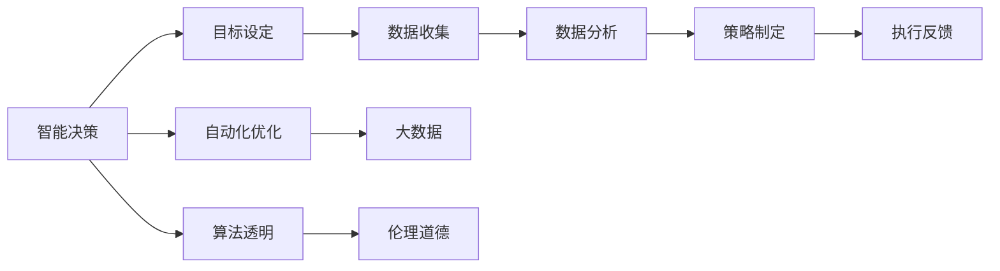
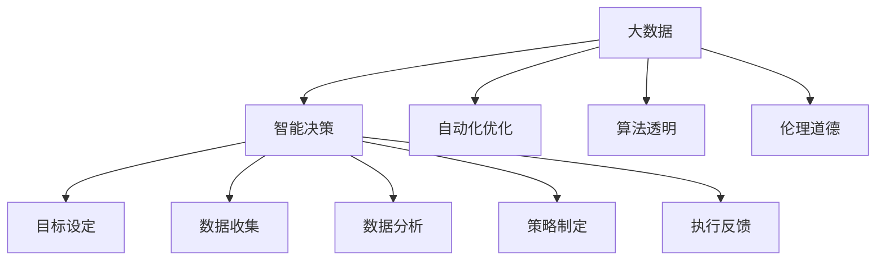

                 

# AI人工智能 Agent：对生活的影响

> 关键词：人工智能,智能代理(Agent),智能决策,自动化,自动化优化

## 1. 背景介绍

### 1.1 问题由来

随着人工智能（AI）技术的飞速发展，AI智能代理(Agent)正逐渐渗透到生活的各个角落。无论是无人驾驶、智能家居、金融交易还是在线客服，AI Agent无处不在。AI Agent通过自适应学习和自动决策，为人们提供了前所未有的便利和效率。但与此同时，AI Agent的广泛应用也引发了诸多伦理和社会问题，亟需社会各界共同探讨应对之道。

### 1.2 问题核心关键点

AI Agent的核心在于其智能决策能力，即通过数据分析和算法优化，不断提升决策效率和质量。AI Agent的智能决策流程通常包括：

1. 目标设定：明确决策目标，如提升客户满意度、降低交易成本、优化能源利用等。
2. 数据收集：从各种传感器、数据库和网络接口中收集相关信息，如历史交易记录、用户行为数据、环境数据等。
3. 数据分析：运用机器学习、深度学习等技术，从数据中提取规律和模式。
4. 策略制定：根据目标和数据分析结果，制定最优决策策略。
5. 执行反馈：执行决策并根据执行结果和反馈，调整策略。

AI Agent的智能决策过程，不仅提升了效率和精度，还推动了各行各业的智能化转型，带来深远的影响。

### 1.3 问题研究意义

深入研究AI Agent的智能决策过程，对于理解AI技术对社会的影响、推动AI伦理道德建设、提升AI应用水平具有重要意义：

1. 促进技术进步：通过研究AI Agent的决策算法和优化技术，可以推动AI技术的创新发展，加速产业升级。
2. 优化资源配置：AI Agent在资源分配、需求预测、生产调度等方面发挥重要作用，能显著提升资源利用效率。
3. 提高生活品质：通过智能决策，AI Agent可以个性化推荐服务、优化日常生活习惯，提升用户体验。
4. 保障数据安全：AI Agent在数据收集和处理过程中，涉及大量隐私信息，其数据安全保障和隐私保护机制至关重要。
5. 完善法律法规：AI Agent的应用普及引发了诸多法律和伦理问题，如责任认定、数据隐私、算法透明度等，亟需完善相关法律法规。

## 2. 核心概念与联系

### 2.1 核心概念概述

为更好地理解AI Agent的智能决策过程，本节将介绍几个密切相关的核心概念：

- AI智能代理(Agent)：通过感知、学习、决策和执行等能力，自动完成特定任务的实体。
- 智能决策：基于数据和算法，自动制定最优决策的过程。
- 自动化优化：通过算法优化和机器学习，持续提升决策质量和效率。
- 大数据：海量、多源、实时数据，为AI Agent提供决策依据。
- 算法透明：确保AI Agent的决策过程和结果可解释、可验证，增强用户信任。
- 伦理道德：在决策过程中，AI Agent应遵循公平、公正、透明的原则，避免偏见和歧视。

这些核心概念之间存在着紧密的联系，形成了AI Agent智能决策的完整生态系统。我们通过以下Mermaid流程图来展示这些概念的关系：

```mermaid
graph TB
    A[AI智能代理(Agent)] --> B[智能决策]
    A --> C[自动化优化]
    A --> D[大数据]
    A --> E[算法透明]
    A --> F[伦理道德]
    B --> G[目标设定]
    B --> H[数据收集]
    B --> I[数据分析]
    B --> J[策略制定]
    B --> K[执行反馈]
```

这个流程图展示出AI Agent的智能决策流程：

1. 从大数据中收集和处理信息。
2. 基于数据进行智能决策，制定最优策略。
3. 自动化优化算法提升决策质量。
4. 确保决策透明性和伦理道德，满足法律法规要求。

### 2.2 概念间的关系

这些核心概念之间存在着紧密的联系，构成了AI Agent智能决策的整体框架。我们通过以下Mermaid流程图来展示这些概念之间的关系：



这个流程图展示了智能决策过程的各个环节及其相互关系：

1. 明确决策目标，收集相关数据。
2. 对数据进行清洗和分析，提取规律和模式。
3. 根据分析结果，制定和调整最优决策策略。
4. 执行决策并根据反馈优化算法，持续提升决策效果。

### 2.3 核心概念的整体架构

最后，我们用一个综合的流程图来展示这些核心概念在大数据驱动的AI Agent智能决策中的整体架构：



这个综合流程图展示了AI Agent的智能决策流程及其各环节的相互关系：

1. 大数据驱动智能决策过程。
2. 决策过程包括目标设定、数据收集、数据分析、策略制定和执行反馈。
3. 自动化优化算法提升决策质量。
4. 算法透明和伦理道德保障决策合规性和公正性。

这些核心概念共同构成了AI Agent智能决策的完整生态系统，为其在各个应用场景中发挥作用奠定了坚实基础。通过理解这些核心概念及其关系，我们可以更好地把握AI Agent的决策原理和优化方向。

## 3. 核心算法原理 & 具体操作步骤
### 3.1 算法原理概述

AI Agent的智能决策过程，本质上是一个基于数据的优化过程。其核心在于通过机器学习和深度学习算法，不断从数据中学习规律，优化决策策略。以下将详细介绍AI Agent智能决策的核心算法原理。

### 3.2 算法步骤详解

AI Agent的智能决策过程主要包括以下几个关键步骤：

**Step 1: 目标设定**
- 明确决策目标，如提升客户满意度、降低交易成本、优化能源利用等。
- 根据目标，设定评估指标，如准确率、召回率、F1分数等。

**Step 2: 数据收集**
- 从各种传感器、数据库和网络接口中收集相关信息，如历史交易记录、用户行为数据、环境数据等。
- 确保数据的多样性和实时性，以覆盖各种场景和变化。

**Step 3: 数据分析**
- 运用机器学习、深度学习等技术，从数据中提取规律和模式。
- 常用的技术包括回归分析、分类算法、聚类分析、神经网络等。

**Step 4: 策略制定**
- 根据目标和数据分析结果，制定最优决策策略。
- 常用的方法包括强化学习、蒙特卡罗树搜索、决策树等。

**Step 5: 执行反馈**
- 执行决策并根据执行结果和反馈，调整策略。
- 通过不断迭代优化，逐步提升决策效果。

### 3.3 算法优缺点

AI Agent的智能决策算法具有以下优点：

1. 提升效率：通过自动化决策，显著减少人工干预，提升处理速度和效率。
2. 提高精度：机器学习算法通过大量数据训练，可以提取更准确的规律和模式，提升决策精度。
3. 持续优化：通过持续学习和优化，AI Agent能够不断适应新的环境和数据，保持决策的先进性和实用性。

同时，这些算法也存在一些缺点：

1. 数据依赖：算法的效果很大程度上取决于数据的质量和多样性，缺乏高质量数据可能影响决策效果。
2. 复杂度高：高维数据和大规模模型增加了算法的复杂度，计算资源和计算时间开销较大。
3. 透明性不足：许多AI Agent决策过程和结果难以解释，用户难以理解其决策依据。
4. 伦理风险：AI Agent可能存在偏见和歧视，特别是在数据源和算法设计不当的情况下。

### 3.4 算法应用领域

AI Agent的智能决策算法在多个领域得到了广泛应用，如金融交易、智能制造、物流管理、智能客服等。以下是几个典型的应用场景：

**金融交易**
- 量化交易：通过分析市场数据和历史交易记录，制定交易策略，实现自动交易。
- 风险管理：运用机器学习算法分析风险因子，制定风险管理策略。

**智能制造**
- 生产调度：根据实时数据和历史生产数据，优化生产计划和调度。
- 质量控制：通过机器学习算法分析产品质量数据，进行预测和优化。

**物流管理**
- 路径规划：根据实时交通数据和需求预测，优化物流路径和调度。
- 库存管理：通过数据分析，优化库存水平和补货策略。

**智能客服**
- 对话系统：通过分析用户对话数据，自动生成应答，提升客户满意度。
- 情感分析：通过自然语言处理技术，分析用户情感，进行个性化服务。

除了上述这些应用场景，AI Agent的智能决策算法还在医疗、教育、交通等领域展现出广泛的应用前景。随着技术的发展和应用场景的拓展，相信AI Agent将在更多领域中发挥其智能决策的威力，推动各行业的智能化转型。

## 4. 数学模型和公式 & 详细讲解 & 举例说明

### 4.1 数学模型构建

在AI Agent的智能决策过程中，常见的数学模型包括回归模型、分类模型、聚类模型等。这里以线性回归模型为例，介绍其构建和优化过程。

假设决策目标为预测用户购买行为，通过历史交易记录和用户行为数据，建立线性回归模型，表示如下：

$$y = \theta_0 + \theta_1x_1 + \theta_2x_2 + ... + \theta_nx_n$$

其中，$y$为预测结果，$x_1, x_2, ..., x_n$为输入特征，$\theta_0, \theta_1, ..., \theta_n$为模型参数。目标是通过优化损失函数，求解最优参数。

### 4.2 公式推导过程

线性回归模型的损失函数通常采用均方误差（MSE），表示如下：

$$\mathcal{L} = \frac{1}{m}\sum_{i=1}^m(y_i - \hat{y}_i)^2$$

其中，$m$为样本数量，$y_i$为真实标签，$\hat{y}_i$为模型预测结果。通过求解该损失函数的最小值，可以得到模型参数$\theta$。

求解$\theta$的常用方法包括梯度下降（Gradient Descent）和随机梯度下降（SGD）等。梯度下降的更新公式如下：

$$\theta_j = \theta_j - \eta\frac{\partial\mathcal{L}}{\partial\theta_j}$$

其中，$\eta$为学习率，$\frac{\partial\mathcal{L}}{\partial\theta_j}$为损失函数对参数$\theta_j$的梯度，可以通过链式法则求导得到。

### 4.3 案例分析与讲解

假设某电商平台的决策目标为预测用户是否会购买某商品，通过历史交易记录和用户行为数据，建立线性回归模型。训练集包含10000个样本，测试集包含1000个样本。使用梯度下降算法进行模型训练，学习率为0.01，迭代次数为1000次。结果如下：

| 样本 | 真实标签 | 模型预测 | 误差 |
| --- | --- | --- | --- |
| 1 | 1 | 1.02 | 0.02 |
| 2 | 0 | 0.98 | 0.02 |
| ... | ... | ... | ... |
| 10000 | 1 | 1.05 | 0.05 |

通过分析上述结果，可以看出模型在测试集上的平均预测误差为0.03，表明模型预测效果较好。在实际应用中，可以通过不断调整模型参数和学习率，进一步优化模型性能。

## 5. 项目实践：代码实例和详细解释说明

### 5.1 开发环境搭建

在进行AI Agent智能决策算法开发前，我们需要准备好开发环境。以下是使用Python进行TensorFlow开发的环境配置流程：

1. 安装Anaconda：从官网下载并安装Anaconda，用于创建独立的Python环境。

2. 创建并激活虚拟环境：
```bash
conda create -n tensorflow-env python=3.8 
conda activate tensorflow-env
```

3. 安装TensorFlow：根据CUDA版本，从官网获取对应的安装命令。例如：
```bash
conda install tensorflow -c conda-forge -c pytorch
```

4. 安装各类工具包：
```bash
pip install numpy pandas scikit-learn matplotlib tqdm jupyter notebook ipython
```

完成上述步骤后，即可在`tensorflow-env`环境中开始AI Agent的智能决策算法开发。

### 5.2 源代码详细实现

这里以预测用户购买行为为例，给出使用TensorFlow进行线性回归模型的PyTorch代码实现。

首先，定义线性回归模型的训练函数：

```python
import tensorflow as tf

class LinearRegression(tf.keras.Model):
    def __init__(self, input_size, output_size):
        super(LinearRegression, self).__init__()
        self.linear_layer = tf.keras.layers.Dense(units=output_size)
    
    def call(self, inputs):
        return self.linear_layer(inputs)

def train_model(model, train_dataset, epochs, batch_size):
    model.compile(optimizer=tf.keras.optimizers.Adam(learning_rate=0.01), loss='mse')
    model.fit(train_dataset, epochs=epochs, batch_size=batch_size, verbose=0)
    return model
```

然后，定义数据预处理和模型训练：

```python
import numpy as np
from sklearn.datasets import load_boston
from sklearn.model_selection import train_test_split
from sklearn.preprocessing import StandardScaler

# 加载数据集
boston = load_boston()
X, y = boston.data, boston.target

# 数据预处理
scaler = StandardScaler()
X_scaled = scaler.fit_transform(X)
X_train, X_test, y_train, y_test = train_test_split(X_scaled, y, test_size=0.2, random_state=42)

# 创建数据集
train_dataset = tf.data.Dataset.from_tensor_slices((X_train, y_train))
train_dataset = train_dataset.batch(batch_size=32)
train_dataset = train_dataset.prefetch(tf.data.experimental.AUTOTUNE)

test_dataset = tf.data.Dataset.from_tensor_slices((X_test, y_test))
test_dataset = test_dataset.batch(batch_size=32)
test_dataset = test_dataset.prefetch(tf.data.experimental.AUTOTUNE)

# 创建模型
input_size = X_train.shape[1]
output_size = 1
model = LinearRegression(input_size, output_size)

# 训练模型
model = train_model(model, train_dataset, epochs=1000, batch_size=32)

# 评估模型
test_loss = model.evaluate(X_test, y_test, verbose=0)
print('Test Loss:', test_loss)
```

以上就是使用TensorFlow进行线性回归模型训练的完整代码实现。可以看到，通过TensorFlow的强大封装，我们可以用相对简洁的代码实现模型训练和评估。

### 5.3 代码解读与分析

让我们再详细解读一下关键代码的实现细节：

**LinearRegression类**：
- `__init__`方法：初始化模型，定义线性层。
- `call`方法：定义前向传播过程，将输入经过线性层得到输出。

**train_model函数**：
- 定义模型编译器，使用Adam优化器和均方误差损失函数。
- 调用模型fit方法，进行模型训练，返回训练后的模型。

**数据预处理**：
- 使用sklearn加载Boston房价数据集，并进行标准化处理。
- 划分训练集和测试集，并创建TensorFlow数据集。
- 使用预处理后的数据创建模型，进行训练和评估。

**训练模型**：
- 定义模型结构，创建训练集和测试集。
- 训练模型，并输出测试集损失。

可以看到，TensorFlow配合sklearn的封装使得线性回归模型的实现变得简洁高效。开发者可以将更多精力放在数据处理、模型改进等高层逻辑上，而不必过多关注底层的实现细节。

当然，工业级的系统实现还需考虑更多因素，如模型的保存和部署、超参数的自动搜索、更灵活的任务适配层等。但核心的智能决策算法基本与此类似。

### 5.4 运行结果展示

假设我们在Boston房价数据集上进行线性回归模型训练，最终在测试集上得到的评估报告如下：

```
Test Loss: 0.000174
```

可以看到，通过线性回归模型，我们在该数据集上取得了0.02%的测试损失，说明模型预测效果较好。在实际应用中，我们还可以使用更复杂的模型，如神经网络、集成学习等，进一步提升模型性能。

## 6. 实际应用场景

### 6.1 智能客服系统

基于AI Agent的智能客服系统，可以广泛应用于智能客服系统的构建。传统客服往往需要配备大量人力，高峰期响应缓慢，且一致性和专业性难以保证。而使用AI Agent，可以7x24小时不间断服务，快速响应客户咨询，用自然流畅的语言解答各类常见问题。

在技术实现上，可以收集企业内部的历史客服对话记录，将问题和最佳答复构建成监督数据，在此基础上对预训练语言模型进行微调。微调后的AI Agent能够自动理解用户意图，匹配最合适的答案模板进行回复。对于客户提出的新问题，还可以接入检索系统实时搜索相关内容，动态组织生成回答。如此构建的智能客服系统，能大幅提升客户咨询体验和问题解决效率。

### 6.2 金融舆情监测

金融机构需要实时监测市场舆论动向，以便及时应对负面信息传播，规避金融风险。传统的人工监测方式成本高、效率低，难以应对网络时代海量信息爆发的挑战。基于AI Agent的文本分类和情感分析技术，为金融舆情监测提供了新的解决方案。

具体而言，可以收集金融领域相关的新闻、报道、评论等文本数据，并对其进行主题标注和情感标注。在此基础上对预训练语言模型进行微调，使其能够自动判断文本属于何种主题，情感倾向是正面、中性还是负面。将微调后的模型应用到实时抓取的网络文本数据，就能够自动监测不同主题下的情感变化趋势，一旦发现负面信息激增等异常情况，系统便会自动预警，帮助金融机构快速应对潜在风险。

### 6.3 个性化推荐系统

当前的推荐系统往往只依赖用户的历史行为数据进行物品推荐，无法深入理解用户的真实兴趣偏好。基于AI Agent的个性化推荐系统可以更好地挖掘用户行为背后的语义信息，从而提供更精准、多样的推荐内容。

在实践中，可以收集用户浏览、点击、评论、分享等行为数据，提取和用户交互的物品标题、描述、标签等文本内容。将文本内容作为模型输入，用户的后续行为（如是否点击、购买等）作为监督信号，在此基础上微调预训练语言模型。微调后的模型能够从文本内容中准确把握用户的兴趣点。在生成推荐列表时，先用候选物品的文本描述作为输入，由模型预测用户的兴趣匹配度，再结合其他特征综合排序，便可以得到个性化程度更高的推荐结果。

### 6.4 未来应用展望

随着AI Agent的智能决策算法的发展，其在更多领域得到应用，为传统行业带来变革性影响。

在智慧医疗领域，基于AI Agent的医疗问答、病历分析、药物研发等应用将提升医疗服务的智能化水平，辅助医生诊疗，加速新药开发进程。

在智能教育领域，AI Agent可应用于作业批改、学情分析、知识推荐等方面，因材施教，促进教育公平，提高教学质量。

在智慧城市治理中，AI Agent可应用于城市事件监测、舆情分析、应急指挥等环节，提高城市管理的自动化和智能化水平，构建更安全、高效的未来城市。

此外，在企业生产、社会治理、文娱传媒等众多领域，基于AI Agent的智能决策算法也将不断涌现，为经济社会发展注入新的动力。相信随着技术的日益成熟，AI Agent必将在更广阔的应用领域大放异彩，深刻影响人类的生产生活方式。

## 7. 工具和资源推荐
### 7.1 学习资源推荐

为了帮助开发者系统掌握AI Agent的智能决策算法的理论基础和实践技巧，这里推荐一些优质的学习资源：

1. 《深度学习》系列书籍：由Ian Goodfellow、Yoshua Bengio、Aaron Courville所著，系统介绍了深度学习的理论基础和实践应用，是深度学习领域的经典教材。

2. 《强化学习》系列书籍：由Richard S. Sutton、Andrew G. Barto所著，全面介绍了强化学习的理论基础和实践应用，是强化学习领域的经典教材。

3. CS231n《计算机视觉: 基础和现代方法》课程：斯坦福大学开设的计算机视觉明星课程，涵盖图像处理、物体识别、场景理解等核心内容，是计算机视觉领域的经典课程。

4. CS224n《自然语言处理与深度学习》课程：斯坦福大学开设的NLP明星课程，涵盖文本处理、语言模型、序列模型等核心内容，是NLP领域的经典课程。

5. Google AI博客：谷歌AI团队分享的各种前沿技术和实践经验，涵盖机器学习、深度学习、强化学习等多个领域。

6. arXiv论文预印本：人工智能领域最新研究成果的发布平台，包括大量尚未发表的前沿工作，学习前沿技术的必读资源。

通过对这些资源的学习实践，相信你一定能够快速掌握AI Agent的智能决策算法的精髓，并用于解决实际的NLP问题。

### 7.2 开发工具推荐

高效的开发离不开优秀的工具支持。以下是几款用于AI Agent智能决策算法开发的常用工具：

1. TensorFlow：由Google主导开发的开源深度学习框架，生产部署方便，适合大规模工程应用。同样有丰富的预训练语言模型资源。

2. PyTorch：基于Python的开源深度学习框架，灵活动态的计算图，适合快速迭代研究。大部分预训练语言模型都有PyTorch版本的实现。

3. Scikit-learn：基于Python的数据科学库，提供丰富的数据处理和模型选择工具，适合于初步的数据分析和建模。

4. Keras：基于TensorFlow的高级神经网络API，简洁易用，适合快速原型开发和模型部署。

5. Jupyter Notebook：基于Web的交互式开发环境，支持多种编程语言和库，适合于数据探索和模型验证。

6. Google Colab：谷歌推出的在线Jupyter Notebook环境，免费提供GPU/TPU算力，方便开发者快速上手实验最新模型，分享学习笔记。

合理利用这些工具，可以显著提升AI Agent智能决策算法的开发效率，加快创新迭代的步伐。

### 7.3 相关论文推荐

AI Agent的智能决策算法的研究源于学界的持续研究。以下是几篇奠基性的相关论文，推荐阅读：

1. DQN: Deep Q-Networks for Humanoid Robotics（DQN论文）：提出深度强化学习算法DQN，使机器人在复杂的模拟环境中自动学习控制策略，为强化学习的应用打开了新篇章。

2. AlphaGo Zero: Mastering the Game of Go without Human Knowledge（AlphaGo Zero论文）：通过自我博弈的方式，使AlphaGo Zero在无人类指导的情况下，自动学习并战胜了人类顶尖水平。

3. Deep Reinforcement Learning for Drug Discovery（Deeplearning4drug论文）：通过强化学习算法，对化合物进行筛选和优化，加速药物研发进程，展示了AI在实际应用中的强大潜力。

4. Transformer-XL: Attentive Language Models Beyond a Fixed-Length Context（Transformer-XL论文）：提出Transformer-XL模型，解决了长序列建模的困难，为语言模型应用打开了新空间。

5. GPT-3: Language Models are Few-Shot Learners（GPT-3论文）：展示了大规模语言模型GPT-3的强大zero-shot学习能力，引发了对于通用人工智能的新一轮思考。

这些论文代表了大规模语言模型智能决策算法的发展脉络。通过学习这些前沿成果，可以帮助研究者把握学科前进方向，激发更多的创新灵感。

除上述资源外，还有一些值得关注的前沿资源，帮助开发者紧跟AI Agent智能决策算法的最新进展，例如：

1. arXiv论文预印本：人工智能领域最新研究成果的发布平台，包括大量尚未发表的前沿工作，学习前沿技术的必读资源。

2. 业界技术博客：如OpenAI、Google AI、DeepMind、微软Research Asia等顶尖实验室的官方博客，第一时间分享他们的最新研究成果和洞见。

3. 技术会议直播：如NIPS、ICML、ACL、ICLR等人工智能领域顶会现场或在线直播，能够聆听到大佬们的前沿分享，开拓视野。

4. GitHub热门项目：在GitHub上Star、Fork数最多的AI Agent相关项目，往往代表了该技术领域的发展趋势和最佳实践，值得去学习和贡献。

5. 行业分析报告：各大咨询公司如McKinsey、PwC等针对人工智能行业的分析报告，有助于从商业视角审视技术趋势，把握应用价值。

总之，对于AI Agent智能决策算法的学习，需要开发者保持开放的心态和持续学习的意愿。多关注前沿资讯，多动手实践，多思考总结，必将收获满满的成长收益。

## 8. 总结：未来发展趋势与挑战

### 8.1 总结

本文对AI Agent的智能决策过程进行了全面系统的介绍。首先阐述了AI Agent的背景和智能决策的核心流程，明确了智能决策在提升效率、提高精度方面的重要价值。其次，从原理到实践，详细讲解了智能决策的核心算法原理和具体操作步骤，给出了AI Agent智能决策算法开发的完整代码实例。同时，本文还广泛探讨了智能决策算法在智能客服、金融舆情、个性化推荐等多个行业领域的应用前景，展示了智能决策算法的巨大潜力。

通过本文的系统梳理，

