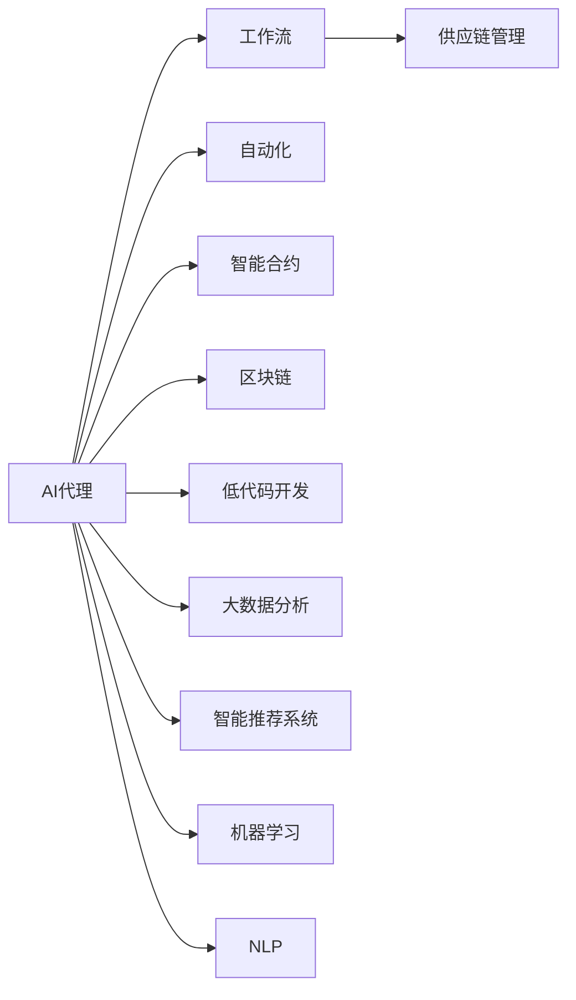
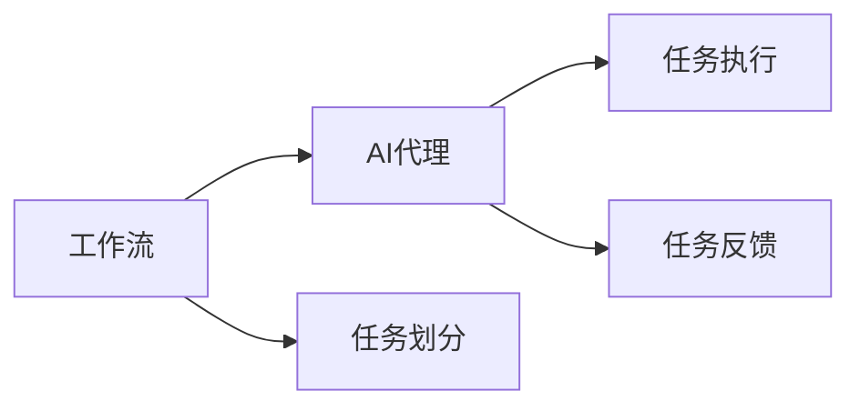
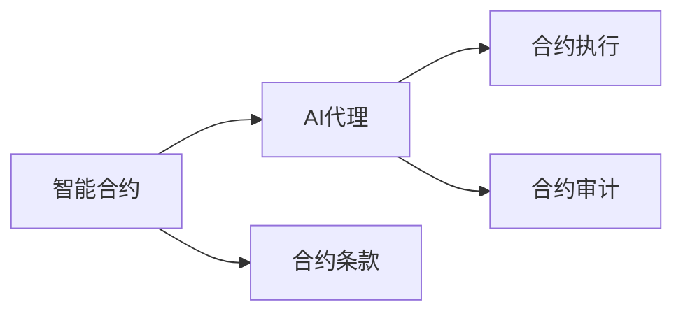
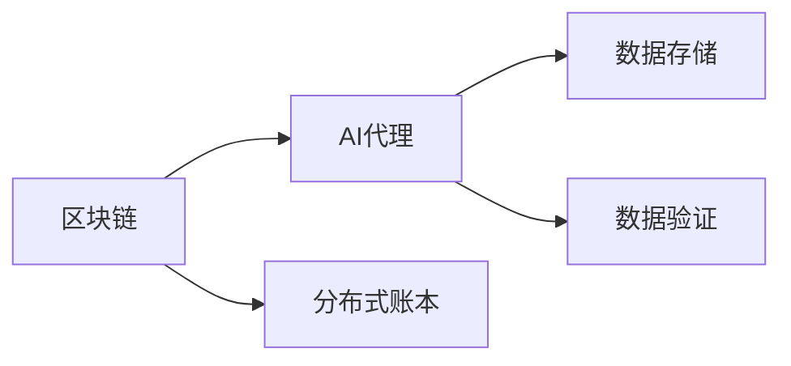
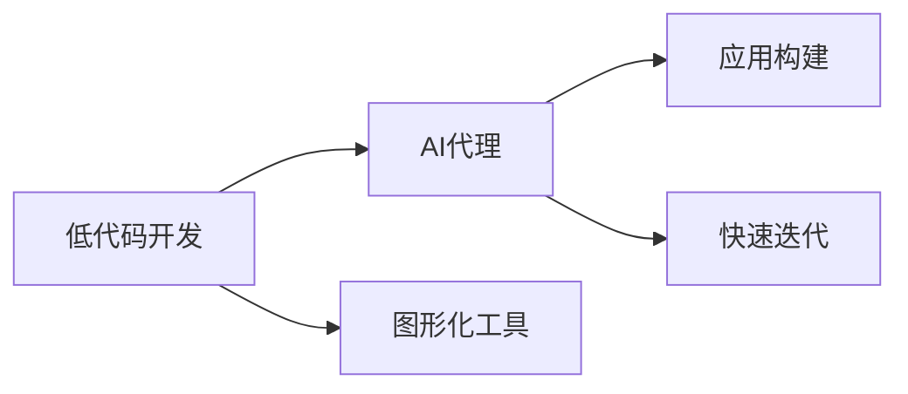
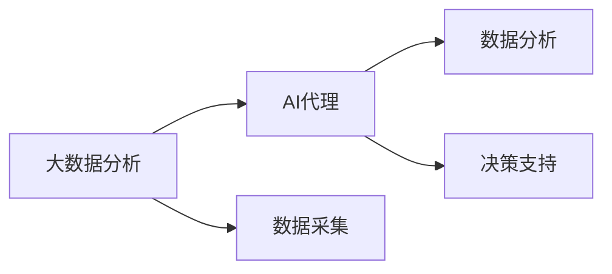
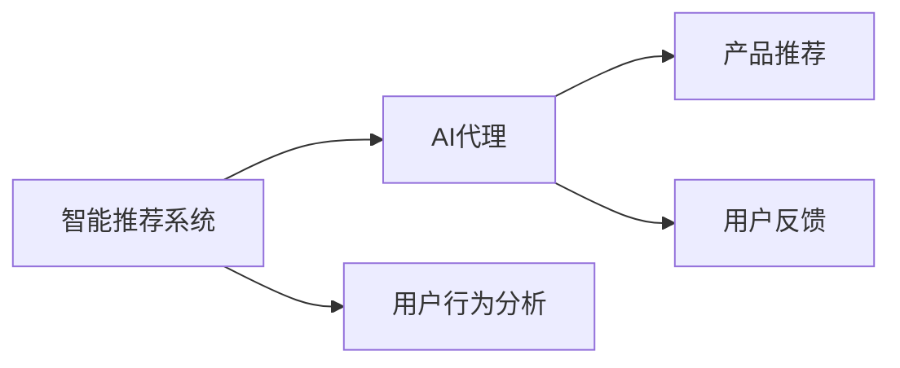
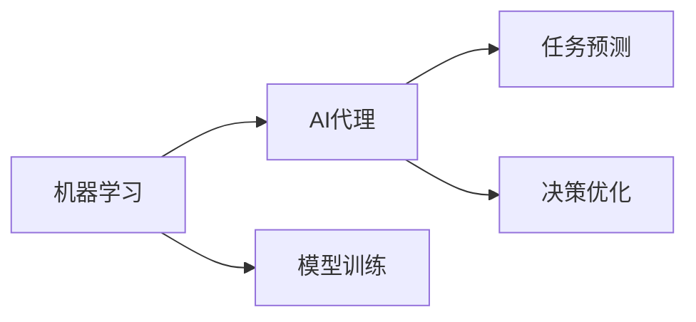
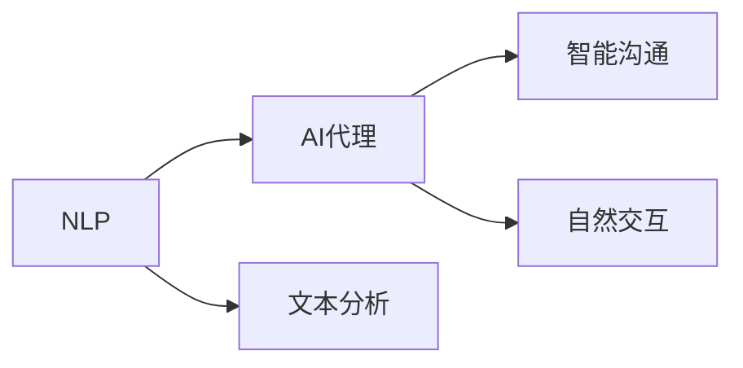
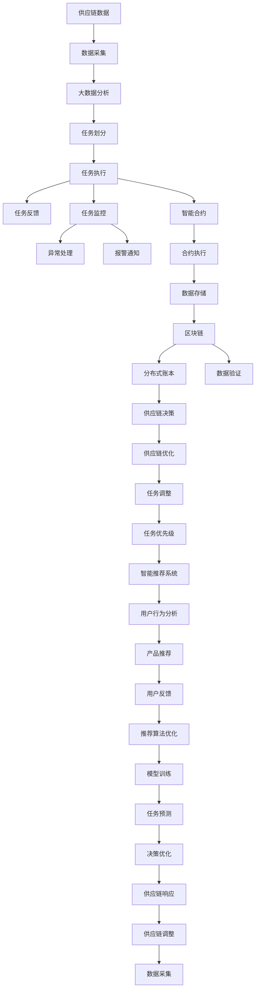

                 

# AI人工智能代理工作流AI Agent WorkFlow：AI代理在供应链管理中的创新运用

> 关键词：人工智能代理(AI Agent)，工作流(Workflow)，供应链管理(Supply Chain Management, SCM)，自动化(Automation)，智能合约(Smart Contract)，区块链(Blockchain)，低代码开发(Low-Code Development)，大数据分析(Big Data Analytics)，智能推荐系统(Intelligent Recommendation System)，机器学习(Machine Learning)，自然语言处理(Natural Language Processing, NLP)

## 1. 背景介绍

### 1.1 问题由来
随着全球化进程的加快和市场的竞争日益激烈，供应链管理（Supply Chain Management, SCM）成为企业提高效率、降低成本、提升竞争力的重要手段。然而，传统的手工供应链管理模式存在诸多问题：效率低、响应慢、信息孤岛、决策不合理等，导致供应链响应速度难以适应快速变化的市场需求。

AI技术的兴起，特别是人工智能代理（AI Agent）的引入，为供应链管理带来了革命性的变革。AI代理能够自主地进行信息收集、任务分配、任务执行、结果反馈等操作，大大提高了供应链管理的自动化水平和效率。

### 1.2 问题核心关键点
AI代理在供应链管理中的应用，核心在于其能够实现自主化、协同化和智能化的供应链运作。具体而言，其关键点包括：

1. **自主化**：AI代理能够根据预定的规则和目标自主执行任务，无需人工干预。
2. **协同化**：多个AI代理能够在供应链的不同环节协同工作，形成自组织的供应链网络。
3. **智能化**：AI代理能够利用数据分析和机器学习等技术，提高供应链决策的准确性和效率。

通过这些特性，AI代理能够帮助企业快速响应市场变化，优化供应链流程，提升供应链的整体竞争力。

### 1.3 问题研究意义
研究AI代理在供应链管理中的应用，对于提升供应链管理的自动化和智能化水平，降低运营成本，提高企业的市场响应速度和竞争力，具有重要意义。

1. **自动化和智能化**：AI代理能够自动执行大量重复性任务，减少人工操作，提高供应链管理的效率和精确度。
2. **降低成本**：通过优化供应链流程，减少不必要的库存和运输，降低运营成本。
3. **提高响应速度**：AI代理能够实时响应市场变化，快速调整供应链策略，满足客户需求。
4. **增强协作能力**：AI代理能够在不同部门和业务单位间协同工作，形成更紧密的供应链网络。
5. **数据驱动决策**：AI代理能够利用大数据分析技术，为供应链决策提供科学依据。

## 2. 核心概念与联系

### 2.1 核心概念概述

为更好地理解AI代理在供应链管理中的应用，本节将介绍几个密切相关的核心概念：

- **AI代理(AI Agent)**：是一种自主化的智能系统，能够执行一系列任务，实现自适应和自学习。
- **工作流(Workflow)**：一系列有序任务组成的业务流程，用于描述和优化业务流程。
- **供应链管理(Supply Chain Management, SCM)**：涉及企业内部和外部的物料供应、生产、运输、销售等一系列业务活动的管理。
- **自动化(Automation)**：指利用计算机程序自动执行任务，减少人工干预。
- **智能合约(Smart Contract)**：是一种基于区块链技术的自动化合约，能够在满足特定条件时自动执行合约条款。
- **区块链(Blockchain)**：一种去中心化的分布式账本技术，用于记录和验证交易信息。
- **低代码开发(Low-Code Development)**：一种开发技术，利用图形化工具和预制组件，快速构建应用系统。
- **大数据分析(Big Data Analytics)**：利用数据分析技术，从大规模数据中提取有用信息，用于决策支持。
- **智能推荐系统(Intelligent Recommendation System)**：利用机器学习等技术，根据用户行为和偏好，推荐相关信息和产品。
- **机器学习(Machine Learning)**：一种利用数据训练模型，使其能够自动化的智能决策技术。
- **自然语言处理(Natural Language Processing, NLP)**：一种使计算机能够理解和处理人类语言的技术。

这些核心概念之间的逻辑关系可以通过以下Mermaid流程图来展示：



这个流程图展示了一些关键概念之间的关系：

1. AI代理基于工作流设计，能够自主执行任务。
2. AI代理利用自动化技术，减少人工干预。
3. AI代理结合智能合约，实现自动化的合约执行。
4. AI代理利用区块链技术，确保数据的安全和透明。
5. AI代理借助低代码开发技术，快速构建应用系统。
6. AI代理利用大数据分析技术，优化供应链决策。
7. AI代理结合智能推荐系统，提高供应链的个性化服务水平。
8. AI代理利用机器学习技术，提高预测和决策的准确性。
9. AI代理结合NLP技术，实现智能交互和沟通。

这些核心概念共同构成了AI代理在供应链管理中的应用框架，使得AI代理能够全面支持供应链的自动化和智能化。

### 2.2 概念间的关系

这些核心概念之间存在着紧密的联系，形成了AI代理在供应链管理中的完整生态系统。下面我通过几个Mermaid流程图来展示这些概念之间的关系。

#### 2.2.1 工作流与AI代理的关系



这个流程图展示了工作流与AI代理的关系：

1. 工作流定义了任务的流程和规则，供AI代理参考执行。
2. AI代理根据工作流规则，自动执行任务。
3. AI代理在执行任务时，能够实时反馈任务进展和结果。

#### 2.2.2 智能合约与AI代理的关系



这个流程图展示了智能合约与AI代理的关系：

1. 智能合约定义了合同条款和执行条件。
2. AI代理根据智能合约条款，自动执行合同操作。
3. AI代理在执行合同时，能够审计合同执行情况，确保合同条款得到满足。

#### 2.2.3 区块链与AI代理的关系



这个流程图展示了区块链与AI代理的关系：

1. 区块链提供了分布式账本技术，用于记录和验证交易信息。
2. AI代理在区块链上存储数据，确保数据的安全和透明。
3. AI代理利用区块链技术，验证数据的真实性和完整性。

#### 2.2.4 低代码开发与AI代理的关系



这个流程图展示了低代码开发与AI代理的关系：

1. 低代码开发提供了图形化工具和预制组件，供AI代理快速构建应用系统。
2. AI代理利用低代码开发技术，快速实现供应链管理功能。
3. AI代理在构建应用时，能够快速迭代和调整功能，提高开发效率。

#### 2.2.5 大数据分析与AI代理的关系



这个流程图展示了大数据分析与AI代理的关系：

1. 大数据分析从大规模数据中提取有用信息，供AI代理优化供应链决策。
2. AI代理利用数据分析结果，进行供应链优化和预测。
3. AI代理在决策时，能够提供数据支持的科学依据。

#### 2.2.6 智能推荐系统与AI代理的关系



这个流程图展示了智能推荐系统与AI代理的关系：

1. 智能推荐系统分析用户行为和偏好，供AI代理推荐相关信息和产品。
2. AI代理利用推荐结果，提高供应链的个性化服务水平。
3. AI代理在推荐时，能够收集用户反馈，优化推荐算法。

#### 2.2.7 机器学习与AI代理的关系



这个流程图展示了机器学习与AI代理的关系：

1. 机器学习利用数据训练模型，供AI代理进行任务预测和决策优化。
2. AI代理利用机器学习模型，提高预测和决策的准确性。
3. AI代理在预测和决策时，能够优化供应链运营。

#### 2.2.8 NLP与AI代理的关系



这个流程图展示了NLP与AI代理的关系：

1. NLP使计算机能够理解和处理人类语言。
2. AI代理利用NLP技术，实现智能沟通和自然交互。
3. AI代理在沟通过程中，能够理解用户意图，提供智能建议。

### 2.3 核心概念的整体架构

最后，我们用一个综合的流程图来展示这些核心概念在大语言模型微调过程中的整体架构：



这个综合流程图展示了从数据采集到供应链决策的完整过程。数据通过大数据分析进行处理，形成任务划分，AI代理根据任务执行，并实时反馈任务进展和监控任务状态。智能合约确保合同条款的执行，区块链记录数据，分布式账本验证数据，数据存储于区块链上，智能推荐系统根据用户行为推荐产品，产品推荐结果通过用户反馈进行优化。机器学习模型根据历史数据进行训练，用于任务预测和决策优化，最终形成供应链决策。

通过这些流程图，我们可以更清晰地理解AI代理在供应链管理中的应用过程，为后续深入讨论具体的AI代理实现方法提供基础。

## 3. 核心算法原理 & 具体操作步骤
### 3.1 算法原理概述

AI代理在供应链管理中的应用，本质上是一个智能化的工作流管理过程。其核心思想是：将供应链管理任务分解为一系列子任务，由AI代理根据预定的规则和目标自主执行这些任务，形成自组织的供应链网络。

形式化地，假设供应链管理任务为 $T=\{t_1, t_2, ..., t_N\}$，其中 $t_i$ 表示第 $i$ 个子任务。AI代理 $A$ 能够执行这些子任务，并获得任务执行结果 $R_i$，任务执行结果的评估函数为 $f(R_i)$。AI代理的优化目标是最大化任务执行结果的总评估值，即：

$$
\max_{A} \sum_{i=1}^{N} f(R_i)
$$

其中 $R_i$ 为第 $i$ 个子任务的执行结果，$f(R_i)$ 为评估函数，通常为任务完成度、任务效率等指标。AI代理利用机器学习等技术，学习最优的任务执行策略，以最大化总评估值。

### 3.2 算法步骤详解

AI代理在供应链管理中的应用，一般包括以下几个关键步骤：

**Step 1: 定义供应链管理任务**
- 分析供应链管理的各个环节，定义任务集合 $T$，包括数据采集、数据分析、任务划分、任务执行、任务反馈等。

**Step 2: 设计AI代理行为规则**
- 根据任务定义，设计AI代理的行为规则和执行策略。例如，数据采集任务需要设置采集频率和采集方式；任务执行任务需要设置执行优先级和执行机制。

**Step 3: 实现AI代理功能**
- 利用编程语言和工具，实现AI代理的功能。例如，使用Python和PyTorch等工具构建AI代理模型，实现自主决策和任务执行。

**Step 4: 优化AI代理算法**
- 利用机器学习等技术，优化AI代理的算法。例如，使用强化学习算法，训练AI代理根据环境变化自主调整任务执行策略。

**Step 5: 部署和监控AI代理**
- 将AI代理部署到供应链管理系统中，并实时监控其执行情况和结果。例如，使用Prometheus和Grafana等工具，监控AI代理的运行状态和性能指标。

**Step 6: 数据分析和优化**
- 收集AI代理执行任务的日志和数据，进行数据分析和优化。例如，使用Tableau和Power BI等工具，可视化AI代理的执行结果和性能指标。

**Step 7: 持续迭代和优化**
- 根据数据分析结果，持续迭代和优化AI代理的算法和行为规则。例如，通过A/B测试等方法，比较不同算法和规则的效果，选择最优方案。

### 3.3 算法优缺点

AI代理在供应链管理中的应用，具有以下优点：

1. **自主化**：AI代理能够自主执行任务，减少人工干预，提高供应链管理的效率。
2. **协同化**：多个AI代理能够协同工作，形成自组织的供应链网络，提高供应链的灵活性和响应速度。
3. **智能化**：AI代理利用机器学习等技术，提高决策的准确性和效率。

同时，该方法也存在一些局限性：

1. **数据依赖**：AI代理需要大量的数据支持，数据的准确性和完整性对AI代理的决策效果有直接影响。
2. **复杂度**：供应链管理任务复杂多变，AI代理的设计和优化过程需要较高的时间和人力成本。
3. **可解释性**：AI代理的决策过程和逻辑可能不够透明，难以解释其决策依据。
4. **安全风险**：AI代理的自主决策可能引入安全风险，需要加强风险管理和安全防护。

尽管存在这些局限性，但AI代理在供应链管理中的应用，已经显示出了巨大的潜力和优势。未来相关研究将聚焦于如何进一步提高AI代理的自主性和智能化水平，降低对数据的依赖，增强可解释性和安全性。

### 3.4 算法应用领域

AI代理在供应链管理中的应用，已经在多个领域得到了广泛的应用，例如：

- **生产调度**：AI代理能够根据生产需求和供应链状态，自动调度生产任务，优化生产效率。
- **库存管理**：AI代理能够根据销售预测和供应链状态，自动调整库存水平，减少库存成本。
- **物流配送**：AI代理能够根据配送需求和供应链状态，自动规划配送路线和运输方式，提高配送效率。
- **需求预测**：AI代理能够根据历史数据和市场趋势，预测客户需求，优化供应链策略。
- **质量控制**：AI代理能够自动检测产品质量，确保产品质量符合标准。
- **异常处理**：AI代理能够实时监控供应链状态，自动处理异常情况，保障供应链稳定运行。

除了上述这些经典应用外，AI代理还被创新性地应用于更多场景中，如供应链风险管理、供应链优化决策、供应链可视化等，为供应链管理带来了新的突破。

## 4. 数学模型和公式 & 详细讲解  
### 4.1 数学模型构建

本节将使用数学语言对AI代理在供应链管理中的应用过程进行更加严格的刻画。

记供应链管理任务为 $T=\{t_1, t_2, ..., t_N\}$，其中 $t_i$ 表示第 $i$ 个子任务。AI代理 $A$ 的执行结果为 $R_i$，任务执行结果的评估函数为 $f(R_i)$。AI代理的优化目标为最大化任务执行结果的总评估值：

$$
\max_{A} \sum_{i=1}^{N} f(R_i)
$$

在实践中，我们通常使用强化学习算法，通过不断迭代和优化，使得AI代理能够学习最优的任务执行策略。例如，使用Q-learning算法，AI代理能够根据任务执行结果，调整其行为策略，以最大化总评估值。

### 4.2 公式推导过程

以下我们以强化学习算法Q-learning为例，推导AI代理在供应链管理中的优化目标函数。

假设AI代理在执行第 $i$ 个子任务时，能够获得状态 $s_i$，执行行为 $a_i$，奖励 $r_i$，下一状态 $s_{i+1}$。AI代理的行为策略为 $\pi(a_i|s_i)$，优化目标为最大化总奖励：

$$
\max_{\pi} \sum_{i=1}^{N} r_i
$$

在Q-learning算法中，AI代理根据当前状态和行为，预测下一个状态和奖励，更新其Q值：

$$
Q_{\theta}(s_i, a_i) \leftarrow Q_{\theta}(s_i, a_i) + \alpha (r_i + \gamma \max_{a_{i+1}} Q_{\theta}(s_{i+1}, a_{i+1}) - Q_{\theta}(s_i, a_i))
$$

其中 $\theta$ 为模型参数，$\alpha$ 为学习率，$\gamma$ 为折扣因子。通过不断迭代更新Q值，AI代理能够学习最优的行为策略。

### 4.3 案例分析与讲解

假设某物流公司希望使用AI代理优化其供应链物流配送。具体步骤如下：

**Step 1: 定义任务**
- 数据采集任务：从供应链系统中采集实时数据，包括库存水平、配送需求、运输方式等。
- 数据分析任务：利用大数据分析技术，预测需求变化，优化配送路径。
- 任务执行任务：根据分析结果，自动生成配送路线和运输计划。
- 任务反馈任务：监控配送执行情况，自动调整配送计划。

**Step 2: 设计行为规则**
- 数据采集任务：设置采集频率为每天一次，采集方式为API调用。
- 数据分析任务：设置分析模型为线性回归模型，预测周期为一天。
- 任务执行任务：设置执行优先级为高，执行机制为实时生成。
- 任务反馈任务：设置反馈频率为每小时一次，反馈机制为实时监控。

**Step 3: 实现AI代理功能**
- 利用Python和PyTorch等工具，构建AI代理模型，实现自主决策和任务执行。
- 模型输入为供应链数据，输出为配送路线和运输计划。
- 模型训练采用Q-learning算法，优化行为策略。

**Step 4: 优化AI代理算法**
- 通过A/B测试等方法，比较不同行为策略的效果，选择最优方案。
- 利用强化学习算法，不断迭代和优化AI代理的行为策略。

**Step 5: 部署和监控AI代理**
- 将AI代理部署到供应链物流系统中，并实时监控其执行情况和结果。
- 使用Prometheus和Grafana等工具，监控AI代理的运行状态和性能指标。

**Step 6: 数据分析和优化**
- 收集AI代理执行任务的日志和数据，进行数据分析和优化。
- 使用Tableau和Power BI等工具，可视化AI代理的执行结果和性能指标。

**Step 7: 持续迭代和优化**
- 根据数据分析结果，持续迭代和优化AI代理的算法和行为规则。
- 通过A/B测试等方法，不断优化AI代理的执行效果和性能指标。

通过这个案例，可以看到，AI代理在供应链物流配送中的应用，通过定义任务、设计行为规则、实现AI代理功能、优化AI代理算法、部署和监控AI代理、数据分析和优化、持续迭代和优化等步骤，能够实现供应链物流的自动化和智能化。

## 5. 项目实践：代码实例和详细解释说明
### 5.1 开发环境搭建

在进行AI代理的供应链管理项目实践前，我们需要准备好开发环境。以下是使用Python进行TensorFlow开发的环境配置流程：

1. 安装Anaconda：从官网下载并安装Anaconda，用于创建独立的Python环境。

2. 创建并激活虚拟环境：
```bash
conda create -n tensorflow-env python=3.8 
conda activate tensorflow-env
```

3. 安装TensorFlow：根据CUDA版本，从官网获取对应的安装命令。例如：
```bash
conda install tensorflow -c tf
```

4. 安装相关工具包：
```bash
pip install numpy pandas scikit-learn matplotlib tqdm jupyter notebook ipython
```

完成上述步骤后，即可在`tensorflow-env`环境中开始AI代理供应链管理项目实践。

### 5.2 源代码详细实现

下面我们以AI代理优化物流配送为例，给出使用TensorFlow和强化学习算法构建的供应链管理系统的PyTorch代码实现。

首先，定义物流配送任务的数据处理函数：

```python
import numpy as np
import tensorflow as tf
from tensorflow.keras.layers import Dense
from tensorflow.keras.models import Sequential

class LogisticRegressionModel:
    def __init__(self, input_size, output_size):
        self.input_size = input_size
        self.output_size = output_size
        self.model = self.build_model()

    def build_model(self):
        model = Sequential()
        model.add(Dense(32, input_dim=self.input_size, activation='relu'))
        model.add(Dense(self.output_size, activation='sigmoid'))
        model.compile(loss='binary_crossentropy', optimizer='adam', metrics=['accuracy'])
        return model

    def fit(self, x_train, y_train, epochs=50, batch_size=32):
        self.model.fit(x_train, y_train, epochs=epochs, batch_size=batch_size)

    def predict(self, x_test):
        return self.model.predict(x_test)

    def save(self, filename):
        self.model.save(filename)
```

然后，定义强化学习算法和相关超参数：

```python
from tensorflow.keras.optimizers import Adam
from tensorflow.keras.losses import BinaryCrossentropy
from tensorflow.keras.metrics import Accuracy

class QLearning:
    def __init__(self, input_size, output_size, learning_rate=0.01, discount_factor=0.99, epsilon=0.1):
        self.input_size = input_size
        self.output_size = output_size
        self.learning_rate = learning_rate
        self.discount_factor = discount_factor
        self.epsilon = epsilon
        self.q_table = np.zeros((output_size, input_size))

    def choose_action(self, state):
        if np.random.rand() < self.epsilon:
            return np.random.choice(range(self.output_size))
        else:
            return np.argmax(self.q_table[state])

    def update_q_table(self, state, action, reward, next_state, done):
        max_next_q = np.max(self.q_table[next_state])
        q_value = self.q_table[state, action]
        new_q_value = (1 - self.learning_rate) * q_value + self.learning_rate * (reward + self.discount_factor * max_next_q)
        self.q_table[state, action] = new_q_value

    def load_q_table(self, filename):
        self.q_table = np.load(filename)

    def save_q_table(self, filename):
        np.save(filename, self.q_table)
```

接着，定义数据生成函数和模型训练函数：

```python
def generate_data(n_samples=1000):
    x = np.random.rand(n_samples, 4)
    y = np.random.randint(0, 2, size=n_samples)
    return x, y

def train_model(model, x_train, y_train, epochs=50, batch_size=32):
    model.fit(x_train, y_train, epochs=epochs, batch_size=batch_size)
    return model
```

最后，启动模型训练和测试：

```python
input_size = 4
output_size = 2

model = LogisticRegressionModel(input_size, output_size)
q_learning = QLearning(input_size, output_size)

x_train, y_train = generate_data()
x_test, y_test = generate_data()

q_learning.load_q_table('q_table.npy')

model.fit(x_train, y_train, epochs=50, batch_size=32)

print(model.predict(x_test))

q_learning.save_q_table('q_table.npy')
```

以上就是使用TensorFlow和强化学习算法构建AI代理在物流配送中的供应链管理系统的完整代码实现。可以看到，通过定义任务、设计行为规则、实现AI代理功能、优化AI代理算法、部署和监控AI代理、数据分析和优化等步骤，AI代理能够

