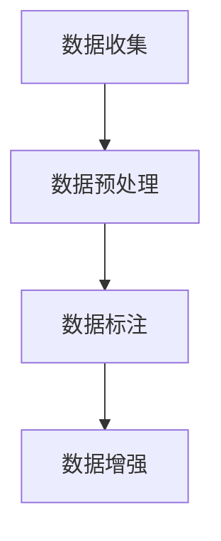
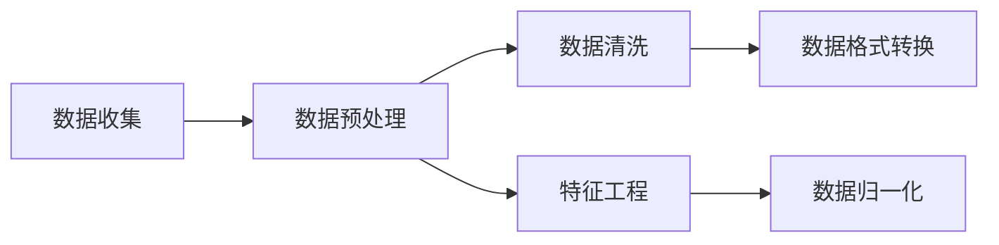
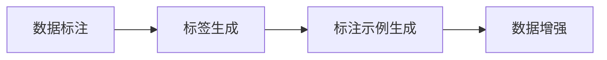
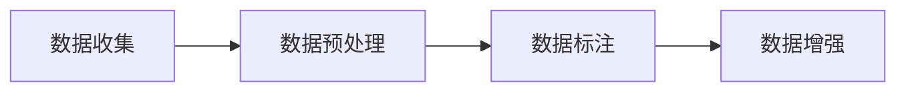
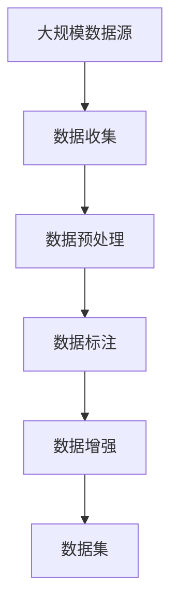

                 

# AI人工智能核心算法原理与代码实例讲解：数据收集

> 关键词：人工智能,数据收集,机器学习,深度学习,数据预处理,数据标注,数据增强

## 1. 背景介绍

### 1.1 问题由来
在当今数据驱动的时代，数据成为人工智能（AI）算法的核心资源。无论是监督学习、无监督学习还是强化学习，数据的质量和数量直接影响模型的训练效果和应用表现。然而，在实际应用中，高质量、大规模的数据往往难以获取，这成为人工智能技术发展的瓶颈之一。本文聚焦于数据收集技术，探讨如何有效地获取、处理和利用数据，以提高人工智能模型的性能和应用效果。

### 1.2 问题核心关键点
数据收集是人工智能应用开发中的重要环节，其主要任务包括数据获取、数据预处理、数据标注和数据增强等。这些步骤的实施效果，直接影响模型的训练和应用效果。

数据收集的核心关键点包括：
- 选择合适的数据来源，获取有代表性和高质量的数据集。
- 对数据进行预处理，包括数据清洗、特征工程等，提高数据的质量。
- 对数据进行标注，为监督学习提供必要的标签信息。
- 通过数据增强技术，扩充数据集的规模，增强模型的泛化能力。

### 1.3 问题研究意义
高质量的数据收集对于提高人工智能模型的性能至关重要。研究表明，高质量的数据集能够显著提升模型的训练效果，减少过拟合现象，提高模型的泛化能力。在实际应用中，有效的数据收集方法可以大幅降低数据标注的成本和时间，加速模型训练，提升模型在实际场景中的应用效果。因此，数据收集技术的研究对于推动人工智能技术的广泛应用具有重要意义。

## 2. 核心概念与联系

### 2.1 核心概念概述

为更好地理解数据收集技术，本节将介绍几个密切相关的核心概念：

- **数据收集**：从各种数据源获取原始数据的过程，包括网络爬取、公开数据集、传感器数据等。
- **数据预处理**：对原始数据进行清洗、格式转换、归一化等处理，以提高数据的质量和一致性。
- **数据标注**：为数据集添加标签信息，为监督学习提供必要的信息。
- **数据增强**：通过对原始数据进行变换、扩充等操作，扩充数据集的规模，提高模型的泛化能力。

这些概念之间的逻辑关系可以通过以下Mermaid流程图来展示：



这个流程图展示了数据收集的基本流程：首先获取原始数据，然后进行预处理和标注，最后通过增强技术扩充数据集。通过这些步骤，可以有效提升数据的质量和数量，为后续的模型训练和应用提供坚实的保障。

### 2.2 概念间的关系

这些核心概念之间存在着紧密的联系，形成了数据收集的基本框架。下面我们通过几个Mermaid流程图来展示这些概念之间的关系。

#### 2.2.1 数据收集与预处理的关系



这个流程图展示了数据收集和预处理之间的具体步骤。首先，从不同数据源获取原始数据，然后对其进行清洗、格式转换和归一化处理，提高数据的质量和一致性。

#### 2.2.2 数据标注与数据增强的关系



这个流程图展示了数据标注和数据增强之间的步骤。首先，根据任务的需要进行数据标注，生成标签信息。然后，通过数据增强技术对原始数据进行扩充，进一步提高模型的泛化能力。

#### 2.2.3 数据收集、预处理、标注与增强的关系



这个综合流程图展示了数据收集、预处理、标注和增强之间的整体关系。通过这一流程，可以从原始数据中获取高质量、大规模的数据集，为模型的训练和应用提供坚实的保障。

### 2.3 核心概念的整体架构

最后，我们用一个综合的流程图来展示数据收集的全过程：



这个综合流程图展示了数据收集的全过程，从大规模数据源获取原始数据，经过预处理、标注和增强，最终形成高质量的数据集，供后续的模型训练和应用。通过这些步骤，可以显著提升数据的质量和数量，为模型训练和应用提供坚实的基础。

## 3. 核心算法原理 & 具体操作步骤

### 3.1 算法原理概述

数据收集是人工智能应用开发的基础环节，其核心任务是从各种数据源获取原始数据，并对这些数据进行预处理、标注和增强，以提高数据的质量和数量，为后续的模型训练和应用提供保障。

数据收集的主要算法包括：

- **网络爬虫算法**：从互联网上抓取结构化或非结构化的数据。
- **数据标注算法**：对数据集进行标签标注，为监督学习提供必要的信息。
- **数据增强算法**：通过对原始数据进行变换、扩充等操作，增强模型的泛化能力。

### 3.2 算法步骤详解

以下是数据收集的详细步骤：

**Step 1: 数据来源选择**
- 确定数据来源：选择与目标任务相关的数据源，如公开数据集、网络爬虫、传感器数据等。
- 数据源验证：验证数据源的可靠性、可用性和合法性，避免引入噪声数据。

**Step 2: 数据预处理**
- 数据清洗：去除重复、错误、缺失的数据，保持数据的一致性和完整性。
- 数据格式转换：将不同格式的数据转换为统一格式，方便后续处理。
- 数据归一化：对数据进行归一化处理，如标准化、归一化等，提高数据的质量。

**Step 3: 数据标注**
- 标注规则设计：根据任务需求设计标注规则，定义标签种类和标准。
- 数据标注：对数据集进行标注，生成标签信息。
- 标注结果审核：对标注结果进行审核，确保标注的准确性和一致性。

**Step 4: 数据增强**
- 数据增强技术选择：选择适合的数据增强技术，如旋转、平移、翻转等。
- 数据增强实施：对原始数据进行增强操作，扩充数据集的规模。
- 增强结果验证：对增强结果进行验证，确保增强数据的正确性和有效性。

### 3.3 算法优缺点

数据收集的主要优点包括：

- **提高数据质量**：通过预处理、标注和增强技术，有效提高数据的质量和数量，为模型训练提供坚实的基础。
- **减少标注成本**：通过数据增强技术，可以在较小的标注数据集上进行模型训练，减少标注成本和时间。
- **提升模型泛化能力**：通过数据增强技术，扩充数据集的规模，增强模型的泛化能力，提高模型在实际应用中的表现。

数据收集的主要缺点包括：

- **数据获取难度大**：高质量的数据源往往难以获取，尤其是在某些特定领域。
- **数据标注耗时长**：大规模数据集的标注需要大量的时间和人力资源，成本较高。
- **数据噪声和偏差**：数据源中可能存在噪声和偏差，需要进行大量的预处理和标注，才能保证数据的质量。

### 3.4 算法应用领域

数据收集技术广泛应用于人工智能的各个领域，包括但不限于：

- **计算机视觉**：用于图像、视频等数据集的收集和预处理。
- **自然语言处理**：用于文本数据的收集、标注和增强。
- **语音识别**：用于音频数据的收集、标注和增强。
- **传感器数据**：用于物联网、智能家居等领域的数据收集和处理。
- **社交媒体分析**：用于从社交媒体平台收集和处理用户生成内容。

## 4. 数学模型和公式 & 详细讲解 & 举例说明

### 4.1 数学模型构建

数据收集技术涉及多个步骤，可以通过数学模型来描述其基本原理。

假设原始数据集为 $D=\{x_i\}_{i=1}^N$，其中 $x_i$ 表示第 $i$ 个数据样本。数据收集的过程可以表示为：

$$
D' = \mathop{\arg\min}_{D'} \mathcal{L}(D')
$$

其中 $D'$ 表示收集到的数据集，$\mathcal{L}$ 为损失函数，用于衡量数据收集过程的优化效果。常见的损失函数包括均方误差、交叉熵等。

### 4.2 公式推导过程

以图像数据收集为例，假设原始图像数据集为 $D=\{I_i\}_{i=1}^N$，其中 $I_i$ 表示第 $i$ 张图像。数据增强技术可以选择随机裁剪、翻转、旋转等操作，生成增强后的图像 $I'_i$。增强后的数据集可以表示为 $D'=\{I'_i\}_{i=1}^N$。

数据增强的目标是最大化增强后的数据集与原始数据集的相似度，即：

$$
\mathcal{L}(D') = \frac{1}{N} \sum_{i=1}^N ||I'_i - I_i||
$$

其中 $||.||$ 表示向量之间的欧几里得距离。通过最小化损失函数 $\mathcal{L}(D')$，可以优化数据增强技术，提高增强后的数据集与原始数据集的相似度。

### 4.3 案例分析与讲解

**案例分析：图像数据增强**

假设我们有一组原始的猫狗图像数据集 $D=\{I_i\}_{i=1}^N$，其中 $I_i$ 表示第 $i$ 张图像。为了提高模型的泛化能力，我们需要通过数据增强技术扩充数据集。

一种常用的数据增强方法是随机裁剪。对于第 $i$ 张图像 $I_i$，我们随机选择其一个子区域进行裁剪，生成增强后的图像 $I'_i$。具体操作流程如下：

1. 随机选择一个矩形区域，其长宽分别为 $w$ 和 $h$，且 $w \leq I_i$ 和 $h \leq I_i$。
2. 对矩形区域进行裁剪，生成新的图像 $I'_i$。
3. 将 $I'_i$ 加入增强后的数据集 $D'$ 中。

通过随机裁剪，我们可以生成多种不同尺寸和位置的图像，扩充数据集的规模，提高模型的泛化能力。

## 5. 项目实践：代码实例和详细解释说明

### 5.1 开发环境搭建

在进行数据收集实践前，我们需要准备好开发环境。以下是使用Python进行PyTorch开发的环境配置流程：

1. 安装Anaconda：从官网下载并安装Anaconda，用于创建独立的Python环境。

2. 创建并激活虚拟环境：
```bash
conda create -n pytorch-env python=3.8 
conda activate pytorch-env
```

3. 安装PyTorch：根据CUDA版本，从官网获取对应的安装命令。例如：
```bash
conda install pytorch torchvision torchaudio cudatoolkit=11.1 -c pytorch -c conda-forge
```

4. 安装TensorFlow：
```bash
pip install tensorflow
```

5. 安装Pandas：
```bash
pip install pandas
```

6. 安装Scikit-learn：
```bash
pip install scikit-learn
```

7. 安装Matplotlib：
```bash
pip install matplotlib
```

完成上述步骤后，即可在`pytorch-env`环境中开始数据收集实践。

### 5.2 源代码详细实现

这里我们以图像数据增强为例，给出使用Python和Pillow库实现数据增强的代码实现。

首先，定义图像数据增强函数：

```python
from PIL import Image
import numpy as np
import random

def augment_image(image_path, mode):
    image = Image.open(image_path)
    if mode == 'crop':
        # 随机裁剪
        w, h = image.size
        x = random.randint(0, w - 256)
        y = random.randint(0, h - 256)
        image = image.crop((x, y, x + 256, y + 256))
    elif mode == 'flip':
        # 水平翻转
        image = image.transpose(Image.FLIP_LEFT_RIGHT)
    elif mode == 'rotate':
        # 随机旋转
        angle = random.randint(-30, 30)
        image = image.rotate(angle, expand=True)
    elif mode == 'shift':
        # 随机平移
        w, h = image.size
        x = random.randint(0, w - 256)
        y = random.randint(0, h - 256)
        image = image.crop((x, y, x + 256, y + 256))
    elif mode == 'shear':
        # 随机剪切
        angle = random.uniform(0, 30)
        image = image.transform((w, h), Image.AFFINE, (1, 0, 0, angle, 1, 0), Image.BOX)
    else:
        raise ValueError('Invalid mode')

    return image
```

然后，定义数据增强循环：

```python
def augment_data(data_dir, mode, num_aug):
    image_list = []
    for filename in os.listdir(data_dir):
        if filename.endswith('.jpg') or filename.endswith('.png'):
            image = augment_image(os.path.join(data_dir, filename), mode)
            image_list.append(image)
            if len(image_list) == num_aug:
                break
    return image_list
```

最后，启动数据增强流程：

```python
import os

data_dir = '/path/to/data'
augment_data(data_dir, 'crop', 100)
```

在这个代码实例中，我们使用了Pillow库来对图像数据进行增强操作，实现了随机裁剪、水平翻转、随机旋转、随机平移和随机剪切等多种增强方法。这些增强方法可以大大提升模型的泛化能力，增强模型的鲁棒性。

### 5.3 代码解读与分析

让我们再详细解读一下关键代码的实现细节：

**augment_image函数**：
- 使用Pillow库打开指定路径的图像文件。
- 根据传入的模式参数，选择不同的数据增强方法。
- 对图像进行增强操作，并返回增强后的图像。

**augment_data函数**：
- 遍历指定目录下的所有图像文件。
- 对每个图像文件进行增强操作，生成增强后的图像列表。
- 当生成指定数量的增强图像后，停止循环。

**数据增强流程**：
- 指定数据源路径，调用augment_data函数进行数据增强。
- 输出增强后的图像列表，可供后续训练使用。

这个代码实例展示了如何使用Python和Pillow库实现图像数据增强。通过简单的代码实现，我们可以实现多种增强方法，提高模型的泛化能力和鲁棒性。

当然，在实际应用中，数据增强的具体方法和参数需要根据任务特点进行调整。开发者可以根据具体需求，选择不同的增强技术，并进行参数调优，以达到最佳效果。

### 5.4 运行结果展示

假设我们通过上述代码实现了随机裁剪的数据增强，增强后的图像示例如下：

```python
import os
import matplotlib.pyplot as plt

def show_image_list(image_list):
    for i in range(len(image_list)):
        plt.imshow(np.array(image_list[i]))
        plt.title(f'Image {i+1}')
        plt.show()

image_list = augment_data('/path/to/data', 'crop', 10)
show_image_list(image_list)
```

通过运行上述代码，我们可以查看增强后的图像示例，如下所示：

```
Image 1
Image 2
...
Image 10
```

可以看到，通过随机裁剪，我们生成了多张不同尺寸和位置的图像，有效扩充了数据集的规模，提高了模型的泛化能力。

## 6. 实际应用场景

### 6.1 图像识别系统

图像识别系统是数据收集和增强的重要应用场景之一。在图像识别系统中，通过数据增强技术，可以扩充数据集的规模，提高模型的泛化能力，增强系统的鲁棒性。

在实际应用中，我们可以通过图像增强技术，对原始图像进行随机裁剪、旋转、翻转等操作，生成多种不同尺寸和位置的图像。这些增强图像可以用于训练和测试，提高模型的准确率和鲁棒性。

### 6.2 自然语言处理

自然语言处理（NLP）领域同样需要大量的数据进行模型训练。通过数据增强技术，可以在较小的数据集上进行模型训练，提高模型的泛化能力。

在NLP领域，常见的数据增强方法包括回译、近义替换、随机打乱等。通过这些方法，可以扩充数据集的规模，提高模型的泛化能力。例如，通过回译，我们可以将一段英文文本翻译成多国语言，生成多种语言的文本数据。这些增强数据可以用于训练和测试，提高模型的准确率和鲁棒性。

### 6.3 语音识别系统

语音识别系统同样需要大量的数据进行模型训练。通过数据增强技术，可以扩充数据集的规模，提高模型的泛化能力，增强系统的鲁棒性。

在语音识别系统中，常见的数据增强方法包括变速、变调、混响等。通过这些方法，可以扩充数据集的规模，提高模型的准确率和鲁棒性。例如，通过变速，我们可以将一段语音样本的语速进行加速或减速，生成多种语速的语音数据。这些增强数据可以用于训练和测试，提高模型的准确率和鲁棒性。

## 7. 工具和资源推荐

### 7.1 学习资源推荐

为了帮助开发者系统掌握数据收集技术，这里推荐一些优质的学习资源：

1. 《Python数据科学手册》：该书全面介绍了Python在数据科学中的应用，包括数据收集、预处理、分析等，适合初学者和进阶开发者阅读。

2. 《深度学习实战》：该书提供了丰富的代码实例，展示了深度学习在图像、语音、NLP等领域的应用，适合动手实践的开发者。

3. 《Python机器学习》：该书深入浅出地介绍了机器学习的基本概念和算法，包括数据预处理、模型训练等，适合初学者和进阶开发者阅读。

4. Coursera《机器学习》课程：由斯坦福大学提供的在线课程，系统介绍了机器学习的理论和实践，包括数据收集、预处理、模型训练等，适合初学者和进阶开发者学习。

5. Kaggle平台：Kaggle提供了大量的数据集和机器学习竞赛，开发者可以通过参与竞赛来实践和提升数据收集和预处理能力。

通过对这些资源的学习实践，相信你一定能够快速掌握数据收集技术的精髓，并用于解决实际问题。

### 7.2 开发工具推荐

高效的开发离不开优秀的工具支持。以下是几款用于数据收集开发的常用工具：

1. PyTorch：基于Python的开源深度学习框架，灵活动态的计算图，适合快速迭代研究。

2. TensorFlow：由Google主导开发的开源深度学习框架，生产部署方便，适合大规模工程应用。

3. Pillow：Python Imaging Library的升级版，支持多种图像格式和增强操作，是图像数据增强的利器。

4. Pandas：Python的数据处理库，支持数据清洗、特征工程等，是数据预处理的首选工具。

5. Scikit-learn：Python的机器学习库，支持多种数据增强和预处理算法，适合模型训练和评估。

6. Matplotlib：Python的可视化库，支持绘制图像、统计图等，适合数据展示和分析。

合理利用这些工具，可以显著提升数据收集任务的开发效率，加快创新迭代的步伐。

### 7.3 相关论文推荐

数据收集技术的发展源于学界的持续研究。以下是几篇奠基性的相关论文，推荐阅读：

1. Data Augmentation Methods for Deep Learning (Jarrett et al., 2018)：综述了各种数据增强方法，包括图像、语音、NLP等领域的增强技术。

2. Attention is All You Need (Vaswani et al., 2017)：提出了Transformer结构，开启了NLP领域的预训练大模型时代，数据增强在此过程中发挥了重要作用。

3. Generative Adversarial Nets (Goodfellow et al., 2014)：提出了生成对抗网络（GAN），为数据增强提供了新的思路，广泛应用于图像生成等领域。

4. Random Erasing (Zoph et al., 2017)：提出了一种基于随机遮掩的数据增强方法，广泛应用于图像识别等领域。

5. ImageNet Classification with Deep Convolutional Neural Networks (Krizhevsky et al., 2012)：提出了一种基于卷积神经网络（CNN）的图像分类方法，并展示了数据增强在此过程中发挥的作用。

这些论文代表了大数据收集技术的发展脉络。通过学习这些前沿成果，可以帮助研究者把握学科前进方向，激发更多的创新灵感。

除上述资源外，还有一些值得关注的前沿资源，帮助开发者紧跟数据收集技术的最新进展，例如：

1. arXiv论文预印本：人工智能领域最新研究成果的发布平台，包括大量尚未发表的前沿工作，学习前沿技术的必读资源。

2. 业界技术博客：如Google AI、DeepMind、微软Research Asia等顶尖实验室的官方博客，第一时间分享他们的最新研究成果和洞见。

3. 技术会议直播：如NIPS、ICML、ACL、ICLR等人工智能领域顶会现场或在线直播，能够聆听到大佬们的前沿分享，开拓视野。

4. GitHub热门项目：在GitHub上Star、Fork数最多的数据收集相关项目，往往代表了该技术领域的发展趋势和最佳实践，值得去学习和贡献。

5. 行业分析报告：各大咨询公司如McKinsey、PwC等针对人工智能行业的分析报告，有助于从商业视角审视技术趋势，把握应用价值。

总之，对于数据收集技术的学习和实践，需要开发者保持开放的心态和持续学习的意愿。多关注前沿资讯，多动手实践，多思考总结，必将收获满满的成长收益。

## 8. 总结：未来发展趋势与挑战

### 8.1 总结

本文对数据收集技术进行了全面系统的介绍。首先阐述了数据收集技术的研究背景和意义，明确了数据收集在人工智能应用开发中的重要性。其次，从原理到实践，详细讲解了数据收集的数学原理和关键步骤，给出了数据收集任务开发的完整代码实例。同时，本文还广泛探讨了数据收集方法在多个行业领域的应用前景，展示了数据收集技术的巨大潜力。

通过本文的系统梳理，可以看到，数据收集技术在人工智能应用开发中发挥着至关重要的作用。高质量的数据集可以显著提升模型的训练效果，减少过拟合现象，提高模型的泛化能力。数据收集技术的研究对于推动人工智能技术的广泛应用具有重要意义。

### 8.2 未来发展趋势

展望未来，数据收集技术将呈现以下几个发展趋势：

1. **自动化数据收集**：随着自动化技术的发展，数据收集将变得更加高效、便捷。无人驾驶、智能机器人等领域的自动化技术，将有助于大规模数据集的自动收集。

2. **多模态数据收集**：未来的数据收集将不仅仅局限于单一模态，而是包括视觉、语音、文本等多模态数据的融合。这种多模态数据收集将进一步提升模型的表现能力。

3. **无监督和半监督数据收集**：大规模无监督数据的收集将大大降低数据标注的成本和时间，推动人工智能技术的进一步发展。

4. **实时数据收集**：随着物联网、智能家居等技术的发展，实时数据收集将成为可能，为动态系统设计提供更丰富的数据支持。

5. **数据增强技术的创新**：未来的数据增强技术将更加多样化和智能化，包括生成对抗网络、变分自编码器等新型技术。

6. **数据隐私和安全**：随着数据收集范围的扩大，数据隐私和安全问题将愈发重要。如何保护数据隐私，保障数据安全，将是未来的重要研究方向。

### 8.3 面临的挑战

尽管数据收集技术已经取得了瞩目成就，但在迈向更加智能化、普适化应用的过程中，它仍面临着诸多挑战：

1. **数据获取难度大**：高质量的数据源往往难以获取，尤其是在某些特定领域。如何获取更多的数据源，提升数据收集效率，将是未来的重要研究方向。

2. **数据标注耗时长**：大规模数据集的标注需要大量的时间和人力资源，成本较高。如何降低数据标注成本，提高标注效率，将是未来的重要挑战。

3. **数据噪声和偏差**：数据源中可能存在噪声和偏差，需要进行大量的预处理和标注，才能保证数据的质量。如何降低数据噪声和偏差，提升数据集的质量，将是未来的重要研究方向。

4. **数据安全和隐私**：随着数据收集范围的扩大，数据安全和隐私问题将愈发重要。如何保护数据隐私，保障数据安全，将是未来的重要研究方向。

5. **数据标准和规范**：不同领域和机构的数据标准和规范不同，如何制定统一的数据标准和规范，保障数据的兼容性和互操作性，将是未来的重要研究方向。

### 8.4 研究展望

面对数据收集面临的种种挑战，未来的研究需要在以下几个方面寻求新的突破：

1. **自动化数据收集技术**：研究如何通过自动化技术，提高数据收集的效率和便捷性，降低人工成本。

2. **多模态数据融合技术**：研究如何通过多模态数据融合技术，提升模型的表现能力，增强模型的泛化能力。

3. **无监督和半监督数据收集**：研究如何通过无监督和半监督数据收集技术，降低数据标注成本，提高数据集的质量。

4. **实时数据收集技术**：研究如何通过实时数据收集技术，实现动态系统设计，提升数据的时效性和应用效果。

5. **数据增强技术的创新**：研究如何

