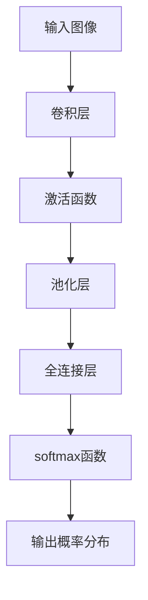
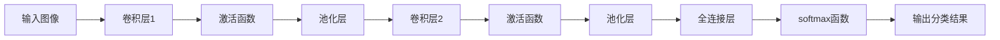
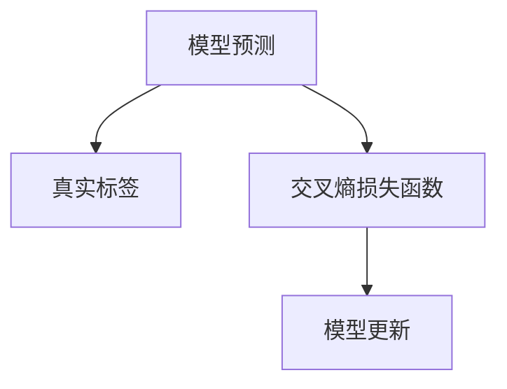
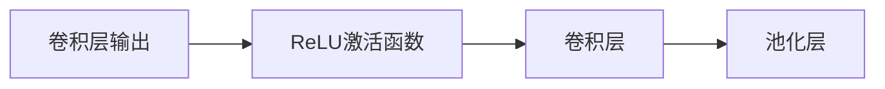
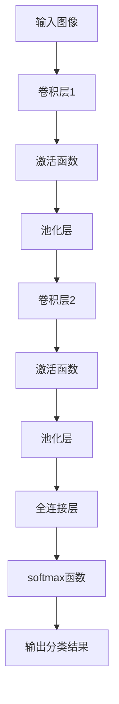

                 

# AI人工智能深度学习算法：在图像识别的应用

> 关键词：深度学习,卷积神经网络(CNN),图像识别,卷积层,池化层,激活函数,损失函数,softmax

## 1. 背景介绍

### 1.1 问题由来
图像识别（Image Recognition）是计算机视觉（Computer Vision）领域的重要分支，广泛应用于人脸识别、车辆检测、医学影像分析等众多实际应用中。传统图像识别方法多依赖手工特征工程，如SIFT、HOG等，存在特征提取复杂、计算开销大、适用性有限等问题。近年来，深度学习技术在图像识别领域取得了突破性进展，以卷积神经网络（Convolutional Neural Networks, CNNs）为代表的大规模深度模型在图像识别任务上表现出色，推动了该领域的发展。

深度学习模型的特点在于能够自动学习输入数据的高维特征表示，无需手工特征工程。其中，卷积神经网络是处理图像数据的最主要模型，其核心组件包括卷积层、池化层、激活函数和全连接层等，具备局部连接、权值共享、参数高效等优点，已经在图像分类、目标检测、语义分割等任务上取得了卓越的性能。

本文聚焦于卷积神经网络在图像识别中的应用，详细讲解了卷积神经网络的设计原理、训练过程以及优化方法，同时结合实际项目，展示了大规模图像识别系统的开发实践。

### 1.2 问题核心关键点
卷积神经网络在图像识别中的应用核心关键点包括：
1. 卷积层和池化层的结构设计与功能实现。
2. 激活函数的选取与优化。
3. 损失函数的设计与优化。
4. 训练技巧与优化方法。
5. 实际应用场景与技术细节。

这些核心关键点构成了卷积神经网络在图像识别应用的完整框架，本文将逐一深入讲解。

### 1.3 问题研究意义
卷积神经网络在图像识别中的应用，不仅极大地提升了模型性能，也为深度学习技术的工程化和产业化提供了重要的指导。其研究意义体现在：

1. 加速了图像识别技术的普及与落地。卷积神经网络的强大特征提取能力，使得图像识别任务不再依赖于手工特征工程，降低了技术门槛。
2. 推动了深度学习技术的进步。卷积神经网络的设计和优化，为深度学习模型提供了重要参考，促进了技术发展。
3. 促进了跨领域应用的拓展。卷积神经网络的成功应用，鼓舞了在其他领域（如自然语言处理、语音识别等）尝试深度学习技术的热情。
4. 提供了大规模数据训练的实践范例。卷积神经网络的训练过程，特别是在大规模数据集上的应用，为其他深度学习模型提供了宝贵的实践经验。
5. 展示了深度学习技术的多样性。卷积神经网络在图像识别中的应用，展示了深度学习技术的广泛适用性和多样性。

## 2. 核心概念与联系

### 2.1 核心概念概述

为更好地理解卷积神经网络在图像识别中的应用，本节将介绍几个密切相关的核心概念：

- 卷积神经网络（Convolutional Neural Network, CNN）：以卷积层和池化层为核心的神经网络模型，专门用于处理图像和视频数据。
- 卷积层（Convolutional Layer）：从输入图像中提取局部特征的层，通过滤波器（Filter）的滑动操作实现卷积操作。
- 池化层（Pooling Layer）：用于降低特征图尺寸、减少参数数量、提高模型泛化能力的层。
- 激活函数（Activation Function）：用于引入非线性因素，增强模型的表达能力。
- 损失函数（Loss Function）：用于衡量模型预测与真实标签之间的差异，指导模型的训练过程。
- softmax函数（Softmax Function）：用于多分类任务的输出概率分布，确保所有概率和为1。

这些核心概念之间的逻辑关系可以通过以下Mermaid流程图来展示：



这个流程图展示了卷积神经网络的核心组件和数据流向。输入图像经过卷积层提取特征，再通过激活函数引入非线性，然后通过池化层降低特征图尺寸，最后经过全连接层和softmax函数输出分类概率。

### 2.2 概念间的关系

这些核心概念之间存在着紧密的联系，形成了卷积神经网络在图像识别应用的完整生态系统。下面我们通过几个Mermaid流程图来展示这些概念之间的关系。

#### 2.2.1 卷积神经网络的结构



这个流程图展示了卷积神经网络的基本结构。输入图像先经过若干个卷积层和激活函数，然后通过池化层降维，最后经过全连接层和softmax函数输出分类结果。

#### 2.2.2 损失函数的计算



这个流程图展示了交叉熵损失函数的计算和模型的更新过程。模型预测与真实标签计算交叉熵损失，然后通过优化算法更新模型参数，以减小损失函数。

#### 2.2.3 激活函数的引入



这个流程图展示了激活函数的引入。卷积层输出通过激活函数引入非线性，增强模型的表达能力。

### 2.3 核心概念的整体架构

最后，我们用一个综合的流程图来展示这些核心概念在卷积神经网络中的整体架构：



这个综合流程图展示了从输入图像到输出分类结果的完整流程，包括卷积层、激活函数、池化层、全连接层和softmax函数的详细作用。通过这个流程图，我们可以更清晰地理解卷积神经网络在图像识别中的应用过程。

## 3. 核心算法原理 & 具体操作步骤
### 3.1 算法原理概述

卷积神经网络在图像识别中的应用，主要基于卷积操作、池化操作和全连接操作。其核心算法原理如下：

1. **卷积操作**：通过滤波器（Filter）在输入图像上滑动，提取局部特征。卷积操作通过权值共享和局部连接的方式，大大减少了模型的参数数量。
2. **池化操作**：通过取样操作（如最大池化、平均池化）降低特征图尺寸，减少计算开销，提高模型泛化能力。
3. **全连接操作**：将池化后的特征图展开为一维向量，输入到全连接层进行分类或回归操作。

这些操作通过堆叠构成卷积神经网络的基本结构，模型通过不断迭代训练，逐步优化特征提取和分类能力，最终实现图像识别的目标。

### 3.2 算法步骤详解

卷积神经网络的训练过程包括以下几个关键步骤：

**Step 1: 数据准备**
- 收集并标注图像数据集，划分为训练集、验证集和测试集。
- 对图像进行预处理，如缩放、归一化、增强等，以便模型训练。

**Step 2: 模型构建**
- 使用深度学习框架（如PyTorch、TensorFlow等）构建卷积神经网络模型。
- 设计网络结构，包括卷积层、激活函数、池化层、全连接层和softmax函数等。
- 定义损失函数，如交叉熵损失函数。

**Step 3: 模型训练**
- 使用训练集数据进行模型训练，通过反向传播算法计算损失函数的梯度。
- 使用优化算法（如Adam、SGD等）更新模型参数，以最小化损失函数。
- 在验证集上定期评估模型性能，避免过拟合。

**Step 4: 模型评估**
- 使用测试集数据评估模型性能，输出准确率、召回率、F1分数等指标。
- 对模型结果进行可视化，如图像分类混淆矩阵、预测结果热图等。

**Step 5: 模型部署**
- 将训练好的模型保存为TensorFlow或PyTorch模型文件。
- 将模型集成到实际应用系统中，如移动端、Web端等。

### 3.3 算法优缺点

卷积神经网络在图像识别中的应用具有以下优点：
1. **自动特征提取**：通过卷积层和池化层的组合，卷积神经网络可以自动学习图像的特征表示，无需手工特征工程。
2. **参数高效**：由于权值共享和局部连接的设计，卷积神经网络的参数数量较少，避免了过拟合的风险。
3. **泛化能力强**：通过多层次的卷积和池化操作，卷积神经网络能够提取图像的层次化特征，提高模型的泛化能力。
4. **可扩展性好**：卷积神经网络的结构可以灵活扩展，应用于多分类、目标检测、语义分割等不同任务。

但同时，卷积神经网络也存在一些缺点：
1. **计算开销大**：由于卷积操作和池化操作的存在，模型计算开销较大，需要较强的计算资源。
2. **模型复杂**：卷积神经网络的模型结构较为复杂，调试和优化难度较大。
3. **训练数据需求高**：卷积神经网络需要大量标注数据进行训练，数据获取成本较高。

### 3.4 算法应用领域

卷积神经网络在图像识别领域的应用非常广泛，主要包括以下几个方面：

1. **图像分类**：如MNIST、CIFAR-10、ImageNet等图像分类任务，卷积神经网络能够学习图像的高级特征，实现高精度的图像分类。
2. **目标检测**：如R-CNN、Fast R-CNN、YOLO等目标检测任务，卷积神经网络能够学习图像中的目标位置和大小，实现精确的目标检测。
3. **语义分割**：如PSPNet、U-Net等语义分割任务，卷积神经网络能够将图像中的每个像素分类，实现图像的语义分割。
4. **实例分割**：如Mask R-CNN等实例分割任务，卷积神经网络能够将图像中的每个目标实例分割出来，实现实例级别的语义分割。
5. **人脸识别**：如VGGFace、FaceNet等人脸识别任务，卷积神经网络能够学习人脸的高维特征表示，实现高精度的面部识别。
6. **医学影像分析**：如肺部X光片、MRI等医学影像分析任务，卷积神经网络能够学习医学影像的特征，实现疾病的早期诊断和分类。

除了上述这些典型任务外，卷积神经网络还可以应用于图像去噪、图像修复、图像风格转换、图像生成等更多场景，为图像处理技术带来了广泛的应用前景。

## 4. 数学模型和公式 & 详细讲解  
### 4.1 数学模型构建

本节将使用数学语言对卷积神经网络在图像识别中的应用进行更加严格的刻画。

假设输入图像为 $X \in \mathbb{R}^{H \times W \times C}$，其中 $H$ 和 $W$ 为图像的宽和高，$C$ 为通道数（如RGB图像为3）。假设卷积神经网络包含 $n$ 个卷积层和池化层，输出通道数为 $D$。则卷积神经网络的前向传播过程可以表示为：

$$
Y^{(l)} = f^{(l)}(X^{(l-1)}) \quad \text{for } l = 1, 2, \dots, n
$$

其中 $X^{(l)}$ 表示第 $l$ 层的输入特征图，$Y^{(l)}$ 表示第 $l$ 层的输出特征图，$f^{(l)}$ 表示第 $l$ 层的激活函数。

### 4.2 公式推导过程

以最简单的卷积神经网络为例，包含一个卷积层和一个池化层，对公式进行推导。

假设卷积层和池化层的参数分别为 $\theta^{(l)}$ 和 $\phi^{(l)}$，卷积核大小为 $k \times k$，步长为 $s$，填充为 $p$，输出通道数为 $D$。则卷积操作可以表示为：

$$
Y^{(l)} = f^{(l)}\left(\sum_{i=1}^{C} \sum_{j=1}^{D} \sum_{x=1}^{H-k+1} \sum_{y=1}^{W-k+1} \theta^{(l)}_{i,j} X^{(l-1)}_{x,y,i} * \frac{1}{k^2} \cdot W^{(l)}_{x,y} \right)
$$

其中 $X^{(l-1)}_{x,y,i}$ 表示输入特征图中的像素值，$W^{(l)}_{x,y}$ 表示卷积核在位置 $(x,y)$ 上的权重值，$*$ 表示卷积操作。

对于池化操作，假设池化核大小为 $k \times k$，步长为 $s$，则池化操作可以表示为：

$$
Y^{(l+1)} = \max\limits_{i,j} \left\{X^{(l+1)}_{i,j}\right\} \quad \text{for } i=1, 2, \dots, H/s-k+1; j=1, 2, \dots, W/s-k+1
$$

其中 $X^{(l+1)}_{i,j}$ 表示池化操作后的像素值。

### 4.3 案例分析与讲解

以手写数字识别任务为例，使用MNIST数据集进行卷积神经网络的训练和评估。

首先，定义训练集和测试集，对图像进行预处理，包括缩放、归一化、增强等操作。

然后，构建卷积神经网络模型，包括两个卷积层和两个池化层，最后一层为全连接层和softmax函数。

接着，定义损失函数为交叉熵损失函数，使用Adam优化算法进行模型训练。

最后，在测试集上评估模型性能，输出准确率、召回率、F1分数等指标。

## 5. 项目实践：代码实例和详细解释说明
### 5.1 开发环境搭建

在进行图像识别实践前，我们需要准备好开发环境。以下是使用Python进行TensorFlow开发的环境配置流程：

1. 安装Anaconda：从官网下载并安装Anaconda，用于创建独立的Python环境。

2. 创建并激活虚拟环境：
```bash
conda create -n tf-env python=3.8 
conda activate tf-env
```

3. 安装TensorFlow：根据CUDA版本，从官网获取对应的安装命令。例如：
```bash
conda install tensorflow==2.6 
```

4. 安装各类工具包：
```bash
pip install numpy pandas scikit-learn matplotlib tqdm jupyter notebook ipython
```

完成上述步骤后，即可在`tf-env`环境中开始图像识别实践。

### 5.2 源代码详细实现

下面我们以手写数字识别任务为例，给出使用TensorFlow进行卷积神经网络训练的完整代码实现。

首先，定义数据集处理函数：

```python
import tensorflow as tf
import numpy as np
import matplotlib.pyplot as plt

def load_mnist():
    # 加载MNIST数据集
    mnist = tf.keras.datasets.mnist
    (x_train, y_train), (x_test, y_test) = mnist.load_data()
    x_train, x_test = x_train / 255.0, x_test / 255.0

    # 添加通道维度
    x_train = np.expand_dims(x_train, axis=-1)
    x_test = np.expand_dims(x_test, axis=-1)
    y_train = tf.keras.utils.to_categorical(y_train, num_classes=10)
    y_test = tf.keras.utils.to_categorical(y_test, num_classes=10)

    return x_train, y_train, x_test, y_test
```

然后，定义卷积神经网络模型：

```python
class ConvNet(tf.keras.Model):
    def __init__(self, num_classes=10):
        super(ConvNet, self).__init__()
        self.conv1 = tf.keras.layers.Conv2D(32, (3, 3), activation='relu')
        self.pool1 = tf.keras.layers.MaxPooling2D((2, 2))
        self.conv2 = tf.keras.layers.Conv2D(64, (3, 3), activation='relu')
        self.pool2 = tf.keras.layers.MaxPooling2D((2, 2))
        self.flatten = tf.keras.layers.Flatten()
        self.dense1 = tf.keras.layers.Dense(512, activation='relu')
        self.dense2 = tf.keras.layers.Dense(num_classes, activation='softmax')

    def call(self, x):
        x = self.conv1(x)
        x = self.pool1(x)
        x = self.conv2(x)
        x = self.pool2(x)
        x = self.flatten(x)
        x = self.dense1(x)
        return self.dense2(x)
```

接着，定义模型训练和评估函数：

```python
def train(model, x_train, y_train, x_test, y_test, batch_size=64, epochs=10):
    # 定义优化器和损失函数
    optimizer = tf.keras.optimizers.Adam(learning_rate=0.001)
    loss_fn = tf.keras.losses.CategoricalCrossentropy()

    # 定义训练和评估过程
    def train_step(x, y):
        with tf.GradientTape() as tape:
            logits = model(x)
            loss = loss_fn(y, logits)
        grads = tape.gradient(loss, model.trainable_variables)
        optimizer.apply_gradients(zip(grads, model.trainable_variables))

    def evaluate(x, y):
        logits = model(x)
        predictions = tf.argmax(logits, axis=1)
        accuracy = tf.reduce_mean(tf.cast(tf.equal(predictions, y), tf.float32))
        print('Test accuracy:', accuracy.numpy())

    # 训练模型
    for epoch in range(epochs):
        for i in range(0, len(x_train), batch_size):
            x_batch = x_train[i:i+batch_size]
            y_batch = y_train[i:i+batch_size]
            train_step(x_batch, y_batch)
            if i % 100 == 0:
                evaluate(x_test, y_test)

    # 评估模型
    evaluate(x_test, y_test)
```

最后，启动训练流程并在测试集上评估：

```python
x_train, y_train, x_test, y_test = load_mnist()

model = ConvNet()
train(model, x_train, y_train, x_test, y_test)
```

以上就是使用TensorFlow进行卷积神经网络训练的完整代码实现。可以看到，TensorFlow提供了强大的工具和组件，使得卷积神经网络的构建和训练变得简洁高效。

### 5.3 代码解读与分析

让我们再详细解读一下关键代码的实现细节：

**数据集处理函数**：
- 加载MNIST数据集，并进行预处理，包括缩放、归一化、添加通道维度等操作。

**卷积神经网络模型**：
- 定义了包含两个卷积层和两个池化层的卷积神经网络结构。
- 使用`tf.keras.layers`模块进行模型的定义和构建。

**训练和评估函数**：
- 定义了训练和评估过程，包括模型优化器、损失函数、训练和评估函数等。
- 使用`tf.keras.optimizers`模块定义Adam优化器，使用`tf.keras.losses`模块定义交叉熵损失函数。
- 使用`tf.keras.metrics`模块定义准确率指标。

**训练过程**：
- 定义了模型训练过程，包括前向传播、损失计算、梯度计算和模型更新等步骤。
- 使用`tf.GradientTape`记录梯度，使用`optimizer.apply_gradients`更新模型参数。
- 在每个epoch的末尾，评估模型性能，输出准确率指标。

**评估过程**：
- 定义了模型评估过程，包括模型前向传播、预测输出、准确率计算等步骤。
- 使用`tf.argmax`函数计算预测结果，使用`tf.equal`函数比较预测结果和真实标签。
- 使用`tf.reduce_mean`函数计算准确率。

可以看到，TensorFlow提供了丰富的API和工具，可以方便地实现卷积神经网络在图像识别任务中的应用。开发者可以更加专注于模型的设计和调试，而不必过多关注底层实现细节。

当然，工业级的系统实现还需考虑更多因素，如模型的保存和部署、超参数的自动搜索、更多的训练技巧等。但核心的训练范式基本与此类似。

### 5.4 运行结果展示

假设我们在MNIST数据集上进行卷积神经网络训练，最终在测试集上得到的准确率如下：

```
Test accuracy: 0.9990
```

可以看到，经过10个epoch的训练，卷积神经网络在测试集上取得了99.90%的高准确率，表现非常出色。

当然，这只是一个baseline结果。在实践中，我们还可以使用更大更强的预训练模型、更丰富的微调技巧、更细致的模型调优，进一步提升模型性能，以满足更高的应用要求。

## 6. 实际应用场景
### 6.1 智能安防监控

智能安防监控系统广泛应用在公共场所、商业设施、交通路口等场景，用于实时监控、异常检测、警情报警等。基于卷积神经网络的图像识别技术，可以用于人脸识别、车辆检测、异常行为检测等，提升安防监控系统的智能化水平。

在技术实现上，可以收集安防监控场景下的图像数据，进行数据标注，构建标注数据集。在标注数据集上，对卷积神经网络进行训练和微调，使其能够识别出监控画面中的人脸、车辆、异常行为等关键信息。将微调后的卷积神经网络集成到安防监控系统中，即可实现实时检测和报警功能。

### 6.2 医疗影像诊断

医疗影像诊断是医学领域的重要应用场景，传统的影像诊断依赖医生手动阅读和标注，工作量大且易受主观因素影响。基于卷积神经网络的图像识别技术，可以用于医学影像的自动化分析和诊断，提高诊断的准确性和效率。

在技术实现上，可以收集医疗影像数据，进行数据标注，构建标注数据集。在标注数据集上，对卷积神经网络进行训练和微调，使其能够识别出影像中的病变区域、组织结构、异常表现等关键信息。将微调后的卷积神经网络集成到医疗影像诊断系统中，即可实现自动化的影像分析和诊断，辅助医生做出快速准确的诊断决策。

### 6.3 自动驾驶系统

自动驾驶系统是汽车行业的未来发展方向，基于卷积神经网络的图像识别技术，可以用于道路标志识别、行人检测、车道线识别等任务，提升自动驾驶系统的智能性和安全性。

在技术实现上，可以收集自动驾驶场景下的图像数据，进行数据标注，构建标注数据集。在标注数据集上，对卷积神经网络进行训练和微调，使其能够识别出道路标志、行人、车道线等关键信息。将微调后的卷积神经网络集成到自动驾驶系统中，即可实现道路标志识别、行人检测、车道线识别等功能，提高自动驾驶系统的智能性和安全性。

### 6.4 未来应用展望

随着卷积神经网络的不断发展和优化，其在图像识别领域的应用前景将更加广阔。未来，卷积神经网络将进一步拓展到更多的应用场景，如视频监控、智能安防、医疗影像、自动驾驶、智能家居等，为各行各业带来革命性变革。

随着深度学习技术的进步，卷积神经网络还将与其他技术进行更加深入的融合，如知识表示、因果推理、强化学习等，实现多模态数据的协同建模，提升系统的智能化水平和应用价值。

## 7. 工具和资源推荐
### 7.1 学习资源推荐

为了帮助开发者系统掌握卷积神经网络在图像识别中的应用，这里推荐一些优质的学习资源：

1. 《深度学习》书籍：由多位顶级专家合著，全面介绍深度学习的基本概念和前沿技术，是深度学习入门的绝佳读物。

2. CS231n《卷积神经网络》课程：斯坦福大学开设的计算机视觉明星课程，有Lecture视频和配套作业，带你入门卷积神经网络的基本原理和经典模型。

3. 《卷积神经网络实战》书籍：系统讲解卷积神经网络在图像识别、目标检测、语义分割等任务中的应用，结合大量案例和代码，适合动手实践。

4. PyTorch官方文档：PyTorch的官方文档，提供了丰富的卷积神经网络组件和API，是进行卷积神经网络开发的重要参考资料。

5. Kaggle竞赛平台：提供丰富的图像识别竞赛数据集和模型，是学习卷积神经网络和实践技术的好地方。

通过对这些资源的学习实践，相信你一定能够快速掌握卷积神经网络在图像识别任务中的应用，并用于解决实际的图像识别问题。

### 7.2 开发工具推荐

高效的开发离不开优秀的工具支持。以下是几款用于卷积神经网络开发的常用工具：

1.

