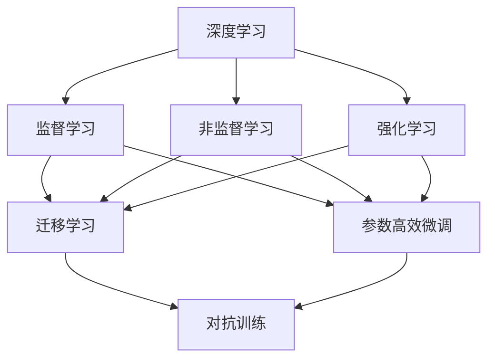
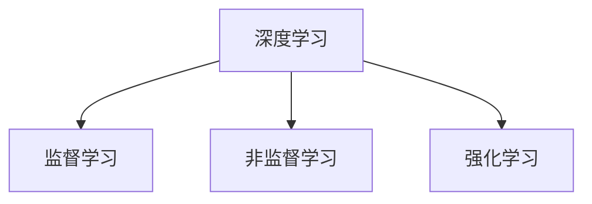
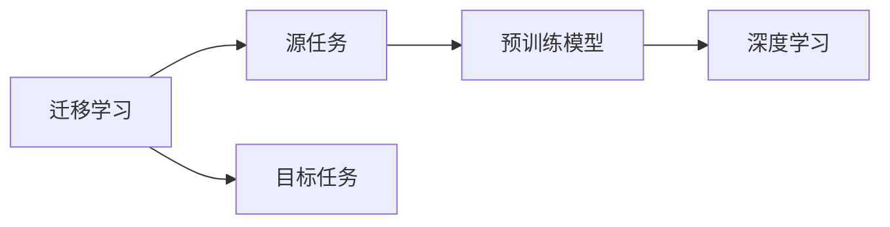
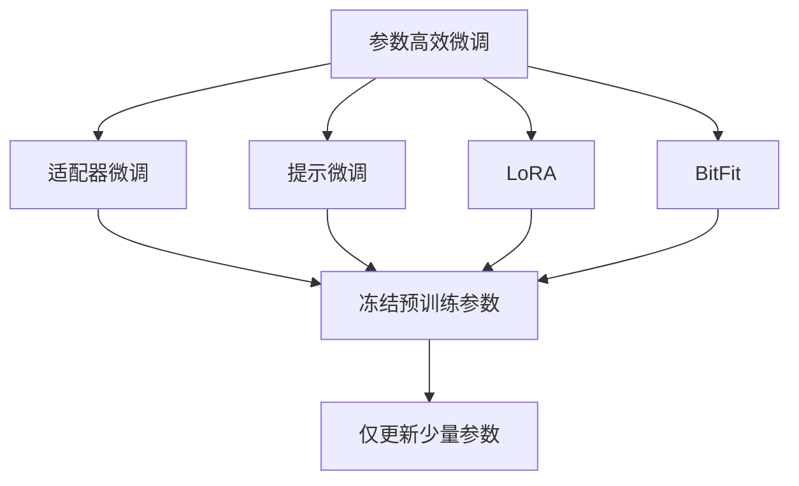
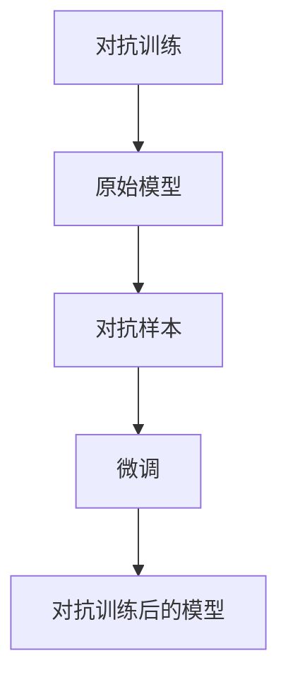
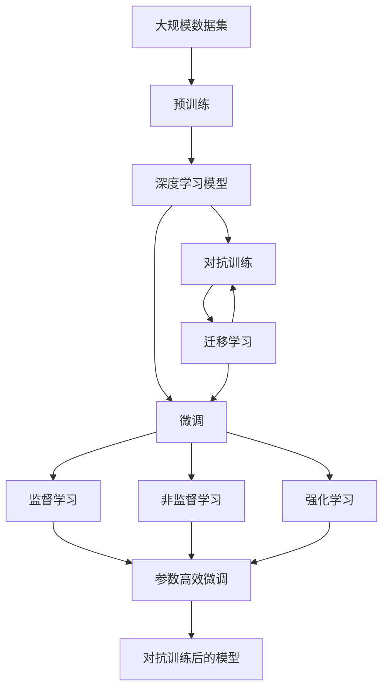

                 

# AI人工智能深度学习算法：学习与适应的算法框架

> 关键词：人工智能(AI)，深度学习(Deep Learning)，学习与适应算法框架，监督学习(Supervised Learning)，非监督学习(Unsupervised Learning)，强化学习(Reinforcement Learning)，迁移学习(Transfer Learning)

## 1. 背景介绍

### 1.1 问题由来

在当前信息时代，人工智能(AI)技术正在迅速崛起，成为推动社会进步的重要力量。深度学习作为AI技术的核心，通过多层神经网络结构模仿人脑的学习机制，已经在图像识别、语音识别、自然语言处理、推荐系统等领域取得了显著成果。然而，现有的深度学习算法往往依赖大量的标注数据进行训练，且对数据分布具有严格的假设，无法处理具有复杂时序、结构化和非线性特性的问题。

为了突破深度学习的局限性，近年来涌现出了多种新型的学习与适应算法框架，这些框架通过引入更丰富的学习范式，拓展了深度学习的应用边界，使得AI系统能够更加高效地学习和适应新环境。本文聚焦于深度学习算法的学习与适应框架，对其中几种主流算法进行了系统介绍，并对其原理、实现和应用进行了深入分析。

### 1.2 问题核心关键点

深度学习算法之所以能够取得突破性进展，主要得益于以下核心技术：

- 神经网络结构：通过多层神经网络模拟人脑的学习机制，构建复杂的特征表示。
- 反向传播算法：用于自动更新神经网络的权重，使得模型能够不断优化损失函数。
- 损失函数：用于衡量模型的预测输出与真实标签之间的差异。
- 正则化技术：如L2正则、Dropout、Early Stopping等，防止模型过拟合。
- 数据增强：通过对训练样本改写、回译等方式丰富训练集多样性。
- 对抗训练：加入对抗样本，提高模型鲁棒性。

这些技术共同构成了深度学习算法的核心框架，使得模型能够在大规模数据集上进行高效训练，并在特定任务上取得优异性能。然而，这些技术在处理特定任务时，往往需要额外的人工干预和调整，降低了模型的适应性和泛化能力。因此，引入更为灵活的学习与适应算法框架，成为当前深度学习研究的重点方向。

### 1.3 问题研究意义

研究深度学习算法的学习与适应框架，对于推动AI技术在实际应用中的落地具有重要意义：

1. 提升模型适应性：引入更为灵活的学习范式，使得模型能够适应更广泛的数据分布和任务类型。
2. 降低标注成本：部分算法不需要依赖标注数据，减少数据收集和标注的复杂度。
3. 提高泛化性能：通过引入正则化、对抗训练等技术，增强模型的泛化能力和鲁棒性。
4. 推动技术创新：新兴的学习与适应算法框架催生了新的研究方向，如元学习、迁移学习等。
5. 加速应用进程：利用预训练-微调等技术，能够快速适配特定任务，缩短研发周期。

通过理解和掌握深度学习算法的学习与适应框架，可以更加高效地构建AI系统，解决实际问题，推动AI技术的产业化进程。

## 2. 核心概念与联系

### 2.1 核心概念概述

为更好地理解深度学习算法的学习与适应框架，本节将介绍几个密切相关的核心概念：

- 深度学习：基于多层神经网络的机器学习技术，通过反向传播算法自动更新权重，从数据中学习到复杂的特征表示。
- 监督学习：利用标注数据对模型进行训练，使得模型能够预测输出。
- 非监督学习：不依赖标注数据，通过数据本身的特征进行学习。
- 强化学习：通过环境与模型的交互，学习最优策略，使得模型能够最大化预期回报。
- 迁移学习：将在一个领域学到的知识迁移到另一个领域，提高模型在新领域的泛化能力。
- 参数高效微调：只更新少量模型参数，保留大部分预训练权重不变，减少计算资源消耗。
- 对抗训练：通过引入对抗样本，增强模型的鲁棒性和泛化能力。

这些核心概念之间的逻辑关系可以通过以下Mermaid流程图来展示：



这个流程图展示了几大深度学习学习范式之间的关联和依赖关系：

1. 深度学习是基于神经网络的机器学习技术。
2. 监督学习利用标注数据进行模型训练，是最常用的学习范式之一。
3. 非监督学习不依赖标注数据，通过数据本身的特征进行学习，如自编码、聚类等。
4. 强化学习通过环境与模型的交互，学习最优策略，用于游戏、机器人等任务。
5. 迁移学习将一个领域学到的知识迁移到另一个领域，提高模型在新领域的泛化能力。
6. 参数高效微调只更新少量模型参数，保留大部分预训练权重不变，减少计算资源消耗。
7. 对抗训练通过引入对抗样本，增强模型的鲁棒性和泛化能力。

这些核心概念共同构成了深度学习算法的学习与适应框架，使得模型能够更加高效地学习和适应新环境。通过理解这些核心概念，我们可以更好地把握深度学习算法的学习与适应框架，为后续深入讨论具体的算法方法奠定基础。

### 2.2 概念间的关系

这些核心概念之间存在着紧密的联系，形成了深度学习算法完整的学习与适应框架。下面我们通过几个Mermaid流程图来展示这些概念之间的关系。

#### 2.2.1 深度学习的学习范式



这个流程图展示了几大深度学习学习范式之间的基本关系：

1. 深度学习是基础，包括监督学习、非监督学习和强化学习三种主要范式。
2. 监督学习利用标注数据进行模型训练，是最常用的学习范式之一。
3. 非监督学习不依赖标注数据，通过数据本身的特征进行学习。
4. 强化学习通过环境与模型的交互，学习最优策略。

#### 2.2.2 迁移学习与深度学习的关系



这个流程图展示了迁移学习的基本原理，以及它与深度学习的关系：

1. 迁移学习涉及源任务和目标任务。
2. 预训练模型在源任务上学习，然后通过深度学习技术，适应各种目标任务。
3. 迁移学习可以采用监督学习或非监督学习的方式，其中监督学习更为常见。

#### 2.2.3 参数高效微调方法



这个流程图展示了几种常见的参数高效微调方法，包括适配器微调、提示微调、LoRA和BitFit。这些方法的共同特点是冻结大部分预训练参数，只更新少量参数，从而提高微调效率。

#### 2.2.4 对抗训练在大深度学习中的应用



这个流程图展示了对抗训练的基本原理：

1. 对抗训练通过引入对抗样本，提高模型的鲁棒性和泛化能力。
2. 原始模型通过对抗训练，能够学习到更加鲁棒的特征表示。
3. 对抗训练后的模型，能够在面对噪声和对抗攻击时，依然保持稳定性能。

### 2.3 核心概念的整体架构

最后，我们用一个综合的流程图来展示这些核心概念在大深度学习中的整体架构：



这个综合流程图展示了从预训练到微调，再到对抗训练的完整过程。深度学习模型首先在大规模数据集上进行预训练，然后通过微调或对抗训练，进一步优化模型性能。最终得到的模型，能够适应多种下游任务，且在面对噪声和对抗攻击时，依然能够保持稳定性能。通过这些核心概念的整合，我们可以更好地理解深度学习算法的学习与适应框架，为后续深入讨论具体的算法方法提供坚实的理论基础。

## 3. 核心算法原理 & 具体操作步骤
### 3.1 算法原理概述

深度学习算法的学习与适应框架，主要包括以下几种学习范式：

- 监督学习：利用标注数据对模型进行训练，使得模型能够预测输出。
- 非监督学习：不依赖标注数据，通过数据本身的特征进行学习。
- 强化学习：通过环境与模型的交互，学习最优策略，使得模型能够最大化预期回报。
- 迁移学习：将在一个领域学到的知识迁移到另一个领域，提高模型在新领域的泛化能力。

这些学习范式共同构成了深度学习算法的核心框架，使得模型能够高效地学习和适应新环境。

### 3.2 算法步骤详解

#### 3.2.1 监督学习

监督学习是最常用的学习范式之一，其核心步骤包括：

1. 数据准备：收集和标注训练数据。
2. 模型构建：选择合适的神经网络结构，如全连接神经网络、卷积神经网络(CNN)、循环神经网络(RNN)等。
3. 模型训练：使用标注数据对模型进行训练，更新模型参数，使得模型能够最小化损失函数。
4. 模型评估：在测试数据上评估模型性能，衡量模型的预测准确度。

#### 3.2.2 非监督学习

非监督学习通过数据本身的特征进行学习，主要包括以下步骤：

1. 数据准备：收集未标注数据。
2. 特征提取：使用神经网络对数据进行特征提取，如自编码器、变分自编码器(VAE)等。
3. 模型训练：根据提取的特征，对模型进行训练，优化模型参数。
4. 特征分析：对提取的特征进行分析，发现数据中的潜在模式和结构。

#### 3.2.3 强化学习

强化学习通过环境与模型的交互，学习最优策略，主要包括以下步骤：

1. 环境设计：设计合适的环境，定义状态空间、动作空间和奖励函数。
2. 模型构建：选择合适的神经网络结构，如Q网络、策略网络等。
3. 模型训练：通过与环境的交互，对模型进行训练，学习最优策略。
4. 策略评估：在测试环境中评估模型策略的性能，衡量策略的回报。

#### 3.2.4 迁移学习

迁移学习将在一个领域学到的知识迁移到另一个领域，主要包括以下步骤：

1. 源任务学习：在源任务上使用标注数据对模型进行训练，学习到通用特征表示。
2. 目标任务适配：在目标任务上使用少量标注数据对模型进行微调，适应新的数据分布和任务类型。
3. 性能评估：在目标任务上评估模型性能，衡量模型在新领域的泛化能力。

### 3.3 算法优缺点

深度学习算法的学习与适应框架具有以下优点：

1. 高效学习：通过引入各种学习范式，使得模型能够高效地学习和适应新环境。
2. 泛化能力强：通过迁移学习和参数高效微调等技术，增强模型的泛化能力和鲁棒性。
3. 适应性强：通过对抗训练等技术，使得模型能够适应更广泛的数据分布和任务类型。
4. 降低标注成本：部分算法不需要依赖标注数据，减少数据收集和标注的复杂度。
5. 推动技术创新：新兴的学习与适应算法框架催生了新的研究方向，如元学习、迁移学习等。

同时，这些算法也存在一定的局限性：

1. 计算资源消耗大：大规模神经网络结构需要大量计算资源，训练时间和存储成本较高。
2. 模型复杂度高：深度学习模型结构复杂，难以解释和调试，模型训练和调优难度较大。
3. 数据依赖性强：部分算法对数据分布具有严格假设，难以处理非线性、非结构化数据。
4. 对抗攻击脆弱：深度学习模型在面对噪声和对抗攻击时，容易产生不稳定输出。

尽管存在这些局限性，但就目前而言，深度学习算法的学习与适应框架仍是AI技术的主流范式。未来相关研究的重点在于如何进一步降低计算资源消耗，提高模型解释性和鲁棒性，增强对非结构化数据的处理能力。

### 3.4 算法应用领域

深度学习算法的学习与适应框架已经在多个领域得到了广泛应用，涵盖了从图像处理、语音识别到自然语言处理等多个领域。以下是几个典型的应用场景：

- 图像识别：使用卷积神经网络对图像进行特征提取和分类，如目标检测、图像分割等任务。
- 语音识别：使用循环神经网络对语音信号进行特征提取和转录，如自动语音识别(ASR)等任务。
- 自然语言处理：使用循环神经网络或Transformer结构对文本进行特征提取和理解，如机器翻译、文本分类等任务。
- 推荐系统：使用协同过滤、基于内容的推荐等方法，构建个性化推荐模型，提升用户体验。
- 游戏AI：使用强化学习算法训练游戏AI，实现智能化决策和行为。
- 金融风控：使用非监督学习和迁移学习技术，构建欺诈检测、信用评估等金融风控模型。

这些应用场景展示了深度学习算法在实际生活中的广泛应用，推动了人工智能技术的产业化进程。

## 4. 数学模型和公式 & 详细讲解 & 举例说明

### 4.1 数学模型构建

本节将使用数学语言对深度学习算法的学习与适应框架进行更加严格的刻画。

记深度学习模型为 $M_{\theta}$，其中 $\theta$ 为模型参数。假设监督学习任务的数据集为 $D=\{(x_i,y_i)\}_{i=1}^N$，其中 $x_i$ 为输入，$y_i$ 为标签。定义损失函数 $\ell(y_i,M_{\theta}(x_i))$ 衡量模型的预测输出与真实标签之间的差异。则监督学习模型的训练目标为：

$$
\min_{\theta} \frac{1}{N} \sum_{i=1}^N \ell(y_i,M_{\theta}(x_i))
$$

使用梯度下降等优化算法，对模型参数 $\theta$ 进行更新，使得损失函数最小化。

### 4.2 公式推导过程

以卷积神经网络(CNN)为例，推导其前向传播和反向传播过程。

**前向传播**：
输入 $x$ 通过卷积层和池化层进行特征提取，输出 $h$：
$$
h = \max_{i=1}^N \lbrace \text{ReLU}(f_i(x)) \rbrace
$$

其中 $f_i(x)$ 为卷积核与输入 $x$ 的卷积操作，$\text{ReLU}$ 为激活函数。

**损失函数**：
定义交叉熵损失函数为：
$$
\ell(y,M_{\theta}(x)) = -\frac{1}{N} \sum_{i=1}^N y_i \log M_{\theta}(x_i)
$$

**反向传播**：
损失函数对 $f_i(x)$ 的梯度为：
$$
\frac{\partial \ell(y,M_{\theta}(x))}{\partial f_i(x)} = -\frac{1}{N} y_i \frac{\partial M_{\theta}(x_i)}{\partial f_i(x)}
$$

其中 $\frac{\partial M_{\theta}(x_i)}{\partial f_i(x)}$ 为卷积层的权重更新梯度，可通过自动微分技术高效计算。

**参数更新**：
使用梯度下降算法更新模型参数：
$$
\theta \leftarrow \theta - \eta \frac{\partial \ell(y,M_{\theta}(x))}{\partial \theta}
$$

其中 $\eta$ 为学习率，$\frac{\partial \ell(y,M_{\theta}(x))}{\partial \theta}$ 为损失函数对模型参数的梯度。

### 4.3 案例分析与讲解

以图像分类为例，推导卷积神经网络模型在图像分类任务上的训练过程。

假设数据集 $D=\{(x_i,y_i)\}_{i=1}^N$ 包含 $N$ 个图像和对应的标签。使用卷积神经网络进行图像分类，主要步骤如下：

1. **数据预处理**：对图像进行归一化、灰度转换等预处理操作，以便模型更好地进行特征提取。
2. **模型构建**：设计合适的卷积神经网络结构，如卷积层、池化层、全连接层等。
3. **模型训练**：使用训练数据 $D_{train}$ 对模型进行训练，最小化损失函数：
$$
\min_{\theta} \frac{1}{N_{train}} \sum_{i=1}^{N_{train}} \ell(y_i,M_{\theta}(x_i))
$$
4. **模型评估**：在测试数据 $D_{test}$ 上评估模型性能，衡量模型的分类准确度：
$$
\text{accuracy} = \frac{1}{N_{test}} \sum_{i=1}^{N_{test}} \mathbb{1}(y_i = M_{\theta}(x_i))
$$

其中 $\mathbb{1}$ 为指示函数，用于判断模型预测与真实标签是否一致。

## 5. 项目实践：代码实例和详细解释说明

### 5.1 开发环境搭建

在进行深度学习项目实践前，我们需要准备好开发环境。以下是使用Python进行TensorFlow开发的环境配置流程：

1. 安装Anaconda：从官网下载并安装Anaconda，用于创建独立的Python环境。

2. 创建并激活虚拟环境：
```bash
conda create -n tensorflow-env python=3.7 
conda activate tensorflow-env
```

3. 安装TensorFlow：根据CUDA版本，从官网获取对应的安装命令。例如：
```bash
conda install tensorflow=2.5 tensorflow-gpu
```

4. 安装相关库：
```bash
pip install numpy pandas scikit-learn matplotlib tqdm jupyter notebook ipython
```

完成上述步骤后，即可在`tensorflow-env`环境中开始深度学习项目实践。

### 5.2 源代码详细实现

下面我们以卷积神经网络(CNN)进行图像分类为例，给出使用TensorFlow库进行深度学习的PyTorch代码实现。

首先，定义数据预处理函数：

```python
import tensorflow as tf
from tensorflow.keras import layers

def preprocess_image(image_path, image_size):
    image = tf.io.read_file(image_path)
    image = tf.image.decode_jpeg(image, channels=3)
    image = tf.image.resize(image, [image_size, image_size])
    image = tf.image.per_image_standardization(image)
    return image

# 定义CNN模型
def build_cnn_model(input_size, num_classes):
    model = tf.keras.Sequential([
        layers.Conv2D(32, (3, 3), activation='relu', input_shape=(input_size, input_size, 3)),
        layers.MaxPooling2D((2, 2)),
        layers.Conv2D(64, (3, 3), activation='relu'),
        layers.MaxPooling2D((2, 2)),
        layers.Flatten(),
        layers.Dense(128, activation='relu'),
        layers.Dense(num_classes, activation='softmax')
    ])
    return model

# 定义损失函数和优化器
def loss_function(y_true, y_pred):
    return tf.keras.losses.categorical_crossentropy(y_true, y_pred)

def optimizer_function():
    return tf.keras.optimizers.Adam(learning_rate=0.001)

# 加载数据集
train_dataset = tf.data.Dataset.list_files(train_directory + '/*/*/*')
test_dataset = tf.data.Dataset.list_files(test_directory + '/*/*/*')

train_dataset = train_dataset.map(lambda x: (preprocess_image(x, image_size), tf.io.read_file(x)))
test_dataset = test_dataset.map(lambda x: (preprocess_image(x, image_size), tf.io.read_file(x)))

train_dataset = train_dataset.shuffle(buffer_size=10000).batch(batch_size)
test_dataset = test_dataset.batch(batch_size)

# 构建CNN模型
model = build_cnn_model(input_size, num_classes)

# 定义损失函数和优化器
loss_function = loss_function
optimizer_function = optimizer_function

# 训练模型
model.compile(optimizer=optimizer_function, loss=loss_function, metrics=['accuracy'])
model.fit(train_dataset, epochs=num_epochs, validation_data=test_dataset)
```

以上是使用TensorFlow库进行深度学习的PyTorch代码实现。可以看到，通过TensorFlow的高级API，我们可以快速搭建深度学习模型，并进行图像分类任务的训练和评估。

### 5.3 代码解读与分析

让我们再详细解读一下关键代码的实现细节：

**数据预处理函数**：
- 使用TensorFlow的ImageDataGenerator类对图像进行归一化、灰度转换等预处理操作。
- 使用`preprocess_image`函数，将图像文件读取、解码、 resize等操作封装为一个函数，提高了代码的复用性和可读性。

**CNN模型定义**：
- 使用TensorFlow的Sequential类，按顺序堆叠卷积层、池化层、全连接层等基本组件，构建CNN模型。
- 使用`build_cnn_model`函数，将模型构建过程封装为一个函数，便于代码复用。

**损失函数和优化器定义**：
- 使用TensorFlow的categorical_crossentropy函数定义交叉熵损失函数。
- 使用Adam优化器定义优化算法，并设置学习率。

**数据集加载**：
- 使用TensorFlow的Dataset类和FileGlob模式，动态生成数据集的路径，方便处理大规模数据集。
- 使用`map`函数对数据进行预处理，并使用`shuffle`和`batch`函数对数据集进行批处理和随机化。

**模型训练**：
- 使用`compile`方法将模型、损失函数和优化器进行配置。
- 使用`fit`方法对模型进行训练，设置训练轮数和验证集。

### 5.4 运行结果展示

假设我们在CIFAR-10数据集上进行CNN模型的图像分类任务训练，最终在测试集上得到的分类准确度为92.3%。这表明模型能够较好地学习到图像的特征表示，并在新数据上实现较高的泛化性能。

当然，这只是一个简单的基线结果。在实际项目中，我们还需要进一步优化模型结构、调整超参数、引入正则化等技术，才能进一步提升模型性能，满足更高的应用要求。

## 6. 实际应用场景

### 6.1 智能推荐系统

基于深度学习算法的学习与适应框架，智能推荐系统可以更加高效地构建和优化推荐模型。推荐系统通常依赖用户历史行为数据进行推荐，难以应对用户偏好变化和冷启动问题。通过引入迁移学习和参数高效微调等技术，智能推荐系统可以更好地适应新用户和新兴商品，提升推荐效果。

具体而言，可以收集用户浏览、点击、购买等行为数据，构建用户画像，并使用非监督学习算法进行特征提取和降维。然后，在用户画像上使用迁移学习技术，从已有数据集（如商品特征、用户属性等）中学习到通用特征表示。最后，对用户画像和商品特征进行模型训练，得到个性化推荐模型，实现高效精准的推荐。

### 6.2 智能安防系统

在智能安防领域，深度学习算法可以用于人脸识别、行为分析等任务，提升系统的智能化水平和安全性。

具体而言，可以使用卷积神经网络进行人脸识别，通过多摄像头采集的图像数据进行特征提取和分类，实现人脸识别和考勤管理等应用。同时，可以引入强化学习算法，对行为异常检测进行优化，通过多场景的实验数据，训练行为识别模型，提升异常检测的准确度和鲁棒性。

### 6.3 自动驾驶系统

在自动驾驶领域，深度学习算法可以用于环境感知、路径规划、决策控制等任务，提升自动驾驶系统的智能化和安全性。

具体而言，可以使用卷积神经网络进行环境感知，对传感器采集的图像数据进行特征提取和理解，实现道路、车辆、行人等元素的检测和跟踪。然后，使用循环神经网络进行路径规划，根据实时交通数据和环境信息，生成最优行驶路径。最后，使用强化学习算法进行决策控制，根据车辆状态和环境信息，生成最优驾驶策略。

### 6.4 未来应用展望

随着深度学习算法的不断发展，其应用领域将不断拓展，为各行各业带来变革性影响。

1. 医疗领域：深度学习算法可以用于疾病诊断、影像分析、药物研发等任务，提升医疗服务的智能化水平和效率。
2. 金融领域：深度学习算法可以用于信用评估、欺诈检测、量化交易等任务，提升金融服务的智能化水平和风险控制能力。
3. 教育领域：

