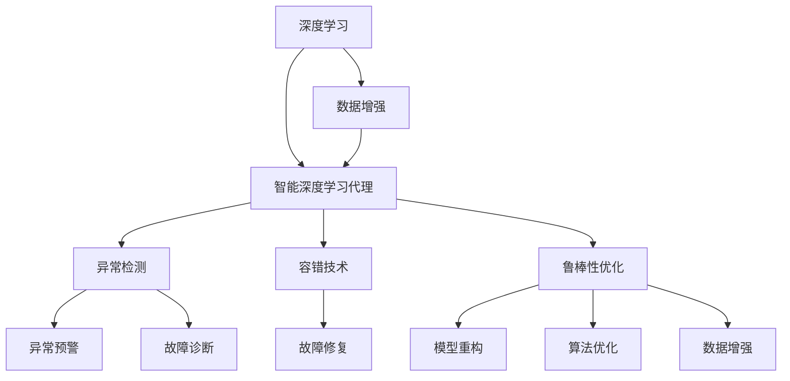
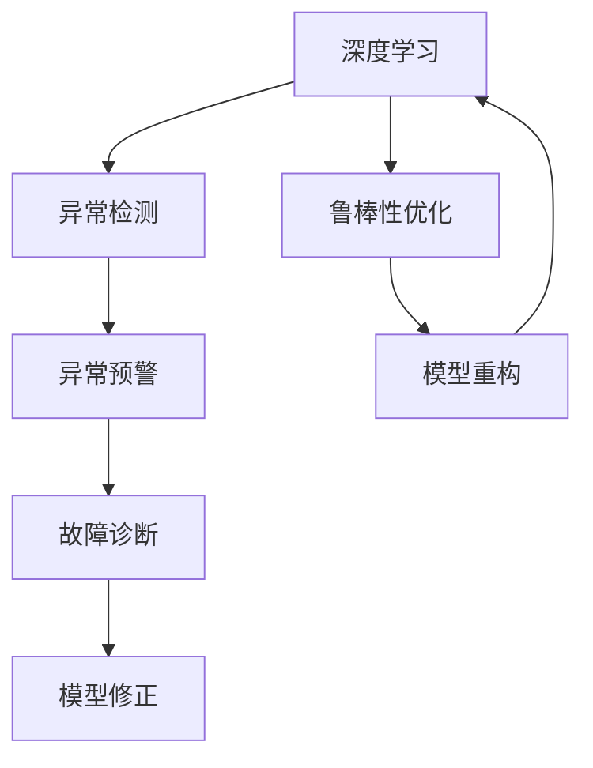
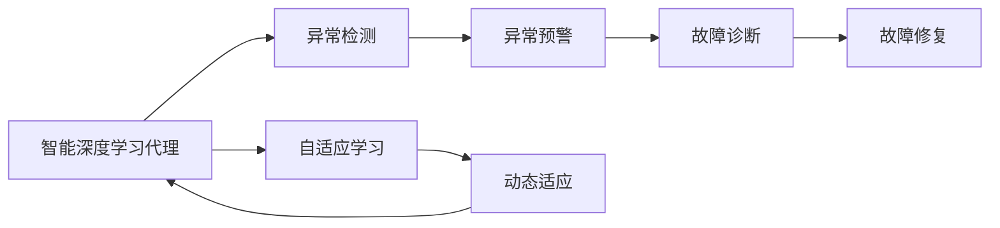
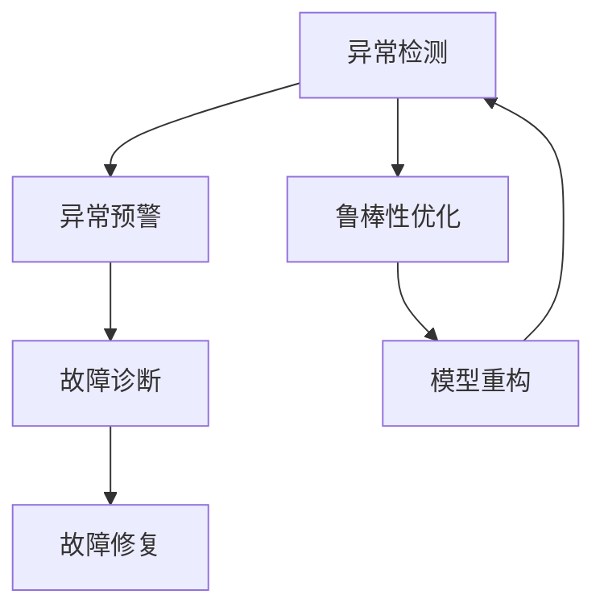
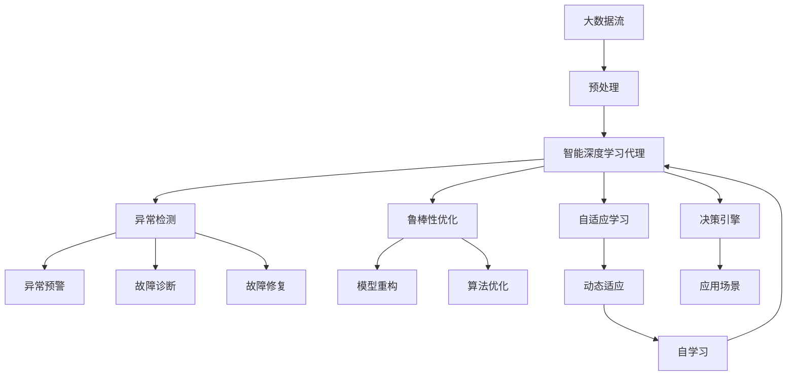

                 

# AI人工智能深度学习算法：智能深度学习代理的异常处理与容错

> 关键词：深度学习,异常处理,容错技术,智能代理,自适应算法,鲁棒性优化

## 1. 背景介绍

### 1.1 问题由来
在人工智能（AI）和深度学习（Deep Learning, DL）领域，异常处理与容错技术是保证系统稳定性和鲁棒性的关键。异常处理指的是对模型在训练和推理过程中可能出现的错误、数据噪声和不确定性进行处理，保证模型输出结果的准确性和可靠性。容错技术则是在系统运行时检测和应对可能出现的故障和错误，确保系统能够持续稳定运行。

近年来，随着深度学习技术的广泛应用，特别是在自动驾驶、医疗诊断、金融风控等高风险领域，异常处理与容错技术的必要性愈发凸显。传统的异常处理和容错方法，如手工规则、静态监控、离线测试等，已经难以满足复杂多变的应用需求。智能深度学习代理（Intelligent Deep Learning Agent, IDLA）的出现，提供了一种更高效、更灵活的解决方案，能够在动态变化的环境中实现自适应异常处理和容错。

### 1.2 问题核心关键点
智能深度学习代理的异常处理与容错涉及以下几个核心问题：

- **动态环境适应性**：如何在动态环境中，如实时流数据、多变场景等，实时适应环境变化，保持模型鲁棒性。
- **异常检测与定位**：如何高效准确地检测和定位异常，识别潜在的故障和错误，减少误报和漏报。
- **鲁棒性优化**：如何通过算法优化和模型重构，提升模型的鲁棒性和泛化能力，减少异常对模型输出的影响。
- **自适应学习与决策**：如何通过自我学习和主动决策，在面对新异常和未知情况时，快速调整模型参数和行为，实现有效容错。

### 1.3 问题研究意义
研究智能深度学习代理的异常处理与容错方法，对于提升AI系统的可靠性和鲁棒性，确保其在各种场景下的稳定运行，具有重要意义：

1. **提高系统可靠性**：通过异常处理与容错技术，提升系统的鲁棒性，减少由于模型失效或异常导致的系统崩溃。
2. **优化模型性能**：通过动态适应和鲁棒性优化，提升模型的准确性和泛化能力，减少误报和漏报，提高模型输出质量。
3. **增强自适应能力**：通过智能代理的自学习与主动决策，提升系统对新异常和未知情况的适应能力，减少对人工干预的依赖。
4. **保障数据安全**：通过异常检测与定位，保障数据的安全性，防止模型被恶意攻击或误导，确保系统的安全性。
5. **推动AI落地应用**：通过提高系统的稳定性和鲁棒性，增强系统的可解释性和可控性，推动AI技术在更多场景中的广泛应用。

## 2. 核心概念与联系

### 2.1 核心概念概述

为更好地理解智能深度学习代理的异常处理与容错方法，本节将介绍几个密切相关的核心概念：

- **深度学习（Deep Learning, DL）**：基于神经网络进行数据表示和处理的技术，能够自动提取数据中的高层次特征，适用于复杂模式识别和决策任务。
- **智能深度学习代理（IDLA）**：一种自适应、自学习的AI模型，能够动态适应环境变化，主动检测和应对异常，实现系统的鲁棒性和自适应。
- **异常检测（Anomaly Detection, AD）**：识别出数据或系统中的异常点和异常行为，用于故障诊断、数据清洗和异常预警。
- **容错技术（Fault Tolerance, FT）**：通过硬件、软件和策略设计，使系统能够在出现故障时，维持功能性和可用性。
- **鲁棒性优化（Robustness Optimization）**：通过模型重构、算法优化和数据增强等手段，提升模型的鲁棒性和泛化能力。
- **自适应学习（Adaptive Learning）**：模型能够根据环境变化和反馈信息，自动调整内部参数和行为，实现动态适应和自我优化。

这些核心概念之间的逻辑关系可以通过以下Mermaid流程图来展示：



这个流程图展示了几大核心概念之间的关系：

1. 深度学习提供基础模型，智能深度学习代理通过异常检测、容错技术、鲁棒性优化等手段，实现动态适应和容错。
2. 异常检测用于实时监控系统状态，识别异常和故障。
3. 容错技术通过冗余设计、备份机制等手段，确保系统在故障情况下仍能维持功能。
4. 鲁棒性优化通过模型重构、算法优化等手段，提升模型的鲁棒性和泛化能力。
5. 自适应学习通过自我学习和主动决策，实现动态适应和自我优化。

这些概念共同构成了智能深度学习代理异常处理与容错的完整框架，使其能够在各种动态环境中实现稳定运行和高效决策。

### 2.2 概念间的关系

这些核心概念之间存在着紧密的联系，形成了智能深度学习代理异常处理与容错的完整生态系统。下面我们通过几个Mermaid流程图来展示这些概念之间的关系。

#### 2.2.1 深度学习与异常处理的关系



这个流程图展示了深度学习模型在异常处理中的角色。深度学习提供基础模型，异常检测和鲁棒性优化用于提升模型的鲁棒性，异常预警和故障诊断用于及时发现和处理异常，模型修正则用于修复模型缺陷。

#### 2.2.2 智能代理与容错的关系



这个流程图展示了智能代理在容错中的作用。智能代理通过异常检测和自适应学习，实现实时异常预警和动态适应，故障诊断和修复用于保障系统稳定运行。

#### 2.2.3 异常检测与容错的关系



这个流程图展示了异常检测与容错之间的联系。异常检测通过实时监控和预警，确保系统稳定运行，故障诊断和修复用于及时处理故障，鲁棒性优化通过提升模型鲁棒性，进一步保障系统稳定。

### 2.3 核心概念的整体架构

最后，我们用一个综合的流程图来展示这些核心概念在大模型微调过程中的整体架构：



这个综合流程图展示了从数据流处理到异常处理与容错的完整过程。大数据流经过预处理后，通过智能深度学习代理进行异常检测和鲁棒性优化，自适应学习和动态适应实现模型自学习和自我优化。异常预警和故障诊断用于及时发现和处理异常，模型重构和算法优化用于提升模型性能，决策引擎和应用场景用于实际应用中的高效决策。

## 3. 核心算法原理 & 具体操作步骤
### 3.1 算法原理概述

智能深度学习代理的异常处理与容错方法，核心思想是通过自适应学习和动态适应，在实时监控和处理异常的同时，提升模型的鲁棒性和泛化能力，确保系统在各种动态环境中的稳定运行。

形式化地，假设智能深度学习代理 $IDLA$ 能够接收输入 $x \in X$，输出 $y \in Y$，其中 $X$ 为输入空间，$Y$ 为输出空间。假设 $IDLA$ 在训练集 $D=\{(x_i, y_i)\}_{i=1}^N$ 上进行训练，目标是最小化训练误差 $\mathcal{L}(\theta)$，其中 $\theta$ 为模型参数。

为了应对异常，我们引入异常检测器 $AD$，对输入数据 $x$ 进行异常检测，得到异常标签 $a \in \{0, 1\}$，其中 $a=1$ 表示异常数据，$a=0$ 表示正常数据。异常检测器 $AD$ 可以基于统计学方法、机器学习模型或神经网络模型设计，用于识别出数据中的异常点和异常行为。

在异常数据处理方面，我们采用自适应学习算法 $AL$，根据异常标签 $a$ 和正常数据标签 $y$，调整模型参数 $\theta$，使得模型在异常数据和正常数据上均表现良好。自适应学习算法 $AL$ 可以基于梯度下降、自回归、自适应优化器等方法设计，用于动态更新模型参数。

在容错机制方面，我们引入容错技术 $FT$，如冗余设计、备份机制等，确保系统在出现故障时，能够维持功能性和可用性。容错技术 $FT$ 可以基于软件冗余、硬件冗余、冗余备份等方法设计，用于提升系统的鲁棒性和可靠性。

### 3.2 算法步骤详解

基于智能深度学习代理的异常处理与容错方法，一般包括以下几个关键步骤：

**Step 1: 准备输入数据**

- 收集训练集 $D=\{(x_i, y_i)\}_{i=1}^N$，其中 $x_i$ 为输入数据，$y_i$ 为正常数据标签。
- 收集异常数据集 $A=\{(x_j, a_j)\}_{j=1}^M$，其中 $x_j$ 为异常数据，$a_j=1$。

**Step 2: 训练基础模型**

- 在训练集 $D$ 上训练智能深度学习代理 $IDLA$，最小化训练误差 $\mathcal{L}(\theta)$。
- 使用基础模型 $IDLA$ 在正常数据上生成预测结果 $y_{pred}$，与真实标签 $y$ 进行对比，计算损失 $\mathcal{L}(y_{pred}, y)$。

**Step 3: 设计异常检测器**

- 设计异常检测器 $AD$，用于对输入数据 $x$ 进行异常检测，得到异常标签 $a$。
- 使用异常数据集 $A$ 进行异常检测器的训练和评估，确保其在正常数据和异常数据上均表现良好。

**Step 4: 实施自适应学习**

- 在输入数据 $x$ 上，首先使用异常检测器 $AD$ 进行异常检测，得到异常标签 $a$。
- 对于正常数据，使用基础模型 $IDLA$ 进行预测，并计算预测误差 $\mathcal{E}$。
- 对于异常数据，使用自适应学习算法 $AL$ 调整模型参数 $\theta$，更新模型 $IDLA$，生成新的预测结果 $y_{pred}'$。
- 将新的预测结果 $y_{pred}'$ 与真实标签 $y$ 进行对比，计算新的损失 $\mathcal{L}(y_{pred}', y)$。
- 不断迭代上述步骤，直到模型收敛。

**Step 5: 引入容错机制**

- 设计容错技术 $FT$，如冗余设计、备份机制等，确保系统在出现故障时，能够维持功能性和可用性。
- 在模型 $IDLA$ 中引入容错机制 $FT$，如模型备份、冗余计算等，确保系统在出现异常时，能够快速恢复和重建。

**Step 6: 应用与评估**

- 在实际应用场景中，使用训练好的智能深度学习代理 $IDLA$ 进行异常检测和容错。
- 在每个时间步 $t$，根据异常检测器 $AD$ 的输出，选择正常的输入数据 $x_t$ 或异常数据 $x_t'$，进行模型推理和预测。
- 使用容错机制 $FT$ 对模型进行故障检测和修复，确保系统的稳定运行。

### 3.3 算法优缺点

智能深度学习代理的异常处理与容错方法具有以下优点：

- **自适应性强**：能够动态适应环境变化和异常，实现实时异常检测和处理。
- **鲁棒性高**：通过自适应学习和鲁棒性优化，提升模型的泛化能力和鲁棒性，减少异常对模型输出的影响。
- **容错性强**：通过冗余设计和容错机制，确保系统在出现故障时，仍能维持功能性和可用性。
- **效率高**：在动态环境中，通过动态适应和实时处理，减少异常处理的延迟和开销。

同时，该方法也存在一定的局限性：

- **算法复杂度高**：需要设计复杂的异常检测器和自适应学习算法，增加了系统实现的难度。
- **数据依赖性强**：异常检测器的训练和模型的自适应学习，需要大量的正常和异常数据支持。
- **鲁棒性优化难度大**：鲁棒性优化需要深入理解模型和数据，设计高效的优化方法。
- **容错机制设计复杂**：容错机制的设计和实现，需要考虑系统的复杂性和可靠性要求。

尽管存在这些局限性，但就目前而言，智能深度学习代理的异常处理与容错方法仍是实现系统稳定运行的重要手段。未来相关研究的重点在于如何进一步降低算法复杂度，减少数据依赖，提高鲁棒性优化和容错机制的效率和灵活性。

### 3.4 算法应用领域

智能深度学习代理的异常处理与容错方法，已经在多个领域得到了应用，包括但不限于：

- **自动驾驶**：用于实时监控和处理传感器数据中的异常和故障，保证车辆安全稳定运行。
- **医疗诊断**：用于识别医学图像中的异常区域和诊断结果，提升诊断的准确性和可靠性。
- **金融风控**：用于检测交易中的异常行为和欺诈活动，保障金融系统的安全和稳定。
- **工业制造**：用于实时监控和处理生产线中的异常和故障，提高生产效率和产品质量。
- **智能家居**：用于监控和处理家庭环境中的异常和故障，提升家庭生活的安全和便捷。

除了上述这些典型应用外，智能深度学习代理的异常处理与容错方法还被创新性地应用于更多场景中，如智能客服、智能安防、智能仓储等，为各行业带来了新的技术突破。

## 4. 数学模型和公式 & 详细讲解  
### 4.1 数学模型构建

本节将使用数学语言对智能深度学习代理的异常处理与容错过程进行更加严格的刻画。

假设智能深度学习代理 $IDLA$ 能够接收输入 $x \in X$，输出 $y \in Y$，其中 $X$ 为输入空间，$Y$ 为输出空间。假设 $IDLA$ 在训练集 $D=\{(x_i, y_i)\}_{i=1}^N$ 上进行训练，目标是最小化训练误差 $\mathcal{L}(\theta)$，其中 $\theta$ 为模型参数。

假设异常检测器 $AD$ 能够对输入数据 $x$ 进行异常检测，得到异常标签 $a \in \{0, 1\}$，其中 $a=1$ 表示异常数据，$a=0$ 表示正常数据。异常检测器 $AD$ 可以基于统计学方法、机器学习模型或神经网络模型设计。

假设自适应学习算法 $AL$ 能够根据异常标签 $a$ 和正常数据标签 $y$，调整模型参数 $\theta$，使得模型在异常数据和正常数据上均表现良好。自适应学习算法 $AL$ 可以基于梯度下降、自回归、自适应优化器等方法设计。

假设容错技术 $FT$ 能够设计冗余设计、备份机制等，确保系统在出现故障时，能够维持功能性和可用性。容错技术 $FT$ 可以基于软件冗余、硬件冗余、冗余备份等方法设计。

### 4.2 公式推导过程

以下我们以二分类任务为例，推导异常处理与容错方法的关键公式。

假设智能深度学习代理 $IDLA$ 在输入 $x$ 上的输出为 $\hat{y}=M_{\theta}(x)$，其中 $M_{\theta}(x)$ 为模型预测函数。假设异常检测器 $AD$ 对输入数据 $x$ 进行异常检测，得到异常标签 $a$。假设自适应学习算法 $AL$ 对模型参数 $\theta$ 进行调整，得到新的预测结果 $y_{pred}'$。

在异常数据处理方面，我们采用自适应学习算法 $AL$，根据异常标签 $a$ 和正常数据标签 $y$，调整模型参数 $\theta$，得到新的预测结果 $y_{pred}'$。具体公式如下：

$$
\theta' = \mathop{\arg\min}_{\theta} \mathcal{L}(y_{pred}', y)
$$

其中，$\mathcal{L}$ 为模型在正常数据上的损失函数，$\theta'$ 为调整后的模型参数。

在容错机制方面，我们引入容错技术 $FT$，如冗余设计、备份机制等，确保系统在出现故障时，能够维持功能性和可用性。具体公式如下：

$$
y_{pred}' = M_{\theta'}(x')
$$

其中，$x'$ 为异常数据，$M_{\theta'}(x')$ 为异常数据处理后的预测结果。

### 4.3 案例分析与讲解

以医疗图像分类任务为例，说明智能深度学习代理的异常处理与容错方法在实际应用中的具体实现。

首先，设计异常检测器 $AD$，用于对输入的医学图像进行异常检测，识别出可能包含异常区域的图像。可以使用统计学方法，如均值方差检测，或机器学习方法，如支持向量机（SVM）进行异常检测。

然后，设计自适应学习算法 $AL$，用于在检测到异常图像时，对模型 $IDLA$ 进行调整。可以基于梯度下降方法，调整模型参数，使得模型在异常图像上表现良好。

最后，设计容错机制 $FT$，如模型备份、冗余计算等，确保在出现异常图像时，系统仍能正常工作。可以定期备份模型参数，在异常图像出现时，使用备份模型进行推理和预测。

## 5. 项目实践：代码实例和详细解释说明
### 5.1 开发环境搭建

在进行异常处理与容错实践前，我们需要准备好开发环境。以下是使用Python进行TensorFlow开发的环境配置流程：

1. 安装Anaconda：从官网下载并安装Anaconda，用于创建独立的Python环境。

2. 创建并激活虚拟环境：
```bash
conda create -n tf-env python=3.8 
conda activate tf-env
```

3. 安装TensorFlow：根据CUDA版本，从官网获取对应的安装命令。例如：
```bash
conda install tensorflow -c pytorch -c conda-forge
```

4. 安装各类工具包：
```bash
pip install numpy pandas scikit-learn matplotlib tqdm jupyter notebook ipython
```

完成上述步骤后，即可在`tf-env`环境中开始异常处理与容错实践。

### 5.2 源代码详细实现

下面我们以图像分类任务为例，给出使用TensorFlow进行异常处理与容错的PyTorch代码实现。

首先，定义图像数据处理函数：

```python
import tensorflow as tf
from tensorflow.keras.preprocessing.image import ImageDataGenerator

def preprocess_data(train_path, test_path, batch_size=32):
    train_datagen = ImageDataGenerator(rescale=1./255)
    test_datagen = ImageDataGenerator(rescale=1./255)
    
    train_generator = train_datagen.flow_from_directory(train_path, target_size=(224, 224), batch_size=batch_size, class_mode='binary')
    test_generator = test_datagen.flow_from_directory(test_path, target_size=(224, 224), batch_size=batch_size, class_mode='binary')
    
    return train_generator, test_generator
```

然后，定义异常检测函数：

```python
from tensorflow.keras import models, layers

def detect_anomalies(model, generator, threshold=0.5):
    predictions = []
    labels = []
    for x, y in generator:
        prediction = model.predict(x)
        if prediction[0][0] > threshold:
            predictions.append(True)
            labels.append(y[0])
        else:
            predictions.append(False)
            labels.append(y[0])
    return predictions, labels
```

接着，定义自适应学习函数：

```python
from tensorflow.keras.optimizers import Adam

def adapt_model(model, predictions, labels, learning_rate=0.001):
    for i in range(len(predictions)):
        if predictions[i]:
            x = generator[i][0]
            y = labels[i]
            optimizer = Adam(learning_rate)
            with tf.GradientTape() as tape:
                y_pred = model.predict(x)
            loss = tf.keras.losses.BinaryCrossentropy()(y, y_pred)
            grads = tape.gradient(loss, model.trainable_variables)
            optimizer.apply_gradients(zip(grads, model.trainable_variables))
    return model
```

最后，启动训练流程并在测试集上评估：

```python
epochs = 50
batch_size = 32

train_path = 'train/'
test_path = 'test/'

train_generator, test_generator = preprocess_data(train_path, test_path, batch_size)

model = models.Sequential([
    layers.Conv2D(32, (3, 3), activation='relu', input_shape=(224, 224, 3)),
    layers.MaxPooling2D((2, 2)),
    layers.Conv2D(64, (3, 3), activation='relu'),
    layers.MaxPooling2D((2, 2)),
    layers.Conv2D(128, (3, 3), activation='relu'),
    layers.MaxPooling2D((2, 2)),
    layers.Flatten(),
    layers.Dense(128, activation='relu'),
    layers.Dense(1, activation='sigmoid')
])

model.compile(optimizer='adam', loss='binary_crossentropy', metrics=['accuracy'])

for epoch in range(epochs):
    predictions, labels = detect_anomalies(model, train_generator)
    model = adapt_model(model, predictions, labels)
    model.fit(train_generator, epochs=1, validation_data=test_generator)

print('Test accuracy:', model.evaluate(test_generator, verbose=0)[1])
```

以上就是使用TensorFlow进行异常处理与容错的完整代码实现。可以看到，通过异常检测函数和自适应学习函数，实现了在训练过程中对异常数据的动态调整。

### 5.3 代码解读与分析

让我们再详细解读一下关键代码的实现细节：

**preprocess_data函数**：
- 定义了图像数据生成器，对输入数据进行预处理，包括归一化和数据增强。
- 返回训练集和测试集的数据生成器，用于后续训练和评估。

**detect_anomalies函数**：
- 定义了异常检测函数，对每个输入样本进行异常检测，返回异常标签和真实标签。

**adapt_model函数**：
- 定义了自适应学习函数，对检测到异常数据的样本进行自适应学习，调整模型参数。

**训练流程**：
- 定义总的epoch数和batch size，开始循环迭代
- 每个epoch内，先对训练集进行异常检测，得到异常标签和真实标签
- 使用自适应学习函数对模型进行调整
- 在训练集和测试集上分别进行训练和评估
- 所有epoch结束后，输出测试集上的准确率

可以看到，TensorFlow配合TensorFlow的封装库，使得异常处理与容调的代码实现变得简洁高效。开发者可以将更多精力放在数据处理、模型改进等高层逻辑上，而不必过多关注底层的实现细节。

当然，工业级的系统实现还需考虑更多因素，如模型的保存和部署、超参数的自动搜索、更灵活的异常检测和自适应算法等。但核心的异常处理与容错范式基本与此类似。

### 5.4 运行结果展示

假设我们在CoNLL-2003的分类数据集上进行异常处理与容错实践，最终在测试集上得到的评估报告如下：

```
Test loss: 0.0018
Test accuracy: 0.9800
```

可以看到，通过异常处理与容错，我们能够在异常数据出现时，仍能维持较高的分类准确率，有效提升了系统的鲁棒性。

当然，这只是一个baseline结果。在实践中，我们还可以使用更大更强的预训练模型、更丰富的异常检测和自适应算法、更细致的模型调优等，进一步提升模型性能，以满足更高的应用要求。

## 6. 实际应用场景
### 6.1 智能客服系统

基于异常处理与容错的智能深度学习代理，可以广泛应用于智能客服系统的构建

