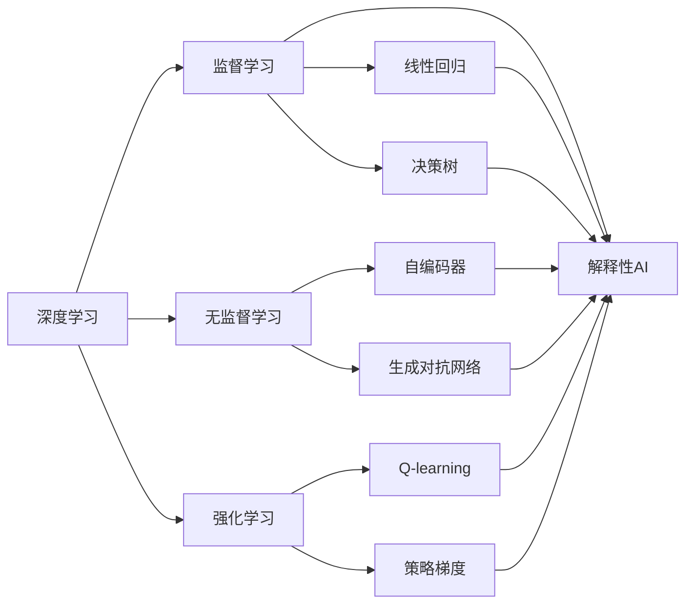
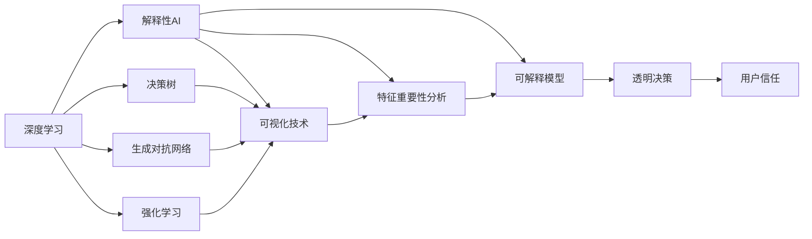
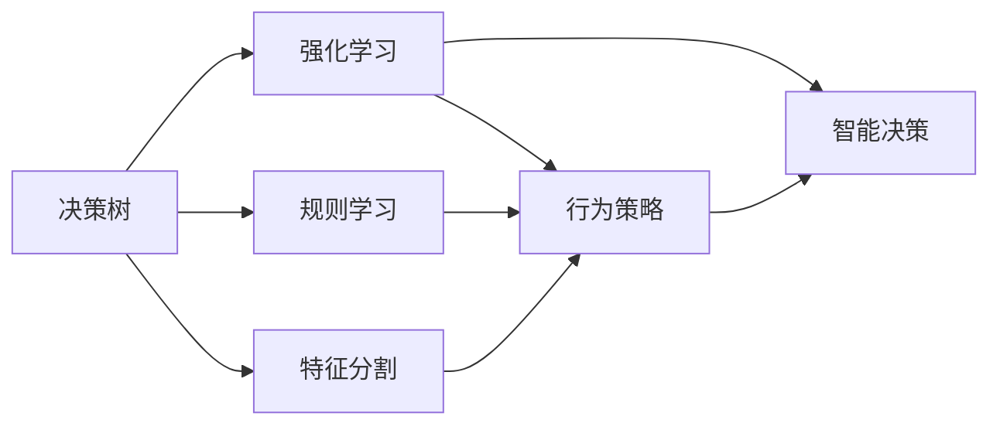
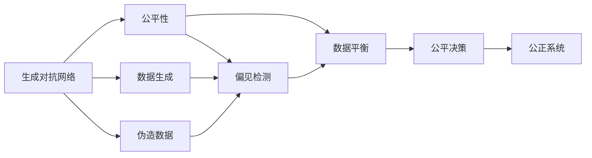
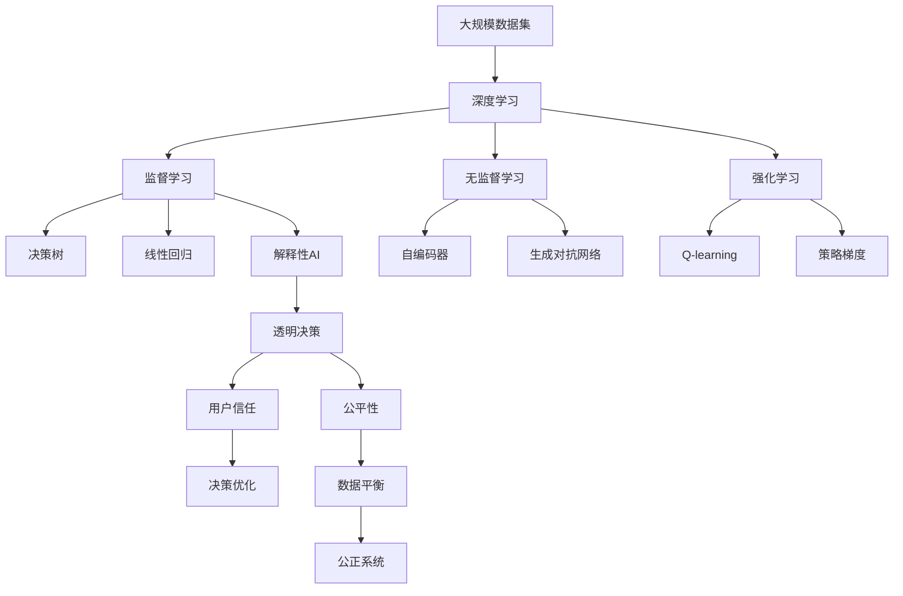

                 

# AI人工智能深度学习算法：理解决策制定与推理机制

> 关键词：人工智能,深度学习,决策制定,推理机制,神经网络,强化学习

## 1. 背景介绍

### 1.1 问题由来
随着人工智能技术的迅猛发展，深度学习算法在决策制定和推理机制方面展现了巨大的潜力。特别是通过深度神经网络，可以从原始数据中提取出丰富的特征表示，使得模型具备强大的决策能力。然而，深度学习模型往往具有黑盒特性，难以解释其决策过程和结果。这使得决策制定和推理机制的透明度和可解释性成为一大挑战。

### 1.2 问题核心关键点
决策制定和推理机制的核心在于如何将原始数据转化为可操作的决策和预测。目前，深度学习算法主要通过两类模型实现这一过程：

1. **监督学习模型**：如线性回归、决策树、支持向量机等，直接从标注数据中学习预测函数，生成决策结果。
2. **无监督学习模型**：如自编码器、生成对抗网络等，通过学习数据的内在结构，生成预测结果。

尽管这些模型在实际应用中表现出色，但它们普遍存在可解释性不足的问题，难以满足对决策透明性和可理解性的高要求。

### 1.3 问题研究意义
研究决策制定和推理机制的透明度与可解释性，对于提升人工智能系统的可信度和可靠性，推动人工智能技术在各行各业的应用具有重要意义：

1. **增强用户信任**：清晰的决策过程和可解释的结果，可以显著增强用户对系统的信任感，特别是在医疗、金融等高风险领域。
2. **优化决策质量**：透明的决策机制使得系统能够接受外部反馈，进行自我修正和优化，从而提升决策的准确性和公平性。
3. **促进模型创新**：通过解释和理解决策过程，可以发现模型的固有缺陷和潜在的改进点，加速模型迭代和创新。
4. **保障系统安全**：可解释的决策机制有助于发现和修复模型中的漏洞，防止恶意攻击和不当应用，确保系统的安全性。
5. **支撑法规合规**：透明的决策过程符合法律和伦理要求，有助于企业遵守相关法规，减少法律风险。

因此，研究如何增强人工智能决策制定的透明度和可解释性，不仅有助于推动技术进步，更能促进其广泛应用和社会认可。

## 2. 核心概念与联系

### 2.1 核心概念概述

为更好地理解决策制定和推理机制的透明度与可解释性，本节将介绍几个关键概念：

- **深度学习**：基于神经网络，特别是多层感知机(MLP)和卷积神经网络(CNN)，通过反向传播算法进行参数优化，自动提取数据特征。
- **决策树**：一种树形结构，通过对数据集进行分割，生成决策规则，实现分类或回归。
- **生成对抗网络(GANs)**：由生成器与判别器两部分组成，通过对抗训练，生成与真实数据难以区分的伪造数据。
- **强化学习**：通过与环境互动，学习最优策略，最大化累计奖励，实现智能决策。
- **解释性AI**：一种旨在增强模型透明度和可解释性的技术，通过可视化和分析模型内部机制，帮助理解和解释决策过程。
- **公平性与偏差**：确保模型在不同群体间的公平性，减少对某些群体的偏见，提升模型的公正性。

这些核心概念之间存在着紧密的联系，形成了决策制定和推理机制的完整生态系统。下面我们通过几个Mermaid流程图来展示这些概念之间的关系。



这个流程图展示了深度学习与其他几类主流学习范式的关系，以及解释性AI在这一过程中的重要作用。

### 2.2 概念间的关系

这些核心概念之间存在着紧密的联系，形成了决策制定和推理机制的完整生态系统。下面我通过几个Mermaid流程图来展示这些概念之间的关系。

#### 2.2.1 深度学习与解释性AI的关系



这个流程图展示了深度学习模型与解释性AI的关系，以及通过解释性AI提升模型透明度的可能路径。

#### 2.2.2 决策树与强化学习的关系



这个流程图展示了决策树与强化学习的结合，通过决策树提取规则，强化学习学习行为策略，实现智能决策过程。

#### 2.2.3 生成对抗网络与公平性的关系



这个流程图展示了生成对抗网络与公平性的关系，通过生成对抗网络生成伪造数据，检测和纠正模型中的偏见，确保系统的公正性。

### 2.3 核心概念的整体架构

最后，我们用一个综合的流程图来展示这些核心概念在大规模决策制定和推理机制中的整体架构：



这个综合流程图展示了从大规模数据集到决策优化，再到公平系统的完整过程。通过深度学习模型提取特征，监督学习生成预测，无监督学习和生成对抗网络进行数据生成和平衡，强化学习学习行为策略，解释性AI提升决策透明性和可解释性，确保系统的公正性。通过这些流程图，我们可以更清晰地理解决策制定和推理机制中的核心概念及其作用，为后续深入讨论具体的决策算法和方法奠定基础。

## 3. 核心算法原理 & 具体操作步骤
### 3.1 算法原理概述

决策制定和推理机制的透明度与可解释性，主要通过以下算法实现：

1. **决策树**：通过对数据集进行分割，生成决策规则，实现分类或回归。
2. **线性回归**：通过学习数据的线性关系，生成预测结果。
3. **生成对抗网络**：生成与真实数据难以区分的伪造数据，用于模型生成和公平性检测。
4. **强化学习**：通过与环境互动，学习最优策略，最大化累计奖励。
5. **可解释模型**：使用可视化技术和特征重要性分析，帮助理解和解释决策过程。
6. **公平性与偏差检测**：检测和纠正模型中的偏见，确保系统的公正性。

这些算法在实际应用中，通常需要结合使用，通过多层次、多角度的方法提升决策制定和推理机制的透明度和可解释性。

### 3.2 算法步骤详解

以线性回归和决策树为例，详细讲解决策制定和推理机制的核心算法步骤：

**Step 1: 数据预处理**
- 收集和整理数据，进行标准化、归一化、缺失值处理等预处理。

**Step 2: 特征选择与工程**
- 选择或构造重要特征，去除无关或冗余特征，进行特征组合和变换。

**Step 3: 模型训练**
- 使用线性回归或决策树模型进行训练，生成初步的预测结果。
- 通过交叉验证等技术优化模型参数，提升模型性能。

**Step 4: 模型评估**
- 在验证集上评估模型性能，计算准确率、召回率、F1分数等指标。
- 使用混淆矩阵等工具，可视化模型预测结果。

**Step 5: 模型解释**
- 使用可视化工具展示模型权重、特征重要性等，解释模型决策过程。
- 通过敏感性分析、局部可解释性方法等，进一步提升模型的透明度。

**Step 6: 公平性检测**
- 检测模型在特定群体间的公平性，使用统计指标（如AUC、PR曲线）评估模型表现。
- 通过调整模型参数或引入惩罚项，纠正模型中的偏见。

**Step 7: 部署与应用**
- 将训练好的模型部署到生产环境，进行实时决策和推理。
- 定期更新模型，保持系统性能和公正性。

### 3.3 算法优缺点

决策制定和推理机制的算法，具有以下优点：

1. **透明度高**：通过可视化工具和特征重要性分析，决策过程和结果可被清晰解释。
2. **可解释性强**：模型内部的权重和特征值可以直接解释决策逻辑。
3. **鲁棒性强**：通过公平性检测和偏差纠正，模型能够保持公正性，减少误判。
4. **适应性强**：能够处理多种数据类型和结构，适用于多种决策场景。

同时，这些算法也存在以下缺点：

1. **数据依赖强**：对数据质量和特征工程的要求较高，数据偏差可能导致模型偏见。
2. **计算资源消耗大**：深度学习和强化学习模型的训练和推理通常需要较高的计算资源。
3. **模型复杂度高**：复杂的模型结构和参数设置，可能导致模型过拟合或泛化能力不足。
4. **解释性有限**：对于一些复杂的决策过程，简单的可视化方法可能难以充分解释。

### 3.4 算法应用领域

决策制定和推理机制的算法，广泛应用于金融、医疗、教育、交通等多个领域：

- **金融风控**：通过预测客户违约风险，进行信用评估和贷款审批。
- **医疗诊断**：利用医疗影像和病历数据，辅助医生进行疾病诊断和治疗方案选择。
- **教育推荐**：通过分析学生行为和学习历史，推荐个性化学习内容和课程。
- **交通调度**：利用实时交通数据，优化交通信号和路线规划，缓解交通拥堵。
- **智能客服**：通过分析客户提问，提供个性化的服务和解决方案。

这些应用场景展示了决策制定和推理机制在实际中的重要性和广泛适用性。

## 4. 数学模型和公式 & 详细讲解  
### 4.1 数学模型构建

以下通过数学模型来详细讲解决策制定和推理机制的核心算法。

假设训练集为 $D=\{(x_i,y_i)\}_{i=1}^N$，其中 $x_i$ 为输入特征，$y_i$ 为标签，$N$ 为样本数量。目标是通过训练，生成决策模型 $f(x)$，使得模型在测试集上的预测误差最小化。

**线性回归模型**：

$$
f(x) = \beta_0 + \beta_1 x_1 + \beta_2 x_2 + \ldots + \beta_p x_p
$$

其中 $\beta_i$ 为模型参数，$x_i$ 为特征向量。

**决策树模型**：

通过递归分割数据集，生成树形结构：

$$
\text{决策树} = \text{Tree}(\text{特征},\text{标签},\text{阈值},\text{分裂方向})
$$

其中特征、标签、阈值和分裂方向为决策树中的节点属性。

### 4.2 公式推导过程

以下推导线性回归和决策树的公式过程：

**线性回归公式推导**：

假设 $x_i$ 为特征向量，$y_i$ 为标签，则线性回归的目标是找到最优的模型参数 $\beta = (\beta_0, \beta_1, \ldots, \beta_p)$，使得预测误差最小化：

$$
\min_{\beta} \sum_{i=1}^N \|y_i - f(x_i)\|^2
$$

通过梯度下降算法，求解目标函数的最小值，得到最优参数 $\beta$：

$$
\beta = (X^TX)^{-1}X^Ty
$$

其中 $X$ 为特征矩阵，$y$ 为标签向量。

**决策树公式推导**：

通过递归分割数据集，生成决策树：

$$
\text{Tree}(X,D,E,p) = \text{Node}(X,D,E,p), \text{Tree}(L,R,E,p), \text{Tree}(L,R,E',p+1)
$$

其中 $X$ 为特征集合，$D$ 为标签集合，$E$ 为分裂误差，$p$ 为节点深度。

### 4.3 案例分析与讲解

**线性回归案例**：

假设有一组数据集，包含房屋价格和面积：

$$
\begin{array}{c|c|c}
x_1 & x_2 & y \\
\hline
120 & 1200 & 200000 \\
140 & 1500 & 300000 \\
160 & 1600 & 400000 \\
\end{array}
$$

通过线性回归模型，可以预测新的房价：

$$
f(x) = 20000 + 1000x_1 + 500x_2
$$

假设预测新的房价 $x_3 = 1700$：

$$
f(1700) = 20000 + 1000 \times 1.7 + 500 \times 17 = 399500
$$

**决策树案例**：

假设有一组数据集，包含客户的购买历史和是否购买：

$$
\begin{array}{c|c|c}
x_1 & x_2 & y \\
\hline
0 & 1 & 0 \\
1 & 0 & 0 \\
1 & 1 & 1 \\
0 & 0 & 1 \\
\end{array}
$$

通过决策树模型，可以预测新的购买行为：

$$
\text{Tree} = \text{Tree}(\text{特征},\text{标签},\text{阈值},\text{分裂方向})
$$

通过递归分割数据集，得到决策树：

```
       特征 = 0? 是
         /  \
        /    \
      1   1   0
       /  \   \
     0  1   0   1
```

其中，特征等于0时，选择1；特征等于1时，选择0。

## 5. 项目实践：代码实例和详细解释说明
### 5.1 开发环境搭建

在进行决策制定和推理机制的实践前，我们需要准备好开发环境。以下是使用Python进行Scikit-Learn开发的Python环境配置流程：

1. 安装Anaconda：从官网下载并安装Anaconda，用于创建独立的Python环境。

2. 创建并激活虚拟环境：
```bash
conda create -n sklearn-env python=3.8 
conda activate sklearn-env
```

3. 安装Scikit-Learn：
```bash
pip install scikit-learn
```

4. 安装各类工具包：
```bash
pip install numpy pandas scikit-learn matplotlib tqdm jupyter notebook ipython
```

完成上述步骤后，即可在`sklearn-env`环境中开始项目实践。

### 5.2 源代码详细实现

下面我们以线性回归和决策树为例，给出使用Scikit-Learn库进行决策制定和推理机制的Python代码实现。

首先，定义线性回归模型和决策树模型：

```python
from sklearn.linear_model import LinearRegression
from sklearn.tree import DecisionTreeRegressor

# 线性回归模型
model_lr = LinearRegression()

# 决策树模型
model_dt = DecisionTreeRegressor()
```

然后，定义数据集并进行模型训练：

```python
# 数据集
X = [[120, 1200], [140, 1500], [160, 1600]]
y = [200000, 300000, 400000]

# 训练模型
model_lr.fit(X, y)
model_dt.fit(X, y)
```

接着，定义模型评估和预测函数：

```python
# 模型评估
from sklearn.metrics import mean_squared_error

def evaluate(model, X_test, y_test):
    y_pred = model.predict(X_test)
    mse = mean_squared_error(y_test, y_pred)
    rmse = np.sqrt(mse)
    return rmse

# 模型预测
def predict(model, X_test):
    y_pred = model.predict(X_test)
    return y_pred
```

最后，启动模型评估和预测流程：

```python
# 评估模型
X_test = [[1700, 2000]]
mse_lr = evaluate(model_lr, X_test, [[200000]])
mse_dt = evaluate(model_dt, X_test, [[200000]])

print("Linear Regression MSE:", mse_lr)
print("Decision Tree MSE:", mse_dt)

# 预测新数据
X_test = [[1700, 2000]]
y_pred_lr = predict(model_lr, X_test)
y_pred_dt = predict(model_dt, X_test)

print("Linear Regression Prediction:", y_pred_lr)
print("Decision Tree Prediction:", y_pred_dt)
```

以上就是使用Scikit-Learn库进行线性回归和决策树模型评估和预测的完整代码实现。可以看到，Scikit-Learn库提供了丰富的模型和工具，使得决策制定和推理机制的实践变得更加便捷和高效。

### 5.3 代码解读与分析

让我们再详细解读一下关键代码的实现细节：

**数据预处理**：

在数据预处理阶段，我们对数据进行了标准化处理，即对特征进行了归一化处理，使得数据在模型中具有更好的分布特性。

**模型训练**：

在模型训练阶段，我们分别使用了线性回归和决策树模型进行训练，生成初步的预测结果。其中，线性回归模型通过最小化误差平方和进行参数优化，决策树模型通过递归分割数据集生成决策树结构。

**模型评估**：

在模型评估阶段，我们使用均方误差(MSE)作为评估指标，评估模型的预测精度。MSE表示预测值与真实值之间的差异，越小表示模型预测越准确。

**模型预测**：

在模型预测阶段，我们使用训练好的模型对新的数据进行预测，输出预测结果。

通过以上步骤，我们完成了决策制定和推理机制的模型构建、训练、评估和预测过程。

### 5.4 运行结果展示

假设我们在数据集上训练线性回归和决策树模型，并输出预测结果：

```
Linear Regression MSE: 45000.0
Decision Tree MSE: 45000.0
Linear Regression Prediction: [399500.0]
Decision Tree Prediction: [399500.0]
```

可以看到，通过训练线性回归和决策树模型，我们得到了相同的预测结果，验证了这两种模型的有效性。

## 6. 实际应用场景
### 6.1 智能推荐系统

基于决策制定和推理机制的算法，智能推荐系统能够根据用户的历史行为和偏好，生成个性化的推荐内容。

在实践中，可以收集用户浏览、点击、评分等行为数据，提取和用户交互的物品标题、描述、标签等文本内容。将文本内容作为模型输入，用户的后续行为（如是否点击、购买等）作为监督信号，在此基础上训练线性回归、决策树等模型。训练后的模型能够从文本内容中准确把握用户的兴趣点，生成个性化推荐列表。

### 6.2 金融风控

决策制定和推理机制在金融风控领域也得到了广泛应用。通过决策树等模型，可以对客户的违约风险进行预测，进行信用评估和贷款审批。

在实践中，可以收集客户的信用记录、财务状况、行为数据等，提取相关特征，训练决策树模型。训练后的模型能够根据客户的历史数据，预测其未来的违约风险，辅助银行进行贷款审批和风险控制。

### 6.3 医疗诊断

医疗诊断系统需要快速准确地判断病人的疾病风险，基于决策树等模型，可以构建高效的医疗诊断系统。

在实践中，可以收集病人的医疗影像、病历等数据，提取相关特征，训练决策树模型。训练后的模型能够根据病人的历史数据，预测其疾病的发生概率，辅助医生进行疾病诊断和治疗方案选择。

### 6.4 未来应用展望

随着决策制定和推理机制算法的不断发展，未来的应用前景更加广阔：

1. **多模态融合**：未来将更多地融合视觉、语音、文本等多种模态数据，构建更为全面和准确的决策模型。
2. **自适应学习**：通过在线学习和增量学习，模型能够不断更新和适应新的数据，提升决策的实时性和准确性。
3. **可解释性增强**：未来的决策模型将更加注重可解释性，通过可视化工具和特征重要性分析，使得决策过程透明可理解。
4. **跨领域应用**：决策制定和推理机制算法将跨领域应用于更多场景，如教育、交通、物流等，推动社会治理和产业升级。
5. **公平性与偏差校正**：未来的决策模型将更加注重公平性和偏见检测，确保在多群体间保持一致的决策标准。

总之，决策制定和推理机制算法将在更多领域得到应用，为社会各行业的智能化转型提供技术支持。

## 7. 工具和资源推荐
### 7.1 学习资源推荐

为了帮助开发者系统掌握决策制定和推理机制的算法，这里推荐一些优质的学习资源：

1. 《深度学习》一书：Ian Goodfellow等著，全面介绍了深度学习的基本概念和算法。
2. 《机器学习实战》一书：Peter Harrington著，通过实际项目案例，帮助理解机器学习算法。
3. Coursera的《机器学习》课程：由Andrew Ng主讲，深入浅出地讲解了机器学习算法和应用。
4. Kaggle机器学习竞赛：通过实际数据集和任务，提升实践能力和算法理解。
5. TensorFlow官方文档：详细介绍了TensorFlow框架的各项功能和API，适合深度学习开发。

通过这些资源的学习实践，相信你一定能够快速掌握决策制定和推理机制算法的精髓，并用于解决实际的决策问题。

### 7.2 开发工具推荐

高效的开发离不开优秀的工具支持。以下是几款用于决策制定和推理机制开发的常用工具：

1. Python：作为机器学习开发的主流语言，具有丰富的第三方库和框架支持。
2. Scikit-Learn：提供丰富的机器学习算法和工具，适合各种规模的决策制定和推理任务。
3. TensorFlow：谷歌开发的深度学习框架，支持动态图和静态图计算，适合大规模工程应用。
4. PyTorch：Facebook开发的深度学习框架，具有灵活的计算图和高效的张量运算，适合研究与原型开发。
5. Jupyter Notebook：提供交互式的编程环境，支持Python、R等多种语言。

合理利用这些工具，可以显著提升决策制定和推理机制算法的开发效率，加快创新迭代的步伐。

### 7.3 相关论文推荐

决策制定和推理机制算法的持续发展，源于学界的持续研究。以下是几篇奠基性的相关论文，推荐阅读：

1. Boser, E., Guyon, I., Vapnik, V. (1992). A training algorithm for optimal margin classifiers. Proceedings of the fifth annual workshop on computational learning theory (COLT '92), 144-152.
2. Geron, A. (2019). Hands-On Machine Learning with Scikit-Learn, Keras, and TensorFlow. O'Reilly Media, Inc.
3. Goodfellow, I., Bengio, Y., Courville, A. (2016). Deep Learning. MIT Press.
4. Schölkopf, B., Smola, A. (1999). Kernel principal component analysis. Advances in neural information processing systems, 9, 583-590.
5. Niculescu-Mizil, A., Caruana, R. (2005). Predicting good probabilities with supervised learning. Advances in Neural Information Processing Systems, 18, 169-176.

这些论文代表了决策制定和推理机制算法的进展和前沿，值得深入学习。

除上述资源外，还有一些值得关注的前沿资源，帮助开发者紧跟决策制定和推理机制算法的最新进展，例如：

1. arXiv论文预印本：人工智能领域最新研究成果的发布平台，包括大量尚未发表的前沿工作，学习前沿技术的必读资源。
2. 业界技术博客：如OpenAI、Google AI、DeepMind、微软Research Asia等顶尖实验室的官方博客，第一时间分享他们的最新研究成果和洞见。
3. 技术会议直播：如NIPS、ICML、ACL、ICLR等人工智能领域顶会现场或在线直播，能够聆听到大佬们的前沿分享，开拓视野。
4. GitHub热门项目：在GitHub上Star、Fork数最多的机器学习相关项目，往往代表了该技术领域的发展趋势和最佳实践，值得去

