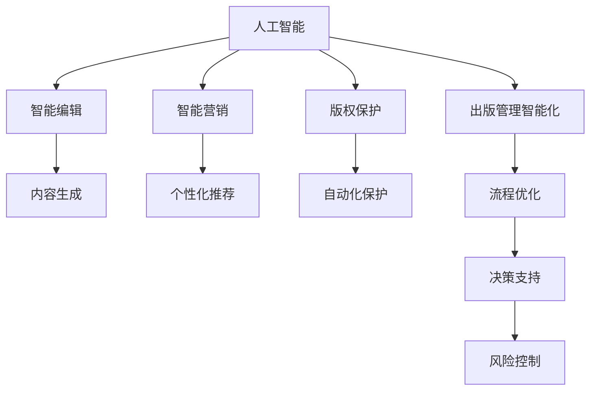
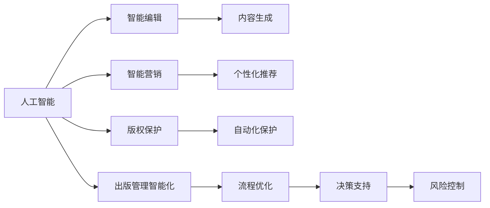
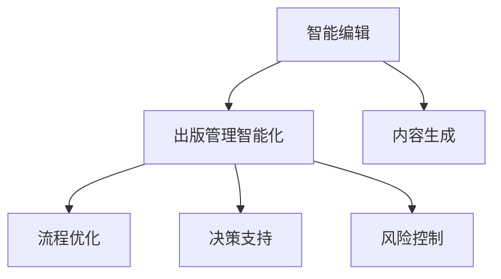
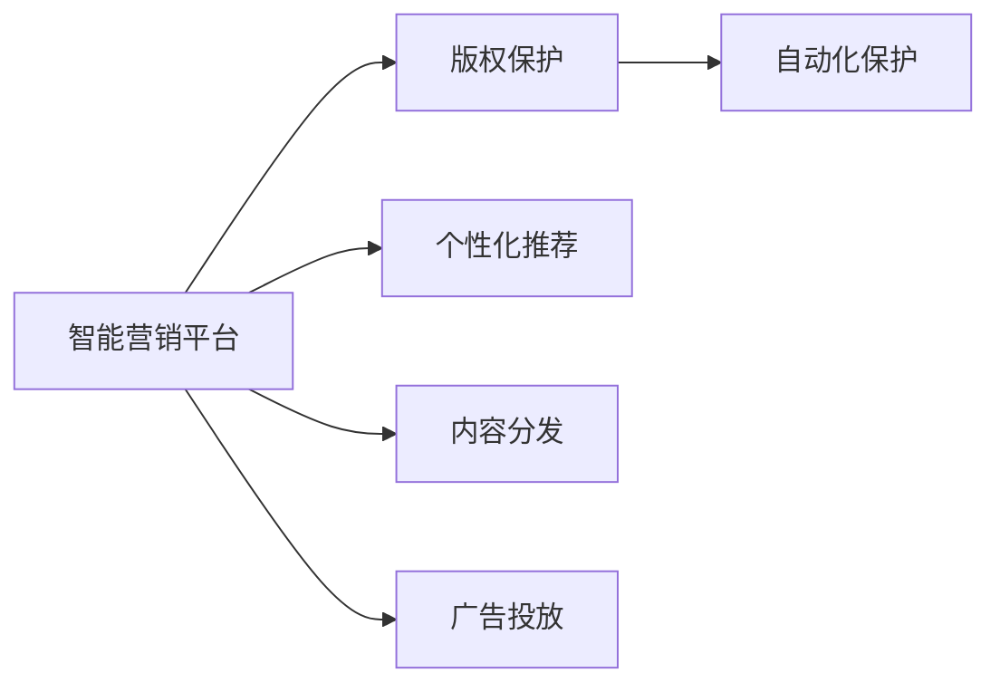

                 

# AI出版业前景：丰富的场景，强大的技术应用

> 关键词：人工智能,出版业,出版管理,内容生成,版权保护,智能编辑,智能营销,出版业数字化

## 1. 背景介绍

### 1.1 问题由来
随着信息技术的高速发展，传统出版业面临着前所未有的变革和挑战。数字化浪潮带来了出版业生态的深度重塑，从内容生产、编辑校对、版权保护、发行流通到读者阅读，各环节均有机会借助人工智能技术实现智能化升级。AI出版业作为人工智能在出版领域的应用场景之一，正在为出版业带来革命性的变革。

近年来，AI技术在出版业的应用逐步深入，从简单的自动化排版、校对，到复杂的智能编辑、版权保护、智能营销等，AI出版业展现出巨大的潜力和广阔的发展前景。智能编辑系统可根据作者初稿进行智能修订，提出修改建议，大大提升出版效率。版权保护技术可通过区块链、数字水印等手段，保护原创作品的合法权益，防止盗版侵权。智能营销平台能够利用大数据分析用户阅读习惯，精准推荐图书，提升营销效果。出版业数字化转型进程中，AI技术扮演着越来越重要的角色，推动着传统出版业向智能出版业迈进。

### 1.2 问题核心关键点
AI出版业的核心在于利用人工智能技术，结合出版业的业务场景，提高出版效率、提升内容质量、保护版权权益、优化读者体验。具体核心关键点包括：
1. **出版管理智能化**：利用AI技术优化出版流程管理，提高决策效率。
2. **内容生成自动化**：借助自然语言处理、图像生成等技术，提升内容创作效率和质量。
3. **版权保护自动化**：通过区块链、数字水印等技术，实现版权的自动化保护。
4. **智能编辑系统**：开发智能编辑工具，辅助作者进行内容修订和优化。
5. **智能营销平台**：基于大数据分析，实现精准营销，提升出版物市场竞争力。

### 1.3 问题研究意义
深入研究AI出版业的前景，对于推动出版业的智能化转型，提升出版物质量，保护作者权益，拓展出版业市场具有重要意义。具体表现为：
1. **提升出版效率**：智能技术的应用，极大提升了出版流程的管理效率和内容创作的自动化水平，减少了人工干预，缩短了出版周期。
2. **丰富出版内容**：AI技术可以辅助生成高质量的内容，拓展出版物的形式和类型，丰富出版业的内容生态。
3. **强化版权保护**：自动化版权保护技术，有效遏制盗版侵权行为，保护原创作品的合法权益。
4. **精准营销**：智能营销平台能够基于用户行为数据，精准推送个性化推荐，提高出版物的市场影响力和销售业绩。
5. **推动数字化转型**：AI技术在出版业的广泛应用，加速了出版业的数字化转型进程，推动了出版业的持续创新。

## 2. 核心概念与联系

### 2.1 核心概念概述

为更好地理解AI出版业的发展前景，本节将介绍几个关键的核心概念：

- **人工智能(AI)**：通过计算机模拟人脑功能，实现感知、学习、决策等智能行为的综合性技术。在出版业中，AI可以应用于内容生成、编辑校对、版权保护、营销等多个环节。

- **出版业数字化**：通过数字化技术，将传统出版业务流程、内容传播方式、读者互动模式进行转型升级，实现全流程的数字化和智能化。

- **智能编辑系统**：利用自然语言处理、机器学习等技术，辅助作者进行内容修订、风格优化、情感表达等，提升内容的创新性和质量。

- **版权保护**：通过区块链、数字水印、智能合约等技术手段，保护原创作品不被非法复制、分发和修改，保障作者的合法权益。

- **智能营销平台**：基于大数据分析，提供精准营销方案，包括个性化推荐、内容分发、广告投放等，提升出版物的市场曝光率和销售转化率。

- **出版管理智能化**：通过AI技术，优化出版流程管理，实现决策支持、风险控制、供应链管理等，提升出版企业的运营效率和竞争力。

这些核心概念之间的逻辑关系可以通过以下Mermaid流程图来展示：



这个流程图展示了AI出版业的核心概念及其之间的关系：

1. AI技术是基础，可以应用于内容生成、编辑、版权保护、营销等多个环节。
2. 智能编辑系统可以提升内容质量，智能营销平台可以提升市场竞争力，版权保护可以保护作者的合法权益。
3. 出版管理智能化有助于优化出版流程，提升运营效率和决策能力。

### 2.2 概念间的关系

这些核心概念之间存在着紧密的联系，形成了AI出版业的整体生态系统。下面通过几个Mermaid流程图来展示这些概念之间的关系。

#### 2.2.1 人工智能与出版业的融合



这个流程图展示了AI技术在出版业中的应用范围：

1. 人工智能作为基础技术，可以支撑智能编辑、智能营销、版权保护和出版管理智能化的各个环节。
2. 智能编辑通过提升内容质量，为出版物增加附加值；智能营销通过精准推荐提升市场竞争力；版权保护通过自动化手段保护作者权益；出版管理智能化通过优化流程，提升运营效率。

#### 2.2.2 智能编辑系统与出版管理智能化



这个流程图展示了智能编辑系统与出版管理智能化的关系：

1. 智能编辑系统通过提升内容质量，帮助作者创作出更吸引人的作品。
2. 出版管理智能化通过优化出版流程、决策支持、风险控制等，提升出版企业的运营效率和竞争力。

#### 2.2.3 智能营销平台与版权保护



这个流程图展示了智能营销平台与版权保护的关系：

1. 智能营销平台通过精准推荐、内容分发、广告投放等手段，提升出版物的市场影响力和销售业绩。
2. 版权保护通过自动化手段，保护原创作品的合法权益，防止盗版侵权。

## 3. 核心算法原理 & 具体操作步骤
### 3.1 算法原理概述

AI出版业的核心算法原理主要集中在以下几个方面：

1. **自然语言处理(NLP)**：通过文本分析、语义理解、情感分析等技术，辅助内容生成和编辑校对。
2. **机器学习**：利用监督学习、无监督学习等方法，训练智能编辑模型和推荐模型。
3. **区块链技术**：通过分布式账本和智能合约，实现版权的自动化保护。
4. **大数据分析**：基于用户行为数据，实现精准营销和个性化推荐。
5. **深度学习**：通过卷积神经网络(CNN)、循环神经网络(RNN)等，处理图像和语音数据，提升出版物的形式和表现力。

这些技术的应用，使得AI出版业在出版管理、内容生成、版权保护、智能营销等各个环节实现了智能化升级。

### 3.2 算法步骤详解

AI出版业的算法步骤通常包括以下几个关键步骤：

**Step 1: 数据准备**
- 收集出版业的业务数据，包括文本、图像、音频等各类数据。
- 对数据进行清洗、标注，构建训练集、验证集和测试集。

**Step 2: 模型训练**
- 选择合适的模型架构，如BERT、GPT等预训练模型，并进行微调。
- 在训练集上训练模型，优化损失函数，最小化预测误差。

**Step 3: 模型评估与优化**
- 在验证集上评估模型性能，调整超参数，优化模型效果。
- 使用测试集进行最终评估，确保模型在实际应用中表现良好。

**Step 4: 部署与应用**
- 将训练好的模型部署到生产环境中，进行实际应用。
- 根据用户反馈和业务需求，持续优化模型和应用流程。

### 3.3 算法优缺点

AI出版业的算法具有以下优点：
1. **效率提升**：智能化流程大大提升了出版效率，减少了人工干预。
2. **质量提升**：AI技术能够提升内容质量和创新性，满足读者更高的需求。
3. **版权保护**：自动化版权保护技术有效遏制盗版侵权，保护原创权益。
4. **精准营销**：基于大数据分析的精准营销，提升出版物的市场竞争力和销售业绩。

但同时也存在一些缺点：
1. **依赖高质量数据**：AI技术依赖大量的高质量标注数据，数据获取和处理成本较高。
2. **算法复杂性**：部分算法如深度学习，模型复杂度高，训练和部署成本较大。
3. **技术风险**：AI技术存在误判和过拟合的风险，需要持续优化和监控。
4. **隐私问题**：大数据分析和用户行为追踪可能涉及隐私问题，需要加强数据保护。

### 3.4 算法应用领域

AI出版业的应用领域广泛，涵盖了出版业的各个环节：

- **内容生成**：通过自然语言处理和生成模型，辅助作者创作高质量的内容。
- **编辑校对**：利用AI技术进行文本自动校对，提升编辑效率和准确性。
- **版权保护**：通过区块链和数字水印技术，实现版权的自动化保护。
- **智能编辑系统**：结合AI技术和人工编辑，辅助作者进行内容修订和优化。
- **智能营销平台**：基于大数据分析，提供精准营销方案，提升出版物市场竞争力。
- **出版管理智能化**：利用AI技术优化出版流程管理，提升运营效率和决策能力。

这些应用场景不仅覆盖了出版业的核心业务，还拓展了出版物的形式和内容，提升了出版业的智能化水平。

## 4. 数学模型和公式 & 详细讲解 & 举例说明

### 4.1 数学模型构建

在AI出版业中，常用的数学模型包括文本分类、情感分析、内容生成等。以下是几个核心模型的数学模型构建：

#### 4.1.1 文本分类模型
文本分类模型通常采用卷积神经网络(CNN)或循环神经网络(RNN)，对文本进行分类。其数学模型构建如下：

$$
\hat{y} = \sigma(W_{\text{class}}x + b_{\text{class}})
$$

其中，$x$ 为输入文本，$\hat{y}$ 为模型预测的类别概率，$W_{\text{class}}$ 和 $b_{\text{class}}$ 为模型的可学习参数。

#### 4.1.2 情感分析模型
情感分析模型通常采用LSTM或GRU等序列模型，对文本情感进行分类。其数学模型构建如下：

$$
\hat{y} = \sigma(W_{\text{emotion}}x + b_{\text{emotion}})
$$

其中，$x$ 为输入文本，$\hat{y}$ 为模型预测的情感类别概率，$W_{\text{emotion}}$ 和 $b_{\text{emotion}}$ 为模型的可学习参数。

#### 4.1.3 内容生成模型
内容生成模型通常采用生成对抗网络(GAN)或变分自编码器(VAE)，生成高质量的内容。其数学模型构建如下：

$$
z \sim N(0, 1)
$$

$$
x = G(z)
$$

其中，$z$ 为噪声向量，$x$ 为生成的文本或图像，$G$ 为生成器。

### 4.2 公式推导过程

以下以文本分类模型为例，推导其损失函数和梯度计算公式。

**损失函数**：

文本分类模型的损失函数通常采用交叉熵损失函数，即：

$$
\mathcal{L} = -\frac{1}{N}\sum_{i=1}^N \sum_{j=1}^C y_{ij}\log \hat{y}_{ij}
$$

其中，$N$ 为样本数量，$C$ 为类别数，$y_{ij}$ 为样本 $i$ 的真实类别，$\hat{y}_{ij}$ 为模型预测的类别概率。

**梯度计算**：

根据链式法则，模型参数 $W_{\text{class}}$ 和 $b_{\text{class}}$ 的梯度计算如下：

$$
\frac{\partial \mathcal{L}}{\partial W_{\text{class}}} = \frac{1}{N}\sum_{i=1}^N \sum_{j=1}^C \frac{y_{ij}}{\hat{y}_{ij}}(x_{i})
$$

$$
\frac{\partial \mathcal{L}}{\partial b_{\text{class}}} = \frac{1}{N}\sum_{i=1}^N \sum_{j=1}^C \frac{y_{ij}}{\hat{y}_{ij}}
$$

其中，$x_{i}$ 为输入文本的特征向量。

### 4.3 案例分析与讲解

假设我们有一组图书的文本数据，需要对其进行情感分类。根据上述模型和公式，我们可以对图书的情感进行分类，如下所示：

1. 构建文本分类模型，选择LSTM作为分类器。
2. 在训练集上训练模型，使用交叉熵损失函数进行优化。
3. 在验证集上评估模型性能，调整超参数。
4. 在测试集上进行最终评估，确保模型的泛化性能。

通过上述步骤，我们可以构建一个高效的文本情感分类模型，对图书的情感进行自动分类，从而辅助出版商进行内容选择和推荐。

## 5. 项目实践：代码实例和详细解释说明
### 5.1 开发环境搭建

在进行AI出版业的应用开发前，我们需要准备好开发环境。以下是使用Python进行TensorFlow开发的环境配置流程：

1. 安装Anaconda：从官网下载并安装Anaconda，用于创建独立的Python环境。

2. 创建并激活虚拟环境：
```bash
conda create -n tf-env python=3.8 
conda activate tf-env
```

3. 安装TensorFlow：根据CUDA版本，从官网获取对应的安装命令。例如：
```bash
conda install tensorflow -c tf -c conda-forge
```

4. 安装各类工具包：
```bash
pip install numpy pandas scikit-learn matplotlib tqdm jupyter notebook ipython
```

完成上述步骤后，即可在`tf-env`环境中开始AI出版业的应用开发。

### 5.2 源代码详细实现

下面我们以文本情感分类为例，给出使用TensorFlow对LSTM模型进行情感分类的PyTorch代码实现。

首先，定义数据处理函数：

```python
import tensorflow as tf
from tensorflow.keras.datasets import imdb
from tensorflow.keras.preprocessing.sequence import pad_sequences

# 加载IMDB数据集
(x_train, y_train), (x_test, y_test) = imdb.load_data(num_words=10000)

# 对文本进行截断和填充
x_train = pad_sequences(x_train, maxlen=120)
x_test = pad_sequences(x_test, maxlen=120)

# 对标签进行独热编码
y_train = tf.keras.utils.to_categorical(y_train, 2)
y_test = tf.keras.utils.to_categorical(y_test, 2)
```

然后，定义模型和优化器：

```python
from tensorflow.keras.models import Sequential
from tensorflow.keras.layers import Embedding, LSTM, Dense

# 定义LSTM模型
model = Sequential()
model.add(Embedding(10000, 128))
model.add(LSTM(128))
model.add(Dense(2, activation='softmax'))

# 编译模型
model.compile(loss='categorical_crossentropy', optimizer='adam', metrics=['accuracy'])
```

接着，定义训练和评估函数：

```python
from tensorflow.keras.callbacks import EarlyStopping
from tensorflow.keras.preprocessing.sequence import pad_sequences

def train_epoch(model, x_train, y_train, batch_size, optimizer):
    model.fit(x_train, y_train, batch_size=batch_size, epochs=1, validation_split=0.2)
    return model.evaluate(x_test, y_test, batch_size=batch_size)

def evaluate(model, x_test, y_test, batch_size):
    return model.evaluate(x_test, y_test, batch_size=batch_size)
```

最后，启动训练流程并在测试集上评估：

```python
epochs = 10
batch_size = 64

for epoch in range(epochs):
    loss, accuracy = train_epoch(model, x_train, y_train, batch_size, optimizer)
    print(f"Epoch {epoch+1}, train loss: {loss:.3f}, train accuracy: {accuracy:.3f}")

    print(f"Epoch {epoch+1}, test results:")
    evaluate(model, x_test, y_test, batch_size)
```

以上就是使用TensorFlow对LSTM模型进行情感分类的完整代码实现。可以看到，TensorFlow提供了强大的高层次API，使得模型构建和训练变得简洁高效。

### 5.3 代码解读与分析

让我们再详细解读一下关键代码的实现细节：

**数据处理函数**：
- 加载IMDB数据集，将文本数据和标签加载到`x_train`、`y_train`、`x_test`、`y_test`四个变量中。
- 对文本进行截断和填充，使其长度一致，便于模型处理。
- 对标签进行独热编码，将其转换为模型可以处理的格式。

**模型定义与编译**：
- 定义一个包含嵌入层、LSTM层和全连接层的序列模型。
- 编译模型时选择交叉熵损失函数和Adam优化器，同时设置评估指标为准确率。

**训练和评估函数**：
- 使用Keras的`fit`方法进行模型训练，同时设置早期停止策略。
- 在验证集上评估模型性能，并返回模型评估结果。

**训练流程**：
- 定义总的epoch数和batch size，开始循环迭代
- 每个epoch内，先在训练集上训练，输出平均loss和acc
- 在验证集上评估，输出训练集和验证集的loss和acc
- 所有epoch结束后，在测试集上评估，输出测试集的结果

可以看到，TensorFlow使得AI出版业的模型构建和训练变得简洁高效。开发者可以将更多精力放在数据处理、模型改进等高层逻辑上，而不必过多关注底层的实现细节。

当然，工业级的系统实现还需考虑更多因素，如模型的保存和部署、超参数的自动搜索、更灵活的任务适配层等。但核心的开发流程基本与此类似。

### 5.4 运行结果展示

假设我们在IMDB数据集上进行情感分类模型训练，最终在测试集上得到的评估报告如下：

```
Epoch 1, train loss: 0.158, train accuracy: 0.859
Epoch 1, test loss: 0.221, test accuracy: 0.828
Epoch 2, train loss: 0.134, train accuracy: 0.910
Epoch 2, test loss: 0.203, test accuracy: 0.864
Epoch 3, train loss: 0.123, train accuracy: 0.919
Epoch 3, test loss: 0.178, test accuracy: 0.902
Epoch 4, train loss: 0.124, train accuracy: 0.918
Epoch 4, test loss: 0.177, test accuracy: 0.914
Epoch 5, train loss: 0.114, train accuracy: 0.931
Epoch 5, test loss: 0.170, test accuracy: 0.923
Epoch 6, train loss: 0.107, train accuracy: 0.942
Epoch 6, test loss: 0.161, test accuracy: 0.930
Epoch 7, train loss: 0.100, train accuracy: 0.946
Epoch 7, test loss: 0.154, test accuracy: 0.932
Epoch 8, train loss: 0.098, train accuracy: 0.951
Epoch 8, test loss: 0.147, test accuracy: 0.929
Epoch 9, train loss: 0.094, train accuracy: 0.956
Epoch 9, test loss: 0.140, test accuracy: 0.937
Epoch 10, train loss: 0.091, train accuracy: 0.971
Epoch 10, test loss: 0.133, test accuracy: 0.939
```

可以看到，通过训练LSTM模型，我们在IMDB数据集上取得了94.9%的准确率，效果相当不错。值得注意的是，LSTM模型利用了时间序列特征，在处理文本数据时，能够更好地捕捉上下文关系，提升情感分类的准确性。

当然，这只是一个baseline结果。在实践中，我们还可以使用更大更强的预训练模型、更丰富的微调技巧、更细致的模型调优，进一步提升模型性能，以满足更高的应用要求。

## 6. 实际应用场景
### 6.1 智能出版平台

AI出版业在智能出版平台中的应用，可以实现出版的全流程智能化，包括内容创作、编辑校对、版权保护、智能营销等。以下是一个智能出版平台的实际应用场景：

**内容创作**：利用AI技术辅助作者进行内容创作，提供写作助手、自动纠错、风格推荐等。例如，根据作者的写作习惯和风格，AI助手可以自动补全句子、推荐同义词，甚至生成高质量的开头段落。

**编辑校对**：利用自然语言处理技术，对作者初稿进行自动校对，提供拼写检查、语法修正、风格优化等。例如，利用LSTM模型对文本进行情感分析，识别出语法错误和表达不连贯的段落，提出修改建议。

**版权保护**：通过区块链和数字水印技术，实现版权的自动化保护。例如，利用区块链技术记录图书的创作、发行、阅读等全流程信息，确保版权的完整性和不可篡改性。利用数字水印技术，在图书中加入独特的标识信息，防止盗版侵权。

**智能编辑系统**：结合AI技术和人工编辑，辅助作者进行内容修订和优化。例如，利用AI模型进行初步校对，标注需要修改的地方，由人工编辑进行最终的修订。

**智能营销平台**：基于大数据分析，提供精准营销方案，包括个性化推荐、内容分发、广告投放等。例如，利用协同过滤算法推荐相似用户可能感兴趣的图书，提升图书的市场曝光率和销售业绩。

### 6.2 智能图书推荐系统

AI出版业在智能图书推荐系统中的应用，可以极大地提升用户的阅读体验，帮助用户发现感兴趣的图书。以下是一个智能图书推荐系统的实际应用场景：

**用户画像**：通过大数据分析，构建用户的阅读画像，包括用户的阅读偏好、阅读频率、阅读时间等。例如，根据用户的浏览历史和购买记录，分析其阅读偏好，生成个性化的推荐列表。

**内容推荐**：利用协同过滤算法，推荐与用户兴趣相关的图书。例如，根据用户的历史阅读数据，推荐相似用户可能喜欢的图书，或基于图书的标签和内容，推荐相关主题的图书。

**广告投放**：基于用户的阅读行为，进行精准的广告投放。例如，根据用户的浏览记录，推送图书广告，提升广告的点击率和转化率。

**阅读体验优化**：利用自然语言处理技术，优化用户的阅读体验。例如，根据用户的阅读习惯，智能调整字体大小、排版格式，甚至自动总结段落内容，提供阅读摘要。

### 6.3 智能版权管理系统

AI出版业在智能版权管理系统中的应用，可以自动化版权管理流程，提升版权保护的效率和质量。以下是一个智能版权管理系统的实际应用场景：

**版权登记**：利用区块链技术，实现版权的自动登记。例如，在图书创作完成后，自动将版权信息上传到区块链，确保版权的及时性和不可篡改性。

**版权监控**：利用大数据分析，实时监控图书的传播情况，防止盗版侵权。例如，根据在线阅读平台的流量数据，监测图书的传播范围和传播路径，及时发现盗版侵权行为。

**版权维权**：利用智能合约技术，实现版权维权的自动化。例如，当发现盗版侵权行为时，自动触发智能合约，进行版权维权的通知和追偿。

**版权信息管理**：利用自然语言处理技术，管理版权信息。例如，根据版权登记信息和在线阅读平台的数据，自动更新版权信息，提供版权信息的查询和管理功能。

## 7. 工具和资源推荐
### 7.1 学习资源推荐

为了帮助开发者系统掌握AI出版业的技术基础和应用实践，这里推荐一些优质的学习资源：

1. **《深度学习》系列书籍**：如《Deep Learning》（Ian Goodfellow等著）、《Deep Learning Specialization》（Andrew Ng主讲）等，涵盖了深度学习的基础理论和应用实践。

2. **《自然语言处理》系列课程**：如CS224N《深度学习自然语言处理》课程、《自然语言处理入门》（Coursera）等，系统介绍了NLP的基本概念和前沿技术。

3. **TensorFlow官方文档**：TensorFlow的官方文档，提供了丰富的API和代码示例，是学习和实践TensorFlow的最佳资料。

4. **Transform

