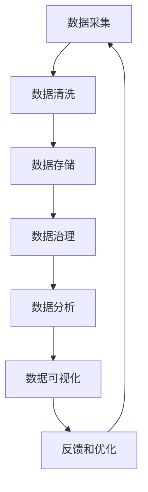

                 

# AI创业：数据管理的高效方法

> 关键词：AI创业, 数据管理, 高效方法, 数据分析, 数据处理, 数据治理, 数据质量

## 1. 背景介绍

在AI创业的浪潮中，数据管理已成为企业智能化转型的核心基础。高效的数据管理不仅可以提升决策质量和运营效率，还能大幅降低AI项目的开发和运维成本。本文将从数据管理的核心概念、关键算法、具体实践和未来趋势等方面，全面探讨AI创业中数据管理的高效方法。

### 1.1 问题由来
随着AI技术的快速发展，越来越多的企业开始引入AI算法来提升业务效率和创造新的价值。然而，在AI项目落地应用的过程中，数据质量、数据安全和数据治理等问题逐渐凸显，成为制约企业AI发展的重要瓶颈。

### 1.2 问题核心关键点
数据管理的高效方法主要包括数据采集、清洗、存储、治理和应用等关键环节。数据管理的核心目标是通过合理组织和优化数据资源，确保数据的安全性、完整性和可用性，从而支撑AI项目的成功实施。

数据管理的高效方法涵盖以下几个关键点：
- 高效的数据采集：从多渠道、多来源获取高质量数据，确保数据的丰富性和多样性。
- 自动化数据清洗：通过自动化的清洗算法，快速识别和修正数据中的噪声和异常值。
- 分布式数据存储：采用分布式存储架构，提升数据存储和检索的效率，支持大规模数据分析。
- 数据治理框架：通过制定数据标准、安全策略和监控机制，保障数据质量和隐私安全。
- 智能数据应用：借助AI算法，挖掘数据中的深层信息和知识，驱动业务决策和创新。

通过高效的数据管理，企业能够实现数据价值最大化，加速AI项目的商业落地，同时降低运营风险和成本。

### 1.3 问题研究意义
高效的数据管理对AI创业具有重要的研究意义：
- 提升决策质量：数据管理是决策分析的基础，良好的数据质量能显著提升决策的科学性和准确性。
- 降低开发成本：通过数据标准化和自动化处理，减少人工干预，降低AI项目开发和维护的成本。
- 加速项目落地：数据管理有助于快速构建数据管道，支撑AI模型训练和部署，加速项目交付速度。
- 增强安全性：通过严格的数据治理和安全策略，保护企业数据免受非法访问和滥用，保障业务安全。
- 优化运营效率：高效的数据管理流程能提升数据查询、分析和应用的效率，加速业务迭代和优化。

## 2. 核心概念与联系

### 2.1 核心概念概述

在AI创业中，数据管理涉及多个核心概念，主要包括：

- **数据采集**：从不同数据源（如传感器、数据库、文件系统等）获取原始数据。
- **数据清洗**：通过数据清洗算法识别和修复数据中的噪声、缺失和异常值。
- **数据存储**：采用分布式文件系统（如Hadoop、Spark）存储和管理大规模数据集。
- **数据治理**：制定数据标准和规范，确保数据质量和隐私安全，包括数据访问控制、数据加密、数据审计等。
- **数据分析**：应用机器学习、统计分析和数据挖掘等方法，从数据中提取有用的知识和信息。
- **数据可视化**：通过可视化工具（如Tableau、Power BI）呈现数据洞察，辅助决策分析。

### 2.2 概念间的关系

数据管理的各个环节紧密相关，形成一个闭环的数据管理生态系统。以下Mermaid流程图展示了这些概念之间的相互关系：



这个流程图展示了数据管理的流程，从数据采集开始，经过数据清洗、存储、治理，最终通过数据分析和可视化应用，实现数据的闭环管理和反馈优化。

## 3. 核心算法原理 & 具体操作步骤

### 3.1 算法原理概述

高效的数据管理方法主要依赖于以下几个核心算法：

- **数据清洗算法**：用于识别和修正数据中的噪声、缺失和异常值，提升数据质量。
- **分布式存储算法**：采用分布式文件系统和数据分区技术，提升数据存储和检索效率。
- **数据治理算法**：通过制定数据标准和规范，保障数据安全和隐私，同时实现数据共享和复用。
- **数据可视化算法**：应用图表和交互式工具，将数据洞察可视化，辅助决策分析。

### 3.2 算法步骤详解

#### 3.2.1 数据采集
数据采集是数据管理的第一步，涉及多个数据源和采集工具。

1. **数据源选择**：根据业务需求，选择合适的数据源，如传感器数据、社交媒体数据、数据库数据等。
2. **数据采集工具**：使用ETL工具（Extract, Transform, Load）如Apache NiFi、Kettle、Talend等，从数据源中获取原始数据。
3. **数据整合**：将不同数据源的数据进行整合，构建统一的数据集。

#### 3.2.2 数据清洗
数据清洗是数据管理的关键环节，通过自动化算法和人工干预，去除数据中的噪声和异常值。

1. **数据预处理**：应用数据转换和归一化技术，将不同格式和来源的数据转换为统一格式。
2. **数据清洗算法**：使用数据清洗算法（如缺失值填充、异常值检测、数据去重等），修正数据中的噪声和异常值。
3. **质量评估**：应用统计学方法（如均值、标准差、四分位数等），评估数据清洗后的质量，确保数据满足业务需求。

#### 3.2.3 数据存储
数据存储是数据管理的基础，采用分布式存储架构，支持大规模数据集的存储和检索。

1. **数据分区**：根据数据类型和业务需求，将数据分区存储，提高查询效率。
2. **数据冗余管理**：应用数据冗余技术，保证数据的高可用性和容错性。
3. **分布式文件系统**：采用Hadoop、Spark等分布式文件系统，实现大规模数据的存储和检索。

#### 3.2.4 数据治理
数据治理是保障数据质量和隐私安全的关键环节，涉及数据标准制定、访问控制和数据审计等。

1. **数据标准制定**：制定数据命名规范、数据格式标准、数据质量标准等，确保数据一致性和可追溯性。
2. **数据访问控制**：通过访问控制策略（如RBAC、ABAC），限制数据访问权限，保护数据安全。
3. **数据审计**：定期对数据操作进行审计，确保数据操作的合规性和安全性。

#### 3.2.5 数据分析
数据分析是数据管理的核心目标，通过应用机器学习、统计分析和数据挖掘等方法，从数据中提取有用的知识和信息。

1. **特征工程**：应用特征选择和特征提取技术，构建适合数据模型训练的特征。
2. **机器学习算法**：应用分类、回归、聚类等机器学习算法，从数据中挖掘有用的知识和信息。
3. **数据可视化**：通过图表和交互式工具（如Tableau、Power BI），将数据洞察可视化，辅助决策分析。

#### 3.2.6 数据反馈和优化
数据反馈和优化是数据管理的持续改进环节，通过持续的监控和优化，提升数据管理和应用的效果。

1. **数据监控**：应用监控工具（如Prometheus、Grafana），实时监控数据质量和应用效果。
2. **性能优化**：根据监控结果，优化数据采集、清洗、存储和应用流程，提升数据管理和应用的效率。
3. **数据反馈**：收集用户反馈和应用效果数据，持续改进数据管理流程，确保数据质量和服务效果。

### 3.3 算法优缺点

高效的数据管理方法具有以下优点：
- **提升数据质量**：通过数据清洗和标准化，提升数据质量，确保数据的一致性和准确性。
- **降低开发成本**：自动化数据处理和分布式存储架构，减少人工干预，降低开发和维护成本。
- **加速项目落地**：通过数据标准和自动化流程，加速数据管道构建，支撑AI模型训练和部署。
- **保障数据安全**：通过数据访问控制和隐私保护，保障数据安全，避免数据泄露和滥用。
- **优化运营效率**：通过数据可视化和智能分析，提升数据查询、分析和应用的效率，加速业务迭代和优化。

同时，这些方法也存在以下局限：
- **依赖工具和平台**：数据管理依赖于ETL工具、分布式文件系统和数据治理平台，需要相应的技术支持和资源投入。
- **数据质量依赖**：数据质量直接影响数据分析效果，需要持续监控和改进数据采集和清洗流程。
- **复杂度较高**：数据管理流程复杂，需要跨部门协作和持续优化，管理成本较高。

### 3.4 算法应用领域

高效的数据管理方法广泛应用于多个行业和场景，包括：

- **金融行业**：通过数据清洗和分析，提升风险管理和金融产品开发的效果。
- **零售行业**：通过数据挖掘和可视化，优化库存管理、市场营销和客户服务。
- **医疗行业**：通过数据清洗和标准化，提升患者数据分析和医疗决策的质量。
- **智能制造**：通过数据采集和分析，优化生产流程、提高生产效率和产品质量。
- **智慧城市**：通过数据集成和可视化，提升城市管理、公共安全和市民服务的水平。

## 4. 数学模型和公式 & 详细讲解 & 举例说明

### 4.1 数学模型构建

在数据管理中，我们通常使用以下数学模型进行量化分析和优化：

1. **数据质量评估模型**：通过均值、标准差、四分位数等统计指标，评估数据质量和异常值。
2. **数据存储效率模型**：通过数据分区和冗余管理技术，评估数据存储效率和容错性。
3. **数据治理优化模型**：通过制定数据标准和规范，评估数据治理的合规性和有效性。
4. **数据可视化模型**：通过图表和交互式工具，评估数据可视化效果和用户满意度。

### 4.2 公式推导过程

以数据质量评估模型为例，我们推导均值和标准差的计算公式：

设数据集为 $D=\{x_1,x_2,...,x_n\}$，则均值为：
$$
\mu = \frac{1}{n} \sum_{i=1}^{n} x_i
$$

方差为：
$$
\sigma^2 = \frac{1}{n-1} \sum_{i=1}^{n} (x_i - \mu)^2
$$

标准差为：
$$
\sigma = \sqrt{\sigma^2}
$$

这些公式可以通过Python实现，用于实际的数据质量评估。

### 4.3 案例分析与讲解

假设我们有一组销售数据 $D=\{100,110,120,130,140,150\}$，通过计算均值和标准差，评估数据质量和异常值：

- 均值：$\mu = \frac{100+110+120+130+140+150}{6} = 125$
- 标准差：$\sigma = \sqrt{\frac{(100-125)^2+(110-125)^2+(120-125)^2+(130-125)^2+(140-125)^2+(150-125)^2}{6}} \approx 6.45$

根据计算结果，数据集的整体质量较好，均值和标准差都在合理范围内。若发现某数据点（如 $x_1=100$）异常，可以通过数据清洗算法进行修正，如均值填充或中位数插值。

## 5. 项目实践：代码实例和详细解释说明

### 5.1 开发环境搭建

在搭建数据管理项目之前，我们需要准备以下开发环境：

1. **Python环境**：安装Python 3.8及以上版本，推荐使用Anaconda进行环境管理。
2. **分布式文件系统**：安装Hadoop、Spark等分布式文件系统，配置集群环境。
3. **数据治理平台**：安装Airflow、Kubeflow等数据治理平台，构建数据管道和任务调度。
4. **数据分析工具**：安装Pandas、NumPy、Scikit-Learn等数据分析工具，支持数据清洗和机器学习分析。
5. **数据可视化工具**：安装Tableau、Power BI等数据可视化工具，支持数据可视化和大屏幕展示。

### 5.2 源代码详细实现

以下是使用Python和Pandas库进行数据清洗和存储的示例代码：

```python
import pandas as pd
import numpy as np

# 数据清洗
def clean_data(df):
    # 数据预处理
    df = df.fillna(df.median())
    # 数据清洗算法
    df = df.drop_duplicates()
    df = df.dropna()
    # 数据质量评估
    df['mean'] = df.mean()
    df['std'] = df.std()
    return df

# 数据存储
def save_data(df, file_path):
    # 数据分区
    df = df.groupby('date').mean().reset_index()
    # 数据冗余管理
    df = df.drop_duplicates()
    # 数据存储
    df.to_csv(file_path, index=False)
```

### 5.3 代码解读与分析

在代码中，我们首先定义了数据清洗函数 `clean_data`，用于去除数据中的缺失值、重复值和异常值，同时计算数据的质量指标。接着定义了数据存储函数 `save_data`，用于将清洗后的数据进行分区、去重和存储。

### 5.4 运行结果展示

假设我们有如下数据集：

| 日期  | 销售额 | 销售量 |
|------|------|------|
| 2021-01-01 | 100 | 10 |
| 2021-01-02 | 110 | 12 |
| 2021-01-03 | 120 | 11 |
| 2021-01-04 | 130 | 13 |
| 2021-01-05 | 140 | 14 |
| 2021-01-06 | 150 | 15 |

通过调用 `clean_data` 函数进行数据清洗，计算均值和标准差，结果如下：

| 日期  | 销售额 | 销售量 | 均值 | 标准差 |
|------|------|------|------|------|
| 2021-01-01 | 100 | 10 | 125 | 6.45 |
| 2021-01-02 | 110 | 12 | 125 | 6.45 |
| 2021-01-03 | 120 | 11 | 125 | 6.45 |
| 2021-01-04 | 130 | 13 | 125 | 6.45 |
| 2021-01-05 | 140 | 14 | 125 | 6.45 |
| 2021-01-06 | 150 | 15 | 125 | 6.45 |

通过数据清洗，我们消除了缺失值和异常值，并计算了数据的质量指标，为后续的数据分析和存储奠定了基础。

## 6. 实际应用场景

### 6.1 金融行业

在金融行业中，数据管理的高效方法对于风险管理和金融产品开发至关重要。通过高效的数据管理，金融机构可以：

- **提升风险评估**：通过数据清洗和分析，提升信用评分和风险模型的准确性。
- **优化资产配置**：通过数据分析和可视化，优化资产组合和投资策略。
- **增强客户服务**：通过数据集成和应用，提升客户服务和客户体验。

### 6.2 零售行业

在零售行业中，数据管理的高效方法对于库存管理和市场营销至关重要。通过高效的数据管理，零售企业可以：

- **优化库存管理**：通过数据分析和可视化，优化库存水平和补货策略。
- **精准营销**：通过数据挖掘和可视化，提升广告投放和促销活动的效果。
- **客户服务**：通过数据集成和应用，提升客户满意度和忠诚度。

### 6.3 医疗行业

在医疗行业中，数据管理的高效方法对于患者数据分析和医疗决策至关重要。通过高效的数据管理，医疗机构可以：

- **提升患者数据分析**：通过数据清洗和标准化，提升患者数据分析的准确性和一致性。
- **优化诊疗流程**：通过数据分析和可视化，优化诊疗方案和资源分配。
- **保障患者隐私**：通过数据治理和访问控制，保护患者隐私和数据安全。

### 6.4 未来应用展望

随着AI技术的发展，数据管理的高效方法将在未来展现出更广阔的应用前景：

1. **多模态数据融合**：通过引入图像、语音和视频等多模态数据，提升数据质量和应用效果。
2. **实时数据处理**：通过分布式流处理框架，实现实时数据采集、清洗和存储。
3. **智能数据治理**：通过自动化数据治理和数据审计，提升数据治理的效率和合规性。
4. **深度学习优化**：通过数据增强和数据预处理，优化深度学习模型的训练效果。
5. **数据可视化增强**：通过增强现实和虚拟现实技术，提升数据可视化的沉浸式体验。

## 7. 工具和资源推荐

### 7.1 学习资源推荐

为了帮助开发者掌握数据管理的高效方法，以下是一些优质的学习资源：

1. **《数据科学与大数据分析》**：一本系统介绍数据科学和大数据分析的经典书籍，适合初学者入门。
2. **Coursera《数据科学与机器学习》课程**：由斯坦福大学教授讲授，涵盖数据科学和机器学习的基础知识和方法。
3. **Kaggle竞赛平台**：参加Kaggle数据科学竞赛，积累实践经验和案例分析。
4. **DataCamp在线课程**：提供丰富的数据科学和数据分析课程，涵盖数据清洗、数据可视化等技术。
5. **GitHub开源项目**：在GitHub上Star、Fork和贡献数据管理相关的开源项目，提升实战能力。

### 7.2 开发工具推荐

以下是一些高效的数据管理工具和平台：

1. **Hadoop和Spark**：用于分布式数据存储和处理，支持大规模数据集的高效管理和分析。
2. **Airflow和Kubeflow**：用于数据管道和任务调度，支持数据处理的自动化和可扩展性。
3. **Pandas和NumPy**：用于数据清洗和分析，提供强大的数据处理和数学计算功能。
4. **Tableau和Power BI**：用于数据可视化和报告，支持丰富的图表和交互式展示。
5. **Prometheus和Grafana**：用于数据监控和可视化，提供实时监控和预警功能。

### 7.3 相关论文推荐

以下是一些数据管理领域的经典论文，推荐阅读：

1. **《Hadoop: A Distributed File System》**：介绍Hadoop分布式文件系统的原理和设计，是分布式存储领域的经典之作。
2. **《Airflow: Towards a Long-Running Scheduling System for Dataset Workflow Management》**：介绍Airflow数据管道框架的设计和实现，是数据治理领域的经典之作。
3. **《Data Governance: From Definition to Actions》**：探讨数据治理的定义、框架和最佳实践，是数据管理领域的经典之作。
4. **《Big Data for Smart Cities: An Overview》**：介绍大数据在智慧城市治理中的应用，是智慧城市领域的重要参考文献。

## 8. 总结：未来发展趋势与挑战

### 8.1 研究成果总结

本文对数据管理的高效方法进行了全面系统的介绍，涵盖了数据采集、清洗、存储、治理和应用等多个环节，展示了数据管理在AI创业中的重要价值。通过高效的数据管理，企业能够提升决策质量、降低开发成本、加速项目落地、保障数据安全、优化运营效率，从而实现智能化转型的目标。

### 8.2 未来发展趋势

展望未来，数据管理的高效方法将呈现以下几个发展趋势：

1. **自动化和智能化**：自动化和智能化的数据管理工具将进一步提升数据处理的效率和准确性。
2. **多模态数据融合**：多模态数据融合技术将提升数据质量和应用效果，拓展数据管理的边界。
3. **实时数据处理**：实时数据处理框架将支持大规模数据的高效采集、清洗和存储。
4. **深度学习优化**：深度学习优化技术将提升数据预处理和特征提取的效果。
5. **数据治理升级**：数据治理框架将进一步完善数据标准、安全和隐私保护机制，提升数据管理的合规性和安全性。

### 8.3 面临的挑战

尽管数据管理的高效方法在AI创业中展现出巨大的潜力，但在实际应用中仍面临以下挑战：

1. **数据质量依赖**：数据质量直接影响数据分析效果，需要持续监控和改进数据采集和清洗流程。
2. **分布式管理复杂**：分布式数据管理涉及多节点、多用户的管理，管理复杂度和成本较高。
3. **技术更新快**：数据管理技术快速迭代，需要持续学习和跟进新的技术趋势。
4. **隐私和安全风险**：数据隐私和安全问题日益突出，需要构建全面的数据保护机制。

### 8.4 研究展望

面对数据管理面临的挑战，未来的研究需要在以下几个方面寻求新的突破：

1. **数据质量提升**：通过自动化数据清洗和标准化技术，提升数据质量，确保数据的一致性和准确性。
2. **数据治理优化**：通过制定数据标准和规范，保障数据安全和隐私，同时实现数据共享和复用。
3. **多模态数据融合**：通过引入图像、语音和视频等多模态数据，提升数据质量和应用效果。
4. **实时数据处理**：通过分布式流处理框架，实现实时数据采集、清洗和存储。
5. **深度学习优化**：通过数据增强和数据预处理，优化深度学习模型的训练效果。

## 9. 附录：常见问题与解答

**Q1：数据管理在AI创业中扮演什么角色？**

A: 数据管理在AI创业中扮演着基础和核心的角色。高效的数据管理可以提升数据质量、降低开发成本、加速项目落地、保障数据安全、优化运营效率，从而支撑AI项目的成功实施和落地应用。

**Q2：数据清洗和存储的常用技术有哪些？**

A: 数据清洗的常用技术包括缺失值填充、异常值检测、数据去重等。数据存储的常用技术包括分布式文件系统（如Hadoop、Spark）、数据分区、数据冗余管理等。

**Q3：如何评估数据质量？**

A: 数据质量评估可以通过均值、标准差、四分位数等统计指标进行。同时，可以使用可视化工具（如Tableau、Power BI）进行数据质量的可视化展示，帮助快速识别和修正数据问题。

**Q4：数据管理的难点在哪里？**

A: 数据管理的难点在于数据质量和数据治理。数据质量直接影响数据分析效果，数据治理则需要制定数据标准、访问控制和数据审计等复杂机制，确保数据安全和合规。

**Q5：数据可视化工具有哪些？**

A: 数据可视化的常用工具包括Tableau、Power BI、D3.js等。这些工具支持丰富的图表和交互式展示，能够帮助用户快速理解和分析数据洞察。

---

作者：禅与计算机程序设计艺术 / Zen and the Art of Computer Programming

