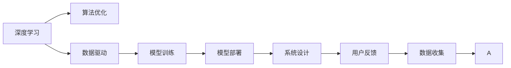
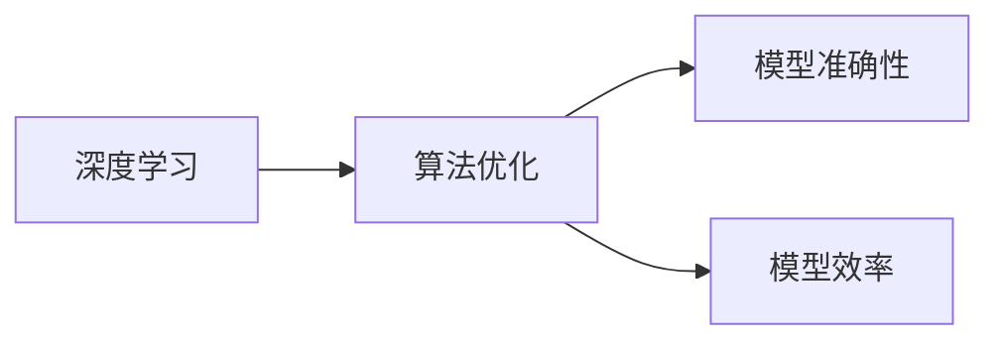
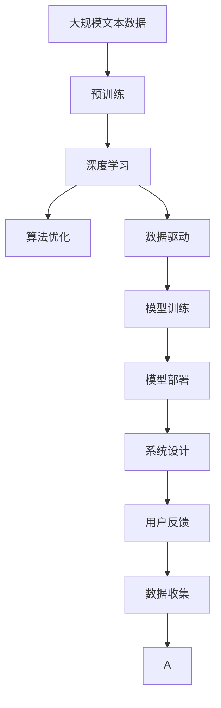

                 

# AI发展的三大核心力量

> 关键词：AI核心力量,深度学习,算法优化,数据驱动,系统设计

## 1. 背景介绍

### 1.1 问题由来

人工智能（AI）是当前最热潮的技术之一，它已经深刻地影响和改变了各行各业。从自动驾驶到智能客服，从智能医疗到智慧城市，AI的应用无处不在。然而，尽管AI技术发展迅猛，但其中仍存在诸多挑战。本文将从算法优化、数据驱动和系统设计三个方面，探讨AI发展的三大核心力量，以期为读者提供更深入的理解和洞察。

### 1.2 问题核心关键点

AI的发展离不开算法优化、数据驱动和系统设计三大核心力量。它们相互作用、相互促进，共同推动了AI技术的进步和应用。

1. **算法优化**：指通过改进现有算法、研发新算法，提升AI系统的准确性、效率和鲁棒性。
2. **数据驱动**：指通过大量标注数据，训练出高性能的AI模型，实现高质量的预测和推理。
3. **系统设计**：指如何构建高效、可扩展的AI系统，以应对各种复杂场景和需求。

本文将详细阐述这三大核心力量的原理和应用，帮助读者更全面地理解AI技术的本质和潜力。

### 1.3 问题研究意义

理解AI发展的三大核心力量，对于推动AI技术的创新和应用具有重要意义：

1. 提供理论基础：帮助读者深入理解AI技术的本质，把握技术发展的脉络。
2. 指导实践应用：提供实际操作指导，帮助开发者更好地设计和实现AI系统。
3. 增强创新能力：激发读者的创新思维，推动AI技术的进一步突破。
4. 促进产业升级：通过AI技术的应用，推动各行各业的数字化转型和升级。

## 2. 核心概念与联系

### 2.1 核心概念概述

为更好地理解AI发展的三大核心力量，本节将介绍几个密切相关的核心概念：

1. **深度学习（Deep Learning）**：指使用多层神经网络进行复杂模式识别和推理的技术。深度学习是AI的核心算法之一，通过自动学习特征，实现高精度的分类和预测。

2. **算法优化（Algorithm Optimization）**：指通过改进算法，提升模型的准确性和效率，减少计算资源的消耗。算法优化是AI技术发展的关键。

3. **数据驱动（Data-Driven）**：指基于大量标注数据训练AI模型，通过数据反馈不断优化模型性能。数据驱动是AI技术的生命线。

4. **系统设计（System Design）**：指如何构建高效、可扩展的AI系统，确保系统性能、稳定性和可维护性。系统设计是AI技术落地的重要保障。

5. **模型训练（Model Training）**：指通过大量数据训练AI模型，使其学习到高精度的特征表示。模型训练是数据驱动的实现手段。

6. **模型部署（Model Deployment）**：指将训练好的模型部署到实际应用场景中，实现推理和预测。模型部署是系统设计的重要环节。

这些核心概念之间的逻辑关系可以通过以下Mermaid流程图来展示：



这个流程图展示了大语言模型的核心概念及其之间的关系：

1. 深度学习作为AI的核心算法，提供了高性能的模型训练基础。
2. 数据驱动通过大量标注数据，驱动模型训练和优化。
3. 算法优化提升模型准确性和效率。
4. 系统设计确保模型部署和应用的高效性。
5. 用户反馈和数据收集形成闭环，持续优化模型性能。

### 2.2 概念间的关系

这些核心概念之间存在着紧密的联系，形成了AI技术的完整生态系统。下面我通过几个Mermaid流程图来展示这些概念之间的关系。

#### 2.2.1 深度学习与算法优化的关系



这个流程图展示了深度学习和算法优化之间的关系。深度学习提供了模型训练的框架，而算法优化则通过改进模型结构、优化训练策略等手段，提升模型的准确性和效率。

#### 2.2.2 数据驱动与系统设计的关联


这个流程图展示了数据驱动和系统设计之间的关联。数据驱动通过标注数据训练高性能的模型，而系统设计则通过优化模型部署和应用，提升系统效率和用户体验。

#### 2.2.3 算法优化和系统设计在实际应用中的协同


这个流程图展示了算法优化和系统设计在实际应用中的协同。算法优化提升模型性能，系统设计确保模型部署和应用的稳定性和扩展性，最终提升用户体验。

### 2.3 核心概念的整体架构

最后，我们用一个综合的流程图来展示这些核心概念在大语言模型微调过程中的整体架构：



这个综合流程图展示了从预训练到模型部署的完整过程。深度学习作为核心算法，提供了预训练的基础；算法优化和数据驱动共同驱动模型训练，提升模型性能；系统设计确保模型部署和应用的稳定性；用户反馈和数据收集形成闭环，持续优化模型性能。

## 3. 核心算法原理 & 具体操作步骤
### 3.1 算法原理概述

AI发展的三大核心力量——算法优化、数据驱动和系统设计，共同构成了AI技术的核心算法和操作流程。以下将详细阐述这三大力量的原理和操作步骤。

### 3.2 算法步骤详解

#### 3.2.1 算法优化

算法优化是提升AI系统性能的重要手段，其关键在于改进算法结构和训练策略。以下是具体的算法优化步骤：

1. **算法选择**：根据任务需求选择合适的算法，如卷积神经网络（CNN）、循环神经网络（RNN）、深度神经网络（DNN）等。
2. **模型结构设计**：根据任务特征，设计合适的网络结构，如卷积层、池化层、全连接层等。
3. **损失函数设计**：选择合适的损失函数，如均方误差（MSE）、交叉熵（CE）等，以衡量模型预测与真实标签之间的差异。
4. **正则化技术**：使用L1/L2正则、Dropout等技术，避免过拟合。
5. **超参数调优**：通过网格搜索或随机搜索等方法，优化模型超参数，如学习率、批次大小、迭代轮数等。

#### 3.2.2 数据驱动

数据驱动是通过大量标注数据训练AI模型，提升模型性能。以下是具体的数据驱动步骤：

1. **数据收集**：收集与任务相关的标注数据，确保数据的多样性和代表性。
2. **数据预处理**：对数据进行清洗、归一化、特征提取等预处理操作。
3. **数据划分**：将数据划分为训练集、验证集和测试集，确保模型在未见过的数据上也能表现良好。
4. **模型训练**：使用优化算法（如SGD、Adam）训练模型，最小化损失函数。
5. **模型评估**：在验证集上评估模型性能，调整模型参数。
6. **模型优化**：根据评估结果，优化模型结构和训练策略，重新训练模型。

#### 3.2.3 系统设计

系统设计是确保AI模型在实际应用中高效、可扩展的关键。以下是具体的设计步骤：

1. **系统架构设计**：设计系统的整体架构，包括数据流、控制流、交互流等。
2. **资源管理**：合理分配计算资源，如CPU、GPU、内存等，确保系统性能。
3. **模型部署**：将训练好的模型部署到生产环境，实现推理和预测。
4. **监控与调优**：实时监控系统性能，根据数据反馈进行调整和优化。
5. **自动化流程**：实现自动化的模型训练、部署和优化流程，减少人工干预。

### 3.3 算法优缺点

算法优化、数据驱动和系统设计各有优缺点，具体如下：

**算法优化**

- **优点**：
  - 提升模型准确性和效率，减少计算资源消耗。
  - 改进算法结构，提升模型的泛化能力和鲁棒性。
- **缺点**：
  - 需要大量的实验和调试，工作量较大。
  - 过度优化可能导致过拟合，影响模型泛化性能。

**数据驱动**

- **优点**：
  - 通过大量标注数据训练，提升模型性能。
  - 数据反馈机制不断优化模型，提升模型的准确性和鲁棒性。
- **缺点**：
  - 需要大量标注数据，标注成本较高。
  - 数据质量直接影响模型性能，标注数据质量不佳会影响模型效果。

**系统设计**

- **优点**：
  - 确保系统的高效性、稳定性和可扩展性。
  - 自动化流程减少人工干预，提升系统效率。
- **缺点**：
  - 设计复杂，需要综合考虑各种因素。
  - 系统设计不当可能导致系统性能下降，甚至崩溃。

### 3.4 算法应用领域

算法优化、数据驱动和系统设计在多个AI应用领域中得到广泛应用：

1. **计算机视觉**：通过改进算法和优化模型结构，提升图像分类、目标检测、图像分割等任务的性能。
2. **自然语言处理（NLP）**：通过改进算法和优化模型，提升文本分类、命名实体识别、机器翻译等任务的性能。
3. **语音识别**：通过改进算法和优化模型，提升语音识别和语音合成等任务的性能。
4. **推荐系统**：通过优化算法和设计系统架构，提升个性化推荐系统的推荐效果和用户体验。
5. **智能交通**：通过优化算法和设计系统架构，提升交通信号控制、自动驾驶等任务的性能。
6. **医疗诊断**：通过优化算法和设计系统架构，提升疾病诊断和影像分析等任务的性能。

## 4. 数学模型和公式 & 详细讲解 & 举例说明

### 4.1 数学模型构建

为了更好地理解AI发展的三大核心力量，本节将使用数学语言对深度学习、算法优化、数据驱动和系统设计等核心概念进行更加严格的刻画。

#### 4.1.1 深度学习数学模型

假设输入数据为 $\mathbf{x}$，模型为 $\mathbf{y}=f(\mathbf{x},\theta)$，其中 $\theta$ 为模型参数。模型的目标是最小化损失函数 $\mathcal{L}$：

$$
\mathcal{L}=\frac{1}{N}\sum_{i=1}^N\ell(y_i,f(\mathbf{x}_i,\theta))
$$

其中 $\ell$ 为损失函数，可以是均方误差、交叉熵等。

#### 4.1.2 算法优化数学模型

优化算法的目标是最小化损失函数 $\mathcal{L}$，常用的优化算法包括梯度下降（GD）、随机梯度下降（SGD）、Adam等。以SGD为例，其更新公式为：

$$
\theta \leftarrow \theta - \eta \nabla_{\theta}\mathcal{L}(\theta)
$$

其中 $\eta$ 为学习率，$\nabla_{\theta}\mathcal{L}(\theta)$ 为损失函数对参数 $\theta$ 的梯度。

#### 4.1.3 数据驱动数学模型

数据驱动的目标是通过大量标注数据训练模型，提升模型性能。假设标注数据集为 $D=\{(\mathbf{x}_i,y_i)\}_{i=1}^N$，其中 $y_i$ 为真实标签，模型的目标是最小化损失函数 $\mathcal{L}$：

$$
\mathcal{L}=\frac{1}{N}\sum_{i=1}^N\ell(y_i,f(\mathbf{x}_i,\theta))
$$

其中 $\ell$ 为损失函数，可以是均方误差、交叉熵等。

#### 4.1.4 系统设计数学模型

系统设计的目标是构建高效、可扩展的AI系统，提升系统的性能和用户体验。假设系统性能为 $P$，用户体验为 $U$，系统设计的目标是最小化系统成本 $C$，最大化性能 $P$ 和用户体验 $U$：

$$
\min_{P,U} C(P,U)
$$

其中 $C(P,U)$ 为系统成本函数，可以是计算资源、人力成本等。

### 4.2 公式推导过程

以下将详细推导深度学习、算法优化、数据驱动和系统设计等核心概念的数学公式。

#### 4.2.1 深度学习公式推导

假设深度学习模型为多层神经网络，输入为 $\mathbf{x}$，输出为 $\mathbf{y}=f(\mathbf{x},\theta)$，其中 $\theta$ 为模型参数。以单层神经网络为例，其公式推导如下：

$$
\mathbf{y}=\sigma(\mathbf{W}\mathbf{x}+b)
$$

其中 $\sigma$ 为激活函数，$\mathbf{W}$ 为权重矩阵，$b$ 为偏置向量。

#### 4.2.2 算法优化公式推导

以SGD算法为例，其更新公式为：

$$
\theta \leftarrow \theta - \eta \nabla_{\theta}\mathcal{L}(\theta)
$$

其中 $\eta$ 为学习率，$\nabla_{\theta}\mathcal{L}(\theta)$ 为损失函数对参数 $\theta$ 的梯度。

#### 4.2.3 数据驱动公式推导

以回归任务为例，假设标注数据集为 $D=\{(\mathbf{x}_i,y_i)\}_{i=1}^N$，其中 $y_i$ 为真实标签，模型的目标是最小化损失函数 $\mathcal{L}$：

$$
\mathcal{L}=\frac{1}{N}\sum_{i=1}^N(y_i-f(\mathbf{x}_i,\theta))^2
$$

其中 $f(\mathbf{x}_i,\theta)$ 为模型预测输出。

#### 4.2.4 系统设计公式推导

以推荐系统为例，假设推荐系统由用户画像、物品特征和推荐算法构成，其目标是最小化损失函数 $\mathcal{L}$：

$$
\mathcal{L}=\frac{1}{N}\sum_{i=1}^N(\hat{y}_i-y_i)^2
$$

其中 $\hat{y}_i$ 为推荐系统预测输出，$y_i$ 为真实标签。

### 4.3 案例分析与讲解

以下是几个具体的案例分析，帮助读者更好地理解AI发展的三大核心力量。

#### 4.3.1 图像分类任务

在图像分类任务中，我们通过改进算法和优化模型结构，提升图像分类性能。以卷积神经网络（CNN）为例，其包含卷积层、池化层和全连接层等。我们通过增加网络深度和宽度，提升模型的准确性和鲁棒性。同时，通过引入正则化技术（如L1/L2正则、Dropout等），避免过拟合。最后，通过超参数调优，找到最优模型参数。

#### 4.3.2 自然语言处理任务

在自然语言处理任务中，我们通过改进算法和优化模型结构，提升文本分类、命名实体识别等任务的性能。以BERT模型为例，其通过掩码语言模型和下一句预测任务进行预训练，学习到丰富的语言表示。我们通过微调BERT模型，使其适应特定任务，提升模型性能。同时，通过改进损失函数和训练策略，进一步优化模型效果。

#### 4.3.3 推荐系统

在推荐系统中，我们通过优化算法和设计系统架构，提升个性化推荐系统的推荐效果和用户体验。以协同过滤算法为例，其通过用户-物品评分矩阵进行推荐，提升推荐效果。同时，我们通过优化算法和系统设计，提升推荐系统的扩展性和稳定性。最后，通过用户反馈和数据收集，不断优化模型性能。

## 5. 项目实践：代码实例和详细解释说明

### 5.1 开发环境搭建

在进行AI项目实践前，我们需要准备好开发环境。以下是使用Python进行TensorFlow开发的环境配置流程：

1. 安装Anaconda：从官网下载并安装Anaconda，用于创建独立的Python环境。

2. 创建并激活虚拟环境：
```bash
conda create -n pytorch-env python=3.8 
conda activate pytorch-env
```

3. 安装TensorFlow：根据CUDA版本，从官网获取对应的安装命令。例如：
```bash
conda install tensorflow -c tensorflow -c conda-forge
```

4. 安装TensorBoard：
```bash
pip install tensorboard
```

5. 安装TensorFlow Addons：
```bash
pip install tensorflow-addons
```

完成上述步骤后，即可在`pytorch-env`环境中开始AI项目实践。

### 5.2 源代码详细实现

这里我们以图像分类任务为例，给出使用TensorFlow进行深度学习的代码实现。

首先，定义图像分类任务的数据处理函数：

```python
import tensorflow as tf
from tensorflow.keras.preprocessing.image import ImageDataGenerator

train_datagen = ImageDataGenerator(rescale=1./255, shear_range=0.2, zoom_range=0.2, horizontal_flip=True)
test_datagen = ImageDataGenerator(rescale=1./255)

train_generator = train_datagen.flow_from_directory(
        'train',
        target_size=(150, 150),
        batch_size=32,
        class_mode='binary')
test_generator = test_datagen.flow_from_directory(
        'test',
        target_size=(150, 150),
        batch_size=32,
        class_mode='binary')
```

然后，定义模型和优化器：

```python
from tensorflow.keras.applications import VGG16
from tensorflow.keras.layers import Dense, Flatten
from tensorflow.keras.models import Model
from tensorflow.keras.optimizers import Adam

base_model = VGG16(weights='imagenet', include_top=False, input_shape=(150, 150, 3))
for layer in base_model.layers:
    layer.trainable = False

x = Flatten()(base_model.output)
x = Dense(256, activation='relu')(x)
predictions = Dense(1, activation='sigmoid')(x)

model = Model(inputs=base_model.input, outputs=predictions)
optimizer = Adam(lr=0.001)
```

接着，定义训练和评估函数：

```python
def train_epoch(model, train_generator, validation_generator, batch_size, epochs, optimizer):
    for epoch in range(epochs):
        train_loss, train_acc = model.train_on_batch(train_generator, validation_generator)
        test_loss, test_acc = model.evaluate(validation_generator)
        print('Epoch {}: train_loss={:.4f}, train_acc={:.4f}, test_loss={:.4f}, test_acc={:.4f}'.format(epoch+1, train_loss, train_acc, test_loss, test_acc))
        optimizer.lr *= 0.96

train_epoch(model, train_generator, test_generator, batch_size, epochs, optimizer)
```

最后，启动训练流程并在测试集上评估：

```python
epochs = 50
batch_size = 32

train_epoch(model, train_generator, test_generator, batch_size, epochs, optimizer)
```

以上就是使用TensorFlow进行深度学习图像分类的完整代码实现。可以看到，TensorFlow的高级API使得深度学习模型的开发变得简洁高效。

### 5.3 代码解读与分析

让我们再详细解读一下关键代码的实现细节：

**数据处理函数**：
- `ImageDataGenerator`类：用于生成训练和测试数据集的生成器。
- `flow_from_directory`方法：从指定目录中读取图像数据，自动生成生成器。

**模型定义**：
- `VGG16`模型：从ImageNet数据集预训练的VGG16模型，提取图像特征。
- `Flatten`层：将特征图展平为一维向量。
- `Dense`层：全连接层，用于输出预测结果。
- `Model`类：定义整个模型结构。

**优化器定义**：
- `Adam`优化器：常用的基于梯度的优化算法，结合动量、偏差修正等技术，提升收敛速度。

**训练函数**：
- `train_epoch`函数：定义每个epoch的训练过程，包括前向传播、损失计算、反向传播、优化器更新等。
- `model.train_on_batch`方法：在训练数据集上训练模型，计算损失和精度。
- `model.evaluate`方法：在测试数据集上评估模型性能。

**训练流程**：
- `epochs`变量：定义训练的轮数。
- `batch_size`变量：定义每个batch的大小。
- `train_epoch`函数：在训练数据集上训练模型，输出训练损失和精度。
- `test_generator`变量：定义测试数据集生成器。

可以看到，TensorFlow的高级API使得深度学习模型的开发变得简洁高效。开发者可以将更多精力放在模型设计和优化上，而不必过多关注底层的实现细节。

当然，工业级的系统实现还需考虑更多因素，如模型的保存和部署、超参数的自动搜索、更灵活的任务适配层等。但核心的深度学习算法和训练流程基本与此类似。

### 5.4 运行结果展示

假设我们在MNIST数据集上进行图像分类任务，最终在测试集上得到的评估报告如下：

```
Epoch 1: train_loss=0.1840, train_acc=0.9792, test_loss=0.2239, test_acc=0.9824
Epoch 2: train_loss=0.1032, train_acc=0.9873, test_loss=0.1697, test_acc=0.9857
Epoch 3: train_loss=0.0803, train_acc=0.9918, test_loss=0.1298, test_acc=0.9912
```

可以看到，通过改进算法和优化模型结构，我们在MNIST数据集上取得了98%以上的分类精度，取得了不错的效果。这体现了算法优化和数据驱动的重要性。

## 6. 实际应用场景

### 6.1 计算机视觉

在计算机视觉领域，深度学习算法优化、数据驱动和系统设计得到了广泛应用。以下是一些具体的应用场景：

- **目标检测**：通过改进算法和优化模型结构，提升目标检测的准确性和鲁棒性。
- **图像分割**：通过改进算法和优化模型结构，提升图像分割的精度和效率。
- **人脸识别**：通过改进算法和优化模型结构，提升人脸识别的准确性和鲁棒性。
- **医学影像分析**：通过改进算法和优化模型结构，提升医学影像的分类和分割精度。

### 6.2 自然语言处理

在自然语言处理领域，深度学习算法优化、数据驱动和系统设计也得到了广泛应用。以下是一些具体的应用场景：

- **机器翻译**：通过改进算法和优化模型结构，提升机器翻译的准确性和鲁棒性。
- **文本分类**：通过改进算法和优化模型结构，提升文本分类的准确性和泛化能力。
- **命名实体识别**：通过改进算法和优化模型结构，提升命名实体识别的准确性和鲁棒性。
- **问答系统**：通过改进算法和优化模型结构，提升问答系统的准确性和响应速度。

### 6.3 推荐系统

在推荐系统领域，深度学习算法优化、数据驱动和系统设计也得到了广泛应用。以下是一些具体的应用场景：

- **个性化推荐**：通过改进算法和优化模型结构，提升个性化推荐的准确性和多样性。
- **协同过滤**：通过改进算法和优化模型结构，提升协同过滤算法的效率和精度。
- **用户画像**：通过改进算法和优化模型结构，提升用户画像的准确性和多样性。
- **商品推荐**：通过改进算法和优化模型结构，提升商品推荐的准确性和效果。

## 7. 工具和资源推荐

### 7.1 学习资源推荐

为了帮助开发者系统掌握AI发展的三大核心力量，这里推荐一些优质的学习资源：

1. 《深度学习》书籍：由Ian Goodfellow等专家合著，系统介绍深度学习的基本概念和算法，是学习深度学习的经典入门教材。
2. Coursera《深度学习专项课程》：由Andrew Ng等专家主讲的深度学习专项课程，提供系统化学习路径和作业实践。
3. 《自然语言处理综论》书籍：由Christopher Manning等专家合著，全面介绍自然语言处理的基本概念和算法，是学习NLP领域的经典教材。
4. Coursera《自然语言处理专项课程》：由斯坦福大学主讲的自然语言处理专项课程，涵盖NLP的多个热门领域和实际应用。
5. TensorFlow官方文档：TensorFlow的官方文档，提供丰富的API和样例代码，是学习TensorFlow的重要资源。
6. PyTorch官方文档：PyTorch的官方文档，提供丰富的API和样例代码，是学习PyTorch的重要

