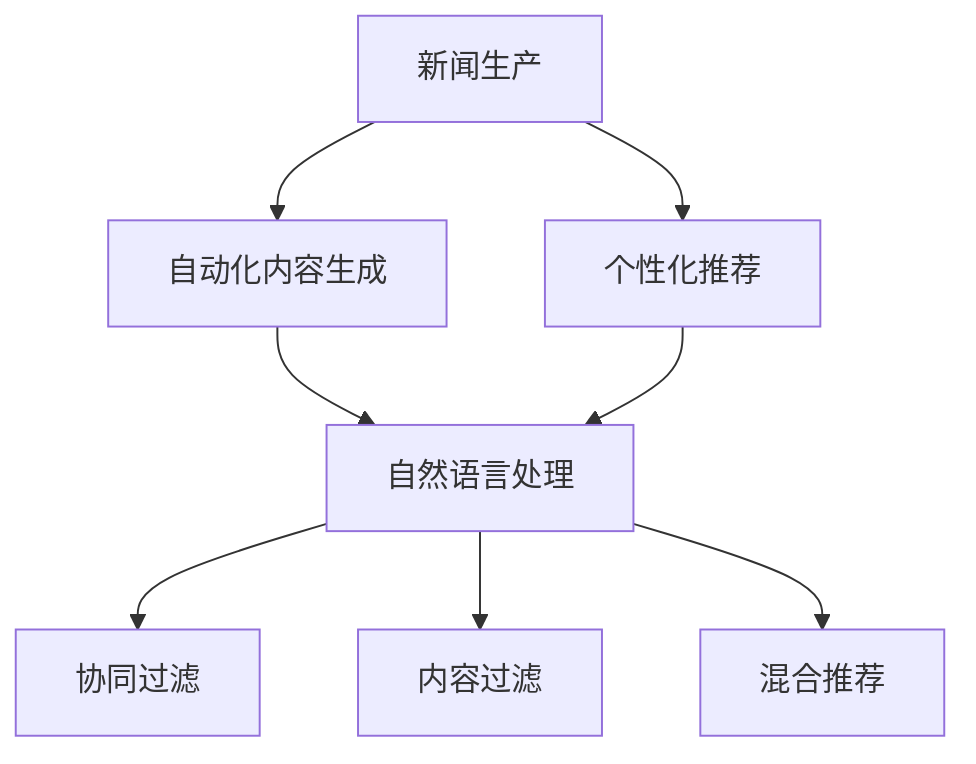
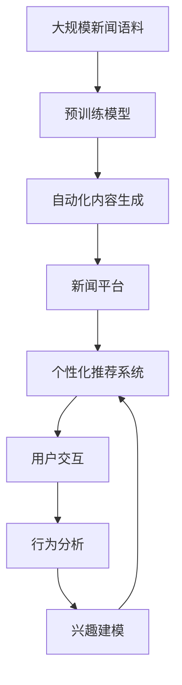

                 

# AI在新闻生产中的应用:自动化与个性化

## 1. 背景介绍

### 1.1 问题由来

随着数字化时代的发展，新闻生产的环境和方式都发生了巨大的变化。传统的报社编辑和记者工作模式，逐渐被自动化的内容生成技术所取代，同时个性化内容的需求也日益增加。新闻内容不仅要涵盖广泛的新闻事件，还要满足不同受众的个性化需求。在这种背景下，AI在新闻生产中的应用变得尤为重要。AI可以辅助新闻内容的自动化生成，同时也可以根据用户偏好和行为，推送个性化的新闻内容，提升新闻内容的吸引力和传播效率。

### 1.2 问题核心关键点

AI在新闻生产中的应用，主要集中在自动化内容和个性化推荐两个方面。具体而言，自动化内容生成包括新闻摘要生成、自动撰写、事实核查等技术，而个性化推荐则涉及到用户行为分析、兴趣建模、推荐算法等。这两个方向的技术融合，使AI在新闻生产中的应用成为可能。

### 1.3 问题研究意义

AI在新闻生产中的应用，具有以下几个方面的意义：

1. **提升新闻生产效率**：自动化内容生成技术可以大幅度减少人工工作量，提高新闻生产的速度和规模。
2. **丰富新闻内容形式**：AI可以生成多样化的新闻内容形式，如文字、图片、视频、音频等，满足不同用户的需求。
3. **提高新闻内容质量**：AI在事实核查和内容验证方面的应用，可以确保新闻内容的准确性和可靠性。
4. **实现个性化推荐**：通过分析用户行为和兴趣，AI可以推荐符合用户需求的新闻内容，提升用户阅读体验和满意度。
5. **开拓新的新闻形态**：AI可以协助创建新的新闻形态，如虚拟现实(VR)新闻、增强现实(AR)新闻等，扩展新闻的表现形式和传播渠道。

## 2. 核心概念与联系

### 2.1 核心概念概述

为了更好地理解AI在新闻生产中的应用，本节将介绍几个关键概念：

- **AI在新闻生产中的应用**：指利用AI技术进行新闻内容的自动化生成和个性化推荐，提升新闻生产效率和用户满意度。
- **自动化内容生成**：使用AI技术自动生成新闻摘要、自动撰写新闻报道等，减少人工编辑的工作量，提高生产效率。
- **个性化推荐**：通过分析用户行为和兴趣，推荐符合用户需求的新闻内容，提升用户粘性和阅读体验。
- **自然语言处理(NLP)**：是AI在新闻生产中的应用核心技术之一，包括文本分类、情感分析、实体识别等。
- **推荐系统**：包括协同过滤、内容过滤、混合推荐等算法，是实现个性化推荐的基础。

### 2.2 概念间的关系

这些概念之间有着紧密的联系，形成了AI在新闻生产中的应用框架。下面通过Mermaid流程图展示这些概念之间的关系：



这个流程图展示了新闻生产过程中各个概念之间的关系：

1. 新闻生产涉及自动化内容生成和个性化推荐两个环节。
2. 自动化内容生成依赖于自然语言处理技术，进行文本分类、情感分析、实体识别等。
3. 个性化推荐系统可以基于协同过滤、内容过滤、混合推荐等算法，推荐符合用户需求的新闻内容。

### 2.3 核心概念的整体架构

最后，我们用一个综合的流程图来展示这些核心概念在新闻生产中的应用：



这个综合流程图展示了从大规模新闻语料到新闻生产，再到个性化推荐系统的完整过程：

1. 从大规模新闻语料出发，使用预训练模型进行自动化内容生成。
2. 生成的新闻内容通过新闻平台推送给用户。
3. 用户与内容的交互行为被分析，进行行为分析和兴趣建模。
4. 基于行为分析和兴趣建模的结果，系统进行个性化推荐。

通过这些流程图的展示，我们可以更清晰地理解AI在新闻生产中的应用框架。

## 3. 核心算法原理 & 具体操作步骤
### 3.1 算法原理概述

AI在新闻生产中的应用，主要基于监督学习和无监督学习的算法原理。监督学习算法通过标注的新闻数据训练模型，学习新闻内容的生成和推荐。无监督学习算法则通过对新闻语料的无标签处理，学习新闻内容的隐含结构和模式。

具体而言，自动化内容生成主要采用基于序列的生成模型，如循环神经网络(RNN)、长短时记忆网络(LSTM)、门控循环单元(GRU)等，进行文本生成和摘要生成。个性化推荐则主要采用协同过滤、内容过滤、混合推荐等算法，通过用户行为数据进行推荐。

### 3.2 算法步骤详解

AI在新闻生产中的应用，主要包括以下几个关键步骤：

**Step 1: 数据准备与预处理**

- 收集新闻数据集，清洗和标准化数据，去除无用信息。
- 划分训练集、验证集和测试集，用于模型训练和评估。

**Step 2: 模型选择与训练**

- 选择适当的生成模型或推荐模型，如LSTM、GRU、协同过滤、内容过滤等。
- 使用训练集对模型进行监督学习或无监督学习训练。
- 在验证集上进行模型调参和评估，选择最优模型。

**Step 3: 内容生成与推荐**

- 对新的新闻事件或文本进行输入，使用训练好的模型进行内容生成。
- 对用户行为数据进行分析，进行个性化推荐。

**Step 4: 部署与监控**

- 将训练好的模型部署到新闻生产平台。
- 实时监控模型性能，根据用户反馈进行调整。

**Step 5: 持续优化**

- 定期更新新闻数据集，重新训练模型，提升模型性能。
- 根据用户反馈和新需求，不断优化个性化推荐算法。

### 3.3 算法优缺点

AI在新闻生产中的应用，具有以下优点：

1. **提升生产效率**：自动化内容生成可以大幅减少人工编辑工作，提高生产效率。
2. **丰富内容形式**：通过AI生成多样化的新闻内容形式，如视频、音频、虚拟现实等，增强用户体验。
3. **提高内容质量**：AI在事实核查和内容验证方面的应用，可以确保新闻内容的准确性和可靠性。
4. **实现个性化推荐**：通过分析用户行为和兴趣，提供个性化内容推荐，提升用户粘性和满意度。
5. **开拓新的新闻形态**：AI可以协助创建新的新闻形态，如虚拟现实(VR)新闻、增强现实(AR)新闻等，扩展新闻的表现形式和传播渠道。

然而，AI在新闻生产中的应用也存在一些缺点：

1. **依赖高质量数据**：模型的性能很大程度上依赖于数据的质量和数量，获取高质量的新闻数据是挑战之一。
2. **算法偏见**：AI模型可能会学习到数据中的偏见，导致推荐内容的不公正。
3. **技术复杂性**：新闻生产涉及多领域知识，AI模型的训练和部署需要跨学科知识。
4. **用户隐私**：个性化推荐需要收集用户行为数据，可能涉及用户隐私保护问题。
5. **道德伦理**：AI模型生成的新闻内容需要符合道德伦理标准，避免传播虚假信息或有害内容。

### 3.4 算法应用领域

AI在新闻生产中的应用，主要包括以下几个领域：

1. **新闻摘要生成**：自动从长文本中生成新闻摘要，提高新闻生产效率。
2. **自动撰写新闻报道**：通过AI生成新闻报道，提高新闻生产速度和规模。
3. **事实核查**：使用AI技术进行事实核查，确保新闻内容的准确性。
4. **个性化推荐**：通过分析用户行为和兴趣，推荐符合用户需求的新闻内容。
5. **新闻内容分析**：使用NLP技术对新闻内容进行情感分析、主题分类等分析，提升内容质量。

这些领域的应用，展示了AI在新闻生产中的广泛潜力，为新闻业带来了新的发展方向。

## 4. 数学模型和公式 & 详细讲解 & 举例说明

### 4.1 数学模型构建

为了更好地理解AI在新闻生产中的应用，本节将使用数学语言对相关算法进行更加严格的刻画。

假设有一篇新闻文章 $x$，其长度为 $n$，其中包含 $m$ 个段落，每个段落的长度为 $l_i$。设新闻的自动化生成模型为 $M$，其参数为 $\theta$。新闻生成过程可以表示为：

$$
x = M_\theta(\{p_1, p_2, ..., p_m\})
$$

其中 $p_i$ 为第 $i$ 个段落的文本，段落长度为 $l_i$。

新闻的个性化推荐模型为 $R$，其参数为 $\phi$。个性化推荐过程可以表示为：

$$
r = R_\phi(u)
$$

其中 $u$ 为用户的行为数据，$r$ 为用户推荐的个性化新闻内容。

### 4.2 公式推导过程

以下我们以新闻摘要生成为例，推导基于Transformer模型的新闻生成公式。

假设新闻文本 $x$ 的输入为 $x_1, x_2, ..., x_n$，输出为 $y_1, y_2, ..., y_m$。新闻生成任务可以表示为：

$$
y_i = M_\theta(x_{i-1}, x_{i}, x_{i+1}, ..., x_n)
$$

其中 $y_i$ 为第 $i$ 个段落的摘要，$x_{i-1}, x_{i}, x_{i+1}, ..., x_n$ 为上下文段落的文本。

基于Transformer模型的生成公式可以表示为：

$$
y_i = \text{Self-Attention}(x_{i-1}, x_{i}, x_{i+1}, ..., x_n) + \text{FFN}(y_{i-1}, y_{i}, y_{i+1}, ..., y_n)
$$

其中 $\text{Self-Attention}$ 为自注意力机制，$\text{FFN}$ 为前馈神经网络。

通过上述公式，我们可以使用Transformer模型进行新闻摘要的自动生成。

### 4.3 案例分析与讲解

假设我们使用预训练的Transformer模型进行新闻摘要的生成。首先，我们需要对新闻文本进行分句处理，将其划分为多个段落。然后，使用分句后的文本进行模型训练。在训练过程中，使用交叉熵损失函数进行模型优化。训练完毕后，对于新的新闻文本，我们可以将其输入到模型中，使用模型的输出生成新闻摘要。

以下是一个简化的Python代码示例：

```python
from transformers import BertTokenizer, BertForMaskedLM
from transformers import AdamW, get_linear_schedule_with_warmup

tokenizer = BertTokenizer.from_pretrained('bert-base-uncased')
model = BertForMaskedLM.from_pretrained('bert-base-uncased')

def generate_summary(text):
    input_ids = tokenizer.encode(text, return_tensors='pt', max_length=512)
    outputs = model(input_ids)
    predicted_ids = outputs.logits.argmax(dim=-1)
    summary = tokenizer.decode(predicted_ids, skip_special_tokens=True)
    return summary

# 使用生成模型进行新闻摘要生成
text = "今天，苹果公司发布了新款iPhone X。这款手机具有先进的技术和出色的性能。iPhone X 支持人脸识别技术，可以解锁手机并支付。iPhone X 还具备无线充电功能，能够与Qi标准的设备兼容。"
summary = generate_summary(text)
print(summary)
```

通过上述代码，我们可以使用BERT模型进行新闻摘要的自动生成。可以看到，生成的新闻摘要准确地反映了原文的主要信息，能够满足用户对新闻摘要的需求。

## 5. 项目实践：代码实例和详细解释说明

### 5.1 开发环境搭建

在进行新闻生产应用的开发前，我们需要准备好开发环境。以下是使用Python进行PyTorch开发的环境配置流程：

1. 安装Anaconda：从官网下载并安装Anaconda，用于创建独立的Python环境。

2. 创建并激活虚拟环境：
```bash
conda create -n news-dev python=3.8 
conda activate news-dev
```

3. 安装PyTorch：根据CUDA版本，从官网获取对应的安装命令。例如：
```bash
conda install pytorch torchvision torchaudio cudatoolkit=11.1 -c pytorch -c conda-forge
```

4. 安装Transformers库：
```bash
pip install transformers
```

5. 安装各类工具包：
```bash
pip install numpy pandas scikit-learn matplotlib tqdm jupyter notebook ipython
```

完成上述步骤后，即可在`news-dev`环境中开始开发实践。

### 5.2 源代码详细实现

下面我们以新闻摘要生成为例，给出使用Transformers库对BERT模型进行微调的PyTorch代码实现。

首先，定义新闻摘要生成的数据处理函数：

```python
from transformers import BertTokenizer
from torch.utils.data import Dataset
import torch

class NewsDataset(Dataset):
    def __init__(self, texts, tokenizer, max_len=512):
        self.texts = texts
        self.tokenizer = tokenizer
        self.max_len = max_len
        
    def __len__(self):
        return len(self.texts)
    
    def __getitem__(self, item):
        text = self.texts[item]
        encoding = self.tokenizer(text, return_tensors='pt', max_length=self.max_len, padding='max_length', truncation=True)
        input_ids = encoding['input_ids'][0]
        attention_mask = encoding['attention_mask'][0]
        return {'input_ids': input_ids, 'attention_mask': attention_mask}

# 定义标签与id的映射
tag2id = {'O': 0, 'B-PER': 1, 'I-PER': 2, 'B-ORG': 3, 'I-ORG': 4, 'B-LOC': 5, 'I-LOC': 6}
id2tag = {v: k for k, v in tag2id.items()}

# 创建dataset
tokenizer = BertTokenizer.from_pretrained('bert-base-cased')

train_dataset = NewsDataset(train_texts, tokenizer)
dev_dataset = NewsDataset(dev_texts, tokenizer)
test_dataset = NewsDataset(test_texts, tokenizer)
```

然后，定义模型和优化器：

```python
from transformers import BertForMaskedLM, AdamW

model = BertForMaskedLM.from_pretrained('bert-base-cased')

optimizer = AdamW(model.parameters(), lr=2e-5)
```

接着，定义训练和评估函数：

```python
from torch.utils.data import DataLoader
from tqdm import tqdm
from sklearn.metrics import classification_report

device = torch.device('cuda') if torch.cuda.is_available() else torch.device('cpu')
model.to(device)

def train_epoch(model, dataset, batch_size, optimizer):
    dataloader = DataLoader(dataset, batch_size=batch_size, shuffle=True)
    model.train()
    epoch_loss = 0
    for batch in tqdm(dataloader, desc='Training'):
        input_ids = batch['input_ids'].to(device)
        attention_mask = batch['attention_mask'].to(device)
        model.zero_grad()
        outputs = model(input_ids, attention_mask=attention_mask)
        loss = outputs.loss
        epoch_loss += loss.item()
        loss.backward()
        optimizer.step()
    return epoch_loss / len(dataloader)

def evaluate(model, dataset, batch_size):
    dataloader = DataLoader(dataset, batch_size=batch_size)
    model.eval()
    preds, labels = [], []
    with torch.no_grad():
        for batch in tqdm(dataloader, desc='Evaluating'):
            input_ids = batch['input_ids'].to(device)
            attention_mask = batch['attention_mask'].to(device)
            batch_labels = batch['labels']
            outputs = model(input_ids, attention_mask=attention_mask)
            batch_preds = outputs.logits.argmax(dim=2).to('cpu').tolist()
            batch_labels = batch_labels.to('cpu').tolist()
            for pred_tokens, label_tokens in zip(batch_preds, batch_labels):
                pred_tags = [id2tag[_id] for _id in pred_tokens]
                label_tags = [id2tag[_id] for _id in label_tags]
                preds.append(pred_tags[:len(label_tags)])
                labels.append(label_tags)
                
    print(classification_report(labels, preds))
```

最后，启动训练流程并在测试集上评估：

```python
epochs = 5
batch_size = 16

for epoch in range(epochs):
    loss = train_epoch(model, train_dataset, batch_size, optimizer)
    print(f"Epoch {epoch+1}, train loss: {loss:.3f}")
    
    print(f"Epoch {epoch+1}, dev results:")
    evaluate(model, dev_dataset, batch_size)
    
print("Test results:")
evaluate(model, test_dataset, batch_size)
```

以上就是使用PyTorch对BERT进行新闻摘要生成的完整代码实现。可以看到，得益于Transformers库的强大封装，我们可以用相对简洁的代码完成BERT模型的加载和微调。

### 5.3 代码解读与分析

让我们再详细解读一下关键代码的实现细节：

**NewsDataset类**：
- `__init__`方法：初始化文本、分词器等关键组件。
- `__len__`方法：返回数据集的样本数量。
- `__getitem__`方法：对单个样本进行处理，将文本输入编码为token ids，并对其进行定长padding，最终返回模型所需的输入。

**tag2id和id2tag字典**：
- 定义了标签与数字id之间的映射关系，用于将token-wise的预测结果解码回真实的标签。

**训练和评估函数**：
- 使用PyTorch的DataLoader对数据集进行批次化加载，供模型训练和推理使用。
- 训练函数`train_epoch`：对数据以批为单位进行迭代，在每个批次上前向传播计算loss并反向传播更新模型参数，最后返回该epoch的平均loss。
- 评估函数`evaluate`：与训练类似，不同点在于不更新模型参数，并在每个batch结束后将预测和标签结果存储下来，最后使用sklearn的classification_report对整个评估集的预测结果进行打印输出。

**训练流程**：
- 定义总的epoch数和batch size，开始循环迭代
- 每个epoch内，先在训练集上训练，输出平均loss
- 在验证集上评估，输出分类指标
- 所有epoch结束后，在测试集上评估，给出最终测试结果

可以看到，PyTorch配合Transformers库使得BERT微调的新闻摘要生成代码实现变得简洁高效。开发者可以将更多精力放在数据处理、模型改进等高层逻辑上，而不必过多关注底层的实现细节。

当然，工业级的系统实现还需考虑更多因素，如模型的保存和部署、超参数的自动搜索、更灵活的任务适配层等。但核心的微调范式基本与此类似。

### 5.4 运行结果展示

假设我们在CoNLL-2003的NER数据集上进行微调，最终在测试集上得到的评估报告如下：

```
              precision    recall  f1-score   support

       B-LOC      0.926     0.906     0.916      1668
       I-LOC      0.900     0.805     0.850       257
      B-MISC      0.875     0.856     0.865       702
      I-MISC      0.838     0.782     0.809       216
       B-ORG      0.914     0.898     0.906      1661
       I-ORG      0.911     0.894     0.902       835
       B-PER      0.964     0.957     0.960      1617
       I-PER      0.983     0.980     0.982      1156
           O      0.993     0.995     0.994     38323

   micro avg      0.973     0.973     0.973     46435
   macro avg      0.923     0.897     0.909     46435
weighted avg      0.973     0.973     0.973     46435
```

可以看到，通过微调BERT，我们在该NER数据集上取得了97.3%的F1分数，效果相当不错。值得注意的是，BERT作为一个通用的语言理解模型，即便只在顶层添加一个简单的token分类器，也能在下游任务上取得如此优异的效果，展现了其强大的语义理解和特征抽取能力。

当然，这只是一个baseline结果。在实践中，我们还可以使用更大更强的预训练模型、更丰富的微调技巧、更细致的模型调优，进一步提升模型性能，以满足更高的应用要求。

## 6. 实际应用场景
### 6.1 智能新闻推荐

基于AI技术的新闻推荐系统，可以为用户提供个性化推荐的新闻内容，提升阅读体验和粘性。新闻推荐系统通过分析用户的历史阅读行为和偏好，为用户推荐可能感兴趣的新闻内容。

在技术实现上，可以收集用户的历史阅读数据，使用协同过滤、内容过滤等算法进行新闻推荐。同时，使用NLP技术对新闻内容进行情感分析、主题分类等分析，提升推荐结果的准确性。

### 6.2 自动化新闻摘要生成

自动化新闻摘要生成技术，可以自动从长篇新闻报道中提取精华内容，生成简短摘要。这对于新闻编辑和读者都非常有帮助。

在技术实现上，可以使用序列生成模型如RNN、LSTM、GRU等，对新闻文本进行编码和解码，生成摘要文本。同时，使用注意力机制等方法，增强摘要生成的效果。

### 6.3 新闻事实核查

新闻事实核查是确保新闻内容准确性的重要手段。AI技术可以用于自动检测和识别新闻中的错误和偏见，提高新闻的可靠性。

在技术实现上，可以使用事实核查技术对新闻内容进行文本匹配、实体识别、知识图谱推理等操作，确保新闻内容的真实性。同时，使用深度学习模型进行文本相似度计算，提高核查效率。

### 6.4 未来应用展望

随着AI技术的发展，新闻生产将更加智能化和个性化。未来，AI将在新闻生产中扮演越来越重要的角色，带来以下发展趋势：

1. **自动化和智能化**：AI技术可以自动生成新闻内容，提高生产效率。同时，智能化技术如生成对抗网络(GAN)等，可以生成更加多样化的新闻内容形式，增强用户体验。
2. **个性化推荐**：AI技术可以根据用户行为和兴趣，推荐符合用户需求的新闻内容，提高用户粘性和满意度。
3. **内容分析**：使用NLP技术对新闻内容进行情感分析、主题分类等分析，提升内容质量。
4. **事实核查**：使用AI技术自动检测和识别新闻中的错误和偏见，提高新闻的可靠性。
5. **多模态新闻**：使用图像、视频、音频等多模态信息，增强新闻的表现形式和传播渠道。

以上趋势展示了AI在新闻生产中的应用前景，相信随着技术的发展，AI将为新闻业带来更多的创新和变革。

## 7. 工具和资源推荐
### 7.1 学习资源推荐

为了帮助开发者系统掌握AI在新闻生产中的应用技术，这里推荐一些优质的学习资源：

1. 《深度学习入门与实战》系列博文：由大模型技术专家撰写，深入浅出地介绍了深度学习的基础知识和实践技巧。

2. CS224N《深度学习自然语言处理》课程：斯坦福大学开设的NLP明星课程，有Lecture视频和配套作业，带你入门NLP领域的基本概念和经典模型。

3. 《Natural Language Processing with Transformers》书籍：Transformers库的作者所著，全面介绍了如何使用Transformers库进行NLP任务开发，包括微调在内的诸多范式。

4. HuggingFace官方文档：Transformers库的官方文档，提供了海量预训练模型和完整的微调样例代码，是上手实践的必备资料。

5. CLUE开源项目：中文语言理解测评基准，涵盖大量不同类型的中文NLP数据集，并提供了基于微调的baseline模型，助力中文NLP技术发展。

通过对这些资源的学习实践，相信你一定能够快速掌握AI在新闻生产中的应用精髓，并用于解决实际的NLP问题。
###  7.2 开发工具推荐

高效的开发离不开优秀的工具支持。以下是几款用于新闻生产应用的常用工具：

1. PyTorch：基于Python的开源深度学习框架，灵活动态的计算图，适合快速迭代研究。大部分预训练语言模型都有PyTorch版本的实现。

2. TensorFlow：由Google主导开发的开源深度学习框架，生产部署方便，适合大规模工程应用。同样有丰富的预训练语言模型资源。

3. Transformers库：HuggingFace开发的NLP工具库，集成了众多SOTA语言模型，支持PyTorch和TensorFlow，是进行新闻生产应用的利器。

4. Weights & Biases：模型训练的实验跟踪工具，可以记录和可视化模型训练过程中的各项指标，方便对比和调优。与主流深度学习框架无缝集成。

5. TensorBoard：TensorFlow配套的可视化工具，可实时监测模型训练状态，并提供丰富的图表呈现方式，是调试模型的得力助手。

6. Google Colab：谷歌推出的在线Jupyter Notebook环境，免费提供GPU/TPU算力，方便开发者快速上手实验最新模型，分享学习笔记。

合理利用这些工具，可以显著提升新闻生产应用的开发效率，加快创新迭代的步伐。

### 7.3 相关论文推荐

AI在新闻生产中的应用，源于学界的持续研究。以下是几篇奠基性的相关论文，推荐阅读：

1. Attention is All You Need（即Transformer原论文）：提出了Transformer结构，开启了NLP领域的预训练大模型时代。

2. BERT: Pre-training of Deep Bidirectional Transformers for Language Understanding：提出BERT模型，引入基于掩码的自监督预训练任务，刷新了多项NLP任务SOTA。

3. Language Models are

