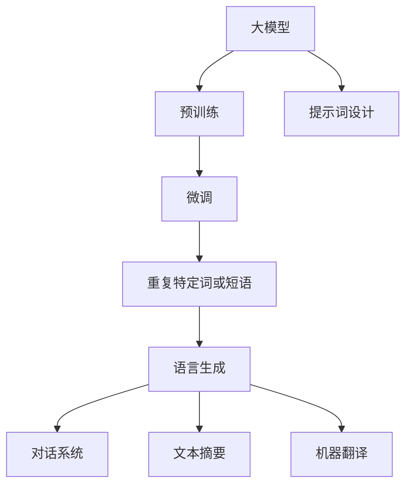

                 

# AI大模型Prompt提示词最佳实践：重复特定词或短语

> 关键词：Prompt、大模型、语言生成、对话系统、快速迭代、提高效率

## 1. 背景介绍

在自然语言处理（NLP）领域，语言生成模型（如GPT-3、ChatGPT等）已经取得了令人瞩目的进展。这些模型通过大规模无标签文本数据进行预训练，学习到丰富的语言模式和知识，能够进行高质量的文本生成、对话系统、翻译、摘要等多种任务。然而，这些模型的一大挑战是如何高效地进行任务适配，即微调（Fine-Tuning）以适应特定的任务需求。

微调过程通常需要大量的标注数据，且微调周期较长，这使得开发成本和复杂性增加。为了解决这一问题，研究人员提出了提示（Prompt）技术，通过精心设计输入文本的格式，引导模型按期望方式输出，从而实现零样本或少样本学习。其中，重复特定词或短语（Repeated Words or Phrases）是一种简单而有效的提示方法，可以快速迭代并提高模型性能。

## 2. 核心概念与联系

### 2.1 核心概念概述

- **Prompt**：输入文本中的附加信息，用于指导语言模型生成或分类。
- **大模型**：基于自回归或自编码模型，如GPT-3、BERT等，通过大规模预训练学习语言知识。
- **语言生成**：模型基于输入文本生成新的文本，包括对话系统、文本摘要、机器翻译等。
- **对话系统**：通过自然语言与计算机进行交互的系统，涵盖问答、聊天机器人等应用。
- **快速迭代**：通过不断调整Prompt，快速优化模型，提高生成质量和任务适配效率。

### 2.2 概念间的关系

通过重复特定词或短语，可以引导大模型生成或分类符合特定要求的文本。该方法可以应用于各种NLP任务，包括但不限于对话系统、文本摘要、机器翻译等。通过在输入文本中插入特定词或短语，可以大大加快模型的训练和优化过程，提高生成质量。

以下是一个简单的Mermaid流程图，展示了重复特定词或短语在微调大模型中的应用：



## 3. 核心算法原理 & 具体操作步骤

### 3.1 算法原理概述

重复特定词或短语的提示方法，本质上是通过输入文本中的重复词或短语，诱导模型生成或分类符合特定要求的结果。其核心思想是利用语言模型对重复词汇的敏感性，通过多次使用相同或类似的词汇，引导模型聚焦于特定任务，并输出相应的文本或结果。

### 3.2 算法步骤详解

重复特定词或短语的提示方法包括以下关键步骤：

1. **确定提示词或短语**：根据任务需求，选择适当的提示词或短语。例如，在对话系统中，可以使用特定的开场白或结束语；在文本摘要中，可以使用摘要关键词或短语。
2. **设计提示文本**：将提示词或短语插入输入文本中，设计出一个简短的上下文，使模型更容易理解任务要求。
3. **生成或分类**：使用微调后的大模型生成文本或对输入文本进行分类，得到符合任务要求的结果。

### 3.3 算法优缺点

#### 优点：
- **快速迭代**：重复特定词或短语可以快速优化模型，减少标注数据需求，缩短微调周期。
- **提高效率**：通过多次使用相同词汇，引导模型聚焦任务，提高生成质量和任务适配效率。
- **通用性强**：提示词或短语的选择灵活多样，可以应用于各种NLP任务。

#### 缺点：
- **依赖上下文**：提示词或短语的设计需要仔细考虑，以确保模型能正确理解任务需求。
- **可能过拟合**：过多的重复词汇可能导致模型过度关注这些词汇，忽略其他重要信息。
- **鲁棒性不足**：提示词或短语的设计过于简单可能导致模型在复杂场景下表现不佳。

### 3.4 算法应用领域

重复特定词或短语的提示方法已经广泛应用于各种NLP任务中，包括但不限于：

- **对话系统**：在聊天机器人中，使用特定的开场白或结束语，引导模型生成合适的回复。
- **文本摘要**：使用摘要关键词或短语，引导模型生成简短的摘要。
- **机器翻译**：在翻译任务中，使用特定词汇引导模型生成符合源语言语境的翻译。
- **文本生成**：在文本生成任务中，使用特定词汇引导模型生成符合特定风格的文本。
- **信息检索**：在信息检索任务中，使用特定词汇引导模型检索符合用户查询意图的结果。

## 4. 数学模型和公式 & 详细讲解

### 4.1 数学模型构建

重复特定词或短语的提示方法，可以通过输入文本中的重复词汇来构建一个简单的数学模型。设输入文本为 $X$，提示词或短语为 $W$，微调后的大模型为 $M$，输出结果为 $Y$。模型的目标是通过输入文本 $X$ 和提示词或短语 $W$，生成或分类出符合特定要求的结果 $Y$。

### 4.2 公式推导过程

以对话系统为例，假设输入文本 $X$ 为一段对话的历史记录，提示词或短语 $W$ 为对话的开场白，微调后的大模型 $M$ 为生成模型。模型通过输入文本 $X$ 和提示词或短语 $W$，生成对话系统的回复 $Y$。模型的训练过程可以表示为：

$$
\min_{M} \sum_{i=1}^N \ell(M(X_i, W), Y_i)
$$

其中 $N$ 为训练样本数量，$\ell$ 为损失函数，如交叉熵损失等。

### 4.3 案例分析与讲解

考虑一个简单的对话生成任务，输入文本 $X$ 为一段历史对话记录，提示词或短语 $W$ 为对话的开场白，微调后的大模型 $M$ 为生成模型。模型通过输入文本 $X$ 和提示词或短语 $W$，生成对话系统的回复 $Y$。模型的训练过程如下：

1. **数据准备**：收集对话历史记录 $X$，设计合适的提示词或短语 $W$。
2. **模型初始化**：选择适当的大模型 $M$，并进行微调。
3. **训练过程**：将输入文本 $X$ 和提示词或短语 $W$ 输入模型 $M$，通过反向传播更新模型参数。
4. **测试评估**：在测试集上评估模型的性能，确保生成结果符合任务要求。

## 5. 项目实践：代码实例和详细解释说明

### 5.1 开发环境搭建

在进行项目实践前，需要准备开发环境。以下是使用Python和PyTorch框架搭建开发环境的流程：

1. **安装Anaconda**：从官网下载并安装Anaconda，创建虚拟环境。
2. **安装PyTorch**：根据CUDA版本，使用pip或conda安装PyTorch。
3. **安装Transformers库**：使用pip或conda安装Transformers库。
4. **安装其他依赖**：如numpy、pandas等。

### 5.2 源代码详细实现

以下是一个简单的代码示例，使用GPT-3模型进行对话系统微调，并通过重复特定词或短语进行提示。

```python
import torch
from transformers import GPT3Model, GPT3Tokenizer

# 加载模型和tokenizer
model = GPT3Model.from_pretrained('gpt3')
tokenizer = GPT3Tokenizer.from_pretrained('gpt3')

# 定义提示词或短语
prompt = "你是个程序员，对吗？"

# 输入对话历史记录
history = "你是个程序员，对吗？"

# 将历史对话记录和提示词或短语转换为token
tokens = tokenizer(history, return_tensors='pt', padding=True, truncation=True)
prompt_tokens = tokenizer(prompt, return_tensors='pt', padding=True, truncation=True)

# 将token和提示词或短语输入模型
inputs = {**tokens, **prompt_tokens}
outputs = model.generate(**inputs)

# 解码输出
output = tokenizer.decode(outputs[0], skip_special_tokens=True)

# 输出结果
print(output)
```

### 5.3 代码解读与分析

1. **数据准备**：首先，需要定义提示词或短语 $W$ 和对话历史记录 $X$。在本例中，提示词或短语为 "你是个程序员，对吗？"，对话历史记录为 "你是个程序员，对吗？"。
2. **模型初始化**：使用GPT3模型进行初始化，并通过微调得到训练好的模型。
3. **提示设计**：将提示词或短语转换为token，并与对话历史记录的token合并。
4. **模型输入**：将合并后的token作为输入，输入到模型中进行生成。
5. **输出解码**：使用tokenizer解码生成结果，并输出。

### 5.4 运行结果展示

假设在微调后的大模型上运行上述代码，输出结果可能为 "是的，我是一名程序员" 或其他符合任务要求的回答。

## 6. 实际应用场景

### 6.1 智能客服系统

智能客服系统可以采用重复特定词或短语的提示方法，提高对话系统的自动化水平。例如，在聊天机器人中，使用特定的开场白或结束语，引导模型生成合适的回复，提高客户体验。

### 6.2 文本摘要

在文本摘要任务中，使用摘要关键词或短语，引导模型生成简短的摘要，提高生成效率。例如，在新闻摘要中，使用 "新闻标题" 和 "主要事件" 作为提示词，引导模型生成简洁的摘要。

### 6.3 机器翻译

在机器翻译任务中，使用特定词汇引导模型生成符合源语言语境的翻译。例如，在翻译 "I love programming" 为中文时，使用 "I love" 作为提示词，引导模型生成符合语境的翻译。

## 7. 工具和资源推荐

### 7.1 学习资源推荐

为了掌握重复特定词或短语的提示方法，以下是一些推荐的学习资源：

1. **《深度学习理论与实践》**：介绍深度学习的基本原理和应用，包含对话生成、文本摘要等任务。
2. **Transformers官方文档**：提供详细的API文档和使用示例，涵盖大模型和Prompt技术。
3. **Google Colab**：免费的在线Jupyter Notebook环境，便于快速实验和分享代码。

### 7.2 开发工具推荐

以下是一些推荐的大模型和Prompt开发工具：

1. **PyTorch**：开源深度学习框架，支持动态图，便于模型迭代和优化。
2. **TensorFlow**：开源深度学习框架，支持静态图，便于模型部署和生产。
3. **Transformers库**：Hugging Face开发的NLP工具库，包含大模型和Prompt技术的实现。
4. **Jupyter Notebook**：用于编写和分享代码，便于互动和协作。

### 7.3 相关论文推荐

以下是一些推荐的大模型和Prompt技术相关论文：

1. **《Attention is All You Need》**：提出Transformer模型，学习自回归语言模型。
2. **《BERT: Pre-training of Deep Bidirectional Transformers for Language Understanding》**：提出BERT模型，学习自编码语言模型。
3. **《Language Models are Unsupervised Multitask Learners》**：展示大模型的零样本学习能力。
4. **《Parameter-Efficient Transfer Learning for NLP》**：提出Adapter等参数高效微调方法。
5. **《Prefix-Tuning: Optimizing Continuous Prompts for Generation》**：引入连续型Prompt的微调范式。

## 8. 总结：未来发展趋势与挑战

### 8.1 总结

重复特定词或短语的提示方法，是快速迭代和提高模型性能的有效手段。本文详细介绍了该方法的理论基础、操作步骤和实际应用，通过代码实例展示了其应用流程。通过重复特定词或短语，可以引导大模型生成或分类符合特定要求的结果，显著提高模型适配任务的效率。

### 8.2 未来发展趋势

未来，重复特定词或短语的提示方法将不断演进，向更加灵活和高效的 direction 发展。主要趋势包括：

1. **自动化提示设计**：通过深度学习自动设计提示词或短语，提高提示设计的效率和效果。
2. **多模态融合**：将视觉、语音等多模态数据与文本结合，增强提示效果。
3. **上下文理解**：通过上下文理解技术，使提示更加准确和自然。

### 8.3 面临的挑战

尽管重复特定词或短语的提示方法已经取得了显著成果，但仍面临一些挑战：

1. **提示设计复杂**：提示设计需要考虑多个因素，如上下文、语境、情感等，复杂度较高。
2. **鲁棒性不足**：提示设计不当可能导致模型性能下降，甚至产生错误的输出。
3. **数据依赖**：提示方法需要大量标注数据，获取高质量数据成本较高。

### 8.4 研究展望

未来的研究应关注以下几个方向：

1. **自动提示设计**：通过深度学习自动设计提示词或短语，提高提示设计的效率和效果。
2. **多模态融合**：将视觉、语音等多模态数据与文本结合，增强提示效果。
3. **上下文理解**：通过上下文理解技术，使提示更加准确和自然。
4. **鲁棒性增强**：设计鲁棒性更强的提示方法，减少提示设计不当带来的负面影响。

## 9. 附录：常见问题与解答

**Q1: 如何设计高效的提示词或短语？**

A: 设计高效的提示词或短语需要考虑上下文、语境和情感等因素。一般建议从以下几个方面入手：
1. **上下文理解**：使用上下文理解技术，使提示更加准确和自然。
2. **语境引导**：在提示中加入特定的语境信息，引导模型生成符合任务要求的结果。
3. **情感调节**：使用情感调节技术，调节模型的情感倾向，使其更符合用户的期望。

**Q2: 重复特定词或短语的提示方法是否适用于所有任务？**

A: 重复特定词或短语的提示方法适用于大多数NLP任务，包括对话生成、文本摘要、机器翻译等。但对于一些特定领域的任务，如医学、法律等，可能需要进一步优化提示设计。

**Q3: 如何评估提示方法的效果？**

A: 评估提示方法的效果主要通过模型在测试集上的性能进行评估。一般使用BLEU、ROUGE等自动评估指标，以及人工评估指标，如流畅度、相关性等，综合评估提示方法的效果。

**Q4: 在实际应用中，如何处理数据噪声和标注偏差？**

A: 在实际应用中，数据噪声和标注偏差是不可避免的问题。可以通过以下方法进行处理：
1. **数据清洗**：对数据进行清洗和预处理，去除噪声和冗余信息。
2. **标注校正**：通过人工标注或自动化工具，校正标注偏差，提高标注质量。
3. **鲁棒性增强**：设计鲁棒性更强的模型和提示方法，减少噪声和偏差的影响。

**Q5: 如何应对提示设计不当带来的问题？**

A: 提示设计不当可能导致模型性能下降，甚至产生错误的输出。可以通过以下方法进行应对：
1. **反馈迭代**：通过不断的反馈和迭代，优化提示设计，提高提示效果。
2. **多模态融合**：将视觉、语音等多模态数据与文本结合，增强提示效果。
3. **上下文理解**：通过上下文理解技术，使提示更加准确和自然。

---

作者：禅与计算机程序设计艺术 / Zen and the Art of Computer Programming

