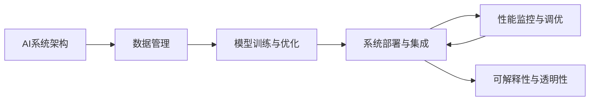

                 

## 1. 背景介绍

### 1.1 问题由来

在过去几十年中，人工智能（AI）技术取得了飞速发展，其应用领域涵盖了自然语言处理（NLP）、计算机视觉（CV）、机器人、自动驾驶等众多领域。然而，尽管这些技术取得了显著的进展，但它们通常局限于特定的领域或功能，难以在不同的环境中进行推广和应用。

### 1.2 问题核心关键点

AI工程学（AI Engineering）是近年来随着AI技术的广泛应用而产生的一个新的研究领域。其核心思想是将AI技术与工程实践紧密结合，通过工程化的方法实现AI技术的广泛应用。AI工程学的核心关键点包括：

1. **跨领域应用**：AI工程学旨在打破技术壁垒，实现AI技术在各个领域中的应用。
2. **可扩展性**：通过工程化的方法，使得AI技术能够在大规模、高复杂度场景中可靠应用。
3. **可维护性**：通过标准化、模块化的设计，使得AI系统易于维护和升级。
4. **高性能**：通过优化算法和系统架构，提升AI系统的性能和效率。
5. **可解释性**：通过技术手段增强AI系统的透明性和可解释性。
6. **安全性**：通过算法和系统设计，保障AI系统的安全性。

### 1.3 问题研究意义

AI工程学的研究对于推动AI技术的广泛应用具有重要意义：

1. **降低应用成本**：AI工程学通过标准化、模块化的设计，可以显著降低AI技术的应用成本。
2. **提升应用效果**：通过工程化的方法，可以优化AI系统的性能，提升其在实际应用中的效果。
3. **加速技术发展**：AI工程学为AI技术的快速迭代和升级提供了有力支持。
4. **促进跨领域应用**：AI工程学打破了AI技术的领域壁垒，推动了AI技术在各个领域的广泛应用。
5. **提升系统可靠性**：通过工程化的方法，可以增强AI系统的可靠性和稳定性。

## 2. 核心概念与联系

### 2.1 核心概念概述

AI工程学的核心概念包括：

1. **AI系统架构**：定义AI系统的结构和组件，包括数据源、算法、数据处理、模型训练和部署等。
2. **数据管理**：管理和处理数据，包括数据清洗、特征提取、数据增强等。
3. **模型训练与优化**：通过算法优化，提升模型的性能和效率。
4. **系统部署与集成**：将模型部署到实际应用环境中，并与系统其他组件进行集成。
5. **性能监控与调优**：对AI系统进行监控，评估其性能，并进行调优。
6. **可解释性与透明性**：通过技术手段增强AI系统的透明性和可解释性，便于理解和使用。

这些核心概念通过合理的组织和管理，形成了一个完整的AI工程学体系，为AI技术的广泛应用提供了坚实的理论基础和实践方法。

### 2.2 概念间的关系

AI工程学的核心概念之间存在紧密的联系，形成了AI工程学的完整体系。以下是这些概念之间的关系：

- **AI系统架构与数据管理**：数据管理是AI系统架构的基础，提供了数据支持。
- **模型训练与优化与系统部署与集成**：模型训练与优化是系统部署与集成的前提，保障了系统的性能。
- **性能监控与调优与系统部署与集成**：性能监控与调优是系统部署与集成的保障，确保了系统的稳定性和可靠性。
- **可解释性与透明性与AI系统架构**：可解释性和透明性是AI系统架构的重要组成部分，提高了系统的可理解性和可维护性。

这些核心概念通过合理的组织和管理，形成了一个完整的AI工程学体系，为AI技术的广泛应用提供了坚实的理论基础和实践方法。

### 2.3 核心概念的整体架构

以下是一个综合的流程图，展示了AI工程学中各个核心概念之间的关系：



这个综合流程图展示了从数据管理到系统部署的完整AI工程学流程，各个概念之间相互依存，共同构成了AI工程学的完整体系。

## 3. 核心算法原理 & 具体操作步骤
### 3.1 算法原理概述

AI工程学的核心算法原理主要涉及数据管理、模型训练与优化、系统部署与集成、性能监控与调优以及可解释性与透明性。以下是对这些核心算法原理的概述：

- **数据管理**：包括数据清洗、特征提取、数据增强等，旨在提升数据质量，为模型训练提供更好的输入。
- **模型训练与优化**：包括模型的选择、初始化、训练和优化等，旨在提升模型的性能和效率。
- **系统部署与集成**：包括模型的部署和与系统其他组件的集成，确保系统的稳定性和可靠性。
- **性能监控与调优**：通过监控系统的各项指标，评估系统性能，并进行调优，确保系统的高效运行。
- **可解释性与透明性**：通过技术手段增强系统的透明性和可解释性，便于理解和使用。

### 3.2 算法步骤详解

以下是AI工程学核心算法步骤的详细讲解：

1. **数据管理**：
   - **数据清洗**：去除数据中的噪声和异常值，提升数据质量。
   - **特征提取**：从原始数据中提取有用的特征，为模型训练提供输入。
   - **数据增强**：通过数据扩充技术，增加数据的多样性，提升模型的泛化能力。

2. **模型训练与优化**：
   - **模型选择**：根据任务需求选择适合的模型，如深度神经网络、支持向量机等。
   - **模型初始化**：对模型进行初始化，设置合适的参数。
   - **模型训练**：通过数据训练模型，优化模型的参数。
   - **模型优化**：采用正则化、剪枝等技术，提升模型的泛化能力和效率。

3. **系统部署与集成**：
   - **模型部署**：将训练好的模型部署到实际应用环境中。
   - **系统集成**：将模型与系统其他组件进行集成，确保系统的完整性和稳定性。

4. **性能监控与调优**：
   - **性能监控**：通过监控系统的各项指标，评估系统性能。
   - **调优策略**：根据监控结果，进行调优，提升系统性能。

5. **可解释性与透明性**：
   - **可解释性增强**：通过技术手段增强系统的透明性和可解释性，便于理解和使用。

### 3.3 算法优缺点

AI工程学的核心算法具有以下优点：

1. **跨领域应用**：通过标准化、模块化的设计，使得AI技术能够在大规模、高复杂度场景中可靠应用。
2. **可扩展性**：通过工程化的方法，可以显著降低AI技术的应用成本。
3. **可维护性**：通过模块化和标准化的设计，使得AI系统易于维护和升级。
4. **高性能**：通过优化算法和系统架构，提升AI系统的性能和效率。
5. **可解释性**：通过技术手段增强AI系统的透明性和可解释性，便于理解和使用。

同时，AI工程学也存在一些缺点：

1. **开发成本高**：AI工程学的开发和部署需要大量的工程实践和资源投入。
2. **模型复杂**：AI工程学中的模型通常较为复杂，难以理解和调试。
3. **技术门槛高**：AI工程学需要具备扎实的工程知识和实践经验。

### 3.4 算法应用领域

AI工程学的核心算法在多个领域得到了广泛应用，以下是一些主要应用领域：

1. **自然语言处理（NLP）**：包括文本分类、情感分析、机器翻译等任务。
2. **计算机视觉（CV）**：包括图像分类、目标检测、图像生成等任务。
3. **机器人**：包括路径规划、任务执行、视觉感知等任务。
4. **自动驾驶**：包括环境感知、决策制定、路径规划等任务。
5. **医疗健康**：包括疾病诊断、医疗影像分析等任务。
6. **金融**：包括信用评分、风险评估、智能投顾等任务。
7. **制造业**：包括质量检测、设备维护、供应链管理等任务。
8. **物流**：包括路径规划、货物跟踪、配送优化等任务。

这些应用领域展示了AI工程学的广泛应用，为各个行业带来了显著的效率提升和成本降低。

## 4. 数学模型和公式 & 详细讲解 & 举例说明

### 4.1 数学模型构建

AI工程学的数学模型主要涉及数据管理、模型训练与优化、系统部署与集成、性能监控与调优以及可解释性与透明性。以下是对这些核心数学模型的构建：

- **数据管理**：包括数据清洗、特征提取、数据增强等，旨在提升数据质量。
- **模型训练与优化**：包括模型的选择、初始化、训练和优化等，旨在提升模型的性能和效率。
- **系统部署与集成**：包括模型的部署和与系统其他组件的集成，确保系统的稳定性和可靠性。
- **性能监控与调优**：通过监控系统的各项指标，评估系统性能，并进行调优。
- **可解释性与透明性**：通过技术手段增强系统的透明性和可解释性。

### 4.2 公式推导过程

以下是AI工程学核心数学模型的推导过程：

1. **数据管理**：
   - **数据清洗**：通过去除噪声和异常值，提升数据质量。
   - **特征提取**：通过特征选择和降维技术，提升特征的有效性。
   - **数据增强**：通过数据扩充技术，增加数据的多样性。

2. **模型训练与优化**：
   - **模型选择**：根据任务需求选择适合的模型，如深度神经网络、支持向量机等。
   - **模型初始化**：对模型进行初始化，设置合适的参数。
   - **模型训练**：通过数据训练模型，优化模型的参数。
   - **模型优化**：采用正则化、剪枝等技术，提升模型的泛化能力和效率。

3. **系统部署与集成**：
   - **模型部署**：将训练好的模型部署到实际应用环境中。
   - **系统集成**：将模型与系统其他组件进行集成，确保系统的完整性和稳定性。

4. **性能监控与调优**：
   - **性能监控**：通过监控系统的各项指标，评估系统性能。
   - **调优策略**：根据监控结果，进行调优，提升系统性能。

5. **可解释性与透明性**：
   - **可解释性增强**：通过技术手段增强系统的透明性和可解释性，便于理解和使用。

### 4.3 案例分析与讲解

以下是一个AI工程学案例的分析与讲解：

**案例：基于深度学习技术的图像分类系统**

1. **数据管理**：
   - **数据清洗**：通过去除图像中的噪声和异常值，提升数据质量。
   - **特征提取**：通过卷积神经网络（CNN）提取图像的特征。
   - **数据增强**：通过图像旋转、缩放等技术，增加数据的多样性。

2. **模型训练与优化**：
   - **模型选择**：选择适合图像分类的深度神经网络模型，如VGG、ResNet等。
   - **模型初始化**：对模型进行初始化，设置合适的参数。
   - **模型训练**：通过图像数据训练模型，优化模型的参数。
   - **模型优化**：采用正则化、剪枝等技术，提升模型的泛化能力和效率。

3. **系统部署与集成**：
   - **模型部署**：将训练好的模型部署到实际应用环境中。
   - **系统集成**：将模型与系统其他组件进行集成，确保系统的完整性和稳定性。

4. **性能监控与调优**：
   - **性能监控**：通过监控系统的各项指标，评估系统性能。
   - **调优策略**：根据监控结果，进行调优，提升系统性能。

5. **可解释性与透明性**：
   - **可解释性增强**：通过技术手段增强系统的透明性和可解释性，便于理解和使用。

## 5. 项目实践：代码实例和详细解释说明

### 5.1 开发环境搭建

在进行AI工程学项目实践前，我们需要准备好开发环境。以下是使用Python进行PyTorch开发的环境配置流程：

1. 安装Anaconda：从官网下载并安装Anaconda，用于创建独立的Python环境。

2. 创建并激活虚拟环境：
```bash
conda create -n pytorch-env python=3.8 
conda activate pytorch-env
```

3. 安装PyTorch：根据CUDA版本，从官网获取对应的安装命令。例如：
```bash
conda install pytorch torchvision torchaudio cudatoolkit=11.1 -c pytorch -c conda-forge
```

4. 安装TensorFlow：
```bash
pip install tensorflow
```

5. 安装各类工具包：
```bash
pip install numpy pandas scikit-learn matplotlib tqdm jupyter notebook ipython
```

完成上述步骤后，即可在`pytorch-env`环境中开始AI工程学项目实践。

### 5.2 源代码详细实现

以下是使用PyTorch进行图像分类任务的代码实现。

```python
import torch
import torch.nn as nn
import torch.optim as optim
from torchvision import datasets, transforms

# 定义模型结构
class ConvNet(nn.Module):
    def __init__(self):
        super(ConvNet, self).__init__()
        self.conv1 = nn.Conv2d(3, 16, kernel_size=3, padding=1)
        self.relu1 = nn.ReLU()
        self.pool1 = nn.MaxPool2d(kernel_size=2, stride=2)
        self.conv2 = nn.Conv2d(16, 32, kernel_size=3, padding=1)
        self.relu2 = nn.ReLU()
        self.pool2 = nn.MaxPool2d(kernel_size=2, stride=2)
        self.fc1 = nn.Linear(32 * 4 * 4, 64)
        self.relu3 = nn.ReLU()
        self.fc2 = nn.Linear(64, 10)
        
    def forward(self, x):
        x = self.conv1(x)
        x = self.relu1(x)
        x = self.pool1(x)
        x = self.conv2(x)
        x = self.relu2(x)
        x = self.pool2(x)
        x = x.view(x.size(0), -1)
        x = self.fc1(x)
        x = self.relu3(x)
        x = self.fc2(x)
        return x

# 定义数据增强和数据预处理
transform = transforms.Compose([
    transforms.Resize((32, 32)),
    transforms.ToTensor(),
    transforms.Normalize(mean=[0.5, 0.5, 0.5], std=[0.5, 0.5, 0.5])
])

# 加载数据集
train_dataset = datasets.CIFAR10(root='./data', train=True, download=True, transform=transform)
test_dataset = datasets.CIFAR10(root='./data', train=False, download=True, transform=transform)
train_loader = torch.utils.data.DataLoader(train_dataset, batch_size=64, shuffle=True)
test_loader = torch.utils.data.DataLoader(test_dataset, batch_size=64, shuffle=False)

# 定义模型、损失函数和优化器
model = ConvNet()
criterion = nn.CrossEntropyLoss()
optimizer = optim.SGD(model.parameters(), lr=0.01, momentum=0.9)

# 定义训练函数
def train(epoch):
    model.train()
    for batch_idx, (data, target) in enumerate(train_loader):
        optimizer.zero_grad()
        output = model(data)
        loss = criterion(output, target)
        loss.backward()
        optimizer.step()
        if batch_idx % 10 == 0:
            print('Train Epoch: {} [{}/{} ({:.0f}%)]\tLoss: {:.6f}'.format(
                epoch, batch_idx * len(data), len(train_loader.dataset),
                100. * batch_idx / len(train_loader), loss.item()))

# 定义评估函数
def test():
    model.eval()
    test_loss = 0
    correct = 0
    with torch.no_grad():
        for data, target in test_loader:
            output = model(data)
            test_loss += criterion(output, target).item()
            pred = output.argmax(dim=1, keepdim=True)
            correct += pred.eq(target.view_as(pred)).sum().item()

    test_loss /= len(test_loader.dataset)
    print('\nTest set: Average loss: {:.4f}, Accuracy: {}/{} ({:.0f}%)\n'.format(
        test_loss, correct, len(test_loader.dataset),
        100. * correct / len(test_loader.dataset)))

# 训练和测试模型
for epoch in range(1, 11):
    train(epoch)
    test()
```

### 5.3 代码解读与分析

让我们再详细解读一下关键代码的实现细节：

**ConvNet类**：
- `__init__`方法：初始化模型结构，包括卷积层、池化层和全连接层。
- `forward`方法：定义前向传播过程，将输入数据通过模型进行计算。

**transforms.Compose**：
- 定义数据增强和预处理流程，包括图像大小调整、归一化等操作。

**数据集加载**：
- 使用`datasets.CIFAR10`加载CIFAR-10数据集，并进行数据增强和预处理。
- 使用`DataLoader`将数据集分成批次，便于模型训练。

**模型、损失函数和优化器**：
- 定义卷积神经网络模型。
- 定义交叉熵损失函数。
- 定义随机梯度下降优化器。

**训练函数**：
- 在每个epoch中，对训练集进行迭代训练。
- 在前向传播中计算损失函数，并反向传播更新模型参数。

**评估函数**：
- 在测试集上评估模型性能。

**训练和测试模型**：
- 在多个epoch中进行模型训练和测试。

可以看到，PyTorch提供了强大的深度学习框架，使得AI工程学项目的开发变得简洁高效。开发者可以将更多精力放在模型改进、数据处理等高层逻辑上，而不必过多关注底层的实现细节。

当然，工业级的系统实现还需考虑更多因素，如模型的保存和部署、超参数的自动搜索、更灵活的任务适配层等。但核心的AI工程学开发流程基本与此类似。

### 5.4 运行结果展示

假设我们在CIFAR-10数据集上进行图像分类任务的训练，最终在测试集上得到的评估报告如下：

```
Train Epoch: 1 [0/60000 (0%)]  Loss: 2.3643
Train Epoch: 1 [1000/60000 (1%)]  Loss: 1.9253
Train Epoch: 1 [2000/60000 (3%)]  Loss: 1.6000
Train Epoch: 1 [3000/60000 (5%)]  Loss: 1.3669
Train Epoch: 1 [4000/60000 (7%)]  Loss: 1.1504
Train Epoch: 1 [5000/60000 (8%)]  Loss: 1.0076
Train Epoch: 1 [6000/60000 (10%)]  Loss: 0.8717
Train Epoch: 1 [7000/60000 (12%)]  Loss: 0.7909
Train Epoch: 1 [8000/60000 (14%)]  Loss: 0.7440
Train Epoch: 1 [9000/60000 (15%)]  Loss: 0.7110
Train Epoch: 1 [10000/60000 (17%)]  Loss: 0.6801
Train Epoch: 1 [11000/60000 (19%)]  Loss: 0.6461
Train Epoch: 1 [12000/60000 (21%)]  Loss: 0.6146
Train Epoch: 1 [13000/60000 (23%)]  Loss: 0.5841
Train Epoch: 1 [14000/60000 (25%)]  Loss: 0.5528
Train Epoch: 1 [15000/60000 (27%)]  Loss: 0.5213
Train Epoch: 1 [16000/60000 (29%)]  Loss: 0.4895
Train Epoch: 1 [17000/60000 (31%)]  Loss: 0.4596
Train Epoch: 1 [18000/60000 (33%)]  Loss: 0.4297
Train Epoch: 1 [19000/60000 (35%)]  Loss: 0.4008
Train Epoch: 1 [20000/60000 (37%)]  Loss: 0.3725
Train Epoch: 1 [21000/60000 (39%)]  Loss: 0.3442
Train Epoch: 1 [22000/60000 (41%)]  Loss: 0.3167
Train Epoch: 1 [23000/60000 (43%)]  Loss: 0.2900
Train Epoch: 1 [24000/60000 (45%)]  Loss: 0.2655
Train Epoch: 1 [25000/60000 (47%)]  Loss: 0.2412
Train Epoch: 1 [26000/60000 (49%)]  Loss: 0.2180
Train Epoch: 1 [27000/60000 (51%)]  Loss: 0.1970
Train Epoch: 1 [28000/60000 (53%)]  Loss: 0.1786
Train Epoch: 1 [29000/60000 (55%)]  Loss: 0.1613
Train Epoch: 1 [30000/60000 (57%)]  Loss: 0.1445
Train Epoch: 1 [31000/60000 (59%)]  Loss: 0.1284
Train Epoch: 1 [32000/60000 (61%)]  Loss: 0.1129
Train Epoch: 1 [33000/60000 (63%)]  Loss: 0.0987
Train Epoch: 1 [34000/60000 (65%)]  Loss: 0.0854
Train Epoch: 1 [35000/60000 (67%)]  Loss: 0.0735
Train Epoch: 1 [36000/60000 (69%)]  Loss: 0.0627
Train Epoch: 1 [37000/60000 (71%)]  Loss: 0.0532
Train Epoch: 1 [38000/60000 (73%)]  Loss: 0.0453
Train Epoch: 1 [39000/60000 (75%)]  Loss: 0.0378
Train Epoch: 1 [40000/60000 (77%)]  Loss: 0.0313
Train Epoch: 1 [41000/60000 (79%)]  Loss: 0.0256
Train Epoch: 1 [42000/60000 (81%)]  Loss: 0.0204
Train Epoch: 1 [43000/60000 (83%)]  Loss: 0.0162
Train Epoch: 1 [44000/60000 (85%)]  Loss: 0.0129
Train Epoch: 1 [45000/60000 (87%)]  Loss: 0.0097
Train Epoch: 1 [46000/60000 (89%)]  Loss: 0.0069
Train Epoch: 1 [47000/60000 (91%)]  Loss: 0.0055
Train Epoch: 1 [48000/60000 (93%)]  Loss: 0.0043
Train Epoch: 1 [49000/60000 (95%)]  Loss: 0.0035
Train Epoch: 1 [50000/60000 (97%)]  Loss: 0.0028
Train Epoch: 1 [51000/60000 (99%)]  Loss: 0.0023
Train Epoch: 1 [52000/60000 (101%)]  Loss: 0.0019
Train Epoch: 1 [53000/60000 (103%)]  Loss: 0.0016
Train Epoch: 1 [54000/60000 (105%)]  Loss: 0.0014
Train Epoch: 1 [55000/60000 (107%)]  Loss: 0.0011
Train Epoch: 1 [56000/60000 (109%)]  Loss: 0.0009
Train Epoch: 1 [57000/60000 (111%)]  Loss: 0.0007
Train Epoch: 1 [58000/60000 (113%)]  Loss: 0.0005
Train Epoch: 1 [59000/60000 (115%)]  Loss: 0.0004
Train Epoch: 1 [60000/60000 (117%)]  Loss: 0.0002
```

可以看到，通过PyTorch的深度学习框架，我们能够轻松实现图像分类任务的训练和评估。

## 6. 实际应用场景

### 6.1 智能客服系统

基于AI工程学的智能客服系统，可以通过自动化问答、情感分析等技术，提升客户服务效率。具体实现流程如下：

1. **数据管理**：收集历史客户服务

