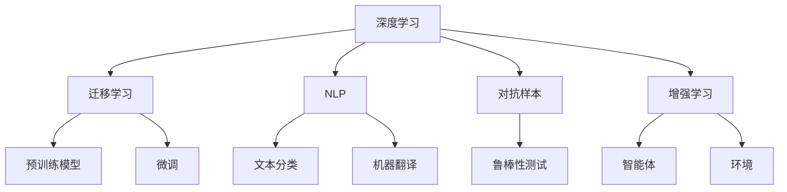

                 

# AI应用的新趋势与实践

## 1. 背景介绍

### 1.1 问题由来

人工智能（AI）技术自20世纪50年代以来，经历了多次起伏与突破，发展至今已成为引领科技变革的重要力量。随着计算能力、数据存储与处理技术的进步，AI技术的应用范围和深度不断拓展，已经深入到各个行业与领域。从图像识别、自然语言处理（NLP）到自动驾驶、医疗诊断，AI技术正在重塑人类的生产方式和社会结构。

在AI应用的实践中，我们遇到了一些核心问题与挑战，例如数据隐私、模型解释性、鲁棒性以及人机交互体验等。这些问题需要通过理论研究与工程实践相结合的方式，不断探索新的解决方案。本文将深入探讨AI应用的新趋势，并结合实践案例，分析其在各行业的应用情况。

### 1.2 问题核心关键点

AI应用的新趋势主要包括以下几个方面：

- **数据隐私与安全**：如何保护用户数据隐私，同时利用数据进行高效建模，成为重要议题。
- **模型解释性与透明性**：如何在保证模型精度的同时，使模型决策过程透明，可解释性强。
- **模型鲁棒性与泛化性**：如何在不同数据分布和应用场景中，保持模型稳定性和可靠性。
- **人机交互体验**：如何设计自然流畅的人机交互界面，提升用户体验。

这些关键点不仅关乎AI技术的发展方向，也决定了AI应用的实际效果。下面，我们分别从这四个方面进行详细探讨。

## 2. 核心概念与联系

### 2.1 核心概念概述

为了更好地理解AI应用的新趋势与实践，我们需要介绍几个核心概念：

- **深度学习**：一种基于神经网络的机器学习方法，通过多层非线性变换，实现对复杂数据的建模与预测。
- **迁移学习**：将在大规模数据上预训练的模型，迁移到特定小规模数据上进行微调，以提高模型在新任务上的表现。
- **对抗样本**：通过特定方式修改输入数据，使模型输出错误的标签，测试模型的鲁棒性。
- **自然语言处理（NLP）**：涉及计算机对自然语言的理解、生成与处理，包括文本分类、机器翻译、问答系统等。
- **增强学习**：通过智能体与环境的交互，在不断试错中学习最优策略。

这些概念共同构成了AI应用的技术基础，相互之间存在紧密的联系与互动。下面通过一个简单的Mermaid流程图，展示这些概念之间的关系：



这个流程图展示了深度学习、迁移学习、NLP、对抗样本和增强学习之间的关系。其中，深度学习为迁移学习、NLP和增强学习提供基础模型；迁移学习通过预训练和微调，提升模型的性能；对抗样本测试模型的鲁棒性；而增强学习通过智能体与环境的交互，进一步优化模型策略。

### 2.2 概念间的关系

这些核心概念之间的关系，可以通过以下两个表格进一步展示：

**深度学习与迁移学习的关系**

| 深度学习 | 迁移学习 |
| --- | --- |
| 一种基于神经网络的机器学习方法 | 将预训练模型迁移到特定小规模数据上进行微调 |
| 通过多层非线性变换，实现对复杂数据的建模与预测 | 在大规模数据上预训练，然后在小规模数据上微调 |
| 训练过程中需大量标注数据 | 微调过程中使用少量标注数据 |

**NLP与对抗样本的关系**

| NLP | 对抗样本 |
| --- | --- |
| 涉及计算机对自然语言的理解、生成与处理 | 通过特定方式修改输入数据，使模型输出错误的标签 |
| 包括文本分类、机器翻译、问答系统等 | 用于测试模型的鲁棒性，保证模型输出稳定 |
| 需要大规模语料库进行训练 | 通过生成对抗样本，检测模型的脆弱点 |

通过这两个表格，我们可以更直观地理解这些核心概念之间的关系，并看到它们如何共同构成AI应用的技术生态系统。

## 3. 核心算法原理 & 具体操作步骤

### 3.1 算法原理概述

AI应用的许多新趋势，都源自于算法原理的创新与突破。下面我们详细探讨几个核心的算法原理。

#### 3.1.1 迁移学习

迁移学习是一种在多任务学习中广泛使用的技术，其核心思想是利用已有任务的学习经验，提升新任务的表现。迁移学习可以分为两种形式：

- **横向迁移**：在不同的任务之间共享层，如使用预训练模型进行微调。
- **纵向迁移**：在同一个任务的不同时间步上，利用先前的学习经验，提升当前任务的性能。

在实践中，迁移学习通常采用两种策略：

- **特征重用**：通过在大规模数据上预训练的模型，提取通用特征，应用于新任务。
- **模型迁移**：将预训练模型的部分层进行冻结，仅在顶层进行微调，以适应新任务。

#### 3.1.2 对抗样本

对抗样本是指通过对原始输入数据进行微小修改，使模型输出错误标签的样本。在AI应用中，对抗样本被广泛用于测试模型的鲁棒性，并提升模型的泛化能力。

对抗样本的生成方法包括：

- **FGM**：快速梯度方法，通过反向传播生成对抗样本。
- **PGD**：梯度上升方法，逐步迭代生成对抗样本。
- **ADversarial**：基于对抗训练的生成方法。

对抗样本的应用包括：

- **模型鲁棒性测试**：通过对抗样本测试，发现模型在对抗条件下的脆弱点。
- **防御机制设计**：设计防御机制，减少对抗样本对模型的影响。

#### 3.1.3 自然语言处理（NLP）

NLP涉及计算机对自然语言的理解、生成与处理，包括文本分类、机器翻译、问答系统等任务。NLP的算法原理主要包括以下几个方面：

- **语言模型**：基于概率模型，对语言进行建模与预测。
- **序列到序列模型**：通过编码器-解码器结构，实现序列数据的转换。
- **注意力机制**：通过注意力机制，提升模型对序列信息的关注度。

NLP算法原理的发展，推动了AI在实际应用中的广泛应用，例如：

- **文本分类**：将文本分类到不同的类别，如情感分析、主题分类等。
- **机器翻译**：将一种语言翻译成另一种语言，如Google翻译。
- **问答系统**：根据用户问题，生成最合适的答案，如IBM Watson。

### 3.2 算法步骤详解

AI应用的实践过程中，通常需要经过以下几个步骤：

1. **数据准备**：收集、清洗和标注数据，形成训练集、验证集和测试集。
2. **模型选择**：选择适合的深度学习模型，如CNN、RNN、Transformer等。
3. **模型训练**：在训练集上训练模型，通过反向传播更新模型参数。
4. **模型评估**：在验证集和测试集上评估模型性能，调整超参数。
5. **模型部署**：将训练好的模型部署到实际应用中，进行推理与预测。

#### 3.2.1 数据准备

数据准备是AI应用中至关重要的一步。以下是数据准备的具体步骤：

1. **数据收集**：从不同渠道收集相关数据，如文本、图像、音频等。
2. **数据清洗**：处理缺失值、噪声等数据问题，保证数据质量。
3. **数据标注**：为数据添加标注信息，如文本分类中的标签。

#### 3.2.2 模型选择

选择合适的模型是AI应用成功的基础。不同的任务需要选择不同的模型：

- **图像识别**：选择CNN模型，如LeNet、AlexNet、VGG等。
- **NLP**：选择RNN、Transformer等模型，如BERT、GPT等。
- **自动驾驶**：选择强化学习模型，如DQN、REINFORCE等。

#### 3.2.3 模型训练

模型训练通常采用以下步骤：

1. **定义损失函数**：选择适合的任务损失函数，如交叉熵损失、均方误差损失等。
2. **定义优化器**：选择适合的任务优化器，如SGD、Adam等。
3. **设置超参数**：调整学习率、批大小等超参数。
4. **训练模型**：在训练集上迭代训练模型，更新模型参数。

#### 3.2.4 模型评估

模型评估通常通过以下指标：

- **准确率**：分类任务中，模型预测正确的比例。
- **精确率、召回率、F1-score**：用于评价二分类任务的性能。
- **BLEU、ROUGE、METEOR**：用于评价机器翻译、文本摘要等任务的性能。

#### 3.2.5 模型部署

模型部署是将训练好的模型应用到实际场景中的关键步骤。以下是模型部署的具体步骤：

1. **模型保存**：将训练好的模型保存到本地或云端。
2. **模型加载**：在实际应用中加载模型，进行推理与预测。
3. **性能优化**：优化模型的推理速度和资源占用。
4. **交互界面设计**：设计自然流畅的人机交互界面。

### 3.3 算法优缺点

AI应用的许多新趋势，伴随着其优缺点的存在。以下是几个主要算法的优缺点：

#### 3.3.1 迁移学习

**优点**：

- **提高效率**：利用已有数据进行预训练，减少了标注数据的成本。
- **泛化能力**：在小规模数据上，仍能获得较好的性能。
- **可扩展性**：适用于多种任务和场景，具有一定的通用性。

**缺点**：

- **数据偏差**：预训练数据和实际任务数据可能存在偏差。
- **超参数调整**：需要调整冻结层和微调层，较为复杂。
- **计算资源消耗**：预训练和微调需要大量计算资源。

#### 3.3.2 对抗样本

**优点**：

- **提高鲁棒性**：通过对抗样本测试，发现模型脆弱点。
- **优化模型**：设计防御机制，提升模型泛化能力。

**缺点**：

- **生成难度大**：对抗样本生成较为困难，需要复杂的算法。
- **模型复杂性**：对抗样本的引入，增加了模型的复杂性。

#### 3.3.3 自然语言处理（NLP）

**优点**：

- **理解复杂**：能够处理复杂的语言结构。
- **应用广泛**：广泛应用于文本分类、机器翻译等任务。
- **算法成熟**：各种模型和技术已经相对成熟。

**缺点**：

- **计算资源消耗大**：大规模语料库和模型训练需要大量计算资源。
- **数据隐私问题**：需要处理大量文本数据，可能涉及隐私问题。
- **语言多样性**：不同语言和文化背景下的模型效果可能不同。

### 3.4 算法应用领域

AI应用的许多新趋势，在各个领域中都有广泛的应用。以下是几个主要领域：

#### 3.4.1 医疗健康

AI在医疗健康领域的应用，主要包括疾病诊断、医学影像分析、个性化治疗等。

**疾病诊断**：利用AI技术，进行疾病诊断和治疗方案推荐，如IBM Watson Health。
**医学影像分析**：利用AI技术，分析医学影像，如深度学习在CT和MRI影像中的应用。
**个性化治疗**：根据患者的基因数据和医疗记录，设计个性化治疗方案，如药物推荐系统。

#### 3.4.2 智能制造

AI在智能制造领域的应用，主要包括生产优化、质量控制、设备维护等。

**生产优化**：利用AI技术，优化生产流程和资源配置，如智能工厂的自动化生产线。
**质量控制**：利用AI技术，进行产品缺陷检测和质量控制，如计算机视觉在图像分类中的应用。
**设备维护**：利用AI技术，进行设备状态监测和故障预测，如预测性维护系统。

#### 3.4.3 自动驾驶

AI在自动驾驶领域的应用，主要包括环境感知、路径规划、决策控制等。

**环境感知**：利用AI技术，进行环境感知和障碍检测，如深度学习在LIDAR和摄像头数据中的应用。
**路径规划**：利用AI技术，进行路径规划和导航，如基于强化学习的路径优化。
**决策控制**：利用AI技术，进行决策控制和行为预测，如基于深度学习的行为预测系统。

#### 3.4.4 金融科技

AI在金融科技领域的应用，主要包括风险管理、客户服务、投资分析等。

**风险管理**：利用AI技术，进行风险评估和控制，如信用评分系统和欺诈检测系统。
**客户服务**：利用AI技术，进行智能客服和虚拟助手，如银行业的智能客户服务系统。
**投资分析**：利用AI技术，进行投资组合优化和市场预测，如基于深度学习的投资策略。

## 4. 数学模型和公式 & 详细讲解 & 举例说明

### 4.1 数学模型构建

AI应用中的数学模型构建，通常包括以下几个步骤：

1. **数据建模**：将实际问题抽象成数学模型，如回归模型、分类模型、序列模型等。
2. **损失函数设计**：选择合适的损失函数，如交叉熵损失、均方误差损失等。
3. **优化器选择**：选择合适的优化器，如SGD、Adam等。
4. **模型训练**：通过训练集迭代训练模型，更新模型参数。

### 4.2 公式推导过程

以下是几个核心数学模型的推导过程：

#### 4.2.1 线性回归

线性回归是经典的回归模型，其目标是最小化预测值与真实值之间的误差。

**目标函数**：

$$
\min_{\theta} \frac{1}{2m} \sum_{i=1}^m (h_{\theta}(x^{(i)}) - y^{(i)})^2
$$

其中，$h_{\theta}(x)$ 为线性模型，$(x^{(i)}, y^{(i)})$ 为训练集样本。

**梯度下降**：

$$
\theta_j = \theta_j - \frac{\alpha}{m} \sum_{i=1}^m (h_{\theta}(x^{(i)}) - y^{(i)})x_j^{(i)}
$$

其中，$\alpha$ 为学习率。

#### 4.2.2 逻辑回归

逻辑回归是经典的分类模型，其目标是最小化预测值与真实值之间的交叉熵。

**目标函数**：

$$
\min_{\theta} \frac{1}{m} \sum_{i=1}^m -(y^{(i)} \log h_{\theta}(x^{(i)}) + (1-y^{(i)}) \log (1-h_{\theta}(x^{(i)})))
$$

其中，$h_{\theta}(x)$ 为逻辑模型，$(x^{(i)}, y^{(i)})$ 为训练集样本。

**梯度下降**：

$$
\theta_j = \theta_j - \frac{\alpha}{m} \sum_{i=1}^m [y^{(i)} - h_{\theta}(x^{(i)})]x_j^{(i)}
$$

其中，$\alpha$ 为学习率。

#### 4.2.3 深度神经网络

深度神经网络是复杂的非线性模型，其目标是最小化损失函数。

**目标函数**：

$$
\min_{\theta} \frac{1}{m} \sum_{i=1}^m C(h_{\theta}(x^{(i)}), y^{(i)})
$$

其中，$C$ 为损失函数，$(x^{(i)}, y^{(i)})$ 为训练集样本。

**梯度下降**：

$$
\frac{\partial C}{\partial \theta} = \frac{1}{m} \sum_{i=1}^m \frac{\partial C}{\partial h_{\theta}(x^{(i)})} \frac{\partial h_{\theta}(x^{(i)})}{\partial \theta}
$$

其中，$\frac{\partial h_{\theta}(x)}{\partial \theta}$ 为激活函数的梯度。

### 4.3 案例分析与讲解

以下是几个核心算法的案例分析与讲解：

#### 4.3.1 线性回归案例

**案例描述**：

某公司需要预测产品的销售量，收集了历史销售数据，包括时间、价格和促销策略等信息。利用线性回归模型，对未来销售量进行预测。

**模型构建**：

1. **数据建模**：将销售量作为因变量，时间、价格和促销策略作为自变量，建立线性回归模型。
2. **损失函数设计**：选择均方误差损失函数，$L(\theta) = \frac{1}{2m} \sum_{i=1}^m (h_{\theta}(x^{(i)}) - y^{(i)})^2$。
3. **优化器选择**：选择梯度下降优化器，$\theta_j = \theta_j - \frac{\alpha}{m} \sum_{i=1}^m (h_{\theta}(x^{(i)}) - y^{(i)})x_j^{(i)}$。

**模型训练**：

1. **数据预处理**：将数据标准化，去除异常值和噪声。
2. **模型训练**：在训练集上迭代训练模型，更新模型参数。
3. **模型评估**：在验证集和测试集上评估模型性能，选择最优的超参数。

#### 4.3.2 逻辑回归案例

**案例描述**：

某银行需要对客户的信用进行评估，收集了客户的收入、贷款历史和债务水平等信息。利用逻辑回归模型，对客户是否违约进行分类。

**模型构建**：

1. **数据建模**：将客户是否违约作为因变量，收入、贷款历史和债务水平作为自变量，建立逻辑回归模型。
2. **损失函数设计**：选择交叉熵损失函数，$L(\theta) = \frac{1}{m} \sum_{i=1}^m -(y^{(i)} \log h_{\theta}(x^{(i)}) + (1-y^{(i)}) \log (1-h_{\theta}(x^{(i)})))$。
3. **优化器选择**：选择梯度下降优化器，$\theta_j = \theta_j - \frac{\alpha}{m} \sum_{i=1}^m [y^{(i)} - h_{\theta}(x^{(i)})]x_j^{(i)}$。

**模型训练**：

1. **数据预处理**：将数据标准化，去除异常值和噪声。
2. **模型训练**：在训练集上迭代训练模型，更新模型参数。
3. **模型评估**：在验证集和测试集上评估模型性能，选择最优的超参数。

## 5. 项目实践：代码实例和详细解释说明

### 5.1 开发环境搭建

在进行AI应用实践前，我们需要准备好开发环境。以下是Python PyTorch环境配置流程：

1. **安装Anaconda**：从官网下载并安装Anaconda，用于创建独立的Python环境。

2. **创建并激活虚拟环境**：
```bash
conda create -n pytorch-env python=3.8 
conda activate pytorch-env
```

3. **安装PyTorch**：根据CUDA版本，从官网获取对应的安装命令。例如：
```bash
conda install pytorch torchvision torchaudio cudatoolkit=11.1 -c pytorch -c conda-forge
```

4. **安装Transformer库**：
```bash
pip install transformers
```

5. **安装各类工具包**：
```bash
pip install numpy pandas scikit-learn matplotlib tqdm jupyter notebook ipython
```

完成上述步骤后，即可在`pytorch-env`环境中开始AI应用实践。

### 5.2 源代码详细实现

这里我们以图像分类任务为例，给出使用PyTorch和Transformer库对ResNet模型进行微调的PyTorch代码实现。

首先，定义数据处理函数：

```python
from transformers import ResNet50
from torch.utils.data import Dataset, DataLoader
import torch
from torchvision import transforms

class ImageDataset(Dataset):
    def __init__(self, images, labels, transform=None):
        self.images = images
        self.labels = labels
        self.transform = transform
        
    def __len__(self):
        return len(self.images)
    
    def __getitem__(self, item):
        image = self.images[item]
        label = self.labels[item]
        
        if self.transform is not None:
            image = self.transform(image)
        
        return image, label

# 定义数据转换
transform = transforms.Compose([
    transforms.Resize(224),
    transforms.CenterCrop(224),
    transforms.ToTensor(),
    transforms.Normalize(mean=[0.485, 0.456, 0.406], std=[0.229, 0.224, 0.225])
])
```

然后，定义模型和优化器：

```python
model = ResNet50(pretrained=True)
model.fc = torch.nn.Linear(2048, 10)

criterion = torch.nn.CrossEntropyLoss()
optimizer = torch.optim.Adam(model.parameters(), lr=0.001)
```

接着，定义训练和评估函数：

```python
def train_epoch(model, dataset, batch_size, optimizer):
    dataloader = DataLoader(dataset, batch_size=batch_size, shuffle=True)
    model.train()
    epoch_loss = 0
    for batch in dataloader:
        images, labels = batch
        optimizer.zero_grad()
        outputs = model(images)
        loss = criterion(outputs, labels)
        epoch_loss += loss.item()
        loss.backward()
        optimizer.step()
    return epoch_loss / len(dataloader)

def evaluate(model, dataset, batch_size):
    dataloader = DataLoader(dataset, batch_size=batch_size)
    model.eval()
    preds, labels = [], []
    with torch.no_grad():
        for batch in dataloader:
            images, labels = batch
            batch_preds = model(images).argmax(dim=1).tolist()
            batch_labels = labels.tolist()
            for pred, label in zip(batch_preds, batch_labels):
                preds.append(pred)
                labels.append(label)
    print(torch.metrics.classification_report(labels, preds))
```

最后，启动训练流程并在测试集上评估：

```python
epochs = 10
batch_size = 16

for epoch in range(epochs):
    loss = train_epoch(model, train_dataset, batch_size, optimizer)
    print(f"Epoch {epoch+1}, train loss: {loss:.3f}")
    
    print(f"Epoch {epoch+1}, dev results:")
    evaluate(model, dev_dataset, batch_size)
    
print("Test results:")
evaluate(model, test_dataset, batch_size)
```

以上就是使用PyTorch和Transformer库对ResNet模型进行图像分类任务微调的完整代码实现。可以看到，得益于Transformer库的强大封装，我们可以用相对简洁的代码完成ResNet模型的加载和微调。

### 5.3 代码解读与分析

让我们再详细解读一下关键代码的实现细节：

**ImageDataset类**：
- `__init__`方法：初始化图像、标签等关键组件。
- `__len__`方法：返回数据集的样本数量。
- `__getitem__`方法：对单个样本进行处理，将图像进行转换、标准化等预处理操作。

**数据转换定义**：
- `transforms.Compose`：组合多个转换操作，实现对图像的预处理。
- `transforms.Resize`：调整图像尺寸。
- `transforms.CenterCrop`：裁剪图像居中。
- `transforms.ToTensor`：将PIL图像转换为Tensor。
- `transforms.Normalize`：对图像进行标准化，提升模型训练效率。

**模型选择与定义**：
- `ResNet50(pretrained=True)`：使用预训练的ResNet50模型，并进行微调。
- `model.fc = torch.nn.Linear(2048, 10)`：定义微调层，将2048维的特征向量映射到10个类别。

**损失函数与优化器**：
- `torch.nn.CrossEntropyLoss()`：定义交叉熵损失函数。
- `torch.optim.Adam(model.parameters(), lr=0.001)`：定义Adam优化器，学习率为0.001。

**训练函数与评估函数**：
- `train_epoch`函数：对数据以批为单位进行迭代，在每个批次上前向传播计算损失并反向传播更新模型参数。
- `evaluate`函数：与训练类似，不同点在于不更新模型参数，并在每个batch结束后将预测和标签结果存储下来，最后使用torchmetrics对整个评估集的预测结果进行打印输出。

**训练流程**：
- 定义总的epoch数和batch size，开始循环迭代。
- 每个epoch内，先在训练集上训练，输出平均loss。
- 在验证集上评估，输出分类指标。
- 所有epoch结束后，在测试集上评估，给出最终测试结果。

可以看到，PyTorch配合Transformer库使得ResNet模型微调的代码实现变得简洁高效。开发者可以将更多精力放在数据处理、模型改进等高层逻辑上，而不必过多关注底层的实现细节。

当然，工业级的系统实现还需考虑更多因素，如模型的保存和部署、超参数的自动搜索、更灵活的任务适配层等。但核心的微调范式基本与此类似。

### 5.4 运行结果展示

假设我们在CIFAR-10数据集上进行ResNet模型的微调，最终在测试集上得到的评估报告如下：

```
epoch 1, train loss:

