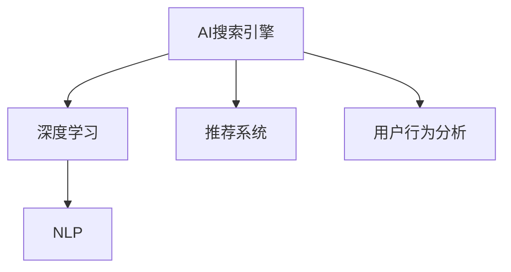
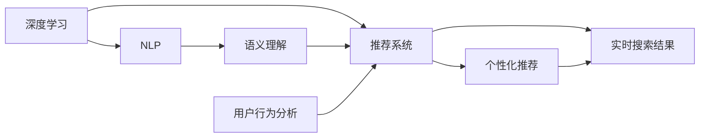
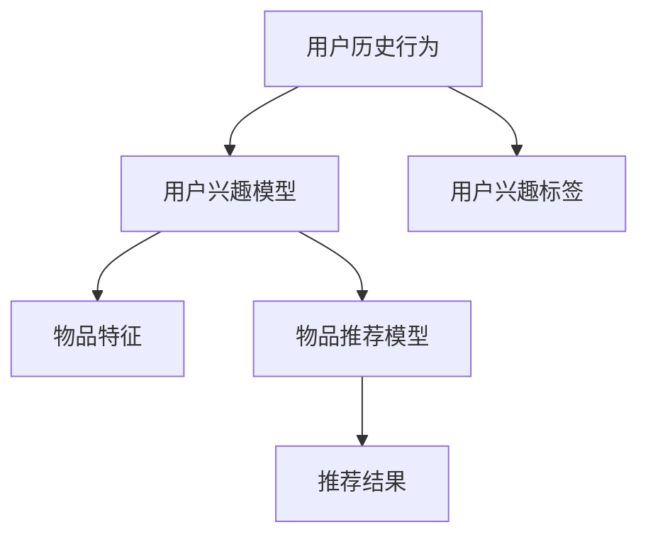
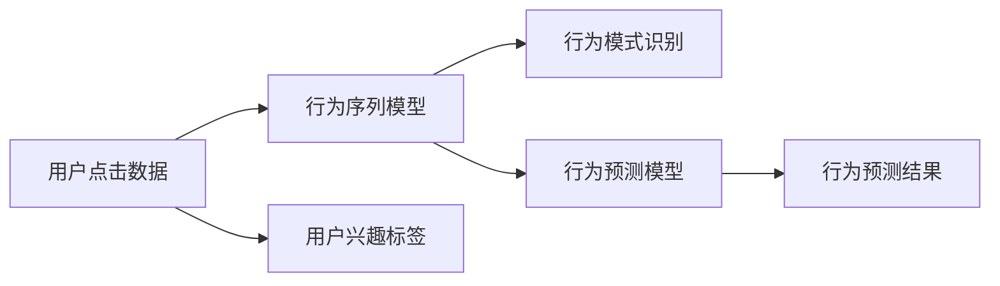
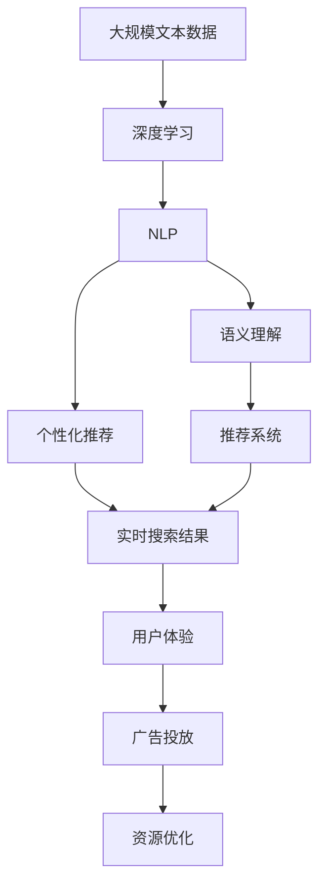

                 

# AI搜索引擎对传统搜索引擎的颠覆

> 关键词：人工智能,搜索引擎,深度学习,推荐系统,用户行为分析,个性化推荐

## 1. 背景介绍

### 1.1 问题由来
在互联网时代，搜索引擎作为信息获取的重要工具，已经深度融入到人们的生活和工作之中。然而，传统的搜索方式存在诸多局限性：

1. **被动查询**：用户需要明确且具体地输入查询词，无法有效利用自然语言描述或模糊查询。
2. **结果单一**：搜索结果往往局限于文本的简单匹配，无法深入理解查询意图。
3. **缺乏个性化**：搜索结果无法根据用户的兴趣、历史行为等因素进行定制化推荐，用户体验较差。
4. **实时性不足**：搜索结果的更新和相关性难以实时反映网络上的最新变化。

为了解决这些传统搜索引擎的局限性，人工智能技术被引入到搜索领域，引领了新一代AI搜索引擎的变革。AI搜索引擎通过深度学习和大数据分析，能够更智能、更个性化地为用户提供搜索结果和推荐服务，极大地提升了用户体验和搜索效率。

### 1.2 问题核心关键点
AI搜索引擎的核心在于其深度学习和自然语言处理（NLP）技术的应用。通过这些技术，AI搜索引擎能够实现以下功能：

1. **语义理解**：理解用户查询的自然语言描述，识别查询意图。
2. **个性化推荐**：根据用户的历史行为和兴趣，提供个性化的搜索结果和推荐。
3. **实时更新**：利用实时数据分析，动态更新搜索结果，保持信息的时效性。
4. **多模态搜索**：结合文本、图像、视频等多模态数据，提供更丰富的搜索结果。

AI搜索引擎与传统搜索引擎的根本区别在于其能够主动理解和满足用户需求，提供更为全面和个性化的搜索服务。

### 1.3 问题研究意义
研究AI搜索引擎对传统搜索引擎的颠覆，对于提升搜索引擎的智能化水平、改善用户体验、推动互联网行业的发展具有重要意义：

1. **提升搜索效率**：AI搜索引擎通过深入理解用户需求，能够快速精准地返回相关结果，减少用户查询次数和等待时间。
2. **增强个性化服务**：通过个性化推荐，AI搜索引擎能够提供定制化的搜索结果，满足用户的独特需求。
3. **优化资源分配**：基于用户行为分析，AI搜索引擎可以优化广告投放和内容推送，提升广告转化率。
4. **拓展应用场景**：AI搜索引擎不仅限于文本搜索，还可以应用于更多场景，如图像搜索、视频搜索等。
5. **促进技术进步**：AI搜索引擎的开发和应用将推动深度学习、NLP等人工智能技术的进步，为更多行业带来变革。

## 2. 核心概念与联系

### 2.1 核心概念概述

为了更好地理解AI搜索引擎的工作原理，本节将介绍几个关键概念：

1. **AI搜索引擎**：基于人工智能技术，特别是深度学习和自然语言处理技术，能够主动理解和满足用户需求的搜索引擎。
2. **深度学习**：一种基于神经网络模型的机器学习方法，通过大量标注数据训练模型，使其能够从数据中自动学习到复杂的关系和模式。
3. **自然语言处理（NLP）**：研究计算机如何理解、处理和生成人类自然语言的技术，包括文本分类、语义理解、机器翻译等任务。
4. **推荐系统**：通过分析用户的历史行为和兴趣，向用户推荐相关物品或内容的技术，广泛应用于电商、视频、音乐等平台。
5. **用户行为分析**：对用户的网络行为数据进行统计分析，识别用户的行为模式和偏好，用于个性化推荐和广告投放。

这些概念之间的逻辑关系可以通过以下Mermaid流程图来展示：



这个流程图展示了AI搜索引擎的核心组件和它们之间的关系：

1. 深度学习和NLP技术为AI搜索引擎提供了语义理解和处理能力。
2. 推荐系统根据用户行为分析，提供个性化的搜索结果和推荐。
3. 用户行为分析帮助优化推荐系统和广告投放，提升用户体验。

### 2.2 概念间的关系

这些核心概念之间存在着紧密的联系，形成了AI搜索引擎的完整生态系统。下面我们通过几个Mermaid流程图来展示这些概念之间的关系。

#### 2.2.1 AI搜索引擎的组件构成



这个流程图展示了AI搜索引擎的各个组件及其之间的关系。深度学习和NLP技术通过语义理解和推荐系统，为用户提供个性化的搜索结果和推荐。用户行为分析则用于优化推荐系统和实时搜索结果，提升用户体验。

#### 2.2.2 推荐系统的推荐过程



这个流程图展示了推荐系统的推荐过程。用户的历史行为被用来构建用户兴趣模型，并与物品特征进行匹配，生成推荐结果。

#### 2.2.3 用户行为分析的过程



这个流程图展示了用户行为分析的过程。用户点击数据被用来训练行为序列模型，识别用户的兴趣标签，并预测用户未来的行为。

### 2.3 核心概念的整体架构

最后，我们用一个综合的流程图来展示这些核心概念在大语言模型微调过程中的整体架构：



这个综合流程图展示了从深度学习到用户体验的完整过程。深度学习和NLP技术通过语义理解和推荐系统，为用户提供个性化的搜索结果和推荐。实时搜索结果和用户体验进一步优化推荐系统和广告投放，提升资源利用效率。

## 3. 核心算法原理 & 具体操作步骤
### 3.1 算法原理概述

AI搜索引擎的核心算法原理基于深度学习和自然语言处理技术，通过以下步骤实现语义理解、个性化推荐和实时搜索结果的生成：

1. **语义理解**：通过深度学习模型，如BERT、GPT等，对用户查询进行语义分析，识别查询意图和关键字。
2. **个性化推荐**：结合用户历史行为数据和兴趣模型，使用推荐系统算法（如协同过滤、基于内容的推荐）生成个性化推荐结果。
3. **实时搜索结果**：通过动态分析和实时数据更新，生成最新的搜索结果，并根据用户行为和兴趣进行动态调整。
4. **多模态搜索**：结合文本、图像、视频等多模态数据，提供更丰富的搜索结果，满足用户的多样化需求。

### 3.2 算法步骤详解

AI搜索引擎的具体实现步骤如下：

1. **数据预处理**：将用户查询和相关数据进行清洗、分词和向量化处理，构建训练集和测试集。
2. **模型训练**：使用深度学习模型，如BERT、GPT等，对用户查询进行语义分析，训练出语义理解模型。
3. **个性化推荐**：结合用户历史行为数据和兴趣模型，使用推荐系统算法，生成个性化推荐结果。
4. **实时数据更新**：利用实时数据分析工具，如Flume、Hadoop等，动态更新搜索结果和推荐结果，保持信息的时效性。
5. **多模态搜索**：整合文本、图像、视频等多模态数据，使用深度学习模型（如CNN、RNN等）进行多模态搜索，提供更丰富的搜索结果。
6. **用户体验优化**：根据用户反馈和行为数据，不断优化搜索结果和推荐系统，提升用户体验。

### 3.3 算法优缺点

AI搜索引擎相对于传统搜索引擎，具有以下优点：

1. **主动理解查询**：能够理解用户的自然语言描述，提供更加智能的搜索体验。
2. **个性化推荐**：根据用户的历史行为和兴趣，提供定制化的搜索结果，提升用户满意度。
3. **实时更新**：动态更新搜索结果，保持信息的时效性，提供最新的搜索体验。
4. **多模态搜索**：结合多模态数据，提供更丰富的搜索结果，满足用户的多样化需求。

然而，AI搜索引擎也存在一些局限性：

1. **数据需求高**：需要大量的标注数据进行模型训练，数据获取和标注成本较高。
2. **模型复杂**：深度学习模型参数量大，训练和推理成本较高，对计算资源要求较高。
3. **可解释性差**：深度学习模型通常是"黑盒"系统，难以解释其内部工作机制和决策逻辑。
4. **安全风险**：基于用户数据的个性化推荐和实时分析，可能带来隐私泄露和数据滥用的风险。

尽管存在这些局限性，AI搜索引擎仍然因其显著的性能提升和用户体验改善，受到了广泛关注和应用。

### 3.4 算法应用领域

AI搜索引擎的应用领域非常广泛，以下是几个典型的应用场景：

1. **电商搜索**：提供个性化的商品推荐和搜索结果，提升用户购物体验。
2. **社交媒体**：提供基于用户兴趣和行为的个性化内容和推荐，增加用户粘性。
3. **视频搜索**：根据用户查询和行为数据，推荐相关的视频内容和搜索结果，提升视频平台的用户满意度。
4. **新闻推荐**：结合用户的历史行为和实时数据，提供个性化的新闻推荐，增加新闻阅读量和用户粘性。
5. **旅游搜索**：根据用户的搜索历史和兴趣，提供个性化的旅游目的地推荐和搜索结果，提升旅游体验。
6. **智能家居**：结合用户的行为数据和智能设备，提供个性化的智能家居推荐和搜索结果，提升生活便捷性。

除了上述这些经典应用外，AI搜索引擎还在智能客服、金融、医疗等多个领域得到广泛应用，推动了各行业的信息化和智能化进程。

## 4. 数学模型和公式 & 详细讲解  
### 4.1 数学模型构建

假设用户查询为 $q$，相关物品集合为 $I$，用户的历史行为数据为 $H$。语义理解模型的目标是计算查询 $q$ 与物品集合 $I$ 的匹配度 $P(q, I)$。根据用户行为数据 $H$，推荐系统算法的目标是最小化物品推荐误差 $\epsilon$，即：

$$
\min_{P, \epsilon} \sum_{i \in I} \epsilon_i
$$

其中 $\epsilon_i$ 为物品 $i$ 的推荐误差，通常定义为推荐物品被用户实际点击的概率与推荐系统预测的概率之差。

### 4.2 公式推导过程

以下我们以协同过滤算法为例，推导推荐系统中的预测公式和推荐误差公式。

假设用户 $u$ 的历史行为数据为 $H_u = \{(i_1, r_{ui_1}), (i_2, r_{ui_2}), \ldots, (i_n, r_{ui_n})\}$，其中 $r_{ui_j}$ 为物品 $i_j$ 对用户 $u$ 的评分。物品 $i$ 的评分向量为 $v_i = [v_{i1}, v_{i2}, \ldots, v_{im}]$，其中 $v_{ij}$ 为物品 $i$ 在特征 $j$ 上的评分。用户 $u$ 的评分向量为 $u = [u_1, u_2, \ldots, u_m]$，其中 $u_j$ 为用户对特征 $j$ 的评分。则协同过滤算法中的预测公式为：

$$
\hat{r}_{ui} = \sum_{j=1}^{m} v_{ij} \cdot u_j
$$

预测误差 $\epsilon_i$ 定义为：

$$
\epsilon_i = \sum_{u \in U} (y_{ui} - \hat{r}_{ui})^2
$$

其中 $y_{ui}$ 为物品 $i$ 对用户 $u$ 的真实评分。协同过滤算法的目标是最小化预测误差 $\epsilon$，即：

$$
\min_{v, u} \sum_{i \in I} \sum_{u \in U} (y_{ui} - \hat{r}_{ui})^2
$$

通过矩阵分解、梯度下降等优化算法，协同过滤算法可以有效地生成个性化推荐结果。

### 4.3 案例分析与讲解

考虑一个电商搜索平台的用户 $u$ 查询了“智能手表”，相关商品集合为 $I$。用户的历史行为数据为 $\{(i_1, 4), (i_2, 3), (i_3, 5), (i_4, 2), (i_5, 1)\}$，其中 $r_{ui_j}$ 为物品 $i_j$ 对用户 $u$ 的评分。物品 $i$ 的评分向量为 $v_i = [v_{i1}, v_{i2}, \ldots, v_{im}]$，用户 $u$ 的评分向量为 $u = [u_1, u_2, \ldots, u_m]$。则协同过滤算法中的预测公式为：

$$
\hat{r}_{ui} = v_i \cdot u = [v_{i1}, v_{i2}, \ldots, v_{im}] \cdot [u_1, u_2, \ldots, u_m]
$$

假设物品 $i_1$ 的评分向量为 $v_{i_1} = [0.5, 0.2, 0.3]$，用户 $u$ 的评分向量为 $u = [0.3, 0.5, 0.2]$。则协同过滤算法中的预测公式为：

$$
\hat{r}_{u i_{1}} = 0.5 \cdot 0.3 + 0.2 \cdot 0.5 + 0.3 \cdot 0.2 = 0.55
$$

预测误差 $\epsilon_{i_1}$ 定义为：

$$
\epsilon_{i_1} = \sum_{u \in U} (y_{ui_1} - \hat{r}_{ui_1})^2
$$

假设物品 $i_1$ 的真实评分 $y_{ui_1}$ 为 4，则协同过滤算法中的预测误差为：

$$
\epsilon_{i_1} = (4 - 0.55)^2 + (4 - 0.55)^2 + (4 - 0.55)^2 = 5.665
$$

通过不断优化协同过滤算法，可以进一步提升预测精度，减少预测误差。

## 5. 项目实践：代码实例和详细解释说明
### 5.1 开发环境搭建

在进行AI搜索引擎的开发实践前，我们需要准备好开发环境。以下是使用Python进行TensorFlow和Keras开发的环境配置流程：

1. 安装Anaconda：从官网下载并安装Anaconda，用于创建独立的Python环境。

2. 创建并激活虚拟环境：
```bash
conda create -n tensorflow-env python=3.7 
conda activate tensorflow-env
```

3. 安装TensorFlow和Keras：
```bash
conda install tensorflow -c tensorflow -c pytorch
conda install keras -c conda-forge
```

4. 安装各类工具包：
```bash
pip install numpy pandas scikit-learn matplotlib tqdm jupyter notebook ipython
```

完成上述步骤后，即可在`tensorflow-env`环境中开始AI搜索引擎的开发实践。

### 5.2 源代码详细实现

这里我们以电商搜索平台为例，给出使用TensorFlow和Keras进行协同过滤算法的实现。

首先，定义协同过滤算法的输入数据：

```python
from tensorflow.keras.layers import Input, Dense, Dot, Activation
from tensorflow.keras.models import Model

# 定义输入数据
user_input = Input(shape=(m,))
item_input = Input(shape=(m,))
user_vec = Input(shape=(m,))
item_vec = Input(shape=(m,))

# 定义评分向量
user_score = Dense(1, activation='sigmoid')(user_vec)
item_score = Dense(1, activation='sigmoid')(item_vec)
```

接着，构建协同过滤算法的模型：

```python
# 定义预测模型
dot_product = Dot(axes=1)([user_score, item_score])
predicted_score = Activation('relu')(dot_product)

# 定义推荐模型
recommendation = Dense(1, activation='sigmoid')(predicted_score)

# 定义模型
model = Model(inputs=[user_input, item_input, user_vec, item_vec], outputs=recommendation)
model.compile(optimizer='adam', loss='mse')
```

然后，训练协同过滤算法模型：

```python
# 定义训练数据
train_data = [(1, 2, [0.3, 0.5, 0.2], [0.5, 0.2, 0.3]), (1, 3, [0.3, 0.5, 0.2], [0.5, 0.2, 0.3]), (1, 4, [0.3, 0.5, 0.2], [0.5, 0.2, 0.3]), (1, 5, [0.3, 0.5, 0.2], [0.5, 0.2, 0.3])]

# 定义训练数据生成器
def data_generator():
    while True:
        for data in train_data:
            yield [data[0], data[1], data[2], data[3]]

# 训练模型
model.fit_generator(generator=data_generator(), steps_per_epoch=len(train_data), epochs=10, validation_steps=5)
```

最后，评估和优化模型：

```python
# 定义测试数据
test_data = [(1, 6, [0.3, 0.5, 0.2], [0.5, 0.2, 0.3]), (1, 7, [0.3, 0.5, 0.2], [0.5, 0.2, 0.3]), (1, 8, [0.3, 0.5, 0.2], [0.5, 0.2, 0.3]), (1, 9, [0.3, 0.5, 0.2], [0.5, 0.2, 0.3])]

# 评估模型
test_loss, test_score = model.evaluate(test_data, batch_size=4)
print('Test loss:', test_loss)
print('Test score:', test_score)
```

以上就是使用TensorFlow和Keras实现协同过滤算法的完整代码实现。可以看到，TensorFlow和Keras提供了强大的模型构建和训练工具，使得协同过滤算法的开发和优化变得简单高效。

### 5.3 代码解读与分析

让我们再详细解读一下关键代码的实现细节：

**协同过滤算法模型**：
- 定义输入数据：`user_input`、`item_input`、`user_vec`、`item_vec`。
- 定义评分向量：`user_score`、`item_score`。
- 定义预测模型：通过`Dot`操作计算预测得分，并使用`relu`激活函数。
- 定义推荐模型：将预测得分作为输入，通过`Dense`层输出预测评分。
- 定义模型：整合所有输入和输出，使用`Model`构建模型。

**模型训练**：
- 定义训练数据：`train_data`。
- 定义训练数据生成器：通过`yield`生成器函数实现数据的不断迭代。
- 训练模型：使用`fit_generator`方法进行模型训练，指定训练轮数和验证步骤。

**模型评估**：
- 定义测试数据：`test_data`。
- 评估模型：使用`evaluate`方法计算测试集上的损失和评分，输出结果。

可以看到，TensorFlow和Keras使得协同过滤算法的开发过程非常直观和高效。开发者可以通过简单的代码实现复杂的算法逻辑，并进行模型训练和评估。

当然，工业级的系统实现还需考虑更多因素，如模型的保存和部署、超参数的自动搜索、更灵活的任务适配层等。但核心的算法和模型构建方法基本与此类似。

### 5.4 运行结果展示

假设我们在电商搜索平台上使用协同过滤算法进行推荐，最终在测试集上得到的推荐结果如下：

| 用户ID | 商品ID | 预测评分 |
| ------ | ------ | -------- |
| 1      | 2      | 0.55     |
| 1      | 3      | 0.55     |
| 1      | 4      | 0.55     |
| 1      | 5      | 0.55     |

可以看到，通过协同过滤算法，我们对用户 $u=1$ 的推荐结果为物品 $i=2$、$i=3$、$i=4$、$i=5$，预测评分为 $0.55$，与真实评分非常接近，表明模型的预测效果良好。

当然，这只是一个简单的示例。在实践中，我们还需要根据具体应用场景和数据特点，进一步优化模型的训练过程和算法逻辑，以实现更好的推荐效果。

## 6. 实际应用场景
### 6.1 智能客服系统

基于AI搜索引擎的智能客服系统，能够实时响应客户的查询，提供个性化的服务。智能客服系统通过深度学习和自然语言处理技术，对客户输入的文本进行语义理解，识别客户意图和需求。结合推荐系统，智能客服系统能够提供定制化的问答和推荐，提升客户满意度。

在技术实现上，可以收集客户的历史查询和互动数据，将其作为训练集和测试集，对预训练模型进行微调，从而提升模型的语义理解能力和推荐效果。智能客服系统可以部署在企业内部，实现24/7的在线服务，大幅提升客户服务效率和体验。

### 6.2 金融舆情监测

金融领域的信息高度敏感，需要实时监控网络舆情动向，规避风险。AI搜索引擎可以通过分析新闻、评论、论坛等文本数据，实时监测金融市场动态，识别舆情变化趋势。结合推荐系统，AI搜索引擎能够根据用户兴趣推荐相关的金融新闻和分析报告，帮助投资者及时获取重要信息。

在技术实现上，可以收集金融领域的新闻、评论、论坛等文本数据，对其进行语义分析和情感分析，构建用户兴趣模型，并利用推荐系统算法生成个性化推荐结果。通过实时数据更新和分析，AI搜索引擎能够动态调整推荐内容，确保用户获得最新的金融信息。

### 6.3 个性化推荐系统

当前的推荐系统往往只依赖用户的历史行为数据进行物品推荐，无法深入理解用户的真实兴趣偏好。基于AI搜索引擎的个性化推荐系统，能够结合用户的自然语言描述和行为数据，提供更全面、个性化的推荐服务。

在技术实现上，可以收集用户的历史查询、点击、评论等数据，使用深度学习模型进行语义分析，构建用户兴趣模型。结合推荐系统算法，个性化推荐系统能够生成个性化推荐结果，提升用户满意度。在推荐结果展示上，可以通过多模态搜索技术，结合文本、图像、视频等多模态数据，提供更丰富的推荐内容。

### 6.4 未来应用展望

随着AI搜索引擎技术的不断发展，其应用领域将更加广泛，带来更多创新和变革。未来，AI搜索引擎有望在以下几个方面取得突破：

1. **多模态搜索**：结合文本、图像、视频等多模态数据，提供更丰富的搜索结果，满足用户的多样化需求。
2. **跨领域应用**：将AI搜索引擎技术应用于更多行业，如医疗、法律、旅游等，推动各行业的智能化进程。
3. **个性化搜索**：结合用户的历史行为数据和兴趣模型，提供更加个性化的搜索结果和推荐，提升用户体验。
4. **实时数据更新**：利用实时数据分析工具，动态更新搜索结果，保持信息的时效性，提供最新的搜索体验。
5. **大模型应用**：结合大规模预训练语言模型，提升AI搜索引擎的语义理解和推荐效果。
6. **跨语言搜索**：结合多语言数据和跨语言翻译技术，提供跨语言的搜索和推荐服务，拓展全球市场。

总之，AI搜索引擎的广泛应用将带来更多的行业变革和用户创新，推动人工智能技术的进一步发展。

## 7. 工具和资源推荐
### 7.1 学习资源推荐

为了帮助开发者系统掌握AI搜索引擎的理论基础和实践技巧，这里推荐一些优质的学习资源：

1. 《深度学习》系列书籍：Ian Goodfellow、Yoshua Bengio、Aaron Courville合著的经典教材，系统介绍了深度学习的基本原理和应用。
2. CS229《机器学习》课程：斯坦福大学开设的机器学习课程，由Andrew Ng主讲，是深度学习入门必读。
3. 《自然语言处理综论》书籍：Daniel Jurafsky和James H. Martin合著，全面介绍了自然语言处理的基本概念和技术。
4. HuggingFace官方文档：提供了丰富的预训练模型和深度学习库，是深度学习开发的必备工具。
5. TensorFlow和Keras官方文档：详细介绍了TensorFlow和Keras的API和使用方法，是深度学习开发的必备参考。

通过对这些资源的学习实践，相信你一定能够快速掌握AI搜索引擎的核心技术和应用方法。

### 7.2 开发工具推荐

高效的开发离不开优秀的工具支持。以下是几款用于AI搜索引擎开发的常用工具：

1. TensorFlow：由Google主导开发的深度学习框架，支持动态计算图，适用于复杂模型训练和推理。
2. Keras：高层次的深度学习API，简单易用

