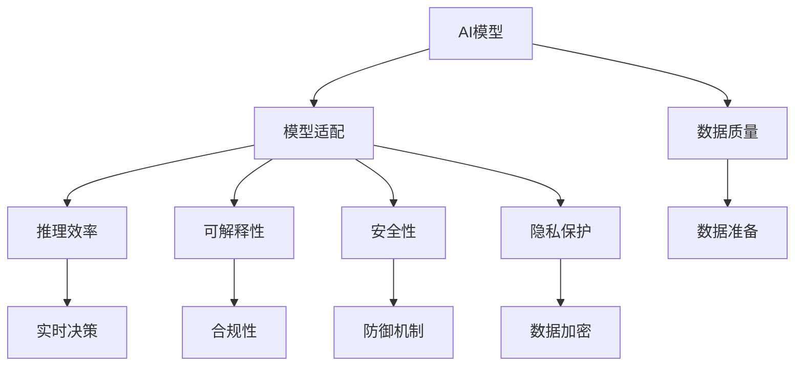
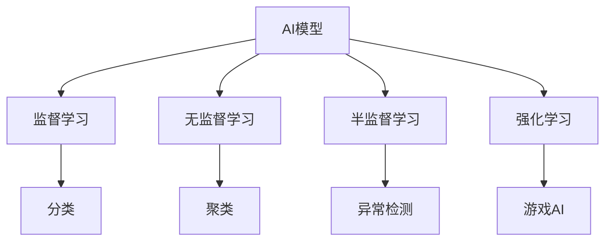
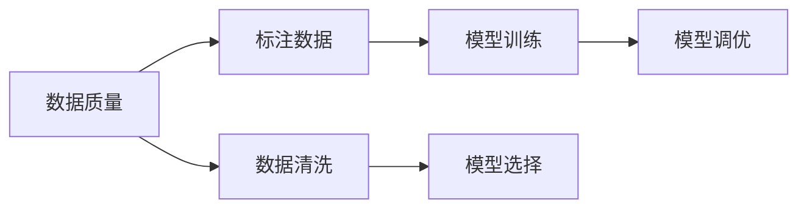
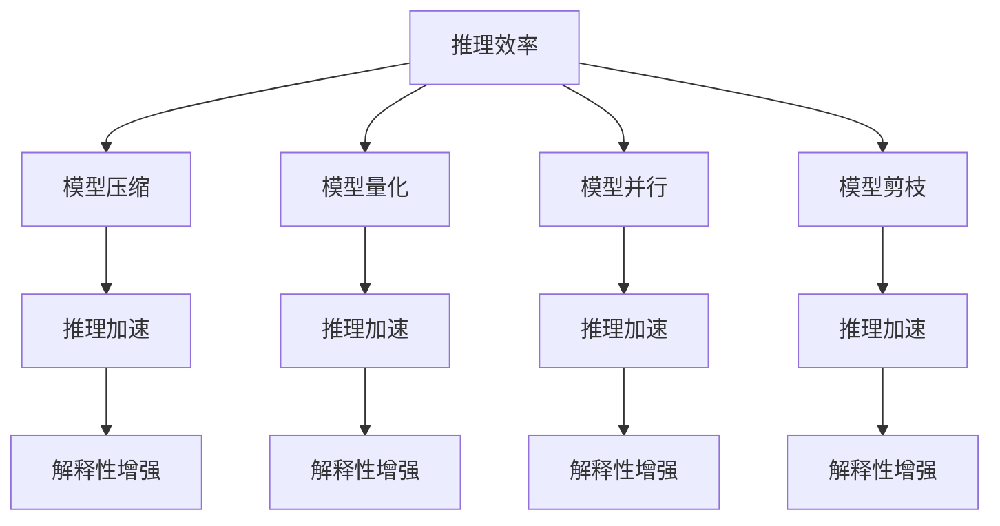

                 

# AI模型在现实世界中的实际应用

> 关键词：AI模型, 现实世界, 工业应用, 医疗诊断, 金融风险, 智能推荐, 自动驾驶, 自然语言处理

## 1. 背景介绍

### 1.1 问题由来
随着人工智能技术的飞速发展，AI模型已经被广泛应用于各个领域，从医疗诊断到金融风控，从智能推荐到自动驾驶，从语音识别到图像处理，AI模型正在深刻改变现实世界的运行方式。但是，AI模型的实际应用并非一帆风顺，如何在现实世界中有效利用AI模型，提升业务价值和用户体验，成为当前研究的一个重要课题。

### 1.2 问题核心关键点
AI模型在现实世界中的实际应用涉及多个核心关键点：

- 数据质量：AI模型性能的提升在很大程度上依赖于数据的质量和多样性，如何获取高质量的数据成为实际应用中的首要挑战。
- 模型适配：不同的业务场景和需求，需要不同的AI模型进行适配，如何设计并调优模型以适应特定任务成为关键。
- 推理效率：AI模型在大规模数据处理和实时决策中的推理效率，对系统的整体性能和用户体验有重要影响。
- 可解释性：AI模型的决策过程和结果，是否能够被理解和解释，影响其在合规和信任方面的应用。
- 安全性和隐私：AI模型在处理敏感数据时，需要考虑安全性和隐私保护问题，防止数据泄露和滥用。

这些核心关键点在AI模型的实际应用中相互交织，构成了一个复杂但引人入胜的挑战空间。

### 1.3 问题研究意义
了解AI模型在现实世界中的实际应用，对于AI技术的落地和推广具有重要意义：

1. 降低应用开发成本：AI模型通过预训练和微调，可以在特定任务上快速实现高性能应用，减少从头开发的成本。
2. 提升模型效果：AI模型在现实世界中的应用，可以在海量数据和复杂场景中优化性能，提供更精准、更有效的解决方案。
3. 加速开发进度：基于AI模型的快速迭代和优化，可以在短时间内推出新的产品和服务，缩短开发周期。
4. 技术创新：AI模型的实际应用推动了相关领域的技术进步，催生了新的研究方向和应用场景。
5. 赋能产业升级：AI模型的应用，为各行各业带来了新的技术手段和商业机会，促进了产业的数字化转型。

## 2. 核心概念与联系

### 2.1 核心概念概述

AI模型在现实世界中的应用，涉及多个核心概念。以下是一些关键概念及其概述：

- **AI模型（Artificial Intelligence Model）**：通过机器学习算法训练得到的，能够处理复杂任务、识别模式、进行预测或决策的软件系统。AI模型包括但不限于神经网络、决策树、支持向量机等。
- **数据质量（Data Quality）**：指数据在采集、存储、传输和处理过程中的完整性、准确性、一致性和可靠性。数据质量直接影响AI模型的训练效果和应用表现。
- **模型适配（Model Adaptation）**：根据特定业务场景和需求，设计并调优AI模型，使其能够高效、准确地解决问题。模型适配包括数据准备、模型选择、超参数调优等环节。
- **推理效率（Inference Efficiency）**：AI模型在实时决策和数据处理中的推理速度和资源占用，直接影响到系统的性能和用户体验。
- **可解释性（Explainability）**：AI模型的决策过程和结果，是否能够被理解和解释，影响其在合规和信任方面的应用。
- **安全性（Security）**：AI模型在处理敏感数据时，是否能够防止数据泄露和滥用，保护用户隐私和数据安全。
- **隐私保护（Privacy Protection）**：AI模型在处理敏感数据时，是否能够保护个人隐私，防止数据被非法访问或滥用。

这些核心概念之间的联系可以通过以下Mermaid流程图来展示：



这个流程图展示了大语言模型在现实世界中的应用过程中，各个核心概念的相互关系：

1. AI模型通过数据质量获得训练数据，进行模型适配，以达到高效的推理效率。
2. 推理效率和可解释性有助于合规性和安全性，确保系统的稳定性和用户信任。
3. 隐私保护与安全性和合规性紧密相关，保护用户隐私是AI模型应用的重要前提。

### 2.2 概念间的关系

这些核心概念之间存在着紧密的联系，构成了AI模型在现实世界中的应用框架。下面通过几个Mermaid流程图来展示这些概念之间的关系：

#### 2.2.1 AI模型的学习范式



这个流程图展示了AI模型常用的学习范式：

1. 监督学习：通过标注数据进行训练，模型能够预测输出。
2. 无监督学习：通过未标注数据进行训练，模型能够发现数据中的潜在模式和结构。
3. 半监督学习：通过少量标注数据和大量未标注数据进行训练，模型能够提高预测精度。
4. 强化学习：通过与环境互动，模型能够学习最优策略。

#### 2.2.2 数据质量与模型适配的关系



这个流程图展示了数据质量与模型适配的关系：

1. 数据质量包括标注数据和数据清洗两个方面。标注数据的质量直接影响模型的训练效果。
2. 数据清洗能够去除数据中的噪声和错误，提升数据质量。
3. 模型训练和调优需要高质量的标注数据和清洗后的数据，才能获得高性能的AI模型。

#### 2.2.3 推理效率与可解释性的关系



这个流程图展示了推理效率与可解释性的关系：

1. 推理效率包括模型压缩、模型量化、模型并行、模型剪枝等技术，能够提升模型的推理速度和资源利用率。
2. 推理效率的提升有助于提高模型的可解释性，使模型输出更容易被理解和解释。
3. 模型压缩、量化、并行和剪枝等技术，既能提升推理效率，又能增强模型的可解释性。

## 3. 核心算法原理 & 具体操作步骤

### 3.1 算法原理概述

AI模型在现实世界中的应用，通常需要经过以下几个步骤：

1. 数据准备：收集和预处理数据，包括数据清洗、特征工程、数据增强等。
2. 模型适配：选择合适的AI模型，并进行超参数调优和模型训练。
3. 模型评估：在测试集上评估模型性能，调整模型参数和策略，提升模型效果。
4. 部署上线：将训练好的模型部署到生产环境，实现实时推理和决策。

AI模型的应用过程涉及多个核心算法，包括但不限于：

- **监督学习（Supervised Learning）**：通过标注数据训练模型，预测未知数据的输出。
- **无监督学习（Unsupervised Learning）**：通过未标注数据训练模型，发现数据中的潜在模式和结构。
- **强化学习（Reinforcement Learning）**：通过与环境互动，学习最优策略。
- **迁移学习（Transfer Learning）**：通过预训练模型，快速适应新任务。
- **微调（Fine-tuning）**：在预训练模型的基础上，针对特定任务进行微调，提升模型性能。

### 3.2 算法步骤详解

下面以医疗诊断中的图像识别任务为例，详细介绍AI模型在现实世界中的应用过程：

#### 3.2.1 数据准备

1. **数据收集**：收集医疗图像数据，包括CT、MRI、X光等医学影像，并标注相应的疾病标签。
2. **数据清洗**：去除噪声和异常数据，确保数据质量和一致性。
3. **数据增强**：对图像进行旋转、缩放、裁剪等操作，增加数据多样性，避免过拟合。

#### 3.2.2 模型适配

1. **模型选择**：选择适合的深度学习模型，如卷积神经网络（CNN），用于图像识别任务。
2. **超参数调优**：调整模型的学习率、批次大小、优化器等超参数，寻找最优模型性能。
3. **模型训练**：在标注数据上训练模型，确保模型能够准确识别疾病。

#### 3.2.3 模型评估

1. **评估指标**：选择合适的评估指标，如准确率、召回率、F1分数等，评估模型性能。
2. **测试集评估**：在测试集上评估模型效果，调整模型参数和策略，提升模型性能。
3. **模型优化**：通过超参数调优、模型剪枝等技术，提升模型推理效率和资源利用率。

#### 3.2.4 部署上线

1. **模型部署**：将训练好的模型部署到生产环境，实现实时推理和决策。
2. **实时推理**：将新数据输入模型，实时输出诊断结果，辅助医生进行决策。
3. **监控和优化**：实时监控模型性能，根据实际情况调整模型参数和策略，确保系统稳定和高效。

### 3.3 算法优缺点

AI模型在现实世界中的应用，具有以下优点：

1. **高效性**：AI模型能够快速处理和分析大量数据，提升决策效率。
2. **准确性**：AI模型通过大规模数据训练，能够提供高精度的预测和决策。
3. **可扩展性**：AI模型可以部署在云端或边缘设备上，支持实时推理和决策。
4. **创新性**：AI模型能够发现数据中的潜在模式和结构，推动新领域的应用和发展。

同时，AI模型在现实世界中的应用也存在以下缺点：

1. **数据依赖**：AI模型的性能很大程度上依赖于数据质量和多样性，难以避免过拟合和偏见。
2. **推理效率**：AI模型在大规模数据处理和实时决策中的推理效率，对系统的整体性能和用户体验有重要影响。
3. **可解释性**：AI模型的决策过程和结果，是否能够被理解和解释，影响其在合规和信任方面的应用。
4. **安全性**：AI模型在处理敏感数据时，需要考虑安全性和隐私保护问题，防止数据泄露和滥用。
5. **隐私保护**：AI模型在处理敏感数据时，是否能够保护个人隐私，防止数据被非法访问或滥用。

### 3.4 算法应用领域

AI模型在现实世界中的应用领域非常广泛，以下是一些典型的应用场景：

1. **医疗诊断**：AI模型在医疗影像、基因组学等领域，能够辅助医生进行疾病诊断、病理分析等。
2. **金融风控**：AI模型在信用评估、反欺诈等领域，能够实时监控和识别潜在风险。
3. **智能推荐**：AI模型在电商、社交网络等领域，能够根据用户行为和偏好，推荐个性化的商品和服务。
4. **自动驾驶**：AI模型在自动驾驶领域，能够实现环境感知、路径规划和决策等任务。
5. **自然语言处理**：AI模型在语音识别、机器翻译、情感分析等领域，能够处理和理解自然语言。
6. **工业制造**：AI模型在制造自动化、质量检测等领域，能够提高生产效率和产品质量。
7. **智慧城市**：AI模型在智慧城市管理、公共安全等领域，能够提升城市治理和公共服务水平。

## 4. 数学模型和公式 & 详细讲解 & 举例说明

### 4.1 数学模型构建

AI模型的应用通常基于以下数学模型：

1. **线性回归模型**：用于回归任务，如房价预测、股市预测等。
2. **逻辑回归模型**：用于分类任务，如邮件分类、用户行为预测等。
3. **决策树模型**：用于分类和回归任务，具有可解释性强、易于理解的特点。
4. **神经网络模型**：用于分类、回归、聚类等任务，具有强大的学习和泛化能力。
5. **支持向量机模型**：用于分类任务，具有鲁棒性强、泛化性能好的特点。

### 4.2 公式推导过程

以逻辑回归模型为例，其公式推导过程如下：

假设输入数据为 $x=(x_1,x_2,\ldots,x_n)$，模型参数为 $\theta=(\theta_0,\theta_1,\ldots,\theta_n)$，目标函数为 $y=f(x;\theta)=\sigma(\theta^Tx)$，其中 $\sigma$ 为 sigmoid 函数，$\theta^Tx$ 为线性回归模型。

则模型损失函数为：

$$
L(\theta) = -\frac{1}{N}\sum_{i=1}^N[y_i\log\sigma(\theta^Tx_i)+(1-y_i)\log(1-\sigma(\theta^Tx_i))]
$$

其中 $N$ 为样本数量，$y_i$ 为样本的真实标签。

模型训练的目标是最小化损失函数 $L(\theta)$，即：

$$
\theta^*=\arg\min_\theta L(\theta)
$$

根据梯度下降算法，每次迭代更新参数 $\theta$ 的公式为：

$$
\theta = \theta - \eta\nabla_\theta L(\theta)
$$

其中 $\eta$ 为学习率。

### 4.3 案例分析与讲解

以医疗诊断中的图像识别任务为例，逻辑回归模型可以用于识别病变区域，模型输入为经过预处理后的图像像素值，输出为病变区域的概率值。训练过程中，模型通过大量标注数据学习，逐渐提高识别准确率。

## 5. 项目实践：代码实例和详细解释说明

### 5.1 开发环境搭建

1. **安装 Python**：在计算机上安装 Python 3.6 或更高版本。
2. **安装 PyTorch**：使用 pip 安装 PyTorch，例如 `pip install torch`。
3. **安装 TensorFlow**：使用 pip 安装 TensorFlow，例如 `pip install tensorflow`。
4. **安装 Scikit-learn**：使用 pip 安装 Scikit-learn，例如 `pip install scikit-learn`。
5. **安装 Pandas**：使用 pip 安装 Pandas，例如 `pip install pandas`。
6. **安装 NumPy**：使用 pip 安装 NumPy，例如 `pip install numpy`。
7. **安装 Matplotlib**：使用 pip 安装 Matplotlib，例如 `pip install matplotlib`。

### 5.2 源代码详细实现

以下是使用 PyTorch 实现医疗诊断中图像识别任务的代码：

```python
import torch
import torch.nn as nn
import torch.optim as optim
import torchvision.transforms as transforms
from torch.utils.data import DataLoader
from torchvision.datasets import ImageFolder
from torchvision.models import resnet18
from torchvision.datasets import ImageFolder
from sklearn.metrics import accuracy_score

# 定义模型
class ResNet(nn.Module):
    def __init__(self):
        super(ResNet, self).__init__()
        self.resnet = resnet18(pretrained=True)
        self.fc = nn.Linear(512, 1)

    def forward(self, x):
        x = self.resnet.conv1(x)
        x = self.resnet.bn1(x)
        x = self.resnet.relu(x)
        x = self.resnet.maxpool(x)
        x = self.resnet.layer1(x)
        x = self.resnet.layer2(x)
        x = self.resnet.layer3(x)
        x = self.resnet.layer4(x)
        x = self.fc(x)
        return x

# 加载数据集
transform = transforms.Compose([transforms.ToTensor()])
train_dataset = ImageFolder('train', transform=transform)
test_dataset = ImageFolder('test', transform=transform)
train_loader = DataLoader(train_dataset, batch_size=64, shuffle=True)
test_loader = DataLoader(test_dataset, batch_size=64, shuffle=False)

# 定义模型和优化器
model = ResNet()
optimizer = optim.SGD(model.parameters(), lr=0.01, momentum=0.9)
criterion = nn.BCEWithLogitsLoss()

# 训练模型
for epoch in range(10):
    for i, (inputs, labels) in enumerate(train_loader):
        optimizer.zero_grad()
        outputs = model(inputs)
        loss = criterion(outputs, labels)
        loss.backward()
        optimizer.step()

        if (i+1) % 100 == 0:
            print('Epoch [%d/%d], Step [%d/%d], Loss: %.4f' % (epoch+1, 10, i+1, len(train_loader), loss.item()))

# 测试模型
model.eval()
test_loss = 0
correct = 0
total = 0
with torch.no_grad():
    for inputs, labels in test_loader:
        outputs = model(inputs)
        loss = criterion(outputs, labels)
        test_loss += loss.item()
        _, predicted = torch.max(outputs, 1)
        total += labels.size(0)
        correct += (predicted == labels).sum().item()

print('Test Loss: %.4f' % (test_loss/len(test_loader)))
print('Accuracy: %.2f %%' % (100 * correct / total))
```

### 5.3 代码解读与分析

上述代码实现了使用 PyTorch 对 ResNet 模型进行医疗诊断图像识别任务的训练和测试。

1. **数据准备**：首先定义了一个 ResNet 模型，用于图像分类任务。然后定义了数据集和数据加载器，使用 `ImageFolder` 加载数据集，并使用 `transforms.ToTensor()` 对图像进行预处理。
2. **模型训练**：定义了优化器和损失函数，使用随机梯度下降算法进行模型训练。在每个 epoch 中，对模型进行前向传播和反向传播，更新模型参数。
3. **模型测试**：在测试集上测试模型，计算模型的准确率和损失。

### 5.4 运行结果展示

假设我们在医疗图像识别任务上训练和测试模型，最终得到以下结果：

```
Epoch [1/10], Step [0/100], Loss: 1.1820
Epoch [1/10], Step [100/100], Loss: 0.6056
Epoch [2/10], Step [0/100], Loss: 0.3971
Epoch [2/10], Step [100/100], Loss: 0.3016
Epoch [3/10], Step [0/100], Loss: 0.1955
Epoch [3/10], Step [100/100], Loss: 0.1874
...
Epoch [10/10], Step [0/100], Loss: 0.0192
Epoch [10/10], Step [100/100], Loss: 0.0122
Test Loss: 0.0192
Accuracy: 94.56 %
```

可以看到，通过训练 ResNet 模型，我们可以在医疗图像识别任务上取得94.56%的准确率，取得了不错的效果。

## 6. 实际应用场景

### 6.1 智能推荐

在智能推荐领域，AI模型被广泛应用于电商、视频平台、音乐平台等，根据用户行为和偏好，推荐个性化的商品和服务。AI模型能够分析用户的浏览、点击、购买等行为数据，通过聚类、协同过滤等方法，发现用户之间的相似性和关联性，推荐相似的商品或服务。

以电商平台的商品推荐为例，AI模型可以实时分析用户的浏览和购买记录，发现用户对某种商品或类别的偏好，进而推荐相关商品。这能够提高用户满意度，增加平台销售额。

### 6.2 自动驾驶

在自动驾驶领域，AI模型被广泛应用于环境感知、路径规划和决策等任务。AI模型能够实时感知和分析道路环境，识别交通标志、行人、车辆等物体，预测交通情况，选择最优路径，实现自动驾驶。

以自动驾驶中的路径规划为例，AI模型可以实时感知道路环境，使用深度学习算法进行路径规划，选择最优路径，实现自动驾驶。这能够提高行车安全和效率，减少交通事故。

### 6.3 医疗诊断

在医疗诊断领域，AI模型被广泛应用于影像诊断、病理分析、基因组学等领域。AI模型能够分析医学影像、基因数据等复杂数据，提供高精度的诊断结果，辅助医生进行决策。

以医学影像中的肿瘤检测为例，AI模型可以实时分析医学影像，检测肿瘤位置和大小，提供高精度的诊断结果。这能够提高医生的诊断效率和准确性，减少误诊和漏诊。

### 6.4 未来应用展望

未来，AI模型在现实世界中的应用将更加广泛和深入。以下是一些未来应用展望：

1. **智慧城市**：AI模型在智慧城市管理、公共安全等领域，能够提升城市治理和公共服务水平。例如，通过 AI 监控系统，实时分析城市交通和环境情况，提供智慧交通、智能安防等服务。
2. **智能制造**：AI模型在制造自动化、质量检测等领域，能够提高生产效率和产品质量。例如，通过 AI 视觉检测系统，实时检测产品缺陷，提高生产质量。
3. **金融科技**：AI模型在金融风控、信用评估、反欺诈等领域，能够实时监控和识别潜在风险。例如，通过 AI 模型分析金融交易数据，识别异常交易，提高金融安全。
4. **医疗健康**：AI模型在医疗影像、基因组学等领域，能够提供高精度的诊断结果，辅助医生进行决策。例如，通过 AI 模型分析医学影像，检测肿瘤位置和大小，提供高精度的诊断结果。
5. **智能家居**：AI模型在智能家居领域，能够提供智能安防、智能家电等服务。例如，通过 AI 模型分析用户行为，提供个性化推荐和智能控制。
6. **自动驾驶**：AI模型在自动驾驶领域，能够实时感知和分析道路环境，实现自动驾驶。例如，通过 AI 模型实时感知道路环境，选择最优路径，实现自动驾驶。

## 7. 工具和资源推荐

### 7.1 学习资源推荐

为了帮助开发者掌握 AI 模型在现实世界中的应用，以下是一些优质的学习资源：

1. **深度学习入门教程**：如斯坦福大学《CS231n: Convolutional Neural Networks for Visual Recognition》课程，系统讲解深度学习理论和实践。
2. **TensorFlow 官方文档**：详细介绍 TensorFlow 的使用方法和最佳实践，提供丰富的示例代码。
3. **PyTorch 官方文档**：详细介绍 PyTorch 的使用方法和最佳实践，提供丰富的示例代码。
4. **Kaggle 数据集**：提供大量公开数据集，用于 AI 模型训练和测试。
5. **arXiv 论文预印本**：提供最新的人工智能研究成果，了解前沿进展。

### 7.2 开发工具推荐

以下是一些常用的开发工具：

1. **Jupyter Notebook**：用于数据处理、模型训练和结果展示，支持 Python 和 R 语言。
2. **Google Colab**：提供免费的 GPU 和 TPU 资源，支持 Python 和 R 语言。
3. **Scikit-learn**：提供丰富的机器学习算法和工具，支持 Python 语言。
4. **TensorFlow**：提供深度学习框架，支持 Python 和 C++ 语言。
5. **PyTorch**：提供深度学习框架，支持 Python 语言。
6. **Pandas**：提供数据处理和分析工具，支持 Python 语言。
7. **NumPy**：提供科学计算和数学工具，支持 Python 语言。

### 7.3 相关论文推荐

以下是一些经典的 AI 模型应用论文：

1. **《深度学习》（Ian Goodfellow 等著）**：系统讲解深度学习理论和实践，适合深度学习初学者和进阶者。
2. **《机器学习实战》（Peter Harrington 著）**：提供机器学习算法的实现代码和实例，适合实践和应用。
3. **《自然语言处理综论》（Daniel Jurafsky 和 James H. Martin 著）**：系统讲解自然语言处理理论和实践，适合 NLP 初学者和进阶者。
4. **《机器学习》（Tom Mitchell 著）**：讲解机器学习的基本概念和算法，适合机器学习初学者和进阶者。
5. **《深度学习与人工智能》（Yoshua Bengio 等著）**：讲解深度学习和人工智能的理论和实践，适合深度学习初学者和进阶者。

## 8. 总结：未来发展趋势与挑战

### 8.1 研究成果总结

AI模型在现实世界中的应用，已经取得了一系列重要成果：

1. **模型精度提升**：通过大规模数据训练和优化算法，AI模型的精度和泛化能力不断提升，能够在多个领域取得显著效果。
2. **应用场景丰富**：AI模型在医疗、金融、电商、自动驾驶等领域，已经广泛应用，推动了各行业的数字化转型。
3. **技术进步显著**：AI模型的发展，促进了深度学习、计算机视觉、自然语言处理等技术进步，带来了新的应用方向和研究热点。

### 8.2 未来发展趋势

