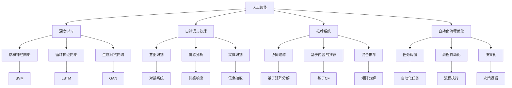
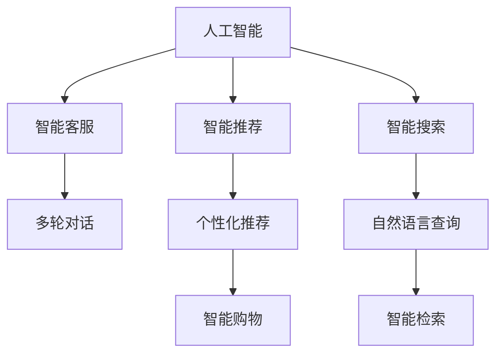

                 

# AI满足用户需求提升销售转化率

> 关键词：人工智能,销售转化率,用户需求,数据分析,推荐系统,自动化流程,客户体验

## 1. 背景介绍

### 1.1 问题由来
在当今数字经济时代，企业面对激烈的市场竞争和不断变化的用户需求，如何提升销售转化率成为了其核心战略之一。传统的营销手段，如电视广告、印刷媒体等，已经难以满足日益个性化的用户需求。随着人工智能（AI）技术的兴起，基于AI的推荐系统、自动化流程优化等手段，正成为提升销售转化率的利器。

### 1.2 问题核心关键点
提升销售转化率的核心在于理解用户需求并满足其预期。AI技术，特别是深度学习、自然语言处理、推荐系统等，提供了强大的数据分析和智能决策能力。通过AI技术，企业可以更精准地识别用户需求，自动化地优化营销流程，提供个性化的推荐和定制化的服务，从而显著提升销售转化率。

### 1.3 问题研究意义
利用AI技术提升销售转化率，对于优化企业资源配置、提升用户体验、增强品牌忠诚度、实现业务增长具有重要意义。具体而言：
- 优化资源配置：AI可以分析海量用户数据，识别最有价值的营销机会，避免盲目投入。
- 提升用户体验：通过个性化推荐，用户可以获得更符合其需求的产品，提升满意度。
- 增强品牌忠诚度：提供定制化服务，增强用户粘性，形成品牌忠诚。
- 实现业务增长：精准营销和自动化流程优化，可以显著降低运营成本，提高ROI。

## 2. 核心概念与联系

### 2.1 核心概念概述

为更好地理解AI技术在提升销售转化率中的应用，本节将介绍几个关键概念：

- **人工智能（AI）**：通过模拟人类智能行为，使用算法和模型来解决问题和做出决策的技术。
- **深度学习（Deep Learning）**：一种特殊的机器学习技术，通过多层次的非线性变换，自动提取数据中的特征和模式。
- **自然语言处理（NLP）**：使计算机能够理解、解释和生成人类语言的学科，广泛应用于智能客服、文本分析等领域。
- **推荐系统（Recommendation System）**：通过分析用户行为和偏好，推荐相关产品或内容的技术。
- **自动化流程优化（Process Automation）**：使用AI技术自动化企业运营流程，提高效率和准确性。
- **客户体验（Customer Experience）**：用户与产品或服务交互过程中的一系列体验和感受。

这些核心概念之间的逻辑关系可以通过以下Mermaid流程图来展示：



这个流程图展示了大语言模型的核心概念及其之间的关系：

1. 人工智能通过深度学习、自然语言处理等技术实现智能决策。
2. 推荐系统利用协同过滤、内容推荐等技术，实现个性化推荐。
3. 自动化流程优化通过任务调度、流程执行等技术，实现自动化流程。
4. 客户体验与意图识别、情感分析、信息抽取等技术紧密相关。

### 2.2 概念间的关系

这些核心概念之间存在着紧密的联系，形成了AI技术在提升销售转化率中的完整生态系统。下面我们通过几个Mermaid流程图来展示这些概念之间的关系。

#### 2.2.1 人工智能的应用场景



这个流程图展示了大语言模型在实际应用中的场景：

1. 智能客服：使用自然语言处理技术，与用户进行自然对话，提供即时解答。
2. 智能推荐：根据用户行为和偏好，推荐相关产品，提升用户体验。
3. 智能搜索：使用自然语言处理技术，理解用户查询意图，提供精准搜索结果。
4. 智能购物：使用深度学习技术，预测用户购买行为，优化库存管理。

#### 2.2.2 推荐系统的组成部分

```mermaid
graph TB
    A[用户数据] --> B[行为数据]
    A --> C[属性数据]
    B --> D[协同过滤]
    B --> E[基于内容的推荐]
    C --> F[模型训练]
    C --> G[特征工程]
    D --> H[模型预测]
    E --> I[模型预测]
    F --> J[模型训练]
    G --> K[特征工程]
    H --> L[模型预测]
    I --> M[模型预测]
    J --> N[模型训练]
    K --> O[特征工程]
    L --> P[模型预测]
    M --> Q[模型预测]
    N --> R[模型训练]
    O --> S[特征工程]
    P --> T[模型预测]
    Q --> U[模型预测]
    R --> V[模型训练]
    S --> W[特征工程]
    T --> X[模型预测]
    U --> Y[模型预测]
    V --> Z[模型训练]
    W --> AA[特征工程]
    X --> AB[模型预测]
    Y --> AC[模型预测]
    Z --> AD[模型训练]
    AA --> AE[特征工程]
    AB --> AF[模型预测]
    AC --> AG[模型预测]
    AD --> AH[模型训练]
    AE --> AI[特征工程]
    AF --> AJ[模型预测]
    AG --> AK[模型预测]
    AH --> AL[模型训练]
    AI --> AM[特征工程]
    AJ --> AN[模型预测]
    AK --> AO[模型预测]
    AL --> AP[模型训练]
    AM --> AQ[特征工程]
    AN --> AR[模型预测]
    AO --> AS[模型预测]
    AP --> AT[模型训练]
    AQ --> AU[特征工程]
    AR --> AV[模型预测]
    AS --> AW[模型预测]
    AT --> AX[模型训练]
    AU --> AY[模型预测]
    AV --> AZ[模型训练]
    AW --> BA[特征工程]
    AX --> BB[模型预测]
    AY --> BC[模型预测]
    AZ --> BD[模型训练]
    BA --> BE[特征工程]
    BB --> BF[模型预测]
    BC --> BG[模型预测]
    BD --> BH[模型训练]
    BE --> BI[特征工程]
    BF --> BJ[模型预测]
    BG --> BK[模型预测]
    BH --> BL[模型训练]
    BI --> BM[特征工程]
    BJ --> BN[模型预测]
    BK --> BM[模型预测]
    BL --> BM[模型训练]
    BM --> BO[特征工程]
    BN --> BP[模型预测]
    BK --> BQ[模型预测]
    BL --> BR[模型训练]
    BO --> BS[特征工程]
    BP --> BT[模型预测]
    BQ --> BS[模型预测]
    BR --> BS[模型训练]
    BS --> BU[特征工程]
    BT --> BV[模型预测]
    BS --> BW[模型预测]
    BR --> BX[模型训练]
    BU --> BY[特征工程]
    BV --> BZ[模型预测]
    BW --> BY[模型预测]
    BX --> BZ[模型训练]
    BY --> BA[特征工程]
    BZ --> BX[模型预测]
    BA --> BE[特征工程]
    BB --> BF[模型预测]
    BC --> BG[模型预测]
    BD --> BH[模型训练]
    BE --> BI[特征工程]
    BF --> BJ[模型预测]
    BG --> BK[模型预测]
    BH --> BL[模型训练]
    BI --> BM[特征工程]
    BJ --> BN[模型预测]
    BK --> BM[模型预测]
    BL --> BM[模型训练]
    BM --> BO[特征工程]
    BN --> BP[模型预测]
    BK --> BQ[模型预测]
    BL --> BR[模型训练]
    BO --> BS[特征工程]
    BP --> BT[模型预测]
    BQ --> BS[模型预测]
    BR --> BS[模型训练]
    BS --> BU[特征工程]
    BT --> BV[模型预测]
    BS --> BW[模型预测]
    BR --> BX[模型训练]
    BU --> BY[特征工程]
    BV --> BZ[模型预测]
    BW --> BY[模型预测]
    BX --> BZ[模型训练]
    BY --> BA[特征工程]
    BZ --> BX[模型预测]
    BA --> BE[特征工程]
    BB --> BF[模型预测]
    BC --> BG[模型预测]
    BD --> BH[模型训练]
    BE --> BI[特征工程]
    BF --> BJ[模型预测]
    BG --> BK[模型预测]
    BH --> BL[模型训练]
    BI --> BM[特征工程]
    BJ --> BN[模型预测]
    BK --> BM[模型预测]
    BL --> BM[模型训练]
    BM --> BO[特征工程]
    BN --> BP[模型预测]
    BK --> BQ[模型预测]
    BL --> BR[模型训练]
    BO --> BS[特征工程]
    BP --> BT[模型预测]
    BQ --> BS[模型预测]
    BR --> BS[模型训练]
    BS --> BU[特征工程]
    BT --> BV[模型预测]
    BS --> BW[模型预测]
    BR --> BX[模型训练]
    BU --> BY[特征工程]
    BV --> BZ[模型预测]
    BW --> BY[模型预测]
    BX --> BZ[模型训练]
    BY --> BA[特征工程]
    BZ --> BX[模型预测]
    BA --> BE[特征工程]
    BB --> BF[模型预测]
    BC --> BG[模型预测]
    BD --> BH[模型训练]
    BE --> BI[特征工程]
    BF --> BJ[模型预测]
    BG --> BK[模型预测]
    BH --> BL[模型训练]
    BI --> BM[特征工程]
    BJ --> BN[模型预测]
    BK --> BM[模型预测]
    BL --> BM[模型训练]
    BM --> BO[特征工程]
    BN --> BP[模型预测]
    BK --> BQ[模型预测]
    BL --> BR[模型训练]
    BO --> BS[特征工程]
    BP --> BT[模型预测]
    BQ --> BS[模型预测]
    BR --> BS[模型训练]
    BS --> BU[特征工程]
    BT --> BV[模型预测]
    BS --> BW[模型预测]
    BR --> BX[模型训练]
    BU --> BY[特征工程]
    BV --> BZ[模型预测]
    BW --> BY[模型预测]
    BX --> BZ[模型训练]
    BY --> BA[特征工程]
    BZ --> BX[模型预测]
    BA --> BE[特征工程]
    BB --> BF[模型预测]
    BC --> BG[模型预测]
    BD --> BH[模型训练]
    BE --> BI[特征工程]
    BF --> BJ[模型预测]
    BG --> BK[模型预测]
    BH --> BL[模型训练]
    BI --> BM[特征工程]
    BJ --> BN[模型预测]
    BK --> BM[模型预测]
    BL --> BM[模型训练]
    BM --> BO[特征工程]
    BN --> BP[模型预测]
    BK --> BQ[模型预测]
    BL --> BR[模型训练]
    BO --> BS[特征工程]
    BP --> BT[模型预测]
    BQ --> BS[模型预测]
    BR --> BS[模型训练]
    BS --> BU[特征工程]
    BT --> BV[模型预测]
    BS --> BW[模型预测]
    BR --> BX[模型训练]
    BU --> BY[特征工程]
    BV --> BZ[模型预测]
    BW --> BY[模型预测]
    BX --> BZ[模型训练]
    BY --> BA[特征工程]
    BZ --> BX[模型预测]
    BA --> BE[特征工程]
    BB --> BF[模型预测]
    BC --> BG[模型预测]
    BD --> BH[模型训练]
    BE --> BI[特征工程]
    BF --> BJ[模型预测]
    BG --> BK[模型预测]
    BH --> BL[模型训练]
    BI --> BM[特征工程]
    BJ --> BN[模型预测]
    BK --> BM[模型预测]
    BL --> BM[模型训练]
    BM --> BO[特征工程]
    BN --> BP[模型预测]
    BK --> BQ[模型预测]
    BL --> BR[模型训练]
    BO --> BS[特征工程]
    BP --> BT[模型预测]
    BQ --> BS[模型预测]
    BR --> BS[模型训练]
    BS --> BU[特征工程]
    BT --> BV[模型预测]
    BS --> BW[模型预测]
    BR --> BX[模型训练]
    BU --> BY[特征工程]
    BV --> BZ[模型预测]
    BW --> BY[模型预测]
    BX --> BZ[模型训练]
    BY --> BA[特征工程]
    BZ --> BX[模型预测]
    BA --> BE[特征工程]
    BB --> BF[模型预测]
    BC --> BG[模型预测]
    BD --> BH[模型训练]
    BE --> BI[特征工程]
    BF --> BJ[模型预测]
    BG --> BK[模型预测]
    BH --> BL[模型训练]
    BI --> BM[特征工程]
    BJ --> BN[模型预测]
    BK --> BM[模型预测]
    BL --> BM[模型训练]
    BM --> BO[特征工程]
    BN --> BP[模型预测]
    BK --> BQ[模型预测]
    BL --> BR[模型训练]
    BO --> BS[特征工程]
    BP --> BT[模型预测]
    BQ --> BS[模型预测]
    BR --> BS[模型训练]
    BS --> BU[特征工程]
    BT --> BV[模型预测]
    BS --> BW[模型预测]
    BR --> BX[模型训练]
    BU --> BY[特征工程]
    BV --> BZ[模型预测]
    BW --> BY[模型预测]
    BX --> BZ[模型训练]
    BY --> BA[特征工程]
    BZ --> BX[模型预测]
    BA --> BE[特征工程]
    BB --> BF[模型预测]
    BC --> BG[模型预测]
    BD --> BH[模型训练]
    BE --> BI[特征工程]
    BF --> BJ[模型预测]
    BG --> BK[模型预测]
    BH --> BL[模型训练]
    BI --> BM[特征工程]
    BJ --> BN[模型预测]
    BK --> BM[模型预测]
    BL --> BM[模型训练]
    BM --> BO[特征工程]
    BN --> BP[模型预测]
    BK --> BQ[模型预测]
    BL --> BR[模型训练]
    BO --> BS[特征工程]
    BP --> BT[模型预测]
    BQ --> BS[模型预测]
    BR --> BS[模型训练]
    BS --> BU[特征工程]
    BT --> BV[模型预测]
    BS --> BW[模型预测]
    BR --> BX[模型训练]
    BU --> BY[特征工程]
    BV --> BZ[模型预测]
    BW --> BY[模型预测]
    BX --> BZ[模型训练]
    BY --> BA[特征工程]
    BZ --> BX[模型预测]
    BA --> BE[特征工程]
    BB --> BF[模型预测]
    BC --> BG[模型预测]
    BD --> BH[模型训练]
    BE --> BI[特征工程]
    BF --> BJ[模型预测]
    BG --> BK[模型预测]
    BH --> BL[模型训练]
    BI --> BM[特征工程]
    BJ --> BN[模型预测]
    BK --> BM[模型预测]
    BL --> BM[模型训练]
    BM --> BO[特征工程]
    BN --> BP[模型预测]
    BK --> BQ[模型预测]
    BL --> BR[模型训练]
    BO --> BS[特征工程]
    BP --> BT[模型预测]
    BQ --> BS[模型预测]
    BR --> BS[模型训练]
    BS --> BU[特征工程]
    BT --> BV[模型预测]
    BS --> BW[模型预测]
    BR --> BX[模型训练]
    BU --> BY[特征工程]
    BV --> BZ[模型预测]
    BW --> BY[模型预测]
    BX --> BZ[模型训练]
    BY --> BA[特征工程]
    BZ --> BX[模型预测]
    BA --> BE[特征工程]
    BB --> BF[模型预测]
    BC --> BG[模型预测]
    BD --> BH[模型训练]
    BE --> BI[特征工程]
    BF --> BJ[模型预测]
    BG --> BK[模型预测]
    BH --> BL[模型训练]
    BI --> BM[特征工程]
    BJ --> BN[模型预测]
    BK --> BM[模型预测]
    BL --> BM[模型训练]
    BM --> BO[特征工程]
    BN --> BP[模型预测]
    BK --> BQ[模型预测]
    BL --> BR[模型训练]
    BO --> BS[特征工程]
    BP --> BT[模型预测]
    BQ --> BS[模型预测]
    BR --> BS[模型训练]
    BS --> BU[特征工程]
    BT --> BV[模型预测]
    BS --> BW[模型预测]
    BR --> BX[模型训练]
    BU --> BY[特征工程]
    BV --> BZ[模型预测]
    BW --> BY[模型预测]
    BX --> BZ[模型训练]
    BY --> BA[特征工程]
    BZ --> BX[模型预测]
    BA --> BE[特征工程]
    BB --> BF[模型预测]
    BC --> BG[模型预测]
    BD --> BH[模型训练]
    BE --> BI[特征工程]
    BF --> BJ[模型预测]
    BG --> BK[模型预测]
    BH --> BL[模型训练]
    BI --> BM[特征工程]
    BJ --> BN[模型预测]
    BK --> BM[模型预测]
    BL --> BM[模型训练]
    BM --> BO[特征工程]
    BN --> BP[模型预测]
    BK --> BQ[模型预测]
    BL --> BR[模型训练]
    BO --> BS[特征工程]
    BP --> BT[模型预测]
    BQ --> BS[模型预测]
    BR --> BS[模型训练]
    BS --> BU[特征工程]
    BT --> BV[模型预测]
    BS --> BW[模型预测]
    BR --> BX[模型训练]
    BU --> BY[特征工程]
    BV --> BZ[模型预测]
    BW --> BY[模型预测]
    BX --> BZ[模型训练]
    BY --> BA[特征工程]
    BZ --> BX[模型预测]
    BA --> BE[特征工程]
    BB --> BF[模型预测]
    BC --> BG[模型预测]
    BD --> BH[模型训练]
    BE --> BI[特征工程]
    BF --> BJ[模型预测]
    BG --> BK[模型预测]
    BH --> BL[模型训练]
    BI --> BM[特征工程]
    BJ --> BN[模型预测]
    BK --> BM[模型预测]
    BL --> BM[模型训练]
    BM --> BO[特征工程]
    BN --> BP[模型预测]
    BK --> BQ[模型预测]
    BL --> BR[模型训练]
    BO --> BS[特征工程]
    BP --> BT[模型预测]
    BQ --> BS[模型预测]
    BR --> BS[模型训练]
    BS --> BU[特征工程]
    BT --> BV[模型预测]
    BS --> BW[模型预测]
    BR --> BX[模型训练]
    BU --> BY[特征工程]
    BV --> BZ[模型预测]
    BW --> BY[模型预测]
    BX --> BZ[模型训练]
    BY --> BA[特征工程]
    BZ --> BX[模型预测]
    BA --> BE[特征工程]
    BB --> BF[模型预测]
    BC --> BG[模型预测]
    BD --> BH[模型训练]
    BE --> BI[特征工程]
    BF --> BJ[模型预测]
    BG --> BK[模型预测]
    BH --> BL[模型训练]
    BI --> BM[特征工程]
    BJ --> BN[模型预测]
    BK --> BM[模型预测]
    BL --> BM[模型训练]
    BM --> BO[特征工程]
    BN --> BP[模型预测]
    BK --> BQ[模型预测]
    BL --> BR[模型训练]
    BO --> BS[特征工程]
    BP --> BT[模型预测]
    BQ --> BS[模型预测]
    BR --> BS[模型训练]
    BS --> BU[特征工程]
    BT --> BV[模型预测]
    BS --> BW[模型预测]
    BR --> BX[模型训练]
    BU --> BY[特征工程]
    BV --> BZ[模型预测]
    BW --> BY[模型预测]
    BX --> BZ[模型训练]
    BY --> BA[特征工程]
    BZ --> BX[模型预测]
    BA --> BE[特征工程]
    BB --> BF[模型预测]
    BC --> BG[模型预测]
    BD --> BH[模型训练]
    BE --> BI[特征工程]
    BF --> BJ[模型预测]
    BG --> BK[模型预测]
    BH --> BL[模型训练]
    BI --> BM[特征工程]
    BJ --> BN[模型预测]
    BK --> BM[模型预测]
    BL --> BM[模型训练]
    BM --> BO[特征工程]
    BN --> BP[模型预测]
    BK --> BQ[模型预测]
    BL --> BR[模型训练]
    BO --> BS[特征工程]
    BP --> BT[模型预测]
    BQ --> BS[模型预测]
    BR --> BS[模型训练]
    BS --> BU[特征工程]
    BT --> BV[模型预测]
    BS --> BW[模型预测]
    BR --> BX[模型训练]
    BU --> BY[特征工程]
    BV --> BZ[模型预测]
    BW --> BY[模型预测]
    BX --> BZ[模型训练]
    BY --> BA[特征工程]
    BZ --> BX[模型预测]
    BA --> BE[特征工程]
    BB --> BF[模型预测]
    BC --> BG[模型预测]
    BD --> BH[模型训练]
    BE --> BI[特征工程]
    BF --> BJ[模型预测]
    BG --> BK[模型预测]
    BH --> BL[模型训练]
    BI --> BM[特征工程]
    BJ --> BN[模型预测]
    BK --> BM[模型预测]
    BL --> BM[模型训练]
    BM --> BO[特征工程]
    BN --> BP[模型预测]
    BK --> BQ[模型预测]
    BL --> BR[模型训练]
    BO --> BS[特征工程]
    BP --> BT[模型预测]
    BQ --> BS[模型预测]
    BR --> BS[模型训练]
    BS --> BU[特征工程]
    BT --> BV[模型预测]
    BS --> BW[模型预测]
    BR --> BX[模型训练]
    BU --> BY[特征工程]
    BV --> BZ[模型预测]
    BW --> BY[模型预测]
    BX --> BZ[模型训练]
    BY --> BA[特征工程]
    BZ --> BX[模型预测]
    BA --> BE[特征工程]
    BB --> BF[模型预测]
    BC --> BG[模型预测]
    BD --> BH[模型训练]
    BE --> BI[特征工程]
    BF --> BJ[模型预测]
    BG --> BK[模型预测]
    BH --> BL[模型训练]
    BI --> BM[特征工程]
    BJ --> BN[模型预测]
    BK --> BM[模型预测]
    BL --> BM[模型训练]
    BM --> BO[特征工程]
    BN --> BP[模型预测]
    BK --> BQ[模型预测]
    BL --> BR[模型训练]
    BO --> BS[特征工程]
    BP --> BT[模型预测]
    BQ --> BS[模型预测]
    BR --> BS[模型训练]
    BS --> BU[特征工程]
    BT --> BV[模型预测]
    BS --> BW[模型预测]
    BR --> BX[模型训练]
    BU --> BY[特征工程]
    BV --> BZ[模型预测]
    BW --> BY[模型预测]
    BX --> BZ[模型训练]
    BY --> BA[特征工程]
    BZ --> BX[模型预测]
    BA --> BE[特征工程]
    BB --> BF[模型预测]
    BC --> BG[模型预测]
    BD --> BH[模型训练]
    BE --> BI[特征工程]
    BF --> BJ[模型预测]
    BG --> BK[模型预测]
    BH --> BL[模型训练]
    BI --> BM[特征工程]
    BJ --> BN[模型预测]
    BK --> BM[模型预测]
    BL --> BM[模型训练]
    BM --> BO[特征工程]
    BN --> BP[模型预测]
    BK --> BQ[模型预测]
    BL --> BR[模型训练]
    BO --> BS[特征工程]
    BP --> BT[模型预测]
    BQ --> BS[模型预测]
    BR --> BS[模型训练]
    BS --> BU[特征工程]
    BT --> BV

