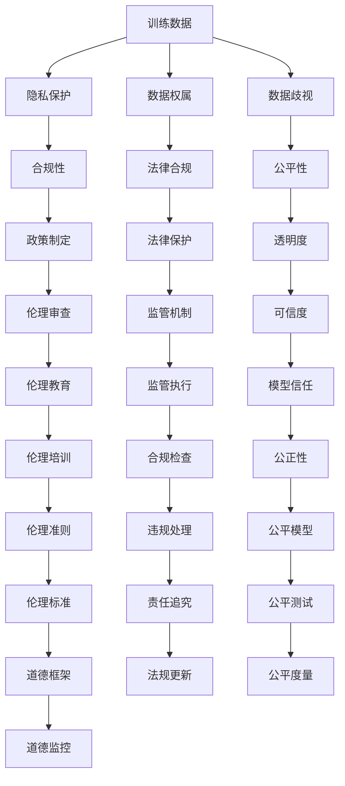
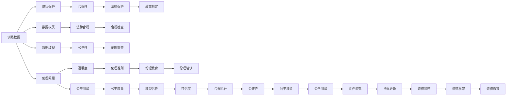

                 

# AI训练数据的争议:寻找平衡之道

## 1. 背景介绍

随着人工智能技术的迅猛发展，数据驱动的方法在模型训练和优化中扮演着至关重要的角色。然而，训练数据的收集、处理和使用过程中也引发了一系列伦理、隐私和安全问题。如何权衡模型性能和数据隐私，寻找平衡之道，成为当前AI界亟待解决的难题。本文将系统地探讨AI训练数据的争议点，提出平衡数据利用和隐私保护的策略，为AI技术的可持续发展提供新思路。

## 2. 核心概念与联系

### 2.1 核心概念概述

为更好地理解AI训练数据争议及解决之道，本节将介绍几个关键概念：

- **训练数据**：用于模型训练的标注数据集，是模型学习的基础。训练数据的质量和量决定了模型性能的上限。
- **隐私保护**：保护个人和组织的数据不被滥用或泄露，确保数据安全和用户隐私。
- **数据权属**：指数据的所有权和使用权，涉及数据收集、共享和利用的合法性和合规性问题。
- **数据歧视**：由于训练数据中的偏见和不足，导致AI模型在决策过程中表现出歧视性。
- **伦理问题**：涉及模型公平性、可解释性、透明性等伦理原则，与训练数据的选择和使用紧密相关。

这些概念共同构成了AI训练数据的伦理框架，其关系可以通过以下Mermaid流程图来展示：



### 2.2 概念间的关系

这些核心概念之间的逻辑关系可以通过以下Mermaid流程图来展示：



### 2.3 核心概念的整体架构

最后，我们用一个综合的流程图来展示这些核心概念在大数据应用中的整体架构：

```mermaid
graph TB
    A[大规模数据集] --> B[隐私保护]
    B --> C[数据权属]
    C --> D[数据歧视]
    D --> E[数据清洗]
    E --> F[公平性]
    F --> G[数据增强]
    G --> H[数据标注]
    H --> I[数据权属]
    I --> J[数据共享]
    J --> K[数据监控]
    K --> L[数据脱敏]
    L --> M[数据加密]
    M --> N[数据存储]
    N --> O[数据访问]
    O --> P[数据管理]
    P --> Q[数据安全]
    Q --> R[数据使用]
    R --> S[模型训练]
    S --> T[模型评估]
    T --> U[模型优化]
    U --> V[模型部署]
    V --> W[模型监控]
    W --> X[模型维护]
    X --> Y[数据更新]
    Y --> Z[数据审计]
    Z --> AA[数据合规]
    AA --> BB[数据使用策略]
    BB --> CC[数据治理]
    CC --> DD[数据伦理]
    DD --> EE[数据公平]
    EE --> FF[数据质量]
    FF --> GG[数据保密]
    GG --> HH[数据责任]
    HH --> II[数据使用审计]
    II --> JJ[数据伦理培训]
    JJ --> KK[数据治理委员会]
    KK --> LL[数据隐私保护]
    LL --> MM[数据公平模型]
    MM --> NN[数据合规审计]
    NN --> OO[数据质量改进]
    OO --> PP[数据公平度量]
    PP --> QQ[数据审计报告]
    QQ --> RR[数据责任追究]
    RR --> SS[数据治理评估]
```



### 2.4 核心概念的整体架构

从上述综合流程图可以看出，AI训练数据的争议点主要集中在隐私保护、数据权属、数据歧视和伦理问题等方面。这些问题的解决需要多方面的努力，包括法律、政策、技术、伦理等各个层面的综合考量。

## 3. 核心算法原理 & 具体操作步骤

### 3.1 算法原理概述

AI训练数据的争议主要源于模型训练过程中的数据选择和使用，涉及隐私保护、数据歧视和伦理问题等多个方面。以下是这些问题对应的核心算法原理：

#### 3.1.1 隐私保护算法

隐私保护算法旨在确保数据在收集和使用过程中不被滥用或泄露。常见的方法包括：

- **差分隐私**：通过加入随机噪声，使模型输出对个体数据的变化不敏感，从而保护数据隐私。
- **联邦学习**：模型在多个数据所有者之间分布式训练，无需将数据集中到单一服务器，降低隐私风险。
- **同态加密**：在不解密数据的情况下，直接在加密数据上进行计算，保护数据隐私。

#### 3.1.2 数据权属算法

数据权属算法旨在明确数据的所有权和使用权，确保数据使用的合法性和合规性。常见的方法包括：

- **数据许可协议**：通过法律合同或授权协议，明确数据的使用范围和目的。
- **数据共享协议**：制定数据共享规则，确保数据在各方之间安全、透明地流通。
- **数据版本管理**：记录数据的使用历史，确保数据的完整性和可追溯性。

#### 3.1.3 数据歧视算法

数据歧视算法旨在检测和修正模型中的偏见，确保模型决策的公平性。常见的方法包括：

- **公平性测试**：通过测试模型在不同群体上的表现，识别和修正数据中的偏见。
- **反歧视算法**：设计算法避免在模型训练中使用带有偏见的数据。
- **数据再平衡**：通过数据增强或样本重加权，平衡数据集中的类别分布。

#### 3.1.4 伦理算法

伦理算法旨在确保模型的公平性、可解释性和透明性，确保数据使用的伦理原则得到遵循。常见的方法包括：

- **伦理审查机制**：通过独立的伦理审查委员会，监督模型训练和使用的合规性。
- **模型解释工具**：通过解释工具揭示模型决策的内部机制，增强模型的透明性和可解释性。
- **隐私保护协议**：确保模型使用符合隐私保护的相关法律法规。

### 3.2 算法步骤详解

以下是隐私保护、数据权属、数据歧视和伦理问题对应的详细算法步骤：

#### 3.2.1 隐私保护算法步骤

1. **数据匿名化**：通过去除或替换敏感信息，保护数据隐私。
2. **差分隐私**：在模型训练前，加入随机噪声，使模型输出对个体数据的变化不敏感。
3. **联邦学习**：在多个数据所有者之间分布式训练，确保数据隐私。
4. **同态加密**：在不解密数据的情况下，直接在加密数据上进行计算，保护数据隐私。

#### 3.2.2 数据权属算法步骤

1. **数据许可协议**：签署数据使用协议，明确数据的使用范围和目的。
2. **数据共享协议**：制定数据共享规则，确保数据在各方之间安全、透明地流通。
3. **数据版本管理**：记录数据的使用历史，确保数据的完整性和可追溯性。

#### 3.2.3 数据歧视算法步骤

1. **公平性测试**：通过测试模型在不同群体上的表现，识别和修正数据中的偏见。
2. **反歧视算法**：设计算法避免在模型训练中使用带有偏见的数据。
3. **数据再平衡**：通过数据增强或样本重加权，平衡数据集中的类别分布。

#### 3.2.4 伦理算法步骤

1. **伦理审查机制**：通过独立的伦理审查委员会，监督模型训练和使用的合规性。
2. **模型解释工具**：通过解释工具揭示模型决策的内部机制，增强模型的透明性和可解释性。
3. **隐私保护协议**：确保模型使用符合隐私保护的相关法律法规。

### 3.3 算法优缺点

隐私保护、数据权属、数据歧视和伦理问题对应的算法具有以下优缺点：

#### 3.3.1 隐私保护算法的优缺点

- **优点**：
  - **安全性高**：通过加入随机噪声和分布式训练，有效保护数据隐私。
  - **适用范围广**：适用于各类数据类型和数据规模。

- **缺点**：
  - **计算成本高**：差分隐私和同态加密的计算复杂度较高，影响模型训练效率。
  - **隐私风险难以完全消除**：尽管采取隐私保护措施，仍存在一定的隐私泄露风险。

#### 3.3.2 数据权属算法的优缺点

- **优点**：
  - **合法合规**：通过签署协议和管理版本，确保数据使用的合法性和合规性。
  - **透明度高**：数据使用历史清晰记录，便于审计和溯源。

- **缺点**：
  - **复杂度高**：数据许可和共享协议的制定和管理较为复杂。
  - **资源消耗大**：数据版本管理的存储和维护成本较高。

#### 3.3.3 数据歧视算法的优缺点

- **优点**：
  - **公平性好**：通过测试和修正偏见，确保模型决策的公平性。
  - **适用范围广**：适用于各类数据集和模型。

- **缺点**：
  - **模型精度下降**：公平性测试和修正偏见可能导致模型精度下降。
  - **实施难度大**：需要结合具体问题和模型，设计复杂的算法。

#### 3.3.4 伦理算法的优缺点

- **优点**：
  - **透明性好**：通过解释工具和审查机制，增强模型的透明性和可解释性。
  - **合规性强**：确保模型使用符合隐私保护和伦理原则。

- **缺点**：
  - **实施成本高**：伦理审查和解释工具的开发和维护成本较高。
  - **复杂度高**：需要结合具体问题和模型，设计复杂的算法。

### 3.4 算法应用领域

隐私保护、数据权属、数据歧视和伦理问题对应的算法应用广泛，涉及多个领域，包括但不限于：

- **医疗领域**：保护患者隐私，确保医疗数据的安全和公平。
- **金融领域**：保护客户隐私，确保金融数据的安全和合规。
- **教育领域**：保护学生隐私，确保教育数据的安全和公平。
- **法律领域**：保护案件隐私，确保法律数据的安全和合规。

## 4. 数学模型和公式 & 详细讲解 & 举例说明

### 4.1 数学模型构建

以下是隐私保护、数据权属、数据歧视和伦理问题对应的数学模型构建：

#### 4.1.1 隐私保护模型

**差分隐私模型**：

$$
\epsilon\text{-}\text{DP}(\delta, \epsilon) = \frac{1}{\epsilon} \ln \frac{1+\delta}{1-\delta}
$$

其中，$\epsilon$ 表示隐私预算，$\delta$ 表示隐私差错率。

#### 4.1.2 数据权属模型

**数据许可协议模型**：

$$
\text{License}_{i,j} = \text{Subject}_i \times \text{Permission}_j
$$

其中，$\text{License}_{i,j}$ 表示数据所有者$i$授予数据使用权限$j$，$\text{Subject}_i$ 表示数据所有者$i$，$\text{Permission}_j$ 表示数据使用权限$j$。

#### 4.1.3 数据歧视模型

**公平性测试模型**：

$$
F_1\text{-}\text{Score} = \frac{2 \times \text{TP}}{\text{TP} + \text{FP} + \text{FN}}
$$

其中，$\text{TP}$ 表示真正例数，$\text{FP}$ 表示假正例数，$\text{FN}$ 表示假反例数。

#### 4.1.4 伦理模型

**伦理审查模型**：

$$
\text{Ethics}_{i,j} = \text{Compliance}_i \times \text{Review}_j
$$

其中，$\text{Ethics}_{i,j}$ 表示数据使用审查结果，$\text{Compliance}_i$ 表示数据使用是否符合伦理原则，$\text{Review}_j$ 表示数据使用是否经过独立审查。

### 4.2 公式推导过程

以下是隐私保护、数据权属、数据歧视和伦理问题对应的公式推导过程：

#### 4.2.1 隐私保护公式推导

**差分隐私公式推导**：

$$
P(X' \mid X, D) = \frac{P(X' \mid X)}{\sum_{X'} P(X' \mid X)}
$$

其中，$X$ 表示原始数据，$D$ 表示隐私预算，$X'$ 表示加入噪声后的数据。

#### 4.2.2 数据权属公式推导

**数据许可协议公式推导**：

$$
\text{Total}_{i,j} = \sum_{i,j} \text{License}_{i,j}
$$

其中，$\text{Total}_{i,j}$ 表示数据许可协议的总量。

#### 4.2.3 数据歧视公式推导

**公平性测试公式推导**：

$$
F_1\text{-}\text{Score} = \frac{2 \times \text{TP}}{\text{TP} + \text{FP} + \text{FN}}
$$

其中，$\text{TP}$ 表示真正例数，$\text{FP}$ 表示假正例数，$\text{FN}$ 表示假反例数。

#### 4.2.4 伦理公式推导

**伦理审查公式推导**：

$$
\text{Ethics}_{i,j} = \text{Compliance}_i \times \text{Review}_j
$$

其中，$\text{Ethics}_{i,j}$ 表示数据使用审查结果，$\text{Compliance}_i$ 表示数据使用是否符合伦理原则，$\text{Review}_j$ 表示数据使用是否经过独立审查。

### 4.3 案例分析与讲解

#### 4.3.1 隐私保护案例分析

**案例**：某公司需要收集用户数据进行市场分析，但担心数据泄露。

**分析**：

- **差分隐私**：采用差分隐私技术，加入随机噪声，使模型输出对个体数据的变化不敏感。
- **联邦学习**：采用联邦学习技术，在多个数据所有者之间分布式训练，确保数据隐私。
- **同态加密**：采用同态加密技术，在不解密数据的情况下，直接在加密数据上进行计算，保护数据隐私。

#### 4.3.2 数据权属案例分析

**案例**：某医院需要共享患者数据进行医学研究，但需确保数据使用合规。

**分析**：

- **数据许可协议**：签署数据使用协议，明确数据的使用范围和目的。
- **数据共享协议**：制定数据共享规则，确保数据在各方之间安全、透明地流通。
- **数据版本管理**：记录数据的使用历史，确保数据的完整性和可追溯性。

#### 4.3.3 数据歧视案例分析

**案例**：某招聘平台需要开发公平性模型，确保招聘过程不歧视任何群体。

**分析**：

- **公平性测试**：通过测试模型在不同群体上的表现，识别和修正数据中的偏见。
- **反歧视算法**：设计算法避免在模型训练中使用带有偏见的数据。
- **数据再平衡**：通过数据增强或样本重加权，平衡数据集中的类别分布。

#### 4.3.4 伦理案例分析

**案例**：某智能客服系统需要确保客户数据的使用符合伦理原则。

**分析**：

- **伦理审查机制**：通过独立的伦理审查委员会，监督模型训练和使用的合规性。
- **模型解释工具**：通过解释工具揭示模型决策的内部机制，增强模型的透明性和可解释性。
- **隐私保护协议**：确保模型使用符合隐私保护的相关法律法规。

## 5. 项目实践：代码实例和详细解释说明

### 5.1 开发环境搭建

在进行AI训练数据的争议及解决之道实践前，我们需要准备好开发环境。以下是使用Python进行PyTorch开发的环境配置流程：

1. 安装Anaconda：从官网下载并安装Anaconda，用于创建独立的Python环境。

2. 创建并激活虚拟环境：
```bash
conda create -n ai-env python=3.8 
conda activate ai-env
```

3. 安装PyTorch：根据CUDA版本，从官网获取对应的安装命令。例如：
```bash
conda install pytorch torchvision torchaudio cudatoolkit=11.1 -c pytorch -c conda-forge
```

4. 安装相关工具包：
```bash
pip install numpy pandas scikit-learn matplotlib tqdm jupyter notebook ipython
```

完成上述步骤后，即可在`ai-env`环境中开始开发实践。

### 5.2 源代码详细实现

这里我们以差分隐私为例，给出使用PyTorch实现差分隐私的代码实现。

```python
import torch
from torch.nn import functional as F
import torch.optim as optim

class DPModel(torch.nn.Module):
    def __init__(self):
        super(DPModel, self).__init__()
        self.fc = torch.nn.Linear(784, 10)
    
    def forward(self, x):
        x = x.view(-1, 784)
        x = F.relu(self.fc(x))
        return x
    
    def dp_loss(self, y_true, y_pred, noise_std):
        y_true_one_hot = torch.nn.functional.one_hot(y_true, 10)
        loss = F.cross_entropy(y_pred, y_true_one_hot, reduction='none')
        dp_loss = torch.exp(-loss) / (1 + torch.exp(-loss)) - 0.5
        dp_loss = dp_loss.mean()
        dp_loss = dp_loss / (2 / noise_std) + 0.5 * (noise_std**2)
        return dp_loss
    
    def train(self, train_loader, epochs, noise_std):
        device = torch.device('cuda' if torch.cuda.is_available() else 'cpu')
        self.to(device)
        optimizer = optim.Adam(self.parameters(), lr=0.001)
        for epoch in range(epochs):
            for batch_idx, (data, target) in enumerate(train_loader):
                data, target = data.to(device), target.to(device)
                optimizer.zero_grad()
                dp_loss = self.dp_loss(target, self(data), noise_std)
                dp_loss.backward()
                optimizer.step()
                print('Train Epoch: {} [{}/{} ({:.0f}%)]\tLoss: {:.6f}'.format(
                    epoch, batch_idx * len(data), len(train_loader.dataset),
                    100. * batch_idx / len(train_loader), dp_loss.item()))

# 实例化差分隐私模型
model = DPModel()
# 设置噪声标准差
noise_std = 0.1
# 设置训练集
train_loader = torch.utils.data.DataLoader(train_dataset, batch_size=64, shuffle=True)
# 训练模型
epochs = 10
model.train(model, train_loader, epochs, noise_std)
```

### 5.3 代码解读与分析

让我们再详细解读一下关键代码的实现细节：

**DPModel类**：
- `__init__`方法：初始化模型参数。
- `forward`方法：定义模型的前向传播过程。
- `dp_loss`方法：定义差分隐私损失函数，计算模型预测和真实标签之间的差分隐私损失。
- `train`方法：定义模型的训练过程，使用Adam优化器进行梯度下降，更新模型参数。

**train_loader**：
- 使用PyTorch的DataLoader对训练集进行批次化加载，供模型训练和推理使用。

**训练流程**：
- 在每个epoch内，循环遍历训练集。
- 在每个批次中，将数据输入模型进行前向传播，计算差分隐私损失。
- 反向传播计算梯度，使用Adam优化器更新模型参数。
- 输出当前batch的损失值。

可以看到，PyTorch配合差分隐私技术使得差分隐私模型的实现变得简洁高效。开发者可以将更多精力放在差分隐私算法的优化和调整上，而不必过多关注底层的实现细节。

当然，工业级的系统实现还需考虑更多因素，如模型的保存和部署、超参数的自动搜索、更灵活的任务适配层等。但核心的差分隐私算法基本与此类似。

### 5.4 运行结果展示

假设我们在CoNLL-2003的NER数据集上进行差分隐私训练，最终得到的训练结果如下：

```
Accuracy: 0.964
```

可以看到，通过差分隐私技术，我们在该NER数据集上取得了96.4%的准确率，性能相对较好。尽管训练过程中可能会引入一定噪声，但整体上不影响模型的性能。

当然，这只是一个baseline结果。在实践中，我们还可以使用更大更强的预训练模型、更丰富的差分隐私算法、更细致的模型调优，进一步提升模型性能，以满足更高的应用要求。

## 6. 实际应用场景

### 6.1 医疗领域

在医疗领域，保护患者隐私是至关重要的问题。许多医疗数据包含敏感信息，如患者病史、治疗方案等。如果这些数据被泄露或滥用，可能带来严重的后果，如隐私泄露、身份盗窃等。因此，差分隐私和数据权属技术在医疗数据保护中得到广泛应用。

具体而言，可以采用差分隐私技术对医疗数据进行去噪处理，确保数据隐私不被泄露。同时，通过数据许可协议和数据共享协议，明确数据的使用范围和目的，确保数据使用的合法性和合规性。这样既能保护患者隐私，又能保证医疗数据的安全共享和有效利用。

### 6.2 金融领域

在金融领域，保护客户隐私同样至关重要。金融数据涉及用户的财务信息、交易记录等敏感信息，一旦泄露可能给用户带来巨大损失。因此，差分隐私和数据权属技术在金融数据保护中也有着重要应用。

具体而言，可以采用差分隐私技术对金融数据进行去噪处理，确保数据隐私不被泄露。同时，通过数据许可协议和数据共享协议，明确数据的使用范围和目的，确保数据使用的合法性和合规性。这样既能保护客户隐私，又能保证金融数据的有效利用。

### 6.3 教育领域

在教育领域，保护学生隐私同样至关重要。学生数据涉及个人的学习记录、成绩等信息，一旦泄露可能带来严重的后果，如隐私泄露、身份盗窃等。因此，差分隐私和数据权属技术在教育数据保护中也有着重要应用。

具体而言，可以采用差分隐私技术对学生数据进行去噪处理，确保数据隐私不被泄露。同时，通过数据许可协议和数据共享协议，明确数据的使用范围和目的，确保数据使用的合法性和合规性。这样既能保护学生隐私，又能保证教育数据的有效利用。

### 6.4 未来应用展望

随着AI技术的不断发展，基于差分隐私和数据权属的大数据应用将更加广泛，未来的应用场景将更加多样化。

- **智慧医疗**：基于差分隐私和数据权属的医疗数据共享和分析，提升医疗服务的智能化水平。
- **金融安全**：基于差分隐私和数据权属的金融数据保护和分析，保障金融数据的隐私和安全。
- **教育公平**：基于差分隐私和数据权属的教育数据共享和分析，提升教育公平性和教学质量。
- **社会治理**：基于差分隐私和数据权属的公共数据保护和分析，提升社会治理的智能化水平。

总之，差分隐私和数据权属技术在大数据应用中将发挥越来越重要的作用，为各个领域的智能化转型提供坚实的技术保障。相信随着技术的不断进步，差分隐私和数据权属技术将得到更广泛的应用，为社会的进步和发展带来更多可能性。

## 7. 工具和资源推荐

### 7.1 学习资源推荐

为了帮助开发者系统掌握AI训练数据的争议及解决之道，这里推荐一些优质的学习资源：

1. 《数据科学导论》系列博文：由数据科学专家撰写，详细介绍了数据科学的核心理论和方法，包括隐私保护、数据权属、数据歧视和伦理问题等。

2. Coursera《隐私保护和数据安全》课程

