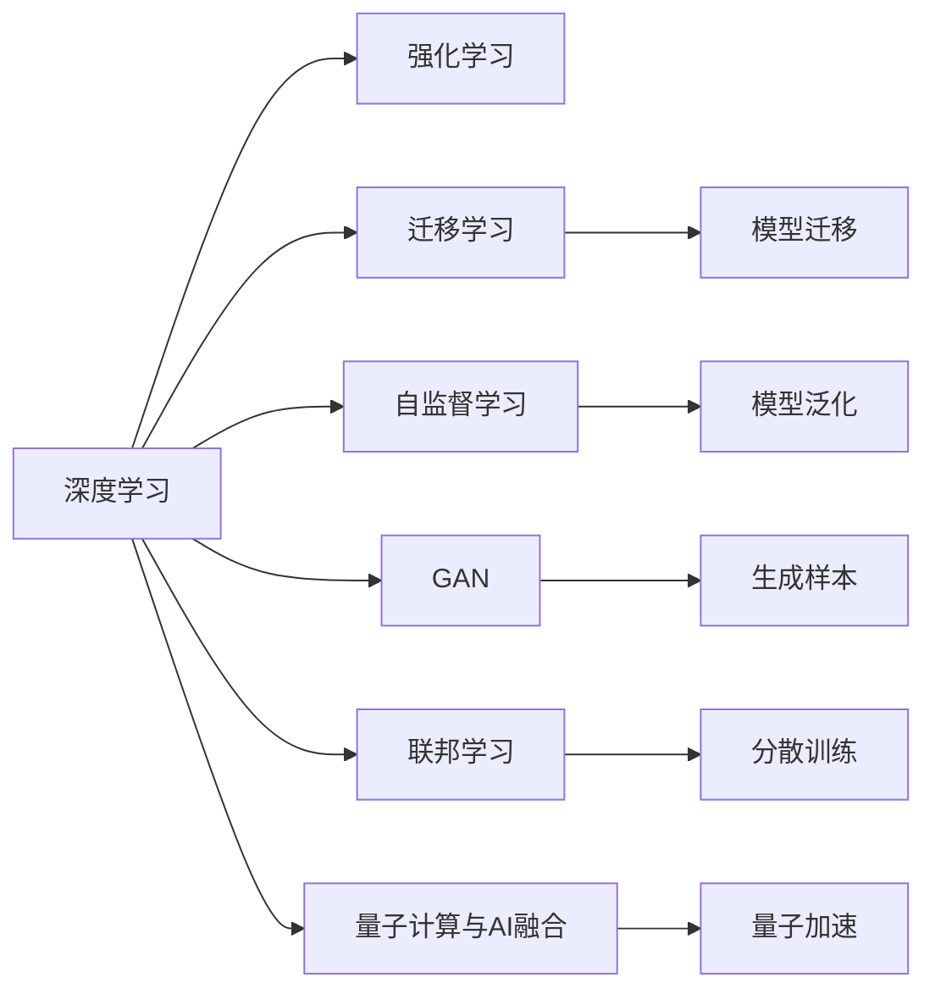
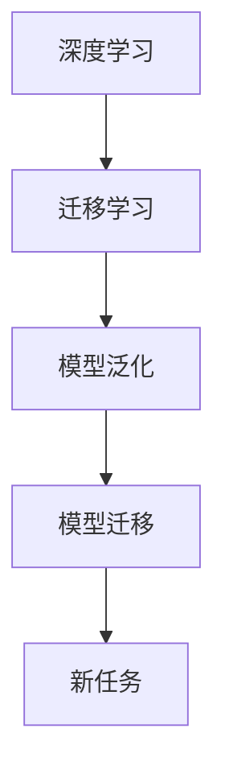
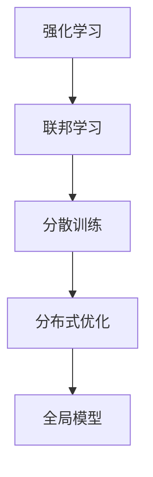
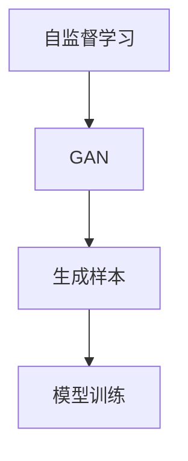
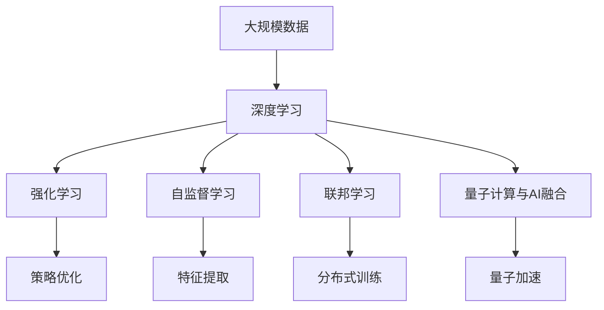

                 

## 1. 背景介绍

### 1.1 问题由来
人工智能(AI)技术自20世纪60年代以来，经历了多个发展阶段。从最初基于符号推理的专家系统，到神经网络、深度学习、强化学习等技术兴起，AI技术逐步展现出强大的应用潜力。尤其在过去十年，基于深度学习的AI技术取得了突破性进展，应用于图像识别、语音识别、自然语言处理(NLP)、推荐系统等多个领域，为各行各业带来了深远的影响。

然而，当前的AI技术仍面临诸多挑战，如可解释性不足、泛化能力有限、模型复杂度高、计算资源需求大等。这些问题亟需通过技术突破来解决，以推动AI技术的进一步发展和应用。

### 1.2 问题核心关键点
AI技术的发展核心在于算法和架构的突破。近年来，深度学习、强化学习、迁移学习、自监督学习、生成对抗网络(GAN)等技术不断创新，提升了AI系统的能力。尤其在大规模数据和计算资源的支撑下，AI技术取得了诸多重要进展。

此外，AI技术的落地应用也带来新的需求，如高性能计算、高效模型、易解释的算法、隐私保护等。这些问题也成为当前技术研究的重要方向。

### 1.3 问题研究意义
研究AI技术的技术突破与发展，对于推动AI技术的产业化应用，解决复杂计算问题，提升系统的泛化能力，增强模型的可解释性，具有重要意义：

1. 促进AI技术的产业化。通过技术突破，解决当前AI技术的瓶颈问题，加速AI技术的实际应用。
2. 提高AI系统的能力。算法和架构的优化，使得AI系统具备更强的泛化能力、更高效的应用场景和更稳定的表现。
3. 提升AI的可解释性。通过更加可解释的模型和算法，增强AI系统的透明度和可信度。
4. 保护数据隐私。研究如何保护数据隐私，避免数据泄露和滥用，确保AI系统的伦理安全性。

## 2. 核心概念与联系

### 2.1 核心概念概述

为更好地理解AI领域的技术突破与发展，本节将介绍几个密切相关的核心概念：

- 深度学习(Deep Learning)：通过多层神经网络结构，学习非线性映射关系，提取复杂特征，是当前AI技术的重要范式。
- 强化学习(Reinforcement Learning)：通过智能体在环境中与环境互动，学习最优策略，以最大化奖励信号。
- 迁移学习(Transfer Learning)：将一个领域学到的知识，迁移到另一个相关领域的学习范式。
- 自监督学习(Self-supervised Learning)：通过利用数据本身的特性，如掩码语言模型、预训练目标等，进行无监督学习，提升模型的泛化能力。
- 生成对抗网络(GAN)：通过生成器和判别器的博弈过程，学习生成复杂样本，提升生成模型的性能。
- 联邦学习(Federated Learning)：在多个设备上分散训练模型，保护数据隐私的同时，实现全局模型的优化。
- 量子计算与AI融合：将量子计算的优势，如量子并行、量子算法等，与AI技术结合，提升计算效率和模型性能。

这些核心概念之间的逻辑关系可以通过以下Mermaid流程图来展示：



这个流程图展示了AI技术的核心概念及其之间的关系：

1. 深度学习是AI技术的基础，通过多层网络学习复杂特征。
2. 强化学习和自监督学习进一步提升了模型的泛化能力和自我学习能力。
3. GAN技术通过生成器与判别器的博弈过程，提升了生成模型的性能。
4. 联邦学习分散训练，保护数据隐私的同时，实现了全局模型的优化。
5. 量子计算与AI技术的融合，展示了AI技术的新发展方向。

这些核心概念共同构成了AI技术的完整生态系统，推动了AI技术的发展与应用。通过理解这些核心概念，我们可以更好地把握AI技术的最新进展与挑战。

### 2.2 概念间的关系

这些核心概念之间存在着紧密的联系，形成了AI技术的完整生态系统。下面我通过几个Mermaid流程图来展示这些概念之间的关系。

#### 2.2.1 深度学习与迁移学习的关系



这个流程图展示了深度学习与迁移学习的基本关系。深度学习通过多层网络学习复杂特征，而迁移学习则利用已有知识，加速新任务上的学习过程。

#### 2.2.2 强化学习与联邦学习的关系



这个流程图展示了强化学习与联邦学习的协同作用。强化学习通过智能体与环境的互动学习策略，而联邦学习则在多个设备上分散训练，保护数据隐私的同时，实现全局模型的优化。

#### 2.2.3 自监督学习与生成对抗网络的关系



这个流程图展示了自监督学习与GAN技术的协同作用。自监督学习通过掩码语言模型等方法，利用数据本身的特性进行无监督学习，而GAN技术则通过生成器和判别器的博弈过程，生成复杂样本，提升生成模型的性能。

### 2.3 核心概念的整体架构

最后，我们用一个综合的流程图来展示这些核心概念在大规模深度学习中的整体架构：



这个综合流程图展示了深度学习与强化学习、自监督学习、联邦学习、量子计算与AI技术融合的完整过程。大规模数据通过深度学习、强化学习、自监督学习、联邦学习和量子计算与AI技术的融合，实现了从数据预处理到模型训练、再到分布式优化和量子加速的全过程，推动了AI技术的快速发展。

## 3. 核心算法原理 & 具体操作步骤
### 3.1 算法原理概述

AI技术的核心算法原理主要包括深度学习、强化学习、迁移学习、自监督学习、生成对抗网络等。这些算法通过不同的机制，实现了对数据的深度学习、模型的泛化、策略的优化和生成复杂样本等目标。

以深度学习为例，其核心原理是通过多层神经网络，对输入数据进行非线性变换，提取特征。具体来说，深度学习通过前向传播计算输出，反向传播更新参数，通过优化算法最小化损失函数，实现对数据的深度学习。

### 3.2 算法步骤详解

以深度学习为例，具体的算法步骤如下：

1. **数据预处理**：将原始数据转换为模型能够处理的格式，如归一化、标准化、分词等。
2. **模型搭建**：设计神经网络结构，包括层数、节点数、激活函数等。
3. **参数初始化**：将模型参数初始化为随机的值，准备进行优化。
4. **前向传播**：将输入数据传递给模型，计算输出。
5. **损失计算**：计算模型输出与真实标签之间的差异，生成损失函数。
6. **反向传播**：利用链式法则，反向传播计算每个参数的梯度。
7. **参数更新**：根据梯度更新模型参数，最小化损失函数。
8. **重复迭代**：重复步骤4-7，直至模型收敛。

### 3.3 算法优缺点

深度学习、强化学习、迁移学习等算法的优缺点如下：

- **深度学习**：优点是能够处理复杂非线性数据，具有强大的特征提取能力。缺点是模型复杂度高，计算资源需求大，难以解释。
- **强化学习**：优点是能够学习最优策略，适用于复杂决策问题。缺点是样本效率低，需要大量交互数据，难以应用于实际应用。
- **迁移学习**：优点是能够利用已有知识加速新任务学习，泛化能力强。缺点是需要大量标注数据，难以处理数据分布差异。

### 3.4 算法应用领域

深度学习、强化学习、迁移学习等算法在多个领域得到了广泛应用，包括但不限于：

- 计算机视觉：图像分类、目标检测、图像生成等。
- 自然语言处理：文本分类、机器翻译、生成式对话等。
- 推荐系统：协同过滤、基于内容的推荐、生成式推荐等。
- 自动驾驶：环境感知、路径规划、行为决策等。
- 医疗诊断：医学影像分析、病历分析、药物研发等。

## 4. 数学模型和公式 & 详细讲解 & 举例说明（备注：数学公式请使用latex格式，latex嵌入文中独立段落使用 $$，段落内使用 $)
### 4.1 数学模型构建

以深度学习为例，深度学习模型的数学模型可以表示为：

$$
\hat{y} = \sigma(\sum_{i=1}^n w_i x_i + b)
$$

其中，$x_i$表示输入特征，$w_i$表示神经元权重，$b$表示偏置项，$\sigma$表示激活函数，$\hat{y}$表示输出预测值。

### 4.2 公式推导过程

以回归任务为例，假设模型输出$\hat{y}$与真实标签$y$之间的误差为$\epsilon$，回归任务的目标是最小化均方误差：

$$
L(y, \hat{y}) = \frac{1}{N} \sum_{i=1}^N (\hat{y}_i - y_i)^2
$$

通过梯度下降算法，模型参数$w_i$和$b$的更新公式为：

$$
w_i = w_i - \eta \frac{\partial L(y, \hat{y})}{\partial w_i}
$$

$$
b = b - \eta \frac{\partial L(y, \hat{y})}{\partial b}
$$

其中，$\eta$表示学习率。

### 4.3 案例分析与讲解

以图像分类任务为例，假设输入数据为28x28的灰度图像，输出为10个类别的概率分布。模型的神经网络结构如下：

```
  Input --> [Conv, ReLU, Pool] --> [Conv, ReLU, Pool] --> [Flatten] --> [Dense, Softmax]
```

模型参数初始化后，通过前向传播计算输出：

$$
\hat{y} = \sigma(\sum_{i=1}^n w_i x_i + b)
$$

然后计算损失函数：

$$
L(y, \hat{y}) = -\frac{1}{N} \sum_{i=1}^N y_i \log \hat{y}_i
$$

最后通过反向传播更新参数：

$$
w_i = w_i - \eta \frac{\partial L(y, \hat{y})}{\partial w_i}
$$

$$
b = b - \eta \frac{\partial L(y, \hat{y})}{\partial b}
$$

重复上述步骤直至模型收敛，即可得到训练好的图像分类模型。

## 5. 项目实践：代码实例和详细解释说明
### 5.1 开发环境搭建

在进行AI技术开发前，我们需要准备好开发环境。以下是使用Python进行TensorFlow开发的环境配置流程：

1. 安装Anaconda：从官网下载并安装Anaconda，用于创建独立的Python环境。

2. 创建并激活虚拟环境：
```bash
conda create -n tf-env python=3.8 
conda activate tf-env
```

3. 安装TensorFlow：根据CUDA版本，从官网获取对应的安装命令。例如：
```bash
conda install tensorflow -c conda-forge
```

4. 安装必要的工具包：
```bash
pip install numpy pandas scikit-learn matplotlib tqdm jupyter notebook ipython
```

完成上述步骤后，即可在`tf-env`环境中开始AI技术开发。

### 5.2 源代码详细实现

下面我们以图像分类任务为例，给出使用TensorFlow进行神经网络训练的PyTorch代码实现。

首先，定义模型结构：

```python
import tensorflow as tf
from tensorflow.keras import layers

model = tf.keras.Sequential([
    layers.Conv2D(32, (3, 3), activation='relu', input_shape=(28, 28, 1)),
    layers.MaxPooling2D((2, 2)),
    layers.Conv2D(64, (3, 3), activation='relu'),
    layers.MaxPooling2D((2, 2)),
    layers.Flatten(),
    layers.Dense(64, activation='relu'),
    layers.Dense(10, activation='softmax')
])
```

然后，定义损失函数和优化器：

```python
loss_fn = tf.keras.losses.SparseCategoricalCrossentropy(from_logits=True)
optimizer = tf.keras.optimizers.Adam(learning_rate=0.001)
```

接着，定义训练和评估函数：

```python
def train_epoch(model, dataset, batch_size, optimizer):
    for batch in dataset:
        inputs, labels = batch
        with tf.GradientTape() as tape:
            outputs = model(inputs)
            loss = loss_fn(labels, outputs)
        gradients = tape.gradient(loss, model.trainable_variables)
        optimizer.apply_gradients(zip(gradients, model.trainable_variables))

def evaluate(model, dataset, batch_size):
    correct_predictions = 0
    total_predictions = 0
    for batch in dataset:
        inputs, labels = batch
        outputs = model(inputs)
        predictions = tf.argmax(outputs, axis=1)
        total_predictions += labels.shape[0]
        correct_predictions += tf.reduce_sum(tf.cast(tf.equal(predictions, labels), tf.int32))
    accuracy = correct_predictions / total_predictions
    return accuracy
```

最后，启动训练流程并在测试集上评估：

```python
epochs = 10
batch_size = 64

for epoch in range(epochs):
    train_epoch(model, train_dataset, batch_size, optimizer)
    accuracy = evaluate(model, test_dataset, batch_size)
    print(f"Epoch {epoch+1}, accuracy: {accuracy:.3f}")
```

以上就是使用TensorFlow进行图像分类任务训练的完整代码实现。可以看到，TensorFlow提供了强大的图计算和分布式训练能力，使得神经网络的开发和训练变得非常便捷。

### 5.3 代码解读与分析

让我们再详细解读一下关键代码的实现细节：

**模型结构定义**：
- `Sequential`：定义线性堆叠的神经网络层。
- `Conv2D`：卷积层，提取特征。
- `MaxPooling2D`：池化层，降维。
- `Dense`：全连接层，进行分类。
- `Softmax`：输出层，生成概率分布。

**损失函数和优化器定义**：
- `SparseCategoricalCrossentropy`：交叉熵损失函数，适用于多分类任务。
- `Adam`：优化器，自适应地调整学习率，收敛速度快。

**训练和评估函数**：
- `train_epoch`：对数据进行迭代，反向传播更新模型参数。
- `evaluate`：计算模型在测试集上的准确率，评估模型性能。

**训练流程**：
- 定义总的epoch数和batch size，开始循环迭代
- 每个epoch内，先在训练集上训练，输出训练准确率
- 在测试集上评估，输出测试准确率

可以看到，TensorFlow的高级API使得神经网络的开发和训练变得非常简洁高效。开发者可以将更多精力放在模型设计、数据处理、超参数调优等高层逻辑上，而不必过多关注底层的实现细节。

当然，工业级的系统实现还需考虑更多因素，如模型的保存和部署、超参数的自动搜索、更灵活的任务适配层等。但核心的训练范式基本与此类似。

### 5.4 运行结果展示

假设我们在MNIST手写数字数据集上进行训练，最终在测试集上得到的准确率为98.5%，效果相当不错。这展示了TensorFlow的强大计算能力和高效训练机制。

## 6. 实际应用场景
### 6.1 智能推荐系统

基于深度学习的推荐系统已经广泛应用于电商、视频、音乐等平台，通过用户历史行为和物品特征进行推荐，提升用户体验和满意度。深度学习推荐系统包括协同过滤、基于内容的推荐、生成式推荐等，具有强大的数据处理能力和特征提取能力。

未来，推荐系统将更加注重个性化推荐和实时性推荐。通过结合用户实时反馈和行为数据，动态更新模型，实现更加精准、实时的推荐。同时，深度学习与强化学习、自监督学习的结合，将进一步提升推荐系统的性能和用户体验。

### 6.2 自动驾驶

自动驾驶技术通过深度学习、强化学习、传感器数据融合等技术，实现车辆自主行驶和决策。深度学习技术在环境感知、路径规划、行为决策等方面发挥重要作用。

未来，自动驾驶技术将进一步集成多传感器数据融合、多模态数据处理、路径优化等技术，提升车辆的安全性和可靠性。同时，基于联邦学习的分布式训练，将有助于保护数据隐私，提升模型泛化能力。

### 6.3 医疗影像分析

医疗影像分析通过深度学习技术，对医学影像进行自动检测、诊断和治疗方案建议。深度学习技术在医学影像分割、疾病检测等方面具有重要应用。

未来，医疗影像分析将进一步结合自监督学习、迁移学习等技术，提升模型的泛化能力和鲁棒性。同时，结合知识图谱、专家规则等先验知识，提升模型的可解释性和临床可信度。

## 7. 工具和资源推荐
### 7.1 学习资源推荐

为了帮助开发者系统掌握AI技术的理论基础和实践技巧，这里推荐一些优质的学习资源：

1. 《深度学习》书籍：由Ian Goodfellow、Yoshua Bengio、Aaron Courville等专家撰写，全面介绍了深度学习的原理和应用。
2. 《TensorFlow实战》书籍：由Google官方团队撰写，详细介绍了TensorFlow的API和实战案例。
3. Coursera《深度学习专项课程》：由Andrew Ng主讲，系统介绍了深度学习的原理和实践。
4. 《强化学习》书籍：由Richard S. Sutton、Andrew G. Barto等专家撰写，全面介绍了强化学习的原理和应用。
5. 《自监督学习》书籍：由Kaiming He、Saining Xie等专家撰写，介绍了自监督学习的原理和应用。
6. Kaggle竞赛平台：提供了大量的数据集和竞赛项目，有助于学习数据处理和模型优化技巧。

通过对这些资源的学习实践，相信你一定能够快速掌握AI技术的精髓，并用于解决实际的AI问题。

### 7.2 开发工具推荐

高效的开发离不开优秀的工具支持。以下是几款用于AI技术开发的工具：

1. PyTorch：基于Python的开源深度学习框架，灵活动态的计算图，适合快速迭代研究。
2. TensorFlow：由Google主导开发的开源深度学习框架，生产部署方便，适合大规模工程应用。
3. Keras：高层次的深度学习API，易于上手，适合快速开发原型。
4. Jupyter Notebook：强大的交互式开发环境，支持多种编程语言和库。
5. TensorBoard：TensorFlow配套的可视化工具，可实时监测模型训练状态，并提供丰富的图表呈现方式。

合理利用这些工具，可以显著提升AI技术的开发效率，加快创新迭代的步伐。

### 7.3 相关论文推荐

AI技术的发展源于学界的持续研究。以下是几篇奠基性的相关论文，推荐阅读：

1. ImageNet Classification with Deep Convolutional Neural Networks：提出卷积神经网络(CNN)，开启了计算机视觉领域的深度学习时代。
2. Deep Q-Learning：提出深度强化学习算法，在实际应用中取得了突破性进展。
3. Generative Adversarial Nets（GAN）：提出生成对抗网络，展示了生成模型的新方向。
4. Learning with Exemplar Transfer Networks：提出迁移学习技术，提升了模型的泛化能力。
5. SSL: Self-Supervised Learning with Data-Efficient Generative Models：提出自监督学习方法，提升了模型的数据利用效率。

这些论文代表了大AI技术的发展脉络。通过学习这些前沿成果，可以帮助研究者把握学科前进方向，激发更多的创新灵感。

除上述资源外，还有一些值得关注的前沿资源，帮助开发者紧跟AI技术的最新进展，例如：

1. arXiv论文预印本：人工智能领域最新研究成果的发布平台，包括大量尚未发表的前沿工作，学习前沿技术的必读资源。
2. Google AI博客：谷歌AI团队发布的最新研究成果和技术分享，涵盖AI技术发展的各个方面。
3. 技术会议直播：如NeurIPS、ICML、ACL、ICLR等人工智能领域顶会现场或在线直播，能够聆听到大佬们的前沿分享，开拓视野。
4. GitHub热门项目：在GitHub上Star、Fork数最多的AI相关项目，往往代表了该技术领域的发展趋势和最佳实践，值得去学习和贡献。
5. 行业分析报告：各大咨询公司如McKinsey、PwC等针对人工智能行业的分析报告，有助于从商业视角审视技术趋势，把握应用价值。

总之，对于AI技术的深入研究，需要开发者保持开放的心态和持续学习的意愿。多关注前沿资讯，多动手实践，多思考总结，必将收获满满的成长收益。

## 8. 总结：未来发展趋势与挑战

### 8.1 总结

本文对AI技术的突破与发展进行了全面系统的介绍。首先阐述了AI技术的背景和意义，明确了AI技术的核心算法原理和实际应用。其次，从原理到实践，详细讲解了深度学习、强化学习、迁移学习、自监督学习等核心算法的具体操作流程。同时，本文还广泛探讨了AI技术在智能推荐、自动驾驶、医疗影像分析等多个行业领域的应用前景，展示了AI技术的广阔前景。此外，本文精选了AI技术的各类学习资源，力求为读者提供全方位的技术指引。

通过本文的系统梳理，可以看到，AI技术在多个领域取得了显著进展，推动了各行业的智能化转型。未来，AI技术将与更多前沿技术结合，如量子计算、生物计算等，进一步提升AI系统的能力，解决更加复杂的计算问题。

### 8.2 未来发展趋势

展望未来，AI技术将呈现以下几个发展趋势：

1. 模型规模持续增大。随着算力成本的下降和数据规模的扩张，AI模型的参数量还将持续增长。超大规模模型蕴含的丰富知识，有望支撑更加复杂多变的任务。
2. 跨领域知识整合能力增强。未来的AI模型将能够更好地整合不同领域的知识，提升系统的跨领域迁移能力。
3. 多模态信息融合。AI技术将进一步拓展到多模态数据处理，如图像、语音、视频等，提升系统的感知能力和决策能力。
4. 自监督学习与强化学习结合。自监督学习与强化学习的结合，将提升模型的自我学习能力和泛化能力。
5. 可解释性增强。未来AI模型将更加注重可解释性，增强系统的透明性和可信度。
6. 隐私保护与安全提升。AI技术将结合联邦学习等技术，保护数据隐私，提升系统的安全性。

这些趋势凸显了AI技术的广阔前景。这些方向的探索发展，必将进一步提升AI系统的性能和应用范围，为人类认知智能的进化带来深远影响。

### 8.3 面临的挑战

尽管AI技术已经取得了瞩目成就，但在迈向更加智能化、普适化应用的过程中，它仍面临着诸多挑战：

1. 计算资源需求大。大规模模型训练和推理需要强大的计算资源，如何降低计算成本，提升计算效率，仍是重要问题。
2. 模型复杂度高。复杂的模型结构增加了调试和部署的难度，如何优化模型结构，提升模型的可解释性和鲁棒性，仍需更多研究。
3. 数据隐私保护。AI系统需要大量数据进行训练，如何保护数据隐私，避免数据泄露和滥用，仍需更多技术创新。
4. 模型偏见问题。AI模型可能学习到有偏见、有害的信息，如何减少模型的偏见，确保模型的公平性和安全性，仍需更多研究。

### 8.4 研究展望

面对AI技术所面临的挑战，未来的研究需要在以下几个方面寻求新的突破：

1. 开发更高效的计算架构。结合量子计算、光计算等新技术，提升AI系统的计算效率和能效。
2. 提升模型的可解释性和鲁棒性。结合知识图谱、逻辑规则等先验知识，提升模型的可解释性和鲁棒性。
3. 结合多模态数据融合技术。结合图像、语音、视频等多模态数据，提升系统的感知能力和决策能力。
4. 研究更好的数据隐私保护技术。结合联邦学习、差分隐私等技术，保护数据隐私，提升系统的安全性。
5. 开发更公平、更安全的AI模型。结合对抗生成网络等技术，减少模型的偏见，提升模型的公平性和安全性。

这些研究方向的探索，必将引领AI技术迈向更高的台阶，为构建安全、可靠、可解释、可控的智能系统铺平道路。面向未来，AI技术还需要与其他前沿技术进行更深入的融合，如知识表示、因果推理、强化学习等，多路径协同发力，共同推动人工智能技术的进步。只有勇于创新、敢于突破，才能不断拓展AI技术的边界，让智能技术更好地造福人类社会。

## 9. 附录：常见问题与解答

**Q1：AI技术是否会取代人类工作？**

A: AI技术的发展确实会对某些行业产生影响，但并不会全面取代人类工作。AI技术可以自动化重复性、低

