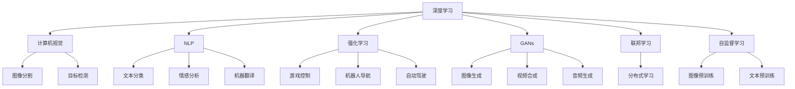
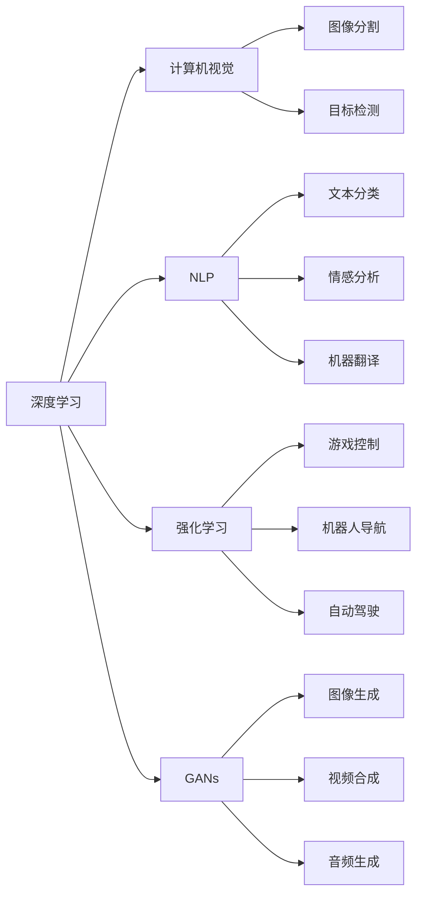
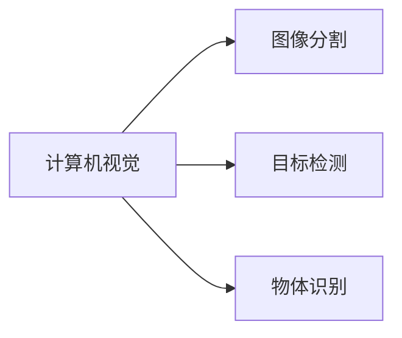
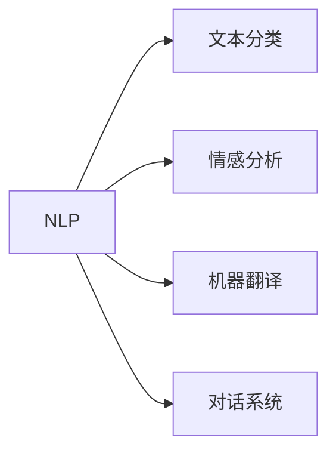
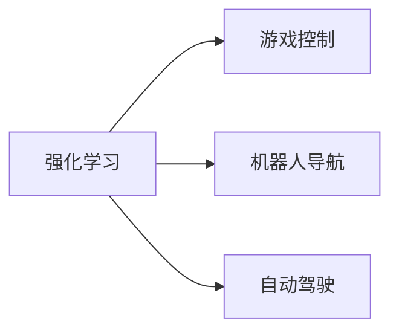
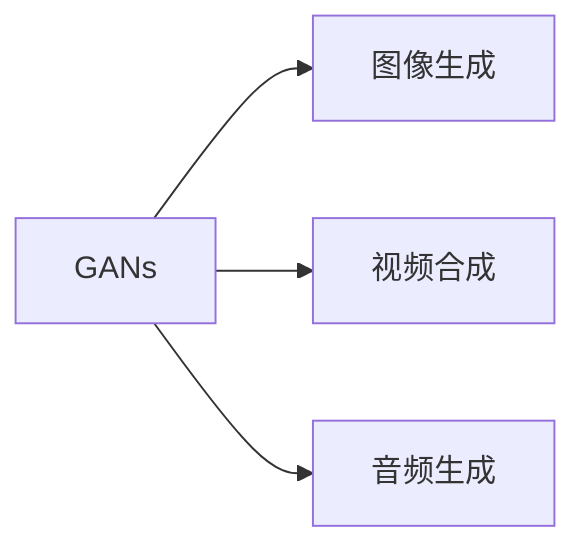
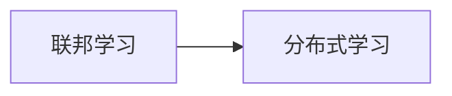
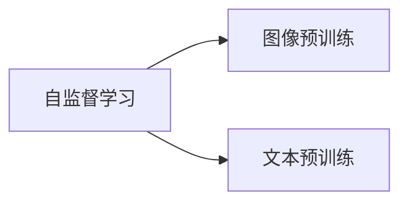
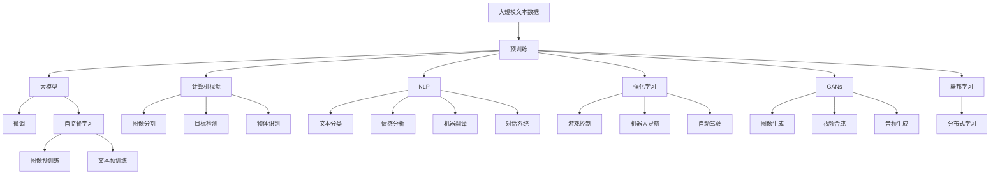

                 

# AI领域的最新技术进展

> 关键词：
- 深度学习
- 计算机视觉
- 自然语言处理
- 强化学习
- 生成对抗网络
- 联邦学习
- 自监督学习

## 1. 背景介绍

### 1.1 问题由来

近年来，人工智能(AI)技术迅猛发展，尤其是深度学习在计算机视觉、自然语言处理(NLP)、强化学习(RL)等领域的突破性进展，使得AI在诸多应用场景中取得了显著成效。

例如，深度学习在图像识别、语音识别、自然语言处理等任务上取得了SOTA（State-Of-The-Art）结果；计算机视觉中的目标检测、图像生成、视频分析等技术应用广泛，提高了自动化生产的效率；自然语言处理中的语言模型、情感分析、机器翻译等技术不断改进，让机器能够更好地理解和生成自然语言。

然而，这些技术的快速发展也带来了一些挑战，如模型复杂度高、训练时间长、计算资源需求大等。此外，模型预测的鲁棒性、透明性和公平性等问题也引发了社会各界的关注。

## 2. 核心概念与联系

### 2.1 核心概念概述

为更好地理解AI领域的最新技术进展，本节将介绍几个密切相关的核心概念：

- 深度学习(Deep Learning)：一种基于神经网络的机器学习技术，通过多层次的非线性变换实现数据的复杂建模和特征提取。
- 计算机视觉(Computer Vision)：研究如何让计算机识别和理解图像、视频中的对象、场景等，涉及图像分割、目标检测、物体识别等任务。
- 自然语言处理(Natural Language Processing, NLP)：让计算机理解、处理、生成人类语言的技术，包括文本分类、情感分析、机器翻译、对话系统等。
- 强化学习(Reinforcement Learning, RL)：通过智能体与环境的交互，利用奖励信号优化决策策略的学习方式，广泛应用于游戏、机器人控制、自动驾驶等领域。
- 生成对抗网络(Generative Adversarial Networks, GANs)：由生成器和判别器两个对抗模块组成，通过对抗训练生成逼真数据的技术，广泛应用于图像生成、视频合成、音频生成等领域。
- 联邦学习(Federated Learning)：一种分布式学习范式，多个客户端通过本地数据训练模型，并将模型参数在中央服务器聚合更新，保护数据隐私。
- 自监督学习(Self-Supervised Learning)：使用无标签数据进行预训练，让模型学习到数据的隐含结构和语义表示的技术，广泛应用于图像、文本等数据。

这些核心概念之间的逻辑关系可以通过以下Mermaid流程图来展示：

这个流程图展示了几大核心AI技术间的联系和应用领域。

### 2.2 概念间的关系

这些核心概念之间存在着紧密的联系，形成了AI技术的完整生态系统。下面我们通过几个Mermaid流程图来展示这些概念之间的关系。

#### 2.2.1 深度学习与其他技术的关系

这个流程图展示了深度学习与其他几大AI技术间的相互支持关系。

#### 2.2.2 计算机视觉在图像处理中的应用

这个流程图展示了计算机视觉在图像处理中的应用。

#### 2.2.3 自然语言处理在语言理解中的应用

这个流程图展示了自然语言处理在语言理解中的应用。

#### 2.2.4 强化学习在游戏控制中的应用

这个流程图展示了强化学习在游戏控制中的应用。

#### 2.2.5 生成对抗网络在图像生成中的应用

这个流程图展示了生成对抗网络在图像生成中的应用。

#### 2.2.6 联邦学习在分布式学习中的应用

这个流程图展示了联邦学习在分布式学习中的应用。

#### 2.2.7 自监督学习在数据预训练中的应用

这个流程图展示了自监督学习在数据预训练中的应用。

### 2.3 核心概念的整体架构

最后，我们用一个综合的流程图来展示这些核心概念在大模型微调过程中的整体架构：

这个综合流程图展示了从预训练到微调，再到分布式学习的完整过程。大模型首先在大规模文本数据上进行预训练，然后通过微调（包括全参数微调和自监督学习）或自监督学习来适应下游任务。同时，将自监督学习应用于图像、文本等多种数据，通过分布式学习技术，多客户端数据聚合更新，形成更加鲁棒、泛化性更强的模型。通过这些流程图，我们可以更清晰地理解AI技术的核心概念及其相互关系，为后续深入讨论具体的AI技术进展奠定基础。

## 3. 核心算法原理 & 具体操作步骤
### 3.1 算法原理概述

AI领域的最新技术进展涵盖多个学科，涉及深度学习、计算机视觉、自然语言处理、强化学习等多个方向。以下是一些代表性的技术进展及其实现原理：

**深度学习**

深度学习是一种基于神经网络的前馈计算模型，通过对大量数据的学习，实现对复杂数据的高级抽象和特征提取。其核心思想是通过多层非线性变换，逐步构建数据的语义表示。深度学习在图像识别、语音识别、自然语言处理等任务上取得了显著成效。

**计算机视觉**

计算机视觉研究如何让计算机识别和理解图像、视频中的对象、场景等。常见的计算机视觉任务包括图像分割、目标检测、物体识别等。计算机视觉的核心技术包括卷积神经网络(CNN)、残差网络(ResNet)、自注意力机制(Attention)等。

**自然语言处理**

自然语言处理研究如何让计算机理解、处理、生成人类语言。常见的NLP任务包括文本分类、情感分析、机器翻译、对话系统等。NLP的核心技术包括循环神经网络(RNN)、长短时记忆网络(LSTM)、Transformer等。

**强化学习**

强化学习通过智能体与环境的交互，利用奖励信号优化决策策略。常见的强化学习算法包括Q-learning、Deep Q-Network(DQN)、Policy Gradient等。强化学习在游戏控制、机器人导航、自动驾驶等领域有广泛应用。

**生成对抗网络**

生成对抗网络由生成器和判别器两个对抗模块组成，通过对抗训练生成逼真数据。GANs在图像生成、视频合成、音频生成等领域有广泛应用。

**联邦学习**

联邦学习是一种分布式学习范式，多个客户端通过本地数据训练模型，并将模型参数在中央服务器聚合更新，保护数据隐私。联邦学习在医疗、金融、物流等领域有广泛应用。

**自监督学习**

自监督学习使用无标签数据进行预训练，让模型学习到数据的隐含结构和语义表示。常见的自监督学习任务包括图像预训练、文本预训练等。自监督学习在图像、文本等多种数据上有广泛应用。

### 3.2 算法步骤详解

以下是对各核心算法步骤的详细讲解：

**深度学习**

深度学习的主要步骤包括数据准备、模型选择、网络设计、模型训练、模型评估和部署等。深度学习模型的训练通常使用反向传播算法和随机梯度下降法进行。模型的评估主要通过精度、召回率、F1分数等指标进行。

**计算机视觉**

计算机视觉的主要步骤包括数据准备、模型选择、网络设计、模型训练、模型评估和部署等。常见的计算机视觉模型包括卷积神经网络(CNN)、残差网络(ResNet)、自注意力机制(Attention)等。模型的训练通常使用交叉熵损失函数和随机梯度下降法进行。模型的评估主要通过精度、召回率、F1分数等指标进行。

**自然语言处理**

自然语言处理的主要步骤包括数据准备、模型选择、网络设计、模型训练、模型评估和部署等。常见的NLP模型包括循环神经网络(RNN)、长短时记忆网络(LSTM)、Transformer等。模型的训练通常使用交叉熵损失函数和随机梯度下降法进行。模型的评估主要通过精度、召回率、F1分数等指标进行。

**强化学习**

强化学习的主要步骤包括环境建模、智能体设计、决策策略优化、模型训练和部署等。常见的强化学习算法包括Q-learning、Deep Q-Network(DQN)、Policy Gradient等。模型的训练通常使用梯度上升法进行。模型的评估主要通过回报值、策略稳定性和收敛速度等指标进行。

**生成对抗网络**

生成对抗网络的主要步骤包括生成器设计、判别器设计、对抗训练、模型训练和部署等。GANs的核心在于生成器和判别器的对抗训练。模型的训练通常使用梯度上升法进行。模型的评估主要通过生成的数据质量和对抗性等指标进行。

**联邦学习**

联邦学习的主要步骤包括模型选择、数据划分、本地模型训练、参数聚合和模型更新等。联邦学习的关键在于参数聚合算法的设计和实现。常见的参数聚合算法包括FedAvg、FedProx等。模型的训练通常使用随机梯度下降法进行。模型的评估主要通过模型精度、泛化能力和计算效率等指标进行。

**自监督学习**

自监督学习的主要步骤包括数据准备、模型选择、预训练和微调等。常见的自监督学习任务包括图像预训练、文本预训练等。模型的预训练通常使用无监督学习的任务，如自监督学习、对比学习等。模型的微调通常使用有监督学习的任务，如分类、匹配等。模型的评估主要通过精度、召回率、F1分数等指标进行。

### 3.3 算法优缺点

AI领域的最新技术进展具有以下优点：

1. 高效性：深度学习、计算机视觉、自然语言处理、强化学习等技术具有高效性，能够在短时间内处理大量数据，实现高精度的模型预测。
2. 鲁棒性：深度学习、计算机视觉、自然语言处理等技术具有鲁棒性，能够在不同数据集和场景下保持稳定性能。
3. 泛化性：深度学习、计算机视觉、自然语言处理等技术具有泛化性，能够在不同的应用场景下实现良好的迁移能力。
4. 可扩展性：深度学习、计算机视觉、自然语言处理等技术具有可扩展性，能够在不同的硬件平台和设备上实现高效的计算。

同时，这些技术也存在一些缺点：

1. 模型复杂度高：深度学习、计算机视觉、自然语言处理等技术具有高复杂度，需要大量的计算资源和时间。
2. 数据需求大：深度学习、计算机视觉、自然语言处理等技术需要大量的标注数据进行训练和验证，数据获取成本较高。
3. 算法黑盒：深度学习、计算机视觉、自然语言处理等技术的模型复杂度高，难以解释和调试。
4. 算法公平性：深度学习、计算机视觉、自然语言处理等技术的模型可能存在偏见和歧视，需要更多的公平性和可解释性改进。

尽管存在这些缺点，但AI领域的最新技术进展已经为各行业带来了巨大的变革和创新，推动了智能化、自动化和数字化的发展。

### 3.4 算法应用领域

AI领域的最新技术进展已经在多个领域得到了广泛应用，以下是一些典型的应用场景：

**计算机视觉**

计算机视觉技术已经在医疗影像分析、智能安防、自动驾驶、智慧零售等领域得到了广泛应用。例如，在医疗影像分析中，计算机视觉技术可以自动分析X光片、CT扫描等影像，辅助医生诊断疾病；在智能安防中，计算机视觉技术可以实时监测摄像头，识别可疑行为并进行报警；在自动驾驶中，计算机视觉技术可以识别道路标志、行人、车辆等，辅助车辆进行决策；在智慧零售中，计算机视觉技术可以识别商品、顾客行为并进行智能推荐。

**自然语言处理**

自然语言处理技术已经在智能客服、机器翻译、情感分析、智能写作等领域得到了广泛应用。例如，在智能客服中，自然语言处理技术可以自动回答客户咨询，提升服务效率；在机器翻译中，自然语言处理技术可以实现不同语言之间的自动翻译；在情感分析中，自然语言处理技术可以自动分析客户评论，进行情感分类；在智能写作中，自然语言处理技术可以自动生成新闻、报告等文本内容。

**强化学习**

强化学习技术已经在游戏控制、机器人导航、自动驾驶等领域得到了广泛应用。例如，在游戏控制中，强化学习技术可以实现自主决策，提升游戏体验；在机器人导航中，强化学习技术可以自动规划路径，提高导航精度；在自动驾驶中，强化学习技术可以实时进行交通决策，保障行车安全。

**生成对抗网络**

生成对抗网络技术已经在图像生成、视频合成、音频生成等领域得到了广泛应用。例如，在图像生成中，生成对抗网络技术可以自动生成逼真图像；在视频合成中，生成对抗网络技术可以实现视频剪辑和特效制作；在音频生成中，生成对抗网络技术可以自动生成音乐和语音。

**联邦学习**

联邦学习技术已经在医疗、金融、物流等领域得到了广泛应用。例如，在医疗领域，联邦学习技术可以实现跨医院数据共享，提升医疗水平；在金融领域，联邦学习技术可以实现跨银行数据共享，提高风险控制能力；在物流领域，联邦学习技术可以实现跨区域数据共享，提升物流效率。

**自监督学习**

自监督学习技术已经在图像预训练、文本预训练等领域得到了广泛应用。例如，在图像预训练中，自监督学习技术可以自动提取图像特征，提升模型性能；在文本预训练中，自监督学习技术可以自动提取文本特征，提升NLP任务效果。

## 4. 数学模型和公式 & 详细讲解 & 举例说明

### 4.1 数学模型构建

以下是一些核心算法的数学模型构建：

**深度学习**

深度学习模型的数学模型构建包括前向传播和反向传播两个步骤。以卷积神经网络为例，其数学模型构建如下：

输入数据：$x$
卷积层：$h(x) = \sigma(Wx + b)$
池化层：$p(h(x)) = \max(h(x))$
全连接层：$y = W^Th(x) + b$
其中，$W$和$b$为卷积神经网络中的参数，$\sigma$为激活函数，$h(x)$为卷积层输出，$p(h(x))$为池化层输出，$y$为最终输出。

**计算机视觉**

计算机视觉模型的数学模型构建包括前向传播和反向传播两个步骤。以卷积神经网络为例，其数学模型构建如下：

输入数据：$x$
卷积层：$h(x) = \sigma(Wx + b)$
池化层：$p(h(x)) = \max(h(x))$
全连接层：$y = W^Th(x) + b$
其中，$W$和$b$为卷积神经网络中的参数，$\sigma$为激活函数，$h(x)$为卷积层输出，$p(h(x))$为池化层输出，$y$为最终输出。

**自然语言处理**

自然语言处理模型的数学模型构建包括前向传播和反向传播两个步骤。以循环神经网络为例，其数学模型构建如下：

输入数据：$x$
隐藏层：$s = f(Wx + Uh + b)$
输出层：$y = g(Ws + b)$
其中，$W$和$U$为循环神经网络中的参数，$f$为激活函数，$s$为隐藏层输出，$y$为最终输出。

**强化学习**

强化学习模型的数学模型构建包括前向传播和反向传播两个步骤。以Q-learning为例，其数学模型构建如下：

状态-动作值函数：$Q(s, a) = r + \gamma \max_{a'} Q(s', a')$
状态值函数：$V(s) = \sum_{a} \pi(a|s)Q(s, a)$
其中，$Q(s, a)$为状态-动作值函数，$V(s)$为状态值函数，$r$为奖励，$\gamma$为折扣因子，$s$为状态，$a$为动作，$s'$为下一个状态。

**生成对抗网络**

生成对抗网络模型的数学模型构建包括前向传播和反向传播两个步骤。以GANs为例，其数学模型构建如下：

生成器：$z \sim p(z) \rightarrow G(z) \sim p_{\theta_g}(x)$
判别器：$x \sim p(x) \rightarrow D(x) \sim p_{\theta_d}(x)$
对抗损失函数：$L = -\mathbb{E}_{z \sim p(z)}[\log D(G(z))] - \mathbb{E}_{x \sim p(x)}[\log(1 - D(x))]$
其中，$G(z)$为生成器输出，$D(x)$为判别器输出，$L$为对抗损失函数，$z$为噪声向量，$p(z)$为噪声向量分布，$x$为真实数据，$p(x)$为真实数据分布。

**联邦学习**

联邦学习模型的数学模型构建包括前向传播和反向传播两个步骤。以FedAvg为例，其数学模型构建如下：

本地模型：$w^{k+1} = w^k - \frac{\eta}{m} \sum_{i=1}^m\nabla L(w^k; x^i)$
全局模型：$w^{k+1} = \frac{1}{N}\sum_{i=1}^N w_i^{k+1}$
其中，$w^{k+1}$为更新后的模型参数，$w^k$为更新前的模型参数，$\eta$为学习率，$\nabla L(w^k; x^i)$为本地梯度，$m$为本地数据集大小，$x^i$为本地数据集，$N$为客户端数量。

**自监督学习**

自监督学习模型的数学模型构建包括前向传播和反向传播两个步骤。以自监督学习为例，其数学模型构建如下：

预训练任务：$L = L_{data} + \lambda L_{recon}$
其中，$L$为自监督学习目标函数，$L_{data}$为数据相关任务目标函数，$L_{recon}$为重构任务目标函数，$\lambda$为权重系数。

### 4.2 公式推导过程

以下是一些核心算法的公式推导过程：

**深度学习**

深度学习模型的公式推导过程包括前向传播和反向传播两个步骤。以卷积神经网络为例，其公式推导过程如下：

前向传播：$h(x) = \sigma(Wx + b)$
反向传播：$\frac{\partial L}{\partial W} = \frac{\partial L}{\partial y}\frac{\partial y}{\partial h}\frac{\partial h}{\partial W}$
其中，$L$为损失函数，$y$为输出，$h$为隐藏层输出，$W$为权重参数，$b$为偏置参数。

**计算机视觉**

计算机视觉模型的公式推导过程包括前向传播和反向传播两个步骤。以卷积神经网络为例，其公式推导过程如下：

前向传播：$h(x) = \sigma(Wx + b)$
反向传播：$\frac{\partial L}{\partial W} = \frac{\partial L}{\partial y}\frac{\partial y}{\partial h}\frac{\partial h}{\partial W}$
其中，$L$为损失函数，$y$为输出，$h$为隐藏层输出，$W$为权重参数，$b$为偏置参数。

**自然语言处理**

自然语言处理模型的公式推导过程包括前向传播和反向传播两个步骤。以循环神经网络为例，其公式推导过程如下：

前向传播：$s = f(Wx + Uh + b)$
反向传播：$\frac{\partial L}{\partial W} = \frac{\partial L}{\partial y}\frac{\partial y}{\partial s}\frac{\partial s}{\partial W}$
其中，$L$为损失函数，$y$为输出，$s$为隐藏层输出，$W$为权重参数，$U$为权重参数，$f$为激活函数。

**强化学习**

强化学习模型的公式推导过程包括前向传播和反向传播两个步骤。以Q-learning为例，其公式推导过程如下：

前向传播：$Q(s, a) = r + \gamma \max_{a'} Q(s', a')$
反向传播：$\frac{\partial L}{\partial W} = \frac{\partial L}{\partial Q} \frac{\partial Q}{\partial W}$
其中，$L$为损失函数，$Q$为状态-动作值函数，$V$为状态值函数，$r$为奖励，$\gamma$为折扣因子，$s$为状态，$a$为动作，$s'$为下一个状态，$W$为权重参数。

**生成对抗网络**

生成对抗网络模型的公式推导过程包括前向传播和反向传播两个步骤。以GANs为例，其公式推导过程如下：

前向传播：$G(z) = \mu(z)$
反向传播：$\frac{\partial L}{\partial G} = \frac{\partial L}{\partial D} \frac{\partial D}{\partial G}$
其中，$L$为损失函数，$G$为生成器输出，$D$为判别器输出，$\mu$为生成器函数，$W$为权重参数。

**联邦学习**

联邦学习模型的公式推导过程包括前向传播和反向传播两个步骤。以FedAvg为例，其公式推导过程如下：

前向传播：$w^{k+1} = w^k - \frac{\eta}{m} \sum_{i=1}^m\nabla L(w^k; x^i)$
反向传播：$\frac{\partial L}{\partial w} = \frac{\partial L}{\partial w^{k+1}}$
其中，$L$为损失函数，$w$为模型参数，$m$为本地数据集大小，$x^i$为本地数据集，$w^k$为更新前的模型参数，$w^{k+1}$为更新后的模型参数，$\eta$为学习率。

**自监督学习**

自监督学习模型的公式推导过程包括前向传播和反向传播两个步骤。以自监督学习为例，其公式推导过程如下：

前向传播：$L = L_{data} + \lambda L_{recon}$
反向传播：$\frac{\partial L}{\partial w} = \frac{\partial L}{\partial L_{data}} + \frac{\partial L}{\partial L_{recon}}$
其中，$L$为损失函数，$L_{data}$为数据相关任务目标函数，$L_{recon}$为重构任务目标函数，$w$为模型参数，$\lambda$为权重系数。

### 4.3 案例分析与讲解

以下是一些核心算法的案例分析与讲解：

**深度学习**

深度学习算法已经在图像识别、语音识别、自然语言处理等任务上取得了SOTA结果。以图像识别为例，可以使用卷积神经网络(CNN)进行模型训练和预测。CNN模型的核心思想是通过多层卷积和池化操作，自动提取图像的特征。其训练过程包括数据准备、模型选择、网络设计、模型训练、模型评估和部署等步骤。

**计算机视觉**

计算机视觉算法已经在医疗影像分析、智能安防、自动驾驶等领域得到了广泛应用。以医疗影像分析为例，可以使用卷积神经网络(CNN)进行模型训练和预测。CNN模型的核心思想是通过多层卷积和池化操作，自动提取影像

