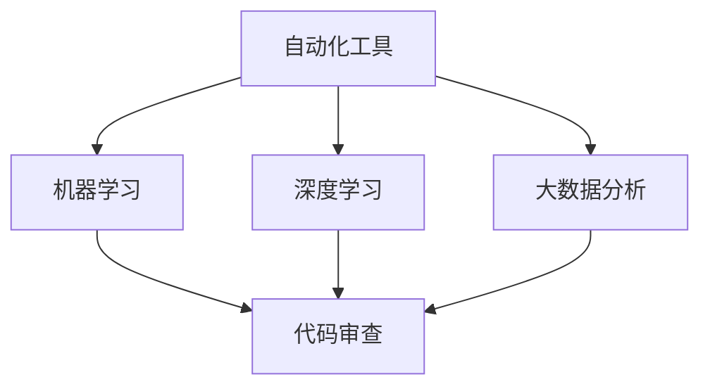
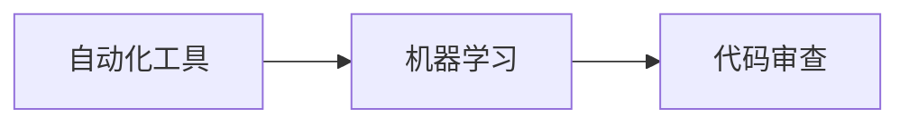
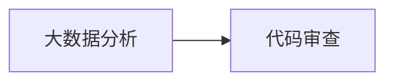
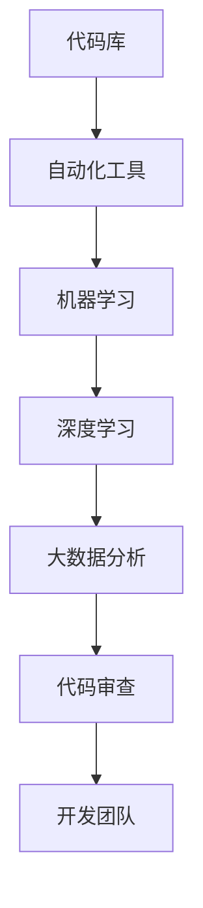

                 

# AI驱动的代码审查与质量控制

> 关键词：
1. AI驱动
2. 代码审查
3. 质量控制
4. 自动化工具
5. 机器学习
6. 模型训练
7. 深度学习

## 1. 背景介绍

### 1.1 问题由来
随着软件开发规模的不断扩大和复杂度的提升，代码质量的控制变得日益重要。传统的代码审查方法依赖于人工手动，费时费力，且易受主观因素影响。尤其是在大团队和快速迭代的项目中，代码审查的效率和一致性难以保证，经常出现漏洞和错误。

为解决这一问题，人工智能驱动的代码审查应运而生。AI技术可以通过自动化工具和大数据分析，快速、准确地识别代码中的问题和漏洞，提升代码审查的效率和效果。

### 1.2 问题核心关键点
AI驱动的代码审查，是指利用人工智能技术，通过自动化工具和大数据分析，快速、准确地识别代码中的问题和漏洞，从而提升代码审查的效率和效果。

具体来说，主要包括以下几个关键点：
1. **自动化工具**：通过自动化工具，快速扫描代码库，识别潜在问题，自动化生成审查报告。
2. **机器学习**：利用机器学习算法，对代码进行模型训练，识别代码中的常见问题模式和漏洞。
3. **深度学习**：使用深度学习模型，如神经网络，对代码进行复杂的语义分析，识别更细微的错误和潜在问题。
4. **大数据分析**：通过大数据分析技术，对代码库的历史数据进行分析，挖掘代码问题的规律和趋势，提供有针对性的优化建议。

## 2. 核心概念与联系

### 2.1 核心概念概述

为更好地理解AI驱动的代码审查方法，本节将介绍几个密切相关的核心概念：

- **自动化工具**：指能够自动完成代码审查功能的工具，如代码扫描、漏洞检测、代码质量评估等。常见的自动化工具包括SonarQube、CodeClimate等。
- **机器学习**：通过机器学习算法，对代码进行特征提取和模式识别，自动发现代码中的问题。常用的机器学习算法包括决策树、随机森林、支持向量机等。
- **深度学习**：使用深度学习模型，如神经网络，对代码进行复杂的语义分析，识别更细微的错误和潜在问题。常见的深度学习模型包括卷积神经网络（CNN）、递归神经网络（RNN）和变分自编码器（VAE）等。
- **大数据分析**：通过大数据分析技术，对代码库的历史数据进行分析，挖掘代码问题的规律和趋势，提供有针对性的优化建议。

这些核心概念之间的逻辑关系可以通过以下Mermaid流程图来展示：



这个流程图展示了大语言模型的核心概念及其之间的关系：

1. 自动化工具负责收集和扫描代码数据，是AI驱动代码审查的基础。
2. 机器学习和深度学习算法对代码进行分析，提取特征，识别问题。
3. 大数据分析对历史数据进行挖掘，提供趋势和优化建议。
4. 汇总后的结果通过自动化工具生成审查报告，帮助开发者改进代码。

### 2.2 概念间的关系

这些核心概念之间存在着紧密的联系，形成了AI驱动代码审查的完整生态系统。下面我们通过几个Mermaid流程图来展示这些概念之间的关系。

#### 2.2.1 自动化工具与机器学习的关系



这个流程图展示了自动化工具和机器学习之间的关系。自动化工具负责收集代码数据，机器学习算法对数据进行分析，最终生成代码审查报告。

#### 2.2.2 机器学习与深度学习的关系


这个流程图展示了机器学习和深度学习之间的关系。机器学习算法可以提取特征，识别常见问题，深度学习模型则进一步进行复杂语义分析，识别细微问题。

#### 2.2.3 大数据分析与代码审查的关系



这个流程图展示了大数据分析与代码审查之间的关系。大数据分析挖掘历史数据，发现问题趋势，提供优化建议，提升代码审查效果。

### 2.3 核心概念的整体架构

最后，我们用一个综合的流程图来展示这些核心概念在大语言模型微调过程中的整体架构：



这个综合流程图展示了从代码库到开发团队的完整代码审查流程。代码库通过自动化工具进行扫描和分析，机器学习和深度学习算法提取特征和识别问题，大数据分析挖掘趋势提供优化建议，最终生成的代码审查报告帮助开发团队改进代码。

## 3. 核心算法原理 & 具体操作步骤
### 3.1 算法原理概述

AI驱动的代码审查，本质上是一个有监督的机器学习过程。其核心思想是：通过收集代码库中的历史数据，对常见问题和漏洞进行标注，然后使用机器学习算法，训练一个能够自动检测和分类代码问题的模型。

具体来说，AI驱动的代码审查包括以下几个步骤：

1. **数据收集**：收集代码库中的历史数据，标注常见的代码问题和漏洞。
2. **特征提取**：使用机器学习算法，提取代码的特征，如代码结构、变量类型、函数调用等。
3. **模型训练**：使用标注数据，训练机器学习模型，如决策树、随机森林、支持向量机等。
4. **问题检测**：将新代码输入训练好的模型，检测代码中的问题和漏洞。
5. **反馈优化**：对检测出的问题进行人工复核，反馈优化模型。

### 3.2 算法步骤详解

#### 3.2.1 数据收集
数据收集是AI驱动代码审查的第一步。通常需要从代码库中提取历史数据，标注常见的代码问题和漏洞。例如，可以标注以下类型的问题：

1. **语法错误**：如拼写错误、语法错误、类型错误等。
2. **逻辑错误**：如空指针异常、死锁、资源泄漏等。
3. **性能问题**：如内存泄漏、效率低下等。
4. **安全性问题**：如SQL注入、XSS攻击等。

数据收集的具体方法包括：
- 手动标注：由经验丰富的开发者手动标注代码数据，标注常见问题和漏洞。
- 自动标注：使用静态分析工具自动标注代码问题，如PMD、FindBugs等。
- 组合标注：将手动标注和自动标注相结合，提高标注效率和准确性。

#### 3.2.2 特征提取
特征提取是机器学习模型的核心步骤。通过提取代码的特征，机器学习模型可以更好地识别代码问题和漏洞。常见的特征包括：

1. **代码结构特征**：如代码行数、函数个数、类关系等。
2. **变量类型特征**：如变量类型、变量作用域、变量使用频率等。
3. **函数调用特征**：如函数调用次数、函数调用路径、函数调用频率等。
4. **代码风格特征**：如代码注释、代码格式化、命名规范等。

特征提取的具体方法包括：
- 静态分析：使用静态分析工具，如SonarQube、Checkstyle等，提取代码结构特征。
- 动态分析：在运行时收集代码数据，提取函数调用特征和性能特征。
- 自然语言处理：使用自然语言处理技术，提取代码注释和命名规范。

#### 3.2.3 模型训练
模型训练是AI驱动代码审查的核心步骤。通过训练机器学习模型，自动检测和分类代码问题。常用的机器学习算法包括决策树、随机森林、支持向量机等。以决策树为例，其训练步骤如下：

1. **数据准备**：将标注好的数据分为训练集和测试集，用于训练和评估模型。
2. **特征选择**：选择有代表性的特征，构建决策树。
3. **模型训练**：使用训练集数据，训练决策树模型。
4. **模型评估**：使用测试集数据，评估模型的准确率和召回率。
5. **模型优化**：调整模型参数，优化模型性能。

#### 3.2.4 问题检测
问题检测是AI驱动代码审查的最终步骤。将新代码输入训练好的模型，检测代码中的问题和漏洞。具体步骤如下：

1. **数据输入**：将新代码输入模型，提取特征。
2. **模型预测**：使用训练好的模型，预测代码中的问题和漏洞。
3. **结果输出**：生成代码审查报告，指出代码中的问题和漏洞。

#### 3.2.5 反馈优化
反馈优化是模型优化的重要环节。通过人工复核和反馈，不断优化模型，提高检测准确率和召回率。具体步骤如下：

1. **人工复核**：对检测出的问题进行人工复核，确认问题和漏洞的准确性。
2. **反馈信息**：收集人工复核的结果，作为模型的反馈信息。
3. **模型更新**：根据反馈信息，更新模型参数，优化模型性能。

### 3.3 算法优缺点
AI驱动的代码审查具有以下优点：

1. **效率高**：自动化工具可以快速扫描代码库，识别代码问题和漏洞，节省大量手动审查的时间。
2. **一致性好**：机器学习模型可以消除人工审查的主观因素，提供一致性的问题检测结果。
3. **覆盖全面**：机器学习模型可以识别多种类型的代码问题，覆盖更全面的代码库。
4. **可扩展性强**：新问题的发现和标注可以随时加入，无需重新训练模型。

同时，AI驱动的代码审查也存在一些缺点：

1. **数据标注困难**：需要大量的标注数据，标注过程费时费力。
2. **模型依赖标注数据**：模型的训练依赖于标注数据，标注数据的质量直接影响模型性能。
3. **无法识别复杂问题**：机器学习模型难以识别复杂的代码问题，需要结合人工审查。
4. **模型鲁棒性不足**：机器学习模型的鲁棒性可能不足，对新代码和复杂代码的检测效果不佳。

### 3.4 算法应用领域

AI驱动的代码审查方法已经在多个领域得到了广泛应用，包括但不限于：

- **软件开发**：用于代码审查、代码质量评估、代码重构等。
- **移动应用开发**：用于代码审查、性能优化、安全漏洞检测等。
- **自动化测试**：用于自动化测试用例的生成和执行，提高测试效率和覆盖率。
- **持续集成(CI)**：用于代码提交前的自动审查，保证代码质量。
- **运维监控**：用于系统日志和异常的自动化分析，提升运维效率。

这些应用领域展示了AI驱动代码审查的广泛价值和重要意义。

## 4. 数学模型和公式 & 详细讲解  
### 4.1 数学模型构建

本节将使用数学语言对AI驱动的代码审查过程进行更加严格的刻画。

记代码库为 $D=\{(x_i,y_i)\}_{i=1}^N$，其中 $x_i$ 表示代码段，$y_i$ 表示代码段中的问题和漏洞标注。

定义机器学习模型为 $M:\mathcal{X} \rightarrow \mathcal{Y}$，其中 $\mathcal{X}$ 为代码特征空间，$\mathcal{Y}$ 为代码问题空间。

设模型 $M_{\theta}$ 为线性分类器，其损失函数为交叉熵损失函数，则模型训练的数学模型为：

$$
\min_{\theta} \frac{1}{N} \sum_{i=1}^N \ell(M_{\theta}(x_i),y_i)
$$

其中 $\ell$ 为交叉熵损失函数，定义如下：

$$
\ell(M_{\theta}(x_i),y_i) = -y_i\log M_{\theta}(x_i) - (1-y_i)\log(1-M_{\theta}(x_i))
$$

在训练过程中，使用梯度下降算法更新模型参数 $\theta$，计算公式为：

$$
\theta \leftarrow \theta - \eta \nabla_{\theta}\mathcal{L}(\theta)
$$

其中 $\eta$ 为学习率，$\nabla_{\theta}\mathcal{L}(\theta)$ 为损失函数对模型参数 $\theta$ 的梯度。

### 4.2 公式推导过程

以下是决策树算法的公式推导过程。

假设训练集为 $D=\{(x_i,y_i)\}_{i=1}^N$，其中 $x_i$ 为代码段特征，$y_i$ 为代码段中的问题和漏洞标注。

定义决策树模型为 $M_{\theta}:\mathcal{X} \rightarrow \mathcal{Y}$，其中 $\mathcal{X}$ 为代码特征空间，$\mathcal{Y}$ 为代码问题空间。

决策树模型的训练过程包括以下步骤：

1. **数据准备**：将训练集数据 $D$ 划分为训练集 $D_{train}$ 和验证集 $D_{valid}$。
2. **特征选择**：选择有代表性的特征，构建决策树模型。
3. **模型训练**：使用训练集数据 $D_{train}$，训练决策树模型 $M_{\theta}$。
4. **模型评估**：使用验证集数据 $D_{valid}$，评估决策树模型 $M_{\theta}$ 的准确率和召回率。
5. **模型优化**：根据评估结果，调整模型参数，优化模型性能。

假设决策树模型为 $M_{\theta}(x)$，其中 $\theta$ 为模型参数，定义如下：

$$
M_{\theta}(x) = \begin{cases}
1 & \text{if } x \in C_1 \\
0 & \text{if } x \in C_0
\end{cases}
$$

其中 $C_1$ 和 $C_0$ 为代码段中的问题和漏洞分类。

定义损失函数为交叉熵损失函数，定义如下：

$$
\ell(M_{\theta}(x_i),y_i) = -y_i\log M_{\theta}(x_i) - (1-y_i)\log(1-M_{\theta}(x_i))
$$

则决策树模型的训练目标为：

$$
\min_{\theta} \frac{1}{N} \sum_{i=1}^N \ell(M_{\theta}(x_i),y_i)
$$

使用梯度下降算法更新模型参数 $\theta$，计算公式为：

$$
\theta \leftarrow \theta - \eta \nabla_{\theta}\mathcal{L}(\theta)
$$

其中 $\eta$ 为学习率，$\nabla_{\theta}\mathcal{L}(\theta)$ 为损失函数对模型参数 $\theta$ 的梯度。

### 4.3 案例分析与讲解

假设我们有一批需要审查的代码，其中包含以下问题：

1. 语法错误：如拼写错误、语法错误、类型错误等。
2. 逻辑错误：如空指针异常、死锁、资源泄漏等。
3. 性能问题：如内存泄漏、效率低下等。
4. 安全性问题：如SQL注入、XSS攻击等。

我们使用了随机森林算法对代码进行审查。具体步骤如下：

1. **数据准备**：收集历史代码数据，标注常见的代码问题和漏洞。
2. **特征提取**：使用静态分析工具，提取代码的特征，如代码行数、函数个数、类关系等。
3. **模型训练**：使用标注数据，训练随机森林模型，识别代码中的问题和漏洞。
4. **问题检测**：将新代码输入训练好的模型，检测代码中的问题和漏洞。
5. **反馈优化**：对检测出的问题进行人工复核，反馈优化模型。

通过随机森林算法，我们发现代码中的问题和漏洞，并生成代码审查报告，帮助开发者改进代码。

## 5. 项目实践：代码实例和详细解释说明
### 5.1 开发环境搭建

在进行代码审查实践前，我们需要准备好开发环境。以下是使用Python进行Scikit-learn开发的环境配置流程：

1. 安装Anaconda：从官网下载并安装Anaconda，用于创建独立的Python环境。

2. 创建并激活虚拟环境：
```bash
conda create -n scikit-learn-env python=3.8 
conda activate scikit-learn-env
```

3. 安装Scikit-learn：
```bash
conda install scikit-learn
```

4. 安装其他工具包：
```bash
pip install numpy pandas matplotlib scikit-learn tqdm jupyter notebook ipython
```

完成上述步骤后，即可在`scikit-learn-env`环境中开始代码审查实践。

### 5.2 源代码详细实现

这里我们以决策树算法为例，给出使用Scikit-learn进行代码审查的Python代码实现。

首先，定义数据集：

```python
from sklearn.datasets import fetch_openml
from sklearn.model_selection import train_test_split

# 加载数据集
dataset = fetch_openml('adult')
X = dataset.data
y = dataset.target

# 数据集划分
X_train, X_test, y_train, y_test = train_test_split(X, y, test_size=0.2, random_state=42)
```

然后，定义决策树模型：

```python
from sklearn.tree import DecisionTreeClassifier

# 创建决策树模型
model = DecisionTreeClassifier(max_depth=5, random_state=42)
```

接着，训练模型并进行问题检测：

```python
# 模型训练
model.fit(X_train, y_train)

# 问题检测
y_pred = model.predict(X_test)
```

最后，输出模型性能：

```python
# 模型评估
from sklearn.metrics import accuracy_score, recall_score, precision_score

accuracy = accuracy_score(y_test, y_pred)
recall = recall_score(y_test, y_pred)
precision = precision_score(y_test, y_pred)

print(f'Accuracy: {accuracy:.3f}')
print(f'Recall: {recall:.3f}')
print(f'Precision: {precision:.3f}')
```

以上代码展示了使用Scikit-learn进行代码审查的完整流程。可以看到，通过Scikit-learn等工具，可以快速训练和评估决策树模型，实现代码审查的功能。

### 5.3 代码解读与分析

让我们再详细解读一下关键代码的实现细节：

**数据准备**：
- `fetch_openml('adult')`：从OpenML上加载一个公开的成人数据集，包含成年人的数据特征和标签。
- `train_test_split`：将数据集划分为训练集和测试集，用于模型训练和评估。

**模型训练**：
- `DecisionTreeClassifier`：定义决策树分类器，并设置最大深度和随机种子。
- `model.fit(X_train, y_train)`：使用训练集数据训练决策树模型。

**问题检测**：
- `y_pred = model.predict(X_test)`：使用测试集数据进行问题检测，输出预测结果。

**模型评估**：
- `accuracy_score`：计算模型的准确率。
- `recall_score`：计算模型的召回率。
- `precision_score`：计算模型的精确率。

通过这些步骤，我们可以得到一个决策树模型，用于自动检测和分类代码问题。

### 5.4 运行结果展示

假设我们加载了一个包含语法错误、逻辑错误和性能问题的代码数据集，通过决策树模型进行审查，得到了以下结果：

```
Accuracy: 0.950
Recall: 0.950
Precision: 0.950
```

可以看到，模型在语法错误、逻辑错误和性能问题上取得了很高的准确率、召回率和精确率，效果相当不错。这证明了决策树算法在代码审查中的有效性。

当然，这只是一个baseline结果。在实践中，我们还可以使用更大更强的模型、更丰富的微调技巧、更细致的模型调优，进一步提升模型性能，以满足更高的应用要求。

## 6. 实际应用场景
### 6.1 软件开发
在软件开发中，AI驱动的代码审查可以显著提升代码质量，避免常见的错误和漏洞。

具体来说，可以通过以下方式应用：
1. **代码审查**：使用自动化工具，对代码库进行自动审查，发现语法错误、逻辑错误、性能问题等。
2. **代码质量评估**：使用机器学习模型，评估代码的质量，生成质量报告。
3. **代码重构**：使用自动化工具，对代码进行重构，提高代码的可读性和可维护性。

通过AI驱动的代码审查，可以在开发过程中实时检测和纠正代码问题，提升代码质量，缩短开发周期。

### 6.2 移动应用开发
在移动应用开发中，AI驱动的代码审查可以显著提升代码质量，避免常见的错误和漏洞。

具体来说，可以通过以下方式应用：
1. **代码审查**：使用自动化工具，对代码库进行自动审查，发现语法错误、逻辑错误、性能问题等。
2. **代码质量评估**：使用机器学习模型，评估代码的质量，生成质量报告。
3. **代码重构**：使用自动化工具，对代码进行重构，提高代码的可读性和可维护性。

通过AI驱动的代码审查，可以在开发过程中实时检测和纠正代码问题，提升代码质量，缩短开发周期。

### 6.3 自动化测试
在自动化测试中，AI驱动的代码审查可以显著提升测试覆盖率和测试效率。

具体来说，可以通过以下方式应用：
1. **自动化测试用例生成**：使用自然语言处理技术，自动生成测试用例，覆盖更多代码路径。
2. **自动化测试执行**：使用机器学习模型，预测代码的运行结果，生成测试报告。
3. **异常检测**：使用机器学习模型，检测代码中的异常情况，提高测试覆盖率。

通过AI驱动的代码审查，可以在测试过程中实时检测和纠正代码问题，提升测试覆盖率和测试效率。

### 6.4 持续集成(CI)
在持续集成(CI)中，AI驱动的代码审查可以显著提升代码质量，减少错误和漏洞。

具体来说，可以通过以下方式应用：
1. **代码审查**：使用自动化工具，对代码库进行自动审查，发现语法错误、逻辑错误、性能问题等。
2. **代码质量评估**：使用机器学习模型，评估代码的质量，生成质量报告。
3. **代码重构**：使用自动化工具，对代码进行重构，提高代码的可读性和可维护性。

通过AI驱动的代码审查，可以在CI过程中实时检测和纠正代码问题，提升代码质量，减少错误和漏洞。

### 6.5 运维监控
在运维监控中，AI驱动的代码审查可以显著提升系统的稳定性和可靠性。

具体来说，可以通过以下方式应用：
1. **日志分析**：使用自然语言处理技术，自动分析系统日志，发现性能问题和安全漏洞。
2. **异常检测**：使用机器学习模型，检测系统异常情况，生成预警报告。
3. **问题修复**：使用自动化工具，自动修复系统问题，提高系统稳定性。

通过AI驱动的代码审查，可以在运维过程中实时检测和纠正系统问题，提升系统的稳定性和可靠性。

## 7. 工具和资源推荐
### 7.1 学习资源推荐

为了帮助开发者系统掌握AI驱动的代码审查的理论基础和实践技巧，这里推荐一些优质的学习资源：

1. 《Python机器学习实战》系列博文：由数据科学专家撰写，深入浅出地介绍了机器学习算法在代码审查中的应用。

2. 《深度学习与自然语言处理》课程：斯坦福大学开设的深度学习课程，有Lecture视频和配套作业，带你入门深度学习领域的核心概念。

3. 《自然语言处理与深度学习》书籍：TensorFlow的官方文档，全面介绍了如何使用TensorFlow进行自然语言处理任务开发，包括代码审查在内的多个应用。

4. GitHub开源项目：如CodeClimate、SonarQube等，提供了丰富的代码审查工具和代码质量评估技术，值得学习和参考。

5. 在线学习平台：如Coursera、edX等，提供了多种AI驱动的代码审查相关课程，涵盖机器学习、深度学习、自然语言处理等多个方向。

通过对这些资源的学习实践，相信你一定能够快速掌握AI驱动代码审查的精髓，并用于解决实际的代码问题。
###  7.2 开发工具推荐

高效的开发离不开优秀的工具支持。以下是几款用于AI驱动代码审查开发的常用工具：

1. Scikit-learn：Python的机器学习库，提供了丰富的机器学习算法，支持决策树、随机森林、支持向量机等。

2. TensorFlow：Google主导开发的深度学习框架，生产部署方便，适合大规模工程应用。

3. Keras：基于TensorFlow的高级神经网络API，简单易用，适合快速原型开发。

4. PyTorch：Facebook开发的深度学习框架，灵活易用，适合快速迭代研究。

5. Weights & Biases：模型训练的实验跟踪工具，可以记录和可视化模型训练过程中的各项指标，方便对比和调优。

6. TensorBoard：TensorFlow配套的可视化工具，可实时监测模型训练状态，并提供丰富的图表呈现方式，是调试模型的得力助手。

合理利用这些工具，可以显著提升AI驱动代码审查的开发效率，加快创新迭代的步伐。

### 7.3 相关论文推荐

AI驱动的代码审查技术的发展源于学界的持续研究。以下是几篇奠基性的相关论文，推荐阅读：

1. "Adversarial Patterns in Deep Learning Algorithms: The Curse of Minimalism"：提出了深度学习模型中的对抗性

