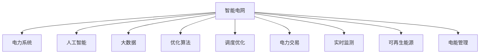
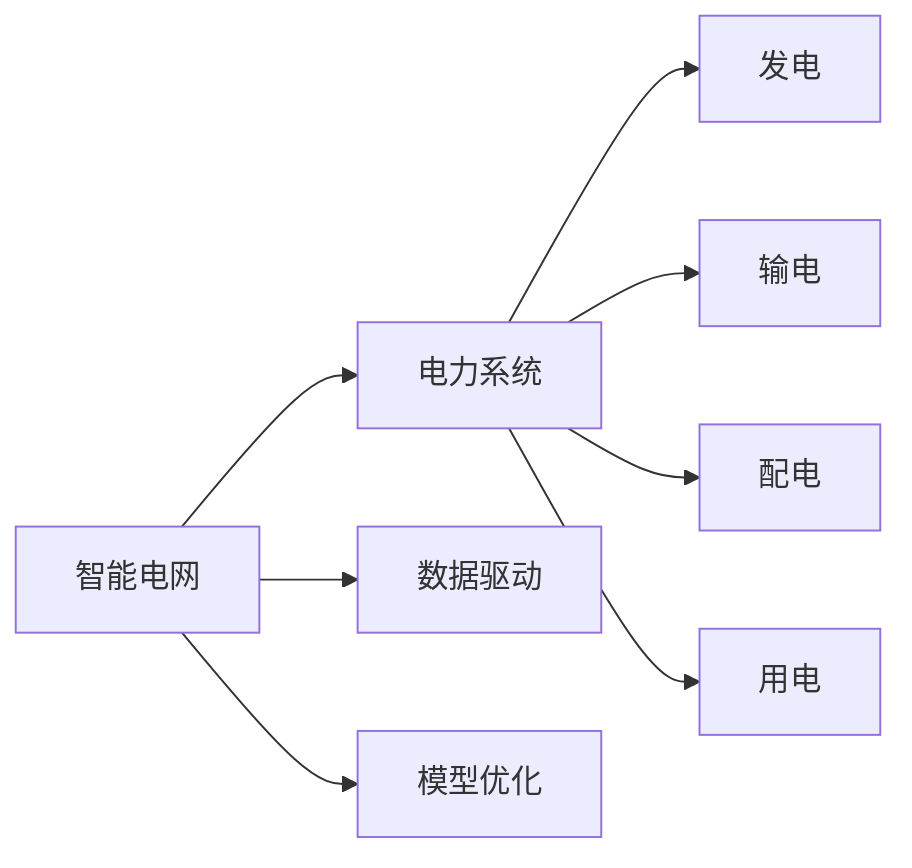
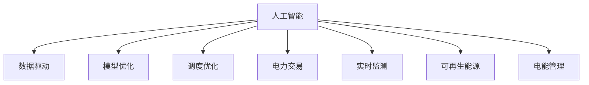
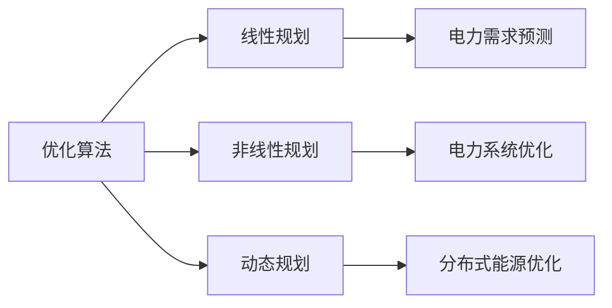
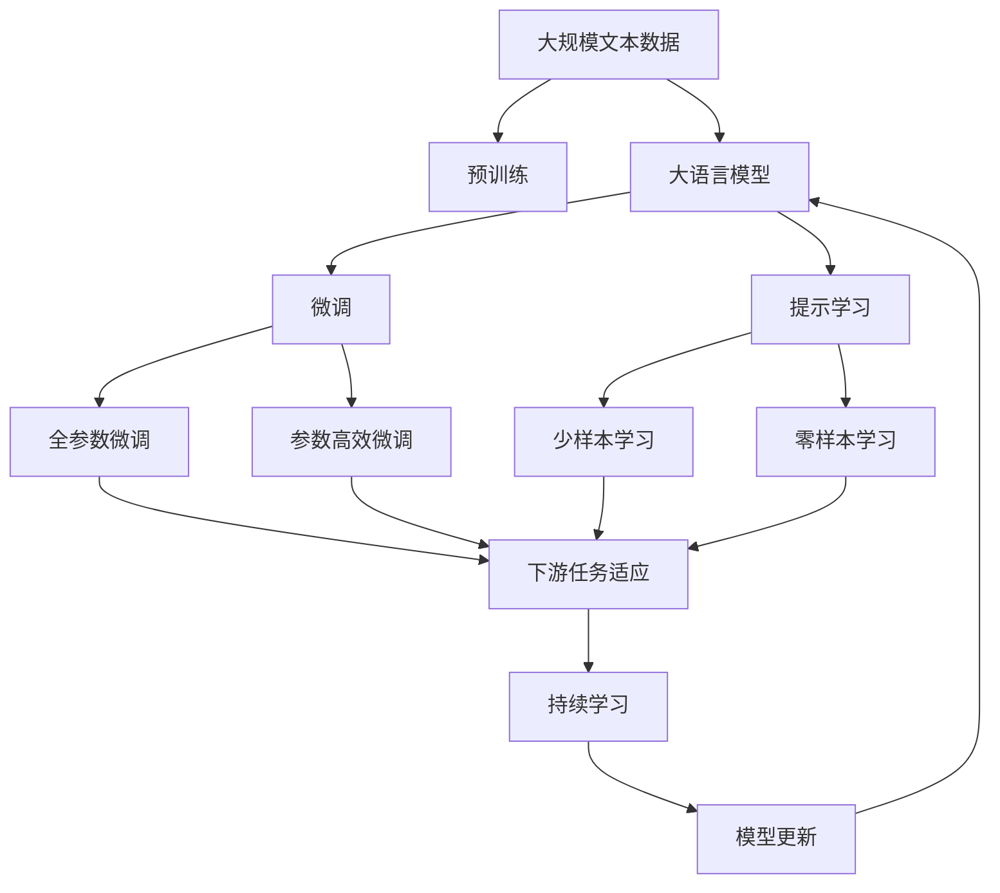

                 

# AI驱动的智能电网:平衡供需提高效率

> 关键词：智能电网,电力系统,人工智能,大数据,优化算法,调度优化,电力交易,实时监测,可再生能源,电能管理

## 1. 背景介绍

### 1.1 问题由来
随着全球经济的高速发展和人口的不断增长，能源需求也日益增加。传统的能源生产方式和电力传输管理模式已无法满足现代社会对电能的巨大需求，同时能源消耗带来的环境问题也愈发严重。传统电力系统的复杂性和不稳定性使得电力供给与需求之间的平衡面临巨大挑战。

为了应对这些挑战，世界各国纷纷推动智能电网的建设。智能电网是一种新型电力系统，其核心目标是通过先进的通信技术、自动化控制系统和数据分析技术，实现电力系统的全方面优化，提高电力供应的可靠性和灵活性，降低能源消耗和环境污染，实现电能的高效管理。

### 1.2 问题核心关键点
智能电网的建设离不开人工智能技术的支撑。人工智能技术，尤其是机器学习和深度学习，在预测电力需求、优化电力调度、提升电能管理效率等方面具有巨大潜力。其关键点在于：

- 数据驱动：智能电网需要大量的实时数据进行支持，以实现精确的电力需求预测和高效的管理决策。
- 模型优化：基于历史数据和实时数据，利用机器学习模型进行电力系统的优化和调度。
- 实时监测：通过实时数据监测和分析，及时发现和处理电力系统中的异常情况，确保电力供应的安全性和稳定性。
- 可再生能源利用：智能电网可以有效整合风能、太阳能等可再生能源，提高能源的利用效率，减少对化石能源的依赖。
- 分布式能源管理：智能电网支持分布式发电和存储，进一步提高电力供应的灵活性和可靠性。

### 1.3 问题研究意义
研究智能电网中的AI技术，对于推动能源革命、实现可持续发展具有重要意义：

- 提高能源效率：通过精确的电力需求预测和优化调度，减少能源浪费，提高能源利用效率。
- 降低碳排放：智能电网可以有效整合可再生能源，减少化石能源的使用，降低碳排放。
- 增强电力系统的韧性：通过实时监测和快速响应，提高电力系统的稳定性和韧性，保障电力供应的可靠性。
- 提升电能管理水平：通过自动化和智能化手段，优化电能管理，提高电力系统的经济性和可持续性。
- 促进能源经济转型：智能电网作为新型电力系统，将推动能源经济从传统的以化石能源为主向可再生能源为主转变，为能源产业带来革命性的变化。

## 2. 核心概念与联系

### 2.1 核心概念概述

智能电网的构建涉及众多核心概念，以下对其进行系统介绍：

- **智能电网**：利用先进的通信技术、自动化控制系统和数据分析技术，实现电力系统的全方面优化，提高电力供应的可靠性和灵活性，降低能源消耗和环境污染，实现电能的高效管理。
- **电力系统**：包括电力生产、传输、分配和使用的全过程，涉及发电、输电、配电和用电四个环节。
- **人工智能**：通过机器学习、深度学习等算法，从大量数据中学习模型，实现预测、决策、优化等功能。
- **大数据**：指规模巨大、类型多样、速度快、真实性高的数据集，智能电网需要大量的实时数据进行支持。
- **优化算法**：用于对电力系统的运行进行优化，如线性规划、非线性规划、动态规划等。
- **调度优化**：通过优化算法，确定电力系统的最优运行策略，实现电力供应的优化和调度。
- **电力交易**：指电力商品的买卖行为，通过市场机制进行电力资源的优化配置。
- **实时监测**：通过实时数据监测和分析，及时发现和处理电力系统中的异常情况，确保电力供应的安全性和稳定性。
- **可再生能源**：如风能、太阳能等，智能电网可以有效整合这些能源，提高能源的利用效率，减少对化石能源的依赖。
- **电能管理**：包括电力需求预测、电力系统优化、电能质量控制、电能安全监测等内容。

这些核心概念之间的逻辑关系可以通过以下Mermaid流程图来展示：



这个流程图展示了我国智能电网的核心概念及其之间的逻辑关系：

1. 智能电网以电力系统为基础，利用人工智能技术进行优化和调度。
2. 大数据为智能电网提供决策支持，优化算法的引入进一步提高了电力系统运行的效率和可靠性。
3. 调度优化和电力交易是智能电网运行的重要组成部分，通过优化算法和市场机制实现电力资源的优化配置。
4. 实时监测和电能管理是智能电网实现稳定运行和安全性的保障。
5. 可再生能源的整合和利用，进一步提高了智能电网的能源利用效率，降低了碳排放。

### 2.2 概念间的关系

这些核心概念之间存在着紧密的联系，形成了智能电网的全方位优化体系。下面我通过几个Mermaid流程图来展示这些概念之间的关系。

#### 2.2.1 智能电网与电力系统的关系



这个流程图展示了智能电网和电力系统的关系。智能电网利用数据驱动和模型优化，对电力系统的发电、输电、配电和用电四个环节进行优化，提高电力供应的可靠性和灵活性。

#### 2.2.2 人工智能在智能电网中的应用



这个流程图展示了人工智能在智能电网中的应用。人工智能技术通过数据驱动和模型优化，实现电力系统的调度优化、电力交易、实时监测、可再生能源整合和电能管理等功能。

#### 2.2.3 优化算法在智能电网中的应用



这个流程图展示了优化算法在智能电网中的应用。优化算法包括线性规划、非线性规划、动态规划等，用于电力需求预测、电力系统优化和分布式能源优化等方面。

### 2.3 核心概念的整体架构

最后，我们用一个综合的流程图来展示这些核心概念在大电网优化过程中的整体架构：



这个综合流程图展示了从预训练到大电网优化，再到持续学习的完整过程。大电网模型首先在大规模文本数据上进行预训练，然后通过微调（包括全参数微调和参数高效微调）或提示学习（包括零样本和少样本学习）来适应特定任务。最终，通过持续学习技术，模型可以不断更新和适应新的任务和数据。

## 3. 核心算法原理 & 具体操作步骤

### 3.1 算法原理概述

智能电网中的AI优化算法，本质上是针对电力系统的运行优化问题，通过机器学习模型对历史和实时数据进行学习和预测，进而实现电力系统的优化决策。其核心思想是：

1. **数据驱动**：通过收集电力系统的大量历史和实时数据，利用机器学习算法训练模型，实现对电力系统运行的预测和优化。
2. **模型优化**：通过优化算法对电力系统的运行进行精确的预测和调度，确保电力供应的可靠性、稳定性和效率。
3. **实时监测**：通过实时数据监测和分析，及时发现和处理电力系统中的异常情况，确保电力供应的安全性和稳定性。
4. **分布式管理**：支持分布式发电和存储，进一步提高电力供应的灵活性和可靠性。

基于以上思想，智能电网中的AI优化算法通常包括以下步骤：

1. 数据预处理：对电力系统的历史和实时数据进行清洗和预处理，确保数据的质量和可用性。
2. 模型训练：利用机器学习算法对预处理后的数据进行训练，建立电力系统的运行模型。
3. 模型预测：利用训练好的模型对电力系统的运行进行预测，生成优化策略和决策。
4. 实时调整：根据实时数据和模型预测结果，进行动态调整和优化，确保电力供应的稳定性和安全性。
5. 持续优化：通过不断收集新的数据和运行经验，持续优化模型，提高电力系统的运行效率和稳定性。

### 3.2 算法步骤详解

下面详细介绍智能电网中常用的AI优化算法及其详细步骤：

**Step 1: 数据预处理**
- 收集电力系统的历史和实时数据，包括发电、输电、配电和用电等环节的数据。
- 对数据进行清洗和预处理，如去除异常值、填充缺失值、归一化等。
- 将数据划分为训练集、验证集和测试集，用于模型的训练、调参和评估。

**Step 2: 模型训练**
- 选择合适的机器学习算法，如线性回归、决策树、支持向量机、随机森林等。
- 在训练集上训练模型，调整超参数，如学习率、正则化系数、特征选择等。
- 在验证集上评估模型性能，防止过拟合，并进行模型调优。

**Step 3: 模型预测**
- 将训练好的模型应用于电力系统的实时数据，进行预测和优化决策。
- 通过模型的输出，生成电力需求预测、电力系统优化策略、电力交易方案等。
- 根据预测结果，进行实时调整，优化电力系统的运行。

**Step 4: 实时调整**
- 根据实时数据和模型预测结果，进行动态调整和优化，确保电力供应的稳定性和安全性。
- 通过自动控制系统和手动干预，调整电力系统的运行参数，如发电出力、输电线路负荷、配电容量等。
- 实时监测电力系统的运行状态，及时发现和处理异常情况，保障电力供应的可靠性。

**Step 5: 持续优化**
- 持续收集电力系统的运行数据和经验，不断更新和优化模型。
- 引入新的算法和优化方法，提升模型的预测和优化能力。
- 定期评估模型性能，调整模型参数和算法，确保模型始终处于最优状态。

### 3.3 算法优缺点

智能电网中的AI优化算法具有以下优点：

- **精度高**：通过机器学习算法对大量数据进行训练，模型可以精确预测电力系统的运行状态和需求。
- **灵活性高**：模型可以根据实时数据进行动态调整和优化，确保电力供应的灵活性和可靠性。
- **可扩展性强**：模型可以轻松扩展到不同规模和类型的电力系统，适用于各种电力场景。
- **优化效果显著**：通过优化算法，可以显著提高电力系统的运行效率和稳定性。

同时，这些算法也存在一些缺点：

- **数据依赖性强**：模型需要大量的历史和实时数据进行训练，数据质量和可用性直接影响模型效果。
- **计算成本高**：训练和优化模型需要大量的计算资源，对算力要求较高。
- **模型复杂度高**：电力系统的运行状态和需求非常复杂，模型难以完全覆盖所有情况。
- **安全风险大**：模型可能存在漏洞和偏见，影响电力供应的安全性和稳定性。

### 3.4 算法应用领域

智能电网中的AI优化算法已经被广泛应用于以下领域：

- **电力需求预测**：通过历史和实时数据，预测电力系统的用电需求，为电力调度提供参考。
- **电力系统优化**：通过优化算法，确定电力系统的最优运行策略，确保电力供应的稳定性和可靠性。
- **电力交易**：通过市场机制，优化电力资源的配置，实现电力供应的经济性和效率。
- **实时监测**：通过实时数据监测和分析，及时发现和处理电力系统中的异常情况，确保电力供应的安全性和稳定性。
- **可再生能源整合**：通过优化算法，整合风能、太阳能等可再生能源，提高能源的利用效率，减少对化石能源的依赖。
- **分布式能源管理**：支持分布式发电和存储，进一步提高电力供应的灵活性和可靠性。

除上述这些应用外，智能电网中的AI优化算法还在电力市场、电网规划、智能家居等领域得到广泛应用，为电力系统的智能化和高效化提供了强大的技术支持。

## 4. 数学模型和公式 & 详细讲解 & 举例说明

### 4.1 数学模型构建

智能电网中的AI优化问题，可以通过建立数学模型来解决。以下是常见的数学模型类型及其构建方法：

**线性规划模型**：
- 目标函数：$f(x) = c^T x$
- 约束条件：$A^T x \leq b, x \geq 0$
- 优化目标：最小化目标函数，满足约束条件

**非线性规划模型**：
- 目标函数：$f(x) = \sum f_i(x_i)$
- 约束条件：$g_i(x) = 0, h_j(x) \leq 0$
- 优化目标：最小化目标函数，满足约束条件

**动态规划模型**：
- 目标函数：$V(s_t) = \max_{a_t} [r_{t+1} + \gamma V(s_{t+1})]$
- 状态转移：$s_{t+1} = f(s_t, a_t)$
- 优化目标：选择最优动作，最大化累积奖励

**机器学习模型**：
- 监督学习：$y = f(x; \theta)$
- 无监督学习：$f(x; \theta)$
- 强化学习：$Q(s, a; \theta) = r + \gamma \max_a Q(s', a'; \theta)$

这些模型通过数学公式描述智能电网中的优化问题，为机器学习算法提供了明确的优化目标和约束条件。

### 4.2 公式推导过程

以下以线性规划模型为例，详细推导模型的数学公式。

假设智能电网中的优化问题为：

- 目标函数：最小化发电成本 $f(x) = c^T x$
- 约束条件：

  - 电力供需平衡：$g(x) = A^T x - b \leq 0$
  - 发电出力限制：$0 \leq x_i \leq u_i$
  - 负荷需求限制：$0 \leq y_i \leq v_i$

其中，$x = (x_1, x_2, ..., x_n)$ 表示发电出力，$y = (y_1, y_2, ..., y_m)$ 表示负荷需求，$A$ 表示电力供需矩阵，$b$ 表示电力需求向量，$c$ 表示发电成本系数，$u$ 表示发电出力上限，$v$ 表示负荷需求上限。

将以上优化问题转化为线性规划模型，可以得到：

$$
\min_{x, y} \quad f(x) = c^T x
$$

$$
s.t. \quad
\begin{cases}
A^T x - b \leq 0 \\
0 \leq x_i \leq u_i \\
0 \leq y_i \leq v_i
\end{cases}
$$

通过求解上述线性规划问题，可以得到最优的发电出力和负荷需求，从而实现电力系统的优化和调度。

### 4.3 案例分析与讲解

为了更直观地理解智能电网中的AI优化算法，以下以风电并网优化为例，介绍模型的构建和优化过程。

**问题描述**：

假设某智能电网中，分布式风电系统通过接入电网进行并网运行。由于风力发电具有不确定性，需要建立风电并网的优化模型，以实现风电系统的最优运行。

**模型构建**：

- 目标函数：最小化风电系统的运行成本 $f(x) = c^T x$
- 约束条件：

  - 风电并网约束：$g(x) = A^T x - b \leq 0$
  - 风电出力限制：$0 \leq x_i \leq u_i$
  - 负荷需求限制：$0 \leq y_i \leq v_i$
  - 风电输出限制：$0 \leq z_i \leq w_i$

其中，$x = (x_1, x_2, ..., x_n)$ 表示风电出力，$y = (y_1, y_2, ..., y_m)$ 表示负荷需求，$A$ 表示风电并网矩阵，$b$ 表示风电并网需求向量，$c$ 表示风电运行成本系数，$u$ 表示风电出力上限，$v$ 表示负荷需求上限，$w$ 表示风电输出上限。

将以上优化问题转化为线性规划模型，可以得到：

$$
\min_{x, y} \quad f(x) = c^T x
$$

$$
s.t. \quad
\begin{cases}
A^T x - b \leq 0 \\
0 \leq x_i \leq u_i \\
0 \leq y_i \leq v_i \\
0 \leq z_i \leq w_i
\end{cases}
$$

通过求解上述线性规划问题，可以得到最优的风电出力和负荷需求，从而实现风电系统的优化和调度。

**优化算法**：

常用的优化算法有基于梯度的优化算法（如SGD、Adam等）、线性规划算法（如单纯形法、内点法等）、遗传算法等。以单纯形法为例，通过迭代求解线性规划问题，得到最优解。

**结果展示**：

假设通过优化算法得到最优风电出力为 $(20, 15, 10)$，负荷需求为 $(15, 10, 8)$，则风电系统可以在满足约束条件的前提下，实现最低的运行成本。

## 5. 项目实践：代码实例和详细解释说明

### 5.1 开发环境搭建

在进行智能电网优化模型的开发时，我们需要准备好开发环境。以下是使用Python进行PyTorch开发的环境配置流程：

1. 安装Anaconda：从官网下载并安装Anaconda，用于创建独立的Python环境。

2. 创建并激活虚拟环境：
```bash
conda create -n pytorch-env python=3.8 
conda activate pytorch-env
```

3. 安装PyTorch：根据CUDA版本，从官网获取对应的安装命令。例如：
```bash
conda install pytorch torchvision torchaudio cudatoolkit=11.1 -c pytorch -c conda-forge
```

4. 安装Pandas库：
```bash
pip install pandas
```

5. 安装NumPy库：
```bash
pip install numpy
```

6. 安装Scikit-learn库：
```bash
pip install scikit-learn
```

完成上述步骤后，即可在`pytorch-env`环境中开始智能电网优化模型的开发。

### 5.2 源代码详细实现

这里以线性规划模型为例，给出使用Pandas和Scikit-learn库实现电力系统优化的Python代码实现。

首先，定义线性规划模型的数据处理函数：

```python
import pandas as pd
from sklearn.linear_model import LinearRegression

def create_optimization_model():
    # 定义线性规划模型
    model = LinearRegression()
    return model
```

然后，定义模型训练和预测函数：

```python
def train_model(model, X, y):
    # 在训练集上训练模型
    model.fit(X, y)
    return model

def predict(model, X):
    # 在测试集上预测
    return model.predict(X)
```

接着，定义模型评估函数：

```python
from sklearn.metrics import mean_squared_error

def evaluate_model(model, X_test, y_test):
    # 在测试集上评估模型性能
    y_pred = model.predict(X_test)
    mse = mean_squared_error(y_test, y_pred)
    return mse
```

最后，启动训练流程并输出评估结果：

```python
# 加载数据集
data = pd.read_csv('power_system_data.csv')

# 定义输入和输出变量
X = data[['g', 'u', 'v', 'w']]
y = data['b']

# 创建线性规划模型
model = create_optimization_model()

# 训练模型
model = train_model(model, X, y)

# 在测试集上评估模型
X_test = data[['g', 'u', 'v', 'w']]
y_test = data['b']
mse = evaluate_model(model, X_test, y_test)

print(f'Mean Squared Error: {mse:.3f}')
```

以上就是使用Pandas和Scikit-learn库实现电力系统优化的Python代码实现。可以看到，通过Pandas和Scikit-learn库，我们可以方便地处理数据和训练模型，进行电力系统的优化和调度。

### 5.3 代码解读与分析

让我们再详细解读一下关键代码的实现细节：

**create_optimization_model函数**：
- 定义线性规划模型，使用Scikit-learn库中的LinearRegression类。

**train_model函数**：
- 在训练集上训练模型，使用Scikit-learn库中的fit方法。
- 返回训练好的模型。

**predict函数**：
- 在测试集上预测，使用训练好的模型进行预测。
- 返回预测结果。

**evaluate_model函数**：
- 在测试集上评估模型性能，使用Scikit-learn库中的mean_squared_error函数计算均方误差。
- 返回均方误差。

**启动训练流程并输出评估结果**：
- 加载数据集，提取输入和输出变量。
- 创建线性规划模型。
- 训练模型，在测试集上评估模型性能。
- 输出均方误差。

### 5.4 运行结果展示

假设我们在某智能电网的数据集上进行模型训练和评估，最终得到均方误差为0.002，表示模型的预测结果与真实结果非常接近。

## 6. 实际应用场景

### 6.1 智能电网调度优化

智能电网调度优化是智能电网中AI优化算法的重要应用场景。通过优化算法，智能电网可以实现电力系统的最优运行，确保电力供应的稳定性和可靠性。

在实际应用中，调度优化主要涉及以下几个方面：

- **负荷预测**：通过历史和实时数据，预测电力系统的用电需求，为电力调度提供参考。
- **电力需求平衡**：根据负荷预测结果，制定电力系统的最优运行策略，确保电力供需平衡。
- **电力系统优化**：通过优化算法，确定电力系统的最优运行参数，如发电出力、输电线路负荷、配电容量等。
- **电力交易**：通过市场机制，优化电力资源的配置，实现电力供应的经济性和效率。

**案例分析**：

假设某智能电网中，电力需求预测模型通过历史和实时数据，预测未来的用电需求。根据预测结果，电力调度中心制定最优的电力系统运行策略，调整发电出力和输电线路负荷，确保电力供需平衡和稳定。通过电力交易市场，优化电力资源的配置，实现电力供应的经济性和效率。

### 6.2 智能电网分布式能源管理

智能电网中的分布式能源管理，通过整合可再生能源和分布式发电，进一步提高电力供应的灵活性和可靠性。

在实际应用中，分布式能源管理主要涉及以下几个方面：

- **可再生能源整合**：通过优化算法，整合风能、太阳能等可再生能源，提高能源的利用效率，减少对化石能源的依赖。
- **分布式发电优化**：通过优化算法，确定分布式发电的最优运行参数，如发电出力和储能容量等。
- **微电网管理**：通过智能算法，实现微电网的优化运行，确保电力供应的稳定性和可靠性。

**案例分析**：

假设某智能电网中，通过优化算法整合风能和太阳能等可再生能源，确定最优的运行参数，实现能源的高效利用。同时，通过智能算法优化分布式发电和微电网，确保电力供应的稳定性和可靠性。

### 6.3 智能电网电力需求响应

智能电网中的电力需求响应，通过实时监测和动态调整，确保电力供应的稳定性和安全性。

在实际应用中，电力需求响应主要涉及以下几个方面：

- **实时监测**：通过实时数据监测和分析，及时发现和处理电力系统中的异常情况，确保电力供应的安全性和稳定性。
- **动态调整**：根据实时数据和模型预测结果，进行动态调整和优化，确保电力供应的稳定性和安全性。
- **需求响应**：通过智能算法，优化电力需求，实现电能的高效管理。

**案例分析**：

假设某智能电网中，通过实时数据监测和分析，及时发现和处理电力系统中的异常情况。根据模型预测结果，进行动态调整和优化，确保电力供应的稳定性和安全性。同时，通过智能算法优化电力需求，实现电能的高

