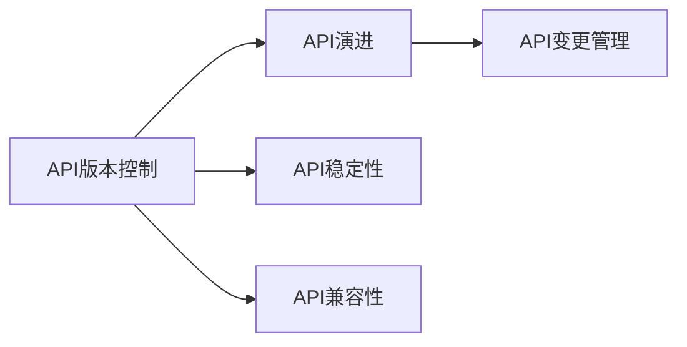

                 

# API 版本控制的详细实施

> 关键词：API版本控制,版本控制,版本管理,API演变,API稳定性,API变更

## 1. 背景介绍

在软件开发中，API（应用程序接口）扮演着至关重要的角色，它是系统间通信和协作的基础。随着项目的持续发展和迭代，API也需要不断地进化和升级，以满足新的需求和挑战。然而，API的版本管理却常常成为开发者和项目经理的痛点。版本更新往往伴随着代码混乱、兼容性问题、用户迁移难题等挑战。有效的API版本控制对于确保API的稳定性和兼容性、提升用户体验具有重要意义。本文将详细介绍API版本控制的原理、实现步骤、应用场景及未来发展趋势，为开发者和项目经理提供全面的指导。

## 2. 核心概念与联系

### 2.1 核心概念概述

API版本控制是指通过规范化的手段，在API的生命周期内对其进行有效管理，确保其稳定性和兼容性。核心概念包括：

- **API版本控制**：对API的变更进行管理，通过制定API的变更规范、版本策略，确保API的稳定和向后兼容。
- **API演进**：随着业务需求的变化，API的功能、接口、参数等会不断演变，需要对其进行合理的演进管理。
- **API稳定性**：保持API的兼容性，避免引入不兼容的变更，确保现有用户的API调用不受影响。
- **API兼容性**：在API演进过程中，新旧版本API应具备一定程度的兼容性，允许用户在一定时间内进行平滑过渡。
- **API变更管理**：通过明确变更流程、制定变更文档、实施变更测试等手段，控制API变更的风险和影响。

这些概念间的关系可以通过以下Mermaid流程图来展示：



## 3. 核心算法原理 & 具体操作步骤

### 3.1 算法原理概述

API版本控制的核心算法原理是基于RESTful架构和语义版本的理念，通过API版本号的演变控制API的兼容性和稳定性。其基本思想是将API的每个版本号（或时间戳）与具体的API定义绑定，新版本的API定义应当能够与旧版本兼容，并支持旧版本的使用。

API版本控制的实现通常遵循以下步骤：

1. **定义API版本规范**：确定API版本号的命名规则、演进策略和变更规则。
2. **实施API版本控制**：在API的每一个版本号上记录详细的API定义和变更日志。
3. **管理API兼容性**：确保新旧版本API的兼容性，允许用户平滑过渡。
4. **监控API变更**：实时监控API变更，确保变更符合预定的策略和规范。

### 3.2 算法步骤详解

#### 3.2.1 定义API版本规范

API版本规范应包括以下内容：

- **版本号命名规则**：如v1.0、v2.0等，一般采用语义版本号（Semantic Versioning，简称SemVer）标准。
- **API变更策略**：如采用增量式变更、前后兼容式变更等。
- **API兼容性和兼容性策略**：如向后兼容、向前兼容、混合兼容等。
- **API变更文档格式**：如变化日志、变更说明、测试用例等。

#### 3.2.2 实施API版本控制

具体实现步骤包括：

1. **记录API定义**：在API的每个版本上记录详细的API定义，包括请求和响应的结构、参数、数据格式等。
2. **记录变更日志**：每次API变更时，记录变更日志，包括变更日期、变更内容、影响范围等。
3. **版本控制工具选择**：选择合适的版本控制工具，如Git、SVN等，管理API版本和变更记录。
4. **版本号管理**：使用版本控制工具管理API的版本号，确保每个版本号对应唯一的API定义。

#### 3.2.3 管理API兼容性

API兼容性管理主要包括以下几个方面：

1. **版本兼容性测试**：对新旧版本API进行兼容性测试，确保新API能够与旧API兼容。
2. **用户平滑过渡策略**：为现有用户提供逐步迁移的策略，如提供并行访问新旧API，逐步降级旧API等。
3. **API文档更新**：及时更新API文档，包含新旧API的变更说明和兼容性信息。

#### 3.2.4 监控API变更

API变更监控主要通过以下手段实现：

1. **变更通知机制**：建立API变更通知机制，如邮件、短信、系统告警等，及时通知相关人员。
2. **变更影响分析**：使用工具进行API变更的影响分析，评估变更对系统的影响和风险。
3. **变更日志审计**：对API变更日志进行审计，确保变更符合预定的策略和规范。

### 3.3 算法优缺点

API版本控制的优点包括：

- **确保稳定性**：通过规范化的版本控制，保持API的向后兼容性，避免不兼容的变更影响现有用户。
- **促进演进**：通过明确的API变更策略和兼容性管理，促进API的合理演进，满足新的业务需求。
- **降低风险**：通过严格的变更控制和监控，降低API变更的风险和影响。

其缺点包括：

- **复杂性**：API版本控制增加了系统的复杂性，需要额外的管理和维护成本。
- **学习成本**：对开发者和项目经理来说，掌握API版本控制的概念和实践需要一定的学习成本。
- **版本混乱**：若管理不当，API版本号的混乱可能导致系统维护困难。

### 3.4 算法应用领域

API版本控制在以下领域有广泛应用：

- **Web应用**：如电商平台、社交网络、在线教育等，需要管理API变更，确保用户平滑过渡。
- **移动应用**：如手机App、微信公众号等，API的演进和兼容性管理直接影响用户体验。
- **IoT设备**：如智能家居、工业物联网等，API版本控制有助于设备间的互操作性管理。
- **企业内部系统**：如企业资源规划（ERP）、客户关系管理（CRM）等，确保系统间的协作和数据一致性。

## 4. 数学模型和公式 & 详细讲解 & 举例说明

### 4.1 数学模型构建

API版本控制的核心数学模型为语义版本模型（Semantic Version Model），用于描述API版本号的组成和变化规则。语义版本模型由三个部分组成：主要版本号、次要版本号和补丁号。

假设API版本号为$V_n=v_{major}\cdot10^6+v_{minor}\cdot10^3+v_{patch}$，其中$v_{major}$、$v_{minor}$和$v_{patch}$分别表示主要版本号、次要版本号和补丁号。API变更可以表示为：

$$
V_{n+1}=V_n+f(\Delta v_{major},\Delta v_{minor},\Delta v_{patch})
$$

其中$f(\Delta v_{major},\Delta v_{minor},\Delta v_{patch})$表示API的变更函数，根据API变更策略和兼容性要求，定义变更的具体方式。

### 4.2 公式推导过程

以下以向前兼容的API演进策略为例，推导API变更的计算公式。

假设当前API版本为$V_n=v_{major}\cdot10^6+v_{minor}\cdot10^3+v_{patch}$，新版本的API变更包含主要版本号和次要版本号的增加，而补丁号保持不变。则新版本API的计算公式为：

$$
V_{n+1}=(v_{major}+1)\cdot10^6+v_{minor}\cdot10^3+v_{patch}
$$

对于向后兼容的API演进策略，新版本的API在原有基础上增加新功能，但不修改已有功能，则新版本API的计算公式为：

$$
V_{n+1}=v_{major}\cdot10^6+(v_{minor}+1)\cdot10^3+v_{patch}
$$

### 4.3 案例分析与讲解

以一个简单的API变更案例来说明API版本控制的实施过程：

假设一个Web应用的API版本号为v1.0，包含以下请求和响应：

- **请求**：GET /user?name=John
- **响应**：返回用户John的信息

经过评估，决定将API升级到v2.0，新增以下功能：

- **请求**：POST /user?name=John&age=30
- **响应**：返回用户John的详细信息

实施API版本控制的步骤如下：

1. **记录API定义**：在v1.0和v2.0上记录详细的API定义，包括请求和响应的结构、参数、数据格式等。
2. **记录变更日志**：记录从v1.0升级到v2.0的具体变更内容，包括新增功能、兼容性策略等。
3. **版本控制工具管理**：使用Git等版本控制工具管理API版本和变更记录。
4. **用户平滑过渡策略**：为现有用户提供逐步迁移的策略，如提供并行访问v1.0和v2.0，逐步降级v1.0。
5. **API文档更新**：及时更新API文档，包含v1.0和v2.0的变更说明和兼容性信息。

通过以上步骤，确保API的稳定性和兼容性，为用户提供良好的体验。

## 5. 项目实践：代码实例和详细解释说明

### 5.1 开发环境搭建

API版本控制的开发环境搭建相对简单，主要需要以下工具：

- **版本控制工具**：如Git、SVN等，用于管理API版本和变更记录。
- **API文档生成工具**：如Swagger、API Blueprint等，用于生成API文档。
- **变更测试工具**：如Postman、Rest-Assured等，用于测试API变更的兼容性。

### 5.2 源代码详细实现

以一个使用Git进行API版本控制的示例来说明具体的实现步骤：

1. **初始化Git仓库**：

   ```bash
   git init
   git remote add origin https://github.com/example/api.git
   ```

2. **创建API版本目录**：

   ```bash
   git checkout -b v1.0
   ```

3. **记录API定义和变更日志**：

   在`v1.0`目录下记录API的初始定义和变更日志，使用`README.md`文件记录API的接口、参数、数据格式等。

   ```markdown
   # API v1.0
   ```

4. **实施API版本控制**：

   在`v1.0`目录下使用Git管理API版本和变更记录。

   ```bash
   git add .
   git commit -m "Initial API definition for v1.0"
   ```

5. **创建新API版本**：

   创建新的API版本目录，并记录新版本的API定义和变更日志。

   ```bash
   git checkout -b v2.0
   ```

6. **记录新API定义和变更日志**：

   在`v2.0`目录下记录新版本的API定义和变更日志。

   ```markdown
   # API v2.0
   ```

7. **实施API版本控制**：

   使用Git管理新版本的API版本和变更记录。

   ```bash
   git add .
   git commit -m "New API definition for v2.0"
   ```

### 5.3 代码解读与分析

API版本控制的实现主要依赖于版本控制工具和API文档生成工具，通过Git等版本控制工具管理API的版本和变更记录，使用API Blueprint等工具生成API文档。在每次API变更时，记录变更日志，并使用测试工具进行兼容性测试，确保新旧API的兼容性。

### 5.4 运行结果展示

通过Git进行API版本控制的示例运行结果如下：

```
$ git log
commit 0f9b91b0b1b6ddc6837ebc8a5e8aa9f51d8e5aa6
Author: John Doe <john.doe@example.com>
Date:   Fri Sep 10 14:43:08 2021 -0700

    New API definition for v2.0

commit 32e4e7d7ceef5acf2e3407d516ac3e16b87ad7a7
Author: John Doe <john.doe@example.com>
Date:   Thu Sep 9 15:10:03 2021 -0700

    Initial API definition for v1.0
```

可以看到，通过Git管理API版本和变更记录，记录了每个版本的API定义和变更日志，确保API的稳定性和兼容性。

## 6. 实际应用场景

### 6.1 Web应用

在Web应用中，API版本控制尤为重要。例如，电商平台需要管理API变更，确保用户平滑过渡。通过API版本控制，可以为现有用户提供逐步迁移的策略，如提供并行访问新旧API，逐步降级旧API，确保用户的良好体验。

### 6.2 移动应用

移动应用中的API版本控制同样重要。例如，手机App的API版本控制需要考虑跨平台兼容性和用户迁移策略。通过API版本控制，可以确保新旧API的兼容性，为移动应用用户提供一致的用户体验。

### 6.3 IoT设备

IoT设备中的API版本控制有助于设备间的互操作性管理。例如，智能家居设备之间的API版本控制需要确保不同设备间的通信协议和数据格式的一致性。通过API版本控制，可以管理设备间的API变更，确保设备间的互操作性。

### 6.4 企业内部系统

企业内部系统中的API版本控制有助于系统间的协作和数据一致性。例如，ERP和CRM系统之间的API版本控制需要确保不同系统间的API兼容性和数据一致性。通过API版本控制，可以管理系统间的API变更，确保系统的协作和数据一致性。

## 7. 工具和资源推荐

### 7.1 学习资源推荐

为帮助开发者和项目经理掌握API版本控制的知识，以下是一些优质的学习资源：

1. **《API设计规范》**：介绍API设计的基本规范和最佳实践，涵盖API版本控制的内容。
2. **《RESTful API设计指南》**：详细讲解RESTful架构的原理和实现，包含API版本控制的实现方法。
3. **《API版本控制实践》**：提供API版本控制的实际案例和最佳实践，帮助开发者掌握API版本控制的技巧。
4. **Git官方文档**：Git的官方文档，详细讲解Git的使用方法和最佳实践，是进行API版本控制的基础。

### 7.2 开发工具推荐

以下是一些常用的API版本控制开发工具：

1. **Git**：开源的版本控制工具，支持分布式版本控制，是进行API版本控制的主流工具。
2. **SVN**：Subversion版本控制工具，支持集中式版本控制，适用于一些简单的API版本控制需求。
3. **API Blueprint**：基于Markdown的API文档生成工具，支持API版本控制，生成详细的API文档。
4. **Postman**：API测试工具，支持API版本控制和兼容性测试，方便开发者进行API变更测试。

### 7.3 相关论文推荐

API版本控制的研究涉及到版本控制理论、API设计理论等多个领域，以下是一些相关论文推荐：

1. **《语义版本模型》**：介绍语义版本号的定义和计算方法，为API版本控制提供理论基础。
2. **《API版本管理实践》**：提供API版本管理的实际案例和最佳实践，帮助开发者掌握API版本控制的技巧。
3. **《API变更管理和兼容性策略》**：探讨API变更管理和兼容性策略，为API版本控制提供理论指导。

## 8. 总结：未来发展趋势与挑战

### 8.1 研究成果总结

API版本控制是API生命周期管理的重要组成部分，通过规范化的版本控制和兼容性管理，确保API的稳定性和向后兼容性，促进API的合理演进，满足新的业务需求。API版本控制的实现依赖于语义版本模型和版本控制工具，通过记录API定义和变更日志，管理API版本和变更记录，确保API的稳定性和兼容性。

### 8.2 未来发展趋势

API版本控制技术将朝着以下方向发展：

1. **自动化**：API版本控制的自动化工具将不断涌现，如自动生成API变更日志、自动测试API兼容性等，减少人工干预，提升效率。
2. **智能化**：API版本控制将引入AI技术，如智能推荐API变更策略、智能监控API变更风险等，提高API版本控制的智能化水平。
3. **平台化**：API版本控制将逐渐成为云平台和DevOps平台的标准功能，与CI/CD流程无缝集成，提升API版本控制的便利性。
4. **生态化**：API版本控制将与API设计、API测试、API文档等多个生态系统紧密结合，形成完整的API生命周期管理解决方案。

### 8.3 面临的挑战

API版本控制技术在应用过程中面临以下挑战：

1. **复杂性**：API版本控制的实现增加了系统的复杂性，需要额外的管理和维护成本。
2. **学习成本**：对开发者和项目经理来说，掌握API版本控制的概念和实践需要一定的学习成本。
3. **版本混乱**：若管理不当，API版本号的混乱可能导致系统维护困难。
4. **兼容性管理**：新旧API的兼容性管理是一个复杂的过程，需要谨慎处理，避免引入不兼容的变更。

### 8.4 研究展望

API版本控制的未来研究应关注以下方向：

1. **自动化工具**：开发API版本控制的自动化工具，提升API变更的效率和准确性。
2. **智能监控**：引入AI技术，提升API变更的监控和风险评估能力，确保API的稳定性和向后兼容性。
3. **生态系统整合**：将API版本控制与API设计、API测试、API文档等生态系统紧密结合，形成完整的API生命周期管理解决方案。
4. **用户友好性**：提高API版本控制的易用性和用户友好性，降低开发者的学习成本和使用门槛。

## 9. 附录：常见问题与解答

**Q1：API版本控制对API的稳定性有什么影响？**

A: API版本控制通过记录API定义和变更日志，确保API的稳定性和向后兼容性，避免引入不兼容的变更，确保现有用户的API调用不受影响。

**Q2：API版本控制的主要应用场景有哪些？**

A: API版本控制主要应用于Web应用、移动应用、IoT设备、企业内部系统等多个领域，确保API的稳定性和兼容性，促进API的合理演进，满足新的业务需求。

**Q3：如何进行API兼容性测试？**

A: 使用Postman、Rest-Assured等API测试工具，对新旧API进行兼容性测试，确保新API能够与旧API兼容，允许用户平滑过渡。

**Q4：API版本控制有哪些优缺点？**

A: API版本控制的优点包括确保API稳定性、促进API演进、降低变更风险等。缺点包括增加系统复杂性、学习成本高、版本管理混乱等。

**Q5：API版本控制的核心算法是什么？**

A: API版本控制的核心算法是语义版本模型，用于描述API版本号的组成和变化规则，通过API版本号的演变控制API的兼容性和稳定性。

总之，API版本控制技术是API生命周期管理的重要组成部分，通过规范化的版本控制和兼容性管理，确保API的稳定性和向后兼容性，促进API的合理演进，满足新的业务需求。随着API版本控制技术的不断发展，API管理将更加智能化、自动化、平台化，为开发者和项目经理提供更好的支持。

