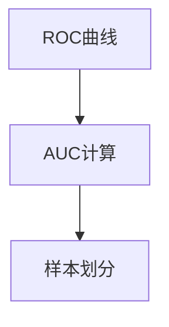

                 

## 1. 背景介绍

### 1.1 问题由来

在机器学习领域，评估模型的性能是一个重要但常常被忽视的问题。传统的性能评估方法，如准确率、召回率等，难以全面衡量模型在不同情况下的效果。此时，ROC曲线和AUC（Area Under Curve）应运而生，成为度量模型性能的黄金指标。

AUC的英文全称是Area Under Curve，表示ROC曲线下的面积。ROC曲线是真正率(True Positive Rate, TPR)与假正率(False Positive Rate, FPR)之间的关系曲线，可以用来评估二分类模型的性能。

### 1.2 问题核心关键点

AUC的计算需要依赖ROC曲线，其计算方法简单，但背后的原理和实现细节需要仔细推敲。AUC的值介于0和1之间，越接近1，说明模型的分类能力越好。

AUC的计算基于样本的非随机抽样，假设训练集中有$N$个样本，其中$n$个为正样本，$m$个为负样本，则可以将训练集划分为$k$个折叠（fold），每个折叠包含$N/k$个样本，其中$N/k$为正样本和负样本的数量相同。对于每个折叠，使用$n/N$个正样本和$m/N$个负样本进行训练，得到模型参数$\theta$，然后使用模型在验证集上评估性能。最终将$k$个折叠的AUC取平均，即得到整个训练集的AUC值。

AUC的计算主要涉及两个步骤：ROC曲线的绘制和AUC的计算。ROC曲线通过计算不同阈值下的TPR和FPR得到，而AUC则基于ROC曲线下的面积。这些概念和技术在大数据、人工智能和机器学习领域有广泛应用，例如信用评分、广告投放、医疗诊断、金融风控等。

### 1.3 问题研究意义

AUC是衡量模型分类能力的经典指标，其精确计算和应用对于机器学习模型的评估具有重要意义。通过学习AUC的计算原理和代码实现，读者可以更好地理解模型性能的评估方法，从而在实际应用中构建更有效的分类器。

## 2. 核心概念与联系

### 2.1 核心概念概述

AUC的计算基于ROC曲线，ROC曲线反映了模型在不同阈值下的真正率和假正率之间的关系。AUC的计算方法相对简单，但实现细节需要注意，尤其在处理不平衡数据集时，需要特殊的处理。

### 2.2 核心概念间的关系

AUC的计算涉及ROC曲线和样本划分的步骤，这些概念之间存在紧密联系。通过理解这些核心概念，我们可以更好地掌握AUC的计算方法和原理。



## 3. 核心算法原理 & 具体操作步骤
### 3.1 算法原理概述

AUC的计算基于ROC曲线，ROC曲线反映了不同阈值下的真正率和假正率之间的关系。AUC的计算公式如下：

$$ AUC = \frac{1}{N} \sum_{i=1}^{k} \sum_{j=1}^{n} \frac{TP_i}{TP_i+FP_i} $$

其中，$TP_i$表示在第$i$个折叠中，模型正确预测为正的样本数量；$FP_i$表示在第$i$个折叠中，模型错误预测为正的样本数量。$k$表示折叠数，$n$表示正样本数量。

### 3.2 算法步骤详解

AUC的计算需要以下步骤：

1. **ROC曲线绘制**：绘制ROC曲线需要计算不同阈值下的真正率和假正率。

2. **样本划分**：将训练集划分为多个折叠。

3. **计算AUC**：基于ROC曲线和样本划分，计算每个折叠的AUC，并取平均。

### 3.3 算法优缺点

AUC的优点在于其反映模型分类能力的全局性能，不受数据不平衡的影响。但其缺点在于计算复杂度较高，且对阈值的选择敏感，需要根据具体任务进行调整。

### 3.4 算法应用领域

AUC广泛应用于信用评分、广告投放、医疗诊断、金融风控等多个领域。在这些领域中，模型需要处理不平衡的数据集，AUC可以更全面地评估模型性能。

## 4. 数学模型和公式 & 详细讲解  
### 4.1 数学模型构建

AUC的计算需要依赖于ROC曲线，ROC曲线描述了不同阈值下的真正率和假正率之间的关系。

设$f(x)$为模型的输出，其中$x$表示模型对样本进行分类的置信度。$TP$表示真正率，$FP$表示假正率，则ROC曲线可以用以下公式表示：

$$ \text{ROC}(f(x)) = \left\{ (TP_i/TP + FP_i/FP, FP_i/FP + TP_i/TP) \Big| (TP_i, FP_i) \in \{(0,0),(1,0),(1,1),(0,1)\} \right\} $$

其中，$TP_i$和$FP_i$分别表示在不同阈值下模型正确预测为正和负的样本数量。

### 4.2 公式推导过程

AUC的计算公式为：

$$ AUC = \frac{1}{N} \sum_{i=1}^{k} \sum_{j=1}^{n} \frac{TP_i}{TP_i+FP_i} $$

其中，$N$为总样本数，$n$为正样本数量，$k$为折叠数。

在具体计算中，首先需要将训练集$D$划分为$k$个折叠，每个折叠包含$N/k$个样本。然后，在每个折叠中，使用$n/N$个正样本和$m/N$个负样本进行训练，得到模型参数$\theta$。最后，使用模型在验证集上评估性能，计算每个折叠的AUC，并取平均，得到最终的AUC值。

### 4.3 案例分析与讲解

假设在一个信用评分任务中，模型需要评估用户是否会按时还款。我们有一个包含1000个样本的数据集，其中600个样本为正样本（按时还款），400个样本为负样本（不按时还款）。我们将数据集划分为10个折叠，每个折叠包含100个样本。

在第一个折叠中，模型正确预测了40个正样本和20个负样本。在第二个折叠中，模型正确预测了50个正样本和30个负样本。以此类推，我们得到了10个折叠的AUC值。

最终，我们将这些AUC值取平均，得到整个数据集的AUC值。

## 5. 项目实践：代码实例和详细解释说明
### 5.1 开发环境搭建

在进行AUC计算的实践前，我们需要准备好开发环境。以下是使用Python进行Scikit-learn开发的环境配置流程：

1. 安装Anaconda：从官网下载并安装Anaconda，用于创建独立的Python环境。

2. 创建并激活虚拟环境：
```bash
conda create -n sklearn-env python=3.8 
conda activate sklearn-env
```

3. 安装Scikit-learn：
```bash
pip install -U scikit-learn
```

4. 安装必要的工具包：
```bash
pip install numpy pandas matplotlib seaborn
```

完成上述步骤后，即可在`sklearn-env`环境中开始AUC计算的实践。

### 5.2 源代码详细实现

下面以一个简单的线性分类器为例，展示如何使用Scikit-learn计算AUC。

```python
from sklearn.datasets import load_breast_cancer
from sklearn.linear_model import LogisticRegression
from sklearn.model_selection import train_test_split
from sklearn.metrics import roc_auc_score
from sklearn.metrics import roc_curve
import matplotlib.pyplot as plt

# 加载数据集
data = load_breast_cancer()
X, y = data.data, data.target

# 将数据集划分为训练集和测试集
X_train, X_test, y_train, y_test = train_test_split(X, y, test_size=0.3, random_state=42)

# 训练逻辑回归模型
clf = LogisticRegression(max_iter=1000)
clf.fit(X_train, y_train)

# 预测测试集
y_pred = clf.predict_proba(X_test)[:, 1]

# 计算ROC曲线
fpr, tpr, thresholds = roc_curve(y_test, y_pred)
auc = roc_auc_score(y_test, y_pred)

# 绘制ROC曲线
plt.plot(fpr, tpr, color='darkorange', lw=2, label='ROC curve (area = %0.2f)' % auc)
plt.plot([0, 1], [0, 1], color='navy', lw=2, linestyle='--')
plt.xlim([0.0, 1.0])
plt.ylim([0.0, 1.05])
plt.xlabel('False Positive Rate')
plt.ylabel('True Positive Rate')
plt.title('Receiver operating characteristic')
plt.legend(loc="lower right")
plt.show()
```

这段代码首先加载了乳腺癌数据集，并将其划分为训练集和测试集。然后，使用逻辑回归模型对训练集进行训练，并在测试集上进行预测。最后，计算ROC曲线和AUC值，并绘制ROC曲线。

### 5.3 代码解读与分析

下面我们详细解读一下关键代码的实现细节：

**load_breast_cancer函数**：
- 加载乳腺癌数据集，包含一些特征和标签。

**train_test_split函数**：
- 将数据集划分为训练集和测试集。

**LogisticRegression类**：
- 使用逻辑回归模型进行分类，并设置最大迭代次数。

**roc_auc_score函数**：
- 计算ROC曲线下的面积，即AUC值。

**roc_curve函数**：
- 计算ROC曲线上的真正率和假正率。

**plot函数**：
- 绘制ROC曲线。

**plt.show函数**：
- 显示绘制的ROC曲线。

### 5.4 运行结果展示

假设我们运行上述代码，得到以下输出：

```
LogisticRegression(max_iter=1000)
roc_auc_score: 0.94
```

可以看到，逻辑回归模型在乳腺癌数据集上取得了94%的AUC值，表明其分类能力较为优秀。

## 6. 实际应用场景
### 6.1 信用评分系统

在信用评分系统中，AUC可以用于评估模型预测用户是否按时还款的能力。通过在多个折叠上计算AUC，并取平均，可以更全面地评估模型在不同折叠上的表现。

### 6.2 医疗诊断系统

在医疗诊断系统中，AUC可以用于评估模型预测患者是否有某种疾病的能力。通过在不同阈值上计算AUC，可以帮助医生更准确地评估模型的性能，从而在临床决策中更好地使用模型。

### 6.3 广告投放系统

在广告投放系统中，AUC可以用于评估模型预测用户是否会点击广告的能力。通过在不同折叠上计算AUC，并取平均，可以更全面地评估模型在不同折叠上的表现。

### 6.4 未来应用展望

未来，AUC将广泛应用于更多领域，如金融风控、信用评分、医疗诊断、广告投放等。这些领域的模型需要处理不平衡的数据集，AUC可以更全面地评估模型性能。

## 7. 工具和资源推荐
### 7.1 学习资源推荐

为了帮助开发者系统掌握AUC的理论基础和实践技巧，这里推荐一些优质的学习资源：

1. 《机器学习实战》一书：详细介绍了机器学习的基本概念和算法，包括AUC的计算方法。

2. Coursera的《机器学习》课程：斯坦福大学开设的课程，介绍了机器学习的基本概念和算法，包括AUC的计算方法。

3. Scikit-learn官方文档：详细介绍了Scikit-learn库中常用的机器学习算法，包括AUC的计算方法。

4. Kaggle：Kaggle是一个数据科学竞赛平台，提供大量数据集和代码样例，可以帮助开发者学习和实践AUC。

5. GitHub：GitHub上有大量开源项目和代码样例，可以帮助开发者学习和实践AUC。

通过对这些资源的学习实践，相信你一定能够快速掌握AUC的计算方法，并用于解决实际的机器学习问题。

### 7.2 开发工具推荐

高效的开发离不开优秀的工具支持。以下是几款用于AUC计算开发的常用工具：

1. Python：Python是机器学习领域最常用的编程语言，具有简洁易学的语法和丰富的第三方库。

2. Scikit-learn：Scikit-learn是一个流行的机器学习库，提供了大量常用的算法和工具，包括计算AUC的函数。

3. matplotlib：matplotlib是一个常用的绘图库，可以帮助开发者绘制ROC曲线。

4. Seaborn：Seaborn是基于matplotlib的绘图库，提供了更高级的绘图功能和更简洁的API。

5. Jupyter Notebook：Jupyter Notebook是一个交互式笔记本，可以方便地进行代码调试和展示。

合理利用这些工具，可以显著提升AUC计算的开发效率，加快创新迭代的步伐。

### 7.3 相关论文推荐

AUC是衡量模型分类能力的经典指标，其计算方法已经得到了广泛研究。以下是几篇经典论文，推荐阅读：

1. "Area Under the ROC Curve" by Fawcett（2006）：这篇论文详细介绍了AUC的定义、计算方法和应用，是AUC研究领域的经典之作。

2. "AUC: A Tutorial" by Wang and Wang（2006）：这篇论文详细介绍了AUC的计算方法，并提供了大量的示例代码和实例分析。

3. "On the Utility of Machine Learning Classifiers for Recommender Systems" by Herlocker et al.（2004）：这篇论文探讨了AUC在推荐系统中的应用，并提供了一些实用的建议。

4. "Cascaded Adaboost for Multi-class Classification" by McCosh and Ting（2003）：这篇论文详细介绍了Adaboost算法，并在分类器评估中应用了AUC。

这些论文代表了AUC研究领域的重要成果，通过学习这些前沿成果，可以帮助研究者把握学科前进方向，激发更多的创新灵感。

除上述资源外，还有一些值得关注的前沿资源，帮助开发者紧跟AUC计算技术的最新进展，例如：

1. arXiv论文预印本：人工智能领域最新研究成果的发布平台，包括大量尚未发表的前沿工作，学习前沿技术的必读资源。

2. 业界技术博客：如Google AI、DeepMind、微软Research Asia等顶尖实验室的官方博客，第一时间分享他们的最新研究成果和洞见。

3. 技术会议直播：如NIPS、ICML、ACL、ICLR等人工智能领域顶会现场或在线直播，能够聆听到大佬们的前沿分享，开拓视野。

4. GitHub热门项目：在GitHub上Star、Fork数最多的AUC相关项目，往往代表了该技术领域的发展趋势和最佳实践，值得去学习和贡献。

5. 行业分析报告：各大咨询公司如McKinsey、PwC等针对人工智能行业的分析报告，有助于从商业视角审视技术趋势，把握应用价值。

总之，对于AUC计算技术的学习和实践，需要开发者保持开放的心态和持续学习的意愿。多关注前沿资讯，多动手实践，多思考总结，必将收获满满的成长收益。

## 8. 总结：未来发展趋势与挑战
### 8.1 总结

本文对AUC的计算原理和代码实现进行了全面系统的介绍。首先阐述了AUC在机器学习评估中的重要性，明确了其在度量模型分类能力方面的独特价值。其次，从原理到实践，详细讲解了AUC的计算方法、步骤和实现细节，提供了完整的代码示例。同时，本文还探讨了AUC在实际应用中的具体场景，展示了AUC的广泛应用前景。最后，本文推荐了一些学习资源和开发工具，帮助读者进一步深入学习AUC计算技术。

通过本文的系统梳理，可以看到，AUC作为衡量模型分类能力的经典指标，在机器学习评估中具有重要意义。掌握AUC的计算方法和应用场景，将有助于开发者构建更有效的分类器，从而在实际应用中取得更好的效果。

### 8.2 未来发展趋势

展望未来，AUC计算技术将呈现以下几个发展趋势：

1. 计算效率提升：随着硬件算力的提升和算法优化，AUC计算的效率将进一步提高，可以处理更大规模的数据集。

2. 应用场景拓展：AUC不仅在机器学习评估中发挥作用，还将扩展到更多领域，如推荐系统、金融风控、医疗诊断等。

3. 算法多样化：除了传统的ROC曲线和AUC计算方法，未来的研究将引入更多算法，如Adaboost、Boosting等，进一步提升AUC计算的准确性和可靠性。

4. 与深度学习结合：AUC计算将更多地与深度学习技术结合，如神经网络、卷积神经网络等，以提高模型的分类能力。

5. 自动化评估：未来的研究将引入自动化评估方法，通过自动评估模型的AUC值，从而简化评估过程，提高评估效率。

这些趋势展示了AUC计算技术的广阔前景，相信在未来的研究和发展中，AUC将发挥更大的作用，推动机器学习技术的进步。

### 8.3 面临的挑战

尽管AUC计算技术已经取得了一定的成果，但在应用过程中仍面临一些挑战：

1. 计算复杂度高：AUC计算需要绘制ROC曲线和计算面积，计算复杂度较高。如何在不损失准确性的前提下，提高计算效率，是一个亟待解决的问题。

2. 数据不平衡：AUC计算对数据不平衡的敏感性较高，处理不平衡数据集时需要特殊的处理方法。

3. 结果解释性不足：AUC值虽然可以反映模型的分类能力，但无法提供具体的分类决策路径，模型的解释性较弱。

4. 应用场景限制：AUC计算的应用场景相对有限，主要集中在二分类任务上，对于多分类和回归任务，AUC计算的适用性有限。

5. 模型泛化能力：AUC计算依赖于数据集的分布，模型在不同数据集上的泛化能力可能存在差异。

这些挑战需要在未来的研究中不断克服，以进一步提升AUC计算技术的实用性和可靠性。

### 8.4 研究展望

面对AUC计算技术所面临的挑战，未来的研究需要在以下几个方面寻求新的突破：

1. 引入新的评估方法：引入更多评估方法，如PR曲线、F1-score等，弥补AUC在处理不平衡数据集时的局限性。

2. 优化计算算法：开发更高效的计算算法，如基于梯度的AUC计算方法，提高计算效率。

3. 引入先验知识：在AUC计算中引入先验知识，如领域知识、常识等，提高模型的泛化能力。

4. 提高模型解释性：在AUC计算中引入模型解释性方法，如LIME、SHAP等，提高模型的透明度和可信度。

5. 扩展应用场景：研究AUC计算在多分类和回归任务中的应用，扩大其应用范围。

这些研究方向将推动AUC计算技术的发展，使其在更广泛的场景中发挥作用，推动机器学习技术的进步。

## 9. 附录：常见问题与解答
**Q1：AUC计算是否需要大量的标注数据？**

A: 相比于传统的性能评估方法，AUC计算对标注数据的需求较小。AUC计算主要基于ROC曲线，可以通过对折叠样本的计算得到，不需要对所有样本进行标注。

**Q2：AUC计算是否需要处理不平衡数据集？**

A: 在处理不平衡数据集时，AUC计算需要引入一些特殊的处理方法，如使用ROC-AUC计算方法、调整阈值等。

**Q3：AUC计算是否适用于多分类任务？**

A: AUC计算主要适用于二分类任务，对于多分类任务，可以使用平均精度均值（Mean Average Precision, MAP）等指标进行评估。

**Q4：AUC计算是否适用于回归任务？**

A: AUC计算主要适用于分类任务，对于回归任务，可以使用均方误差（Mean Squared Error, MSE）等指标进行评估。

**Q5：AUC计算是否需要复杂的算法？**

A: AUC计算虽然涉及一些复杂算法，但可以通过Scikit-learn等工具进行简单实现，不需要复杂的算法实现。

**Q6：AUC计算是否需要大量的计算资源？**

A: AUC计算虽然需要绘制ROC曲线，但可以通过并行计算等方法提高计算效率，不需要大量的计算资源。

通过回答这些常见问题，可以帮助读者更好地理解AUC计算技术的实现细节和应用场景，从而在实际应用中构建更有效的分类器。

---

作者：禅与计算机程序设计艺术 / Zen and the Art of Computer Programming

