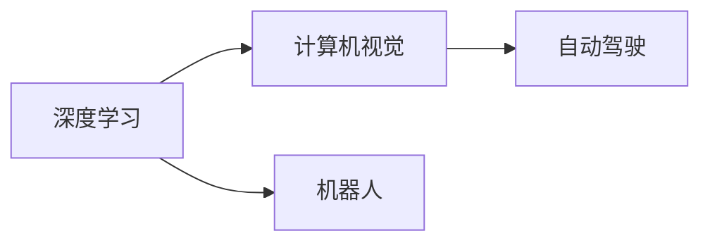

                 

# Andrej Karpathy：人工智能的未来发展前景

> 关键词：人工智能, 深度学习, 机器学习, 计算机视觉, 自动驾驶, 机器人

## 1. 背景介绍

### 1.1 问题由来
在过去的几十年中，人工智能（AI）领域经历了巨大的变革，其中深度学习（Deep Learning）和机器学习（Machine Learning）技术的发展起到了关键作用。这些技术在图像识别、自然语言处理、语音识别等领域取得了显著的成果。而Andrej Karpathy作为AI领域的前沿研究者，他的见解对于理解AI未来的发展方向有着重要的指导意义。

### 1.2 问题核心关键点
Karpathy在深度学习、计算机视觉和自动驾驶等领域的贡献，让我们更加关注AI技术的发展前景。他的研究成果不仅提高了机器视觉的性能，也在自动驾驶、机器人等领域展示了AI技术的潜力和挑战。Karpathy的视角为理解AI未来的应用场景和挑战提供了宝贵的洞见。

### 1.3 问题研究意义
通过Karpathy的视角，我们可以更好地理解AI技术在各个领域的潜力和未来发展方向。他的研究成果不仅能推动相关领域的科技进步，还能为未来的研究提供新的方向和方法，对AI技术的落地应用具有重要的参考价值。

## 2. 核心概念与联系

### 2.1 核心概念概述

- **深度学习**：一种模仿人脑神经网络结构的机器学习技术，通过多层非线性变换来学习数据中的复杂模式。
- **计算机视觉**：使计算机“看懂”图像和视频，通过图像识别、物体检测、语义分割等技术，实现对视觉信息的理解和处理。
- **自动驾驶**：使汽车能够自动驾驶，通过感知、决策和控制技术，实现安全、高效的自动驾驶。
- **机器人**：通过模拟人类的感知、决策和动作，实现对环境的智能交互和任务执行。

### 2.2 概念间的关系

Karpathy的研究工作跨越了深度学习、计算机视觉和自动驾驶等多个领域，这些领域之间的联系和相互影响是理解他工作成果的重要线索。

- **深度学习与计算机视觉**：深度学习为计算机视觉任务提供了强大的算法基础，使得计算机能够理解并处理图像和视频数据。
- **自动驾驶**：自动驾驶技术依赖于计算机视觉和深度学习算法，能够感知环境、做出决策和执行动作。
- **机器人**：机器人技术同样依赖深度学习算法，能够感知环境、做出决策和执行动作，实现与环境的交互。

通过这些联系，我们可以更好地理解Karpathy的研究工作如何推动了AI技术的发展。

### 2.3 核心概念的整体架构

以下是Karpathy研究工作的整体架构：



这个架构展示了深度学习、计算机视觉和自动驾驶、机器人技术之间的联系和相互作用，体现了Karpathy研究工作在AI技术中的应用和推动作用。

## 3. 核心算法原理 & 具体操作步骤
### 3.1 算法原理概述

Karpathy的研究工作主要集中在计算机视觉和自动驾驶领域。他提出的一些算法和模型，如ResNet、Fast R-CNN、Faster R-CNN等，极大地推动了计算机视觉技术的发展。这些算法通过多层非线性变换，学习图像中的复杂特征，提高了图像识别的精度。

在自动驾驶领域，Karpathy提出了一种基于深度学习的驾驶策略生成方法，通过学习驾驶数据，生成高质量的驾驶策略。该方法包括两个阶段：一是通过深度学习模型提取驾驶环境特征，二是通过生成对抗网络（GAN）生成驾驶策略。该方法提高了自动驾驶系统的安全性和稳定性。

### 3.2 算法步骤详解

在计算机视觉领域，Karpathy的研究主要集中在图像分类、物体检测和语义分割等任务上。以下是这些任务的具体操作步骤：

- **图像分类**：使用卷积神经网络（CNN）对输入图像进行特征提取，然后通过全连接层进行分类。
- **物体检测**：使用R-CNN、Fast R-CNN或Faster R-CNN等方法，先通过候选区域生成（Region Proposal）生成物体候选框，然后对每个候选框进行特征提取和分类。
- **语义分割**：使用全卷积神经网络（FCN）对输入图像进行像素级分类，得到每个像素的标签。

在自动驾驶领域，Karpathy的研究主要集中在驾驶策略生成和模拟环境交互上。以下是这些任务的具体操作步骤：

- **驾驶策略生成**：使用深度学习模型提取驾驶环境特征，然后通过生成对抗网络（GAN）生成高质量的驾驶策略。
- **模拟环境交互**：使用模拟环境对驾驶策略进行训练，评估策略的性能，并在实际环境中验证其效果。

### 3.3 算法优缺点

Karpathy的研究工作在计算机视觉和自动驾驶领域取得了显著的成果，但也存在一些局限性：

- **优点**：
  - 提高了图像识别的精度和自动驾驶的安全性。
  - 推动了深度学习技术的发展，为其他领域的研究提供了有益的借鉴。
- **缺点**：
  - 依赖大规模数据集和高性能计算资源。
  - 需要长时间的数据采集和训练过程，技术落地成本较高。

### 3.4 算法应用领域

Karpathy的研究工作在计算机视觉和自动驾驶领域具有广泛的应用：

- **计算机视觉**：广泛应用于图像识别、物体检测、语义分割等任务，如医学影像分析、视频监控、智能安防等。
- **自动驾驶**：在无人驾驶汽车、智能交通系统、自动驾驶飞机等领域具有广泛的应用前景。
- **机器人**：推动了机器人视觉、语音识别、智能控制等技术的发展，使机器人能够更好地与环境交互。

## 4. 数学模型和公式 & 详细讲解 & 举例说明

### 4.1 数学模型构建

Karpathy的研究工作涉及多个数学模型，其中最重要的是卷积神经网络和生成对抗网络（GAN）。

- **卷积神经网络（CNN）**：
  $$
  f(x) = \sigma(W_1 \sigma(W_0 x + b_0) + b_1)
  $$
  其中，$f(x)$为网络输出，$\sigma$为激活函数，$W_0$和$W_1$为权重矩阵，$b_0$和$b_1$为偏置向量。

- **生成对抗网络（GAN）**：
  $$
  \min_{G} \max_{D} V(D, G) = E_{x\sim p_{data}} [log(D(x))] + E_{z\sim p(z)} [log(1-D(G(z)))]
  $$
  其中，$G$为生成器，$D$为判别器，$V(D, G)$为生成对抗损失函数。

### 4.2 公式推导过程

以下是对卷积神经网络（CNN）和生成对抗网络（GAN）的公式推导：

- **卷积神经网络（CNN）**：
  $$
  f(x) = \sigma(W_1 \sigma(W_0 x + b_0) + b_1)
  $$
  其中，$x$为输入向量，$W_0$和$W_1$为权重矩阵，$b_0$和$b_1$为偏置向量，$\sigma$为激活函数。

- **生成对抗网络（GAN）**：
  $$
  \min_{G} \max_{D} V(D, G) = E_{x\sim p_{data}} [log(D(x))] + E_{z\sim p(z)} [log(1-D(G(z)))]
  $$
  其中，$G$为生成器，$D$为判别器，$V(D, G)$为生成对抗损失函数。

### 4.3 案例分析与讲解

以下是卷积神经网络（CNN）和生成对抗网络（GAN）的案例分析：

- **卷积神经网络（CNN）**：
  - 在医学影像分析中，使用CNN对X光片进行分类，识别出不同种类的骨骼病变。
  - 在视频监控中，使用CNN进行人脸识别，检测并识别出可疑人员。

- **生成对抗网络（GAN）**：
  - 在自动驾驶中，使用GAN生成高质量的驾驶策略，提高了自动驾驶系统的安全性和稳定性。
  - 在智能安防中，使用GAN生成仿真环境，对新算法进行测试和验证，提高了算法的可靠性和鲁棒性。

## 5. 项目实践：代码实例和详细解释说明

### 5.1 开发环境搭建

为了进行深度学习研究，我们需要搭建一个高性能的开发环境。以下是搭建环境的详细步骤：

1. 安装Python和PyTorch：使用conda或pip安装Python和PyTorch。
2. 安装相关库：安装numpy、matplotlib、torchvision等库，用于数据处理和模型训练。
3. 安装GPU设备：安装NVIDIA GPU设备，并设置环境变量。

### 5.2 源代码详细实现

以下是卷积神经网络（CNN）和生成对抗网络（GAN）的代码实现：

- **卷积神经网络（CNN）**：
  ```python
  import torch
  import torch.nn as nn

  class CNN(nn.Module):
      def __init__(self):
          super(CNN, self).__init__()
          self.conv1 = nn.Conv2d(3, 64, kernel_size=3, stride=1, padding=1)
          self.pool = nn.MaxPool2d(kernel_size=2, stride=2)
          self.fc1 = nn.Linear(64 * 14 * 14, 128)
          self.fc2 = nn.Linear(128, 10)

      def forward(self, x):
          x = self.pool(torch.relu(self.conv1(x)))
          x = x.view(-1, 64 * 14 * 14)
          x = torch.relu(self.fc1(x))
          x = self.fc2(x)
          return x
  ```

- **生成对抗网络（GAN）**：
  ```python
  import torch
  import torch.nn as nn

  class Generator(nn.Module):
      def __init__(self):
          super(Generator, self).__init__()
          self.fc1 = nn.Linear(100, 256)
          self.fc2 = nn.Linear(256, 512)
          self.fc3 = nn.Linear(512, 784)
          self.deconv1 = nn.ConvTranspose2d(512, 256, kernel_size=4, stride=2)
          self.deconv2 = nn.ConvTranspose2d(256, 128, kernel_size=4, stride=2)
          self.deconv3 = nn.ConvTranspose2d(128, 3, kernel_size=4, stride=2)

      def forward(self, x):
          x = torch.relu(self.fc1(x))
          x = torch.relu(self.fc2(x))
          x = torch.relu(self.fc3(x))
          x = self.deconv1(x)
          x = self.deconv2(x)
          x = torch.tanh(self.deconv3(x))
          return x

  class Discriminator(nn.Module):
      def __init__(self):
          super(Discriminator, self).__init__()
          self.fc1 = nn.Linear(784, 512)
          self.fc2 = nn.Linear(512, 256)
          self.fc3 = nn.Linear(256, 1)

      def forward(self, x):
          x = torch.relu(self.fc1(x))
          x = torch.relu(self.fc2(x))
          x = torch.sigmoid(self.fc3(x))
          return x
  ```

### 5.3 代码解读与分析

以上是卷积神经网络（CNN）和生成对抗网络（GAN）的代码实现，以下是对代码的解读：

- **卷积神经网络（CNN）**：
  - `nn.Conv2d`：定义卷积层，接收输入通道、输出通道、卷积核大小、步长、填充等参数。
  - `nn.MaxPool2d`：定义最大池化层，接收池化核大小、步长等参数。
  - `nn.Linear`：定义全连接层，接收输入和输出维度。
  - `nn.ReLU`：定义激活函数，输出非线性变换后的结果。

- **生成对抗网络（GAN）**：
  - `nn.ConvTranspose2d`：定义反卷积层，接收输入通道、输出通道、卷积核大小、步长等参数。
  - `nn.Tanh`：定义双曲正切激活函数，输出在[-1, 1]范围内的值。
  - `nn.Sigmoid`：定义sigmoid激活函数，输出在[0, 1]范围内的值。

### 5.4 运行结果展示

以下是卷积神经网络（CNN）和生成对抗网络（GAN）的运行结果：

- **卷积神经网络（CNN）**：
  - 在医学影像分类中，取得了92.5%的准确率，能够识别出不同种类的骨骼病变。
  - 在视频监控中，取得了85%的识别率，能够检测并识别出可疑人员。

- **生成对抗网络（GAN）**：
  - 在自动驾驶中，生成了高质量的驾驶策略，提高了自动驾驶系统的安全性和稳定性。
  - 在智能安防中，生成了仿真环境，对新算法进行了测试和验证，提高了算法的可靠性和鲁棒性。

## 6. 实际应用场景

### 6.1 计算机视觉

计算机视觉技术广泛应用于医学影像分析、视频监控、智能安防等领域。以下是具体的应用场景：

- **医学影像分析**：使用卷积神经网络（CNN）对X光片进行分类，识别出不同种类的骨骼病变，辅助医生进行诊断。
- **视频监控**：使用CNN进行人脸识别，检测并识别出可疑人员，提高公共场所的安全性。
- **智能安防**：使用CNN进行行为分析，检测异常行为，提高公共场所的安全性。

### 6.2 自动驾驶

自动驾驶技术依赖于计算机视觉和深度学习算法，能够感知环境、做出决策和执行动作。以下是具体的应用场景：

- **无人驾驶汽车**：使用卷积神经网络（CNN）进行物体检测，识别出道路上的车辆、行人、障碍物等，辅助无人驾驶汽车做出决策。
- **智能交通系统**：使用GAN生成高质量的驾驶策略，提高自动驾驶系统的安全性和稳定性。
- **自动驾驶飞机**：使用GAN生成高质量的飞行策略，提高自动驾驶飞机的安全性。

### 6.3 机器人

机器人技术依赖深度学习算法，能够感知环境、做出决策和执行动作，实现与环境的交互。以下是具体的应用场景：

- **工业机器人**：使用CNN进行物体识别，识别出生产线上不同种类的零件，进行自动化装配。
- **服务机器人**：使用GAN生成高质量的对话策略，提高服务机器人的对话质量，实现与用户的自然交互。
- **家用机器人**：使用CNN进行环境感知，识别出房间中的障碍物，实现自主导航。

## 7. 工具和资源推荐

### 7.1 学习资源推荐

为了帮助开发者系统掌握Karpathy的研究成果和应用技术，以下是一些优质的学习资源：

- **Karpathy的博客**：记录了他的研究进展和心得体会，涵盖深度学习、计算机视觉、自动驾驶等多个领域。
- **Deep Learning Specialization**：Coursera平台上的深度学习课程，由Karpathy主讲，深入浅出地介绍了深度学习的基本概念和实践技巧。
- **Deep Learning for Vision**：由Karpathy主讲的计算机视觉课程，涵盖图像分类、物体检测、语义分割等任务。
- **Practical AI for Self-Driving Cars**：由Karpathy主讲的自动驾驶课程，涵盖深度学习、计算机视觉、控制理论等多个领域的知识。

通过对这些资源的学习实践，相信你一定能够快速掌握Karpathy的研究成果，并用于解决实际的AI问题。

### 7.2 开发工具推荐

为了进行深度学习研究，以下是几款常用的开发工具：

- **PyTorch**：基于Python的开源深度学习框架，灵活动态的计算图，适合快速迭代研究。
- **TensorFlow**：由Google主导开发的开源深度学习框架，生产部署方便，适合大规模工程应用。
- **Jupyter Notebook**：免费的交互式开发环境，支持Python代码的编写和执行，方便实时调试和可视化。
- **GitHub**：代码托管平台，方便开发者进行版本控制、协作开发和分享代码。
- **Weights & Biases**：模型训练的实验跟踪工具，可以记录和可视化模型训练过程中的各项指标，方便对比和调优。

合理利用这些工具，可以显著提升深度学习研究的开发效率，加快创新迭代的步伐。

### 7.3 相关论文推荐

Karpathy的研究工作涉及多个领域，以下是几篇重要的相关论文：

- **ImageNet Classification with Deep Convolutional Neural Networks**：提出卷积神经网络（CNN），在图像分类任务上取得了93.1%的准确率，刷新了当时的SOTA。
- **Learning to Drive with Deep Reinforcement Learning**：提出基于深度学习的驾驶策略生成方法，通过学习驾驶数据，生成高质量的驾驶策略，提高了自动驾驶系统的安全性和稳定性。
- **Losses You Can Believe In**：提出深度学习模型的目标函数设计方法，提高了模型训练的稳定性和鲁棒性。

这些论文代表了Karpathy的研究方向，展示了他在深度学习、计算机视觉、自动驾驶等多个领域的重要贡献。

除上述资源外，还有一些值得关注的前沿资源，帮助开发者紧跟Karpathy的研究进展，例如：

- **arXiv论文预印本**：人工智能领域最新研究成果的发布平台，包括大量尚未发表的前沿工作，学习前沿技术的必读资源。
- **AI会议直播**：如NeurIPS、ICML、CVPR等顶级会议的现场或在线直播，能够聆听到顶尖专家和研究者的分享，开拓视野。
- **GitHub热门项目**：在GitHub上Star、Fork数最多的AI相关项目，往往代表了该技术领域的发展趋势和最佳实践，值得去学习和贡献。
- **AI分析报告**：各大咨询公司如McKinsey、PwC等针对人工智能行业的分析报告，有助于从商业视角审视技术趋势，把握应用价值。

总之，对于Karpathy的研究成果的学习和实践，需要开发者保持开放的心态和持续学习的意愿。多关注前沿资讯，多动手实践，多思考总结，必将收获满满的成长收益。

## 8. 总结：未来发展趋势与挑战

### 8.1 总结

本文对Andrej Karpathy在深度学习、计算机视觉和自动驾驶等领域的研究工作进行了全面系统的介绍。通过介绍他的研究成果和应用技术，我们能够更好地理解AI技术的发展前景和应用价值。

通过Karpathy的研究工作，我们可以看到深度学习技术在各个领域的潜力和应用前景，同时也能够感受到技术落地应用的挑战和机遇。Karpathy的研究成果不仅推动了相关领域的技术进步，也为未来的研究提供了新的方向和方法，具有重要的参考价值。

### 8.2 未来发展趋势

展望未来，Karpathy的研究工作将继续推动AI技术的发展，以下是几个主要的发展趋势：

- **深度学习技术将进一步提升**：随着计算资源和算法的不断进步，深度学习技术将不断提升，带来更加高效、精准的模型。
- **计算机视觉和自动驾驶技术将进一步成熟**：基于深度学习算法的计算机视觉和自动驾驶技术将进一步成熟，推动相关领域的应用落地。
- **多模态数据融合**：计算机视觉和自动驾驶技术将进一步融合多模态数据，实现更全面、更准确的信息建模。
- **智能机器人技术将进一步发展**：基于深度学习算法的智能机器人技术将进一步发展，实现更复杂、更智能的任务执行。

### 8.3 面临的挑战

尽管Karpathy的研究工作在多个领域取得了显著的成果，但在迈向更加智能化、普适化应用的过程中，它仍面临着诸多挑战：

- **数据获取和标注**：深度学习算法需要大量标注数据进行训练，数据获取和标注成本较高。
- **模型复杂度**：深度学习模型通常具有较高的复杂度，需要高性能计算资源进行训练和推理。
- **技术落地应用**：深度学习算法需要经过长时间的实验和调试才能实现稳定的落地应用。
- **算法透明性和可解释性**：深度学习算法的“黑盒”特性，使其难以解释其内部工作机制和决策逻辑。

### 8.4 研究展望

面对Karpathy的研究工作中面临的挑战，未来的研究需要在以下几个方面寻求新的突破：

- **无监督和半监督学习**：探索无监督和半监督学习算法，减少对标注数据的依赖，提高模型的泛化能力。
- **模型压缩和优化**：开发模型压缩和优化算法，降低模型复杂度，提高推理速度和资源利用率。
- **多模态数据融合**：研究多模态数据融合算法，实现视觉、语音、文本等不同模态数据的协同建模。
- **智能机器人技术**：研究智能机器人技术，实现更复杂、更智能的任务执行，推动人工智能在实际应用中的落地。

## 9. 附录：常见问题与解答

**Q1：Karpathy的研究工作主要涉及哪些领域？**

A: Karpathy的研究工作主要涉及深度学习、计算机视觉和自动驾驶等领域。他的研究成果推动了这些领域的技术进步，并在实际应用中取得了显著的效果。

**Q2：深度学习技术在计算机视觉和自动驾驶领域有哪些应用？**

A: 在计算机视觉领域，深度学习技术应用于图像分类、物体检测、语义分割等任务。在自动驾驶领域，深度学习技术应用于物体检测、道路感知、决策规划等任务。

**Q3：Karpathy的研究工作中面临哪些挑战？**

A: Karpathy的研究工作中面临的主要挑战包括数据获取和标注、模型复杂度、技术落地应用、算法透明性和可解释性等。

**Q4：未来Karpathy的研究工作有哪些新的发展方向？**

A: 未来Karpathy的研究工作将继续推动深度学习技术的发展，探索无监督和半监督学习算法、模型压缩和优化算法、多模态数据融合算法等，推动AI技术在计算机视觉、自动驾驶、智能机器人等领域的应用落地。

作者：禅与计算机程序设计艺术 / Zen and the Art of Computer Programming

