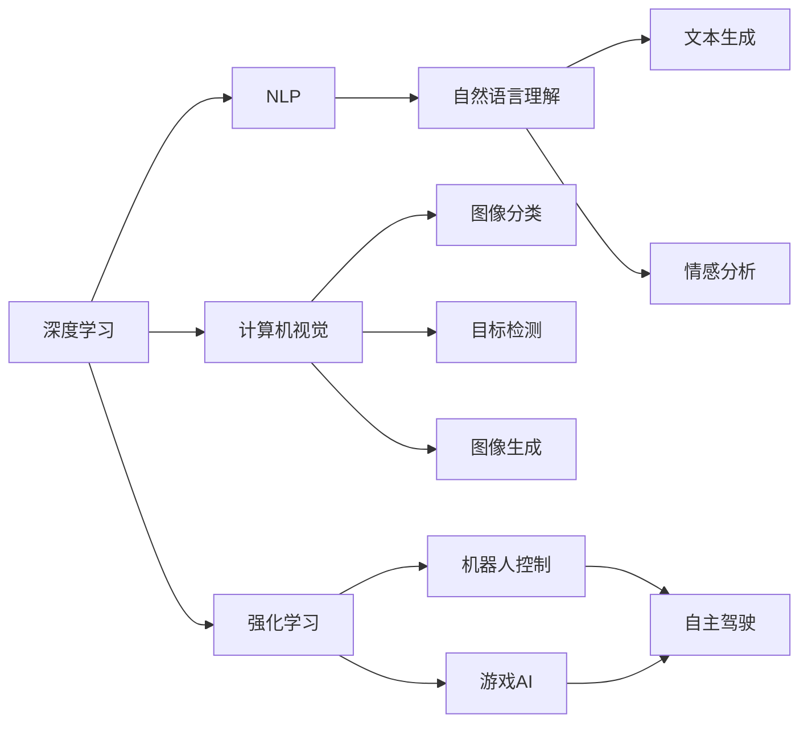

                 

# Andrej Karpathy：人工智能的未来发展挑战

> 关键词：
## 1. 背景介绍

### 1.1 问题由来
Andrej Karpathy，作为人工智能领域的重要人物，其在深度学习和计算机视觉领域的贡献举世瞩目。从其担任斯坦福大学计算机视觉教授，到联合创办OpenAI和SpacX公司，Karpathy在学术界和工业界都有着重要的影响力。在最近的一次公开演讲中，Karpathy分享了对于人工智能未来发展的展望，以及所面临的种种挑战。本文将详细解读其演讲内容，探索未来AI领域的挑战和机遇。

### 1.2 问题核心关键点
Karpathy的演讲主要围绕以下几个核心点展开：
- 人工智能在过去几十年的发展历程
- 人工智能目前所面临的挑战和困难
- 人工智能未来的发展方向和潜在的突破点
- 如何克服人工智能发展中的瓶颈，推动技术进步

通过这些关键点的探讨，Karpathy为我们提供了一个全面且深入的视角，去理解和思考人工智能的未来发展。

### 1.3 问题研究意义
理解和探讨人工智能的未来发展，对于推动AI技术的持续创新和应用有着重要的意义。这不仅有助于科研人员和工程师更好地把握技术趋势，还能为政策制定者提供科学依据，指导相关领域的投资和规划。此外，对于公众而言，了解AI的未来发展也能增强对其重要性和潜力的认识，促进社会对其接受和理解。

## 2. 核心概念与联系

### 2.1 核心概念概述

为更好地理解Andrej Karpathy对AI未来发展的观点，本文将介绍几个关键概念：

- **深度学习（Deep Learning）**：一种基于神经网络的机器学习方法，通过多层次的特征提取和抽象，实现对复杂数据的建模和预测。深度学习在计算机视觉、自然语言处理等领域有广泛应用。
- **计算机视觉（Computer Vision）**：研究如何让计算机理解图像和视频，包括图像分类、目标检测、图像生成等任务。计算机视觉技术在自动驾驶、医疗影像分析等领域有着重要应用。
- **自然语言处理（Natural Language Processing, NLP）**：涉及如何让计算机理解和生成自然语言，包括文本分类、机器翻译、问答系统等。NLP技术在智能客服、语音识别等领域广泛应用。
- **强化学习（Reinforcement Learning）**：一种通过与环境交互，学习最优决策策略的机器学习方法。强化学习在游戏AI、机器人控制等领域有重要应用。
- **模型可解释性（Model Interpretability）**：研究如何让机器学习模型具备更强的可解释性，便于理解和调试模型决策过程。

这些概念构成了AI技术发展的基础框架，Karpathy的演讲将围绕这些关键概念展开，探讨其未来的发展趋势和挑战。

### 2.2 概念间的关系

以上概念之间的逻辑关系可以通过以下Mermaid流程图来展示：



这个流程图展示了深度学习技术在多个AI子领域的应用，以及不同子领域之间的相互促进和融合。通过理解和掌握这些核心概念，可以更清晰地把握AI技术的发展脉络。

## 3. 核心算法原理 & 具体操作步骤
### 3.1 算法原理概述

Andrej Karpathy的演讲中，对AI技术的发展历程进行了回顾，并指出目前面临的主要挑战和未来可能的发展方向。

**发展历程回顾**：
- **1980年代**：早期的人工智能研究，包括专家系统、逻辑推理等，主要集中在知识和规则的编程表达。
- **2000年代**：统计学习开始兴起，机器学习和数据驱动的方法成为主流，其中深度学习在2006年通过AlexNet在ImageNet比赛中取得突破，推动了AI技术的发展。
- **2010年代至今**：深度学习技术在计算机视觉、自然语言处理、机器人等领域取得了巨大进展，实现了多项颠覆性突破，如AlphaGo、OpenAI GPT等。

**面临的挑战**：
- **数据需求**：深度学习模型需要海量的数据进行训练，数据获取和标注成本高昂。
- **模型复杂性**：深度学习模型参数量巨大，训练和推理速度慢，资源需求高。
- **模型可解释性**：复杂模型难以解释其决策过程，缺乏透明性，限制了应用范围。
- **公平性和伦理**：AI系统可能存在偏见和歧视，对伦理和社会影响深远。

**未来发展方向**：
- **自监督学习**：通过无标签数据进行训练，降低对标注数据的依赖，提高数据利用率。
- **小样本学习**：在大规模模型基础上，利用少量的样本进行微调，实现高效的参数共享和优化。
- **多模态学习**：融合视觉、听觉、文本等多种数据，提升模型的综合感知能力。
- **知识图谱**：构建大规模的知识图谱，与深度学习模型结合，实现更加复杂的信息处理。

### 3.2 算法步骤详解

Karpathy在演讲中详细介绍了如何在特定任务上进行深度学习模型的微调和优化，主要包括以下几个步骤：

**Step 1: 数据准备**
- 收集和标注数据，确保数据的质量和多样性。
- 对数据进行预处理，如数据增强、数据清洗等。

**Step 2: 模型选择**
- 根据任务特点选择合适的预训练模型。
- 对模型进行微调，适应特定任务的需求。

**Step 3: 模型优化**
- 设置合适的优化器和学习率，如Adam、SGD等。
- 应用正则化技术，如L2正则、Dropout等，防止过拟合。
- 引入对抗训练，提高模型的鲁棒性。

**Step 4: 模型评估**
- 在验证集上评估模型性能，调整模型参数。
- 在测试集上测试模型效果，确保泛化能力。

**Step 5: 模型部署**
- 将模型部署到实际应用中，进行在线推理。
- 监控模型性能，及时更新模型参数。

### 3.3 算法优缺点

**优点**：
- 数据利用率高：深度学习模型能够利用大量无标签数据进行训练，提高数据利用效率。
- 泛化能力强：通过大规模模型进行微调，模型在特定任务上表现优异。
- 应用广泛：深度学习技术已经在图像处理、自然语言处理、机器人控制等领域广泛应用。

**缺点**：
- 资源消耗高：深度学习模型需要大量计算资源进行训练和推理。
- 模型复杂性高：模型参数量巨大，难以解释和调试。
- 数据标注成本高：高质量的数据标注成本高昂，限制了模型训练的规模。

### 3.4 算法应用领域

深度学习技术在多个领域有着广泛应用，包括：

- **计算机视觉**：如图像分类、目标检测、图像生成等任务。
- **自然语言处理**：如文本分类、机器翻译、问答系统等。
- **强化学习**：如游戏AI、机器人控制等。
- **语音识别**：如语音命令识别、语音合成等。
- **自动驾驶**：如车辆定位、障碍物检测等。

## 4. 数学模型和公式 & 详细讲解 & 举例说明

### 4.1 数学模型构建

假设我们有一个深度学习模型 $M(x; \theta)$，其中 $x$ 是输入数据，$\theta$ 是模型参数。我们的目标是最大化模型在特定任务上的性能，如图像分类任务。

我们定义任务 $T$ 的损失函数为 $\mathcal{L}(M(x; \theta), y)$，其中 $y$ 是任务标签。在训练过程中，我们的目标是最小化经验风险：

$$
\mathcal{L}(\theta) = \frac{1}{N} \sum_{i=1}^N \mathcal{L}(M(x_i; \theta), y_i)
$$

其中 $N$ 是样本数量。

### 4.2 公式推导过程

在深度学习中，常用的优化器有Adam、SGD等。以Adam优化器为例，其更新规则为：

$$
\theta \leftarrow \theta - \eta \frac{m}{\sqrt{v} + \epsilon}
$$

其中 $\eta$ 是学习率，$m$ 是梯度的一阶动量，$v$ 是梯度的二阶动量，$\epsilon$ 是一个很小的正数，避免除数为0。

**推导过程**：
1. 初始化模型参数 $\theta_0$。
2. 对每个样本 $i$，计算模型预测值 $M(x_i; \theta)$。
3. 计算损失函数 $\mathcal{L}(M(x_i; \theta), y_i)$。
4. 计算梯度 $\nabla_{\theta}\mathcal{L}(M(x_i; \theta), y_i)$。
5. 更新模型参数 $\theta$：

$$
\theta_{t+1} = \theta_t - \eta \frac{m}{\sqrt{v} + \epsilon}
$$

其中 $t$ 是迭代次数，$m$ 和 $v$ 的更新规则如下：

$$
m_t = \beta_1 m_{t-1} + (1-\beta_1)\nabla_{\theta}\mathcal{L}(M(x_i; \theta), y_i)
$$

$$
v_t = \beta_2 v_{t-1} + (1-\beta_2)\nabla_{\theta}\mathcal{L}(M(x_i; \theta), y_i)^2
$$

其中 $\beta_1$ 和 $\beta_2$ 是动量衰减率，通常取0.9和0.999。

### 4.3 案例分析与讲解

以图像分类为例，假设我们有一个ImageNet数据集，包含1000个类别。我们的目标是训练一个CNN模型，能够准确分类图像。

**数据准备**：
- 收集ImageNet数据集，并将其划分为训练集、验证集和测试集。
- 对图像进行预处理，如归一化、数据增强等。

**模型选择**：
- 选择VGG、ResNet等预训练模型。
- 对模型进行微调，适应ImageNet数据集。

**模型优化**：
- 设置Adam优化器，学习率为1e-4。
- 应用L2正则化，防止过拟合。
- 引入Dropout技术，随机丢弃一部分神经元。

**模型评估**：
- 在验证集上评估模型性能，调整学习率。
- 在测试集上测试模型效果，确保泛化能力。

## 5. 项目实践：代码实例和详细解释说明

### 5.1 开发环境搭建

为了进行深度学习模型的微调和训练，我们需要准备以下开发环境：

1. 安装Python：从官网下载并安装Python 3.7及以上版本。
2. 安装PyTorch：通过conda或pip安装PyTorch，确保GPU支持。
3. 安装TensorBoard：用于可视化模型训练过程。
4. 安装Matplotlib：用于绘制图表。

### 5.2 源代码详细实现

以ImageNet数据集上的图像分类任务为例，以下是一个简单的PyTorch代码实现：

```python
import torch
import torch.nn as nn
import torch.optim as optim
import torchvision
import torchvision.transforms as transforms
from torch.utils.data import DataLoader
from torch.utils.data.dataset import Dataset

class ImageNetDataset(Dataset):
    def __init__(self, root, transform=None):
        self.transform = transform
        self.train_data = torchvision.datasets.ImageNet(root, split='train', download=True)
        self.test_data = torchvision.datasets.ImageNet(root, split='test', download=True)

    def __len__(self):
        return len(self.train_data) + len(self.test_data)

    def __getitem__(self, idx):
        if idx < len(self.train_data):
            sample = self.train_data[idx]
        else:
            sample = self.test_data[idx - len(self.train_data)]
        img, label = sample
        if self.transform is not None:
            img = self.transform(img)
        return img, label

# 定义模型
model = nn.Sequential(
    nn.Conv2d(3, 64, kernel_size=3, stride=1, padding=1),
    nn.ReLU(),
    nn.MaxPool2d(kernel_size=2, stride=2),
    nn.Conv2d(64, 128, kernel_size=3, stride=1, padding=1),
    nn.ReLU(),
    nn.MaxPool2d(kernel_size=2, stride=2),
    nn.Flatten(),
    nn.Linear(128*14*14, 512),
    nn.ReLU(),
    nn.Linear(512, 1000),
    nn.Sigmoid()
)

# 定义优化器和损失函数
criterion = nn.CrossEntropyLoss()
optimizer = optim.Adam(model.parameters(), lr=1e-4)

# 准备数据集
transform = transforms.Compose([
    transforms.Resize(224),
    transforms.ToTensor(),
    transforms.Normalize(mean=[0.485, 0.456, 0.406], std=[0.229, 0.224, 0.225])
])

train_dataset = ImageNetDataset(root='data/imagenet', transform=transform)
test_dataset = ImageNetDataset(root='data/imagenet', transform=transform)

# 定义训练和评估函数
def train_epoch(model, dataset, optimizer, criterion):
    model.train()
    train_loss = 0
    train_correct = 0
    for images, targets in DataLoader(dataset, batch_size=64, shuffle=True):
        optimizer.zero_grad()
        outputs = model(images)
        loss = criterion(outputs, targets)
        loss.backward()
        optimizer.step()
        train_loss += loss.item()
        train_correct += torch.sum(outputs.argmax(dim=1) == targets).item()
    return train_loss / len(dataset), train_correct / len(dataset)

def evaluate(model, dataset, criterion):
    model.eval()
    test_loss = 0
    test_correct = 0
    with torch.no_grad():
        for images, targets in DataLoader(dataset, batch_size=64, shuffle=True):
            outputs = model(images)
            loss = criterion(outputs, targets)
            test_loss += loss.item()
            test_correct += torch.sum(outputs.argmax(dim=1) == targets).item()
    return test_loss / len(dataset), test_correct / len(dataset)

# 训练模型
num_epochs = 10
for epoch in range(num_epochs):
    train_loss, train_acc = train_epoch(model, train_dataset, optimizer, criterion)
    test_loss, test_acc = evaluate(model, test_dataset, criterion)
    print(f"Epoch {epoch+1}, train loss: {train_loss:.4f}, train acc: {train_acc:.4f}, test loss: {test_loss:.4f}, test acc: {test_acc:.4f}")

print("Finished training")
```

### 5.3 代码解读与分析

**ImageNetDataset类**：
- `__init__`方法：初始化训练集和测试集，并进行预处理。
- `__len__`方法：返回数据集的样本数量。
- `__getitem__`方法：获取单个样本及其标签。

**模型定义**：
- `nn.Sequential`：定义一个多层神经网络。
- `nn.Conv2d`：定义卷积层。
- `nn.ReLU`：定义ReLU激活函数。
- `nn.MaxPool2d`：定义池化层。
- `nn.Flatten`：将二维张量扁平化。
- `nn.Linear`：定义全连接层。
- `nn.Sigmoid`：定义输出层的Sigmoid函数。

**训练和评估函数**：
- `train_epoch`：在每个epoch内进行训练，返回训练集损失和准确率。
- `evaluate`：在测试集上评估模型性能，返回测试集损失和准确率。

## 6. 实际应用场景

### 6.1 智能驾驶

基于深度学习的自动驾驶技术已经在多个城市进行试点和应用。通过融合计算机视觉、传感器数据和深度学习模型，智能驾驶系统能够实现车辆定位、障碍物检测、路径规划等功能。

**应用实例**：
- 特斯拉的Autopilot系统：通过摄像头和雷达数据进行目标检测和路径规划，实现自动驾驶功能。
- Waymo的Pilot系统：通过多传感器融合和深度学习模型，实现更高级别的自动驾驶。

### 6.2 医疗影像分析

深度学习在医疗影像分析领域有着广泛应用，如病变检测、手术辅助等。通过训练卷积神经网络，可以从医学影像中自动识别出病灶，辅助医生进行诊断和治疗。

**应用实例**：
- Google的DeepMind：开发了DeepMind AI系统，能够自动分析病理切片，提高诊断效率和准确性。
- 腾讯的AI Lab：开发了AI影像诊断系统，能够自动分析X光片和MRI图像，辅助医生进行诊断。

### 6.3 自然语言处理

自然语言处理技术在智能客服、机器翻译、情感分析等领域有着广泛应用。通过深度学习模型，能够实现对自然语言的理解和生成，提升人机交互体验。

**应用实例**：
- OpenAI的GPT系列模型：能够生成高质量的自然语言文本，广泛应用于智能客服、内容生成等领域。
- Google的BERT模型：能够理解上下文语境，应用于问答系统、文本分类等任务。

### 6.4 未来应用展望

未来，随着深度学习技术的不断发展，AI技术将在更多领域取得突破和应用。以下是几个可能的发展方向：

- **人机交互**：基于深度学习的语音识别和自然语言处理技术，将提升人机交互的智能化水平。
- **机器人控制**：深度学习技术在机器人控制中的应用，将推动机器人技术的发展，实现自主导航、操作等高级功能。
- **个性化推荐**：基于深度学习的个性化推荐系统，将实现更加精准、多样化的推荐内容，提升用户体验。
- **智能制造**：深度学习技术在工业领域的应用，将推动智能制造的发展，实现生产过程的自动化和智能化。

## 7. 工具和资源推荐

### 7.1 学习资源推荐

为了深入学习和掌握深度学习技术，以下是一些推荐的学习资源：

1. 《Deep Learning》（Ian Goodfellow等著）：深度学习领域的经典教材，系统介绍了深度学习的基本原理和应用。
2. 《PyTorch官方文档》：PyTorch框架的官方文档，包含丰富的代码示例和教程，适合快速入门和进阶学习。
3. 《Coursera深度学习课程》：由斯坦福大学Andrew Ng教授主讲，覆盖深度学习的基本概念和实践，适合初学者学习。
4. 《Kaggle竞赛平台》：全球知名的数据科学竞赛平台，提供丰富的数据集和任务，适合锻炼深度学习技能。
5. 《Google AI博客》：Google AI团队发布的技术博客，涵盖深度学习、计算机视觉、自然语言处理等领域的最新进展和实践。

### 7.2 开发工具推荐

为了高效进行深度学习模型的开发和优化，以下是一些推荐的开发工具：

1. PyTorch：高性能深度学习框架，支持动态图和静态图，易于使用和调试。
2. TensorFlow：由Google开发的高性能深度学习框架，支持分布式计算和GPU加速。
3. Keras：高层次的深度学习框架，易于上手和快速原型设计。
4. Jupyter Notebook：交互式开发环境，支持Python、R等多种语言，适合科研和开发。
5. Visual Studio Code：强大的代码编辑器，支持多种编程语言和开发工具集成。

### 7.3 相关论文推荐

以下是一些深度学习领域的经典论文，值得深入学习和参考：

1. ImageNet大规模视觉识别挑战赛（AlexNet）：Alex Krizhevsky等，2012年。
2. Rethinking the Inception Architecture for Computer Vision（Inception模型）：Christian Szegedy等，2014年。
3. Very Deep Convolutional Networks for Large-Scale Image Recognition（VGG模型）：Karen Simonyan和Andrew Zisserman，2014年。
4. Deep Residual Learning for Image Recognition（ResNet模型）：Kaiming He等，2015年。
5. Attention is All You Need（Transformer模型）：Ashish Vaswani等，2017年。

## 8. 总结：未来发展趋势与挑战

### 8.1 研究成果总结

通过Andrej Karpathy的演讲，我们了解到深度学习技术在过去几十年取得的巨大进展，但也面临诸多挑战。未来，深度学习将在计算机视觉、自然语言处理、机器人控制等领域继续发挥重要作用，推动AI技术不断突破和应用。

### 8.2 未来发展趋势

- **自监督学习**：通过无标签数据进行训练，降低对标注数据的依赖。
- **小样本学习**：在大规模模型基础上，利用少量样本进行微调，实现高效的参数共享和优化。
- **多模态学习**：融合视觉、听觉、文本等多种数据，提升模型的综合感知能力。
- **知识图谱**：构建大规模的知识图谱，与深度学习模型结合，实现更加复杂的信息处理。
- **模型可解释性**：研究如何让深度学习模型具备更强的可解释性，便于理解和调试。

### 8.3 面临的挑战

- **数据需求**：深度学习模型需要海量的数据进行训练，数据获取和标注成本高昂。
- **模型复杂性**：深度学习模型参数量巨大，难以解释和调试。
- **公平性和伦理**：AI系统可能存在偏见和歧视，对伦理和社会影响深远。
- **资源消耗**：深度学习模型需要大量计算资源进行训练和推理。
- **可解释性**：复杂模型难以解释其决策过程，缺乏透明性，限制了应用范围。

### 8.4 研究展望

未来，深度学习技术将在以下几个方面进行深入研究和突破：

- **跨领域融合**：深度学习技术与其他AI技术（如自然语言处理、计算机视觉等）进行更深入的融合，推动AI技术的发展。
- **模型优化**：研究更高效的模型结构和算法，减少资源消耗，提升模型性能。
- **伦理和社会影响**：研究和解决深度学习模型中的伦理和社会问题，确保技术应用的安全和公正。
- **人机协同**：研究人机协同的智能系统，提升人机交互的智能化水平。

## 9. 附录：常见问题与解答

**Q1：深度学习模型的训练和推理时间是否过长？**

A: 深度学习模型通常需要大量的计算资源进行训练和推理。为了提升效率，可以采用分布式训练、模型剪枝、量化加速等技术。

**Q2：深度学习模型是否容易过拟合？**

A: 深度学习模型容易过拟合，尤其是在数据量较少的情况下。常用的缓解策略包括数据增强、正则化、对抗训练等。

**Q3：深度学习模型的可解释性如何？**

A: 深度学习模型通常被视为"黑盒"模型，难以解释其决策过程。研究模型可解释性是一个重要的研究方向，如LIME、SHAP等工具可以帮助解释模型输出。

**Q4：深度学习模型如何应对小样本数据？**

A: 深度学习模型可以利用小样本数据进行微调，如Meta-Learning、Few-Shot Learning等方法，实现高效的参数共享和优化。

**Q5：深度学习模型如何应对数据分布的变化？**

A: 深度学习模型可以通过增量学习、持续学习等方法，不断更新模型参数，适应数据分布的变化。

---

作者：禅与计算机程序设计艺术 / Zen and the Art of Computer Programming

