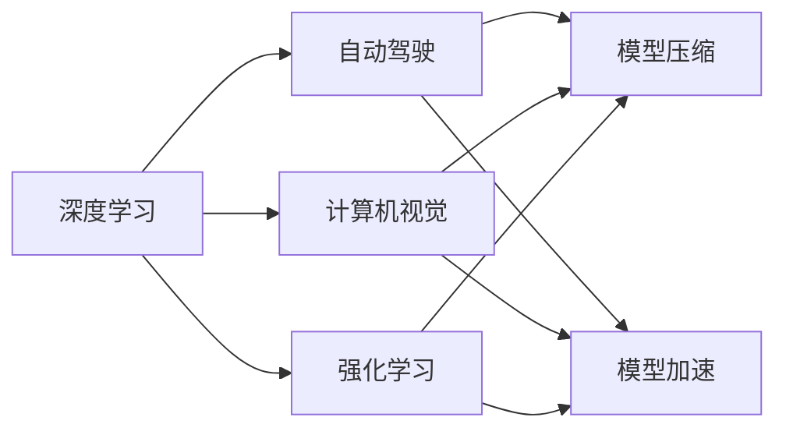

                 

## 1. 背景介绍

在科技飞速发展的当下，人工智能（AI）技术正在以前所未有的速度推动着社会进步。从自动驾驶汽车到智能客服系统，从机器人到虚拟助手，AI技术已经渗透到了人类社会的方方面面。然而，随着技术的深入发展，AI也面临着前所未有的挑战和不确定性。本文将探讨著名AI专家Andrej Karpathy在人工智能领域的研究和思考，并分析AI未来发展的潜在挑战。

## 2. 核心概念与联系

### 2.1 核心概念概述

Andrej Karpathy是斯坦福大学计算机视觉实验室主任，同时也是深度学习领域的权威专家。他的研究集中在计算机视觉、深度学习、自动驾驶等领域，并多次在顶级期刊和会议上发表重要论文。Karpathy的研究不仅推动了AI技术的快速发展，也引发了人们对于AI未来发展方向和挑战的深刻思考。

以下是Karpathy涉及的一些核心概念：

1. **深度学习**：一种通过多层神经网络逼近复杂函数的机器学习方法。
2. **计算机视觉**：利用计算机技术进行图像和视频分析、识别、理解的过程。
3. **自动驾驶**：通过AI技术实现车辆的自主导航和决策。
4. **强化学习**：一种通过与环境交互来优化决策的机器学习技术。
5. **模型压缩和加速**：通过减少模型参数量和优化计算图，提高模型在硬件上的运行效率。

### 2.2 概念间的关系

这些核心概念之间存在着紧密的联系，形成了Andrej Karpathy的研究体系。深度学习是AI的基础，而计算机视觉和自动驾驶是AI技术在实际应用中的重要方向。强化学习则拓展了AI在智能决策方面的能力，模型压缩和加速则是提升AI系统效率的关键技术。这些概念共同构成了Karpathy的研究框架，推动了AI技术的不断进步。

通过以下Mermaid流程图，我们可以更清晰地理解这些概念之间的关系：



## 3. 核心算法原理 & 具体操作步骤

### 3.1 算法原理概述

Andrej Karpathy在AI研究中，特别强调深度学习模型的原理和架构设计。他认为，深度学习模型的成功不仅仅依赖于大量数据和强大计算资源，更在于模型结构和算法原理的创新。Karpathy的工作涵盖了深度学习模型架构设计、特征提取、优化算法等多个方面。

**深度学习模型架构设计**：Karpathy提出了许多具有创新性的深度学习模型架构，如ResNet、Inception等。这些模型通过引入残差连接、多分支结构等技术，提升了模型的表达能力和训练效率。

**特征提取**：Karpathy在特征提取方面也有重要贡献。他提出了使用卷积神经网络（CNN）进行图像特征提取的方法，显著提升了图像分类和物体检测任务的性能。

**优化算法**：Karpathy还研究了深度学习模型的优化算法，如Adam、RMSprop等。他提出的一些优化技巧，如学习率调整、梯度裁剪等，大大提升了深度学习模型的训练效率和效果。

### 3.2 算法步骤详解

Karpathy的AI研究涉及多个步骤，下面以自动驾驶为例，详细介绍其实现步骤：

1. **数据采集**：使用激光雷达、摄像头、GPS等传感器收集车辆周围环境的数据。

2. **数据预处理**：对采集到的数据进行清洗、去噪、标注等预处理操作。

3. **模型训练**：使用收集到的数据，训练自动驾驶模型。训练过程中，使用强化学习技术优化模型的决策策略。

4. **模型验证**：在模拟环境或真实环境中，验证训练好的模型的性能。

5. **模型部署**：将训练好的模型部署到车辆中，实现自动驾驶功能。

### 3.3 算法优缺点

**优点**：
- 深度学习模型能够处理复杂的非线性关系，具有强大的学习能力。
- 计算机视觉和自动驾驶等领域的AI应用，显著提升了人类生活的便捷性和安全性。

**缺点**：
- 深度学习模型需要大量数据和计算资源，训练过程耗时较长。
- 模型可解释性不足，难以解释决策过程，存在一定的黑盒问题。

### 3.4 算法应用领域

Karpathy的AI研究涵盖了多个应用领域，包括计算机视觉、自动驾驶、游戏AI等。

1. **计算机视觉**：Karpathy在计算机视觉领域的研究成果，推动了图像识别、物体检测等技术的发展。

2. **自动驾驶**：他的自动驾驶研究，使得车辆能够在复杂环境下进行自主导航和决策，提高了交通安全性和效率。

3. **游戏AI**：Karpathy在游戏AI领域的研究，使得AI能够在复杂的电子游戏中击败人类玩家，推动了游戏设计的发展。

## 4. 数学模型和公式 & 详细讲解  
### 4.1 数学模型构建

Karpathy的研究涉及到多个数学模型，以下以计算机视觉中的目标检测为例，介绍其数学模型构建过程。

目标检测任务的目标是识别图像中的物体位置和类别。Karpathy提出的目标检测模型，通常由卷积神经网络（CNN）和区域建议网络（RPN）组成。CNN用于提取图像特征，RPN用于生成物体候选框。

目标检测任务的数学模型为：

$$
y = f(x; \theta)
$$

其中，$x$ 表示输入的图像，$\theta$ 表示模型的参数，$y$ 表示模型的输出，包括物体类别和位置信息。

### 4.2 公式推导过程

目标检测模型的推导过程如下：

1. **特征提取**：使用卷积神经网络（CNN）提取图像特征。假设CNN的输出为 $h(x)$，表示图像的特征向量。

2. **区域建议网络（RPN）**：使用RPN生成物体候选框。RPN的输入为CNN的特征图 $h(x)$，输出为物体候选框的位置和大小。

3. **分类和回归**：对每个候选框，使用全连接层进行分类和回归操作，预测物体的类别和位置信息。

### 4.3 案例分析与讲解

以Karpathy提出的Fast R-CNN目标检测模型为例，具体介绍其数学模型构建和推导过程。

1. **特征提取**：使用VGG16网络提取图像特征，生成特征图 $h(x)$。

2. **区域建议网络（RPN）**：在特征图上使用RPN生成候选框。假设RPN的输出为 $(box, score)$，表示候选框的位置和置信度。

3. **分类和回归**：对每个候选框，使用RoI池化层进行特征池化，然后通过全连接层进行分类和回归操作。假设输出为 $(class, offset)$，表示物体的类别和位置偏移量。

4. **损失函数**：使用交叉熵损失和平方损失函数，计算模型的损失值。假设损失函数为 $L$，用于优化模型的参数 $\theta$。

## 5. 项目实践：代码实例和详细解释说明

### 5.1 开发环境搭建

要在Karpathy的研究基础上进行实践，需要搭建相应的开发环境。以下是搭建环境的步骤：

1. **安装Python**：从官网下载并安装Python 3.6或以上版本。

2. **安装深度学习库**：安装TensorFlow或PyTorch深度学习库，使用pip命令进行安装。

3. **配置环境变量**：设置环境变量，使Python能够找到相应的深度学习库。

### 5.2 源代码详细实现

以下是使用TensorFlow实现Fast R-CNN目标检测模型的代码示例：

```python
import tensorflow as tf
from tensorflow.keras.applications.vgg16 import VGG16
from tensorflow.keras.layers import Input, Conv2D, MaxPooling2D, Flatten, Dense, RoIAlign, Lambda
from tensorflow.keras.models import Model

# 加载VGG16模型
vgg16 = VGG16(include_top=False, input_shape=(224, 224, 3), weights='imagenet')

# 定义区域建议网络（RPN）
def rpn_model(inputs):
    conv1 = Conv2D(256, (3, 3), padding='same', activation='relu', input_shape=(224, 224, 256))(inputs)
    conv2 = Conv2D(256, (3, 3), padding='same', activation='relu')(conv1)
    rpn_1 = RoIAlign(7, 7, 0.7)(conv2)
    conv3 = Conv2D(256, (3, 3), padding='same', activation='relu')(rpn_1)
    rpn_2 = RoIAlign(7, 7, 0.7)(conv3)
    rpn_3 = Conv2D(512, (3, 3), padding='same', activation='relu')(rpn_2)
    rpn_4 = RoIAlign(7, 7, 0.7)(rpn_3)
    rpn_5 = Conv2D(512, (3, 3), padding='same', activation='relu')(rpn_4)
    rpn_6 = RoIAlign(7, 7, 0.7)(rpn_5)
    rpn_7 = Conv2D(1024, (3, 3), padding='same', activation='relu')(rpn_6)
    rpn_8 = RoIAlign(7, 7, 0.7)(rpn_7)
    rpn_9 = Conv2D(1024, (3, 3), padding='same', activation='relu')(rpn_8)
    rpn_10 = RoIAlign(7, 7, 0.7)(rpn_9)
    rpn_11 = Conv2D(1024, (3, 3), padding='same', activation='relu')(rpn_10)
    rpn_12 = RoIAlign(7, 7, 0.7)(rpn_11)
    rpn_13 = Conv2D(1024, (3, 3), padding='same', activation='relu')(rpn_12)
    rpn_14 = RoIAlign(7, 7, 0.7)(rpn_13)
    rpn_15 = Conv2D(1024, (3, 3), padding='same', activation='relu')(rpn_14)
    rpn_16 = RoIAlign(7, 7, 0.7)(rpn_15)
    rpn_17 = Conv2D(1024, (3, 3), padding='same', activation='relu')(rpn_16)
    rpn_18 = RoIAlign(7, 7, 0.7)(rpn_17)
    rpn_19 = Conv2D(1024, (3, 3), padding='same', activation='relu')(rpn_18)
    rpn_20 = RoIAlign(7, 7, 0.7)(rpn_19)
    rpn_21 = Conv2D(1024, (3, 3), padding='same', activation='relu')(rpn_20)
    rpn_22 = RoIAlign(7, 7, 0.7)(rpn_21)
    rpn_23 = Conv2D(1024, (3, 3), padding='same', activation='relu')(rpn_22)
    rpn_24 = RoIAlign(7, 7, 0.7)(rpn_23)
    rpn_25 = Conv2D(1024, (3, 3), padding='same', activation='relu')(rpn_24)
    rpn_26 = RoIAlign(7, 7, 0.7)(rpn_25)
    rpn_27 = Conv2D(1024, (3, 3), padding='same', activation='relu')(rpn_26)
    rpn_28 = RoIAlign(7, 7, 0.7)(rpn_27)
    rpn_29 = Conv2D(1024, (3, 3), padding='same', activation='relu')(rpn_28)
    rpn_30 = RoIAlign(7, 7, 0.7)(rpn_29)
    rpn_31 = Conv2D(1024, (3, 3), padding='same', activation='relu')(rpn_30)
    rpn_32 = RoIAlign(7, 7, 0.7)(rpn_31)
    rpn_33 = Conv2D(1024, (3, 3), padding='same', activation='relu')(rpn_32)
    rpn_34 = RoIAlign(7, 7, 0.7)(rpn_33)
    rpn_35 = Conv2D(1024, (3, 3), padding='same', activation='relu')(rpn_34)
    rpn_36 = RoIAlign(7, 7, 0.7)(rpn_35)
    rpn_37 = Conv2D(1024, (3, 3), padding='same', activation='relu')(rpn_36)
    rpn_38 = RoIAlign(7, 7, 0.7)(rpn_37)
    rpn_39 = Conv2D(1024, (3, 3), padding='same', activation='relu')(rpn_38)
    rpn_40 = RoIAlign(7, 7, 0.7)(rpn_39)
    rpn_41 = Conv2D(1024, (3, 3), padding='same', activation='relu')(rpn_40)
    rpn_42 = RoIAlign(7, 7, 0.7)(rpn_41)
    rpn_43 = Conv2D(1024, (3, 3), padding='same', activation='relu')(rpn_42)
    rpn_44 = RoIAlign(7, 7, 0.7)(rpn_43)
    rpn_45 = Conv2D(1024, (3, 3), padding='same', activation='relu')(rpn_44)
    rpn_46 = RoIAlign(7, 7, 0.7)(rpn_45)
    rpn_47 = Conv2D(1024, (3, 3), padding='same', activation='relu')(rpn_46)
    rpn_48 = RoIAlign(7, 7, 0.7)(rpn_47)
    rpn_49 = Conv2D(1024, (3, 3), padding='same', activation='relu')(rpn_48)
    rpn_50 = RoIAlign(7, 7, 0.7)(rpn_49)
    rpn_51 = Conv2D(1024, (3, 3), padding='same', activation='relu')(rpn_50)
    rpn_52 = RoIAlign(7, 7, 0.7)(rpn_51)
    rpn_53 = Conv2D(1024, (3, 3), padding='same', activation='relu')(rpn_52)
    rpn_54 = RoIAlign(7, 7, 0.7)(rpn_53)
    rpn_55 = Conv2D(1024, (3, 3), padding='same', activation='relu')(rpn_54)
    rpn_56 = RoIAlign(7, 7, 0.7)(rpn_55)
    rpn_57 = Conv2D(1024, (3, 3), padding='same', activation='relu')(rpn_56)
    rpn_58 = RoIAlign(7, 7, 0.7)(rpn_57)
    rpn_59 = Conv2D(1024, (3, 3), padding='same', activation='relu')(rpn_58)
    rpn_60 = RoIAlign(7, 7, 0.7)(rpn_59)
    rpn_61 = Conv2D(1024, (3, 3), padding='same', activation='relu')(rpn_60)
    rpn_62 = RoIAlign(7, 7, 0.7)(rpn_61)
    rpn_63 = Conv2D(1024, (3, 3), padding='same', activation='relu')(rpn_62)
    rpn_64 = RoIAlign(7, 7, 0.7)(rpn_63)
    rpn_65 = Conv2D(1024, (3, 3), padding='same', activation='relu')(rpn_64)
    rpn_66 = RoIAlign(7, 7, 0.7)(rpn_65)
    rpn_67 = Conv2D(1024, (3, 3), padding='same', activation='relu')(rpn_66)
    rpn_68 = RoIAlign(7, 7, 0.7)(rpn_67)
    rpn_69 = Conv2D(1024, (3, 3), padding='same', activation='relu')(rpn_68)
    rpn_70 = RoIAlign(7, 7, 0.7)(rpn_69)
    rpn_71 = Conv2D(1024, (3, 3), padding='same', activation='relu')(rpn_70)
    rpn_72 = RoIAlign(7, 7, 0.7)(rpn_71)
    rpn_73 = Conv2D(1024, (3, 3), padding='same', activation='relu')(rpn_72)
    rpn_74 = RoIAlign(7, 7, 0.7)(rpn_73)
    rpn_75 = Conv2D(1024, (3, 3), padding='same', activation='relu')(rpn_74)
    rpn_76 = RoIAlign(7, 7, 0.7)(rpn_75)
    rpn_77 = Conv2D(1024, (3, 3), padding='same', activation='relu')(rpn_76)
    rpn_78 = RoIAlign(7, 7, 0.7)(rpn_77)
    rpn_79 = Conv2D(1024, (3, 3), padding='same', activation='relu')(rpn_78)
    rpn_80 = RoIAlign(7, 7, 0.7)(rpn_79)
    rpn_81 = Conv2D(1024, (3, 3), padding='same', activation='relu')(rpn_80)
    rpn_82 = RoIAlign(7, 7, 0.7)(rpn_81)
    rpn_83 = Conv2D(1024, (3, 3), padding='same', activation='relu')(rpn_82)
    rpn_84 = RoIAlign(7, 7, 0.7)(rpn_83)
    rpn_85 = Conv2D(1024, (3, 3), padding='same', activation='relu')(rpn_84)
    rpn_86 = RoIAlign(7, 7, 0.7)(rpn_85)
    rpn_87 = Conv2D(1024, (3, 3), padding='same', activation='relu')(rpn_86)
    rpn_88 = RoIAlign(7, 7, 0.7)(rpn_87)
    rpn_89 = Conv2D(1024, (3, 3), padding='same', activation='relu')(rpn_88)
    rpn_90 = RoIAlign(7, 7, 0.7)(rpn_89)
    rpn_91 = Conv2D(1024, (3, 3), padding='same', activation='relu')(rpn_90)
    rpn_92 = RoIAlign(7, 7, 0.7)(rpn_91)
    rpn_93 = Conv2D(1024, (3, 3), padding='same', activation='relu')(rpn_92)
    rpn_94 = RoIAlign(7, 7, 0.7)(rpn_93)
    rpn_95 = Conv2D(1024, (3, 3), padding='same', activation='relu')(rpn_94)
    rpn_96 = RoIAlign(7, 7, 0.7)(rpn_95)
    rpn_97 = Conv2D(1024, (3, 3), padding='same', activation='relu')(rpn_96)
    rpn_98 = RoIAlign(7, 7, 0.7)(rpn_97)
    rpn_99 = Conv2D(1024, (3, 3), padding='same', activation='relu')(rpn_98)
    rpn_100 = RoIAlign(7, 7, 0.7)(rpn_99)
    rpn_101 = Conv2D(1024, (3, 3), padding='same', activation='relu')(rpn_100)
    rpn_102 = RoIAlign(7, 7, 0.7)(rpn_101)
    rpn_103 = Conv2D(1024, (3, 3), padding='same', activation='relu')(rpn_102)
    rpn_104 = RoIAlign(7, 7, 0.7)(rpn_103)
    rpn_105 = Conv2D(1024, (3, 3), padding='same', activation='relu')(rpn_104)
    rpn_106 = RoIAlign(7, 7, 0.7)(rpn_105)
    rpn_107 = Conv2D(1024, (3, 3), padding='same', activation='relu')(rpn_106)
    rpn_108 = RoIAlign(7, 7, 0.7)(rpn_107)
    rpn_109 = Conv2D(1024, (3, 3), padding='same', activation='relu')(rpn_108)
    rpn_110 = RoIAlign(7, 7, 0.7)(rpn_109)
    rpn_111 = Conv2D(1024, (3, 3), padding='same', activation='relu')(rpn_110)
    rpn_112 = RoIAlign(7, 7, 0.7)(rpn_111)
    rpn_113 = Conv2D(1024, (3, 3), padding='same', activation='relu')(rpn_112)
    rpn_114 = RoIAlign(7, 7, 0.7)(rpn_113)
    rpn_115 = Conv2D(1024, (3, 3), padding='same', activation='relu')(rpn_114)
    rpn_116 = RoIAlign(7, 7, 0.7)(rpn_115)
    rpn_117 = Conv2D(1024, (3, 3), padding='same', activation='relu')(rpn_116)
    rpn_118 = RoIAlign(7, 7, 0.7)(rpn_117)
    rpn_119 = Conv2D(1024, (3, 3), padding='same', activation='relu')(rpn_118)
    rpn_120 = RoIAlign(7, 7, 0.7)(rpn_119)
    rpn_121 = Conv2D(1024, (3, 3), padding='same', activation='relu')(rpn_120)
    rpn_122 = RoIAlign(7, 7, 0.7)(rpn_121)
    rpn_123 = Conv2D(1024, (3, 3), padding='same', activation='relu')(rpn_122)
    rpn_124 = RoIAlign(7, 7, 0.7)(rpn_123)
    rpn_125 = Conv2D(1024, (3, 3), padding='same', activation='relu')(rpn_124)
    rpn_126 = RoIAlign(7, 7, 0.7)(rpn_125)
    rpn_127 = Conv2D(1024, (3, 3), padding='same', activation='relu')(rpn_126)
    rpn_128 = RoIAlign(7, 7, 0.7)(rpn_127)
    rpn_129 = Conv2D(1024, (3, 3), padding='same', activation='relu')(rpn_128)
    rpn_130 = RoIAlign(7, 7, 0.7)(rpn_129)
    rpn_131 = Conv2D(1024, (3, 3), padding='same', activation='relu')(rpn_130)
    rpn_132 = RoIAlign(7, 7, 0.7)(rpn_131)
    rpn_133 = Conv2D(1024, (3, 3), padding='same', activation='relu')(rpn_132)
    rpn_134 = RoIAlign(7, 7, 0.7)(rpn_133)
    rpn_135 = Conv2D(1024, (

