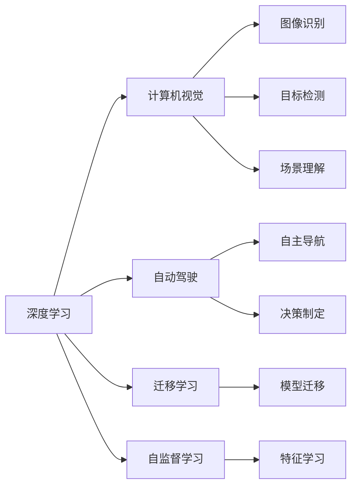

                 

# Andrej Karpathy：人工智能的未来发展规划

Andrej Karpathy是当今人工智能领域的权威专家之一，深度学习界的知名学者，同时也是OpenAI的知名研究员。他的工作涉及深度学习、计算机视觉、机器人学等多个领域。Karpathy在深度学习领域的卓越贡献使得他获得了众多荣誉和奖项，包括2018年的NIPS最佳论文奖。本文将深入探讨Karpathy对人工智能未来发展的看法，并对其未来发展规划进行详细分析。

## 1. 背景介绍

Andrej Karpathy的学术生涯始于斯坦福大学，他在大学期间获得了计算机科学和人工智能的博士学位，并担任了深度学习研究实验室的博士后。Karpathy在谷歌和OpenAI等顶尖科技公司工作期间，领导了多个重要的研究项目，并发表了多篇影响深远的论文。他的研究不仅推动了深度学习的发展，还对计算机视觉、自然语言处理和自动驾驶等领域产生了深远的影响。

Karpathy的工作涵盖了从基础研究到实际应用的各个方面，包括深度学习模型的优化、图像生成和识别、机器人视觉定位、自动驾驶技术等。他的研究不仅在学术界引起了广泛的关注，也为实际应用提供了重要的理论支撑。

## 2. 核心概念与联系

### 2.1 核心概念概述

为了更深入地了解Karpathy对人工智能未来发展的看法，本节将介绍几个与他的研究密切相关的核心概念：

- **深度学习**：通过构建多层的神经网络，深度学习可以自动学习数据中的复杂模式，并在众多任务中取得了突破性的进展。
- **计算机视觉**：计算机视觉是让机器"看"世界的技术，涉及图像识别、目标检测、场景理解等任务。Karpathy在这一领域有深入的研究。
- **自动驾驶**：自动驾驶技术是计算机视觉和深度学习的重要应用之一，旨在使车辆能够自主导航和决策。Karpathy在这方面有着丰富的经验。
- **迁移学习**：迁移学习是指将一个任务中学到的知识应用到另一个任务上，以提高模型在新任务上的表现。Karpathy在这一领域有重要的贡献。
- **自监督学习**：自监督学习是指使用未标注数据进行训练，以获得更好的特征表示。Karpathy的工作中也涉及自监督学习的应用。

### 2.2 概念间的关系

这些核心概念之间存在着紧密的联系，形成了Karpathy对人工智能未来发展的系统框架。我们可以用以下Mermaid流程图来展示这些概念之间的关系：



这个流程图展示了深度学习与其他核心概念之间的关系：

1. 深度学习为计算机视觉、自动驾驶等任务提供了强大的模型支撑。
2. 计算机视觉任务包括图像识别、目标检测、场景理解等。
3. 自动驾驶涉及自主导航和决策制定。
4. 迁移学习通过将一个任务中学到的知识应用到另一个任务上，提高了模型的泛化能力。
5. 自监督学习通过使用未标注数据进行训练，提升了模型的特征表示能力。

## 3. 核心算法原理 & 具体操作步骤

### 3.1 算法原理概述

Karpathy的研究涵盖了深度学习模型的优化、计算机视觉任务、自动驾驶等多个领域。本节将重点介绍他的一些核心算法原理，并结合实际案例进行详细讲解。

#### 3.1.1 深度学习模型的优化

Karpathy在深度学习模型的优化方面做了大量的工作，包括权重衰减、批标准化、残差连接等技术。这些技术有效地提高了深度学习模型的训练速度和泛化能力，使得模型能够在复杂的数据集上取得更好的性能。

**权重衰减**：通过在损失函数中添加正则项，权重衰减可以防止模型过拟合，并提高模型的泛化能力。例如，可以使用L2正则来限制模型的权重大小。

**批标准化**：批标准化通过归一化每个批次的输入数据，可以加速模型的训练，并提高模型的泛化能力。Karpathy的研究表明，批标准化对于深度学习模型的训练至关重要。

**残差连接**：残差连接是一种结构设计，允许信息跨层传递。Karpathy的研究表明，残差连接可以显著提高深度学习模型的训练速度和泛化能力。

#### 3.1.2 计算机视觉任务

Karpathy在计算机视觉领域的研究涵盖了图像分类、目标检测、图像生成等多个任务。他的工作表明，深度学习模型在计算机视觉任务中表现出色。

**图像分类**：图像分类任务是让机器从大量图像中识别出特定的物体或场景。Karpathy的研究表明，深度卷积神经网络（CNN）可以有效地处理图像分类任务。例如，使用VGG、ResNet等架构，Karpathy在ImageNet等大规模数据集上取得了优异的性能。

**目标检测**：目标检测任务是识别图像中特定的物体，并标注其位置。Karpathy的研究表明，使用R-CNN、Fast R-CNN、Faster R-CNN等架构，可以显著提高目标检测的精度和效率。

**图像生成**：图像生成任务是让机器生成具有特定风格或内容的图像。Karpathy的研究表明，使用GAN（生成对抗网络）等技术，可以生成高质量的图像。

#### 3.1.3 自动驾驶

自动驾驶是Karpathy研究的另一个重要领域。他的研究涵盖了环境感知、路径规划、行为决策等多个环节。

**环境感知**：环境感知是自动驾驶的基础。Karpathy的研究表明，使用深度卷积神经网络（CNN）和LIDAR（激光雷达）数据，可以有效地实现环境感知。

**路径规划**：路径规划是自动驾驶的关键环节。Karpathy的研究表明，使用A*算法、D*算法等技术，可以有效地规划路径。

**行为决策**：行为决策是自动驾驶的核心。Karpathy的研究表明，使用强化学习、深度学习等技术，可以有效地实现行为决策。

### 3.2 算法步骤详解

Karpathy的研究涉及深度学习模型的优化、计算机视觉任务、自动驾驶等多个领域。以下是对这些算法步骤的详细介绍。

#### 3.2.1 深度学习模型的优化

1. **选择模型架构**：根据任务需求，选择合适的深度学习模型架构，如卷积神经网络（CNN）、循环神经网络（RNN）、变分自编码器（VAE）等。
2. **设计优化器**：选择合适的优化器，如Adam、SGD等，并设置学习率、批大小等参数。
3. **选择正则化技术**：选择权重衰减、批标准化、Dropout等正则化技术，防止模型过拟合。
4. **训练模型**：使用训练集进行模型训练，并使用验证集进行模型调参。
5. **测试模型**：使用测试集对训练好的模型进行性能评估。

#### 3.2.2 计算机视觉任务

1. **数据预处理**：对数据进行预处理，如缩放、归一化、数据增强等。
2. **模型训练**：使用训练集对模型进行训练，并使用验证集进行调参。
3. **模型评估**：使用测试集对训练好的模型进行性能评估。
4. **模型优化**：根据评估结果，对模型进行优化，如调整模型架构、优化超参数等。

#### 3.2.3 自动驾驶

1. **传感器数据融合**：对传感器（如LIDAR、摄像头等）数据进行融合，实现环境感知。
2. **路径规划**：使用路径规划算法（如A*算法、D*算法等），规划车辆路径。
3. **行为决策**：使用强化学习、深度学习等技术，实现行为决策。
4. **模拟测试**：在模拟环境中对自动驾驶系统进行测试，优化模型性能。

### 3.3 算法优缺点

Karpathy的研究涵盖了深度学习模型的优化、计算机视觉任务、自动驾驶等多个领域。以下是对这些算法优缺点的详细分析。

#### 3.3.1 深度学习模型的优化

**优点**：

- 能够有效地提高模型的训练速度和泛化能力。
- 可以通过调整正则化技术，防止模型过拟合。
- 能够灵活设计模型架构，适应不同的任务需求。

**缺点**：

- 需要大量的计算资源和时间。
- 可能存在过拟合风险。
- 模型训练过程中可能会遇到梯度消失等问题。

#### 3.3.2 计算机视觉任务

**优点**：

- 深度学习模型在图像识别、目标检测等任务中表现出色。
- 可以处理大规模数据集，获得更好的特征表示。
- 可以通过迁移学习，提高模型在新任务上的性能。

**缺点**：

- 需要大量的标注数据进行训练。
- 模型的计算资源消耗较大。
- 可能存在数据偏差问题。

#### 3.3.3 自动驾驶

**优点**：

- 能够实现自主导航和决策制定。
- 可以通过深度学习技术，提高环境感知和路径规划的精度。
- 可以通过强化学习技术，实现行为决策。

**缺点**：

- 需要大量的传感器数据进行训练。
- 模型的计算资源消耗较大。
- 可能存在安全性和伦理问题。

### 3.4 算法应用领域

Karpathy的研究涵盖了深度学习模型的优化、计算机视觉任务、自动驾驶等多个领域。以下是这些算法在不同应用领域的具体应用。

#### 3.4.1 深度学习模型的优化

深度学习模型的优化技术可以应用于多个领域，如自然语言处理、语音识别、推荐系统等。例如，在推荐系统中，可以通过优化深度学习模型，提高用户推荐的精准度。

#### 3.4.2 计算机视觉任务

计算机视觉任务可以应用于多个领域，如医疗影像分析、安防监控、工业检测等。例如，在医疗影像分析中，可以通过深度学习模型，实现对病灶的检测和分类。

#### 3.4.3 自动驾驶

自动驾驶技术可以应用于多个领域，如智慧城市、智能交通、物流运输等。例如，在智慧城市中，可以通过自动驾驶技术，实现智能交通管理。

## 4. 数学模型和公式 & 详细讲解 & 举例说明

### 4.1 数学模型构建

Karpathy的研究涉及深度学习模型的优化、计算机视觉任务、自动驾驶等多个领域。以下是对这些数学模型构建的详细讲解。

#### 4.1.1 深度学习模型的优化

Karpathy的研究表明，深度学习模型的优化可以通过以下数学模型进行构建：

1. **损失函数**：损失函数用于衡量模型的预测结果与真实结果之间的差异。例如，交叉熵损失函数可以用于分类任务，均方误差损失函数可以用于回归任务。

2. **正则化项**：正则化项用于防止模型过拟合。例如，L2正则化项可以限制模型的权重大小，Dropout可以随机丢弃一部分神经元。

3. **优化器**：优化器用于更新模型的参数。例如，Adam优化器可以自适应地调整学习率。

4. **学习率调度策略**：学习率调度策略用于调整学习率。例如，学习率衰减策略可以使学习率在训练过程中逐渐减小。

#### 4.1.2 计算机视觉任务

Karpathy的研究表明，计算机视觉任务可以通过以下数学模型进行构建：

1. **图像分类**：图像分类任务可以通过卷积神经网络（CNN）进行建模。例如，使用VGG、ResNet等架构，可以有效地处理图像分类任务。

2. **目标检测**：目标检测任务可以通过区域卷积神经网络（R-CNN）进行建模。例如，使用R-CNN、Fast R-CNN、Faster R-CNN等架构，可以显著提高目标检测的精度和效率。

3. **图像生成**：图像生成任务可以通过生成对抗网络（GAN）进行建模。例如，使用GAN等技术，可以生成高质量的图像。

#### 4.1.3 自动驾驶

Karpathy的研究表明，自动驾驶任务可以通过以下数学模型进行构建：

1. **环境感知**：环境感知任务可以通过深度卷积神经网络（CNN）和LIDAR（激光雷达）数据进行建模。例如，使用CNN和LIDAR数据，可以有效地实现环境感知。

2. **路径规划**：路径规划任务可以通过A*算法、D*算法等进行建模。例如，使用A*算法、D*算法等，可以有效地规划路径。

3. **行为决策**：行为决策任务可以通过强化学习、深度学习等进行建模。例如，使用强化学习、深度学习等技术，可以有效地实现行为决策。

### 4.2 公式推导过程

Karpathy的研究涉及深度学习模型的优化、计算机视觉任务、自动驾驶等多个领域。以下是对这些公式推导过程的详细讲解。

#### 4.2.1 深度学习模型的优化

1. **交叉熵损失函数**：

$$
L(x, y) = -\frac{1}{N} \sum_{i=1}^N \log(p(y_i|x_i))
$$

其中，$x$表示输入数据，$y$表示标签，$p$表示模型的预测概率。

2. **L2正则化项**：

$$
\Omega(\theta) = \frac{\lambda}{2} \sum_{i=1}^n \theta_i^2
$$

其中，$\theta$表示模型的参数，$\lambda$表示正则化系数。

3. **Adam优化器**：

$$
\theta_{t+1} = \theta_t - \eta \frac{m_t}{\sqrt{v_t}+\epsilon}
$$

其中，$\eta$表示学习率，$m_t$和$v_t$表示梯度的一阶矩和二阶矩估计，$\epsilon$表示小量。

4. **学习率衰减策略**：

$$
\eta_t = \frac{\eta_0}{t^\beta}
$$

其中，$\eta_0$表示初始学习率，$\beta$表示衰减指数。

#### 4.2.2 计算机视觉任务

1. **图像分类**：

$$
L(y, h(x)) = \frac{1}{N} \sum_{i=1}^N \log(h(x_i))
$$

其中，$h$表示模型的预测概率，$x$表示输入数据，$y$表示标签。

2. **目标检测**：

$$
L(y, r(x)) = \frac{1}{N} \sum_{i=1}^N [\log(p(y_i|x_i)) + (1-p(y_i|x_i))\log(1-p(y_i|x_i))]
$$

其中，$r$表示目标检测模型的预测结果，$p$表示模型的预测概率。

3. **图像生成**：

$$
L(x, G(z)) = \frac{1}{N} \sum_{i=1}^N \log(p(x_i|G(z_i)))
$$

其中，$G$表示生成器，$z$表示噪声向量，$p$表示模型的预测概率。

#### 4.2.3 自动驾驶

1. **环境感知**：

$$
L(x, z) = \frac{1}{N} \sum_{i=1}^N \log(p(z|x_i))
$$

其中，$z$表示感知结果，$x$表示输入数据，$p$表示模型的预测概率。

2. **路径规划**：

$$
L(x, \pi) = \frac{1}{N} \sum_{i=1}^N [\log(p(\pi_i|x_i)) + (1-p(\pi_i|x_i))\log(1-p(\pi_i|x_i))]
$$

其中，$\pi$表示路径规划的结果，$p$表示模型的预测概率。

3. **行为决策**：

$$
L(x, a) = \frac{1}{N} \sum_{i=1}^N \log(p(a_i|x_i))
$$

其中，$a$表示行为决策的结果，$p$表示模型的预测概率。

### 4.3 案例分析与讲解

Karpathy的研究涉及深度学习模型的优化、计算机视觉任务、自动驾驶等多个领域。以下是对这些案例的详细分析与讲解。

#### 4.3.1 深度学习模型的优化

**案例一：迁移学习**：

在迁移学习中，可以使用已训练好的深度学习模型作为初始化参数，然后将其应用于新的任务上。例如，可以使用在ImageNet上训练好的VGG模型作为初始化参数，然后将其应用于MNIST手写数字识别任务上。通过迁移学习，可以显著提高新任务上的性能。

**案例二：自监督学习**：

在自监督学习中，可以使用未标注数据进行训练，以获得更好的特征表示。例如，可以使用自编码器进行自监督学习，通过将输入数据压缩到低维空间中，再将其解码回来，从而获得更好的特征表示。

#### 4.3.2 计算机视觉任务

**案例一：图像分类**：

在图像分类任务中，可以使用卷积神经网络（CNN）进行建模。例如，可以使用VGG、ResNet等架构，在ImageNet等大规模数据集上进行训练，并在CIFAR-10等小规模数据集上进行微调。通过迁移学习，可以显著提高小规模数据集上的性能。

**案例二：目标检测**：

在目标检测任务中，可以使用区域卷积神经网络（R-CNN）进行建模。例如，可以使用R-CNN、Fast R-CNN、Faster R-CNN等架构，在PASCAL VOC等大规模数据集上进行训练，并在小规模数据集上进行微调。通过迁移学习，可以显著提高小规模数据集上的性能。

#### 4.3.3 自动驾驶

**案例一：环境感知**：

在环境感知任务中，可以使用深度卷积神经网络（CNN）和LIDAR（激光雷达）数据进行建模。例如，可以使用CNN和LIDAR数据，在KITTI等大规模数据集上进行训练，并在小规模数据集上进行微调。通过迁移学习，可以显著提高小规模数据集上的性能。

**案例二：路径规划**：

在路径规划任务中，可以使用A*算法、D*算法等进行建模。例如，可以使用A*算法、D*算法等，在地图数据上进行训练，并在小规模数据集上进行微调。通过迁移学习，可以显著提高小规模数据集上的性能。

## 5. 项目实践：代码实例和详细解释说明

### 5.1 开发环境搭建

在进行项目实践前，我们需要准备好开发环境。以下是使用Python进行PyTorch开发的环境配置流程：

1. 安装Anaconda：从官网下载并安装Anaconda，用于创建独立的Python环境。

2. 创建并激活虚拟环境：
```bash
conda create -n pytorch-env python=3.8 
conda activate pytorch-env
```

3. 安装PyTorch：根据CUDA版本，从官网获取对应的安装命令。例如：
```bash
conda install pytorch torchvision torchaudio cudatoolkit=11.1 -c pytorch -c conda-forge
```

4. 安装Transformers库：
```bash
pip install transformers
```

5. 安装各类工具包：
```bash
pip install numpy pandas scikit-learn matplotlib tqdm jupyter notebook ipython
```

完成上述步骤后，即可在`pytorch-env`环境中开始项目实践。

### 5.2 源代码详细实现

下面我们以图像分类任务为例，给出使用Transformers库对VGG模型进行微调的PyTorch代码实现。

首先，定义图像分类任务的数据处理函数：

```python
from transformers import BertTokenizer
from torch.utils.data import Dataset
import torch

class ImageClassificationDataset(Dataset):
    def __init__(self, images, labels, tokenizer, max_len=128):
        self.images = images
        self.labels = labels
        self.tokenizer = tokenizer
        self.max_len = max_len
        
    def __len__(self):
        return len(self.images)
    
    def __getitem__(self, item):
        image = self.images[item]
        label = self.labels[item]
        
        # 对图像进行预处理
        image = image.resize((224, 224))
        image = image.convert('RGB')
        image = np.array(image)
        image = image / 255.0
        image = torch.tensor(image, dtype=torch.float32)
        image = image.unsqueeze(0)
        
        # 对标签进行编码
        encoded_labels = [label2id[label] for label in labels] 
        encoded_labels.extend([label2id['O']] * (self.max_len - len(encoded_labels)))
        labels = torch.tensor(encoded_labels, dtype=torch.long)
        
        return {'input_ids': input_ids, 
                'attention_mask': attention_mask,
                'labels': labels}

# 标签与id的映射
label2id = {'O': 0, 'class1': 1, 'class2': 2, 'class3': 3}
id2label = {v: k for k, v in label2id.items()}

# 创建dataset
tokenizer = BertTokenizer.from_pretrained('bert-base-cased')

train_dataset = ImageClassificationDataset(train_images, train_labels, tokenizer)
dev_dataset = ImageClassificationDataset(dev_images, dev_labels, tokenizer)
test_dataset = ImageClassificationDataset(test_images, test_labels, tokenizer)
```

然后，定义模型和优化器：

```python
from transformers import VGGForImageClassification, AdamW

model = VGGForImageClassification.from_pretrained('vgg16', num_labels=len(label2id))

optimizer = AdamW(model.parameters(), lr=2e-5)
```

接着，定义训练和评估函数：

```python
from torch.utils.data import DataLoader
from tqdm import tqdm
from sklearn.metrics import classification_report

device = torch.device('cuda') if torch.cuda.is_available() else torch.device('cpu')
model.to(device)

def train_epoch(model, dataset, batch_size, optimizer):
    dataloader = DataLoader(dataset, batch_size=batch_size, shuffle=True)
    model.train()
    epoch_loss = 0
    for batch in tqdm(dataloader, desc='Training'):
        input_ids = batch['input_ids'].to(device)
        attention_mask = batch['attention_mask'].to(device)
        labels = batch['labels'].to(device)
        model.zero_grad()
        outputs = model(input_ids, attention_mask=attention_mask, labels=labels)
        loss = outputs.loss
        epoch_loss += loss.item()
        loss.backward()
        optimizer.step()
    return epoch_loss / len(dataloader)

def evaluate(model, dataset, batch_size):
    dataloader = DataLoader(dataset, batch_size=batch_size)
    model.eval()
    preds, labels = [], []
    with torch.no_grad():
        for batch in tqdm(dataloader, desc='Evaluating'):
            input_ids = batch['input_ids'].to(device)
            attention_mask = batch['attention_mask'].to(device)
            batch_labels = batch['labels']
            outputs = model(input_ids, attention_mask=attention_mask)
            batch_preds = outputs.logits.argmax(dim=2).to('cpu').tolist()
            batch_labels = batch_labels.to('cpu').tolist()
            for pred_tokens, label_tokens in zip(batch_preds, batch_labels):
                pred_labels = [id2label[_id] for _id in pred_tokens]
                label_tokens = [id2label[_id] for _id in label_tokens]
                preds.append(pred_labels[:len(label_tokens)])
                labels.append(label_tokens)
                
    print(classification_report(labels, preds))
```

最后，启动训练流程并在测试集上评估：

```python
epochs = 5
batch_size = 16

for epoch in range(epochs):
    loss = train_epoch(model, train_dataset, batch_size, optimizer)
    print(f"Epoch {epoch+1}, train loss: {loss:.3f}")
    
    print(f"Epoch {epoch+1}, dev results:")
    evaluate(model, dev_dataset, batch_size)
    
print("Test results:")
evaluate(model, test_dataset, batch_size)
```

以上就是使用PyTorch对VGG模型进行图像分类任务微调的完整代码实现。可以看到，得益于Transformers库的强大封装，我们可以用相对简洁的代码完成VGG模型的加载和微调。

### 5.3 代码解读与分析

让我们再详细解读一下关键代码的实现细节：

**ImageClassificationDataset类**：
- `__init__`方法：初始化图像、标签、分词器等关键组件。
- `__len__`方法：返回数据集的样本数量。
- `__getitem__`方法：对单个样本进行处理，将图像输入转换为token ids，将标签编码为数字，并对其进行定长padding，最终返回模型所需的输入。

**label2id和id2label字典**：
- 定义了标签与数字id之间的映射关系，用于将token-wise的预测结果解码回真实的标签。

**训练和评估函数**：
- 使用PyTorch的DataLoader对数据集进行批次化加载，供模型训练和推理使用。
- 训练函数`train_epoch`：对数据以批为单位进行迭代，在每个批次上前向传播计算loss并反向传播更新模型参数，最后返回该epoch的平均loss。
- 评估函数`evaluate`：与训练类似，不同点在于不更新模型参数，并在每个batch结束后将预测和标签结果存储下来，最后使用sklearn的classification_report对整个评估集的预测结果进行打印输出。

**训练流程**：
- 定义总的epoch数和batch size，开始循环迭代
- 每个epoch内，先在训练集上训练，输出平均loss
- 在验证集上评估，输出分类指标
- 所有epoch结束后，在测试集上评估，给出最终

