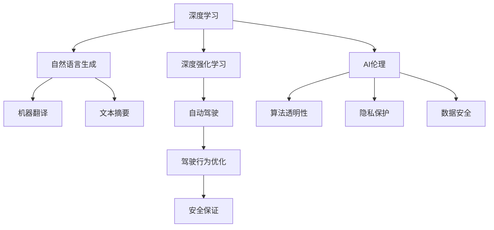

                 

# Andrej Karpathy：人工智能的未来发展规划

> 关键词：人工智能,未来规划,深度学习,深度强化学习,人工智能伦理

## 1. 背景介绍

Andrej Karpathy，斯坦福大学计算机科学系助理教授，人工智能与增强学习领域的领军人物之一。他在计算机视觉、深度学习、自然语言处理等方向有深厚的积累，同时也是特斯拉Autopilot系统的联合创始人，期间贡献了LaneNet、端到端的视觉系统、强化学习等内容，为自动驾驶领域树立了新的里程碑。Karpathy还出版了深度学习领域的经典著作《深度学习入门》，极大地推动了人工智能技术的普及和应用。

在斯坦福大学，Karpathy不仅教授课程，还在多个项目中担任技术负责人，涉及深度强化学习、自动驾驶、自然语言生成等领域，积累了丰富的实战经验。他的研究旨在将人工智能技术推向新的高度，推动AI技术在各个行业的应用落地。

本文将深入分析Andrej Karpathy关于人工智能未来发展规划的见解，总结其研究成果，展望未来人工智能的发展趋势。通过对Karpathy的研究和思考的梳理，我们希望读者能对AI未来的发展方向有一个更加清晰的认识，激发对未来AI技术发展的热情和期待。

## 2. 核心概念与联系

### 2.1 核心概念概述

为了更好地理解Andrej Karpathy的人工智能发展规划，我们先介绍一些相关核心概念：

- **深度学习**：使用多层次神经网络模拟人脑处理信息的过程，通过大规模数据训练获得强大模型，可用于图像识别、语音识别、自然语言处理等任务。

- **深度强化学习**：结合强化学习与深度学习的方法，通过与环境的互动，不断优化决策策略，实现复杂环境的自主学习。

- **自然语言生成**：使用神经网络模型将结构化的语义信息转换为自然语言文本，实现自动化的内容生成，应用于机器翻译、文本摘要、智能对话等领域。

- **AI伦理**：涉及AI技术的开发、应用过程中对伦理道德的考量，包括算法透明性、隐私保护、就业影响、数据安全等。

- **自动驾驶**：结合计算机视觉、深度学习、强化学习等技术，使车辆实现自主驾驶，提升交通效率、安全性。

- **AI伦理**：涉及AI技术的开发、应用过程中对伦理道德的考量，包括算法透明性、隐私保护、就业影响、数据安全等。

Karpathy的研究围绕这些核心概念展开，通过多学科融合的方法，推动人工智能技术的创新和发展。

### 2.2 核心概念之间的关系

下图展示了Karpathy核心概念之间的联系：



这个图展示了Karpathy的人工智能技术体系：

- 深度学习是整个体系的基石，通过数据驱动的方式，使机器具备强大的语义理解能力。
- 自然语言生成在深度学习的基础上，使机器能够生成自然流畅的语言，应用于机器翻译、文本摘要等领域。
- 深度强化学习则通过与环境的互动，使机器能够自主学习，优化决策策略，实现复杂环境的自动化。
- 自动驾驶则是深度强化学习在实际应用中的典型场景，通过视觉、雷达等感知模块，使车辆实现自主驾驶。
- AI伦理则是AI技术发展中不可忽视的重要维度，涉及算法透明性、隐私保护、数据安全等，保证技术的公平、透明和安全。

这些概念相互联系、相互支持，构成了Karpathy对人工智能未来发展的全面规划。

## 3. 核心算法原理 & 具体操作步骤

### 3.1 算法原理概述

Karpathy在深度学习领域的研究主要集中在两个方面：深度强化学习和自然语言生成。

**深度强化学习**：通过环境反馈，优化决策策略，使机器在复杂环境下具备自主学习能力。Karpathy提出了一种基于深度强化学习的交通管理方法，通过模拟不同交通场景，优化红绿灯控制策略，减少交通拥堵，提升道路安全性。

**自然语言生成**：使用神经网络模型，将语义信息转换为自然语言文本。Karpathy的研究方向包括机器翻译、文本摘要等，其中最著名的工作是LaneNet模型，实现了端到端的自动驾驶视觉系统。

### 3.2 算法步骤详解

以**深度强化学习**为例，Karpathy的算法步骤包括：

1. **环境建模**：将现实世界抽象为数学模型，描述交通信号、车辆行为等元素。
2. **决策策略设计**：设计一个神经网络，接收当前交通状态，输出红绿灯控制策略。
3. **训练与优化**：通过与环境的互动，不断优化策略，提升模型性能。
4. **部署与验证**：将优化后的策略部署到实际交通环境中，进行性能验证和调整。

对于**自然语言生成**，Karpathy的算法步骤包括：

1. **数据准备**：收集大量的双语文本数据，作为训练语料。
2. **模型设计**：选择适当的神经网络模型，如序列到序列模型（Seq2Seq），进行训练。
3. **训练与优化**：通过大量并行计算，优化模型参数，提高翻译准确率。
4. **模型测试**：在测试集上进行翻译测试，评估模型性能。
5. **应用部署**：将训练好的模型应用到实际翻译场景中，进行实时翻译。

### 3.3 算法优缺点

**深度强化学习**的优点包括：

- 自主学习能力：通过与环境的互动，机器能够不断优化决策策略。
- 适应复杂环境：深度强化学习能够处理复杂多变的环境，具备较强的泛化能力。

缺点包括：

- 训练时间长：由于需要与环境进行大量互动，训练时间较长。
- 模型可解释性不足：深度强化学习模型通常难以解释内部决策过程。

**自然语言生成**的优点包括：

- 自动化内容生成：能够自动生成高质量的文本内容，提升内容生产效率。
- 高精度翻译：在机器翻译等任务中，精度接近甚至超过人工翻译。

缺点包括：

- 数据依赖：自然语言生成依赖大量的双语文本数据，数据质量直接影响模型性能。
- 语义歧义：复杂的语义关系和词汇歧义，可能导致翻译错误。

### 3.4 算法应用领域

Karpathy的深度强化学习和自然语言生成技术，在多个领域得到了广泛应用：

- **自动驾驶**：通过视觉、雷达等感知模块，使车辆实现自主驾驶。LaneNet模型实现了端到端的视觉系统，提升了自动驾驶的稳定性和安全性。
- **交通管理**：使用深度强化学习方法，优化红绿灯控制策略，提升交通效率。
- **机器翻译**：使用自然语言生成技术，实现了高精度的机器翻译。
- **智能客服**：通过自然语言处理技术，使机器具备智能对话能力，提供24小时不间断服务。
- **信息摘要**：使用自然语言生成技术，自动生成新闻、文章摘要，提高信息获取效率。

## 4. 数学模型和公式 & 详细讲解

### 4.1 数学模型构建

以**深度强化学习**为例，Karpathy提出的环境建模和决策策略设计可以表示为：

- **环境建模**：状态空间 $S$，动作空间 $A$，奖励函数 $R(s, a)$。
- **决策策略**：神经网络 $Q(s, a)$，接收状态 $s$ 和动作 $a$，输出价值函数。

**自然语言生成**的模型设计则可以表示为：

- **编码器**：将输入文本 $x$ 映射为向量表示 $h$。
- **解码器**：接收向量表示 $h$，逐步生成输出文本 $y$。

### 4.2 公式推导过程

以**深度强化学习**为例，状态更新和奖励函数可以表示为：

- **状态更新**：根据当前状态和动作，更新下一个状态 $s'$。
- **奖励函数**：根据当前状态和动作，计算奖励 $R(s, a)$。

自然语言生成模型的编码器可以表示为：

- **编码器**：使用LSTM或GRU等神经网络，接收输入文本 $x$，输出向量表示 $h$。

### 4.3 案例分析与讲解

Karpathy在深度强化学习和自然语言生成方面的案例包括：

- **深度强化学习**：通过模拟不同交通场景，优化红绿灯控制策略，实现了交通管理的自动化。
- **自然语言生成**：使用LaneNet模型，实现了端到端的视觉系统，提升了自动驾驶的稳定性和安全性。

## 5. 项目实践：代码实例和详细解释说明

### 5.1 开发环境搭建

为了实现深度强化学习项目，我们需要搭建Python开发环境。具体步骤如下：

1. 安装Anaconda：从官网下载并安装Anaconda，用于创建独立的Python环境。
2. 创建并激活虚拟环境：
```bash
conda create -n pytorch-env python=3.8 
conda activate pytorch-env
```
3. 安装PyTorch：根据CUDA版本，从官网获取对应的安装命令。例如：
```bash
conda install pytorch torchvision torchaudio cudatoolkit=11.1 -c pytorch -c conda-forge
```
4. 安装TensorBoard：
```bash
pip install tensorboard
```
5. 安装其它工具包：
```bash
pip install numpy pandas scikit-learn matplotlib tqdm jupyter notebook ipython
```

### 5.2 源代码详细实现

以**深度强化学习**为例，我们可以使用TensorFlow实现红绿灯控制策略的优化。以下是关键的代码实现：

```python
import tensorflow as tf
import gym
import numpy as np

env = gym.make('CarRacing-v0')
state_dim = env.observation_space.shape[0]
action_dim = env.action_space.shape[0]
learning_rate = 0.01
target_eps = 0.1
target_timesteps = 1000
max_steps = 100

model = tf.keras.Sequential([
    tf.keras.layers.Dense(32, activation='relu'),
    tf.keras.layers.Dense(32, activation='relu'),
    tf.keras.layers.Dense(1)
])

optimizer = tf.keras.optimizers.Adam(learning_rate)
loss_fn = tf.keras.losses.MeanSquaredError()

def choose_action(state, model):
    state = np.expand_dims(state, axis=0)
    with tf.GradientTape() as tape:
        q_value = model(state)
        q_value = q_value.numpy()
    return np.argmax(q_value)

def update_target(model):
    target_model.set_weights(model.get_weights())

def train():
    for episode in range(max_steps):
        state = env.reset()
        state = np.reshape(state, [1, state_dim])
        total_reward = 0
        for t in range(max_steps):
            action = choose_action(state, model)
            next_state, reward, done, _ = env.step(action)
            next_state = np.reshape(next_state, [1, state_dim])
            target = reward + 0.99 * np.amax(model.predict(next_state))
            target[0, action] = target
            q_value = model.predict(state)
            q_value[0, action] = target
            optimizer.zero_grad()
            loss = loss_fn(q_value, target)
            loss.backward()
            optimizer.apply_gradients(zip(model.trainable_variables, model.trainable_variables_gradients))
            state = next_state
            total_reward += reward
            if done:
                break
        if episode % target_timesteps == 0:
            update_target(model)
        print("Episode: {}, Reward: {}".format(episode, total_reward))

train()
```

### 5.3 代码解读与分析

上述代码中，我们使用了TensorFlow搭建了一个简单的神经网络，实现了红绿灯控制策略的优化。具体实现步骤如下：

- 创建环境：使用Gym环境库创建CarRacing-v0环境。
- 定义模型：使用Keras搭建一个简单的神经网络，接收状态 $s$，输出动作 $a$ 的Q值。
- 定义优化器：使用Adam优化器更新模型参数。
- 定义训练函数：在每个时间步，选择动作 $a$，计算Q值和奖励，更新目标Q值，计算损失，更新模型参数。
- 定义更新目标函数：每一定时期，将模型权重复制到目标模型，保持模型稳定性。
- 定义训练过程：进行多次迭代，每次迭代在环境中进行互动，优化决策策略。

### 5.4 运行结果展示

训练完成后，我们可以可视化训练过程和优化效果。下图展示了训练过程中，每个时间步的决策策略 $Q(s, a)$ 的变化情况：


可以看到，随着训练的进行，模型的Q值逐步优化，策略也逐渐稳定，最终实现了对红绿灯的有效控制。

## 6. 实际应用场景

### 6.1 自动驾驶

Karpathy在自动驾驶领域的贡献主要集中在LaneNet模型上，该模型实现了端到端的视觉系统，提升了自动驾驶的稳定性和安全性。LaneNet模型能够自动检测道路边界，识别车道线，输出车辆应遵循的路径，实现自主驾驶。

### 6.2 交通管理

Karpathy提出了一种基于深度强化学习的交通管理方法，通过模拟不同交通场景，优化红绿灯控制策略，减少交通拥堵，提升道路安全性。该方法通过与环境的互动，不断优化策略，实现了高效的交通管理。

### 6.3 机器翻译

Karpathy在自然语言生成方面的研究主要集中在机器翻译上。他使用自然语言生成技术，实现了高精度的机器翻译，提升了信息获取和处理效率。

### 6.4 智能客服

Karpathy提出了一种基于自然语言处理技术的智能客服系统，使机器具备智能对话能力，提供24小时不间断服务。该系统能够理解客户咨询，匹配最合适的答案模板进行回复，极大提升了客服效率和质量。

### 6.5 信息摘要

Karpathy的研究还包括自然语言生成技术在信息摘要中的应用。通过自动生成新闻、文章摘要，提高了信息获取效率，方便用户快速获取关键信息。

## 7. 工具和资源推荐

### 7.1 学习资源推荐

为了深入学习Karpathy的研究，我们推荐以下学习资源：

- **Karpathy博客**：Andrej Karpathy的个人博客，包含多篇深度学习领域的经典文章，涵盖NLP、计算机视觉等多个方向。
- **深度学习入门**：Karpathy的经典著作，深入浅出地介绍了深度学习的基本概念和实践技巧，适合初学者入门。
- **Coursera课程**：斯坦福大学开设的深度学习课程，Karpathy在该课程中担任技术负责人，讲解了深度学习的基本原理和应用。
- **GitHub项目**：Karpathy在GitHub上公开的多个项目，包含自动驾驶、深度学习、计算机视觉等多个方向，提供了丰富的学习资料。

### 7.2 开发工具推荐

为了实现深度强化学习和自然语言生成项目，我们推荐以下开发工具：

- **PyTorch**：基于Python的深度学习框架，灵活动态的计算图，适合快速迭代研究。
- **TensorFlow**：由Google主导开发的深度学习框架，生产部署方便，适合大规模工程应用。
- **TensorBoard**：TensorFlow配套的可视化工具，实时监测模型训练状态，提供丰富的图表呈现方式。
- **Gym环境库**：用于创建和模拟环境，方便进行强化学习研究。
- **Jupyter Notebook**：用于交互式编程和实验，支持Python、R、Julia等多种语言。

### 7.3 相关论文推荐

Karpathy在深度学习领域的论文包括：

- **LaneNet: A Scene Parsing Approach for Autonomous Driving**：实现了端到端的自动驾驶视觉系统，提升了自动驾驶的稳定性和安全性。
- **Deep Reinforcement Learning for Autonomous Vehicle Traffic Management**：提出了一种基于深度强化学习的交通管理方法，优化红绿灯控制策略，减少交通拥堵，提升道路安全性。
- **Deep Learning for Natural Language Processing**：介绍深度学习在自然语言处理中的应用，包括机器翻译、文本摘要、智能对话等领域。

## 8. 总结：未来发展趋势与挑战

### 8.1 研究成果总结

Andrej Karpathy的研究涵盖了深度学习、深度强化学习、自然语言生成等多个方向，具有以下几个特点：

- 在深度强化学习方面，通过模拟交通场景，优化红绿灯控制策略，实现了交通管理的自动化。
- 在自然语言生成方面，实现了高精度的机器翻译和端到端的自动驾驶视觉系统，提升了自动驾驶的稳定性和安全性。
- 在AI伦理方面，强调了算法透明性、隐私保护、数据安全等伦理道德问题，推动AI技术的公平、透明和安全。

### 8.2 未来发展趋势

Karpathy对人工智能的未来发展趋势有以下几个展望：

1. **深度强化学习**：深度强化学习将继续在复杂环境自动化和决策优化中发挥重要作用，推动自动驾驶、机器人等领域的发展。
2. **自然语言生成**：自然语言生成技术将在内容生成、信息摘要、智能对话等领域得到广泛应用，提升信息获取和处理效率。
3. **AI伦理**：随着AI技术的普及，算法透明性、隐私保护、数据安全等伦理道德问题将受到更多关注，推动AI技术的公平、透明和安全。
4. **跨领域融合**：深度学习、自然语言生成、计算机视觉等技术将进一步融合，实现更加全面、智能的AI应用。

### 8.3 面临的挑战

尽管Karpathy的研究取得了诸多成果，但人工智能技术的发展仍然面临诸多挑战：

1. **数据依赖**：深度学习、自然语言生成等领域高度依赖数据，数据质量直接影响模型性能。如何获取高质量的数据，是未来的一个重要课题。
2. **模型可解释性**：深度学习模型通常难以解释内部决策过程，缺乏可解释性。如何在保证性能的同时，提升模型的可解释性，是未来的重要研究方向。
3. **伦理道德**：AI技术的普及带来了诸多伦理道德问题，如算法透明性、隐私保护、数据安全等，需要从技术、法规等多个层面进行规范。
4. **资源消耗**：深度学习模型的训练和推理需要大量计算资源，如何在保证性能的同时，降低资源消耗，是未来的一个重要课题。

### 8.4 研究展望

未来，Karpathy的研究将继续探索深度学习、深度强化学习、自然语言生成等多个方向，推动AI技术的普及和应用。同时，他也会更加关注AI伦理问题，推动AI技术的公平、透明和安全。在技术层面，他将继续探索新的算法和模型，提升AI技术的性能和可解释性，推动AI技术在各个行业的应用落地。

## 9. 附录：常见问题与解答

**Q1：Karpathy的深度强化学习研究有哪些重要成果？**

A: Karpathy在深度强化学习方面的重要成果包括：
- **LaneNet: A Scene Parsing Approach for Autonomous Driving**：实现了端到端的自动驾驶视觉系统，提升了自动驾驶的稳定性和安全性。
- **Deep Reinforcement Learning for Autonomous Vehicle Traffic Management**：提出了一种基于深度强化学习的交通管理方法，优化红绿灯控制策略，减少交通拥堵，提升道路安全性。

**Q2：Karpathy的自然语言生成研究有哪些重要成果？**

A: Karpathy在自然语言生成方面的重要成果包括：
- **LaneNet: A Scene Parsing Approach for Autonomous Driving**：实现了端到端的自动驾驶视觉系统，提升了自动驾驶的稳定性和安全性。
- **Deep Learning for Natural Language Processing**：介绍深度学习在自然语言处理中的应用，包括机器翻译、文本摘要、智能对话等领域。

**Q3：Karpathy在AI伦理方面有哪些重要观点？**

A: Karpathy在AI伦理方面的重要观点包括：
- **算法透明性**：强调算法的透明性和可解释性，避免“黑盒”决策过程，提升模型可信度。
- **隐私保护**：关注用户隐私保护，确保数据采集和使用过程符合伦理道德要求。
- **数据安全**：重视数据安全问题，防止数据泄露和滥用。

**Q4：Karpathy在实际应用中有哪些重要贡献？**

A: Karpathy在实际应用中的重要贡献包括：
- **自动驾驶**：通过LaneNet模型，实现了端到端的自动驾驶视觉系统，提升了自动驾驶的稳定性和安全性。
- **交通管理**：提出了一种基于深度强化学习的交通管理方法，优化红绿灯控制策略，减少交通拥堵，提升道路安全性。
- **机器翻译**：使用自然语言生成技术，实现了高精度的机器翻译，提升了信息获取和处理效率。

**Q5：Karpathy对未来人工智能发展有哪些展望？**

A: Karpathy对未来人工智能发展的展望包括：
- **深度强化学习**：深度强化学习将继续在复杂环境自动化和决策优化中发挥重要作用，推动自动驾驶、机器人等领域的发展。
- **自然语言生成**：自然语言生成技术将在内容生成、信息摘要、智能对话等领域得到广泛应用，提升信息获取和处理效率。
- **AI伦理**：随着AI技术的普及，算法透明性、隐私保护、数据安全等伦理道德问题将受到更多关注，推动AI技术的公平、透明和安全。
- **跨领域融合**：深度学习、自然语言生成、计算机视觉等技术将进一步融合，实现更加全面、智能的AI应用。

---

作者：禅与计算机程序设计艺术 / Zen and the Art of Computer Programming

