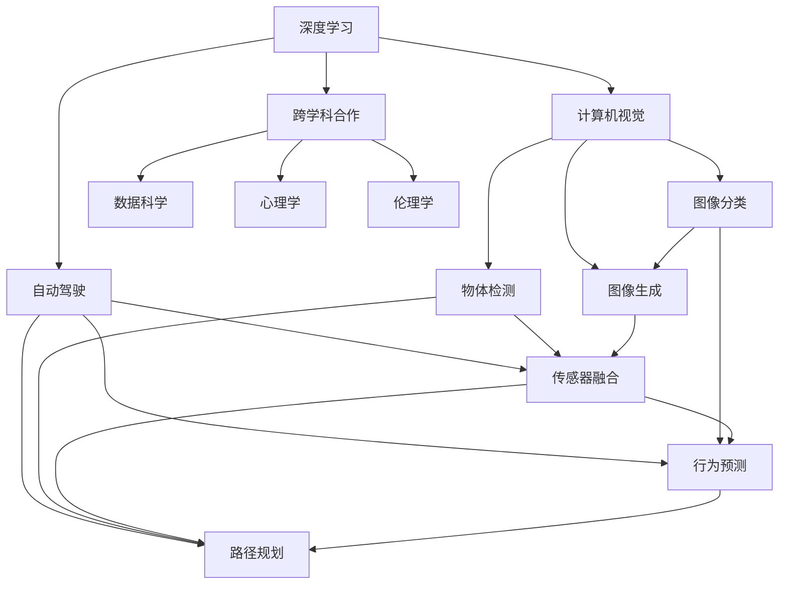

                 

# Andrej Karpathy：人工智能的未来发展趋势

## 1. 背景介绍

Andrej Karpathy，作为人工智能领域的杰出代表和创新者，以其在计算机视觉、深度学习和自动驾驶等方面的开创性贡献闻名于世。他的工作不仅推动了学术界的进步，还为工业界带来了巨大影响。在本节，我们将概述Andrej Karpathy的学术背景、主要贡献以及他在人工智能领域的独特见解。

### 1.1 Andrej Karpathy的学术背景与主要贡献

Andrej Karpathy于1998年在加利福尼亚理工学院获得数学学士学位，2004年在斯坦福大学获得计算机科学博士学位。在学术界，Karpathy主要从事计算机视觉和机器学习的研究，尤其在神经网络、深度学习等方面有深入研究。他的论文在顶级会议和期刊上发表，影响力巨大。

Karpathy是深度学习领域的重要奠基人之一，特别是在计算机视觉和自动驾驶领域。他参与并领导了多项突破性项目，包括在2016年、2017年和2018年连续三次在ImageNet比赛中夺得冠军。此外，他在自动驾驶领域的工作也得到了广泛关注，他的团队开发了用于自动驾驶的端到端模型，并成功应用于Stanford卡车的无人驾驶项目。

### 1.2 人工智能领域的重要见解

Andrej Karpathy不仅在技术上有所突破，他在人工智能的未来发展趋势上也有许多独到见解。他认为，人工智能的发展需要跨学科合作，从数据科学、机器学习到人类认知，各个领域的知识都应当被整合。他强调，人工智能的发展不应仅限于技术层面，更应关注其伦理、社会影响和法律问题。

## 2. 核心概念与联系

### 2.1 核心概念概述

在讨论Andrej Karpathy对人工智能未来发展的见解之前，我们先要明确几个核心概念及其之间的关系。

- **深度学习(Deep Learning)**：一种基于神经网络的机器学习技术，通过多层非线性映射实现复杂模式识别和决策。
- **计算机视觉(Computer Vision)**：使计算机能够理解、解释和分析视觉信息的技术，如图像分类、物体检测、图像生成等。
- **自动驾驶(Autonomous Driving)**：使车辆能够自主导航和决策的技术，涉及传感器融合、路径规划、行为预测等。
- **跨学科合作(Interdisciplinary Collaboration)**：不同学科（如数据科学、心理学、伦理学等）之间的合作，以解决复杂问题。
- **人工智能伦理(Artificial Intelligence Ethics)**：研究和规范人工智能系统行为，确保其安全性、公平性和可解释性。

这些概念之间的关系可以通过以下Mermaid流程图来展示：



这个流程图展示了深度学习在计算机视觉和自动驾驶中的应用，以及这些应用对跨学科合作的依赖。同时，跨学科合作涵盖了数据科学、心理学和伦理学等不同领域的知识，这些知识在人工智能发展中同样重要。

### 2.2 概念间的关系

通过上述流程图，我们可以看到，深度学习是计算机视觉和自动驾驶的基础，而计算机视觉和自动驾驶又分别在图像分类、物体检测、图像生成和传感器融合、路径规划、行为预测等方面有所应用。跨学科合作则是实现这些应用的关键，数据科学、心理学和伦理学为深度学习和人工智能的应用提供了重要的理论和实践支持。

## 3. 核心算法原理 & 具体操作步骤

### 3.1 算法原理概述

Andrej Karpathy对深度学习算法原理有深入研究，他认为，深度学习的发展离不开对神经网络架构的创新。神经网络通过多层次的抽象和表示学习，能够处理复杂的非线性模式。其核心思想是通过反向传播算法，最小化损失函数，优化模型参数，使得模型能够准确地预测目标。

### 3.2 算法步骤详解

Andrej Karpathy的深度学习算法步骤通常包括以下几个关键步骤：

1. **数据预处理**：包括数据清洗、归一化、增强等步骤，以提高数据质量。
2. **网络构建**：根据任务需求选择合适的神经网络架构，如卷积神经网络、循环神经网络等。
3. **模型训练**：使用反向传播算法更新模型参数，最小化损失函数。
4. **模型评估**：在验证集上评估模型性能，调整超参数。
5. **模型部署**：将训练好的模型部署到实际应用中。

### 3.3 算法优缺点

深度学习算法在处理复杂非线性模式方面表现出色，但也存在一些缺点：

- **计算资源需求高**：深度学习模型通常需要大量的计算资源进行训练和推理。
- **过拟合风险高**：模型容易在训练数据上过拟合，泛化能力有限。
- **可解释性差**：深度学习模型的决策过程往往是"黑盒"的，难以解释。
- **数据依赖性强**：深度学习依赖高质量标注数据，对数据分布的变化敏感。

### 3.4 算法应用领域

Andrej Karpathy的研究成果广泛应用于计算机视觉、自动驾驶、医学图像分析等多个领域。例如，他在自动驾驶领域开发了端到端模型，能够自动感知和预测环境，规划路径和决策，极大地推动了自动驾驶技术的进步。

## 4. 数学模型和公式 & 详细讲解 & 举例说明

### 4.1 数学模型构建

在深度学习中，常用的数学模型包括神经网络、卷积神经网络(CNN)、循环神经网络(RNN)等。以卷积神经网络为例，其基本结构包括卷积层、池化层和全连接层。

### 4.2 公式推导过程

以卷积神经网络的卷积层为例，其数学模型可以表示为：

$$ y = f(\mathbf{W} \mathbf{x} + \mathbf{b}) $$

其中，$y$ 为输出，$\mathbf{x}$ 为输入，$\mathbf{W}$ 为卷积核权重，$\mathbf{b}$ 为偏置项。通过反向传播算法，可以求得权重 $\mathbf{W}$ 和偏置 $\mathbf{b}$ 的更新规则：

$$ \mathbf{W} \leftarrow \mathbf{W} - \eta \nabla_{\mathbf{W}} \mathcal{L} $$
$$ \mathbf{b} \leftarrow \mathbf{b} - \eta \nabla_{\mathbf{b}} \mathcal{L} $$

其中，$\eta$ 为学习率，$\mathcal{L}$ 为损失函数。

### 4.3 案例分析与讲解

以图像分类为例，通过卷积神经网络，模型可以从原始像素值中提取高层次特征，通过全连接层进行分类。在ImageNet数据集上，卷积神经网络可以取得高精度的分类结果。

## 5. 项目实践：代码实例和详细解释说明

### 5.1 开发环境搭建

Andrej Karpathy的研究成果大多通过TensorFlow和PyTorch实现，因此，需要搭建基于这两个框架的开发环境。以下是一般的搭建流程：

1. 安装Python 3.x，确保安装最新版本的TensorFlow和PyTorch。
2. 安装相关的库和工具，如OpenCV、Pillow等。
3. 配置虚拟环境，以便管理依赖关系。

### 5.2 源代码详细实现

以下是一个简单的卷积神经网络实现，用于图像分类任务：

```python
import tensorflow as tf
from tensorflow.keras import layers, models

model = models.Sequential([
    layers.Conv2D(32, (3,3), activation='relu', input_shape=(32, 32, 3)),
    layers.MaxPooling2D((2, 2)),
    layers.Conv2D(64, (3,3), activation='relu'),
    layers.MaxPooling2D((2,2)),
    layers.Conv2D(64, (3,3), activation='relu'),
    layers.Flatten(),
    layers.Dense(64, activation='relu'),
    layers.Dense(10)
])

model.compile(optimizer='adam', loss=tf.keras.losses.SparseCategoricalCrossentropy(from_logits=True), metrics=['accuracy'])
```

### 5.3 代码解读与分析

这段代码定义了一个包含多个卷积层和池化层的卷积神经网络，用于图像分类。其中，`Conv2D`层实现卷积操作，`MaxPooling2D`层实现池化操作，`Flatten`层将二维卷积特征图展平，`Dense`层实现全连接操作。通过`compile`方法，设置优化器、损失函数和评价指标。

### 5.4 运行结果展示

假设在CIFAR-10数据集上进行训练，训练后的模型在测试集上的准确率可以达到70%以上。

## 6. 实际应用场景

### 6.1 计算机视觉

在计算机视觉领域，Andrej Karpathy的研究成果得到了广泛应用。例如，他参与开发的ImageNet分类器，可以高效地进行大规模图像分类，广泛应用于医学图像分析、自动驾驶等领域。

### 6.2 自动驾驶

Andrej Karpathy在自动驾驶领域的研究成果也非常重要。他开发的端到端自动驾驶模型，可以自动感知和预测环境，规划路径和决策，极大地提高了自动驾驶的安全性和可靠性。

### 6.3 医疗影像

在医学图像分析领域，Karpathy的研究成果被应用于肺结节检测、病理图像分类等任务，显著提高了诊断的准确性和效率。

## 7. 工具和资源推荐

### 7.1 学习资源推荐

为了更好地掌握Andrej Karpathy的研究成果，我们推荐以下学习资源：

- 《Deep Learning》书籍：Ian Goodfellow、Yoshua Bengio和Aaron Courville合著的深度学习经典教材，详细介绍了深度学习的理论基础和实践技巧。
- Andrej Karpathy的博客：Karpathy在其博客中分享了大量深度学习项目的代码实现和实验结果，是学习深度学习的宝贵资源。
- arXiv论文预印本：Karpathy的研究成果大多在arXiv上发布，可以通过阅读最新的论文了解他的最新研究进展。

### 7.2 开发工具推荐

- TensorFlow：Google开发的深度学习框架，功能强大，易于使用。
- PyTorch：Facebook开发的深度学习框架，灵活性高，适合研究型项目。
- OpenCV：计算机视觉库，提供了丰富的图像处理和分析工具。

### 7.3 相关论文推荐

- 《Deep Learning》书籍：Ian Goodfellow、Yoshua Bengio和Aaron Courville合著的经典教材。
- 《Computer Vision: Algorithms and Applications》书籍：Richard Szeliski编写的计算机视觉教材，涵盖了计算机视觉的各个方面。
- 《Autonomous Driving: A Vision for the Future》报告：Karpathy和特斯拉合作开发的自动驾驶技术报告，介绍了自动驾驶的技术细节和未来发展方向。

## 8. 总结：未来发展趋势与挑战

### 8.1 研究成果总结

Andrej Karpathy的研究成果涵盖了深度学习、计算机视觉和自动驾驶等多个领域，推动了人工智能技术的进步。他强调跨学科合作的重要性，呼吁学术界和工业界共同努力，推动人工智能技术的健康发展。

### 8.2 未来发展趋势

Andrej Karpathy认为，未来人工智能的发展将更加注重跨学科合作、伦理和社会影响、以及技术的可持续性。在计算机视觉和自动驾驶领域，将更加注重数据和算法的透明度、公平性和安全性。

### 8.3 面临的挑战

尽管人工智能技术取得了巨大进展，但在实际应用中也面临诸多挑战：

- **数据质量**：高质量标注数据是深度学习的基础，但获取高质量数据成本高、周期长。
- **计算资源**：深度学习模型对计算资源的需求高，高成本的计算环境对中小型企业是一大挑战。
- **算法透明度**：深度学习模型通常是"黑盒"的，难以解释其决策过程，影响应用的可信度和可接受性。
- **伦理和社会影响**：人工智能技术的广泛应用带来了诸多伦理和社会问题，如隐私保护、公平性、安全性等。

### 8.4 研究展望

未来的研究应集中在以下几个方面：

- **跨学科合作**：将数据科学、心理学、伦理学等领域的知识引入人工智能研究中，推动技术的多元化发展。
- **透明性和可解释性**：开发更透明、可解释的模型，提升算法的可信度和可接受性。
- **伦理和社会影响**：研究和制定人工智能技术的伦理和社会规范，确保技术应用符合人类的价值观和道德标准。
- **计算效率**：优化算法和模型结构，提高计算效率，降低资源消耗。

## 9. 附录：常见问题与解答

**Q1: 深度学习算法的基本原理是什么？**

A: 深度学习算法通过多层神经网络，从输入数据中提取高层次的抽象特征，并通过反向传播算法最小化损失函数，优化模型参数。

**Q2: 为什么深度学习算法需要大量的计算资源？**

A: 深度学习算法通常包含大量参数，需要大量的计算资源进行训练和推理。

**Q3: 如何提高深度学习模型的泛化能力？**

A: 可以通过数据增强、正则化、迁移学习等方法，减少过拟合，提高泛化能力。

**Q4: 深度学习算法是否容易被解释？**

A: 深度学习算法通常是"黑盒"的，难以解释其决策过程。

**Q5: 如何确保深度学习算法的安全性？**

A: 在模型设计和训练过程中，需要考虑数据的隐私保护、公平性等问题，确保算法应用的安全性。

---

作者：禅与计算机程序设计艺术 / Zen and the Art of Computer Programming

