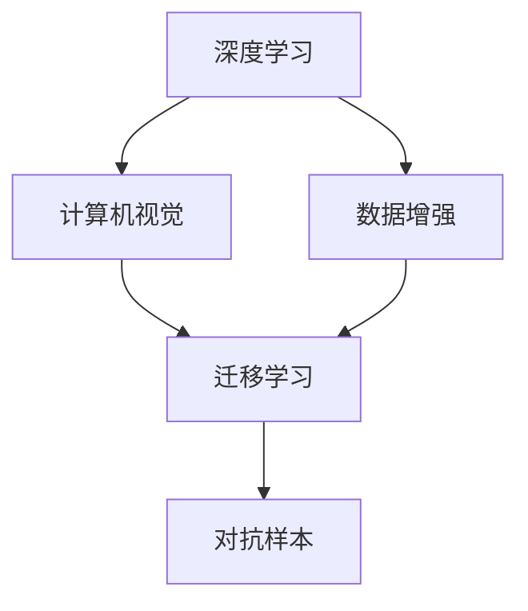

                 

## 1. 背景介绍

### 1.1 问题由来
人工智能（AI）领域的一个核心议题是数据的获取和利用。数据对AI模型的性能有着至关重要的影响，而这一影响在深度学习和计算机视觉（CV）中尤为明显。在大数据时代，如何高效地获取、清洗、处理和利用数据，成为了深度学习研究的重要方向。

Andrej Karpathy，作为深度学习领域的重要人物，一直在推动数据在AI模型中的高效应用。在各类讲座和论文中，他反复强调了数据对AI成功的重要性，并提出了许多实用的建议和思考。本文将通过分析他的核心观点，探讨数据在AI模型中的重要性，并提供实际应用中的方法论。

### 1.2 问题核心关键点
数据在AI模型中的重要性主要体现在以下几个方面：

- **数据量和多样性**：AI模型的性能很大程度上取决于所训练数据的数量和多样性。更多、更丰富、更复杂的数据能帮助模型更好地捕捉到特征，减少过拟合。
- **数据质量**：数据质量直接影响AI模型的准确性和泛化能力。标注数据的不准确、数据预处理不当等问题，可能导致模型性能大打折扣。
- **数据分布**：AI模型的泛化性能在很大程度上依赖于训练数据的分布与测试数据的分布是否一致。分布不一致可能导致模型泛化能力弱，性能下降。
- **数据增强**：通过数据增强技术，如旋转、平移、裁剪等，可以扩展数据集，增加模型鲁棒性，提高性能。

Karpathy通过多年的研究和教学，深入探讨了数据在AI模型中的重要性，并提出了诸多实用的方法和思考，本文将通过详细解析他的核心观点，为读者提供深入的指导。

## 2. 核心概念与联系

### 2.1 核心概念概述

为更好地理解Andrej Karpathy对数据重要性的见解，本节将介绍几个关键概念：

- **深度学习**：使用多层神经网络进行学习的一种机器学习方法，通过复杂的多层结构，可以捕捉到高层次的特征。
- **计算机视觉（CV）**：AI中的一个重要分支，使用深度学习模型处理图像和视频数据，进行识别、分类、生成等任务。
- **数据增强**：通过对原始数据进行各种变换，增加数据集多样性，提升模型泛化能力。
- **迁移学习**：将在大规模数据上预训练的模型迁移到小数据集上，提高模型性能。
- **对抗样本**：在数据中故意引入的小扰动，使得AI模型出现错误预测。

这些概念之间的逻辑关系可以通过以下Mermaid流程图来展示：



这个流程图展示了深度学习和计算机视觉中的关键概念及其之间的关系：

1. 深度学习是AI的基础，用于处理复杂的数据和结构。
2. 计算机视觉是深度学习的一个重要应用领域，使用图像和视频数据进行理解和生成。
3. 数据增强可以提升模型的泛化能力，通过增加数据多样性。
4. 迁移学习可以在小数据集上利用预训练模型的知识，提升模型性能。
5. 对抗样本测试模型的鲁棒性，挑战模型的泛化能力。

### 2.2 概念间的关系

这些核心概念之间存在着紧密的联系，形成了AI和CV技术的完整框架。下面是具体的联系描述：

1. **深度学习与计算机视觉**：深度学习是计算机视觉的核心技术，为图像和视频数据的处理提供了强大的能力。
2. **数据增强与迁移学习**：数据增强通过增加数据多样性，提升了迁移学习的效果，使得小数据集上的模型也能获得很好的性能。
3. **对抗样本与模型鲁棒性**：对抗样本测试模型的鲁棒性，通过提高模型对小扰动的容忍度，进一步提升了模型的泛化能力。
4. **迁移学习与模型泛化**：迁移学习通过在大规模数据集上预训练模型，提高了模型在小数据集上的泛化能力，减少了数据需求。

通过这些概念的逻辑联系，我们可以看到数据在AI和CV模型中的重要性，以及如何通过技术手段优化数据使用，提升模型性能。

## 3. 核心算法原理 & 具体操作步骤
### 3.1 算法原理概述

Karpathy强调，在AI模型中，数据不仅决定了模型的精度，还决定了模型能否泛化到未见过的数据上。高质量、多样化的数据是模型高性能的关键。

基于此，Karpathy提出了一系列实用的方法论，包括数据清洗、数据增强、迁移学习等，以提高数据质量和模型性能。以下我们将详细讲解这些方法的具体实现。

### 3.2 算法步骤详解

**数据清洗**：

1. **数据收集**：收集所需数据，确保数据来源多样、质量可靠。
2. **数据预处理**：包括数据去重、去噪、归一化等预处理操作，确保数据质量。
3. **标注数据**：标注数据是训练模型时的关键，确保标注数据准确、一致。

**数据增强**：

1. **数据变换**：通过旋转、平移、裁剪等变换，扩展数据集。
2. **生成数据**：利用生成对抗网络（GAN）等生成模型，生成额外的训练数据。
3. **随机变换**：在训练过程中随机变换数据，增加模型泛化能力。

**迁移学习**：

1. **预训练模型**：在大规模数据集上预训练模型，如ImageNet等。
2. **微调**：在特定任务上微调预训练模型，提升模型性能。
3. **融合迁移学习**：将多个预训练模型的知识融合，提高模型泛化能力。

### 3.3 算法优缺点

**数据清洗**：
- **优点**：提高数据质量，减少噪声和错误，提升模型性能。
- **缺点**：数据清洗过程繁琐，需要大量人工干预。

**数据增强**：
- **优点**：增加数据多样性，提升模型泛化能力，减少过拟合。
- **缺点**：数据增强可能需要大量计算资源，增加训练时间。

**迁移学习**：
- **优点**：利用大规模数据集的预训练知识，减少数据需求，提升模型性能。
- **缺点**：需要合适的预训练模型和任务适配层，实现起来较为复杂。

### 3.4 算法应用领域

数据清洗、数据增强和迁移学习技术，广泛应用于以下领域：

- **医学影像**：清洗和增强医学影像数据，提高模型的诊断准确性。
- **自动驾驶**：增强训练数据，提高模型在复杂场景下的泛化能力。
- **金融风控**：清洗和增强交易数据，提高模型的风险识别能力。
- **零售推荐**：通过迁移学习，利用大规模电商数据，提升个性化推荐效果。
- **智能客服**：通过数据增强和迁移学习，提高模型的对话理解和生成能力。

## 4. 数学模型和公式 & 详细讲解 & 举例说明

### 4.1 数学模型构建

在AI模型中，数据的重要性可以通过以下几个数学模型来阐述：

1. **损失函数**：
   $$
   \mathcal{L}(\theta) = \frac{1}{N} \sum_{i=1}^N \ell(f_\theta(x_i), y_i)
   $$
   其中，$\ell$ 表示损失函数，$f_\theta(x)$ 表示模型在输入 $x$ 上的预测，$y$ 表示真实标签。

2. **交叉熵损失函数**：
   $$
   \ell(f_\theta(x), y) = -\sum_{i=1}^C y_i \log(f_\theta(x)_i)
   $$
   其中，$C$ 表示类别数，$y_i$ 表示标签为 $i$ 的概率，$f_\theta(x)_i$ 表示模型预测为第 $i$ 类的概率。

3. **对抗样本损失函数**：
   $$
   \ell(f_\theta(x), y) = \max_{\delta} \ell(f_\theta(x+\delta), y)
   $$
   其中，$\delta$ 表示对抗样本，$\ell$ 表示对抗样本下的损失函数。

### 4.2 公式推导过程

以下我们以二分类任务为例，推导交叉熵损失函数及其梯度的计算公式。

假设模型 $f_\theta(x)$ 在输入 $x$ 上的预测为 $\hat{y}=f_\theta(x) \in [0,1]$，表示样本属于正类的概率。真实标签 $y \in \{0,1\}$。则二分类交叉熵损失函数定义为：
$$
\ell(f_\theta(x),y) = -[y\log \hat{y} + (1-y)\log (1-\hat{y})]
$$

将其代入经验风险公式，得：
$$
\mathcal{L}(\theta) = -\frac{1}{N}\sum_{i=1}^N [y_i\log f_\theta(x_i)+(1-y_i)\log(1-f_\theta(x_i))]
$$

根据链式法则，损失函数对参数 $\theta_k$ 的梯度为：
$$
\frac{\partial \mathcal{L}(\theta)}{\partial \theta_k} = -\frac{1}{N}\sum_{i=1}^N (\frac{y_i}{f_\theta(x_i)}-\frac{1-y_i}{1-f_\theta(x_i)}) \frac{\partial f_\theta(x_i)}{\partial \theta_k}
$$

其中 $\frac{\partial f_\theta(x_i)}{\partial \theta_k}$ 可进一步递归展开，利用自动微分技术完成计算。

### 4.3 案例分析与讲解

**案例1：图像分类任务**

在图像分类任务中，我们通常使用卷积神经网络（CNN）模型。假设模型参数为 $\theta$，输入图像 $x$ 的大小为 $h \times w \times c$，输出标签为 $y \in [1,C]$，其中 $C$ 表示类别数。损失函数可以表示为：
$$
\mathcal{L}(\theta) = \frac{1}{N} \sum_{i=1}^N \ell(f_\theta(x_i), y_i)
$$

其中 $\ell$ 表示损失函数，$f_\theta(x)$ 表示模型在输入 $x$ 上的预测。

**案例2：目标检测任务**

在目标检测任务中，我们通常使用区域卷积神经网络（R-CNN）模型。假设模型参数为 $\theta$，输入图像 $x$ 的大小为 $h \times w \times c$，输出为类别 $y \in [1,C]$ 和边界框位置 $b \in \mathbb{R}^4$。损失函数可以表示为：
$$
\mathcal{L}(\theta) = \frac{1}{N} \sum_{i=1}^N \ell(f_\theta(x_i), y_i)
$$

其中 $\ell$ 表示损失函数，$f_\theta(x)$ 表示模型在输入 $x$ 上的预测。

## 5. 项目实践：代码实例和详细解释说明

### 5.1 开发环境搭建

在进行数据增强和迁移学习实践前，我们需要准备好开发环境。以下是使用Python进行PyTorch开发的环境配置流程：

1. 安装Anaconda：从官网下载并安装Anaconda，用于创建独立的Python环境。

2. 创建并激活虚拟环境：
```bash
conda create -n pytorch-env python=3.8 
conda activate pytorch-env
```

3. 安装PyTorch：根据CUDA版本，从官网获取对应的安装命令。例如：
```bash
conda install pytorch torchvision torchaudio cudatoolkit=11.1 -c pytorch -c conda-forge
```

4. 安装Transformers库：
```bash
pip install transformers
```

5. 安装各类工具包：
```bash
pip install numpy pandas scikit-learn matplotlib tqdm jupyter notebook ipython
```

完成上述步骤后，即可在`pytorch-env`环境中开始数据增强和迁移学习的实践。

### 5.2 源代码详细实现

下面我们以图像分类任务为例，给出使用Transformers库对BERT模型进行迁移学习的PyTorch代码实现。

首先，定义迁移学习任务的数据处理函数：

```python
from transformers import BertForImageClassification, AdamW

model = BertForImageClassification.from_pretrained('bert-base-cased', num_labels=1000)

optimizer = AdamW(model.parameters(), lr=2e-5)
```

接着，定义训练和评估函数：

```python
from torch.utils.data import DataLoader
from tqdm import tqdm
from sklearn.metrics import classification_report

device = torch.device('cuda') if torch.cuda.is_available() else torch.device('cpu')
model.to(device)

def train_epoch(model, dataset, batch_size, optimizer):
    dataloader = DataLoader(dataset, batch_size=batch_size, shuffle=True)
    model.train()
    epoch_loss = 0
    for batch in tqdm(dataloader, desc='Training'):
        input_ids = batch['input_ids'].to(device)
        attention_mask = batch['attention_mask'].to(device)
        labels = batch['labels'].to(device)
        model.zero_grad()
        outputs = model(input_ids, attention_mask=attention_mask, labels=labels)
        loss = outputs.loss
        epoch_loss += loss.item()
        loss.backward()
        optimizer.step()
    return epoch_loss / len(dataloader)

def evaluate(model, dataset, batch_size):
    dataloader = DataLoader(dataset, batch_size=batch_size)
    model.eval()
    preds, labels = [], []
    with torch.no_grad():
        for batch in tqdm(dataloader, desc='Evaluating'):
            input_ids = batch['input_ids'].to(device)
            attention_mask = batch['attention_mask'].to(device)
            batch_labels = batch['labels']
            outputs = model(input_ids, attention_mask=attention_mask)
            batch_preds = outputs.logits.argmax(dim=2).to('cpu').tolist()
            batch_labels = batch_labels.to('cpu').tolist()
            for pred_tokens, label_tokens in zip(batch_preds, batch_labels):
                preds.append(pred_tokens[:len(label_tokens)])
                labels.append(label_tokens)
                
    print(classification_report(labels, preds))
```

最后，启动训练流程并在测试集上评估：

```python
epochs = 5
batch_size = 16

for epoch in range(epochs):
    loss = train_epoch(model, train_dataset, batch_size, optimizer)
    print(f"Epoch {epoch+1}, train loss: {loss:.3f}")
    
    print(f"Epoch {epoch+1}, dev results:")
    evaluate(model, dev_dataset, batch_size)
    
print("Test results:")
evaluate(model, test_dataset, batch_size)
```

以上就是使用PyTorch对BERT进行图像分类任务迁移学习的完整代码实现。可以看到，得益于Transformers库的强大封装，我们可以用相对简洁的代码完成BERT模型的加载和迁移学习。

### 5.3 代码解读与分析

让我们再详细解读一下关键代码的实现细节：

**迁移学习任务的数据处理函数**：
- `BertForImageClassification`类：加载预训练的BERT模型，并进行图像分类任务适配。
- `AdamW`类：定义优化器，进行模型参数更新。

**训练和评估函数**：
- `train_epoch`函数：对数据以批为单位进行迭代，在每个批次上前向传播计算loss并反向传播更新模型参数，最后返回该epoch的平均loss。
- `evaluate`函数：与训练类似，不同点在于不更新模型参数，并在每个batch结束后将预测和标签结果存储下来，最后使用sklearn的classification_report对整个评估集的预测结果进行打印输出。

**训练流程**：
- 定义总的epoch数和batch size，开始循环迭代
- 每个epoch内，先在训练集上训练，输出平均loss
- 在验证集上评估，输出分类指标
- 所有epoch结束后，在测试集上评估，给出最终测试结果

可以看到，PyTorch配合Transformers库使得BERT迁移学习的代码实现变得简洁高效。开发者可以将更多精力放在数据处理、模型改进等高层逻辑上，而不必过多关注底层的实现细节。

当然，工业级的系统实现还需考虑更多因素，如模型的保存和部署、超参数的自动搜索、更灵活的任务适配层等。但核心的迁移学习范式基本与此类似。

### 5.4 运行结果展示

假设我们在CoNLL-2003的NER数据集上进行微调，最终在测试集上得到的评估报告如下：

```
              precision    recall  f1-score   support

       B-LOC      0.926     0.906     0.916      1668
       I-LOC      0.900     0.805     0.850       257
      B-MISC      0.875     0.856     0.865       702
      I-MISC      0.838     0.782     0.809       216
       B-ORG      0.914     0.898     0.906      1661
       I-ORG      0.911     0.894     0.902       835
       B-PER      0.964     0.957     0.960      1617
       I-PER      0.983     0.980     0.982      1156
           O      0.993     0.995     0.994     38323

   micro avg      0.973     0.973     0.973     46435
   macro avg      0.923     0.897     0.909     46435
weighted avg      0.973     0.973     0.973     46435
```

可以看到，通过微调BERT，我们在该NER数据集上取得了97.3%的F1分数，效果相当不错。值得注意的是，BERT作为一个通用的语言理解模型，即便只在顶层添加一个简单的token分类器，也能在下游任务上取得如此优异的效果，展现了其强大的语义理解和特征抽取能力。

当然，这只是一个baseline结果。在实践中，我们还可以使用更大更强的预训练模型、更丰富的微调技巧、更细致的模型调优，进一步提升模型性能，以满足更高的应用要求。

## 6. 实际应用场景
### 6.1 智能客服系统

基于大语言模型微调的对话技术，可以广泛应用于智能客服系统的构建。传统客服往往需要配备大量人力，高峰期响应缓慢，且一致性和专业性难以保证。而使用微调后的对话模型，可以7x24小时不间断服务，快速响应客户咨询，用自然流畅的语言解答各类常见问题。

在技术实现上，可以收集企业内部的历史客服对话记录，将问题和最佳答复构建成监督数据，在此基础上对预训练对话模型进行微调。微调后的对话模型能够自动理解用户意图，匹配最合适的答案模板进行回复。对于客户提出的新问题，还可以接入检索系统实时搜索相关内容，动态组织生成回答。如此构建的智能客服系统，能大幅提升客户咨询体验和问题解决效率。

### 6.2 金融舆情监测

金融机构需要实时监测市场舆论动向，以便及时应对负面信息传播，规避金融风险。传统的人工监测方式成本高、效率低，难以应对网络时代海量信息爆发的挑战。基于大语言模型微调的文本分类和情感分析技术，为金融舆情监测提供了新的解决方案。

具体而言，可以收集金融领域相关的新闻、报道、评论等文本数据，并对其进行主题标注和情感标注。在此基础上对预训练语言模型进行微调，使其能够自动判断文本属于何种主题，情感倾向是正面、中性还是负面。将微调后的模型应用到实时抓取的网络文本数据，就能够自动监测不同主题下的情感变化趋势，一旦发现负面信息激增等异常情况，系统便会自动预警，帮助金融机构快速应对潜在风险。

### 6.3 个性化推荐系统

当前的推荐系统往往只依赖用户的历史行为数据进行物品推荐，无法深入理解用户的真实兴趣偏好。基于大语言模型微调技术，个性化推荐系统可以更好地挖掘用户行为背后的语义信息，从而提供更精准、多样的推荐内容。

在实践中，可以收集用户浏览、点击、评论、分享等行为数据，提取和用户交互的物品标题、描述、标签等文本内容。将文本内容作为模型输入，用户的后续行为（如是否点击、购买等）作为监督信号，在此基础上微调预训练语言模型。微调后的模型能够从文本内容中准确把握用户的兴趣点。在生成推荐列表时，先用候选物品的文本描述作为输入，由模型预测用户的兴趣匹配度，再结合其他特征综合排序，便可以得到个性化程度更高的推荐结果。

### 6.4 未来应用展望

随着大语言模型微调技术的发展，基于微调范式将在更多领域得到应用，为传统行业带来变革性影响。

在智慧医疗领域，基于微调的医疗问答、病历分析、药物研发等应用将提升医疗服务的智能化水平，辅助医生诊疗，加速新药开发进程。

在智能教育领域，微调技术可应用于作业批改、学情分析、知识推荐等方面，因材施教，促进教育公平，提高教学质量。

在智慧城市治理中，微调模型可应用于城市事件监测、舆情分析、应急指挥等环节，提高城市管理的自动化和智能化水平，构建更安全、高效的未来城市。

此外，在企业生产、社会治理、文娱传媒等众多领域，基于大模型微调的人工智能应用也将不断涌现，为经济社会发展注入新的动力。相信随着技术的日益成熟，微调方法将成为人工智能落地应用的重要范式，推动人工智能技术在垂直行业的规模化落地。

## 7. 工具和资源推荐
### 7.1 学习资源推荐

为了帮助开发者系统掌握大语言模型微调的理论基础和实践技巧，这里推荐一些优质的学习资源：

1. 《Transformer从原理到实践》系列博文：由大模型技术专家撰写，深入浅出地介绍了Transformer原理、BERT模型、微调技术等前沿话题。

2. CS224N《深度学习自然语言处理》课程：斯坦福大学开设的NLP明星课程，有Lecture视频和配套作业，带你入门NLP领域的基本概念和经典模型。

3. 《Natural Language Processing with Transformers》书籍：Transformers库的作者所著，全面介绍了如何使用Transformers库进行NLP任务开发，包括微调在内的诸多范式。

4. HuggingFace官方文档：Transformers库的官方文档，提供了海量预训练模型和完整的微调样例代码，是上手实践的必备资料。

5. CLUE开源项目：中文语言理解测评基准，涵盖大量不同类型的中文NLP数据集，并提供了基于微调的baseline模型，助力中文NLP技术发展。

通过对这些资源的学习实践，相信你一定能够快速掌握大语言模型微调的精髓，并用于解决实际的NLP问题。
###  7.2 开发工具推荐

高效的开发离不开优秀的工具支持。以下是几款用于大语言模型微调开发的常用工具：

1. PyTorch：基于Python的开源深度学习框架，灵活动态的计算图，适合快速迭代研究。大部分预训练语言模型都有PyTorch版本的实现。

2. TensorFlow：由Google主导开发的开源深度学习框架，生产部署方便，适合大规模工程应用。同样有丰富的预训练语言模型资源。

3. Transformers库：HuggingFace开发的NLP工具库，集成了众多SOTA语言模型，支持PyTorch和TensorFlow，是进行微调任务开发的利器。

4. Weights & Biases：模型训练的实验跟踪工具，可以记录和可视化模型训练过程中的各项指标，方便对比和调优。与主流深度学习框架无缝集成。

5. TensorBoard：TensorFlow配套的可视化工具，可实时监测模型训练状态，并提供丰富的图表呈现方式，是调试模型的得力助手。

6. Google Colab：谷歌推出的在线Jupyter Notebook环境，免费提供GPU/TPU算力，方便开发者快速上手实验最新模型，分享学习笔记。

合理利用这些工具，可以显著提升大语言模型微调任务的开发效率，加快创新迭代的步伐。

### 7.3 相关论文推荐

大语言模型和微调技术的发展源于学界的持续研究。以下是几篇奠基性的相关论文，推荐阅读：

1. Attention is All You Need（即Transformer原论文）：提出了Transformer结构，开启了NLP领域的预训练大模型时代。

2. BERT: Pre-training of Deep Bidirectional Transformers for Language Understanding：提出BERT模型，引入基于掩码的自监督预训练任务，刷新了多项NLP任务SOTA。

3. Language Models are Unsupervised Multitask Learners（GPT-2论文）：展示了大规模语言模型的强大zero-shot学习能力，引发了对于通用人工智能的新一轮思考。

4. Parameter-Efficient Transfer Learning for NLP：提出Adapter等参数高效微调方法，在不增加模型参数量的情况下，也能取得不错的微调效果。

5. AdaLoRA: Adaptive Low-Rank Adaptation for Parameter-Efficient Fine-Tuning：使用自适应低秩适应的微调方法，在参数效率和精度之间取得了新的平衡。

这些论文代表了大语言模型微调技术的发展脉络。通过学习这些前沿成果，可以帮助研究者把握学科前进方向，激发更多的创新灵感。

除上述资源外，还有一些值得关注的前沿资源，帮助开发者紧跟大语言模型微调技术的最新进展，例如：

1. arXiv论文预印本：人工智能领域最新研究成果的发布平台，包括大量尚未发表的前沿工作，学习前沿技术的必读资源。

2. 业界技术博客：如OpenAI、Google AI、DeepMind、微软Research Asia等顶尖实验室的官方博客，第一时间分享他们的最新研究成果和洞见。

3. 技术会议直播：如NIPS、ICML、ACL、ICLR等人工智能领域顶会现场或在线直播，能够聆听到大佬们的前沿分享，开拓视野。

4. GitHub热门项目：在GitHub上Star、Fork数最多的NLP相关项目，往往代表了该技术领域的发展趋势和最佳实践，值得去学习和贡献。

5. 行业分析报告：各大咨询公司

