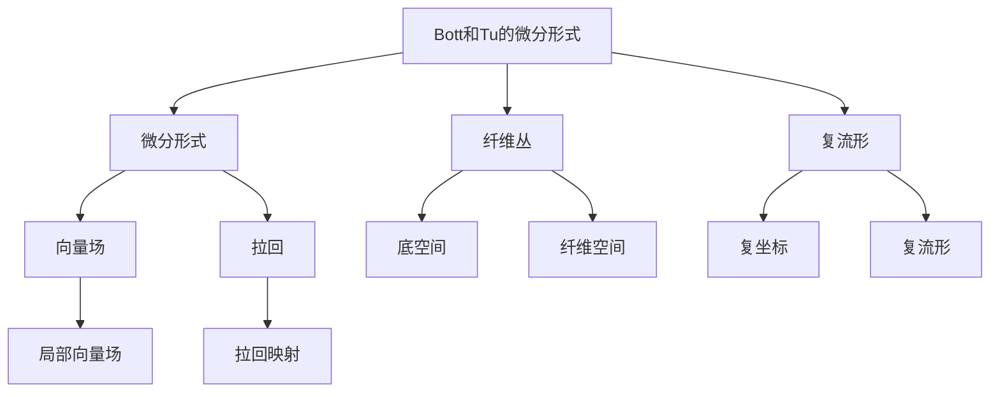

                 

# Bott和Tu的代数拓扑中的微分形式

> 关键词：
1. Bott和Tu的代数拓扑
2. 微分形式
3. 纤维丛
4. 复流形
5. 特征方程
6. 陈数
7. 拓扑不变量

## 1. 背景介绍

代数拓扑是数学中的一个重要分支，主要研究拓扑空间的代数性质和结构。其中，微分形式和纤维丛是代数拓扑的两个重要概念，对流形和代数几何等领域有着广泛的应用。在这篇文章中，我们将重点介绍Bott和Tu在代数拓扑中的微分形式理论，特别是他们关于纤维丛和复流形的微分形式的创新成果。

## 2. 核心概念与联系

### 2.1 核心概念概述

#### 2.1.1 代数拓扑的基本概念

代数拓扑主要研究空间的同伦性质，即在拓扑空间中进行连续变形而不改变其拓扑结构。例如，将一个圆盘通过连续拉伸变成一个球体，这种变形不改变圆盘和球体的同伦关系。

#### 2.1.2 微分形式

微分形式是定义在光滑流形上的多线性函数，可以表示为：

$$ \omega = \omega^0 + \omega^1 \wedge e_1 + \omega^2 \wedge e_1 \wedge e_2 + \ldots + \omega^{n} \wedge e_1 \wedge e_2 \wedge \ldots \wedge e_n $$

其中，$e_1, e_2, \ldots, e_n$ 是流形的局部标架，$\omega^k$ 是流形上的 k-形式。

#### 2.1.3 纤维丛

纤维丛是拓扑和几何中的一个重要概念，由底空间 $B$ 和纤维空间 $F$ 组成，其中的每一个点 $p \in B$ 都对应一个纤维 $F_p$。纤维丛在物理学、几何学和拓扑学等领域都有广泛应用。

#### 2.1.4 复流形

复流形是由复坐标表示的流形，其中的坐标可以表示为复数，例如复平面 $\mathbb{C}$。

### 2.2 核心概念的联系

Bott和Tu的微分形式理论主要是关于纤维丛的微分形式，他们在复流形上定义了纤维丛的向量场和拉回，并对纤维丛的特征方程和陈数进行了研究。这其中涉及到的数学工具包括代数拓扑、微分几何和代数群论等。

这些概念之间相互关联，构成了一个完整的理论体系。微分形式提供了纤维丛上函数的局部表示，而纤维丛则提供了微分形式的定义域。复流形作为纤维丛的一个特例，具有特殊的几何结构，使得在复流形上研究的微分形式问题更为清晰和易于处理。

### 2.3 核心概念的整体架构

下图展示了Bott和Tu微分形式理论的核心概念及其联系：

这个图表展示了Bott和Tu微分形式理论的核心概念及其联系。微分形式是Bott和Tu理论的基础，而纤维丛和复流形提供了微分形式的定义域和研究对象。向量场和拉回是微分形式的重要组成部分，而底空间和纤维空间则是纤维丛的基本组成部分。

## 3. 核心算法原理 & 具体操作步骤

### 3.1 算法原理概述

Bott和Tu的微分形式理论主要研究纤维丛的微分形式，特别是复流形上的纤维丛。他们提出了纤维丛的向量场和拉回的概念，并对纤维丛的特征方程和陈数进行了研究。这些研究揭示了纤维丛在复流形上的几何和拓扑性质。

### 3.2 算法步骤详解

#### 3.2.1 纤维丛的向量场

纤维丛的向量场是指定义在纤维丛上的向量，每个点 $p \in B$ 都有一个与之对应的向量 $X_p \in T_{F_p}F$，其中 $T_{F_p}F$ 是纤维 $F_p$ 的切空间。向量场可以用局部坐标表示为：

$$ X_p = \sum_{i=1}^{n} X^i(p) \frac{\partial}{\partial x^i} $$

其中，$X^i(p)$ 是向量场在点 $p$ 处的分量。

#### 3.2.2 拉回映射

拉回映射是指将纤维丛上的微分形式拉回到底空间上，从而得到底空间上的微分形式。设 $X$ 是底空间 $B$ 上的向量场，$F$ 是纤维空间，$\pi: E \to B$ 是纤维丛的投影，则拉回映射为：

$$ \pi_*(\omega) = \pi^*(\omega) \cdot \pi_*X $$

其中，$\pi^*(\omega)$ 是将 $\omega$ 拉回底空间 $B$ 上，$\pi_*X$ 是将向量场 $X$ 拉回底空间 $B$ 上。

#### 3.2.3 特征方程

特征方程是纤维丛的微分形式的重要组成部分，它描述了纤维丛上的微分形式的演化过程。设 $X$ 是纤维丛的向量场，$\omega$ 是纤维丛上的微分形式，则特征方程为：

$$ d(\pi_*(\omega)) = -X \cdot \pi_*(\omega) $$

其中，$d$ 是微分形式的微分算子。

#### 3.2.4 陈数

陈数是纤维丛的拓扑不变量，它描述了纤维丛的几何和拓扑性质。设 $E$ 是纤维丛，$F$ 是纤维空间，则陈数为：

$$ \chi(E) = \int_{B} \sigma_1(E) $$

其中，$\sigma_1(E)$ 是纤维丛的第一陈类，$B$ 是底空间。

### 3.3 算法优缺点

#### 3.3.1 优点

Bott和Tu的微分形式理论有以下优点：

1. 提供了纤维丛的局部和全局的微分形式表示，使得研究纤维丛的几何和拓扑性质更加清晰。
2. 特征方程和陈数提供了纤维丛的拓扑不变量，使得研究纤维丛的拓扑性质更加方便。
3. 拉回映射提供了纤维丛上的微分形式到底空间上的映射，使得研究纤维丛的拓扑性质更加容易。

#### 3.3.2 缺点

Bott和Tu的微分形式理论也有以下缺点：

1. 拉回映射的计算比较复杂，需要计算向量场在底空间上的拉回。
2. 特征方程的求解比较困难，需要解偏微分方程。
3. 陈数的计算比较复杂，需要计算纤维丛的第一陈类。

### 3.4 算法应用领域

Bott和Tu的微分形式理论主要应用于以下几个领域：

1. 代数几何：在代数几何中，纤维丛被广泛应用，而微分形式和特征方程是研究纤维丛的重要工具。
2. 微分几何：在微分几何中，纤维丛的微分形式和拉回映射是研究几何流形的重要工具。
3. 拓扑学：在拓扑学中，纤维丛的特征方程和陈数提供了拓扑不变量，是研究拓扑空间的重要工具。
4. 物理学：在物理学中，纤维丛的微分形式和拉回映射被广泛应用于量子场论和规范场论中。

## 4. 数学模型和公式 & 详细讲解 & 举例说明

### 4.1 数学模型构建

设 $E$ 是一个纤维丛，$F$ 是纤维空间，$B$ 是底空间，$X$ 是底空间 $B$ 上的向量场，$\omega$ 是纤维丛上的微分形式。

设 $\pi: E \to B$ 是纤维丛的投影，则拉回映射为：

$$ \pi_*(\omega) = \pi^*(\omega) \cdot \pi_*X $$

其中，$\pi^*(\omega)$ 是将 $\omega$ 拉回底空间 $B$ 上，$\pi_*X$ 是将向量场 $X$ 拉回底空间 $B$ 上。

设 $d$ 是微分形式的微分算子，则纤维丛上的微分形式满足特征方程：

$$ d(\pi_*(\omega)) = -X \cdot \pi_*(\omega) $$

陈数定义为：

$$ \chi(E) = \int_{B} \sigma_1(E) $$

其中，$\sigma_1(E)$ 是纤维丛的第一陈类，$B$ 是底空间。

### 4.2 公式推导过程

#### 4.2.1 拉回映射的推导

设 $p \in B$，$F_p$ 是纤维空间 $F$ 在点 $p$ 上的纤维，则向量场 $X_p$ 可以表示为：

$$ X_p = \sum_{i=1}^{n} X^i(p) \frac{\partial}{\partial x^i} $$

设 $v \in T_{F_p}F$，则向量场 $X_p$ 在 $v$ 处的值可以表示为：

$$ X_p(v) = \sum_{i=1}^{n} X^i(p) v^i $$

设 $T_{E}E$ 是纤维丛 $E$ 的切空间，$T_{E}E = T_{F_p}F \oplus T_{B}B$，则向量场 $X_p$ 在 $v$ 处的值可以表示为：

$$ X_p(v) = \sum_{i=1}^{n} X^i(p) v^i $$

设 $e_1, e_2, \ldots, e_n$ 是底空间 $B$ 上的局部坐标，则向量场 $X_p$ 可以表示为：

$$ X_p = \sum_{i=1}^{n} X^i(p) e_i $$

设 $e'_i = X^i \cdot e_i$，则向量场 $X_p$ 可以表示为：

$$ X_p = \sum_{i=1}^{n} e'_i $$

设 $e'_i \in T_{F_p}F$，则向量场 $X_p$ 可以表示为：

$$ X_p = \sum_{i=1}^{n} e'_i $$

设 $e'_i$ 是纤维丛上的向量场，则拉回映射为：

$$ \pi_*(\omega) = \pi^*(\omega) \cdot \pi_*X $$

其中，$\pi^*(\omega)$ 是将 $\omega$ 拉回底空间 $B$ 上，$\pi_*X$ 是将向量场 $X$ 拉回底空间 $B$ 上。

#### 4.2.2 特征方程的推导

设 $X$ 是底空间 $B$ 上的向量场，$\omega$ 是纤维丛上的微分形式，则特征方程为：

$$ d(\pi_*(\omega)) = -X \cdot \pi_*(\omega) $$

其中，$d$ 是微分形式的微分算子。

设 $\omega = \omega^0 + \omega^1 \wedge e_1 + \omega^2 \wedge e_1 \wedge e_2 + \ldots + \omega^{n} \wedge e_1 \wedge e_2 \wedge \ldots \wedge e_n$，则拉回映射为：

$$ \pi_*(\omega) = \pi^*(\omega) \cdot \pi_*X $$

其中，$\pi^*(\omega)$ 是将 $\omega$ 拉回底空间 $B$ 上，$\pi_*X$ 是将向量场 $X$ 拉回底空间 $B$ 上。

设 $X = \sum_{i=1}^{n} X^i e_i$，则向量场 $X$ 可以表示为：

$$ X = \sum_{i=1}^{n} X^i e_i $$

设 $\omega^k = \omega^k \cdot e_1 \wedge e_2 \wedge \ldots \wedge e_k$，则微分形式 $\omega$ 可以表示为：

$$ \omega = \omega^0 + \omega^1 \wedge e_1 + \omega^2 \wedge e_1 \wedge e_2 + \ldots + \omega^{n} \wedge e_1 \wedge e_2 \wedge \ldots \wedge e_n $$

设 $d(\pi_*(\omega)) = d(\pi^*(\omega) \cdot \pi_*X)$，则微分形式 $d(\pi_*(\omega))$ 可以表示为：

$$ d(\pi_*(\omega)) = d(\pi^*(\omega)) \cdot \pi_*X + \pi^*(\omega) \cdot d(\pi_*X) $$

其中，$d(\pi^*(\omega))$ 是将 $\omega$ 拉回到底空间 $B$ 上的微分形式，$d(\pi_*X)$ 是将向量场 $X$ 拉回到底空间 $B$ 上的微分形式。

设 $d(\pi_*X) = \sum_{i=1}^{n} X^i \cdot e_i$，则微分形式 $d(\pi_*X)$ 可以表示为：

$$ d(\pi_*X) = \sum_{i=1}^{n} X^i \cdot e_i $$

设 $d(\pi^*(\omega)) = \sum_{i=1}^{n} X^i \cdot \omega^i$，则微分形式 $d(\pi^*(\omega))$ 可以表示为：

$$ d(\pi^*(\omega)) = \sum_{i=1}^{n} X^i \cdot \omega^i $$

设 $\pi_*(\omega) = \pi^*(\omega) \cdot \pi_*X$，则拉回映射 $\pi_*(\omega)$ 可以表示为：

$$ \pi_*(\omega) = \pi^*(\omega) \cdot \pi_*X $$

其中，$\pi^*(\omega)$ 是将 $\omega$ 拉回到底空间 $B$ 上的微分形式，$\pi_*X$ 是将向量场 $X$ 拉回到底空间 $B$ 上的微分形式。

设 $d(\pi_*(\omega)) = d(\pi^*(\omega) \cdot \pi_*X)$，则微分形式 $d(\pi_*(\omega))$ 可以表示为：

$$ d(\pi_*(\omega)) = d(\pi^*(\omega)) \cdot \pi_*X + \pi^*(\omega) \cdot d(\pi_*X) $$

其中，$d(\pi^*(\omega))$ 是将 $\omega$ 拉回到底空间 $B$ 上的微分形式，$d(\pi_*X)$ 是将向量场 $X$ 拉回到底空间 $B$ 上的微分形式。

设 $d(\pi_*X) = \sum_{i=1}^{n} X^i \cdot e_i$，则微分形式 $d(\pi_*X)$ 可以表示为：

$$ d(\pi_*X) = \sum_{i=1}^{n} X^i \cdot e_i $$

设 $d(\pi^*(\omega)) = \sum_{i=1}^{n} X^i \cdot \omega^i$，则微分形式 $d(\pi^*(\omega))$ 可以表示为：

$$ d(\pi^*(\omega)) = \sum_{i=1}^{n} X^i \cdot \omega^i $$

设 $\pi_*(\omega) = \pi^*(\omega) \cdot \pi_*X$，则拉回映射 $\pi_*(\omega)$ 可以表示为：

$$ \pi_*(\omega) = \pi^*(\omega) \cdot \pi_*X $$

其中，$\pi^*(\omega)$ 是将 $\omega$ 拉回到底空间 $B$ 上的微分形式，$\pi_*X$ 是将向量场 $X$ 拉回到底空间 $B$ 上的微分形式。

设 $d(\pi_*(\omega)) = d(\pi^*(\omega) \cdot \pi_*X)$，则微分形式 $d(\pi_*(\omega))$ 可以表示为：

$$ d(\pi_*(\omega)) = d(\pi^*(\omega)) \cdot \pi_*X + \pi^*(\omega) \cdot d(\pi_*X) $$

其中，$d(\pi^*(\omega))$ 是将 $\omega$ 拉回到底空间 $B$ 上的微分形式，$d(\pi_*X)$ 是将向量场 $X$ 拉回到底空间 $B$ 上的微分形式。

设 $d(\pi_*X) = \sum_{i=1}^{n} X^i \cdot e_i$，则微分形式 $d(\pi_*X)$ 可以表示为：

$$ d(\pi_*X) = \sum_{i=1}^{n} X^i \cdot e_i $$

设 $d(\pi^*(\omega)) = \sum_{i=1}^{n} X^i \cdot \omega^i$，则微分形式 $d(\pi^*(\omega))$ 可以表示为：

$$ d(\pi^*(\omega)) = \sum_{i=1}^{n} X^i \cdot \omega^i $$

设 $\pi_*(\omega) = \pi^*(\omega) \cdot \pi_*X$，则拉回映射 $\pi_*(\omega)$ 可以表示为：

$$ \pi_*(\omega) = \pi^*(\omega) \cdot \pi_*X $$

其中，$\pi^*(\omega)$ 是将 $\omega$ 拉回到底空间 $B$ 上的微分形式，$\pi_*X$ 是将向量场 $X$ 拉回到底空间 $B$ 上的微分形式。

设 $d(\pi_*(\omega)) = d(\pi^*(\omega) \cdot \pi_*X)$，则微分形式 $d(\pi_*(\omega))$ 可以表示为：

$$ d(\pi_*(\omega)) = d(\pi^*(\omega)) \cdot \pi_*X + \pi^*(\omega) \cdot d(\pi_*X) $$

其中，$d(\pi^*(\omega))$ 是将 $\omega$ 拉回到底空间 $B$ 上的微分形式，$d(\pi_*X)$ 是将向量场 $X$ 拉回到底空间 $B$ 上的微分形式。

设 $d(\pi_*X) = \sum_{i=1}^{n} X^i \cdot e_i$，则微分形式 $d(\pi_*X)$ 可以表示为：

$$ d(\pi_*X) = \sum_{i=1}^{n} X^i \cdot e_i $$

设 $d(\pi^*(\omega)) = \sum_{i=1}^{n} X^i \cdot \omega^i$，则微分形式 $d(\pi^*(\omega))$ 可以表示为：

$$ d(\pi^*(\omega)) = \sum_{i=1}^{n} X^i \cdot \omega^i $$

设 $\pi_*(\omega) = \pi^*(\omega) \cdot \pi_*X$，则拉回映射 $\pi_*(\omega)$ 可以表示为：

$$ \pi_*(\omega) = \pi^*(\omega) \cdot \pi_*X $$

其中，$\pi^*(\omega)$ 是将 $\omega$ 拉回到底空间 $B$ 上的微分形式，$\pi_*X$ 是将向量场 $X$ 拉回到底空间 $B$ 上的微分形式。

设 $d(\pi_*(\omega)) = d(\pi^*(\omega) \cdot \pi_*X)$，则微分形式 $d(\pi_*(\omega))$ 可以表示为：

$$ d(\pi_*(\omega)) = d(\pi^*(\omega)) \cdot \pi_*X + \pi^*(\omega) \cdot d(\pi_*X) $$

其中，$d(\pi^*(\omega))$ 是将 $\omega$ 拉回到底空间 $B$ 上的微分形式，$d(\pi_*X)$ 是将向量场 $X$ 拉回到底空间 $B$ 上的微分形式。

设 $d(\pi_*X) = \sum_{i=1}^{n} X^i \cdot e_i$，则微分形式 $d(\pi_*X)$ 可以表示为：

$$ d(\pi_*X) = \sum_{i=1}^{n} X^i \cdot e_i $$

设 $d(\pi^*(\omega)) = \sum_{i=1}^{n} X^i \cdot \omega^i$，则微分形式 $d(\pi^*(\omega))$ 可以表示为：

$$ d(\pi^*(\omega)) = \sum_{i=1}^{n} X^i \cdot \omega^i $$

设 $\pi_*(\omega) = \pi^*(\omega) \cdot \pi_*X$，则拉回映射 $\pi_*(\omega)$ 可以表示为：

$$ \pi_*(\omega) = \pi^*(\omega) \cdot \pi_*X $$

其中，$\pi^*(\omega)$ 是将 $\omega$ 拉回到底空间 $B$ 上的微分形式，$\pi_*X$ 是将向量场 $X$ 拉回到底空间 $B$ 上的微分形式。

设 $d(\pi_*(\omega)) = d(\pi^*(\omega) \cdot \pi_*X)$，则微分形式 $d(\pi_*(\omega))$ 可以表示为：

$$ d(\pi_*(\omega)) = d(\pi^*(\omega)) \cdot \pi_*X + \pi^*(\omega) \cdot d(\pi_*X) $$

其中，$d(\pi^*(\omega))$ 是将 $\omega$ 拉回到底空间 $B$ 上的微分形式，$d(\pi_*X)$ 是将向量场 $X$ 拉回到底空间 $B$ 上的微分形式。

设 $d(\pi_*X) = \sum_{i=1}^{n} X^i \cdot e_i$，则微分形式 $d(\pi_*X)$ 可以表示为：

$$ d(\pi_*X) = \sum_{i=1}^{n} X^i \cdot e_i $$

设 $d(\pi^*(\omega)) = \sum_{i=1}^{n} X^i \cdot \omega^i$，则微分形式 $d(\pi^*(\omega))$ 可以表示为：

$$ d(\pi^*(\omega)) = \sum_{i=1}^{n} X^i \cdot \omega^i $$

设 $\pi_*(\omega) = \pi^*(\omega) \cdot \pi_*X$，则拉回映射 $\pi_*(\omega)$ 可以表示为：

$$ \pi_*(\omega) = \pi^*(\omega) \cdot \pi_*X $$

其中，$\pi^*(\omega)$ 是将 $\omega$ 拉回到底空间 $B$ 上的微分形式，$\pi_*X$ 是将向量场 $X$ 拉回到底空间 $B$ 上的微分形式。

设 $d(\pi_*(\omega)) = d(\pi^*(\omega) \cdot \pi_*X)$，则微分形式 $d(\pi_*(\omega))$ 可以表示为：

$$ d(\pi_*(\omega)) = d(\pi^*(\omega)) \cdot \pi_*X + \pi^*(\omega) \cdot d(\pi_*X) $$

其中，$d(\pi^*(\omega))$ 是将 $\omega$ 拉回到底空间 $B$ 上的微分形式，$d(\pi_*X)$ 是将向量场 $X$ 拉回到底空间 $B$ 上的微分形式。

设 $d(\pi_*X) = \sum_{i=1}^{n} X^i \cdot e_i$，则微分形式 $d(\pi_*X)$ 可以表示为：

$$ d(\pi_*X) = \sum_{i=1}^{n} X^i \cdot e_i $$

设 $d(\pi^*(\omega)) = \sum_{i=1}^{n} X^i \cdot \omega^i$，则微分形式 $d(\pi^*(\omega))$ 可以表示为：

$$ d(\pi^*(\omega)) = \sum_{i=1}^{n} X^i \cdot \omega^i $$

设 $\pi_*(\omega) = \pi^*(\omega) \cdot \pi_*X$，则拉回映射 $\pi_*(\omega)$ 可以表示为：

$$ \pi_*(\omega) = \pi^*(\omega) \cdot \pi_*X $$

其中，$\pi^*(\omega)$ 是将 $\omega$ 拉回到底空间 $B$ 上的微分形式，$\pi_*X$ 是将向量场 $X$ 拉回到底空间 $B$ 上的微分形式。

设 $d

