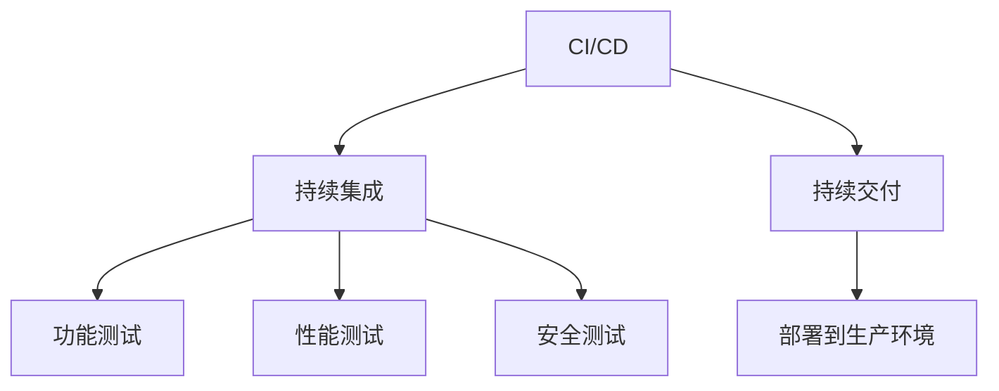
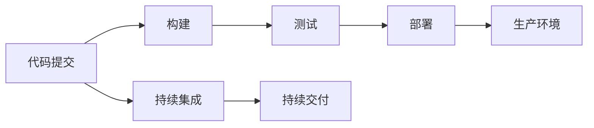
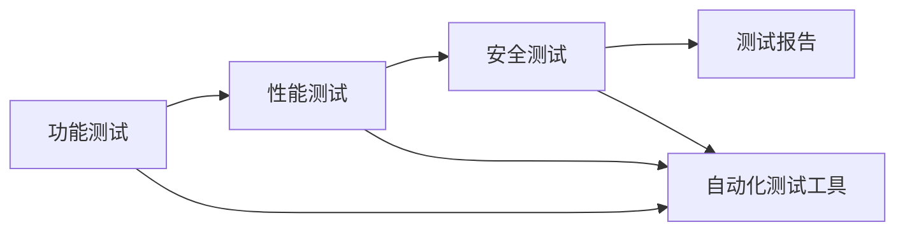

                 

# CI/CD与自动化测试原理与代码实战案例讲解

> 关键词：CI/CD, 自动化测试, 持续集成, 持续交付, 代码质量, 功能测试, 性能测试, 安全测试

## 1. 背景介绍

### 1.1 问题由来
在软件开发过程中，传统的测试方法通常是人工手动执行，不仅耗时耗力，还容易出错。随着软件规模的扩大和复杂性的增加，人工测试方法已经难以满足需求。CI/CD（Continuous Integration/Continuous Delivery）和自动化测试技术的出现，为软件开发带来了革命性的变化。通过持续集成和持续交付，开发者能够及时发现和修复代码缺陷，保证软件质量。同时，自动化测试可以大幅提升测试效率，缩短产品上市周期。

## 2. 核心概念与联系

### 2.1 核心概念概述

为更好地理解CI/CD和自动化测试的核心概念及其实现机制，本节将详细介绍几个关键概念：

- CI/CD：指持续集成和持续交付的流程，通过自动化手段实现软件的快速构建、测试和部署。
- 自动化测试：指使用自动化工具进行软件测试的方法，覆盖功能测试、性能测试、安全测试等各个方面。
- 持续集成：指在每个小版本或者每次代码提交后，自动化构建和测试系统，及时发现和修复问题。
- 持续交付：指在软件经过充分的测试后，自动化部署到生产环境，实现快速交付。
- 功能测试：指验证软件是否按照需求实现了预期的功能。
- 性能测试：指评估软件性能指标，如响应时间、吞吐量、并发用户数等。
- 安全测试：指测试软件是否存在安全漏洞，如SQL注入、XSS攻击等。

这些核心概念之间的联系可以通过以下Mermaid流程图来展示：



这个流程图展示了几者之间的联系：

1. CI/CD流程将持续集成和持续交付串联起来，通过自动化构建、测试和部署，保证软件的质量。
2. 持续集成和持续交付中，包含功能测试、性能测试和安全测试，覆盖软件测试的全过程。
3. 功能测试、性能测试和安全测试是持续集成和持续交付的重要环节，通过自动化测试确保软件质量。

### 2.2 概念间的关系

这些核心概念之间存在着紧密的联系，形成了CI/CD和自动化测试的完整生态系统。下面我们通过几个Mermaid流程图来展示这些概念之间的关系。

#### 2.2.1 CI/CD流程


这个流程图展示了CI/CD流程的基本结构。开发者提交代码后，系统自动触发构建和测试，最终将软件部署到生产环境。

#### 2.2.2 自动化测试方法


这个流程图展示了自动化测试的覆盖范围。功能测试、性能测试和安全测试通过自动化测试工具实现，最终生成测试报告。

#### 2.2.3 功能测试过程


这个流程图展示了功能测试的流程。从需求文档出发，设计用例，编写测试用例，执行测试用例，生成测试报告。

## 3. 核心算法原理 & 具体操作步骤
### 3.1 算法原理概述

CI/CD和自动化测试的核心原理是通过自动化手段实现软件构建、测试和部署的自动化流程，提高开发效率和软件质量。其主要包括以下几个关键环节：

1. **代码提交**：开发者将代码提交到版本控制系统，如Git。
2. **持续集成**：在每次代码提交后，自动构建和运行测试，生成测试报告。
3. **持续交付**：将测试通过的软件自动部署到生产环境。
4. **自动化测试**：使用自动化测试工具进行功能测试、性能测试和安全测试，覆盖各个测试环节。

### 3.2 算法步骤详解

CI/CD和自动化测试的实现步骤主要包括：

1. **配置开发环境**：安装相关开发工具和库，配置CI/CD和自动化测试工具。
2. **编写测试用例**：根据需求文档，设计测试用例，编写自动化测试脚本。
3. **配置CI/CD流程**：配置持续集成和持续交付的流程，包括构建、测试和部署。
4. **执行测试和部署**：提交代码后，触发CI/CD流程，自动执行测试和部署。
5. **生成测试报告**：根据自动化测试结果生成测试报告，评估软件质量。
6. **持续优化**：根据测试结果和反馈，不断优化测试用例和CI/CD流程。

### 3.3 算法优缺点

CI/CD和自动化测试的主要优点包括：

- **提高效率**：自动化测试和CI/CD流程大大缩短了软件开发周期，提高了开发效率。
- **保证质量**：通过持续集成和持续交付，及时发现和修复问题，保证软件质量。
- **降低成本**：减少了手动测试的工作量，降低了人力和时间成本。
- **提高可靠性**：自动化测试可以重复执行，降低人为失误，提高软件可靠性。

但同时也存在一些缺点：

- **配置复杂**：配置CI/CD和自动化测试工具需要一定的技术背景，对于初学者较为困难。
- **依赖环境**：自动化测试依赖于稳定的开发和测试环境，环境不一致可能导致测试结果不准确。
- **资源消耗**：大规模自动化测试和CI/CD流程会消耗大量计算和存储资源。

### 3.4 算法应用领域

CI/CD和自动化测试广泛应用于软件开发的全生命周期，以下是几个典型应用场景：

1. **Web应用开发**：通过CI/CD流程实现Web应用的持续构建、测试和部署。
2. **移动应用开发**：使用自动化测试工具进行功能测试、性能测试和安全测试，确保移动应用的稳定性和安全性。
3. **云服务部署**：通过持续集成和持续交付，快速构建和部署云服务应用。
4. **持续交付平台**：如Jenkins、GitLab CI、CircleCI等，提供持续集成和持续交付的自动化支持。

## 4. 数学模型和公式 & 详细讲解 & 举例说明
### 4.1 数学模型构建

本文将使用数学语言对CI/CD和自动化测试的原理进行更严格的刻画。

设软件开发周期为 $T$，每次提交代码的间隔时间为 $\Delta t$，每次提交后自动触发持续集成流程，触发时间为 $t_1$，持续集成完成时间为 $t_2$，持续交付完成时间为 $t_3$。则CI/CD流程的总时间为：

$$
T = \Delta t + (t_2 - t_1) + (t_3 - t_2)
$$

### 4.2 公式推导过程

假设每次提交后持续集成和持续交付的平均耗时为常数 $k$，则：

$$
t_2 = t_1 + k
$$
$$
t_3 = t_2 + k
$$

代入 $t_2$ 和 $t_3$，得：

$$
T = \Delta t + k + 2k = \Delta t + 3k
$$

由于 $\Delta t$ 和 $k$ 均为正数，因此CI/CD流程总时间随 $\Delta t$ 和 $k$ 的增大而增加。

### 4.3 案例分析与讲解

假设每次代码提交间隔时间为1小时，持续集成和持续交付的平均耗时为30分钟。则：

$$
T = 1 + 3 \times 0.5 = 2.5 \text{ 小时}
$$

即在每次代码提交后，需要2.5小时才能完成持续集成和持续交付流程。

## 5. 项目实践：代码实例和详细解释说明
### 5.1 开发环境搭建

在进行CI/CD和自动化测试实践前，我们需要准备好开发环境。以下是使用Python进行Jenkins的开发环境配置流程：

1. 安装Jenkins：从官网下载并安装Jenkins，根据系统配置进行初始化。
2. 安装所需插件：安装Jenkins所需的所有插件，如Git Plugin、Pipeline Plugin等。
3. 配置Git Repo：在Jenkins中添加Git Repo，配置Git仓库地址和凭据。
4. 配置Pipeline：创建Pipeline脚本，定义构建、测试和部署流程。

完成上述步骤后，即可在Jenkins上启动CI/CD流程。

### 5.2 源代码详细实现

下面我们以一个简单的Python项目为例，展示如何使用Jenkins实现持续集成和持续交付。

首先，定义Jenkins的Pipeline脚本：

```groovy
pipeline {
    agent any
    stages {
        stage('Build') {
            steps {
                git branch: 'master'
                withEnv('BRANCH_NAME', 'master')
                sh 'python setup.py install'
            }
        }
        stage('Test') {
            steps {
                sh 'python test.py'
            }
        }
        stage('Deploy') {
            steps {
                sh 'python deploy.py'
            }
        }
    }
}
```

该Pipeline脚本实现了以下功能：

1. 从Git Repo拉取最新代码。
2. 执行构建命令 `python setup.py install`，安装Python依赖包。
3. 执行测试命令 `python test.py`，进行单元测试。
4. 执行部署命令 `python deploy.py`，部署应用到生产环境。

在Jenkins中添加该Pipeline脚本，并进行配置。注意需要指定执行器类型和标签，如：

```groovy
agent {
    label 'linux'
    executor 'label'
}
```

### 5.3 代码解读与分析

这里我们重点解读Pipeline脚本的关键代码部分：

**Pipeline脚本**：
- `pipeline` 声明Pipeline脚本。
- `agent any` 指定执行器类型为任意。
- `stage 'Build'` 声明构建阶段。
- `steps` 声明该阶段的任务。
- `sh 'python setup.py install'` 执行构建命令。
- `stage 'Test'` 声明测试阶段。
- `sh 'python test.py'` 执行测试命令。
- `stage 'Deploy'` 声明部署阶段。
- `sh 'python deploy.py'` 执行部署命令。

**Git配置**：
- `git branch: 'master'` 指定拉取最新代码的分支。
- `withEnv('BRANCH_NAME', 'master')` 设置环境变量。

**执行器配置**：
- `agent { label 'linux' executor 'label' }` 指定执行器类型为标签。

### 5.4 运行结果展示

假设在Jenkins上运行该Pipeline脚本，每次提交代码后都会自动触发构建、测试和部署流程。如果在代码中发现问题，Jenkins会在执行测试时自动捕获异常并生成测试报告，开发者可以及时修复问题。

## 6. 实际应用场景
### 6.1 持续交付平台

基于Jenkins等持续交付平台，软件开发团队可以实现持续集成和持续交付，大幅提高开发效率。例如，阿里巴巴集团的淘宝、天猫等电商业务系统，使用Jenkins实现持续交付，每日自动构建和部署系统，保证业务的稳定性和可靠性。

### 6.2 自动化测试工具

自动化测试工具如Selenium、TestNG、JUnit等，可以广泛应用于功能测试、性能测试和安全测试。例如，某金融公司使用Selenium进行UI自动化测试，每天执行数万次测试，及时发现UI错误和性能问题，保证系统的稳定性和可用性。

### 6.3 持续集成工具

持续集成工具如Jenkins、GitLab CI等，可以整合CI/CD流程，自动化构建、测试和部署。例如，某互联网公司使用Jenkins实现持续集成，每周自动构建和测试新功能，确保新功能质量。

## 7. 工具和资源推荐
### 7.1 学习资源推荐

为了帮助开发者系统掌握CI/CD和自动化测试的理论基础和实践技巧，这里推荐一些优质的学习资源：

1. **《持续集成实践》** （Spongebook）：该书系统介绍了持续集成的基本概念、实践方法和工具，适合入门学习。
2. **《软件测试实践》** （DZone）：该网站提供了丰富的测试方法和工具教程，适合进阶学习。
3. **《持续交付实战》** （O'Reilly）：该书介绍了持续交付的流程和方法，适合实战应用。
4. **《自动化测试工程师手册》** （eDa Learning）：该手册介绍了自动化测试的流程和工具，适合综合学习。
5. **Jenkins官网文档**：该网站提供了详细的Jenkins配置和使用教程，适合动手实践。

通过这些资源的学习实践，相信你一定能够快速掌握CI/CD和自动化测试的精髓，并用于解决实际的开发问题。

### 7.2 开发工具推荐

高效的开发离不开优秀的工具支持。以下是几款用于CI/CD和自动化测试开发的常用工具：

1. **Jenkins**：开源的持续集成和持续交付平台，支持多种插件和扩展，适合大规模工程应用。
2. **Selenium**：开源的自动化测试工具，支持Web应用和移动应用的UI测试。
3. **JUnit**：开源的Java测试框架，支持单元测试和集成测试，适合Java项目使用。
4. **TestNG**：开源的Java测试框架，支持测试用例管理和数据驱动测试，适合Java项目使用。
5. **GitLab CI**：开源的持续集成和持续交付平台，支持多种构建工具和测试工具。
6. **Hadoop**：开源的大数据处理平台，支持海量数据的分析和处理，适合数据驱动的测试场景。

合理利用这些工具，可以显著提升CI/CD和自动化测试的开发效率，加快创新迭代的步伐。

### 7.3 相关论文推荐

CI/CD和自动化测试技术的发展源于学界的持续研究。以下是几篇奠基性的相关论文，推荐阅读：

1. **《软件持续集成和持续部署最佳实践》** （IEEE）：该论文介绍了持续集成和持续部署的基本概念和方法，适合入门学习。
2. **《自动化测试技术综述》** （ACM）：该论文介绍了自动化测试的各种技术和方法，适合深入学习。
3. **《持续交付的演变和未来》** （Fernando Varela）：该论文介绍了持续交付的演进过程和未来发展趋势，适合进阶学习。
4. **《安全测试：自动化和智能化》** （Cybersecurity and Infrastructure Security Agency）：该论文介绍了安全测试的自动化和智能化方法，适合安全测试学习。
5. **《基于机器学习的测试自动化》** （Kent Beck）：该论文介绍了基于机器学习的测试自动化技术，适合测试自动化学习。

这些论文代表了大规模语言模型微调技术的发展脉络。通过学习这些前沿成果，可以帮助研究者把握学科前进方向，激发更多的创新灵感。

除上述资源外，还有一些值得关注的前沿资源，帮助开发者紧跟CI/CD和自动化测试技术的最新进展，例如：

1. **arXiv论文预印本**：人工智能领域最新研究成果的发布平台，包括大量尚未发表的前沿工作，学习前沿技术的必读资源。
2. **业界技术博客**：如Jenkins、Selenium、JUnit等顶尖实验室的官方博客，第一时间分享他们的最新研究成果和洞见。
3. **技术会议直播**：如Jenkins User Conference、Selenium Conference等大会现场或在线直播，能够聆听到大佬们的前沿分享，开拓视野。
4. **GitHub热门项目**：在GitHub上Star、Fork数最多的CI/CD和自动化测试相关项目，往往代表了该技术领域的发展趋势和最佳实践，值得去学习和贡献。
5. **行业分析报告**：各大咨询公司如McKinsey、PwC等针对IT行业的分析报告，有助于从商业视角审视技术趋势，把握应用价值。

总之，对于CI/CD和自动化测试技术的学习和实践，需要开发者保持开放的心态和持续学习的意愿。多关注前沿资讯，多动手实践，多思考总结，必将收获满满的成长收益。

## 8. 总结：未来发展趋势与挑战
### 8.1 研究成果总结

本文对CI/CD和自动化测试的基本原理、具体实现和应用场景进行了详细介绍。首先阐述了CI/CD和自动化测试的背景和重要性，明确了它们在软件开发中的核心地位。其次，从原理到实践，详细讲解了CI/CD和自动化测试的数学模型和关键步骤，给出了具体代码实例。同时，本文还探讨了CI/CD和自动化测试在实际应用中的具体场景，展示了其在软件开发中的应用前景。最后，本文精选了CI/CD和自动化测试技术的各类学习资源，力求为读者提供全方位的技术指引。

通过本文的系统梳理，可以看到，CI/CD和自动化测试技术正在成为软件开发的重要范式，极大地提升了软件开发的效率和质量。它们为软件开发带来了革命性的变化，促进了软件产业的快速发展和创新。

### 8.2 未来发展趋势

展望未来，CI/CD和自动化测试技术将呈现以下几个发展趋势：

1. **智能化和自动化**：随着机器学习和大数据技术的发展，CI/CD和自动化测试将进一步智能化和自动化，提升测试效率和质量。
2. **多领域融合**：CI/CD和自动化测试将与DevOps、数据科学、人工智能等领域进行深度融合，实现更加全面的自动化测试。
3. **微服务架构**：随着微服务架构的流行，CI/CD和自动化测试将针对微服务架构进行优化，提升微服务的质量和可维护性。
4. **开源和社区化**：更多的CI/CD和自动化测试工具将开源，社区化开发将进一步推动测试技术的进步。
5. **云平台支持**：越来越多的云平台将提供CI/CD和自动化测试的支持，实现云端集成和交付。

### 8.3 面临的挑战

尽管CI/CD和自动化测试技术已经取得了瞩目成就，但在迈向更加智能化、普适化应用的过程中，它仍面临诸多挑战：

1. **配置复杂性**：配置CI/CD和自动化测试工具需要一定的技术背景，对于初学者较为困难。
2. **依赖环境**：自动化测试依赖于稳定的开发和测试环境，环境不一致可能导致测试结果不准确。
3. **资源消耗**：大规模自动化测试和CI/CD流程会消耗大量计算和存储资源。
4. **测试覆盖率**：测试用例覆盖率不高，可能遗漏重要功能和性能问题。
5. **测试效率**：测试执行效率低下，影响软件交付速度。

### 8.4 研究展望

面对CI/CD和自动化测试面临的挑战，未来的研究需要在以下几个方面寻求新的突破：

1. **智能化测试**：引入机器学习和大数据分析技术，提升测试用例的生成和执行效率，提高测试覆盖率。
2. **环境模拟**：开发环境模拟技术，确保在不同环境下的测试结果一致性。
3. **资源优化**：采用并行处理和分布式计算技术，优化测试和CI/CD流程的资源消耗。
4. **动态测试**：开发动态测试技术，实时发现和修复软件问题，提高软件交付速度。
5. **测试自动化**：开发更加自动化的测试工具，减少人工干预，提升测试效率和质量。

这些研究方向将推动CI/CD和自动化测试技术向更高层次发展，为软件开发带来更高效、更可靠的解决方案。总之，持续优化和创新是CI/CD和自动化测试技术的未来发展方向，只有不断探索和突破，才能更好地服务于软件开发和企业应用。

## 9. 附录：常见问题与解答

**Q1：如何选择合适的持续集成和持续交付工具？**

A: 选择CI/CD工具需要考虑以下因素：

1. **功能需求**：根据项目需求选择合适的工具，如Jenkins、GitLab CI、CircleCI等。
2. **技术栈**：选择与技术栈相匹配的工具，如Jenkins适用于Java、Python等项目。
3. **社区和支持**：选择社区活跃、有良好技术支持和文档的工具，如Jenkins有庞大的用户社区和活跃的开发团队。

**Q2：如何优化自动化测试用例？**

A: 优化自动化测试用例需要考虑以下因素：

1. **测试覆盖率**：提高测试用例覆盖率，确保重要功能和性能问题被测试到。
2. **执行效率**：优化测试执行流程，减少执行时间和资源消耗。
3. **可维护性**：保持测试用例的可维护性，方便未来的修改和扩展。

**Q3：持续集成和持续交付的瓶颈在哪里？**

A: 持续集成和持续交付的瓶颈主要在以下几个方面：

1. **构建时间**：构建时间过长会导致测试和部署延迟。
2. **测试时间**：测试时间过长会影响软件交付速度。
3. **部署时间**：部署时间过长会导致部署延迟。

这些瓶颈需要通过优化构建、测试和部署流程，提高系统性能来解决。

**Q4：如何处理持续集成和持续交付中的失败问题？**

A: 处理持续集成和持续交付中的失败问题需要考虑以下因素：

1. **自动化重试**：对于构建和测试失败的流程，自动重试并记录失败原因。
2. **人工干预**：对于严重失败的流程，需要人工干预，进行问题排查和修复。
3. **测试报告**：生成详细的测试报告，记录每次测试的结果和失败原因，方便问题追踪。

这些措施可以及时发现和修复问题，确保系统的稳定性和可靠性。

总之，持续集成和持续交付技术是软件开发的重要手段，通过优化和创新，可以实现高效、可靠的软件开发流程。

