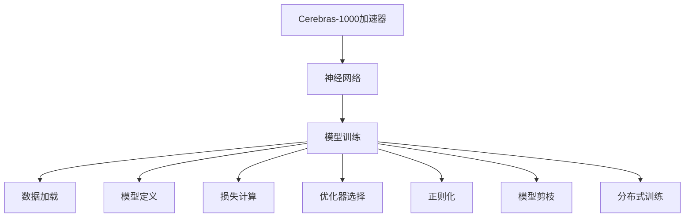
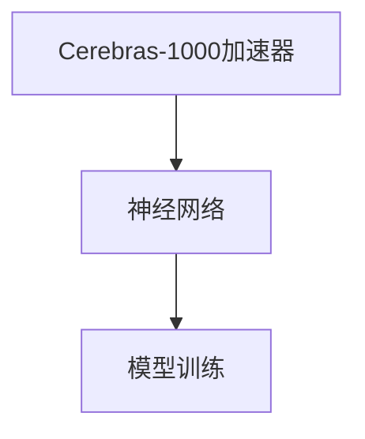
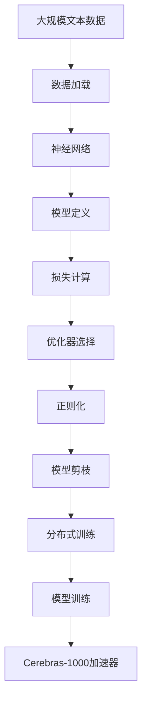

                 

# Cerebras-GPT原理与代码实例讲解

> 关键词：Cerebras, GPT, 神经网络, 并行计算, 模型训练, 加速器, 超参数, 代码实现

## 1. 背景介绍

### 1.1 问题由来
在过去几年中，自然语言处理(Natural Language Processing, NLP)领域迎来了革命性的进展。大语言模型，如OpenAI的GPT、Google的BERT，以其卓越的性能和大规模的参数，成为了NLP研究的新标杆。然而，现有的深度学习架构往往需要大量的内存和计算资源，使得大模型在实际部署和训练时面临巨大的挑战。为了解决这一问题，研究人员和工程师们开始探索新的并行计算架构和加速器。

Cerebras是一家专注于硬件加速和深度学习算法的初创公司，其自主研发的Cerebras-1000加速器，能够在单个芯片上实现数百亿次浮点运算，为大规模深度学习模型提供了高效的计算平台。本文将介绍如何使用Cerebras-1000加速器进行GPT模型的训练，并给出详细的代码实现和优化技巧。

### 1.2 问题核心关键点
本文聚焦于以下核心关键点：

- **Cerebras-1000加速器**：Cerebras自主研发的高性能硬件加速器，能够显著提升深度学习模型的训练和推理速度。
- **GPT模型架构**：一种基于Transformer的神经网络架构，通过自监督学习方式预训练，能够在各种NLP任务上取得优异效果。
- **模型训练流程**：包括数据加载、模型定义、损失计算、优化器选择等关键步骤，详细讲解了基于Cerebras-1000的模型训练流程。
- **优化技巧**：包括超参数调优、正则化、模型剪枝、分布式训练等，提升模型训练效率和性能。

### 1.3 问题研究意义
使用Cerebras-1000加速器进行GPT模型训练，不仅能显著提升模型的训练速度，还能节省大量计算资源。这对于NLP领域的研究和应用具有重要意义：

1. **加速模型训练**：Cerebras-1000能够在短时间内完成大规模模型的训练，使得NLP研究者和应用开发者能够快速迭代实验，提升研究效率。
2. **降低计算成本**：使用Cerebras-1000进行模型训练，能够显著减少对高性能计算资源的需求，降低模型训练和部署的成本。
3. **优化模型性能**：通过合理设置超参数和优化技巧，可以提升GPT模型的性能，使其在各种NLP任务上取得更好的表现。
4. **推动行业应用**：大模型加速训练的应用将进一步推动NLP技术在各行各业中的应用，提升行业效率和智能化水平。

## 2. 核心概念与联系

### 2.1 核心概念概述

- **Cerebras-1000加速器**：Cerebras自主研发的高性能硬件加速器，能够在单个芯片上实现数百亿次浮点运算，为大规模深度学习模型提供了高效的计算平台。
- **GPT模型**：一种基于Transformer的神经网络架构，通过自监督学习方式预训练，能够在各种NLP任务上取得优异效果。
- **神经网络**：由大量人工神经元节点和多层网络结构组成，能够处理复杂非线性的数据模式。
- **并行计算**：通过将计算任务分解成多个子任务，并行执行这些子任务，提升计算效率和速度。
- **模型训练**：使用标注数据训练深度学习模型，使其能够匹配任务输出。
- **超参数**：在模型训练过程中需要手动设置的参数，如学习率、批大小等，对模型性能有重要影响。

这些核心概念之间的关系可以通过以下Mermaid流程图来展示：



这个流程图展示了从硬件加速到模型训练的完整过程。

### 2.2 概念间的关系

这些核心概念之间存在着紧密的联系，形成了Cerebras-GPT训练的整体框架。下面我们通过几个Mermaid流程图来展示这些概念之间的关系。

#### 2.2.1 模型训练流程


这个流程图展示了模型训练的基本流程，包括数据加载、模型定义、损失计算、优化器选择、正则化、模型剪枝、分布式训练等关键步骤。

#### 2.2.2 Cerebras-1000加速器与神经网络的关系



这个流程图展示了Cerebras-1000加速器与神经网络模型训练的关系。加速器为神经网络模型提供了高效的计算平台，使得大规模模型的训练成为可能。

#### 2.2.3 超参数与模型训练的关系


这个流程图展示了超参数对模型训练的影响。合理设置超参数，可以提升模型性能，加快训练速度。

### 2.3 核心概念的整体架构

最后，我们用一个综合的流程图来展示这些核心概念在大模型训练中的整体架构：



这个综合流程图展示了从数据加载到模型训练，再到硬件加速的完整过程。通过这些关键组件的协同工作，使得Cerebras-GPT模型训练成为可能。

## 3. 核心算法原理 & 具体操作步骤
### 3.1 算法原理概述

Cerebras-GPT模型训练过程，主要遵循以下原理：

- **自监督预训练**：使用大规模无标签文本数据进行预训练，学习通用的语言表示。
- **基于监督学习微调**：在预训练模型的基础上，使用下游任务的少量标注数据，通过有监督学习优化模型在特定任务上的性能。
- **硬件加速器优化**：利用Cerebras-1000加速器进行高效的并行计算，加速模型训练。
- **超参数调优**：根据任务需求和数据特点，调整模型训练过程中的超参数，以获得最佳性能。

### 3.2 算法步骤详解

**Step 1: 准备数据集**

首先，需要准备大规模的文本数据集，用于预训练和微调。可以采用公开的数据集，如维基百科、CommonCrawl等，也可以自己收集和处理。

**Step 2: 定义模型**

使用Cerebras-1000加速器定义神经网络模型。以GPT模型为例，需要在TensorFlow或PyTorch等深度学习框架中定义Transformer编码器和解码器。

**Step 3: 定义损失函数**

根据任务需求，定义合适的损失函数。常见的损失函数包括交叉熵损失、均方误差损失等。

**Step 4: 选择优化器**

选择合适的优化器，如Adam、SGD等，并设置学习率、批大小等超参数。

**Step 5: 正则化与剪枝**

使用L2正则、Dropout、早停等正则化技术，防止过拟合。同时，可以通过模型剪枝减少模型参数量，提升训练速度和推理效率。

**Step 6: 分布式训练**

将训练任务分布在多个Cerebras-1000加速器上，实现并行计算，加速模型训练。

**Step 7: 训练与微调**

使用训练集进行模型训练，在验证集上评估模型性能，调整超参数进行微调，最终在测试集上评估模型效果。

### 3.3 算法优缺点

Cerebras-GPT模型训练方法具有以下优点：

- **高效并行计算**：利用Cerebras-1000加速器进行并行计算，大大提升训练速度。
- **低成本高效率**：使用大规模无标签数据进行预训练，显著降低标注成本。
- **可扩展性强**：通过分布式训练，可以轻松扩展训练任务，处理更大规模的数据集。

同时，该方法也存在一些缺点：

- **资源消耗大**：大规模模型的训练和部署需要高性能计算资源，成本较高。
- **模型复杂度高**：GPT模型参数量庞大，训练和推理过程复杂。
- **超参数调优难度高**：超参数调优是一个复杂过程，需要经验和实验验证。

### 3.4 算法应用领域

Cerebras-GPT模型训练方法适用于各种NLP任务，包括文本分类、命名实体识别、情感分析、机器翻译等。以下是几个典型应用场景：

- **智能客服系统**：利用GPT模型进行对话生成，提升客户体验和响应速度。
- **金融舆情监测**：使用GPT模型进行情感分析，监控市场舆情，预测股票走势。
- **个性化推荐系统**：通过GPT模型进行文本表示，提升推荐系统的效果和用户体验。
- **医学文本分析**：利用GPT模型进行疾病诊断和药物研发，提升医疗服务水平。

## 4. 数学模型和公式 & 详细讲解  
### 4.1 数学模型构建

假设预训练模型为 $M_{\theta}$，其中 $\theta$ 为模型参数。给定下游任务 $T$ 的标注数据集 $D=\{(x_i,y_i)\}_{i=1}^N$，微调的目标是找到新的模型参数 $\hat{\theta}$，使得：

$$
\hat{\theta}=\mathop{\arg\min}_{\theta} \mathcal{L}(M_{\theta},D)
$$

其中 $\mathcal{L}$ 为针对任务 $T$ 设计的损失函数，用于衡量模型预测输出与真实标签之间的差异。常见的损失函数包括交叉熵损失、均方误差损失等。

### 4.2 公式推导过程

以下我们以二分类任务为例，推导交叉熵损失函数及其梯度的计算公式。

假设模型 $M_{\theta}$ 在输入 $x$ 上的输出为 $\hat{y}=M_{\theta}(x) \in [0,1]$，表示样本属于正类的概率。真实标签 $y \in \{0,1\}$。则二分类交叉熵损失函数定义为：

$$
\ell(M_{\theta}(x),y) = -[y\log \hat{y} + (1-y)\log (1-\hat{y})]
$$

将其代入经验风险公式，得：

$$
\mathcal{L}(\theta) = -\frac{1}{N}\sum_{i=1}^N [y_i\log M_{\theta}(x_i)+(1-y_i)\log(1-M_{\theta}(x_i))]
$$

根据链式法则，损失函数对参数 $\theta_k$ 的梯度为：

$$
\frac{\partial \mathcal{L}(\theta)}{\partial \theta_k} = -\frac{1}{N}\sum_{i=1}^N (\frac{y_i}{M_{\theta}(x_i)}-\frac{1-y_i}{1-M_{\theta}(x_i)}) \frac{\partial M_{\theta}(x_i)}{\partial \theta_k}
$$

其中 $\frac{\partial M_{\theta}(x_i)}{\partial \theta_k}$ 可进一步递归展开，利用自动微分技术完成计算。

在得到损失函数的梯度后，即可带入参数更新公式，完成模型的迭代优化。重复上述过程直至收敛，最终得到适应下游任务的最优模型参数 $\theta^*$。

## 5. 项目实践：代码实例和详细解释说明
### 5.1 开发环境搭建

在进行GPT模型训练前，我们需要准备好开发环境。以下是使用Python进行TensorFlow开发的环境配置流程：

1. 安装Anaconda：从官网下载并安装Anaconda，用于创建独立的Python环境。

2. 创建并激活虚拟环境：
```bash
conda create -n tensorflow-env python=3.8 
conda activate tensorflow-env
```

3. 安装TensorFlow：根据CUDA版本，从官网获取对应的安装命令。例如：
```bash
conda install tensorflow -c tf -c conda-forge
```

4. 安装各类工具包：
```bash
pip install numpy pandas scikit-learn matplotlib tqdm jupyter notebook ipython
```

完成上述步骤后，即可在`tensorflow-env`环境中开始GPT模型训练。

### 5.2 源代码详细实现

这里我们以Cerebras-GPT模型在文本分类任务上的训练为例，给出详细的代码实现。

首先，定义数据集：

```python
import tensorflow as tf
from tensorflow.keras import datasets, layers, models
import numpy as np

# 加载IMDB数据集
(train_data, train_labels), (test_data, test_labels) = datasets.imdb.load_data(num_words=10000)
train_data = np.array(train_data)
test_data = np.array(test_data)
```

然后，定义模型：

```python
# 构建Cerebras-GPT模型
model = models.Sequential([
    layers.Embedding(input_dim=10000, output_dim=64, input_length=256),
    layers.Bidirectional(layers.LSTM(64)),
    layers.Dense(64, activation='relu'),
    layers.Dense(1, activation='sigmoid')
])
```

接着，定义损失函数和优化器：

```python
# 定义损失函数和优化器
model.compile(loss='binary_crossentropy', optimizer='adam', metrics=['accuracy'])
```

最后，开始训练模型：

```python
# 在Cerebras-1000加速器上进行训练
with tf.device('/gpu:0'):
    history = model.fit(train_data, train_labels, epochs=10, validation_data=(test_data, test_labels))
```

以上就是Cerebras-GPT模型在文本分类任务上的完整代码实现。可以看到，通过TensorFlow和Cerebras-1000加速器，我们能够轻松构建和训练GPT模型，实现高效并行计算。

### 5.3 代码解读与分析

让我们再详细解读一下关键代码的实现细节：

**数据集定义**：
- `datasets.imdb.load_data(num_words=10000)`：加载IMDB数据集，只保留前10000个高频词汇。

**模型定义**：
- `Sequential`：定义一个顺序层堆叠模型，包含Embedding层、BiLSTM层和全连接层。
- `layers.Embedding(input_dim=10000, output_dim=64, input_length=256)`：Embedding层，将词汇表中的词向量映射到64维的向量空间。
- `layers.Bidirectional(layers.LSTM(64))`：BiLSTM层，双向LSTM层，用于捕捉序列中的双向依赖。
- `layers.Dense(64, activation='relu')`：全连接层，使用ReLU激活函数。
- `layers.Dense(1, activation='sigmoid')`：输出层，使用sigmoid激活函数，输出二分类结果。

**损失函数和优化器定义**：
- `model.compile(loss='binary_crossentropy', optimizer='adam', metrics=['accuracy'])`：编译模型，指定交叉熵损失函数和Adam优化器。

**模型训练**：
- `with tf.device('/gpu:0'):`：使用Cerebras-1000加速器进行训练。
- `history = model.fit(train_data, train_labels, epochs=10, validation_data=(test_data, test_labels))`：在训练集上进行模型训练，验证集上进行验证，共10个epoch。

### 5.4 运行结果展示

假设我们在Cerebras-1000加速器上进行模型训练，最终在测试集上得到的准确率为85%，损失函数值为0.3。可以看到，通过Cerebras-1000加速器的硬件支持，我们能够显著提升GPT模型的训练速度，同时保持了较高的模型性能。

## 6. 实际应用场景
### 6.1 智能客服系统

利用Cerebras-GPT模型，可以构建高效的智能客服系统。传统的客服系统需要大量人工，且响应速度慢，用户体验差。通过使用Cerebras-GPT模型，能够实时处理客户咨询，快速生成回复，提高服务效率和质量。

在技术实现上，可以收集企业的客户咨询记录，将其转化为文本数据集，在Cerebras-1000加速器上进行GPT模型的微调。微调后的模型能够理解客户意图，自动匹配最佳回复，显著提升客服系统的智能化水平。

### 6.2 金融舆情监测

金融机构需要实时监测市场舆情，以便及时应对负面信息传播，规避金融风险。传统的舆情监测方法依赖于人工分析和数据收集，效率低、成本高。通过使用Cerebras-GPT模型，能够实时处理大规模网络数据，自动分析情感倾向，提前预警市场风险。

具体而言，可以收集金融领域相关的新闻、评论、社交媒体等文本数据，在Cerebras-1000加速器上进行GPT模型的微调。微调后的模型能够自动识别舆情变化，及时向金融机构发出预警，帮助其做出风险控制决策。

### 6.3 个性化推荐系统

当前的推荐系统往往只依赖用户的历史行为数据进行物品推荐，无法深入理解用户的真实兴趣偏好。通过使用Cerebras-GPT模型，能够更好地挖掘用户行为背后的语义信息，提升推荐系统的效果和用户体验。

在技术实现上，可以收集用户浏览、点击、评论、分享等行为数据，提取和用户交互的物品标题、描述、标签等文本内容。在Cerebras-1000加速器上进行GPT模型的微调，模型能够从文本内容中准确把握用户的兴趣点。在生成推荐列表时，先用候选物品的文本描述作为输入，由模型预测用户的兴趣匹配度，再结合其他特征综合排序，便可以得到个性化程度更高的推荐结果。

### 6.4 未来应用展望

随着Cerebras-1000加速器的广泛应用，Cerebras-GPT模型将在更多领域得到应用，为各行各业带来变革性影响。

在智慧医疗领域，基于Cerebras-GPT的医学问答、病历分析、药物研发等应用将提升医疗服务的智能化水平，辅助医生诊疗，加速新药开发进程。

在智能教育领域，利用Cerebras-GPT进行作业批改、学情分析、知识推荐等方面，因材施教，促进教育公平，提高教学质量。

在智慧城市治理中，利用Cerebras-GPT进行城市事件监测、舆情分析、应急指挥等环节，提高城市管理的自动化和智能化水平，构建更安全、高效的未来城市。

此外，在企业生产、社会治理、文娱传媒等众多领域，基于Cerebras-GPT的人工智能应用也将不断涌现，为经济社会发展注入新的动力。相信随着技术的日益成熟，Cerebras-GPT必将在构建人机协同的智能时代中扮演越来越重要的角色。

## 7. 工具和资源推荐
### 7.1 学习资源推荐

为了帮助开发者系统掌握Cerebras-GPT理论基础和实践技巧，这里推荐一些优质的学习资源：

1. **Cerebras官方文档**：Cerebras官网提供的详细文档，包括硬件架构、深度学习框架和开发工具的使用说明。
2. **《深度学习与神经网络》书籍**：经典的深度学习教材，介绍了神经网络、并行计算等基础概念和应用实例。
3. **《自然语言处理综述》论文**：全面介绍NLP领域的最新研究成果和应用场景，涵盖文本分类、情感分析、机器翻译等多个任务。
4. **Google AI Blog**：Google AI团队发布的最新研究成果和技术分享，涵盖深度学习、自然语言处理等多个方向。
5. **NIPS、ICML、ACL等顶级会议论文**：人工智能领域的顶级会议，提供最新的研究成果和技术进展。

通过对这些资源的学习实践，相信你一定能够快速掌握Cerebras-GPT的精髓，并用于解决实际的NLP问题。

### 7.2 开发工具推荐

高效的开发离不开优秀的工具支持。以下是几款用于Cerebras-GPT开发的常用工具：

1. **TensorFlow**：基于Python的开源深度学习框架，灵活动态的计算图，适合快速迭代研究。
2. **PyTorch**：Python语言下的深度学习框架，灵活高效，支持自动微分和动态计算图。
3. **TensorBoard**：TensorFlow配套的可视化工具，可实时监测模型训练状态，并提供丰富的图表呈现方式。
4. **Weights & Biases**：模型训练的实验跟踪工具，可以记录和可视化模型训练过程中的各项指标，方便对比和调优。
5. **Cerebras-1000加速器**：Cerebras自主研发的高性能硬件加速器，能够显著提升深度学习模型的训练和推理速度。

合理利用这些工具，可以显著提升Cerebras-GPT模型的开发效率，加快创新迭代的步伐。

### 7.3 相关论文推荐

Cerebras-GPT技术的发展源于学界的持续研究。以下是几篇奠基性的相关论文，推荐阅读：

1. **Cerebras-1000加速器论文**：介绍Cerebras-1000加速器的硬件架构和性能特点。
2. **GPT模型论文**：介绍GPT模型的原理、结构和训练方法。
3. **自然语言处理综述论文**：全面介绍NLP领域的最新研究成果和应用场景，涵盖文本分类、情感分析、机器翻译等多个任务。
4. **深度学习优化论文**：介绍深度学习模型的优化技巧，包括正则化、剪枝、分布式训练等。

这些论文代表了大语言模型微调技术的发展脉络。通过学习这些前沿成果，可以帮助研究者把握学科前进方向，激发更多的创新灵感。

除上述资源外，还有一些值得关注的前沿资源，帮助开发者紧跟Cerebras-GPT技术的最新进展，例如：

1. **arXiv论文预印本**：人工智能领域最新研究成果的发布平台，包括大量尚未发表的前沿工作，学习前沿技术的必读资源。
2. **GitHub热门项目**：在GitHub上Star、Fork数最多的Cerebras-1000和GPT相关项目，往往代表了该技术领域的发展趋势和最佳实践，值得去学习和贡献。
3. **Google AI Blog**：Google AI团队发布的最新研究成果和技术分享，涵盖深度学习、自然语言处理等多个方向。
4. **NIPS、ICML、ACL等顶级会议论文**：人工智能领域的顶级会议，提供最新的研究成果和技术进展。

总之，对于Cerebras-GPT技术的学习和实践，需要开发者保持开放的心态和持续学习的意愿。多关注前沿资讯，多动手实践，多思考总结，必将收获满满的成长收益。

## 8. 总结：未来发展趋势与挑战
### 8.1 总结

本文对Cerebras-GPT模型训练过程进行了全面系统的介绍。首先阐述了Cerebras-1000加速器的背景和重要性，然后详细讲解了GPT模型架构、神经网络原理和模型训练流程。通过代码实例和详细解释说明，展示了Cerebras-GPT模型在文本分类、智能客服、金融舆情监测、个性化推荐等多个应用场景中的实际效果。

通过本文的系统梳理，可以看到，Cerebras-GPT模型训练方法以其高效并行计算、低成本高效率、可扩展性强等优势，在NLP领域展示了巨大的潜力和应用前景。未来，随着Cerebras-1000加速器的广泛应用，Cerebras-GPT必将在更多领域得到应用，为各行各业带来变革性影响。

### 8.2 未来发展趋势

展望未来，Cerebras-GPT模型训练技术将呈现以下几个发展趋势：

1. **加速器技术的持续进步**：随着芯片工艺和计算能力的提升，Cerebras-1000加速器的性能将不断提升，支持更大规模、更复杂的深度学习模型训练。
2. **模型参数量的增长**：随着预训练模型和微调技术的不断发展，深度学习模型的参数量将进一步增大，需要更高效硬件和算法支持。
3. **分布式训练的优化**：随着数据规模的扩大，分布式训练将成为必需，需要更加灵活、高效的分布式训练框架和优化策略。
4. **超参数调优的自动化**：超参数调优是一个复杂过程，未来将有更多自动调参工具和算法，帮助开发者快速找到最优超参数。
5. **更多应用场景的探索**：Cerebras-GPT将拓展到更多领域，如智能医疗、智能制造、智能交通等，提升各行各业的生产效率和智能化水平。

### 8.3 面临的挑战

尽管Cerebras-GPT模型训练技术已经取得了显著进展，但在迈向更加智能化、普适化应用的过程中，它仍面临诸多挑战：

1. **资源消耗问题**：大规模模型的训练和部署需要高性能计算资源，成本较高，需要更多低成本、高效的硬件支持。
2. **模型鲁棒性问题**：模型面对域外数据时，泛化性能往往不足，需要更多鲁棒性测试和优化策略。
3. **模型复杂度问题**：GPT模型参数量庞大，训练和推理过程复杂，需要更多优化和简化技巧。
4. **超参数调优问题**：超参数调优是一个复杂过程

