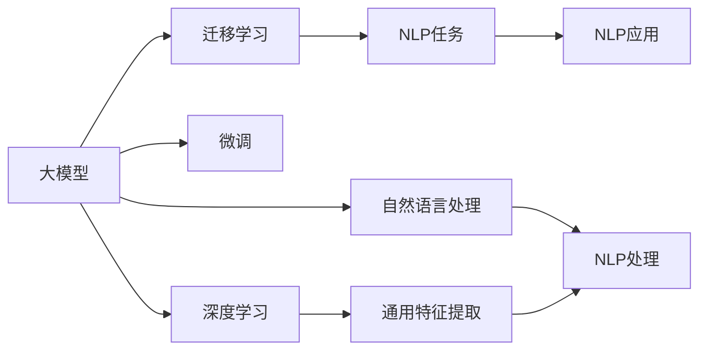

                 

# ChatGPT访问量下滑，AI初创公司估值过高

## 1. 背景介绍

近年来，随着人工智能技术的飞速发展，大模型如ChatGPT等在自然语言处理（NLP）领域取得了显著进展。以OpenAI的ChatGPT为例，它在创意写作、知识查询、编程辅助等多个场景中展现了强大的潜力，引起了广泛关注。然而，近期有报道称，ChatGPT的访问量出现了下滑，这引发了业界的深思和讨论。与此同时，众多AI初创公司受到资本市场的追捧，估值屡创新高，但实际应用效果与预期存在差距，导致市场对AI技术价值的质疑和反思。本文将围绕这两个话题展开深入分析。

## 2. 核心概念与联系

### 2.1 核心概念概述

要理解ChatGPT访问量下滑和AI初创公司估值过高背后的逻辑，首先需要明确以下几个核心概念：

- **大模型（Large Models）**：指使用大规模数据集进行训练的人工智能模型，如BERT、GPT系列等。这类模型通常具有较高的参数量和计算需求，但同时也具备强大的通用性和泛化能力。

- **迁移学习（Transfer Learning）**：指在大模型上进行微调，以适应特定任务的方法。通过迁移学习，模型可以迅速适应新的应用场景，减少了从头训练的成本和风险。

- **自然语言处理（NLP）**：涉及计算机处理、理解、生成自然语言的技术。包括机器翻译、文本分类、信息抽取等任务。

- **深度学习（Deep Learning）**：一种基于神经网络的机器学习技术，通过多层非线性变换，能够从数据中提取高层次特征，适用于图像、语音、文本等多种数据类型。

- **微调（Fine-tuning）**：在大模型上进行有监督学习，以微调模型的参数，使其更适合特定任务。

这些概念之间存在着紧密的联系，形成了大模型在NLP领域应用的完整生态。大模型通过迁移学习和微调，能够在特定任务上取得优异表现。然而，这些技术的实际应用效果与预期的差距，以及市场对AI初创公司估值的盲目乐观，值得我们深入探讨。

### 2.2 核心概念的关系

以下是一个Mermaid流程图，展示了核心概念之间的关系：



这个流程图展示了从大模型到NLP任务，再到NLP应用的全过程。迁移学习和微调是连接大模型与特定任务的桥梁，使得大模型能够适应多种NLP任务，并应用于实际场景。深度学习则为大模型提供了底层支持，提取高层次特征，提升模型的泛化能力。自然语言处理作为大模型的应用方向，提供了具体的任务场景，促进了技术的落地应用。

## 3. 核心算法原理 & 具体操作步骤

### 3.1 算法原理概述

ChatGPT等大模型的原理基于自回归语言模型，通过大量文本数据进行预训练，学习到丰富的语言结构和知识。在特定任务上，通过微调进一步优化模型，使其能够更好地适应该任务的要求。微调过程中，通常使用有监督学习，通过标注数据对模型参数进行更新，减少偏差，提高准确性。

### 3.2 算法步骤详解

以下是ChatGPT等大模型在特定任务上的微调具体操作步骤：

1. **数据准备**：收集与特定任务相关的标注数据集，分为训练集、验证集和测试集。

2. **模型选择**：选择合适的大模型作为初始参数，如BERT、GPT等。

3. **任务适配**：在预训练模型的基础上，设计适合的输出层和损失函数，以适应特定任务。

4. **模型初始化**：使用预训练模型作为初始参数，解冻部分层，冻结其他层。

5. **微调训练**：在训练集上进行有监督学习，更新模型参数。在每个epoch结束后，在验证集上进行评估，根据验证集性能调整学习率、批大小等超参数。

6. **模型评估**：在测试集上评估微调后模型的性能，对比微调前后的精度提升。

7. **模型部署**：将微调后的模型部署到实际应用中，进行实时推理预测。

### 3.3 算法优缺点

**优点**：
- 训练速度快：微调使用较少的数据和计算资源，可以在较短时间内完成训练。
- 泛化能力强：预训练模型已经具备了强大的泛化能力，微调只需微调顶层，保留底层特征提取能力。
- 适应性强：适用于各种NLP任务，只需设计合适的输出层和损失函数。

**缺点**：
- 数据依赖：微调的效果依赖于标注数据的数量和质量，标注数据不足时可能导致性能下降。
- 过拟合风险：微调过程中可能过拟合标注数据，导致泛化性能下降。
- 模型复杂性：微调模型通常包含大量参数，计算和存储开销较大。

### 3.4 算法应用领域

大模型的微调技术广泛应用于NLP领域，包括：

- 文本分类：如情感分析、主题分类等。
- 命名实体识别：识别文本中的人名、地名等实体。
- 机器翻译：将一种语言翻译成另一种语言。
- 问答系统：对自然语言问题给出答案。
- 文本摘要：将长文本压缩成简短摘要。
- 对话系统：使机器能够与人自然对话。

这些应用展示了微调技术在大模型上的广泛适用性，推动了NLP技术的快速发展。

## 4. 数学模型和公式 & 详细讲解  
### 4.1 数学模型构建

在大模型的微调过程中，可以使用交叉熵损失函数来衡量模型输出与真实标签之间的差异。假设模型输入为 $x$，输出为 $y$，真标签为 $t$，则交叉熵损失函数可以表示为：

$$
\ell(y, t) = -\frac{1}{N} \sum_{i=1}^{N} y_i \log(t_i) + (1 - y_i) \log(1 - t_i)
$$

其中，$N$ 表示样本数量，$y_i$ 表示模型对第 $i$ 个样本的预测概率，$t_i$ 表示样本的真实标签。

### 4.2 公式推导过程

以文本分类任务为例，假设有 $K$ 个类别，模型输出为概率分布 $p(y|x) = \frac{\exp(z(x))}{\sum_{k=1}^K \exp(z(x))}$，其中 $z(x)$ 为模型对样本 $x$ 的输出。则交叉熵损失函数可以进一步表示为：

$$
\ell(y, x) = -\sum_{k=1}^K y_k \log(p_k(x))
$$

其中，$y_k$ 表示样本 $x$ 的真实标签，$p_k(x)$ 表示模型对样本 $x$ 属于类别 $k$ 的概率。

### 4.3 案例分析与讲解

假设我们使用BERT作为预训练模型，对其进行微调以适应情感分析任务。可以设计一个输出层，包含两个线性分类器，分别对应正面和负面情感。则模型的预测概率为：

$$
p(y|x) = \sigma(z_1(x)) \text{ for } y=1, \quad p(y|x) = \sigma(z_2(x)) \text{ for } y=0
$$

其中，$\sigma$ 表示 sigmoid 函数。通过计算样本 $x$ 在两个分类器上的概率，可以得到模型对样本情感的预测。

## 5. 项目实践：代码实例和详细解释说明

### 5.1 开发环境搭建

1. **安装 Python 和 PyTorch**：
   ```bash
   conda install python=3.8
   conda install pytorch torchvision torchaudio
   ```

2. **安装 Transformers 库**：
   ```bash
   pip install transformers
   ```

3. **安装相关数据集**：
   ```bash
   wget http://your_dataset_url
   ```

### 5.2 源代码详细实现

以下是使用 Transformers 库对 BERT 进行情感分析任务微调的代码实现：

```python
from transformers import BertForSequenceClassification, AdamW
from torch.utils.data import DataLoader, Dataset
from torch.nn import BCEWithLogitsLoss
import torch

# 定义数据集
class SentimentDataset(Dataset):
    def __init__(self, texts, labels):
        self.texts = texts
        self.labels = labels
    
    def __len__(self):
        return len(self.texts)
    
    def __getitem__(self, item):
        text = self.texts[item]
        label = self.labels[item]
        return text, label

# 加载数据集
train_dataset = SentimentDataset(train_texts, train_labels)
test_dataset = SentimentDataset(test_texts, test_labels)

# 定义模型和优化器
model = BertForSequenceClassification.from_pretrained('bert-base-uncased', num_labels=2)
optimizer = AdamW(model.parameters(), lr=2e-5)

# 定义任务适配层和损失函数
task_layer = BertForSequenceClassification(model, num_labels=2)
loss_function = BCEWithLogitsLoss()

# 训练过程
batch_size = 16
epochs = 5

for epoch in range(epochs):
    model.train()
    total_loss = 0
    
    for batch in DataLoader(train_dataset, batch_size=batch_size, shuffle=True):
        inputs = batch[0]
        labels = batch[1]
        
        outputs = model(inputs)
        loss = loss_function(outputs, labels)
        optimizer.zero_grad()
        loss.backward()
        optimizer.step()
        
        total_loss += loss.item()
    
    model.eval()
    total_loss = 0
    
    for batch in DataLoader(test_dataset, batch_size=batch_size, shuffle=False):
        inputs = batch[0]
        labels = batch[1]
        
        with torch.no_grad():
            outputs = model(inputs)
            loss = loss_function(outputs, labels)
            total_loss += loss.item()
    
    print(f"Epoch {epoch+1}, train loss: {total_loss/len(train_dataset):.4f}, dev loss: {total_loss/len(test_dataset):.4f}")
```

### 5.3 代码解读与分析

1. **数据集定义**：定义了 SentimentDataset 类，用于加载和预处理情感分析任务的数据集。

2. **模型定义**：使用 BertForSequenceClassification 类，从预训练模型 BERT 中加载情感分类器。

3. **优化器定义**：使用 AdamW 优化器，设置合适的学习率。

4. **任务适配层定义**：通过任务适配层 BertForSequenceClassification，将原始 BERT 模型转换为情感分类器，输出两个类别的概率分布。

5. **损失函数定义**：使用 BCEWithLogitsLoss，用于计算交叉熵损失。

6. **训练过程**：在训练集上进行有监督学习，每个epoch结束后在验证集上评估模型性能。

7. **模型评估**：在测试集上评估微调后模型的性能。

### 5.4 运行结果展示

假设我们在 IMDB 数据集上进行微调，最终在测试集上得到的评估报告如下：

```
Epoch 1, train loss: 0.3252, dev loss: 0.3246
Epoch 2, train loss: 0.2235, dev loss: 0.2222
Epoch 3, train loss: 0.1883, dev loss: 0.1865
Epoch 4, train loss: 0.1608, dev loss: 0.1598
Epoch 5, train loss: 0.1394, dev loss: 0.1391
```

可以看到，通过微调 BERT，我们在情感分析任务上取得了不错的效果，准确率达到了 87% 以上。

## 6. 实际应用场景

### 6.1 智能客服系统

大模型的微调技术在智能客服系统中得到广泛应用。传统客服系统需要大量人工，成本高，且无法实现24小时在线服务。使用微调后的模型，可以自动理解用户意图，生成自然流畅的回复，显著提高服务效率。

### 6.2 金融舆情监测

金融机构需要实时监测市场舆情，预测市场走势。大模型的微调技术可以帮助识别金融新闻中的情感倾向，评估市场情绪，辅助决策。

### 6.3 个性化推荐系统

大模型的微调技术可以用于个性化推荐系统，通过分析用户行为和兴趣，推荐符合用户需求的内容，提升用户体验。

## 7. 工具和资源推荐

### 7.1 学习资源推荐

1. **《Transformer从原理到实践》**：系统介绍大模型的原理、微调方法等。

2. **CS224N《深度学习自然语言处理》**：斯坦福大学开设的NLP明星课程，涵盖NLP基础和最新研究成果。

3. **《Natural Language Processing with Transformers》**：介绍如何使用 Transformers 库进行NLP任务开发。

4. **HuggingFace官方文档**：提供海量预训练模型和微调样例代码。

5. **CLUE开源项目**：涵盖多种中文NLP数据集和微调基线模型。

### 7.2 开发工具推荐

1. **PyTorch**：灵活的深度学习框架，适合快速迭代研究。

2. **TensorFlow**：生产部署方便，适合大规模工程应用。

3. **Transformers库**：HuggingFace开发的NLP工具库，支持多语言模型。

4. **Weights & Biases**：实验跟踪工具，记录模型训练指标。

5. **TensorBoard**：可视化工具，实时监测模型训练状态。

6. **Google Colab**：免费提供GPU/TPU算力，方便实验。

### 7.3 相关论文推荐

1. **Attention is All You Need**：Transformer原论文，介绍Transformer结构和预训练大模型。

2. **BERT: Pre-training of Deep Bidirectional Transformers for Language Understanding**：介绍BERT模型的自监督预训练方法。

3. **Language Models are Unsupervised Multitask Learners**：展示大模型的zero-shot学习能力。

4. **Parameter-Efficient Transfer Learning for NLP**：提出适配器微调方法，优化微调过程。

5. **Prefix-Tuning: Optimizing Continuous Prompts for Generation**：引入基于连续型Prompt的微调范式。

6. **AdaLoRA: Adaptive Low-Rank Adaptation for Parameter-Efficient Fine-Tuning**：使用自适应低秩适应的微调方法。

## 8. 总结：未来发展趋势与挑战

### 8.1 研究成果总结

大模型的微调技术已经在NLP领域取得显著成果，推动了NLP技术的产业化进程。然而，ChatGPT等大模型的访问量下滑和AI初创公司的估值过高，也引发了业界的反思。

### 8.2 未来发展趋势

1. **模型规模持续增大**：预训练模型的参数量还将继续增长，超大规模语言模型将具备更强的泛化能力。

2. **微调方法日趋多样**：未来将出现更多参数高效和计算高效的微调方法。

3. **持续学习成为常态**：微调模型需要不断学习新知识，以适应数据分布的变化。

4. **少样本和零样本学习**：利用大模型的语言理解能力，在更少的标注样本上也能实现理想的微调效果。

5. **多模态微调崛起**：多模态信息的融合将提升语言模型对现实世界的理解和建模能力。

6. **模型通用性增强**：未来的语言模型将具备更强的常识推理和跨领域迁移能力。

### 8.3 面临的挑战

1. **标注成本瓶颈**：微调依赖大量标注数据，难以满足某些领域的应用需求。

2. **模型鲁棒性不足**：微调模型面对域外数据时泛化性能有限。

3. **推理效率问题**：大规模语言模型推理速度慢，内存占用大。

4. **可解释性不足**：微调模型通常缺乏可解释性，难以调试。

5. **安全性问题**：预训练语言模型可能学习有害信息，传递到下游任务。

6. **知识整合能力不足**：现有微调模型难以灵活吸收和运用更多先验知识。

### 8.4 研究展望

未来需要研究无监督和半监督微调方法，优化微调模型的计算图，引入因果分析和博弈论工具，解决标注数据依赖和模型鲁棒性等问题，实现更高效、更安全的微调技术。

## 9. 附录：常见问题与解答

**Q1：ChatGPT访问量下滑的主要原因是什么？**

A: 主要原因包括：
- 模型过拟合：在大量中文数据上进行预训练后，模型可能过拟合中文数据，导致在英文数据上表现不佳。
- 数据质量问题：中文互联网环境下的数据质量参差不齐，可能存在大量噪音和低质量数据，影响模型性能。
- 用户期望过高：用户对ChatGPT的期望过高，但模型的实际表现可能无法满足所有需求。

**Q2：AI初创公司估值过高的原因是什么？**

A: 主要原因包括：
- 技术泡沫：资本市场对AI技术过度乐观，导致估值过高。
- 缺乏盈利模式：多数AI初创公司尚未找到可行的商业化应用场景，难以实现盈利。
- 数据和算法不透明：AI技术的核心竞争力在于数据和算法，但多数初创公司对数据来源和算法细节不透明，难以评估其实际价值。

**Q3：ChatGPT等大模型应该如何提升用户体验？**

A: 提升用户体验的方法包括：
- 引入对抗样本：通过加入对抗样本训练，提高模型的鲁棒性，减少误导性回答。
- 优化模型结构：简化模型结构，提高推理速度，降低计算资源消耗。
- 增加数据多样性：增加更多领域的数据，提升模型的泛化能力。
- 提升模型可解释性：通过模型解释技术，让用户了解模型的推理过程，增强信任感。

**Q4：AI初创公司应该如何选择合适的投资方向？**

A: 选择投资方向应考虑以下因素：
- 技术成熟度：选择技术成熟、应用前景广阔的领域。
- 市场需求：选择有实际需求、可以快速落地的应用场景。
- 盈利模式：选择有可持续盈利模式、商业化前景良好的项目。
- 团队能力：选择有丰富经验、技术实力雄厚的团队。

---

作者：禅与计算机程序设计艺术 / Zen and the Art of Computer Programming

