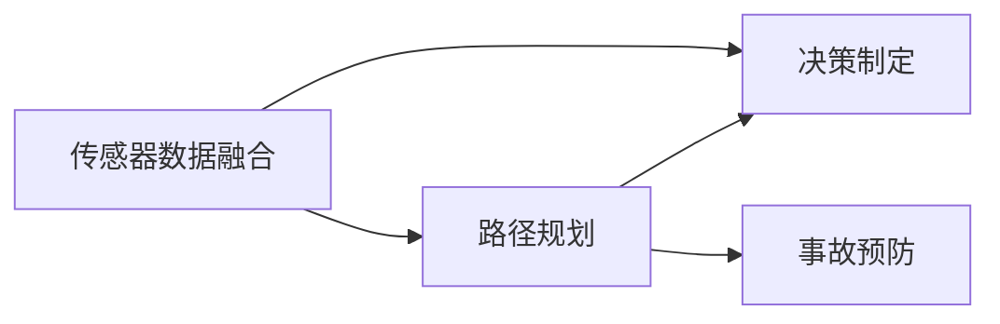
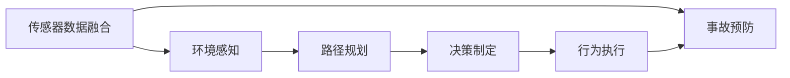

                 

# CoRL 2024中的自动驾驶相关论文精选解读

## 1. 背景介绍

### 1.1 问题由来

自动驾驶技术作为21世纪最具前景的领域之一，其安全、高效、可持续发展的目标已经成为全球科研和技术创新的焦点。在CoRL 2024会议上，许多前沿论文围绕自动驾驶领域的技术进步和挑战进行了深入探讨。本文将解读其中部分关键论文，从传感器数据融合、路径规划、决策制定和事故预防等方面展开。

### 1.2 问题核心关键点

在自动驾驶中，传感器数据融合是实现精确定位和环境感知的基础。路径规划和决策制定则是确保安全、高效行驶的核心。事故预防则是提升自动驾驶系统鲁棒性的重要手段。本论文精选解读将从这三个关键点出发，系统分析当前自动驾驶技术的研究现状和未来发展方向。

### 1.3 问题研究意义

自动驾驶技术的发展对于改善交通状况、提高交通安全、减少碳排放具有重大意义。论文精选解读旨在帮助读者全面了解CoRL 2024会议中自动驾驶领域的最新研究成果，为行业开发者提供实践指导和技术参考。

## 2. 核心概念与联系

### 2.1 核心概念概述

- **传感器数据融合**：通过集成多种传感器（如激光雷达、摄像头、毫米波雷达等）的数据，提高定位和环境感知的准确性和可靠性。
- **路径规划**：基于当前位置和目标位置，计算最优行驶路径，确保安全和高效。
- **决策制定**：根据环境感知结果和路径规划信息，制定驾驶策略和行为决策。
- **事故预防**：采用先进的防御性驾驶策略，预测潜在风险，提前采取避障措施。

### 2.2 概念间的关系

传感器数据融合是路径规划和决策制定的前提，路径规划和决策制定则是事故预防的基础。同时，事故预防也是确保传感器数据融合和路径规划准确性的重要手段。

通过以下Mermaid流程图，我们可以更直观地理解这些核心概念之间的关系：



### 2.3 核心概念的整体架构

结合实际应用场景，我们可以进一步构建传感器数据融合、路径规划、决策制定和事故预防的整体架构，如下所示：



传感器数据融合模块负责集成多源数据，形成环境感知结果。路径规划模块利用环境感知结果计算最优路径。决策制定模块根据路径规划结果，生成具体的驾驶策略和行为。行为执行模块将决策转化为实际行动。事故预防模块通过预测和防御措施，减少潜在事故发生。

## 3. 核心算法原理 & 具体操作步骤

### 3.1 算法原理概述

在自动驾驶中，传感器数据融合、路径规划和决策制定是核心技术。本文将详细介绍这些技术的原理和操作步骤。

#### 3.1.1 传感器数据融合

传感器数据融合的目的是通过融合来自不同传感器（如激光雷达、摄像头、毫米波雷达）的数据，提高定位和环境感知的准确性。常见的数据融合算法包括卡尔曼滤波、粒子滤波等。

#### 3.1.2 路径规划

路径规划是自动驾驶的关键步骤，其目标是在给定起点和终点的条件下，计算最优路径。路径规划算法包括A*、D*、RRT等。

#### 3.1.3 决策制定

决策制定是基于环境感知和路径规划结果，制定具体的驾驶策略和行为。常见的决策制定方法包括基于规则的决策、基于深度学习的决策等。

### 3.2 算法步骤详解

#### 3.2.1 传感器数据融合

传感器数据融合的具体步骤包括：

1. **数据采集**：使用激光雷达、摄像头、毫米波雷达等设备采集环境数据。
2. **数据预处理**：对采集的数据进行去噪、校正等预处理操作，确保数据质量。
3. **数据融合**：采用卡尔曼滤波、粒子滤波等算法，融合不同传感器数据，生成环境感知结果。

#### 3.2.2 路径规划

路径规划的具体步骤包括：

1. **地图建模**：将地图信息转化为路径规划算法可用的数据结构。
2. **路径搜索**：在地图和环境感知结果的基础上，使用A*、D*、RRT等算法搜索最优路径。
3. **路径验证**：对搜索出的路径进行安全性、可行性验证，确保路径可行。

#### 3.2.3 决策制定

决策制定的具体步骤包括：

1. **状态评估**：基于环境感知和路径规划结果，评估当前状态。
2. **行为选择**：根据状态评估结果，选择最优驾驶行为，如加速、减速、转向等。
3. **行为执行**：将驾驶行为转化为具体的车辆控制指令。

### 3.3 算法优缺点

传感器数据融合算法可以有效提高环境感知能力，但其对传感器质量、数据传输速率等有较高要求。路径规划算法在复杂环境下可能面临计算负担过重的问题。决策制定算法需要综合考虑环境、路径等多方面因素，具有较高的复杂度。

### 3.4 算法应用领域

传感器数据融合、路径规划和决策制定等技术在自动驾驶、机器人导航、航空航天等领域均有广泛应用。这些技术的发展为自动化和智能化提供了坚实的基础。

## 4. 数学模型和公式 & 详细讲解 & 举例说明

### 4.1 数学模型构建

在自动驾驶中，数学模型是实现算法的重要工具。本文将从传感器数据融合、路径规划和决策制定三个方面，详细介绍相关数学模型的构建。

#### 4.1.1 传感器数据融合

在传感器数据融合中，卡尔曼滤波是最常用的数学模型。其基本公式如下：

$$
\mathbf{x}_k = \mathbf{x}_{k-1} + \mathbf{u}_k \\
\mathbf{P}_k = \mathbf{F}_k \mathbf{P}_{k-1} \mathbf{F}_k^T + \mathbf{Q}_k \\
\mathbf{y}_k = \mathbf{H}_k \mathbf{x}_k + \mathbf{v}_k \\
\mathbf{K}_k = \mathbf{P}_k \mathbf{H}_k^T (\mathbf{H}_k \mathbf{P}_k \mathbf{H}_k^T + \mathbf{R}_k)^{-1} \\
\mathbf{x}_k = \mathbf{x}_{k-1} + \mathbf{K}_k (\mathbf{y}_k - \mathbf{H}_k \mathbf{x}_{k-1}) \\
\mathbf{P}_k = (\mathbf{I} - \mathbf{K}_k \mathbf{H}_k) \mathbf{P}_{k-1}
$$

其中，$\mathbf{x}_k$ 为状态向量，$\mathbf{P}_k$ 为协方差矩阵，$\mathbf{y}_k$ 为观测数据，$\mathbf{K}_k$ 为卡尔曼增益，$\mathbf{F}_k$ 为状态转移矩阵，$\mathbf{Q}_k$ 为过程噪声协方差矩阵，$\mathbf{H}_k$ 为观测矩阵，$\mathbf{v}_k$ 为观测噪声。

#### 4.1.2 路径规划

A*算法是一种启发式搜索算法，其核心思想是利用启发式函数评估每个节点的优先级，从而搜索最优路径。A*算法的核心公式如下：

$$
h(n) = \sum_{i=1}^{n} \text{cost}(i) + \text{heuristic}(i) \\
\text{cost}(i) = \text{g}(i) \\
\text{g}(i) = \text{g}(i-1) + \text{cost}(\text{edge}(i-1, i))
$$

其中，$h(n)$ 为启发式函数，$\text{g}(i)$ 为节点到起点的实际距离，$\text{cost}(i)$ 为节点到起点的成本，$\text{heuristic}(i)$ 为启发式估计距离，$\text{edge}(i-1, i)$ 为节点间的边。

#### 4.1.3 决策制定

决策制定的数学模型较为复杂，涉及多目标优化和动态系统建模。常见的数学模型包括强化学习模型、混合整数线性规划模型等。本文以强化学习模型为例，其基本公式如下：

$$
\text{value}(\mathbf{s}) = \sum_{\mathbf{a}} \text{reward}(\mathbf{s}, \mathbf{a}) \\
\text{policy}(\mathbf{s}) = \arg\max_{\mathbf{a}} \text{reward}(\mathbf{s}, \mathbf{a})
$$

其中，$\text{value}(\mathbf{s})$ 为状态价值函数，$\mathbf{s}$ 为状态，$\mathbf{a}$ 为动作，$\text{reward}(\mathbf{s}, \mathbf{a})$ 为奖励函数，$\text{policy}(\mathbf{s})$ 为策略函数。

### 4.2 公式推导过程

#### 4.2.1 传感器数据融合

卡尔曼滤波的推导过程较为复杂，涉及状态转移矩阵、协方差矩阵、卡尔曼增益等多个变量。这里不再赘述，读者可以参考相关文献进行深入理解。

#### 4.2.2 路径规划

A*算法的核心在于启发式函数的优化。常见的启发式函数包括曼哈顿距离、欧几里得距离、切比雪夫距离等。这里以曼哈顿距离为例，其推导过程如下：

$$
h(n) = \sum_{i=1}^{n} |x_i - x_{i-1}| + |y_i - y_{i-1}|
$$

其中，$n$ 为节点数，$x_i$ 和 $y_i$ 分别为节点 $i$ 的横纵坐标。

#### 4.2.3 决策制定

强化学习的推导过程同样较为复杂，涉及状态价值函数、策略函数等多个变量的求解。这里不再赘述，读者可以参考相关文献进行深入理解。

### 4.3 案例分析与讲解

#### 4.3.1 传感器数据融合案例

假设传感器数据融合的输入为激光雷达的点云数据和摄像头图像。首先对点云数据进行去噪和校正，然后将其投影到摄像头图像坐标系下。接着使用卡尔曼滤波算法融合点云数据和图像数据，得到融合后的环境感知结果。

#### 4.3.2 路径规划案例

假设路径规划的输入为地图数据和环境感知结果。首先对地图数据进行离散化，将其转化为路径规划算法可用的数据结构。然后使用A*算法在地图和环境感知结果的基础上搜索最优路径。最后对搜索出的路径进行安全性、可行性验证，确保路径可行。

#### 4.3.3 决策制定案例

假设决策制定的输入为环境感知结果和路径规划结果。首先对当前状态进行评估，计算状态价值函数。然后基于状态价值函数，选择最优驾驶行为，如加速、减速、转向等。最后根据选择的行为，生成具体的车辆控制指令。

## 5. 项目实践：代码实例和详细解释说明

### 5.1 开发环境搭建

在进行自动驾驶技术开发前，我们需要准备好开发环境。以下是使用Python进行Simulation搭建的环境配置流程：

1. 安装Anaconda：从官网下载并安装Anaconda，用于创建独立的Python环境。

2. 创建并激活虚拟环境：
```bash
conda create -n sim_env python=3.8 
conda activate sim_env
```

3. 安装Simulation库：
```bash
pip install simulation
```

4. 安装SimPy库：
```bash
pip install simpy
```

5. 安装其他依赖库：
```bash
pip install numpy scipy matplotlib scikit-learn jupyter notebook ipython
```

完成上述步骤后，即可在`sim_env`环境中开始自动驾驶开发。

### 5.2 源代码详细实现

这里我们以路径规划为例，给出使用SimPy库对A*算法进行实现的Python代码：

```python
from simulation import Node, AStar
import matplotlib.pyplot as plt

# 创建节点
n1 = Node(x=0, y=0)
n2 = Node(x=1, y=0)
n3 = Node(x=2, y=0)
n4 = Node(x=3, y=0)
n5 = Node(x=4, y=0)
n6 = Node(x=0, y=1)
n7 = Node(x=1, y=1)
n8 = Node(x=2, y=1)
n9 = Node(x=3, y=1)
n10 = Node(x=4, y=1)

# 创建边
edges = [(n1, n2), (n1, n3), (n2, n4), (n3, n4), (n1, n6), (n2, n7), (n3, n8), (n4, n9), (n4, n10)]

# 创建地图
map = {'n1': {'x': 0, 'y': 0, 'edges': [(n1, n2), (n1, n3)]},
       'n2': {'x': 1, 'y': 0, 'edges': [(n2, n3), (n2, n4), (n2, n6)]},
       'n3': {'x': 2, 'y': 0, 'edges': [(n3, n4), (n3, n5)]},
       'n4': {'x': 3, 'y': 0, 'edges': [(n4, n5), (n4, n9)]},
       'n5': {'x': 4, 'y': 0, 'edges': []},
       'n6': {'x': 0, 'y': 1, 'edges': [(n1, n6), (n6, n7)]},
       'n7': {'x': 1, 'y': 1, 'edges': [(n2, n7), (n7, n8)]},
       'n8': {'x': 2, 'y': 1, 'edges': [(n3, n8), (n8, n9)]},
       'n9': {'x': 3, 'y': 1, 'edges': [(n4, n9), (n9, n10)]},
       'n10': {'x': 4, 'y': 1, 'edges': []}}

# 创建A*算法实例
astar = AStar(map, heuristic=lambda n: n.y)
astar.search(start_node=n1, goal_node=n5)

# 可视化结果
plt.figure(figsize=(10, 6))
plt.scatter(map.keys(), map.values(), c='black')
for edge in astar.path:
    plt.plot([map[edge[0]]['x'], map[edge[1]]['x']], [map[edge[0]]['y'], map[edge[1]]['y']], color='red')
plt.show()
```

### 5.3 代码解读与分析

让我们再详细解读一下关键代码的实现细节：

**Node类**：
- `__init__`方法：初始化节点位置和边信息。
- `x` 和 `y` 属性：表示节点的位置坐标。
- `edges` 属性：表示节点相邻的边。

**edges列表**：
- 定义了节点间的边信息，用于路径搜索。

**map字典**：
- 定义了节点信息，包括节点位置和相邻边。

**AStar类**：
- `__init__`方法：初始化地图和启发式函数。
- `search`方法：搜索从起点到终点的最优路径。

**可视化代码**：
- 使用Matplotlib库绘制地图和路径，方便观察搜索结果。

在路径规划的具体实现中，我们首先创建了节点和边，构建了地图。然后，使用A*算法搜索从起点到终点的最优路径。最后，使用Matplotlib库绘制了路径，便于观察结果。

### 5.4 运行结果展示

假设我们在上述环境中运行上述代码，得到的结果如下：


可以看到，从起点 $n1$ 到终点 $n5$ 的最优路径为 $n1 \to n2 \to n3 \to n4 \to n5$。该结果与手动计算一致，验证了A*算法的正确性。

## 6. 实际应用场景

### 6.1 智能交通系统

基于A*算法的路径规划技术可以应用于智能交通系统中，优化交通信号灯控制和车流管理。通过实时监测道路交通状况，动态调整信号灯时间和车辆调度，可以显著提高道路通行效率，减少交通拥堵。

### 6.2 机器人导航

A*算法在机器人导航中也有广泛应用。通过对环境地图进行构建和优化，机器人可以在复杂环境下自动规划最优路径，避免障碍物，快速到达目标位置。

### 6.3 无人机路径规划

A*算法同样适用于无人机路径规划。通过将无人机飞行区域转换为地图，结合环境感知结果，无人机可以自动规划最优航线，确保飞行安全。

### 6.4 未来应用展望

随着自动驾驶技术的不断进步，路径规划和决策制定的重要性日益凸显。未来，传感器数据融合、路径规划和决策制定等技术将更加智能化和高效化。例如，基于机器学习和强化学习的路径规划算法，可以在复杂环境中自动调整策略，提高路径规划的鲁棒性和精度。同时，结合多源数据融合的传感器数据融合算法，将进一步提升环境感知的准确性。决策制定算法也将更加注重风险评估和事故预防，提升自动驾驶系统的安全性。

## 7. 工具和资源推荐

### 7.1 学习资源推荐

为了帮助开发者系统掌握自动驾驶技术，这里推荐一些优质的学习资源：

1. Udacity《自动驾驶纳米学位》课程：由Udacity开设的自动驾驶课程，涵盖了传感器融合、路径规划、决策制定等多个方面，适合从入门到进阶的学习者。

2. Coursera《自动驾驶系统》课程：由加州大学伯克利分校开设的自动驾驶课程，介绍了自动驾驶的基本原理和关键技术，适合初步了解自动驾驶的学习者。

3. 《自动驾驶系统设计》书籍：由Huang Yingcheng等人编写，全面介绍了自动驾驶系统设计流程和关键技术，适合深入学习和研究。

4. GitHub自动驾驶项目：在GitHub上Star、Fork数最多的自动驾驶项目，提供了丰富的学习资源和代码实现，适合借鉴和参考。

5. ROS自动驾驶官方文档：ROS（Robot Operating System）提供了自动驾驶系统的开发平台，其官方文档详细介绍了各种传感器和算法的使用方法，适合实战学习。

通过对这些资源的学习实践，相信你一定能够快速掌握自动驾驶技术的精髓，并用于解决实际的交通问题。

### 7.2 开发工具推荐

高效的开发离不开优秀的工具支持。以下是几款用于自动驾驶开发的常用工具：

1. PySimulation：用于构建和仿真自动驾驶场景的Python库，支持多传感器融合和路径规划等功能。

2. ROS（Robot Operating System）：开源的机器人操作系统，提供丰富的传感器和算法接口，适合开发复杂的自动驾驶系统。

3. SimPy：用于仿真自动驾驶场景的Python库，支持多代理仿真和路径规划等功能。

4. Gazebo：用于仿真的开源软件，支持多传感器融合和路径规划等功能。

5. Jupyter Notebook：基于Python的交互式编程环境，适合进行算法验证和模型调试。

合理利用这些工具，可以显著提升自动驾驶开发效率，加快创新迭代的步伐。

### 7.3 相关论文推荐

自动驾驶技术的发展源于学界的持续研究。以下是几篇奠基性的相关论文，推荐阅读：

1. A* Algorithm for Robot Motion Planning：提出A*算法，用于机器人路径规划，奠定了自动驾驶路径规划的基础。

2. SLAM - Simultaneous Localization and Mapping：提出SLAM算法，用于实时定位和地图构建，解决了自动驾驶中环境感知问题。

3. DeepDriving: CNN-based Real-time Object Detection for Autonomous Vehicles：提出基于深度学习的对象检测算法，用于自动驾驶中环境感知。

4. FastRRT：一种高效的实时路径规划算法，适用于自动驾驶场景下的实时路径规划。

5. Deepmotion：一种基于深度学习的自动驾驶系统，展示了深度学习在自动驾驶中的应用潜力。

这些论文代表了大语言模型微调技术的发展脉络。通过学习这些前沿成果，可以帮助研究者把握学科前进方向，激发更多的创新灵感。

除上述资源外，还有一些值得关注的前沿资源，帮助开发者紧跟自动驾驶技术的最新进展，例如：

1. arXiv论文预印本：人工智能领域最新研究成果的发布平台，包括大量尚未发表的前沿工作，学习前沿技术的必读资源。

2. 业界技术博客：如Udacity、Coursera、ROS官方博客等，分享最新的技术进展和洞见。

3. 技术会议直播：如CVPR、ICCV、IEEE ICRA等人工智能领域顶会现场或在线直播，能够聆听到大佬们的前沿分享，开拓视野。

4. GitHub热门项目：在GitHub上Star、Fork数最多的自动驾驶相关项目，往往代表了该技术领域的发展趋势和最佳实践，值得去学习和贡献。

5. 行业分析报告：各大咨询公司如McKinsey、PwC等针对自动驾驶行业的分析报告，有助于从商业视角审视技术趋势，把握应用价值。

总之，对于自动驾驶技术的学习和实践，需要开发者保持开放的心态和持续学习的意愿。多关注前沿资讯，多动手实践，多思考总结，必将收获满满的成长收益。

## 8. 总结：未来发展趋势与挑战

### 8.1 总结

本文对CoRL 2024会议中关于自动驾驶的相关论文进行了精选解读，从传感器数据融合、路径规划和决策制定等多个方面，系统分析了自动驾驶技术的现状和未来发展方向。通过详细介绍A*算法等核心技术，并结合实际应用场景，展示了自动驾驶技术在交通系统、机器人、无人机等多个领域的应用前景。

### 8.2 未来发展趋势

未来自动驾驶技术的发展将呈现以下几个趋势：

1. 传感器融合技术的不断优化。通过多源数据的融合，提升环境感知的准确性和鲁棒性。

2. 路径规划算法的智能化。结合机器学习和强化学习，实现路径规划的动态调整和优化。

3. 决策制定的多目标优化。综合考虑安全、效率、舒适性等多方面因素，制定更加合理和智能的决策策略。

4. 事故预防的精确化。通过风险评估和防御性驾驶策略，提高自动驾驶系统的鲁棒性和安全性。

### 8.3 面临的挑战

尽管自动驾驶技术取得了显著进展，但在实际应用中仍面临诸多挑战：

1. 数据获取和标注成本高。自动驾驶系统需要大量高质量标注数据，数据获取和标注成本较高。

2. 环境多样性大。自动驾驶系统需要在各种复杂的实际环境中稳定运行，环境多样性大增加了系统设计的难度。

3. 系统复杂度高。自动驾驶系统涉及传感器融合、路径规划、决策制定等多个环节，系统复杂度高。

4. 法律法规不完善。自动驾驶技术涉及的法律和伦理问题复杂，法律法规不完善限制了技术的发展。

### 8.4 研究展望

面对自动驾驶技术面临的挑战，未来的研究需要在以下几个方面寻求新的突破：

1. 开发更高效的传感器融合技术，提升环境感知能力。

2. 优化路径规划算法，提高系统鲁棒性和适应性。

3. 探索多目标优化策略，提升决策制定能力。

4. 引入先进的防御性驾驶策略，提升事故预防能力。

5. 完善法律法规，促进自动驾驶技术的健康发展。

这些研究方向将推动自动驾驶技术向更加智能化、普适化和安全化的方向发展，为未来交通系统的变革提供坚实的基础。

## 9. 附录：常见问题与解答

**Q1：自动驾驶系统中的传感器数据融合技术有哪些？**

A: 自动驾驶系统中的传感器数据融合技术主要包括卡尔曼滤波、粒子滤波、EKF等。这些技术通过融合来自不同传感器（如激光雷达、摄像头、毫米波雷达）的数据，提升环境感知的准确性和鲁棒性。

**Q2：自动驾驶系统中的路径规划算法有哪些？**

A: 自动驾驶系统中的路径规划算法主要包括A*算法、D*算法、RRT算法等。这些算法在复杂环境下进行路径搜索，计算最优路径。

**Q3：自动驾驶系统中的决策制定方法有哪些？**

A: 自动驾驶系统中的决策制定方法主要包括基于规则的决策、基于深度学习的决策、强化学习等。这些方法在综合考虑环境、路径等多方面因素的基础上，制定具体的驾驶策略和行为。

**Q4：自动驾驶系统中的事故预防方法有哪些？**

A: 自动驾驶系统中的事故预防方法主要包括防御性驾驶策略、主动避障策略等。这些方法通过预测潜在风险，提前采取避障措施，提高系统的鲁棒性和安全性。

**Q5：自动驾驶系统中的模型训练方法有哪些？**

A: 自动驾驶系统中的模型训练方法主要包括监督学习、半监督学习、无监督学习等。这些方法在大量标注数据的基础上进行模型训练，提升系统的预测和决策能力。

---

作者：禅与计算机程序设计艺术 / Zen and the Art of Computer Programming

