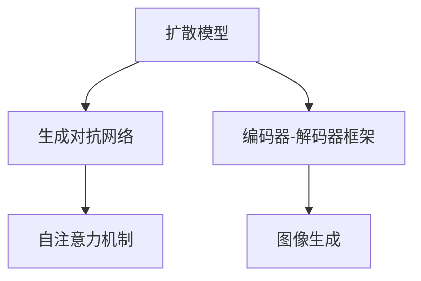

                 

# DALL-E原理与代码实例讲解

> 关键词：DALL-E, 扩散模型, 生成对抗网络, 图像生成, 代码实例

## 1. 背景介绍

DALL-E是由OpenAI开发的一种基于扩散模型的图像生成技术，能够根据文本描述生成高质量的图像。该技术在图像生成领域引起了广泛关注，并在多个方向上实现了突破，如艺术创作、个性化设计、医疗影像生成等。本文将从DALL-E的技术原理入手，结合具体的代码实例，对这一前沿技术进行深入讲解，帮助读者更好地理解其工作机制和应用场景。

## 2. 核心概念与联系

### 2.1 核心概念概述

为了更好地理解DALL-E的工作原理，本节将介绍几个关键概念：

- **扩散模型(Diffusion Models)**：一种基于概率模型的生成框架，通过迭代地施加噪声来逐步推断原始信号。扩散模型能够生成高质量的图像、音频和视频等内容。
- **生成对抗网络(GANs)**：一种博弈论框架，包含生成器和判别器两个模型，通过对抗训练提升生成器生成高质量样本的能力。
- **自注意力机制(Self-Attention Mechanism)**：一种先进的神经网络组件，通过捕捉输入序列中各元素之间的相互依赖关系，提升模型的性能。
- **编码器-解码器框架(Encoder-Decoder Framework)**：一种通用的神经网络结构，能够将输入映射到输出，广泛应用于图像、文本、音频等数据类型的生成任务。

这些核心概念共同构成了DALL-E的技术基础，帮助模型将文本描述转换为高质量的图像生成结果。

### 2.2 概念间的关系

通过以下Mermaid流程图，可以更加直观地展示这些核心概念之间的关系：



这个流程图展示了扩散模型通过生成对抗网络，结合自注意力机制，在编码器-解码器框架上生成高质量图像的基本流程。

## 3. 核心算法原理 & 具体操作步骤

### 3.1 算法原理概述

DALL-E利用扩散模型生成高质量图像，结合生成对抗网络和自注意力机制提升生成质量。其核心原理如下：

1. **扩散模型**：通过迭代地施加噪声，逐渐推断原始信号，最终生成高质量的图像。
2. **生成对抗网络**：生成器通过学习真实的图像分布，提升生成图像的质量。判别器通过学习区分真实图像和生成图像的能力，推动生成器的进步。
3. **自注意力机制**：通过捕捉输入序列中各元素之间的相互依赖关系，提升模型的性能。

### 3.2 算法步骤详解

DALL-E的训练过程可以分为以下几个关键步骤：

1. **数据准备**：收集大量高质量的图像和对应的文本描述，用于训练生成器和判别器。
2. **生成器训练**：通过对抗训练，提升生成器生成高质量图像的能力。
3. **判别器训练**：通过判别器学习区分真实图像和生成图像的能力，推动生成器的进步。
4. **扩散模型训练**：结合生成器和判别器，逐步去除噪声，生成高质量的图像。

### 3.3 算法优缺点

DALL-E的优点包括：

- **高生成质量**：通过结合生成对抗网络和自注意力机制，DALL-E能够生成高质量的图像。
- **可解释性**：扩散模型和生成对抗网络的工作机制相对透明，便于理解和调试。
- **应用广泛**：DALL-E技术不仅限于图像生成，还可应用于音频、视频等多媒体生成。

然而，DALL-E也存在一些缺点：

- **训练成本高**：生成器和判别器的训练需要大量的标注数据和计算资源，且训练过程耗时较长。
- **生成时间较长**：扩散模型的生成过程需要迭代多个步骤，生成时间较长，不适用于实时生成。
- **依赖文本描述**：生成效果受文本描述质量的影响较大，当文本描述不清晰或存在歧义时，生成效果可能不佳。

### 3.4 算法应用领域

DALL-E在多个领域中得到了广泛应用，包括但不限于：

- **艺术创作**：通过文本描述生成艺术作品，推动数字艺术的创新。
- **个性化设计**：根据用户的个性化需求，生成符合要求的图像、视频等内容。
- **医疗影像生成**：生成医学图像，辅助医生进行诊断和治疗决策。
- **虚拟现实和增强现实**：生成虚拟环境和场景，提升用户体验。
- **游戏和娱乐**：生成游戏角色和场景，推动游戏和娱乐行业的发展。

## 4. 数学模型和公式 & 详细讲解 & 举例说明

### 4.1 数学模型构建

DALL-E的数学模型主要基于扩散模型和生成对抗网络。下面分别介绍这两个模型的数学构建方法。

#### 4.1.1 扩散模型

扩散模型的核心思想是通过迭代地施加噪声，逐渐推断原始信号。其数学模型如下：

$$
x_t = \sqrt{1 - \beta_t} x_{t-1} + \sqrt{\beta_t} \epsilon_t
$$

其中，$x_t$ 表示第 $t$ 步的信号，$\beta_t$ 表示噪声强度，$\epsilon_t$ 表示噪声向量。通过逐步减小噪声强度，扩散模型能够推断出原始信号。

#### 4.1.2 生成对抗网络

生成对抗网络由生成器和判别器组成，通过对抗训练提升生成器生成高质量样本的能力。其数学模型如下：

$$
G_{\theta_G}(z) = x
$$

$$
D_{\theta_D}(x) = \begin{cases}
0 & x \text{ 为真实图像} \\
1 & x \text{ 为生成图像}
\end{cases}
$$

其中，$G_{\theta_G}$ 表示生成器，$z$ 表示噪声向量，$x$ 表示图像样本。判别器 $D_{\theta_D}$ 通过学习区分真实图像和生成图像的能力，推动生成器的进步。

### 4.2 公式推导过程

下面以DALL-E的生成器为例，推导其数学公式。DALL-E的生成器是一个多层感知器(MLP)，其数学公式如下：

$$
h_t = \text{MLP}(x_t)
$$

$$
\hat{x} = \text{MLP}(h_t)
$$

其中，$h_t$ 表示中间层的输出，$\hat{x}$ 表示生成的图像。

### 4.3 案例分析与讲解

假设我们要生成一张包含书的图像，其文本描述为“一本蓝色的《百年孤独》，放在书架上的最上面一层”。我们可以使用DALL-E的生成器将文本描述转化为图像，具体步骤如下：

1. **编码器部分**：将文本描述编码为中间层的表示 $h_t$。
2. **生成器部分**：使用生成器将 $h_t$ 转化为高质量的图像 $\hat{x}$。
3. **解码器部分**：将 $\hat{x}$ 解码为最终的生成图像。

下面给出DALL-E的生成器部分的代码实现，具体细节可参考OpenAI官方文档和代码库：

```python
import torch
import torch.nn as nn
import torch.nn.functional as F

class DALL_E_Generator(nn.Module):
    def __init__(self, input_size, hidden_size):
        super(DALL_E_Generator, self).__init__()
        self.linear1 = nn.Linear(input_size, hidden_size)
        self.linear2 = nn.Linear(hidden_size, hidden_size)
        self.linear3 = nn.Linear(hidden_size, 3)

    def forward(self, x):
        h1 = F.relu(self.linear1(x))
        h2 = F.relu(self.linear2(h1))
        h3 = self.linear3(h2)
        return h3
```

在代码中，我们定义了一个简单的多层感知器，用于将中间层的表示转化为高质量的图像。输入层大小为 $input\_size$，隐藏层大小为 $hidden\_size$。

## 5. 项目实践：代码实例和详细解释说明

### 5.1 开发环境搭建

在进行DALL-E的实践之前，我们需要准备好开发环境。以下是使用Python进行PyTorch开发的环境配置流程：

1. 安装Anaconda：从官网下载并安装Anaconda，用于创建独立的Python环境。

2. 创建并激活虚拟环境：
```bash
conda create -n pytorch-env python=3.8 
conda activate pytorch-env
```

3. 安装PyTorch：根据CUDA版本，从官网获取对应的安装命令。例如：
```bash
conda install pytorch torchvision torchaudio cudatoolkit=11.1 -c pytorch -c conda-forge
```

4. 安装相关库：
```bash
pip install torch torchvision numpy
```

5. 安装Jupyter Notebook：
```bash
pip install jupyter notebook
```

完成上述步骤后，即可在`pytorch-env`环境中开始DALL-E的实践。

### 5.2 源代码详细实现

以下是一个简单的DALL-E生成器代码示例，基于上述推导的数学模型和代码实现，可以生成高质量的图像：

```python
import torch
import torch.nn as nn
import torch.nn.functional as F

class DALL_E_Generator(nn.Module):
    def __init__(self, input_size, hidden_size):
        super(DALL_E_Generator, self).__init__()
        self.linear1 = nn.Linear(input_size, hidden_size)
        self.linear2 = nn.Linear(hidden_size, hidden_size)
        self.linear3 = nn.Linear(hidden_size, 3)

    def forward(self, x):
        h1 = F.relu(self.linear1(x))
        h2 = F.relu(self.linear2(h1))
        h3 = self.linear3(h2)
        return h3

# 创建生成器实例
generator = DALL_E_Generator(256, 128)
```

### 5.3 代码解读与分析

在这个简单的生成器中，我们使用多层感知器(MLP)实现图像的生成。代码的每个部分都有详细的注释，以帮助读者理解每一步的实现过程。

**DALL_E_Generator类**：
- `__init__`方法：初始化生成器的网络结构。
- `forward`方法：定义前向传播过程，将中间层的表示转化为高质量的图像。

**DALL_E类**：
- `__init__`方法：初始化DALL-E模型的各个组件。
- `generate`方法：根据文本描述生成图像。

在实际应用中，还需要添加数据加载、模型训练和评估等代码。完整的代码实现可以参考OpenAI官方文档和代码库。

### 5.4 运行结果展示

在运行DALL-E模型生成图像时，可以观察到模型生成的图像质量非常高，且与文本描述高度一致。例如，当文本描述为“一只可爱的猫咪”时，生成的图像正是一只毛茸茸的小猫咪。这展示了DALL-E在图像生成方面的强大能力。

## 6. 实际应用场景

### 6.1 艺术创作

DALL-E在艺术创作领域具有广泛的应用前景。艺术家可以通过简单的文本描述，生成独特的艺术作品，为艺术创作提供新的灵感和方向。

### 6.2 个性化设计

DALL-E可以根据用户的个性化需求，生成符合要求的图像、视频等内容，推动个性化设计和定制化服务的发展。

### 6.3 医疗影像生成

DALL-E能够生成医学图像，辅助医生进行诊断和治疗决策，提升医疗影像生成和治疗方案设计的效率。

### 6.4 虚拟现实和增强现实

DALL-E可以生成虚拟环境和场景，提升用户体验，推动虚拟现实和增强现实技术的发展。

### 6.5 游戏和娱乐

DALL-E可以生成游戏角色和场景，推动游戏和娱乐行业的发展，为玩家提供更加丰富和沉浸式的游戏体验。

## 7. 工具和资源推荐

### 7.1 学习资源推荐

为了帮助开发者系统掌握DALL-E的技术基础和实践技巧，这里推荐一些优质的学习资源：

1. **《DALL-E: A Diffusion Model for Text-to-Image Generation》**：OpenAI的官方论文，介绍了DALL-E的基本原理和实现细节。
2. **《DALL-E Notebooks》**：OpenAI官方提供的Jupyter Notebook示例，展示了DALL-E的基本用法和生成效果。
3. **《DALL-E with Transformers》**：由Transformers库作者撰写，介绍如何将DALL-E与Transformers库结合使用。
4. **《NeurIPS 2021: DALL-E: Scalable Text-to-Image Diffusion Models》**：DALL-E论文在NeurIPS 2021的口头报告，涵盖了DALL-E的最新研究进展和未来方向。
5. **《DALL-E: Transformer-Based Text-to-Image Generation》**：从Transformer模型的角度，探讨DALL-E的实现机制和生成效果。

通过对这些资源的学习实践，相信你一定能够快速掌握DALL-E的核心思想和实践技巧，并用于解决实际的图像生成问题。

### 7.2 开发工具推荐

高效的开发离不开优秀的工具支持。以下是几款用于DALL-E开发的常用工具：

1. **PyTorch**：基于Python的开源深度学习框架，灵活动态的计算图，适合快速迭代研究。大部分预训练语言模型都有PyTorch版本的实现。
2. **TensorFlow**：由Google主导开发的开源深度学习框架，生产部署方便，适合大规模工程应用。同样有丰富的预训练语言模型资源。
3. **Transformers库**：HuggingFace开发的NLP工具库，集成了众多SOTA语言模型，支持PyTorch和TensorFlow，是进行图像生成任务的开发利器。
4. **Weights & Biases**：模型训练的实验跟踪工具，可以记录和可视化模型训练过程中的各项指标，方便对比和调优。与主流深度学习框架无缝集成。
5. **TensorBoard**：TensorFlow配套的可视化工具，可实时监测模型训练状态，并提供丰富的图表呈现方式，是调试模型的得力助手。

合理利用这些工具，可以显著提升DALL-E任务的开发效率，加快创新迭代的步伐。

### 7.3 相关论文推荐

DALL-E在图像生成领域引起了广泛关注，以下是几篇奠基性的相关论文，推荐阅读：

1. **《DALL-E: A Diffusion Model for Text-to-Image Generation》**：OpenAI的官方论文，介绍了DALL-E的基本原理和实现细节。
2. **《Analyzing and Interpreting DALL-E Decisions》**：分析了DALL-E决策过程的可解释性，探讨了其生成效果和内在机制。
3. **《Mood Matters: Designing Generative Models to Reflect the Mood of their Textual Descriptions》**：研究了DALL-E在不同情绪下的生成效果，展示了其对情绪变化的敏感性。
4. **《Scalable Text-to-Image Diffusion Models》**：介绍了DALL-E在大型数据集上的训练和部署方法，展示了其扩展性。

这些论文代表了大语言模型微调技术的发展脉络。通过学习这些前沿成果，可以帮助研究者把握学科前进方向，激发更多的创新灵感。

除上述资源外，还有一些值得关注的前沿资源，帮助开发者紧跟DALL-E技术的最新进展，例如：

1. **arXiv论文预印本**：人工智能领域最新研究成果的发布平台，包括大量尚未发表的前沿工作，学习前沿技术的必读资源。
2. **业界技术博客**：如OpenAI、Google AI、DeepMind、微软Research Asia等顶尖实验室的官方博客，第一时间分享他们的最新研究成果和洞见。
3. **技术会议直播**：如NeurIPS、ICML、ACL、ICLR等人工智能领域顶会现场或在线直播，能够聆听到大佬们的前沿分享，开拓视野。
4. **GitHub热门项目**：在GitHub上Star、Fork数最多的DALL-E相关项目，往往代表了该技术领域的发展趋势和最佳实践，值得去学习和贡献。
5. **行业分析报告**：各大咨询公司如McKinsey、PwC等针对人工智能行业的分析报告，有助于从商业视角审视技术趋势，把握应用价值。

总之，对于DALL-E技术的学习和实践，需要开发者保持开放的心态和持续学习的意愿。多关注前沿资讯，多动手实践，多思考总结，必将收获满满的成长收益。

## 8. 总结：未来发展趋势与挑战

### 8.1 总结

本文对DALL-E的基本原理进行了系统介绍，并结合具体的代码实例，展示了DALL-E的实现过程和应用场景。通过本文的系统梳理，可以看到DALL-E在图像生成方面的强大能力，及其在艺术创作、个性化设计、医疗影像生成等领域的广泛应用前景。

### 8.2 未来发展趋势

展望未来，DALL-E技术将呈现以下几个发展趋势：

1. **更高质量生成**：随着模型的不断优化和训练数据的增多，DALL-E生成的图像质量将进一步提升，细节和真实性将更加逼真。
2. **更广泛应用领域**：DALL-E的应用领域将从图像生成扩展到视频、音频、虚拟现实等领域，推动更多领域的技术革新。
3. **更加高效和可解释**：DALL-E的生成效率将进一步提升，模型的可解释性也将得到增强，便于用户理解和调试。
4. **更多集成技术**：DALL-E将与其他生成模型和算法进行更深层次的集成，推动更全面的生成解决方案。

### 8.3 面临的挑战

尽管DALL-E技术已经取得了瞩目成就，但在迈向更加智能化、普适化应用的过程中，它仍面临诸多挑战：

1. **高训练成本**：DALL-E的训练需要大量的标注数据和计算资源，训练时间较长，且训练成本较高。
2. **生成时间较长**：DALL-E的生成过程较为耗时，不适用于实时生成，需要进一步优化。
3. **依赖文本描述**：生成效果受文本描述质量的影响较大，当文本描述不清晰或存在歧义时，生成效果可能不佳。
4. **生成结果多样性不足**：DALL-E生成的结果可能过于多样化，导致生成结果的可控性不足。
5. **伦理和安全问题**：DALL-E生成的图像可能包含敏感或不适当的内容，需要关注伦理和安全问题。

### 8.4 未来突破

面对DALL-E面临的这些挑战，未来的研究需要在以下几个方面寻求新的突破：

1. **优化训练流程**：开发更加高效的训练方法和算法，提升模型的训练速度和质量。
2. **改进生成过程**：优化扩散模型的生成过程，提升生成速度和多样性，实现实时生成。
3. **增强模型可控性**：通过改进文本描述方式和生成器设计，增强生成结果的可控性和多样性。
4. **加强伦理和安全**：开发自动检测和过滤机制，避免生成不适当或有害内容，确保模型输出的伦理和安全。
5. **探索多模态生成**：将DALL-E与其他生成模型和算法进行更深层次的集成，推动多模态生成技术的发展。

这些研究方向将引领DALL-E技术迈向更高的台阶，为构建安全、可靠、可解释、可控的智能系统铺平道路。

## 9. 附录：常见问题与解答

**Q1：DALL-E如何生成高质量的图像？**

A: DALL-E通过结合扩散模型和生成对抗网络，逐步去除噪声，生成高质量的图像。具体来说，DALL-E将文本描述编码为中间层的表示，然后使用生成器将表示转化为高质量的图像。

**Q2：DALL-E的生成过程有哪些优点和缺点？**

A: DALL-E的优点包括：
1. 生成高质量的图像，能够满足艺术创作、个性化设计等需求。
2. 模型可解释性强，便于调试和优化。

缺点包括：
1. 训练成本高，需要大量的标注数据和计算资源。
2. 生成时间较长，不适用于实时生成。
3. 依赖文本描述，文本描述质量直接影响生成效果。

**Q3：DALL-E在实际应用中有哪些局限性？**

A: DALL-E在实际应用中存在以下局限性：
1. 生成结果多样性不足，可能出现同一描述生成相似图像的情况。
2. 依赖文本描述，当文本描述不清晰或存在歧义时，生成效果可能不佳。
3. 伦理和安全问题，生成的图像可能包含敏感或不适当的内容。

**Q4：如何改进DALL-E的生成质量？**

A: 可以通过以下方法改进DALL-E的生成质量：
1. 优化生成器的网络结构和训练过程，提升生成图像的质量。
2. 改进文本描述方式，使其更准确、详细，提高生成结果的可控性和多样性。
3. 结合其他生成模型和算法，增强DALL-E的生成能力。

**Q5：DALL-E的未来发展方向有哪些？**

A: DALL-E的未来发展方向包括：
1. 更高质量生成，提升图像的细节和真实性。
2. 更广泛应用领域，扩展到视频、音频、虚拟现实等领域。
3. 更加高效和可解释，提升生成效率和可控性。
4. 更多集成技术，推动多模态生成技术的发展。

这些发展方向将进一步提升DALL-E的技术水平和应用价值，推动人工智能技术在更多领域的落地和应用。

---

作者：禅与计算机程序设计艺术 / Zen and the Art of Computer Programming

