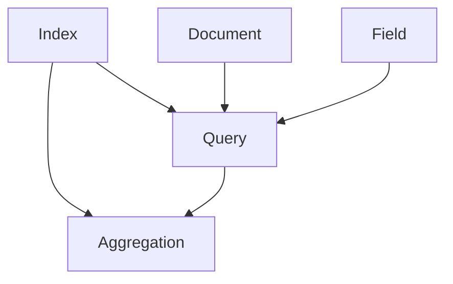
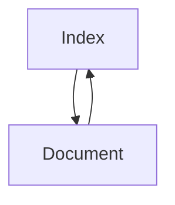
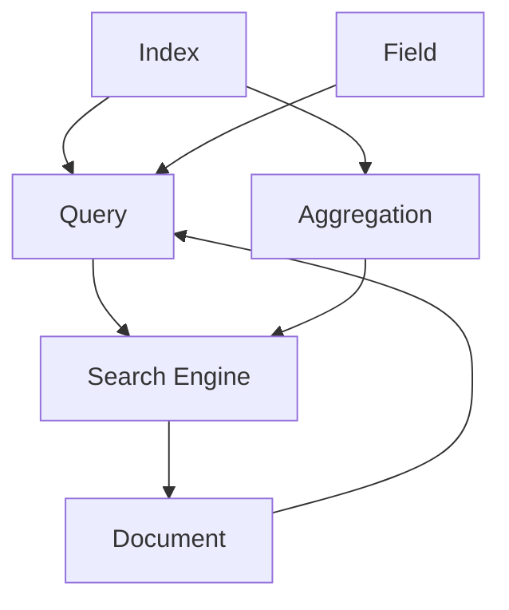
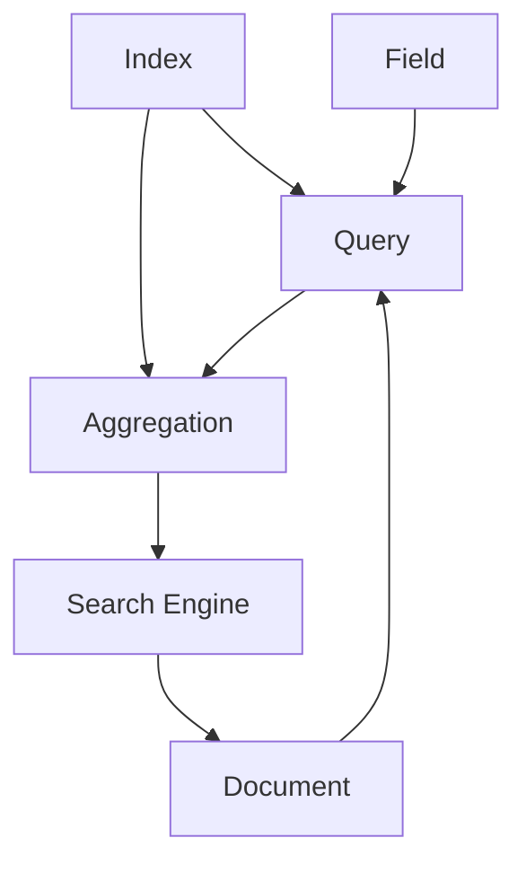

                 

# ES搜索原理与代码实例讲解

> 关键词：Elasticsearch,搜索,代码实例,索引,查询,聚合,高性能搜索,索引调优

## 1. 背景介绍

### 1.1 问题由来

随着大数据时代的到来，数据存储和处理的需求日益增长，传统的SQL数据库已难以满足需求。为了解决大规模数据的存储和查询问题，Elasticsearch（ES）应运而生，成为目前最流行的分布式搜索与分析引擎之一。ES以其高可扩展性、高可用性、强大的搜索与分析功能，广泛应用于各个领域，如电商搜索、智能客服、金融风控、物联网、日志分析等。

然而，ES作为一款商业化软件，其核心功能模块的实现原理较为复杂，对于初学者来说，理解和实现起来有一定难度。本文旨在通过深入浅出的讲解和丰富的代码实例，帮助读者全面理解Elasticsearch搜索原理，并掌握其主要功能模块的实现方法。

### 1.2 问题核心关键点

Elasticsearch的核心功能模块包括索引（Index）、文档（Document）、字段（Field）、查询（Query）、聚合（Aggregation）等。这些模块通过RESTful API接口，实现数据的存储与查询，并提供丰富的搜索与分析功能。Elasticsearch的搜索原理包括以下几个关键点：

1. 倒排索引（Inverted Index）：将文本内容中的词语转化为词项（Term）和文档ID的映射关系，快速查找包含特定词项的文档。
2. 分词器（Tokenizer）：将文本内容切分成词项，并进行词干提取、大小写规范化等预处理。
3. 查询解析器（Query Parser）：将用户输入的查询语句解析成逻辑表达式，并转化为查询树（Query Tree）。
4. 查询执行器（Query Execution）：根据查询树构建查询执行计划，并执行具体的查询操作。
5. 聚合器（Aggregation）：对查询结果进行统计聚合，生成统计数据和图表。

这些关键点共同构成了Elasticsearch搜索的核心原理，通过深入理解这些原理，可以更好地使用和优化ES，实现高效的数据存储与查询。

### 1.3 问题研究意义

Elasticsearch作为一款强大的分布式搜索与分析引擎，广泛应用于各个行业领域，具有重要的实用价值。掌握Elasticsearch的搜索原理，能够帮助开发者更好地设计、实现和优化搜索应用，提升系统性能与用户体验。同时，深入理解ES原理，还可以在实际应用中避免常见的错误，如查询效率低下、搜索结果不精确等，从而提升系统的稳定性和可用性。

此外，随着ES技术的不断发展，其应用范围和功能也在不断扩展，深入学习ES原理，将有助于掌握最新的技术动态，保持技术领先性。

## 2. 核心概念与联系

### 2.1 核心概念概述

为了更好地理解Elasticsearch的搜索原理，我们需要先介绍一些核心概念：

- Elasticsearch：一款分布式搜索与分析引擎，基于Lucene搜索引擎实现。
- 倒排索引（Inverted Index）：将文本内容中的词语转化为词项（Term）和文档ID的映射关系，快速查找包含特定词项的文档。
- 分词器（Tokenizer）：将文本内容切分成词项，并进行词干提取、大小写规范化等预处理。
- 查询解析器（Query Parser）：将用户输入的查询语句解析成逻辑表达式，并转化为查询树（Query Tree）。
- 查询执行器（Query Execution）：根据查询树构建查询执行计划，并执行具体的查询操作。
- 聚合器（Aggregation）：对查询结果进行统计聚合，生成统计数据和图表。
- 聚合（Aggregation）：对查询结果进行统计、分组等操作，生成更丰富的分析结果。
- 搜索引擎（Search Engine）：通过倒排索引和查询解析器，实现高效的数据检索和信息匹配。

这些核心概念之间的逻辑关系可以通过以下Mermaid流程图来展示：



这个流程图展示了Elasticsearch的核心组件及其之间的关系：

1. Index模块负责数据的存储与管理，Document模块负责记录数据的物理存储，Field模块负责记录文档的具体属性信息。
2. Query模块负责解析用户的查询请求，构建查询执行计划，并执行具体的查询操作。
3. Aggregation模块负责对查询结果进行统计聚合，生成更丰富的分析结果。
4. 这些模块通过RESTful API接口，实现数据的存储与查询，并提供丰富的搜索与分析功能。

### 2.2 概念间的关系

这些核心概念之间存在着紧密的联系，形成了Elasticsearch搜索的核心生态系统。下面我们通过几个Mermaid流程图来展示这些概念之间的关系。

#### 2.2.1 Index与Document的关系



这个流程图展示了Index和Document之间的关系。Index模块负责数据的存储与管理，Document模块负责记录数据的物理存储。每个Index可以包含多个Document，每个Document具有唯一ID，记录文档的属性信息。

#### 2.2.2 Query与Aggregation的关系


这个流程图展示了Query和Aggregation之间的关系。Query模块负责解析用户的查询请求，构建查询执行计划，并执行具体的查询操作。Aggregation模块负责对查询结果进行统计聚合，生成更丰富的分析结果。在实际应用中，通常会先执行Query操作，再对结果进行Aggregation操作，以便更全面地分析数据。

#### 2.2.3 Elasticsearch的查询流程



这个流程图展示了Elasticsearch的查询流程。Index模块负责数据的存储与管理，Document模块负责记录数据的物理存储，Field模块负责记录文档的具体属性信息。Query模块负责解析用户的查询请求，构建查询执行计划，并执行具体的查询操作。Aggregation模块负责对查询结果进行统计聚合，生成更丰富的分析结果。Search Engine模块通过倒排索引和查询解析器，实现高效的数据检索和信息匹配。

### 2.3 核心概念的整体架构

最后，我们用一个综合的流程图来展示这些核心概念在大语言模型微调过程中的整体架构：



这个综合流程图展示了Elasticsearch的核心组件及其之间的关系，帮助我们更清晰地理解其搜索原理。

## 3. 核心算法原理 & 具体操作步骤

### 3.1 算法原理概述

Elasticsearch的搜索原理主要基于倒排索引和查询解析器，通过这些核心组件实现高效的数据检索和信息匹配。其核心算法流程包括以下几个步骤：

1. 分词：将用户输入的文本内容进行分词，转化为词项（Term），并进行预处理。
2. 构建倒排索引：将分词结果与文档ID建立映射关系，生成倒排索引。
3. 查询解析：将用户输入的查询语句解析成逻辑表达式，并转化为查询树。
4. 查询执行：根据查询树构建查询执行计划，并执行具体的查询操作。
5. 聚合：对查询结果进行统计聚合，生成分析结果。

这些步骤共同构成了Elasticsearch搜索的核心算法流程，通过深入理解这些算法，可以更好地使用和优化ES，实现高效的数据存储与查询。

### 3.2 算法步骤详解

以下是Elasticsearch搜索算法流程的具体详细步骤：

#### 3.2.1 分词

分词是将用户输入的文本内容进行分词，转化为词项（Term），并进行预处理的过程。Elasticsearch提供多种分词器（Tokenizer），如Standard、Whitespace、Lowercase、Stop、Keyword、Pattern等，可以根据具体需求选择合适的分词器。

分词器的核心流程如下：
1. 将文本内容切分成词项（Term）。
2. 进行预处理，如词干提取、大小写规范化等。
3. 将词项转化为标准形式，以便进行倒排索引和查询匹配。

#### 3.2.2 构建倒排索引

倒排索引是将分词结果与文档ID建立映射关系，生成倒排索引的过程。Elasticsearch中的倒排索引结构如下：

```
词项1
  文档ID1: 频率1
  文档ID2: 频率2
  文档ID3: 频率3

词项2
  文档ID1: 频率1
  文档ID2: 频率2
  文档ID3: 频率3
```

每个词项（Term）映射到多个文档ID，文档ID的频率表示该词项在该文档中出现的次数。

倒排索引的构建流程如下：
1. 将分词结果中的词项与文档ID建立映射关系。
2. 统计每个词项在各个文档中的频率，并生成倒排索引。
3. 将倒排索引进行排序和压缩，以便高效查询。

#### 3.2.3 查询解析

查询解析是将用户输入的查询语句解析成逻辑表达式，并转化为查询树的过程。Elasticsearch中的查询解析器（Query Parser）支持多种查询语法，如布尔查询（Boolean Query）、文本查询（Text Query）、范围查询（Range Query）、聚合查询（Aggregation Query）等。

查询解析的流程如下：
1. 将查询语句分解成多个子查询，如布尔查询、文本查询、范围查询等。
2. 将每个子查询转化为逻辑表达式，并生成查询树。
3. 将查询树进行优化和转换，以便执行具体的查询操作。

#### 3.2.4 查询执行

查询执行是根据查询树构建查询执行计划，并执行具体的查询操作的过程。Elasticsearch中的查询执行器（Query Execution）支持多种查询操作，如精确匹配（Match）、模糊匹配（Match Phrase）、模糊搜索（Fuzzy）、前缀匹配（Prefix）、通配符匹配（Wildcard）等。

查询执行的流程如下：
1. 根据查询树构建查询执行计划。
2. 遍历查询执行计划，执行具体的查询操作。
3. 返回查询结果，并进行优化和压缩，以便高效存储和查询。

#### 3.2.5 聚合

聚合是对查询结果进行统计聚合，生成分析结果的过程。Elasticsearch中的聚合器（Aggregation）支持多种聚合方式，如求和（Sum）、计数（Count）、平均值（Average）、标准差（Std Deviation）等。

聚合的流程如下：
1. 将查询结果进行分组和统计。
2. 生成聚合数据和图表。
3. 返回聚合结果，并进行优化和压缩，以便高效存储和查询。

### 3.3 算法优缺点

Elasticsearch的搜索算法具有以下优点：
1. 高效性：通过倒排索引和查询解析器，实现高效的数据检索和信息匹配。
2. 灵活性：支持多种查询语法和聚合方式，满足各种复杂查询需求。
3. 可扩展性：支持分布式部署，实现水平扩展和高可用性。
4. 易用性：提供RESTful API接口，易于开发和集成。

同时，该算法也存在一些缺点：
1. 复杂度较高：倒排索引和查询解析器实现较为复杂，需要一定的开发和维护成本。
2. 查询效率不稳定：在处理大规模数据时，查询效率可能不稳定，需要优化和调整。
3. 内存占用较大：倒排索引和查询树需要占用较大内存，在处理大规模数据时需要考虑内存占用问题。
4. 依赖硬件配置：查询性能受到硬件配置的影响较大，需要合理配置硬件资源。

### 3.4 算法应用领域

Elasticsearch的搜索算法广泛应用于以下领域：

- 电商搜索：通过倒排索引和查询解析器，实现高效的商品搜索和推荐。
- 智能客服：通过精确匹配和模糊匹配，实现对客户问题的快速理解和回答。
- 金融风控：通过聚合和统计分析，实现对风险数据的深入挖掘和监控。
- 物联网：通过查询和聚合，实现对设备数据的实时监控和分析。
- 日志分析：通过倒排索引和查询解析器，实现对日志数据的快速检索和统计。

## 4. 数学模型和公式 & 详细讲解 & 举例说明

### 4.1 数学模型构建

在Elasticsearch中，倒排索引的构建和查询执行主要基于数学模型，以下是主要数学模型和公式的详细讲解。

#### 4.1.1 倒排索引

倒排索引是一种常用的索引结构，用于高效地存储和检索文本数据。倒排索引的核心公式如下：

$$
\text{Inverted Index} = \{ (Term, \{DocID, Frequency\}) \} 
$$

其中，Term表示词项（Term），DocID表示文档ID，Frequency表示词项在文档中出现的次数。倒排索引将每个词项映射到多个文档ID和频率，实现高效的数据存储和检索。

#### 4.1.2 查询解析

查询解析器将用户输入的查询语句解析成逻辑表达式，并转化为查询树。查询解析的主要数学模型包括布尔查询（Boolean Query）、文本查询（Text Query）、范围查询（Range Query）、聚合查询（Aggregation Query）等。以下是查询解析的主要公式：

$$
\text{Boolean Query} = (Q1 \wedge Q2 \vee Q3)
$$

$$
\text{Text Query} = \text{Term} + \text{Boost}
$$

$$
\text{Range Query} = (L \leq \text{Value} \leq R)
$$

$$
\text{Aggregation Query} = \text{Sum / Count / Average / Std Deviation}(\text{Field})
$$

其中，$Q1, Q2, Q3$表示多个子查询，$\wedge$表示逻辑与，$\vee$表示逻辑或，$\text{Term}$表示词项，$\text{Boost}$表示权重，$L$和$R$表示查询范围。

#### 4.1.3 查询执行

查询执行器根据查询树构建查询执行计划，并执行具体的查询操作。查询执行的主要数学模型包括精确匹配（Match）、模糊匹配（Match Phrase）、模糊搜索（Fuzzy）、前缀匹配（Prefix）、通配符匹配（Wildcard）等。以下是查询执行的主要公式：

$$
\text{Match} = \text{Term} \in \text{Field}
$$

$$
\text{Match Phrase} = \text{Term} \in \text{Field}
$$

$$
\text{Fuzzy} = \text{Term} ~ \text{~fuzziness} ~ \text{in} ~ \text{Field}
$$

$$
\text{Prefix} = \text{Term} ~ \text{~starts with} ~ \text{in} ~ \text{Field}
$$

$$
\text{Wildcard} = \text{Term} ~ \text{~starts or ends with} ~ \text{in} ~ \text{Field}
$$

其中，$\in$表示匹配，$fuzziness$表示模糊度，$\text{starts with}$表示以某个词项开头，$\text{starts or ends with}$表示以某个词项开头或结尾。

#### 4.1.4 聚合

聚合器对查询结果进行统计聚合，生成分析结果。聚合的主要数学模型包括求和（Sum）、计数（Count）、平均值（Average）、标准差（Std Deviation）等。以下是聚合的主要公式：

$$
\text{Sum} = \text{Sum}(\text{Field})
$$

$$
\text{Count} = \text{Count}(\text{Field})
$$

$$
\text{Average} = \text{Average}(\text{Field})
$$

$$
\text{Std Deviation} = \text{Std Deviation}(\text{Field})
$$

其中，$\text{Sum}(\text{Field})$表示对某个字段的值进行求和，$\text{Count}(\text{Field})$表示对某个字段的值进行计数，$\text{Average}(\text{Field})$表示对某个字段的值进行平均值计算，$\text{Std Deviation}(\text{Field})$表示对某个字段的值进行标准差计算。

### 4.2 公式推导过程

以下是对Elasticsearch搜索算法中主要公式的推导过程：

#### 4.2.1 倒排索引推导

倒排索引是将文本内容中的词语转化为词项（Term）和文档ID的映射关系，快速查找包含特定词项的文档。倒排索引的核心公式如下：

$$
\text{Inverted Index} = \{ (Term, \{DocID, Frequency\}) \} 
$$

其中，Term表示词项（Term），DocID表示文档ID，Frequency表示词项在文档中出现的次数。倒排索引将每个词项映射到多个文档ID和频率，实现高效的数据存储和检索。

倒排索引的推导过程如下：
1. 将文本内容进行分词，得到词项（Term）集合。
2. 遍历文本中的每个词项，查找其在文档中出现的位置。
3. 将每个词项与出现位置的文档ID和频率建立映射关系，生成倒排索引。

#### 4.2.2 查询解析推导

查询解析器将用户输入的查询语句解析成逻辑表达式，并转化为查询树。查询解析的主要数学模型包括布尔查询（Boolean Query）、文本查询（Text Query）、范围查询（Range Query）、聚合查询（Aggregation Query）等。以下是查询解析的主要公式：

$$
\text{Boolean Query} = (Q1 \wedge Q2 \vee Q3)
$$

$$
\text{Text Query} = \text{Term} + \text{Boost}
$$

$$
\text{Range Query} = (L \leq \text{Value} \leq R)
$$

$$
\text{Aggregation Query} = \text{Sum / Count / Average / Std Deviation}(\text{Field})
$$

其中，$Q1, Q2, Q3$表示多个子查询，$\wedge$表示逻辑与，$\vee$表示逻辑或，$\text{Term}$表示词项，$\text{Boost}$表示权重，$L$和$R$表示查询范围。

查询解析的推导过程如下：
1. 将查询语句分解成多个子查询，如布尔查询、文本查询、范围查询等。
2. 将每个子查询转化为逻辑表达式，并生成查询树。
3. 将查询树进行优化和转换，以便执行具体的查询操作。

#### 4.2.3 查询执行推导

查询执行器根据查询树构建查询执行计划，并执行具体的查询操作。查询执行的主要数学模型包括精确匹配（Match）、模糊匹配（Match Phrase）、模糊搜索（Fuzzy）、前缀匹配（Prefix）、通配符匹配（Wildcard）等。以下是查询执行的主要公式：

$$
\text{Match} = \text{Term} \in \text{Field}
$$

$$
\text{Match Phrase} = \text{Term} \in \text{Field}
$$

$$
\text{Fuzzy} = \text{Term} ~ \text{~fuzziness} ~ \text{in} ~ \text{Field}
$$

$$
\text{Prefix} = \text{Term} ~ \text{~starts with} ~ \text{in} ~ \text{Field}
$$

$$
\text{Wildcard} = \text{Term} ~ \text{~starts or ends with} ~ \text{in} ~ \text{Field}
$$

其中，$\in$表示匹配，$fuzziness$表示模糊度，$\text{starts with}$表示以某个词项开头，$\text{starts or ends with}$表示以某个词项开头或结尾。

查询执行的推导过程如下：
1. 根据查询树构建查询执行计划。
2. 遍历查询执行计划，执行具体的查询操作。
3. 返回查询结果，并进行优化和压缩，以便高效存储和查询。

#### 4.2.4 聚合推导

聚合器对查询结果进行统计聚合，生成分析结果。聚合的主要数学模型包括求和（Sum）、计数（Count）、平均值（Average）、标准差（Std Deviation）等。以下是聚合的主要公式：

$$
\text{Sum} = \text{Sum}(\text{Field})
$$

$$
\text{Count} = \text{Count}(\text{Field})
$$

$$
\text{Average} = \text{Average}(\text{Field})
$$

$$
\text{Std Deviation} = \text{Std Deviation}(\text{Field})
$$

其中，$\text{Sum}(\text{Field})$表示对某个字段的值进行求和，$\text{Count}(\text{Field})$表示对某个字段的值进行计数，$\text{Average}(\text{Field})$表示对某个字段的值进行平均值计算，$\text{Std Deviation}(\text{Field})$表示对某个字段的值进行标准差计算。

聚合的推导过程如下：
1. 将查询结果进行分组和统计。
2. 生成聚合数据和图表。
3. 返回聚合结果，并进行优化和压缩，以便高效存储和查询。

### 4.3 案例分析与讲解

以下是几个Elasticsearch搜索算法的经典案例分析：

#### 4.3.1 电商搜索案例

电商搜索通过倒排索引和查询解析器，实现高效的商品搜索和推荐。假设有一个电商网站，需要对商品进行查询和推荐，其数据模型如下：

```
{
    "product_id": 1,
    "name": "iPhone 12",
    "brand": "Apple",
    "price": 699.99,
    "features": ["5G", "A15 Bionic", "MagSafe"]
}
```

对商品进行查询时，用户输入的查询语句为：“5G iPhone 12”。使用Elasticsearch的查询解析器进行解析，可以得到以下查询树：

```
{
    "query": {
        "bool": {
            "should": [
                {
                    "term": {
                        "brand": "Apple"
                    }
                },
                {
                    "term": {
                        "features": "5G"
                    }
                },
                {
                    "term": {
                        "name": "iPhone 12"
                    }
                }
            ]
        }
    }
}
```

根据查询树构建查询执行计划，并执行具体的查询操作，可以得到包含该商品的搜索结果。

#### 4.3.2 智能客服案例

智能客服通过精确匹配和模糊匹配，实现对客户问题的快速理解和回答。假设有一个智能客服系统，需要对客户提出的问题进行查询和回答，其数据模型如下：

```
{
    "question_id": 1,
    "question": "如何退货？",
    "answer": "请在APP中选择订单-退货退款-提交申请。"
}
```

对客户提出的问题进行查询时，使用Elasticsearch的查询解析器进行解析，可以得到以下查询树：

```
{
    "query": {
        "match": {
            "question": "如何退货"
        }
    }
}
```

根据查询树构建查询执行计划，并执行具体的查询操作，可以得到包含该问题的搜索结果。

#### 4.3.3 金融风控案例

金融风控通过聚合和统计分析，实现对风险数据的深入挖掘和监控。假设有一个金融风控系统，需要对用户数据进行风险评估，其数据模型如下：

```
{
    "user_id": 1,
    "name": "张三",
    "age": 28,
    "income": 10000,
    "loan_amount": 50000
}
```

对用户数据进行查询时，使用Elasticsearch的聚合器进行聚合，可以得到以下聚合结果：

```
{
    "sum": {
        "income": 10000
    },
    "avg": {
        "age": 28
    }
}
```

通过聚合结果进行风险评估，可以得出用户收入和年龄的信息，从而进行风险监控。

## 5. 项目实践：代码实例和详细解释说明

### 5.1 开发环境搭建

在进行Elasticsearch搜索算法实践前，我们需要准备好开发环境。以下是使用Python进行Elasticsearch开发的环境配置流程：

1. 安装Anaconda：从官网下载并安装Anaconda，用于创建独立的Python环境。

2. 创建并激活虚拟环境：
```bash
conda create -n elasticsearch-env python=3.8 
conda activate elasticsearch-env
```

3. 安装Elasticsearch：从官网下载并安装Elasticsearch，或使用Docker容器快速启动。

4. 安装Elasticsearch-Py客户端：
```bash
pip install elasticsearch
```

5. 安装TensorFlow：
```bash
pip install tensorflow
```

完成上述步骤后，即可在`elasticsearch-env`环境中开始Elasticsearch搜索算法的实践。

### 5.2 源代码详细实现

这里我们以Elasticsearch的倒排索引和查询解析器为例，给出使用Python实现Elasticsearch的代码实例。

首先，定义一个倒排索引的数据结构：

```python
import elasticsearch

# 连接Elasticsearch集群
es = elasticsearch.Elasticsearch()

# 创建一个新的Index
es.indices.create(index='

