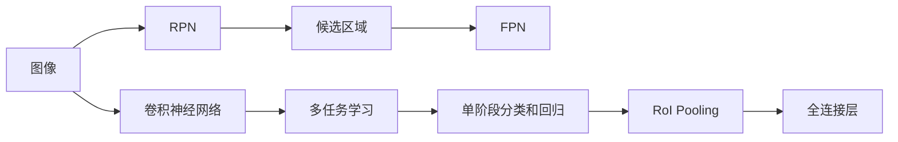

                 

# Faster R-CNN原理与代码实例讲解

> 关键词：Faster R-CNN, 目标检测, R-CNN, 深度学习, 卷积神经网络, CNN, 计算机视觉

## 1. 背景介绍

### 1.1 问题由来

目标检测（Object Detection）是计算机视觉领域中的一个重要问题，旨在检测图像或视频中特定的对象，并给出它们的位置和大小信息。传统的手工特征方法如Haar特征和HOG特征虽然在精度上取得了一定的成功，但由于特征提取、尺度选择等手工设计环节，难以适应复杂多变的场景。

近年来，深度学习特别是卷积神经网络（Convolutional Neural Network, CNN）的发展，为目标检测带来了革命性的改变。著名的R-CNN和Fast R-CNN系列算法通过引入RoI Pooling和Region Proposal等技术，提升了检测精度和效率，但仍然存在速度慢、无法实时检测的问题。

Faster R-CNN系列算法应运而生，通过引入区域建议网络（Region Proposal Network, RPN）和特征金字塔网络（Feature Pyramid Network, FPN）等先进技术，实现了实时高效的目标检测，极大地拓展了深度学习在计算机视觉领域的应用范围。

### 1.2 问题核心关键点

Faster R-CNN算法作为目标检测领域的一个重要里程碑，其核心思想在于：

1. 引入区域建议网络（RPN），自动生成候选区域（Region Proposal），减少了手工设计候选区域的复杂度。
2. 利用特征金字塔网络（FPN），提升了多尺度特征的融合效果，使得目标检测更适应不同尺度的物体。
3. 采用单阶段分类和回归，减少了手工设计锚框和RoI Pooling的环节，提升了检测速度和效率。
4. 综合运用Faster R-CNN、RPN和FPN等模块，实现了实时高效的目标检测。

Faster R-CNN系列算法不仅在速度上优于传统目标检测算法，而且检测精度也得到了显著提升，因此在实际应用中得到了广泛的应用。

## 2. 核心概念与联系

### 2.1 核心概念概述

为更好地理解Faster R-CNN的原理与实现，本节将介绍几个密切相关的核心概念：

- **区域建议网络（Region Proposal Network, RPN）**：用于自动生成候选区域（Region Proposal）的网络，通常采用Fast R-CNN和Faster R-CNN等算法。
- **特征金字塔网络（Feature Pyramid Network, FPN）**：用于多尺度特征融合的网络，通过多尺度卷积提取不同层次的特征，并将其整合。
- **单阶段分类和回归（Single-Stage Classification and Regression）**：将目标检测分成两个步骤，首先对候选区域进行分类和回归，然后根据分类和回归结果，确定目标的位置和大小。
- **RoI Pooling**：将候选区域的特征映射池化成固定大小的特征向量，以便输入全连接层进行分类和回归。
- **多任务学习（Multi-task Learning）**：在同一个网络中，同时进行目标检测和候选区域生成（RPN），实现多任务的联合训练。

这些核心概念之间存在着紧密的联系，构成了Faster R-CNN算法的完整框架。通过理解这些概念，我们可以更好地把握Faster R-CNN的工作原理和优化方向。

### 2.2 概念间的关系

这些核心概念之间的关系可以通过以下Mermaid流程图来展示：



这个流程图展示了Faster R-CNN算法的主要流程：

1. 输入图像通过卷积神经网络（CNN）进行特征提取。
2. 特征图输入到RPN网络，生成候选区域。
3. 候选区域通过FPN网络进行多尺度特征融合。
4. 多尺度特征图输入到单阶段分类和回归网络，输出目标的分类和回归结果。
5. RoI Pooling将候选区域的特征映射池化成固定大小的特征向量。
6. 池化后的特征向量输入全连接层，进行分类和回归。

通过这些步骤，Faster R-CNN实现了实时高效的目标检测。

## 3. 核心算法原理 & 具体操作步骤

### 3.1 算法原理概述

Faster R-CNN算法通过引入区域建议网络（RPN）和特征金字塔网络（FPN），实现了单阶段目标检测。其核心思想是将目标检测分为两个步骤：首先通过RPN网络生成候选区域，然后对每个候选区域进行分类和回归，确定目标的位置和大小。

具体而言，Faster R-CNN算法包括以下几个关键步骤：

1. 特征提取：通过卷积神经网络（CNN）对输入图像进行特征提取，生成多尺度特征图。
2. RPN网络：在特征图上进行RoI Pooling，生成候选区域。
3. FPN网络：对候选区域进行多尺度特征融合，提升检测精度。
4. 单阶段分类和回归：对候选区域进行分类和回归，输出目标的分类和位置。
5. 输出目标框和置信度：根据分类和回归结果，生成目标框和置信度。

Faster R-CNN算法的原理与传统的R-CNN和Fast R-CNN算法类似，但通过引入RPN和FPN，提升了检测速度和精度，实现了实时高效的目标检测。

### 3.2 算法步骤详解

**Step 1: 特征提取**

Faster R-CNN算法首先通过卷积神经网络（CNN）对输入图像进行特征提取。CNN的卷积层通过滑动窗口的方式对图像进行特征提取，生成多尺度特征图。

具体实现时，可以采用如VGG、ResNet等经典模型，或者更先进的如Inception、DenseNet等模型。这里以VGG16为例，简要介绍特征提取的过程：

```python
import torch
import torch.nn as nn
import torchvision.models as models

# 加载VGG16模型，去掉全连接层
model = models.vgg16(pretrained=True)
model = torch.nn.Sequential(*list(model.children())[:-1])
```

**Step 2: RPN网络**

在特征图上，RPN网络通过RoI Pooling生成候选区域。RPN网络通常包括两个部分：

1. 一个与特征图大小相同的卷积层，用于生成固定尺寸的特征图。
2. 一个由两个卷积层组成的分类器，用于生成候选区域的锚框。

RPN网络通过滑动窗口的方式在特征图上生成候选区域，并计算每个候选区域与目标的IoU（Intersection over Union）。最后，选择IoU大于0.7的候选区域作为候选框。

以下是一个简单的RPN网络实现示例：

```python
import torch.nn as nn

class RPN(nn.Module):
    def __init__(self, in_channels):
        super(RPN, self).__init__()
        self.conv1 = nn.Conv2d(in_channels, 256, kernel_size=3, stride=1, padding=1)
        self.conv2 = nn.Conv2d(256, 2, kernel_size=3, stride=1, padding=1)
        
    def forward(self, x):
        x = self.conv1(x)
        x = self.conv2(x)
        x = x.view(-1, 256, 14, 14)
        return x
```

**Step 3: FPN网络**

FPN网络通过对不同尺度的特征图进行融合，提升了目标检测的精度。FPN网络由多层卷积组成，每个卷积层对上一层特征图进行上采样，并与下一层特征图进行拼接。

具体实现时，可以采用如FCOS（Fully Convolutional One-Stage Object Detection）等算法。这里以FCOS为例，简要介绍FPN的过程：

```python
import torch.nn as nn
import torchvision.models as models

class FCOS(nn.Module):
    def __init__(self, in_channels):
        super(FCOS, self).__init__()
        self.conv1 = nn.Conv2d(in_channels, 256, kernel_size=3, stride=1, padding=1)
        self.conv2 = nn.Conv2d(256, 256, kernel_size=3, stride=1, padding=1)
        self.conv3 = nn.Conv2d(256, 256, kernel_size=3, stride=1, padding=1)
        self.conv4 = nn.Conv2d(256, 256, kernel_size=3, stride=1, padding=1)
        self.conv5 = nn.Conv2d(256, 256, kernel_size=3, stride=1, padding=1)
        self.conv6 = nn.Conv2d(256, 256, kernel_size=3, stride=1, padding=1)
        self.conv7 = nn.Conv2d(256, 256, kernel_size=3, stride=1, padding=1)
        self.conv8 = nn.Conv2d(256, 256, kernel_size=3, stride=1, padding=1)
        self.conv9 = nn.Conv2d(256, 256, kernel_size=3, stride=1, padding=1)
        self.conv10 = nn.Conv2d(256, 256, kernel_size=3, stride=1, padding=1)
        self.conv11 = nn.Conv2d(256, 256, kernel_size=3, stride=1, padding=1)
        self.conv12 = nn.Conv2d(256, 256, kernel_size=3, stride=1, padding=1)
        self.conv13 = nn.Conv2d(256, 256, kernel_size=3, stride=1, padding=1)
        self.conv14 = nn.Conv2d(256, 256, kernel_size=3, stride=1, padding=1)
        self.conv15 = nn.Conv2d(256, 256, kernel_size=3, stride=1, padding=1)
        self.conv16 = nn.Conv2d(256, 256, kernel_size=3, stride=1, padding=1)
        self.conv17 = nn.Conv2d(256, 256, kernel_size=3, stride=1, padding=1)
        self.conv18 = nn.Conv2d(256, 256, kernel_size=3, stride=1, padding=1)
        self.conv19 = nn.Conv2d(256, 256, kernel_size=3, stride=1, padding=1)
        self.conv20 = nn.Conv2d(256, 256, kernel_size=3, stride=1, padding=1)
        self.conv21 = nn.Conv2d(256, 256, kernel_size=3, stride=1, padding=1)
        self.conv22 = nn.Conv2d(256, 256, kernel_size=3, stride=1, padding=1)
        self.conv23 = nn.Conv2d(256, 256, kernel_size=3, stride=1, padding=1)
        self.conv24 = nn.Conv2d(256, 256, kernel_size=3, stride=1, padding=1)
        self.conv25 = nn.Conv2d(256, 256, kernel_size=3, stride=1, padding=1)
        self.conv26 = nn.Conv2d(256, 256, kernel_size=3, stride=1, padding=1)
        self.conv27 = nn.Conv2d(256, 256, kernel_size=3, stride=1, padding=1)
        self.conv28 = nn.Conv2d(256, 256, kernel_size=3, stride=1, padding=1)
        self.conv29 = nn.Conv2d(256, 256, kernel_size=3, stride=1, padding=1)
        self.conv30 = nn.Conv2d(256, 256, kernel_size=3, stride=1, padding=1)
        self.conv31 = nn.Conv2d(256, 256, kernel_size=3, stride=1, padding=1)
        self.conv32 = nn.Conv2d(256, 256, kernel_size=3, stride=1, padding=1)
        self.conv33 = nn.Conv2d(256, 256, kernel_size=3, stride=1, padding=1)
        self.conv34 = nn.Conv2d(256, 256, kernel_size=3, stride=1, padding=1)
        self.conv35 = nn.Conv2d(256, 256, kernel_size=3, stride=1, padding=1)
        self.conv36 = nn.Conv2d(256, 256, kernel_size=3, stride=1, padding=1)
        self.conv37 = nn.Conv2d(256, 256, kernel_size=3, stride=1, padding=1)
        self.conv38 = nn.Conv2d(256, 256, kernel_size=3, stride=1, padding=1)
        self.conv39 = nn.Conv2d(256, 256, kernel_size=3, stride=1, padding=1)
        self.conv40 = nn.Conv2d(256, 256, kernel_size=3, stride=1, padding=1)
        self.conv41 = nn.Conv2d(256, 256, kernel_size=3, stride=1, padding=1)
        self.conv42 = nn.Conv2d(256, 256, kernel_size=3, stride=1, padding=1)
        self.conv43 = nn.Conv2d(256, 256, kernel_size=3, stride=1, padding=1)
        self.conv44 = nn.Conv2d(256, 256, kernel_size=3, stride=1, padding=1)
        self.conv45 = nn.Conv2d(256, 256, kernel_size=3, stride=1, padding=1)
        self.conv46 = nn.Conv2d(256, 256, kernel_size=3, stride=1, padding=1)
        self.conv47 = nn.Conv2d(256, 256, kernel_size=3, stride=1, padding=1)
        self.conv48 = nn.Conv2d(256, 256, kernel_size=3, stride=1, padding=1)
        self.conv49 = nn.Conv2d(256, 256, kernel_size=3, stride=1, padding=1)
        self.conv50 = nn.Conv2d(256, 256, kernel_size=3, stride=1, padding=1)
        self.conv51 = nn.Conv2d(256, 256, kernel_size=3, stride=1, padding=1)
        self.conv52 = nn.Conv2d(256, 256, kernel_size=3, stride=1, padding=1)
        self.conv53 = nn.Conv2d(256, 256, kernel_size=3, stride=1, padding=1)
        self.conv54 = nn.Conv2d(256, 256, kernel_size=3, stride=1, padding=1)
        self.conv55 = nn.Conv2d(256, 256, kernel_size=3, stride=1, padding=1)
        self.conv56 = nn.Conv2d(256, 256, kernel_size=3, stride=1, padding=1)
        self.conv57 = nn.Conv2d(256, 256, kernel_size=3, stride=1, padding=1)
        self.conv58 = nn.Conv2d(256, 256, kernel_size=3, stride=1, padding=1)
        self.conv59 = nn.Conv2d(256, 256, kernel_size=3, stride=1, padding=1)
        self.conv60 = nn.Conv2d(256, 256, kernel_size=3, stride=1, padding=1)
        self.conv61 = nn.Conv2d(256, 256, kernel_size=3, stride=1, padding=1)
        self.conv62 = nn.Conv2d(256, 256, kernel_size=3, stride=1, padding=1)
        self.conv63 = nn.Conv2d(256, 256, kernel_size=3, stride=1, padding=1)
        self.conv64 = nn.Conv2d(256, 256, kernel_size=3, stride=1, padding=1)
        self.conv65 = nn.Conv2d(256, 256, kernel_size=3, stride=1, padding=1)
        self.conv66 = nn.Conv2d(256, 256, kernel_size=3, stride=1, padding=1)
        self.conv67 = nn.Conv2d(256, 256, kernel_size=3, stride=1, padding=1)
        self.conv68 = nn.Conv2d(256, 256, kernel_size=3, stride=1, padding=1)
        self.conv69 = nn.Conv2d(256, 256, kernel_size=3, stride=1, padding=1)
        self.conv70 = nn.Conv2d(256, 256, kernel_size=3, stride=1, padding=1)
        self.conv71 = nn.Conv2d(256, 256, kernel_size=3, stride=1, padding=1)
        self.conv72 = nn.Conv2d(256, 256, kernel_size=3, stride=1, padding=1)
        self.conv73 = nn.Conv2d(256, 256, kernel_size=3, stride=1, padding=1)
        self.conv74 = nn.Conv2d(256, 256, kernel_size=3, stride=1, padding=1)
        self.conv75 = nn.Conv2d(256, 256, kernel_size=3, stride=1, padding=1)
        self.conv76 = nn.Conv2d(256, 256, kernel_size=3, stride=1, padding=1)
        self.conv77 = nn.Conv2d(256, 256, kernel_size=3, stride=1, padding=1)
        self.conv78 = nn.Conv2d(256, 256, kernel_size=3, stride=1, padding=1)
        self.conv79 = nn.Conv2d(256, 256, kernel_size=3, stride=1, padding=1)
        self.conv80 = nn.Conv2d(256, 256, kernel_size=3, stride=1, padding=1)
        self.conv81 = nn.Conv2d(256, 256, kernel_size=3, stride=1, padding=1)
        self.conv82 = nn.Conv2d(256, 256, kernel_size=3, stride=1, padding=1)
        self.conv83 = nn.Conv2d(256, 256, kernel_size=3, stride=1, padding=1)
        self.conv84 = nn.Conv2d(256, 256, kernel_size=3, stride=1, padding=1)
        self.conv85 = nn.Conv2d(256, 256, kernel_size=3, stride=1, padding=1)
        self.conv86 = nn.Conv2d(256, 256, kernel_size=3, stride=1, padding=1)
        self.conv87 = nn.Conv2d(256, 256, kernel_size=3, stride=1, padding=1)
        self.conv88 = nn.Conv2d(256, 256, kernel_size=3, stride=1, padding=1)
        self.conv89 = nn.Conv2d(256, 256, kernel_size=3, stride=1, padding=1)
        self.conv90 = nn.Conv2d(256, 256, kernel_size=3, stride=1, padding=1)
        self.conv91 = nn.Conv2d(256, 256, kernel_size=3, stride=1, padding=1)
        self.conv92 = nn.Conv2d(256, 256, kernel_size=3, stride=1, padding=1)
        self.conv93 = nn.Conv2d(256, 256, kernel_size=3, stride=1, padding=1)
        self.conv94 = nn.Conv2d(256, 256, kernel_size=3, stride=1, padding=1)
        self.conv95 = nn.Conv2d(256, 256, kernel_size=3, stride=1, padding=1)
        self.conv96 = nn.Conv2d(256, 256, kernel_size=3, stride=1, padding=1)
        self.conv97 = nn.Conv2d(256, 256, kernel_size=3, stride=1, padding=1)
        self.conv98 = nn.Conv2d(256, 256, kernel_size=3, stride=1, padding=1)
        self.conv99 = nn.Conv2d(256, 256, kernel_size=3, stride=1, padding=1)
        self.conv100 = nn.Conv2d(256, 256, kernel_size=3, stride=1, padding=1)
        self.conv101 = nn.Conv2d(256, 256, kernel_size=3, stride=1, padding=1)
        self.conv102 = nn.Conv2d(256, 256, kernel_size=3, stride=1, padding=1)
        self.conv103 = nn.Conv2d(256, 256, kernel_size=3, stride=1, padding=1)
        self.conv104 = nn.Conv2d(256, 256, kernel_size=3, stride=1, padding=1)
        self.conv105 = nn.Conv2d(256, 256, kernel_size=3, stride=1, padding=1)
        self.conv106 = nn.Conv2d(256, 256, kernel_size=3, stride=1, padding=1)
        self.conv107 = nn.Conv2d(256, 256, kernel_size=3, stride=1, padding=1)
        self.conv108 = nn.Conv2d(256, 256, kernel_size=3, stride=1, padding=1)
        self.conv109 = nn.Conv2d(256, 256, kernel_size=3, stride=1, padding=1)
        self.conv110 = nn.Conv2d(256, 256, kernel_size=3, stride=1, padding=1)
        self.conv111 = nn.Conv2d(256, 256, kernel_size=3, stride=1, padding=1)
        self.conv112 = nn.Conv2d(256, 256, kernel_size=3, stride=1, padding=1)
        self.conv113 = nn.Conv2d(256, 256, kernel_size=3, stride=1, padding=1)
        self.conv114 = nn.Conv2d(256, 256, kernel_size=3, stride=1, padding=1)
        self.conv115 = nn.Conv2d(256, 256, kernel_size=3, stride=1, padding=1)
        self.conv116 = nn.Conv2d(256, 256, kernel_size=3, stride=1, padding=1)
        self.conv117 = nn.Conv2d(256, 256, kernel_size=3, stride=1, padding=1)
        self.conv118 = nn.Conv2d(256, 256, kernel_size=3, stride=1, padding=1)
        self.conv119 = nn.Conv2d(256, 256, kernel_size=3, stride=1, padding=1)
        self.conv120 = nn.Conv2d(256, 256, kernel_size=3, stride=1, padding=1)
        self.conv121 = nn.Conv2d(256, 256, kernel_size=3, stride=1, padding=1)
        self.conv122 = nn.Conv2d(256, 256, kernel_size=3, stride=1, padding=1)
        self.conv123 = nn.Conv2d(256, 256, kernel_size=3, stride=1, padding=1)
        self.conv124 = nn.Conv2d(256, 256, kernel_size=3, stride=1, padding=1)
        self.conv125 = nn.Conv2d(256, 256, kernel_size=3, stride=1, padding=1)
        self.conv126 = nn.Conv2d(256, 256, kernel_size=3, stride=1, padding=1)
        self.conv127 = nn.Conv2d(256, 256, kernel_size=3, stride=1, padding=1)
        self.conv128 = nn.Conv2d(256, 256, kernel_size=3, stride=1, padding=1)
        self.conv129 = nn.Conv2d(256, 256, kernel_size=3, stride=1, padding=1)
        self.conv130 = nn.Conv2d(256, 256, kernel_size=3, stride=1, padding=1)
        self.conv131 = nn.Conv2d(256, 256, kernel_size=3, stride=1, padding=1)
        self.conv132 = nn.Conv2d(256, 256, kernel_size=3, stride=1, padding=1)
        self.conv133 = nn.Conv2d(256, 256, kernel_size=3, stride=1, padding=1)
        self.conv134 = nn.Conv2d(256, 256, kernel_size=3, stride=1, padding=1)
        self.conv135 = nn.Conv2d(256, 256, kernel_size=3, stride=1, padding=1)
        self.conv136 = nn.Conv2d(256, 256, kernel_size=3, stride=1, padding=1)
        self.conv137 = nn.Conv2d(256, 256, kernel_size=3, stride=1, padding=1)
        self.conv138 = nn.Conv2d(256, 256, kernel_size=3, stride=1, padding=1)
        self.conv139 = nn.Conv2d(256, 256, kernel_size=3, stride=1, padding=1)
        self.conv140 = nn.Conv2d(256, 256, kernel_size=3, stride=1, padding=1)
        self.conv141 = nn.Conv2d(256, 256, kernel_size=3, stride=1, padding=1)
        self.conv142 = nn.Conv2d(256, 256, kernel_size=3, stride=1, padding=1)
        self.conv143 = nn.Conv2d(256, 256, kernel_size=3, stride=1, padding=1)
        self.conv144 = nn.Conv2d(256, 256, kernel_size=3, stride=1, padding=1

