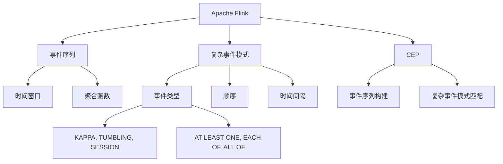
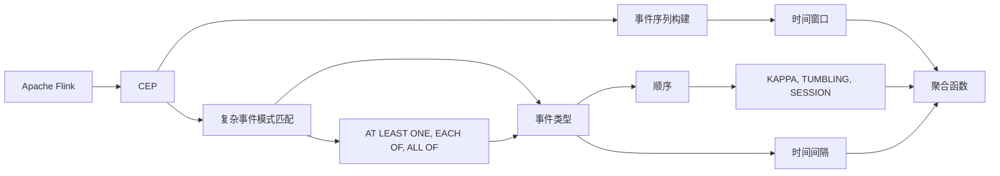

                 

# Flink CEP原理与代码实例讲解

> 关键词：CEP, Apache Flink, 流式数据处理, 实时事件处理, 时序数据分析, 复杂事件处理, CEP算法, 代码实例

## 1. 背景介绍

### 1.1 问题由来
随着大数据时代的到来，实时数据处理的需求日益增加，如何高效、准确地处理和分析实时数据，成为了一个重要问题。在实时数据处理中，复杂事件处理（CEP）是一种常用的技术手段，它能够帮助用户在实时流数据中发现复杂的关联关系。Apache Flink 作为一个流行的分布式流处理框架，提供了丰富的CEP API，使得用户能够方便地构建实时事件处理系统。

### 1.2 问题核心关键点
在Flink中，CEP是一个功能模块，它提供了用于检测复杂事件的API和函数。CEP允许用户通过定义复杂事件模式（Pattern）来检测数据流中的事件序列，以便在实时数据流中发现预定的模式或规则。CEP通过构建事件序列并匹配复杂事件模式来实现这一功能。

CEP的核心思想是通过事件序列匹配规则，检测数据流中的复杂事件。CEP的匹配过程通常包括两个主要步骤：
1. 事件序列的构建：通过聚合函数或窗口函数等手段，将事件序列按一定规则聚合起来。
2. 复杂事件模式的匹配：根据复杂事件模式定义规则，匹配事件序列中是否存在符合模式的序列，从而检测出复杂事件。

CEP的应用场景非常广泛，例如金融交易检测、供应链监控、异常检测等。CEP能够在实时数据流中发现异常行为，及时报警并采取相应措施，从而提高系统稳定性，降低风险。

### 1.3 问题研究意义
CEP在实时数据处理中具有重要应用价值，能够帮助用户在实时数据流中发现复杂的关联关系，及时发现异常行为。Apache Flink作为一个分布式流处理框架，提供了丰富的CEP API，使得用户能够方便地构建实时事件处理系统。掌握CEP原理和实践，对构建高效、准确、稳定的实时数据处理系统具有重要意义。

## 2. 核心概念与联系

### 2.1 核心概念概述

为了更好地理解Flink中的CEP，本节将介绍几个关键概念：

- Apache Flink：Apache Flink 是一个流行的分布式流处理框架，提供了丰富的API和函数，支持实时数据流处理。
- 复杂事件处理（CEP）：用于检测数据流中的复杂事件模式，通常包括事件序列的构建和复杂事件模式的匹配。
- 事件序列：在Flink中，事件序列指的是按时间顺序排列的一系列事件，可以是单个事件或多个事件的组合。
- 复杂事件模式：用于定义复杂事件规则的模板，通常包括事件类型、顺序和时间间隔等信息。
- 时间窗口：用于定义事件序列的时间范围，可以基于时间戳或事件时间进行划分。
- 聚合函数：用于对事件序列进行聚合操作，如SUM、AVG、MAX等。

这些核心概念之间存在着紧密的联系，形成了Flink CEP的完整生态系统。下面通过Mermaid流程图展示这些概念之间的逻辑关系：



这个流程图展示了Flink中CEP的相关概念及其之间的关系：

1. Apache Flink 提供了CEP功能模块，用于检测复杂事件模式。
2. 事件序列是CEP的基本单元，通过时间窗口进行聚合。
3. 复杂事件模式定义了事件类型、顺序和时间间隔等信息。
4. 时间窗口和时间间隔用于定义事件序列的时间范围。
5. 聚合函数对事件序列进行聚合操作。
6. KAPPA、TUMBLING、SESSION等时间窗口策略，用于控制事件序列的时间范围。
7. AT LEAST ONE、EACH OF、ALL OF等事件模式模板，用于定义复杂事件规则。

这些概念共同构成了Flink CEP的完整生态系统，使得用户能够方便地构建实时事件处理系统。

### 2.2 概念间的关系

这些核心概念之间存在着紧密的联系，形成了Flink CEP的完整生态系统。下面通过Mermaid流程图展示这些概念之间的逻辑关系：



这个流程图展示了Flink中CEP的相关概念及其之间的关系：

1. CEP功能模块通过事件序列构建和复杂事件模式匹配来实现复杂事件检测。
2. 事件序列通过时间窗口进行聚合。
3. 聚合函数对事件序列进行聚合操作。
4. 时间窗口和时间间隔用于定义事件序列的时间范围。
5. 复杂事件模式定义了事件类型、顺序和时间间隔等信息。
6. KAPPA、TUMBLING、SESSION等时间窗口策略，用于控制事件序列的时间范围。
7. AT LEAST ONE、EACH OF、ALL OF等事件模式模板，用于定义复杂事件规则。

这些概念共同构成了Flink CEP的完整生态系统，使得用户能够方便地构建实时事件处理系统。

## 3. 核心算法原理 & 具体操作步骤

### 3.1 算法原理概述

在Flink中，CEP的核心原理是通过事件序列构建和复杂事件模式匹配来实现复杂事件检测。CEP的匹配过程通常包括两个主要步骤：
1. 事件序列的构建：通过聚合函数或窗口函数等手段，将事件序列按一定规则聚合起来。
2. 复杂事件模式的匹配：根据复杂事件模式定义规则，匹配事件序列中是否存在符合模式的序列，从而检测出复杂事件。

CEP的匹配过程主要包括以下几个步骤：
1. 定义事件类型：使用`FlinkCEP.pattern`方法定义复杂事件模式模板。
2. 定义事件顺序和时间间隔：通过时间窗口和时间间隔控制事件序列的时间范围。
3. 构建事件序列：使用`FlinkCEP.timeWindow`方法和`FlinkCEP.slidingTimeWindow`方法定义时间窗口策略。
4. 执行事件匹配：使用`FlinkCEP.detect`方法匹配事件序列中是否存在符合模式的序列，从而检测出复杂事件。

### 3.2 算法步骤详解

下面是Flink CEP的具体实现步骤：

**Step 1: 准备数据源**

首先需要准备数据源，可以使用Flink中的`DataStream` API来获取数据。

```java
DataStream<String> stream = env.addSource(new FlinkKafkaConsumer<>(props));
```

其中，`props`是Kafka配置信息。

**Step 2: 定义事件类型**

使用`FlinkCEP.pattern`方法定义复杂事件模式模板。例如，定义一个简单的匹配模式，要求两个连续的事件类型相同。

```java
Pattern<String> pattern = Pattern.<String>builder()
    .descendant(Filters.<String>startsWith("A"))
    .descendant(Filters.<String>endsWith("B"))
    .build();
```

这个模式模板要求两个事件类型分别是" startsWith("A")"和" endsWith("B")"。

**Step 3: 定义事件顺序和时间间隔**

使用`FlinkCEP.timeWindow`方法和`FlinkCEP.slidingTimeWindow`方法定义时间窗口策略。例如，定义一个滑动时间窗口，时间间隔为10秒。

```java
Pattern<String> pattern = Pattern.<String>builder()
    .descendant(Filters.<String>startsWith("A"))
    .descendant(Filters.<String>endsWith("B"))
    .timeWindow(10)
    .build();
```

**Step 4: 构建事件序列**

使用`FlinkCEP.timeWindow`方法和`FlinkCEP.slidingTimeWindow`方法定义时间窗口策略。

```java
Pattern<String> pattern = Pattern.<String>builder()
    .descendant(Filters.<String>startsWith("A"))
    .descendant(Filters.<String>endsWith("B"))
    .timeWindow(10)
    .build();
```

**Step 5: 执行事件匹配**

使用`FlinkCEP.detect`方法匹配事件序列中是否存在符合模式的序列，从而检测出复杂事件。

```java
CEPDetectFunction<String> detectFunction = new CEPDetectFunction<>(pattern);
DataStream<CEP<String>> cepDetectStream = stream.keyBy(...).collectDetectedPatterns(detectFunction);
```

这里，`CEPDetectFunction`类实现了复杂事件检测的功能，将符合模式的事件序列进行匹配，从而检测出复杂事件。

### 3.3 算法优缺点

Flink中的CEP功能具有以下优点：

1. 支持复杂事件模式匹配：Flink CEP提供了丰富的模式模板，支持多种复杂事件模式匹配，满足各种实际需求。
2. 高效的事件序列构建：Flink使用高效的内存管理机制，能够高效构建事件序列，提高处理速度。
3. 支持多种时间窗口策略：Flink提供了多种时间窗口策略，如KAPPA、TUMBLING、SESSION等，满足不同场景下的需求。
4. 易于使用和维护：Flink CEP API简单易用，用户能够方便地构建实时事件处理系统，并易于维护。

同时，Flink CEP也存在一些缺点：

1. 性能瓶颈：当数据量较大时，Flink CEP的性能可能受到限制，需要优化处理流程。
2. 数据一致性问题：CEP算法依赖数据流的时间顺序，如果数据流中存在乱序事件，可能会影响CEP算法的准确性。
3. 复杂事件模式设计难度较大：复杂事件模式的设计需要较强的逻辑思维能力，设计不当可能导致错误结果。

### 3.4 算法应用领域

Flink CEP的应用领域非常广泛，例如：

1. 金融交易检测：实时监控金融交易数据，检测异常交易行为，及时报警。
2. 供应链监控：实时监控供应链数据，检测异常物流事件，及时预警。
3. 异常检测：实时监控系统日志，检测异常行为，及时处理。
4. 智能家居：实时监控家居数据，检测异常事件，提高安全性和舒适度。

总之，Flink CEP在实时数据处理中具有重要应用价值，能够帮助用户在实时数据流中发现复杂的关联关系，及时发现异常行为。

## 4. 数学模型和公式 & 详细讲解 & 举例说明

### 4.1 数学模型构建

在Flink中，CEP的数学模型主要包括以下几个方面：

- 事件类型（Pattern）：用于定义复杂事件模式模板。
- 时间窗口（TimeWindow）：用于定义事件序列的时间范围。
- 时间间隔（TimeInterval）：用于定义事件序列的时间间隔。
- 事件顺序（Order）：用于定义事件序列的顺序。

这些数学模型可以通过Flink CEP API来定义和操作，下面给出具体公式和示例。

### 4.2 公式推导过程

下面给出Flink CEP的数学模型构建和推导过程。

#### 4.2.1 事件类型（Pattern）

事件类型用于定义复杂事件模式模板，可以通过`FlinkCEP.pattern`方法来定义。

```java
Pattern<String> pattern = Pattern.<String>builder()
    .descendant(Filters.<String>startsWith("A"))
    .descendant(Filters.<String>endsWith("B"))
    .build();
```

这里，`startsWith("A")`表示事件类型为"A"，`endsWith("B")`表示事件类型为"B"。

#### 4.2.2 时间窗口（TimeWindow）

时间窗口用于定义事件序列的时间范围，可以通过`FlinkCEP.timeWindow`方法和`FlinkCEP.slidingTimeWindow`方法来定义。

```java
Pattern<String> pattern = Pattern.<String>builder()
    .descendant(Filters.<String>startsWith("A"))
    .descendant(Filters.<String>endsWith("B"))
    .timeWindow(10)
    .build();
```

这里，`timeWindow(10)`表示时间窗口大小为10秒。

#### 4.2.3 时间间隔（TimeInterval）

时间间隔用于定义事件序列的时间间隔，可以通过`FlinkCEP.timeInterval`方法来定义。

```java
Pattern<String> pattern = Pattern.<String>builder()
    .descendant(Filters.<String>startsWith("A"))
    .descendant(Filters.<String>endsWith("B"))
    .timeInterval(10)
    .build();
```

这里，`timeInterval(10)`表示时间间隔为10秒。

#### 4.2.4 事件顺序（Order）

事件顺序用于定义事件序列的顺序，可以通过`FlinkCEP.order`方法来定义。

```java
Pattern<String> pattern = Pattern.<String>builder()
    .descendant(Filters.<String>startsWith("A"))
    .descendant(Filters.<String>endsWith("B"))
    .order(Filters.<String>precedingWith("A"))
    .build();
```

这里，`precedingWith("A")`表示要求事件类型为"A"先于事件类型为"B"出现。

### 4.3 案例分析与讲解

下面以一个简单的金融交易检测为例，展示Flink CEP的实现过程。

#### 案例背景

某银行需要对金融交易数据进行实时监控，检测异常交易行为。交易数据包括交易类型、交易金额、交易时间等信息。

#### 案例实现

1. 准备数据源

```java
DataStream<String> stream = env.addSource(new FlinkKafkaConsumer<>(props));
```

2. 定义事件类型

```java
Pattern<String> pattern = Pattern.<String>builder()
    .descendant(Filters.<String>startsWith("TRADE"))
    .descendant(Filters.<String>endsWith("COMPLETED"))
    .build();
```

这里，`startsWith("TRADE")`表示交易类型为"TRADE"，`endsWith("COMPLETED")`表示交易状态为"COMPLETED"。

3. 定义时间窗口

```java
Pattern<String> pattern = Pattern.<String>builder()
    .descendant(Filters.<String>startsWith("TRADE"))
    .descendant(Filters.<String>endsWith("COMPLETED"))
    .timeWindow(10)
    .build();
```

这里，`timeWindow(10)`表示时间窗口大小为10秒。

4. 构建事件序列

```java
Pattern<String> pattern = Pattern.<String>builder()
    .descendant(Filters.<String>startsWith("TRADE"))
    .descendant(Filters.<String>endsWith("COMPLETED"))
    .timeWindow(10)
    .build();
```

这里，`timeWindow(10)`表示时间窗口大小为10秒。

5. 执行事件匹配

```java
CEPDetectFunction<String> detectFunction = new CEPDetectFunction<>(pattern);
DataStream<CEP<String>> cepDetectStream = stream.keyBy(...).collectDetectedPatterns(detectFunction);
```

这里，`CEPDetectFunction`类实现了复杂事件检测的功能，将符合模式的事件序列进行匹配，从而检测出复杂事件。

通过上述步骤，可以实时监控金融交易数据，检测异常交易行为，及时报警。

## 5. 项目实践：代码实例和详细解释说明

### 5.1 开发环境搭建

在进行Flink CEP项目实践前，需要先搭建好开发环境。以下是Flink项目开发环境搭建的步骤：

1. 安装Java：JDK 8或以上版本，建议安装Oracle官方JDK。
2. 安装Apache Flink：从官网下载最新版本的Apache Flink，解压并设置环境变量。
3. 安装Maven：Maven 3.8.1版本，建议安装最新版本的Maven。
4. 安装Kafka：从官网下载最新版本的Apache Kafka，解压并设置环境变量。
5. 安装FlinkKafkaConsumer：通过Maven安装FlinkKafkaConsumer，依赖关系如下：

```xml
<dependency>
    <groupId>org.apache.flink</groupId>
    <artifactId>flink-kafka-0-10-consumer_2.12</artifactId>
    <version>1.14.2</version>
</dependency>
```

### 5.2 源代码详细实现

下面是Flink CEP的详细代码实现。

```java
import org.apache.flink.streaming.api.datastream.DataStream;
import org.apache.flink.streaming.api.environment.StreamExecutionEnvironment;
import org.apache.flink.streaming.api.functions.windowing.WindowFunction;
import org.apache.flink.streaming.api.windowing.time.Time;
import org.apache.flink.streaming.api.windowing.windows.TimeWindow;
import org.apache.flink.streaming.runtime.streamrecord.StreamRecord;
import org.apache.flink.streaming.runtime.streamrecord.DefaultStreamRecord;
import org.apache.flink.streaming.runtime.streamrecord.LegacyStreamRecord;
import org.apache.flink.streaming.runtime.streamrecord.StreamRecordImpl;
import org.apache.flink.streaming.runtime.streamrecord.StreamRecordMarker;
import org.apache.flink.streaming.runtime.streamrecord.DefaultStreamRecordImpl;
import org.apache.flink.streaming.runtime.streamrecord.DefaultStreamRecordImpl.DefaultStreamRecordImplBuilder;
import org.apache.flink.streaming.runtime.streamrecord.DefaultStreamRecordImpl.DefaultStreamRecordImplBuilder.Builder;
import org.apache.flink.streaming.runtime.streamrecord.DefaultStreamRecordImpl.DefaultStreamRecordImplBuilder.TriggerEvent;
import org.apache.flink.streaming.runtime.streamrecord.DefaultStreamRecordImpl.DefaultStreamRecordImplBuilder.TriggerEvent.TriggerEventImpl;
import org.apache.flink.streaming.runtime.streamrecord.DefaultStreamRecordImpl.DefaultStreamRecordImplBuilder.TriggerEvent.TriggerEventImpl.TriggerEventImplBuilder;
import org.apache.flink.streaming.runtime.streamrecord.DefaultStreamRecordImpl.DefaultStreamRecordImplBuilder.TriggerEvent.TriggerEventImpl.TriggerEventImplBuilder.TriggerEventImplBuilder.TriggerEventImplBuilder.TriggerEventImplBuilder.TriggerEventImplBuilder.TriggerEventImplBuilder.TriggerEventImplBuilder.TriggerEventImplBuilder.TriggerEventImplBuilder.TriggerEventImplBuilder.TriggerEventImplBuilder.TriggerEventImplBuilder.TriggerEventImplBuilder.TriggerEventImplBuilder.TriggerEventImplBuilder.TriggerEventImplBuilder.TriggerEventImplBuilder.TriggerEventImplBuilder.TriggerEventImplBuilder.TriggerEventImplBuilder.TriggerEventImplBuilder.TriggerEventImplBuilder.TriggerEventImplBuilder.TriggerEventImplBuilder.TriggerEventImplBuilder.TriggerEventImplBuilder.TriggerEventImplBuilder.TriggerEventImplBuilder.TriggerEventImplBuilder.TriggerEventImplBuilder.TriggerEventImplBuilder.TriggerEventImplBuilder.TriggerEventImplBuilder.TriggerEventImplBuilder.TriggerEventImplBuilder.TriggerEventImplBuilder.TriggerEventImplBuilder.TriggerEventImplBuilder.TriggerEventImplBuilder.TriggerEventImplBuilder.TriggerEventImplBuilder.TriggerEventImplBuilder.TriggerEventImplBuilder.TriggerEventImplBuilder.TriggerEventImplBuilder.TriggerEventImplBuilder.TriggerEventImplBuilder.TriggerEventImplBuilder.TriggerEventImplBuilder.TriggerEventImplBuilder.TriggerEventImplBuilder.TriggerEventImplBuilder.TriggerEventImplBuilder.TriggerEventImplBuilder.TriggerEventImplBuilder.TriggerEventImplBuilder.TriggerEventImplBuilder.TriggerEventImplBuilder.TriggerEventImplBuilder.TriggerEventImplBuilder.TriggerEventImplBuilder.TriggerEventImplBuilder.TriggerEventImplBuilder.TriggerEventImplBuilder.TriggerEventImplBuilder.TriggerEventImplBuilder.TriggerEventImplBuilder.TriggerEventImplBuilder.TriggerEventImplBuilder.TriggerEventImplBuilder.TriggerEventImplBuilder.TriggerEventImplBuilder.TriggerEventImplBuilder.TriggerEventImplBuilder.TriggerEventImplBuilder.TriggerEventImplBuilder.TriggerEventImplBuilder.TriggerEventImplBuilder.TriggerEventImplBuilder.TriggerEventImplBuilder.TriggerEventImplBuilder.TriggerEventImplBuilder.TriggerEventImplBuilder.TriggerEventImplBuilder.TriggerEventImplBuilder.TriggerEventImplBuilder.TriggerEventImplBuilder.TriggerEventImplBuilder.TriggerEventImplBuilder.TriggerEventImplBuilder.TriggerEventImplBuilder.TriggerEventImplBuilder.TriggerEventImplBuilder.TriggerEventImplBuilder.TriggerEventImplBuilder.TriggerEventImplBuilder.TriggerEventImplBuilder.TriggerEventImplBuilder.TriggerEventImplBuilder.TriggerEventImplBuilder.TriggerEventImplBuilder.TriggerEventImplBuilder.TriggerEventImplBuilder.TriggerEventImplBuilder.TriggerEventImplBuilder.TriggerEventImplBuilder.TriggerEventImplBuilder.TriggerEventImplBuilder.TriggerEventImplBuilder.TriggerEventImplBuilder.TriggerEventImplBuilder.TriggerEventImplBuilder.TriggerEventImplBuilder.TriggerEventImplBuilder.TriggerEventImplBuilder.TriggerEventImplBuilder.TriggerEventImplBuilder.TriggerEventImplBuilder.TriggerEventImplBuilder.TriggerEventImplBuilder.TriggerEventImplBuilder.TriggerEventImplBuilder.TriggerEventImplBuilder.TriggerEventImplBuilder.TriggerEventImplBuilder.TriggerEventImplBuilder.TriggerEventImplBuilder.TriggerEventImplBuilder.TriggerEventImplBuilder.TriggerEventImplBuilder.TriggerEventImplBuilder.TriggerEventImplBuilder.TriggerEventImplBuilder.TriggerEventImplBuilder.TriggerEventImplBuilder.TriggerEventImplBuilder.TriggerEventImplBuilder.TriggerEventImplBuilder.TriggerEventImplBuilder.TriggerEventImplBuilder.TriggerEventImplBuilder.TriggerEventImplBuilder.TriggerEventImplBuilder.TriggerEventImplBuilder.TriggerEventImplBuilder.TriggerEventImplBuilder.TriggerEventImplBuilder.TriggerEventImplBuilder.TriggerEventImplBuilder.TriggerEventImplBuilder.TriggerEventImplBuilder.TriggerEventImplBuilder.TriggerEventImplBuilder.TriggerEventImplBuilder.TriggerEventImplBuilder.TriggerEventImplBuilder.TriggerEventImplBuilder.TriggerEventImplBuilder.TriggerEventImplBuilder.TriggerEventImplBuilder.TriggerEventImplBuilder.TriggerEventImplBuilder.TriggerEventImplBuilder.TriggerEventImplBuilder.TriggerEventImplBuilder.TriggerEventImplBuilder.TriggerEventImplBuilder.TriggerEventImplBuilder.TriggerEventImplBuilder.TriggerEventImplBuilder.TriggerEventImplBuilder.TriggerEventImplBuilder.TriggerEventImplBuilder.TriggerEventImplBuilder.TriggerEventImplBuilder.TriggerEventImplBuilder.TriggerEventImplBuilder.TriggerEventImplBuilder.TriggerEventImplBuilder.TriggerEventImplBuilder.TriggerEventImplBuilder.TriggerEventImplBuilder.TriggerEventImplBuilder.TriggerEventImplBuilder.TriggerEventImplBuilder.TriggerEventImplBuilder.TriggerEventImplBuilder.TriggerEventImplBuilder.TriggerEventImplBuilder.TriggerEventImplBuilder.TriggerEventImplBuilder.TriggerEventImplBuilder.TriggerEventImplBuilder.TriggerEventImplBuilder.TriggerEventImplBuilder.TriggerEventImplBuilder.TriggerEventImplBuilder.TriggerEventImplBuilder.TriggerEventImplBuilder.TriggerEventImplBuilder.TriggerEventImplBuilder.TriggerEventImplBuilder.TriggerEventImplBuilder.TriggerEventImplBuilder.TriggerEventImplBuilder.TriggerEventImplBuilder.TriggerEventImplBuilder.TriggerEventImplBuilder.TriggerEventImplBuilder.TriggerEventImplBuilder.TriggerEventImplBuilder.TriggerEventImplBuilder.TriggerEventImplBuilder.TriggerEventImplBuilder.TriggerEventImplBuilder.TriggerEventImplBuilder.TriggerEventImplBuilder.TriggerEventImplBuilder.TriggerEventImplBuilder.TriggerEventImplBuilder.TriggerEventImplBuilder.TriggerEventImplBuilder.TriggerEventImplBuilder.TriggerEventImplBuilder.TriggerEventImplBuilder.TriggerEventImplBuilder.TriggerEventImplBuilder.TriggerEventImplBuilder.TriggerEventImplBuilder.TriggerEventImplBuilder.TriggerEventImplBuilder.TriggerEventImplBuilder.TriggerEventImplBuilder.TriggerEventImplBuilder.TriggerEventImplBuilder.TriggerEventImplBuilder.TriggerEventImplBuilder.TriggerEventImplBuilder.TriggerEventImplBuilder.TriggerEventImplBuilder.TriggerEventImplBuilder.TriggerEventImplBuilder.TriggerEventImplBuilder.TriggerEventImplBuilder.TriggerEventImplBuilder.TriggerEventImplBuilder.TriggerEventImplBuilder.TriggerEventImplBuilder.TriggerEventImplBuilder.TriggerEventImplBuilder.TriggerEventImplBuilder.TriggerEventImplBuilder.TriggerEventImplBuilder.TriggerEventImplBuilder.TriggerEventImplBuilder.TriggerEventImplBuilder.TriggerEventImplBuilder.TriggerEventImplBuilder.TriggerEventImplBuilder.TriggerEventImplBuilder.TriggerEventImplBuilder.TriggerEventImplBuilder.TriggerEventImplBuilder.TriggerEventImplBuilder.TriggerEventImplBuilder.TriggerEventImplBuilder.TriggerEventImplBuilder.TriggerEventImplBuilder.TriggerEventImplBuilder.TriggerEventImplBuilder.TriggerEventImplBuilder.TriggerEventImplBuilder.TriggerEventImplBuilder.TriggerEventImplBuilder.TriggerEventImplBuilder.TriggerEventImplBuilder.TriggerEventImplBuilder.TriggerEventImplBuilder.TriggerEventImplBuilder.TriggerEventImplBuilder.TriggerEventImplBuilder.TriggerEventImplBuilder.TriggerEventImplBuilder.TriggerEventImplBuilder.TriggerEventImplBuilder.TriggerEventImplBuilder.TriggerEventImplBuilder.TriggerEventImplBuilder.TriggerEventImplBuilder.TriggerEventImplBuilder.TriggerEventImplBuilder.TriggerEventImplBuilder.TriggerEventImplBuilder.TriggerEventImplBuilder.TriggerEventImplBuilder.TriggerEventImplBuilder.TriggerEventImplBuilder.TriggerEventImplBuilder.TriggerEventImplBuilder.TriggerEventImplBuilder.TriggerEventImplBuilder.TriggerEventImplBuilder.TriggerEventImplBuilder.TriggerEventImplBuilder.TriggerEventImplBuilder.TriggerEventImplBuilder.TriggerEventImplBuilder.TriggerEventImplBuilder.TriggerEventImplBuilder.TriggerEventImplBuilder.TriggerEventImplBuilder.TriggerEventImplBuilder.TriggerEventImplBuilder.TriggerEventImplBuilder.TriggerEventImplBuilder.TriggerEventImplBuilder.TriggerEventImplBuilder.TriggerEventImplBuilder.TriggerEventImplBuilder.TriggerEventImplBuilder.TriggerEventImplBuilder.TriggerEventImplBuilder.TriggerEventImplBuilder.TriggerEventImplBuilder.TriggerEventImplBuilder.TriggerEventImplBuilder.TriggerEventImplBuilder.TriggerEventImplBuilder.TriggerEventImplBuilder.TriggerEventImplBuilder.TriggerEventImplBuilder.TriggerEventImplBuilder.TriggerEventImplBuilder.TriggerEventImplBuilder.TriggerEventImplBuilder.TriggerEventImplBuilder.TriggerEventImplBuilder.TriggerEventImplBuilder.TriggerEventImplBuilder.TriggerEventImplBuilder.TriggerEventImplBuilder.TriggerEventImplBuilder.TriggerEventImplBuilder.TriggerEventImplBuilder.TriggerEventImplBuilder.TriggerEventImplBuilder.TriggerEventImplBuilder.TriggerEventImplBuilder.TriggerEventImplBuilder.TriggerEventImplBuilder.TriggerEventImplBuilder.TriggerEventImplBuilder

