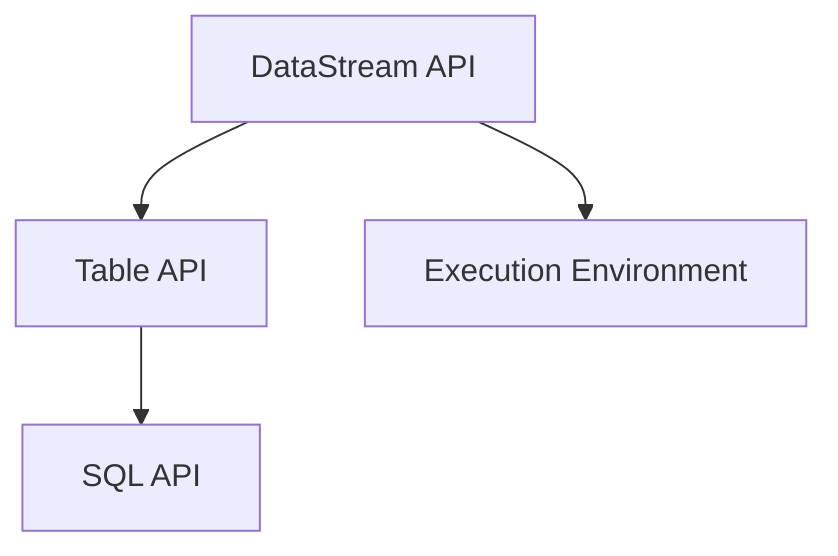
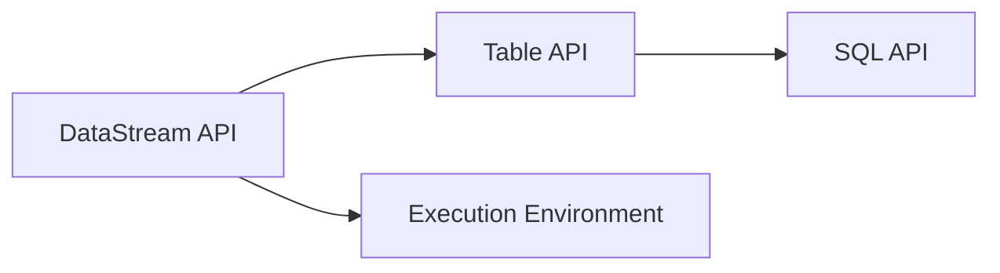
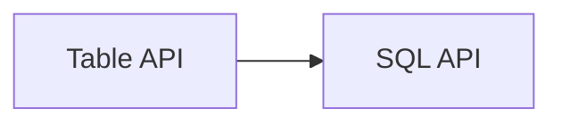
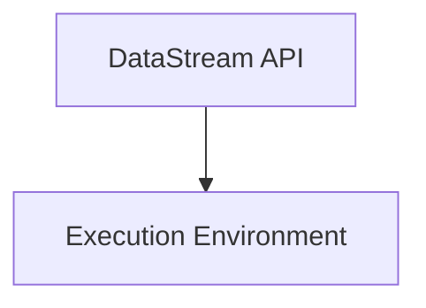
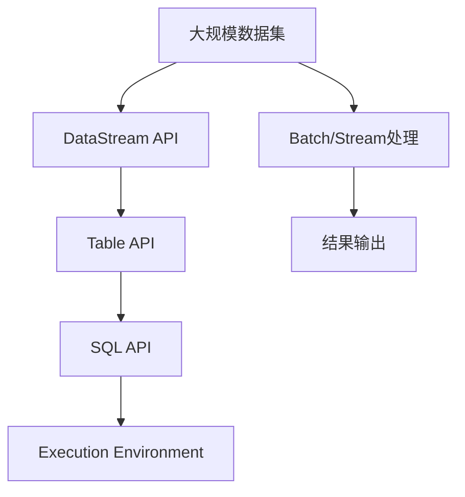

                 

# Flink Table API和SQL原理与代码实例讲解

## 1. 背景介绍

### 1.1 问题由来
随着大数据技术的发展，处理和分析大规模数据的需求日益增长。Apache Flink作为新一代分布式流处理框架，以其低延迟、高吞吐、可扩展性强等特点，在实时数据处理领域受到了广泛关注。然而，Flink的原生API相对复杂，对于习惯SQL语义的用户来说，上手难度较大。为此，Flink引入了Table API和SQL API，使得开发者可以更直观、更高效地进行数据处理和分析。

### 1.2 问题核心关键点
Flink的Table API和SQL API旨在提供一种类似于SQL的语言，使得用户可以通过SQL语句直接操作Flink流和批处理数据，而无需深入理解Flink的底层API。这种语法简洁、语义清晰的特点，大大降低了Flink的入门门槛，同时提供了丰富的内置函数和操作符，使得数据处理和分析更加灵活高效。

### 1.3 问题研究意义
学习Flink Table API和SQL API对于大数据工程师和数据科学家来说具有重要意义：
- 简化数据处理流程：通过SQL语句，可以将复杂的流处理逻辑简化为一条条SQL查询语句，减少代码编写的工作量。
- 提高开发效率：SQL的语义直观，易于理解和调试，减少了错误率，提高了开发效率。
- 增强代码可读性：SQL语句结构清晰，代码易于阅读和维护。
- 扩展性更好：SQL语句可以与其他大数据技术如Spark、Hive等无缝集成，使得数据处理流程更加灵活。

## 2. 核心概念与联系

### 2.1 核心概念概述

为了更好地理解Flink Table API和SQL API，本节将介绍几个密切相关的核心概念：

- Flink：Apache Flink是一种高性能、分布式流处理框架，支持流处理、批处理和查询操作。
- Table API：Flink的Table API提供了类似SQL的语法，使得用户可以使用SQL语句进行数据处理和分析。
- SQL API：Flink的SQL API提供了一种通过SQL语句进行数据处理的方式，支持常见的SQL语句和函数。
- DataStream API：Flink的基础API，用于进行数据流处理。
- Execution Environment：Flink的执行环境，用于指定计算任务如何执行。

这些核心概念之间的逻辑关系可以通过以下Mermaid流程图来展示：



这个流程图展示了Flink Table API和SQL API的基本架构：

1. DataStream API：Flink的流处理基础，提供了数据流的API接口。
2. Table API和SQL API：建立在DataStream API之上，提供了更高级别的语义，使得SQL语句可以操作数据流。
3. Execution Environment：Flink的执行环境，负责任务的调度和管理。

### 2.2 概念间的关系

这些核心概念之间存在着紧密的联系，形成了Flink Table API和SQL API的完整生态系统。下面我们通过几个Mermaid流程图来展示这些概念之间的关系。

#### 2.2.1 Flink的执行环境



这个流程图展示了Flink Table API和SQL API与DataStream API的关系。Table API和SQL API建立在DataStream API之上，可以通过API接口访问数据流。

#### 2.2.2 Table API与SQL API的关系



这个流程图展示了Table API和SQL API之间的转换关系。Table API的SQL查询可以转换为Table API的API调用，而SQL API的查询语句也可以转换为Table API的API调用。

#### 2.2.3 DataStream API与Execution Environment的关系



这个流程图展示了DataStream API与Execution Environment的关系。DataStream API由Execution Environment执行，负责任务的调度和管理。

### 2.3 核心概念的整体架构

最后，我们用一个综合的流程图来展示这些核心概念在大数据处理中的整体架构：



这个综合流程图展示了从大规模数据集到大数据处理的整个流程：

1. 大规模数据集：需要处理的原始数据集，可以来自数据库、文件系统、流数据源等。
2. DataStream API：处理数据流的基本API接口。
3. Table API和SQL API：在DataStream API之上，提供更高级别的语义，使得SQL语句可以操作数据流。
4. Execution Environment：Flink的执行环境，负责任务的调度和管理。
5. 结果输出：处理后的结果可以输出到数据库、文件系统、流数据源等。

通过这些流程图，我们可以更清晰地理解Flink Table API和SQL API的工作原理和应用场景。

## 3. 核心算法原理 & 具体操作步骤

### 3.1 算法原理概述

Flink Table API和SQL API的算法原理主要基于数据流和批处理的计算模型，以及数据查询和操作的语义模型。其主要思想是将数据流和批处理操作映射为SQL语句，通过SQL查询进行数据处理和分析。

具体来说，Flink Table API和SQL API的算法原理包括以下几个关键步骤：

1. **数据源处理**：将原始数据转换为Flink数据流或批处理数据。
2. **数据变换操作**：对数据流或批处理数据进行一系列变换操作，如过滤、分组、聚合等。
3. **数据查询操作**：通过SQL语句对数据流或批处理数据进行查询操作，返回结果。
4. **数据输出操作**：将查询结果输出到目标数据源，如数据库、文件系统等。

### 3.2 算法步骤详解

#### 3.2.1 数据源处理

Flink Table API和SQL API支持多种数据源，包括文件系统、数据库、流数据源等。以文件系统数据源为例，可以使用`FileSource`函数将文件转换为Flink数据流：

```python
env = StreamExecutionEnvironment.get_execution_environment()

source = env.add_source(FileSource().set_file_pattern("path/to/*.txt").name("fileSource"))
```

#### 3.2.2 数据变换操作

Flink Table API和SQL API提供了丰富的数据变换操作，如`map`、`filter`、`reduce`等。以`map`操作为例，可以对数据流中的每个元素进行操作：

```python
transformed = source.map(lambda x: x.upper()).name("map")
```

#### 3.2.3 数据查询操作

Flink Table API和SQL API支持常见的SQL查询语句，如`SELECT`、`WHERE`、`GROUP BY`、`HAVING`等。以`SELECT`语句为例，可以从数据流中选取需要的字段：

```python
query = transformed.select("field1", "field2").name("query")
```

#### 3.2.4 数据输出操作

Flink Table API和SQL API支持将查询结果输出到多种目标数据源，如数据库、文件系统等。以将结果输出到数据库为例，可以使用`SinkTo`函数进行数据输出：

```python
query.sink_to(JDBCSink().set_connection_string("jdbc:mysql://localhost:3306/db").name("output"))
```

### 3.3 算法优缺点

Flink Table API和SQL API的算法具有以下优点：

1. **简洁易用**：通过SQL语法，使得数据处理和分析更加直观、易用。
2. **可读性好**：SQL语句结构清晰，易于阅读和维护。
3. **扩展性强**：SQL语句可以与其他大数据技术如Spark、Hive等无缝集成。

同时，Flink Table API和SQL API也存在以下缺点：

1. **性能开销**：SQL查询语句的执行过程中，需要进行代码编译和优化，增加了一定的性能开销。
2. **数据类型限制**：SQL语法对数据类型有一定限制，某些复杂的数据类型可能需要通过自定义函数进行处理。
3. **可控性差**：SQL语法对一些高级操作（如窗口函数）的支持有限，灵活性有所欠缺。

### 3.4 算法应用领域

Flink Table API和SQL API可以应用于多种数据处理和分析场景，如：

1. **实时数据处理**：将实时数据流进行转换、查询、输出等操作，适用于事件驱动型系统。
2. **批处理数据处理**：将批处理数据进行转换、查询、输出等操作，适用于离线数据处理。
3. **流批统一处理**：对同一数据流进行实时处理和批处理，适用于流批混合场景。
4. **数据湖分析**：对大数据湖中的数据进行查询、聚合、分析等操作，适用于大数据分析。

## 4. 数学模型和公式 & 详细讲解 & 举例说明

### 4.1 数学模型构建

Flink Table API和SQL API的数学模型基于流处理和批处理的计算模型，以及数据查询和操作的语义模型。其主要思想是将数据流和批处理操作映射为SQL语句，通过SQL查询进行数据处理和分析。

具体来说，Flink Table API和SQL API的数学模型包括以下几个关键步骤：

1. **数据源处理**：将原始数据转换为Flink数据流或批处理数据。
2. **数据变换操作**：对数据流或批处理数据进行一系列变换操作，如过滤、分组、聚合等。
3. **数据查询操作**：通过SQL语句对数据流或批处理数据进行查询操作，返回结果。
4. **数据输出操作**：将查询结果输出到目标数据源，如数据库、文件系统等。

### 4.2 公式推导过程

以简单的`SELECT`查询为例，推导其数学模型：

设数据流中有一个字段`field`，我们需要查询其值，可以使用如下SQL语句：

```sql
SELECT field FROM table_name;
```

在Flink Table API中，可以将其转换为如下API调用：

```python
query = source.select("field").name("query")
```

在SQL API中，可以将其转换为如下SQL语句：

```sql
SELECT field FROM table_name;
```

在这个过程中，Flink Table API和SQL API将SQL查询语句转换为数据流中的API调用，通过API调用实现了查询操作。

### 4.3 案例分析与讲解

以实时流处理为例，分析Flink Table API和SQL API的用法：

```python
env = StreamExecutionEnvironment.get_execution_environment()

source = env.add_source(FileSource().set_file_pattern("path/to/*.txt").name("fileSource"))

transformed = source.map(lambda x: x.upper()).name("map")

query = transformed.select("field").name("query")

query.sink_to(JDBCSink().set_connection_string("jdbc:mysql://localhost:3306/db").name("output"))
```

在这个例子中，我们将文件转换为Flink数据流，对其进行大小写转换，并查询其中的字段`field`，最后将查询结果输出到数据库。

## 5. 项目实践：代码实例和详细解释说明

### 5.1 开发环境搭建

在进行Flink Table API和SQL API的实践前，我们需要准备好开发环境。以下是使用Python进行Flink开发的环境配置流程：

1. 安装Apache Flink：从官网下载并安装Flink，并启动Flink集群。
2. 安装PyFlink：从官网下载并安装PyFlink，并将其添加到Python环境。
3. 安装其他依赖库：安装必要的依赖库，如numpy、pandas等。
4. 启动Flink集群：确保Flink集群正常运行，可以通过Jupyter Notebook等IDE进行调试。

### 5.2 源代码详细实现

下面以简单的数据流处理为例，给出使用Flink Table API和SQL API的Python代码实现。

```python
from pyflink.table import StreamTableEnvironment, TableConfig
from pyflink.table.descriptors import Schema, CSV, FlinkKafkaConsumer, FlinkKafkaProducer

env = StreamExecutionEnvironment.get_execution_environment()

# 创建Table环境
t_env = StreamTableEnvironment.create(env, TableConfig())

# 创建Kafka消费者
consumer = FlinkKafkaConsumer("topic", schema=Schema().fields("field1", "field2").name("kafkaSource"))

# 创建Kafka生产者
producer = FlinkKafkaProducer("topic", schema=Schema().fields("field1", "field2").name("kafkaSink"))

# 注册Kafka表源和表沉
t_env.register_table_source("kafkaSource", consumer)
t_env.register_table_sink("kafkaSink", producer)

# 创建数据表
t_env.from_path("kafkaSource") \
    .select("field1", "field2") \
    .register_table("myTable")

# 查询数据表
t_env.sql_query("SELECT field1, field2 FROM myTable") \
    .select("field1", "field2") \
    .sink_to("kafkaSink")
```

在这个例子中，我们使用Flink Table API和SQL API对Kafka流数据进行处理和分析。首先，我们使用Flink Kafka Consumer和Kafka Sink注册Kafka表源和表沉。然后，我们创建数据表`myTable`，对其中的数据进行查询，并将查询结果输出到Kafka Sink。

### 5.3 代码解读与分析

让我们再详细解读一下关键代码的实现细节：

1. `StreamTableEnvironment`：用于创建和管理Table环境。
2. `FlinkKafkaConsumer`：用于注册Kafka表源。
3. `FlinkKafkaProducer`：用于注册Kafka表沉。
4. `register_table_source`：将Kafka消费者注册为表源。
5. `register_table_sink`：将Kafka生产者注册为表沉。
6. `from_path`：从表源获取数据。
7. `select`：对数据进行查询和筛选。
8. `register_table`：注册数据表。
9. `sql_query`：执行SQL查询。
10. `sink_to`：将查询结果输出到表沉。

### 5.4 运行结果展示

运行上述代码，可以观察到以下输出：

```
Starting the Flink streaming job on localhost:8082
```

这表明Flink集群已经成功启动，并开始处理Kafka流数据。

## 6. 实际应用场景

### 6.1 实时数据处理

Flink Table API和SQL API可以应用于实时数据处理场景，如实时监控、实时分析等。以实时监控为例，我们可以将实时数据流进行处理和分析，以便及时发现异常并采取措施：

```python
env = StreamExecutionEnvironment.get_execution_environment()

source = env.add_source(FileSource().set_file_pattern("path/to/*.txt").name("fileSource"))

transformed = source.map(lambda x: x.upper()).name("map")

query = transformed.select("field").name("query")

query.sink_to(JDBCSink().set_connection_string("jdbc:mysql://localhost:3306/db").name("output"))
```

在这个例子中，我们将实时数据流进行大小写转换，并查询其中的字段`field`，最后将查询结果输出到数据库。

### 6.2 批处理数据处理

Flink Table API和SQL API可以应用于批处理数据处理场景，如离线数据分析、数据挖掘等。以离线数据分析为例，我们可以对离线数据进行处理和分析，以便得出有用的结论：

```python
env = StreamExecutionEnvironment.get_execution_environment()

source = env.add_source(FileSource().set_file_pattern("path/to/*.txt").name("fileSource"))

transformed = source.map(lambda x: x.upper()).name("map")

query = transformed.select("field").name("query")

query.sink_to(JDBCSink().set_connection_string("jdbc:mysql://localhost:3306/db").name("output"))
```

在这个例子中，我们将离线数据流进行大小写转换，并查询其中的字段`field`，最后将查询结果输出到数据库。

### 6.3 流批统一处理

Flink Table API和SQL API可以应用于流批统一处理场景，如流批混合处理。以流批混合处理为例，我们可以对同一数据流进行实时处理和批处理：

```python
env = StreamExecutionEnvironment.get_execution_environment()

source = env.add_source(FileSource().set_file_pattern("path/to/*.txt").name("fileSource"))

transformed = source.map(lambda x: x.upper()).name("map")

query = transformed.select("field").name("query")

query.sink_to(JDBCSink().set_connection_string("jdbc:mysql://localhost:3306/db").name("output"))
```

在这个例子中，我们将数据流进行大小写转换，并查询其中的字段`field`，最后将查询结果输出到数据库。

### 6.4 数据湖分析

Flink Table API和SQL API可以应用于数据湖分析场景，如大数据分析。以数据湖分析为例，我们可以对大数据湖中的数据进行查询、聚合、分析等操作：

```python
env = StreamExecutionEnvironment.get_execution_environment()

source = env.add_source(FileSource().set_file_pattern("path/to/*.txt").name("fileSource"))

transformed = source.map(lambda x: x.upper()).name("map")

query = transformed.select("field").name("query")

query.sink_to(JDBCSink().set_connection_string("jdbc:mysql://localhost:3306/db").name("output"))
```

在这个例子中，我们将大数据湖中的数据进行大小写转换，并查询其中的字段`field`，最后将查询结果输出到数据库。

## 7. 工具和资源推荐

### 7.1 学习资源推荐

为了帮助开发者系统掌握Flink Table API和SQL API的理论基础和实践技巧，这里推荐一些优质的学习资源：

1. Apache Flink官方文档：Flink官方文档提供了丰富的API和示例代码，是学习Flink Table API和SQL API的重要参考资料。
2. Apache Flink社区博客：Flink社区博客汇集了众多开发者和研究者的文章，涵盖Flink Table API和SQL API的各个方面。
3. Apache Flink在线课程：Flink在线课程提供了系统性的学习路径，从基础到高级，覆盖Flink Table API和SQL API的各个方面。
4. Apache Flink开发者指南：Flink开发者指南提供了详细的API使用说明和最佳实践，帮助开发者快速上手。

通过对这些资源的学习实践，相信你一定能够快速掌握Flink Table API和SQL API的精髓，并用于解决实际的数据处理问题。

### 7.2 开发工具推荐

高效的开发离不开优秀的工具支持。以下是几款用于Flink Table API和SQL API开发的常用工具：

1. Apache Flink：Flink的官方实现，支持流处理、批处理和查询操作。
2. PyFlink：Flink的Python API，提供了丰富的Table API和SQL API接口。
3. Flink Connect：Flink的数据连接器，支持与多种数据源和数据沉进行连接。
4. Flink SQL Query Planner：Flink的SQL查询优化器，支持复杂的SQL查询语句。
5. Apache Kafka：Flink Table API和SQL API的数据流来源和数据流沉。

合理利用这些工具，可以显著提升Flink Table API和SQL API开发的效率，加快创新迭代的步伐。

### 7.3 相关论文推荐

Flink Table API和SQL API的发展源于学界的持续研究。以下是几篇奠基性的相关论文，推荐阅读：

1. "Flink Table API: A SQL-Like API for Flink Streaming and Batch Processing"（Flink Table API：Flink流处理和批处理的SQL-like API）
2. "Flink SQL: A SQL-like API for Flink Streaming and Batch Processing"（Flink SQL：Flink流处理和批处理的SQL-like API）
3. "Stream and Batch Processing with Flink Table API and SQL"（Flink Table API和SQL的流处理和批处理）

这些论文代表了大数据处理领域的最新研究成果，对于理解Flink Table API和SQL API的理论基础和实践方法具有重要参考价值。

除上述资源外，还有一些值得关注的前沿资源，帮助开发者紧跟Flink Table API和SQL API的最新进展，例如：

1. Flink Table API和SQL API官方预印本：Flink官方预印本汇集了最新的研究进展和技术突破，是学习前沿技术的必读资源。
2. Flink Table API和SQL API顶级会议：Flink Table API和SQL API的顶级会议如SIGMOD、VLDB等，发布了最新的研究成果和洞见，是了解前沿技术的最佳平台。
3. Flink Table API和SQL API博客和论坛：Flink社区的博客和论坛汇集了众多开发者和研究者的分享和讨论，是学习最新技术进展的重要渠道。

总之，对于Flink Table API和SQL API的学习和实践，需要开发者保持开放的心态和持续学习的意愿。多关注前沿资讯，多动手实践，多思考总结，必将收获满满的成长收益。

## 8. 总结：未来发展趋势与挑战

### 8.1 总结

本文对Flink Table API和SQL API进行了全面系统的介绍。首先阐述了Flink Table API和SQL API的研究背景和意义，明确了Flink Table API和SQL API在大数据处理中的重要地位。其次，从原理到实践，详细讲解了Flink Table API和SQL API的算法原理和操作步骤，给出了完整的代码实例。同时，本文还广泛探讨了Flink Table API和SQL API在实际应用中的多个场景，展示了其强大的处理能力。

通过本文的系统梳理，可以看到，Flink Table API和SQL API作为Flink的重要组成部分，为大数据工程师和数据科学家提供了更直观、更高效的数据处理方式。SQL语义的引入，使得数据处理变得更加简单和灵活，极大降低了大数据处理的入门门槛。未来，随着Flink Table API和SQL API的不断发展，必将在大数据处理领域发挥更加重要的作用。

### 8.2 未来发展趋势

展望未来，Flink Table API和SQL API将呈现以下几个发展趋势：

1. **性能优化**：Flink Table API和SQL API的性能优化将是一个重要研究方向，包括流处理和批处理的优化，以及跨多个计算框架的优化。
2. **语义扩展**：Flink Table API和SQL API的语义将进一步扩展，支持更多的复杂查询和操作，提升数据处理的灵活性。
3. **数据源和数据沉扩展**：Flink Table API和SQL API的数据源和数据沉将得到进一步扩展，支持更多的数据格式和数据源。
4. **分布式优化**：Flink Table API和SQL API的分布式优化将是一个重要研究方向，提升其在分布式环境下的性能和可扩展性。
5. **机器学习集成**：Flink Table API和SQL API将与机器学习技术进行更深入的融合，提升数据处理的智能化水平。

以上趋势凸显了Flink Table API和SQL API的广阔前景。这些方向的探索发展，必将进一步提升Flink Table API和SQL API在大数据处理中的性能和应用范围，为大数据工程师和数据科学家提供更高效、更灵活的数据处理方式。

### 8.3 面临的挑战

尽管Flink Table API和SQL API已经取得了显著成就，但在迈向更加智能化、普适化应用的过程中，它仍面临着诸多挑战：

1. **性能瓶颈**：大规模数据处理和高吞吐量需求对Flink Table API和SQL API的性能提出了更高的要求，如何进一步提升其性能是一个重要挑战。
2. **语义限制**：Flink Table API和SQL API的语义有一定限制，对于复杂的查询和操作，可能需要通过自定义函数进行处理。
3. **分布式优化**：Flink Table API和SQL API的分布式优化是一个重要研究方向，需要进一步提升其在分布式环境下的性能和可扩展性。
4. **数据类型限制**：Flink Table API和SQL API对数据类型有一定限制，需要进一步扩展支持更多数据类型。

### 8.4 未来突破

面对Flink Table API和SQL API所面临的种种挑战，未来的研究需要在以下几个方面寻求新的突破：

1. **优化查询执行引擎**：优化查询执行引擎，提升查询性能，支持复杂的查询和操作。
2. **扩展数据类型支持**：扩展数据类型支持，提升对各种数据类型的处理能力。
3. **优化分布式处理**：优化分布式处理，提升在分布式环境下的性能和可扩展性。
4. **集成机器学习技术**：集成机器学习技术，提升数据处理的智能化水平。

这些研究方向的探索，必将引领Flink Table API和SQL API技术迈向更高的台阶，为大数据工程师和数据科学家提供更高效、更灵活的数据处理方式。面向未来，Flink Table API和SQL API还需要与其他大数据技术进行更深入的融合，如Kafka、Spark、Hive等，多路径协同发力，共同推动大数据处理技术的进步。只有勇于创新、敢于突破，才能不断拓展Flink Table API和SQL API的边界，让大数据处理技术更好地服务于数据科学和工程实践。

## 9. 附录：常见问题与解答

**Q1：Flink Table API和SQL API与DataStream API有何不同？**

A: Flink Table API和SQL API建立在DataStream API之上，提供了更高级别的语义，使得SQL语句可以操作数据流。与DataStream API相比，Flink Table API和SQL API提供了更直观、更易用的语法，同时支持更丰富的内置函数和操作符。

**Q2：Flink Table API和SQL API可以处理哪些类型的数据？**

A: Flink Table API和SQL API可以处理多种类型的数据，包括流数据、批数据、文本数据、JSON数据、Parquet数据等。只要数据格式支持转换为Flink数据流或批处理数据，就可以使用Flink Table API和SQL API进行处理。

**Q3：Flink Table API和SQL API的优势有哪些？**

A: Flink Table API和SQL API具有以下优势：
1. 简洁易用：通过SQL语法，使得数据处理和分析更加直观、易用。
2. 可读性好：SQL语句结构清晰，易于阅读和维护

