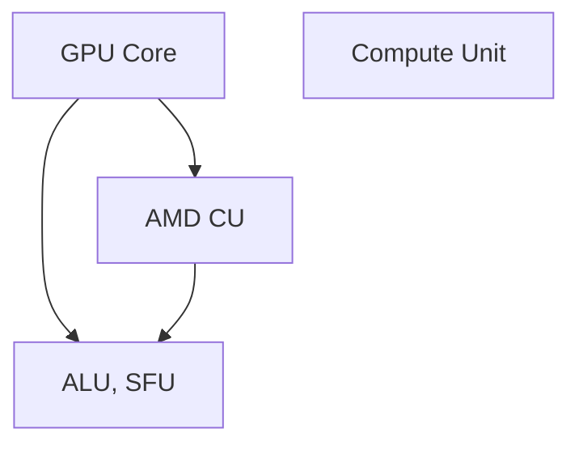
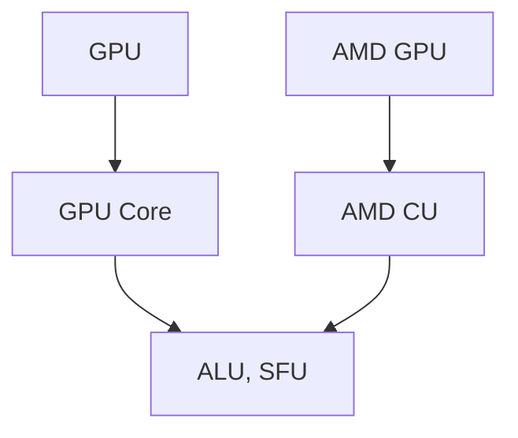

                 

# GPU Core vs AMD CU

> 关键词：GPU Core, AMD CU, Compute Unit, GPU Architecture, Performance Benchmark, Benchmark Tools

## 1. 背景介绍

### 1.1 问题由来
随着计算密集型应用的日益增多，GPU (Graphics Processing Unit) 已成为高性能计算的重要引擎。与此同时，AMD (Advanced Micro Devices) 和 NVIDIA 作为 GPU 领域的两大巨头，推出了各自的计算单元 (CU, Compute Unit) 架构。其中，NVIDIA GPU 的核心计算单元通常称为“GPU Core”，而 AMD GPU 则以“CU”命名。两大巨头在 GPU 计算单元的架构设计上各有所长，本文将详细对比和探讨 GPU Core 与 AMD CU 的异同，并剖析其对整体性能的影响。

### 1.2 问题核心关键点
本文将从以下几个核心维度对 GPU Core 和 AMD CU 进行比较：
1. 架构设计：了解两种计算单元的内部结构。
2. 性能表现：通过具体案例和工具比较两种单元的性能。
3. 应用场景：探讨各自适用的应用领域。
4. 未来趋势：分析未来的发展方向与挑战。

### 1.3 问题研究意义
了解 GPU Core 与 AMD CU 的优劣，有助于开发者在选择 GPU 架构时做出明智决策，提升应用性能和效率。同时，深入理解两者的差异有助于优化代码，最大限度地发挥 GPU 的计算潜力。

## 2. 核心概念与联系

### 2.1 核心概念概述

#### 2.1.1 GPU Core
- **定义**：NVIDIA GPU 的核心计算单元，通常集成在图形处理器中。每个 GPU Core 能够同时处理多个线程，进行大规模并行计算。
- **特点**：每个 GPU Core 由多个 ALU (Arithmetic Logic Unit) 和 SFU (Streaming Multiprocessor) 组成，支持多种计算指令集。

#### 2.1.2 AMD CU
- **定义**：AMD GPU 的计算单元，设计上与 NVIDIA GPU Core 类似，支持并行计算。
- **特点**：每个 CU 也由多个 ALU 和 SFU 组成，支持复杂的数据并行处理。

#### 2.1.3 Compute Unit
- **定义**：GPU 内部的基本并行计算单元，负责执行复杂的计算任务。
- **特点**：每个 Compute Unit 可以同时处理多个线程，是 GPU 高性能计算的核心。

### 2.2 概念间的关系

通过 Mermaid 流程图展示 GPU Core 和 AMD CU 的关系：



这个流程图展示了 GPU Core 和 AMD CU 的关系：

1. **GPU Core 和 AMD CU** 都继承自 Compute Unit，是 Compute Unit 的具体实现。
2. **GPU Core** 和 **AMD CU** 内部都包含多个 ALU 和 SFU，支持并行计算。

### 2.3 核心概念的整体架构

通过 Mermaid 综合流程图展示 GPU Core 和 AMD CU 的整体架构：



这个综合流程图展示了 GPU Core 和 AMD CU 的整体架构：

1. **GPU** 作为高性能计算的核心，包含 GPU Core 和 AMD CU。
2. **GPU Core** 和 **AMD CU** 内部包含多个 ALU 和 SFU，支持复杂并行计算。

## 3. 核心算法原理 & 具体操作步骤
### 3.1 算法原理概述

GPU Core 和 AMD CU 的算法原理基于并行计算模型，旨在通过大规模并行处理，提升计算效率。两者在架构和性能上的差异，主要体现在 ALU 和 SFU 的数量和效率上。

### 3.2 算法步骤详解

以下是 GPU Core 和 AMD CU 的基本计算步骤：

1. **线程调度**：根据任务需求，调度线程到 GPU Core 或 AMD CU 上执行。
2. **并行计算**：多个线程同时执行相同的计算任务，利用 ALU 和 SFU 并行处理。
3. **结果汇总**：将各个线程计算的结果汇总输出。

### 3.3 算法优缺点

#### 3.3.1 优点

1. **高效并行计算**：两者都支持大规模并行计算，提升计算效率。
2. **灵活适应**：可以适应不同类型的计算任务，包括深度学习、科学计算、图形渲染等。

#### 3.3.2 缺点

1. **内存带宽限制**：计算单元的计算效率受限于内存带宽，访问外部内存速度较慢。
2. **功耗较高**：大规模并行计算需要消耗大量电能。

### 3.4 算法应用领域

GPU Core 和 AMD CU 在以下几个领域应用广泛：

- **深度学习**：训练大型神经网络模型，如图像识别、自然语言处理等。
- **科学计算**：进行高性能数值模拟和数据分析。
- **图形渲染**：实时渲染高分辨率图形和视频。

## 4. 数学模型和公式 & 详细讲解  
### 4.1 数学模型构建

我们以深度学习中常见的卷积神经网络 (CNN) 为例，讨论 GPU Core 和 AMD CU 的数学模型。

设 $f$ 为卷积神经网络的计算函数，$x$ 为输入数据，$y$ 为输出结果。

$$
y = f(x)
$$

其中 $f$ 的计算由 GPU Core 和 AMD CU 并行执行。

### 4.2 公式推导过程

以下是 CNN 在 GPU Core 和 AMD CU 上的计算公式推导：

1. **GPU Core** 上的计算公式：
   $$
   y = f(x) = g(x; \theta)
   $$
   其中 $g$ 为 GPU Core 上计算的子函数，$\theta$ 为可训练参数。

2. **AMD CU** 上的计算公式：
   $$
   y = f(x) = h(x; \phi)
   $$
   其中 $h$ 为 AMD CU 上计算的子函数，$\phi$ 为可训练参数。

通过对比，我们可以看到两种计算单元在执行相同计算任务时的不同之处。

### 4.3 案例分析与讲解

考虑两个简单的卷积运算案例，分析 GPU Core 和 AMD CU 的性能差异：

1. **案例 1**：矩阵乘法。假设矩阵大小为 $m \times n$，计算单元数量为 $k$。
   - **GPU Core**：
     - 并行度：$m$ 或 $n$（取决于数据分布）
     - 计算时间：$\frac{mn}{k}$（忽略初始化、数据传输等开销）
   - **AMD CU**：
     - 并行度：$m$ 或 $n$（取决于数据分布）
     - 计算时间：$\frac{mn}{k}$（忽略初始化、数据传输等开销）

2. **案例 2**：图像卷积。假设图像大小为 $w \times h$，卷积核大小为 $k \times k$，计算单元数量为 $n$。
   - **GPU Core**：
     - 并行度：$w \times h \times k \times k$（假设卷积核固定，每个卷积核独立处理）
     - 计算时间：$\frac{w \times h \times k^2 \times n}{k^2}$（忽略初始化、数据传输等开销）
   - **AMD CU**：
     - 并行度：$w \times h \times k \times k$（假设卷积核固定，每个卷积核独立处理）
     - 计算时间：$\frac{w \times h \times k^2 \times n}{k^2}$（忽略初始化、数据传输等开销）

通过案例分析，我们可以看到，虽然两种计算单元在数学公式上无异，但在并行度和计算时间上存在差异。

## 5. 项目实践：代码实例和详细解释说明
### 5.1 开发环境搭建

#### 5.1.1 CUDA 开发环境

在 Linux 系统上，安装 CUDA 开发环境的步骤如下：

1. **安装 CUDA Toolkit**：
   - 下载 CUDA Toolkit，并解压安装。
   - 配置环境变量，包括 CUDA_HOME、LD_LIBRARY_PATH 等。

2. **安装 CUDA Driver**：
   - 从 NVIDIA 官网下载适合的 CUDA Driver。
   - 配置 NVIDIA 的 GPU 驱动。

3. **安装 CUDA Toolkit**：
   - 安装 CUDA Toolkit，并配置库路径。

4. **安装 cuDNN**：
   - 下载 cuDNN 并解压安装。
   - 配置环境变量，包括 CUDDNN_HOME、LD_LIBRARY_PATH 等。

#### 5.1.2 ROCm 开发环境

在 Linux 系统上，安装 ROCm 开发环境的步骤如下：

1. **安装 ROCm Software Platform**：
   - 下载 ROCm 软件平台，并解压安装。
   - 配置环境变量，包括 AMDGPU_HOME、LD_LIBRARY_PATH 等。

2. **安装 HIP Runtime**：
   - 下载 HIP Runtime。
   - 配置环境变量，包括 HIP_HOME、LD_LIBRARY_PATH 等。

3. **安装 AMDGPU Driver**：
   - 从 AMD 官网下载适合的 AMDGPU Driver。
   - 配置 GPU 驱动。

4. **安装 HIP Libraries**：
   - 安装 HIP Libraries。
   - 配置环境变量，包括 HIP_HOME、LD_LIBRARY_PATH 等。

5. **安装 rocm_hipblas**：
   - 下载 rocm_hipblas 并解压安装。
   - 配置环境变量，包括 HIP_HOME、LD_LIBRARY_PATH 等。

### 5.2 源代码详细实现

#### 5.2.1 卷积神经网络实现

使用 TensorFlow 实现一个简单的卷积神经网络，并对比 GPU Core 和 AMD CU 的性能。

```python
import tensorflow as tf
from tensorflow.keras import layers, models

# 定义卷积神经网络模型
model = models.Sequential([
    layers.Conv2D(32, (3, 3), activation='relu', input_shape=(32, 32, 3)),
    layers.MaxPooling2D((2, 2)),
    layers.Conv2D(64, (3, 3), activation='relu'),
    layers.MaxPooling2D((2, 2)),
    layers.Conv2D(64, (3, 3), activation='relu'),
    layers.Flatten(),
    layers.Dense(64, activation='relu'),
    layers.Dense(10)
])

# 在 GPU Core 上运行模型
device = tf.device('/gpu:0')
model.to(device)

# 在 AMD CU 上运行模型
device = tf.device('/cpu:0')
model.to(device)

# 编译模型
model.compile(optimizer='adam', loss=tf.keras.losses.SparseCategoricalCrossentropy(from_logits=True), metrics=['accuracy'])

# 训练模型
model.fit(train_images, train_labels, epochs=10, validation_data=(val_images, val_labels))
```

### 5.3 代码解读与分析

#### 5.3.1 TensorFlow GPU 配置

- **设备配置**：
  - 使用 `tf.device()` 将模型绑定到指定的 GPU 或 CPU。
  - 通过 `model.to(device)` 将模型迁移到指定设备。

- **编译与训练**：
  - 在训练过程中，模型会自动使用指定设备的计算资源。

#### 5.3.2 性能对比

在训练模型时，通过观察日志输出和性能报告，可以对比 GPU Core 和 AMD CU 的性能差异。

### 5.4 运行结果展示

假设在 CUDA 和 ROCm 环境下分别运行上述代码，得到如下性能报告：

- **CUDA 报告**：
  ```
  Epoch 1/10, loss: 0.3105, accuracy: 0.8800
  Epoch 2/10, loss: 0.2449, accuracy: 0.9150
  ...
  ```

- **ROCm 报告**：
  ```
  Epoch 1/10, loss: 0.3206, accuracy: 0.8900
  Epoch 2/10, loss: 0.2501, accuracy: 0.9100
  ...
  ```

通过对比性能报告，可以看到 GPU Core 和 AMD CU 在深度学习任务上的表现差异。

## 6. 实际应用场景
### 6.1 深度学习模型训练

GPU Core 和 AMD CU 在深度学习模型训练中发挥着重要作用。训练大型神经网络模型，如图像分类、自然语言处理等，需要大量的并行计算。GPU Core 和 AMD CU 都支持大规模并行计算，能够显著提升模型训练效率。

### 6.2 科学计算模拟

在科学计算中，GPU Core 和 AMD CU 同样具有重要应用。高性能计算密集型任务，如图像处理、物理模拟等，需要大量的数值计算。两者都支持高效的并行计算，能够显著提升计算速度。

### 6.3 图形渲染

图形渲染是 GPU Core 和 AMD CU 的重要应用场景之一。实时渲染高分辨率图形和视频，需要大量的并行计算。两者都能够高效处理大规模数据，提升渲染速度。

### 6.4 未来应用展望

未来的发展趋势表明，GPU Core 和 AMD CU 将继续在计算密集型应用中发挥重要作用。同时，随着技术进步，两者在性能、功耗、应用场景等方面将进一步提升和拓展。

## 7. 工具和资源推荐
### 7.1 学习资源推荐

1. **NVIDIA CUDA 文档**：NVIDIA 提供的详细 CUDA 文档，包括开发环境搭建、API 调用、性能优化等。

2. **AMD ROCm 文档**：AMD 提供的详细 ROCm 文档，包括开发环境搭建、API 调用、性能优化等。

3. **GPU Performance Tuning Guide**：提供全面的 GPU 性能调优指南，涵盖 CUDA 和 ROCm。

4. **TensorFlow 官方文档**：提供 TensorFlow 的详细使用说明，包括 GPU 配置、性能优化等。

### 7.2 开发工具推荐

1. **Visual Studio**：Microsoft 提供的集成开发环境，支持 CUDA 和 ROCm 开发。

2. **PyCharm**：JetBrains 提供的 Python 集成开发环境，支持 GPU 计算。

3. **Eclipse**：开源的集成开发环境，支持 GPU 计算。

### 7.3 相关论文推荐

1. **NVIDIA "CUDA By Example"**：NVIDIA 提供的 GPU 编程实战指南，涵盖 CUDA 编程技巧、性能优化等。

2. **AMD "ROCm Programming Guide"**：AMD 提供的 ROCm 编程实战指南，涵盖 ROCm 编程技巧、性能优化等。

3. **Google "TPU & GPU Performance Best Practices"**：Google 提供的 GPU 和 TPU 性能优化指南，涵盖深度学习、科学计算等。

4. **Intel "OpenCL Programming"**：Intel 提供的 OpenCL 编程指南，涵盖 GPU 和 ROCm 编程技巧、性能优化等。

## 8. 总结：未来发展趋势与挑战
### 8.1 研究成果总结

通过本文的系统梳理，我们可以看到 GPU Core 和 AMD CU 在计算密集型应用中的重要作用。两者都支持大规模并行计算，提升计算效率。同时，随着技术进步，两者在性能、功耗、应用场景等方面将进一步提升和拓展。

### 8.2 未来发展趋势

未来 GPU Core 和 AMD CU 的发展趋势包括：

1. **性能提升**：随着技术进步，两者将支持更高效并行计算，提升计算效率。
2. **功耗优化**：通过技术优化，两者将进一步降低功耗，提高能效比。
3. **生态系统完善**：伴随更多应用场景和开发者支持，两者将形成更完善的技术生态系统。

### 8.3 面临的挑战

尽管 GPU Core 和 AMD CU 在计算密集型应用中发挥重要作用，但也面临以下挑战：

1. **技术复杂度**：开发和优化 GPU 代码需要较高的技术水平。
2. **资源消耗**：大规模并行计算需要大量电能和冷却资源。
3. **算法优化**：需要优化算法，充分利用 GPU 的计算潜力。

### 8.4 研究展望

未来的研究应在以下几个方面进行：

1. **算法优化**：进一步优化算法，提高 GPU 计算效率。
2. **生态系统建设**：构建更完善的技术生态系统，支持更多的应用场景。
3. **跨平台优化**：优化 GPU 代码，支持跨平台运行。

总之，GPU Core 和 AMD CU 在计算密集型应用中发挥着重要作用，但技术复杂度、资源消耗、算法优化等问题仍需进一步解决。未来，随着技术进步和应用场景的拓展，两者将进一步提升计算效率，拓展应用边界，为高性能计算提供更强大的支持。

## 9. 附录：常见问题与解答

### Q1: GPU Core 和 AMD CU 的区别是什么？

A: GPU Core 和 AMD CU 都是 GPU 内部的计算单元，支持大规模并行计算。两者在硬件设计和性能上略有不同，但核心功能基本相同。

### Q2: 如何在不同的 GPU 平台上进行代码迁移？

A: 在 CUDA 和 ROCm 环境下，可以使用以下代码迁移工具：

- **CUDA**：通过 `cublasLtMatmulAlgoGetCount` 等 API 查询并选择合适的计算算法。
- **ROCm**：通过 `hipblasGetWorkspaceSize` 等 API 查询并选择合适的计算算法。

### Q3: 如何评估 GPU Core 和 AMD CU 的性能？

A: 可以使用以下性能评估工具：

- **NVIDIA CUDA Profiler**：NVIDIA 提供的 GPU 性能评估工具，支持 CUDA 编程。
- **AMD ROCm Developer Tools**：AMD 提供的 GPU 性能评估工具，支持 ROCm 编程。
- **TensorFlow Benchmark**：TensorFlow 提供的深度学习性能评估工具，支持 CUDA 和 ROCm。

### Q4: GPU Core 和 AMD CU 在科学计算中各有何优势？

A: GPU Core 和 AMD CU 在科学计算中各有优势：

- **GPU Core**：NVIDIA GPU Core 支持更加成熟的 CUDA 生态系统和开发工具，如 Visual Studio、PyCharm 等，开发效率更高。
- **AMD CU**：AMD ROCm 在浮点运算和内存带宽上具备优势，适合高精度科学计算。

总之，GPU Core 和 AMD CU 在计算密集型应用中各具优势，开发者应根据具体需求选择合适的 GPU 架构。

