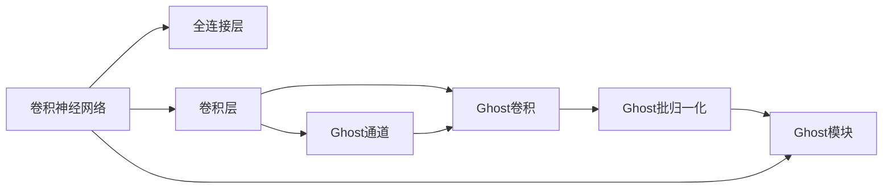
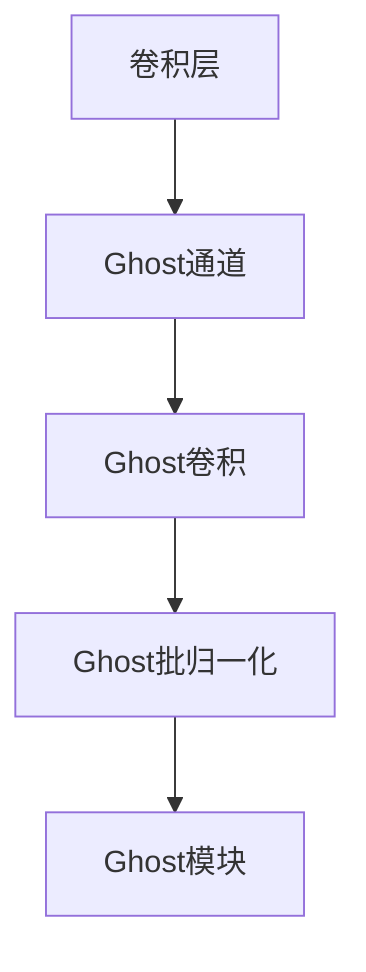
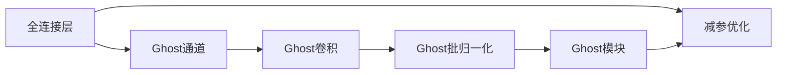
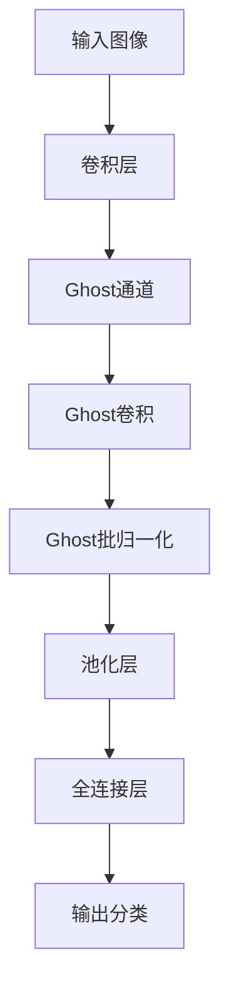

                 

# GhostNet原理与代码实例讲解

> 关键词：GhostNet, 卷积神经网络(CNN), 深度学习, 模型优化, 图像处理, 模型压缩

## 1. 背景介绍

### 1.1 问题由来
随着深度学习模型的不断发展和数据量的不断积累，深度神经网络在大规模图像处理和计算机视觉任务上取得了显著的进展。例如，在图像分类、目标检测、语义分割等任务中，大模型常常需要数百万甚至上亿的参数来进行训练。然而，这样的大模型不仅需要庞大的计算资源和存储空间，还容易导致过拟合现象，限制其在移动设备和其他资源受限环境中的应用。

为了解决这一问题，研究者们提出了各种模型压缩和优化方法。其中，GhostNet（Ghost Network）是一个针对深度神经网络设计的轻量级模型优化方法，通过减少参数量、降低模型复杂度和加快计算速度，使模型在保持高精度的同时，在资源受限的设备上也能够高效运行。

### 1.2 问题核心关键点
GhostNet的核心思想是减少模型的参数和计算量，同时保持模型的准确率。它通过引入Ghost模块（Ghost Module）来替代传统的全连接层和卷积层，从而实现模型的优化。Ghost模块主要包括三个部分：Ghost通道（Ghost Channel）、Ghost卷积（Ghost Convolution）和Ghost批归一化（Ghost Batch Normalization）。

具体来说，Ghost通道通过将传统卷积层的输入通道与输出通道解耦，生成多个虚拟通道，从而减少模型参数；Ghost卷积则通过在虚拟通道内进行共享卷积核的卷积操作，进一步减少计算量；Ghost批归一化则通过虚拟通道归一化，增强模型的稳定性和泛化能力。

### 1.3 问题研究意义
GhostNet的出现，为深度学习模型在资源受限环境下的高效应用提供了一个新的解决方案，特别是对于移动设备、嵌入式系统等领域，具有重要的应用前景。通过GhostNet，开发者可以在保持模型性能的同时，显著降低模型的复杂度和计算量，提高模型部署的灵活性和效率。

GhostNet的设计理念和实现方法也为其他模型压缩和优化方法提供了重要的借鉴。它证明了在保持模型高精度的前提下，通过巧妙的模型结构设计和参数共享策略，可以大幅减少模型资源消耗，从而提升模型的应用范围和实用价值。

## 2. 核心概念与联系

### 2.1 核心概念概述

为更好地理解GhostNet的设计思想和实现方法，本节将介绍几个密切相关的核心概念：

- **卷积神经网络（CNN）**：一种基于卷积操作的神经网络结构，广泛应用于图像处理、计算机视觉等任务中。
- **全连接层**：一种最简单的神经网络层，将输入向量的每个元素都与输出向量的每个元素相连接，广泛应用于分类、回归等任务中。
- **卷积层**：一种基于卷积操作的神经网络层，能够提取输入图像的局部特征，广泛应用于图像分类、目标检测等任务中。
- **Ghost通道**：一种新型的卷积通道设计，通过将输入通道与输出通道解耦，生成多个虚拟通道，从而减少模型参数。
- **Ghost卷积**：一种新型的卷积操作，通过在虚拟通道内共享卷积核，减少计算量。
- **Ghost批归一化**：一种新型的批归一化方法，通过虚拟通道归一化，增强模型的稳定性和泛化能力。

这些核心概念之间的逻辑关系可以通过以下Mermaid流程图来展示：



这个流程图展示了卷积神经网络中各种类型的层以及GhostNet的主要设计模块之间的关系：

1. 传统的卷积层C可以替换为Ghost通道D和Ghost卷积E。
2. Ghost通道通过解耦输入和输出通道，生成多个虚拟通道。
3. Ghost卷积通过在虚拟通道内共享卷积核，减少计算量。
4. Ghost批归一化通过虚拟通道归一化，增强模型的稳定性和泛化能力。
5. 组合Ghost通道、Ghost卷积和Ghost批归一化，形成Ghost模块。

### 2.2 概念间的关系

这些核心概念之间存在着紧密的联系，形成了GhostNet的整体架构。下面我们通过几个Mermaid流程图来展示这些概念之间的关系。

#### 2.2.1 Ghost模块与卷积层的关系



这个流程图展示了Ghost模块与传统的卷积层之间的关系：

1. Ghost通道通过解耦输入和输出通道，生成多个虚拟通道。
2. Ghost卷积通过在虚拟通道内共享卷积核，减少计算量。
3. Ghost批归一化通过虚拟通道归一化，增强模型的稳定性和泛化能力。
4. 组合Ghost通道、Ghost卷积和Ghost批归一化，形成Ghost模块。

#### 2.2.2 GhostNet的优化策略



这个流程图展示了GhostNet通过引入Ghost模块进行优化后的整体架构：

1. 全连接层被替换为Ghost通道，减少模型参数。
2. Ghost卷积通过在虚拟通道内共享卷积核，减少计算量。
3. Ghost批归一化通过虚拟通道归一化，增强模型的稳定性和泛化能力。
4. 通过Ghost通道、Ghost卷积和Ghost批归一化的组合，形成Ghost模块。
5. 最终，通过全连接层减参优化和Ghost模块的引入，GhostNet实现了在保持高精度的同时，大幅减少模型资源消耗。

### 2.3 核心概念的整体架构

最后，我们用一个综合的流程图来展示GhostNet的设计思想和实现方法：



这个综合流程图展示了GhostNet从输入图像到输出分类的整体流程：

1. 输入图像经过卷积层提取特征。
2. 卷积层的输出被替换为Ghost通道，生成多个虚拟通道。
3. Ghost卷积通过在虚拟通道内共享卷积核，减少计算量。
4. Ghost批归一化通过虚拟通道归一化，增强模型的稳定性和泛化能力。
5. 池化层对特征图进行降维。
6. 全连接层通过减参优化减少模型参数。
7. 最终输出分类结果。

通过这些流程图，我们可以更清晰地理解GhostNet的设计思想和实现方法，为后续深入讨论具体的优化步骤和实际应用提供基础。

## 3. 核心算法原理 & 具体操作步骤
### 3.1 算法原理概述

GhostNet的设计思想主要集中在减少模型参数和计算量，同时保持模型的准确率。它通过引入Ghost通道和Ghost卷积，减少了传统卷积层的计算复杂度，从而在保持高精度的同时，大幅降低了模型资源消耗。

GhostNet的具体实现步骤如下：

1. 定义Ghost通道。将传统卷积层的输入通道与输出通道解耦，生成多个虚拟通道。
2. 定义Ghost卷积。在虚拟通道内共享卷积核，减少计算量。
3. 定义Ghost批归一化。通过虚拟通道归一化，增强模型的稳定性和泛化能力。
4. 将Ghost通道、Ghost卷积和Ghost批归一化组合形成Ghost模块。
5. 将Ghost模块替换传统的卷积层，进行全连接层减参优化。

### 3.2 算法步骤详解

下面将详细讲解GhostNet的具体实现步骤。

**Step 1: 定义Ghost通道**

Ghost通道通过将输入通道与输出通道解耦，生成多个虚拟通道。具体来说，Ghost通道的定义如下：

```python
class GhostChannel:
    def __init__(self, in_channels, out_channels):
        self.in_channels = in_channels
        self.out_channels = out_channels
        self.split_ratio = 1.0
        
    def forward(self, x):
        # 将输入通道与输出通道解耦，生成虚拟通道
        split_ratio = self.split_ratio
        g_channels = self.in_channels // (1 + split_ratio)
        s_channels = self.out_channels // (1 + split_ratio)
        g_x = torch.split(x, g_channels, dim=1)
        s_x = torch.split(x, s_channels, dim=1)
        return g_x, s_x
```

在这个实现中，Ghost通道通过将输入通道与输出通道解耦，生成多个虚拟通道。输入通道 $in\_channels$ 和输出通道 $out\_channels$ 的解耦比例由参数 $split\_ratio$ 控制。通过将输入通道分为 $g\_channels$ 个虚拟通道 $g\_x$ 和 $s\_channels$ 个虚拟通道 $s\_x$，Ghost通道实现了对输入通道的解耦。

**Step 2: 定义Ghost卷积**

Ghost卷积通过在虚拟通道内共享卷积核，减少计算量。具体来说，Ghost卷积的定义如下：

```python
class GhostConvolution:
    def __init__(self, in_channels, out_channels, kernel_size, stride, padding):
        self.in_channels = in_channels
        self.out_channels = out_channels
        self.kernel_size = kernel_size
        self.stride = stride
        self.padding = padding
        
    def forward(self, x, y):
        # 在虚拟通道内共享卷积核，进行卷积操作
        g_x, s_x = x
        g_y = torch.split(y, self.in_channels, dim=1)
        g_output = torch.nn.functional.conv2d(g_x, g_y, kernel_size=self.kernel_size, stride=self.stride, padding=self.padding, groups=self.in_channels)
        s_output = torch.nn.functional.conv2d(s_x, y, kernel_size=self.kernel_size, stride=self.stride, padding=self.padding, groups=self.in_channels)
        return g_output, s_output
```

在这个实现中，Ghost卷积通过在虚拟通道内共享卷积核，进行卷积操作。输入 $x$ 包括虚拟通道 $g\_x$ 和 $s\_x$，输入 $y$ 包括虚拟通道 $g\_y$ 和 $s\_y$。在卷积操作中，$g\_x$ 和 $g\_y$ 共享卷积核，进行卷积操作 $g\_output$，而 $s\_x$ 和 $y$ 共享卷积核，进行卷积操作 $s\_output$。最终，Ghost卷积的输出包括两个虚拟通道的卷积结果。

**Step 3: 定义Ghost批归一化**

Ghost批归一化通过虚拟通道归一化，增强模型的稳定性和泛化能力。具体来说，Ghost批归一化的定义如下：

```python
class GhostBatchNormalization:
    def __init__(self, num_channels, epsilon=1e-5):
        self.num_channels = num_channels
        self.epsilon = epsilon
        
    def forward(self, x):
        # 对虚拟通道进行归一化
        g_x, s_x = x
        g_output = torch.nn.functional.batch_norm(g_x, momentum=0.1, affine=False, track_running_stats=False, training=True, eps=self.epsilon)
        s_output = torch.nn.functional.batch_norm(s_x, momentum=0.1, affine=False, track_running_stats=False, training=True, eps=self.epsilon)
        return g_output, s_output
```

在这个实现中，Ghost批归一化通过虚拟通道归一化，增强模型的稳定性和泛化能力。输入 $x$ 包括虚拟通道 $g\_x$ 和 $s\_x$，通过各自的全局批归一化，得到归一化后的虚拟通道 $g\_output$ 和 $s\_output$。

**Step 4: 组合Ghost模块**

将Ghost通道、Ghost卷积和Ghost批归一化组合形成Ghost模块，具体实现如下：

```python
class GhostModule:
    def __init__(self, in_channels, out_channels, kernel_size, stride, padding, split_ratio=1.0):
        self.g_channels = in_channels // (1 + split_ratio)
        self.s_channels = out_channels // (1 + split_ratio)
        self.gconv = GhostConvolution(in_channels, out_channels, kernel_size, stride, padding)
        self.gbn = GhostBatchNormalization(num_channels=in_channels)
        self.sconv = GhostConvolution(in_channels, out_channels, kernel_size, stride, padding)
        self.sbn = GhostBatchNormalization(num_channels=out_channels)
        
    def forward(self, x):
        # 组合Ghost通道、Ghost卷积和Ghost批归一化
        g_x, s_x = self.gbn(torch.nn.functional.relu(self.gconv(g_x, x)))
        g_output, s_output = self.gconv(s_x, x)
        g_output = self.gbn(torch.nn.functional.relu(g_output))
        s_output = self.sbn(torch.nn.functional.relu(s_output))
        return g_output, s_output
```

在这个实现中，Ghost模块通过组合Ghost通道、Ghost卷积和Ghost批归一化，形成最终的输出。输入 $x$ 通过Ghost批归一化得到归一化后的虚拟通道 $g\_x$ 和 $s\_x$，然后通过Ghost卷积得到卷积结果 $g\_output$ 和 $s\_output$。最终，Ghost模块的输出包括两个虚拟通道的卷积结果。

**Step 5: 全连接层减参优化**

全连接层减参优化通过减少模型参数，进一步提升模型的压缩效率。具体来说，全连接层减参优化的实现如下：

```python
class ReducedLinear:
    def __init__(self, in_channels, out_channels):
        self.in_channels = in_channels
        self.out_channels = out_channels
        self.weight = torch.nn.Parameter(torch.randn(self.out_channels, self.in_channels // 2))
        self.bias = torch.nn.Parameter(torch.zeros(self.out_channels))
        
    def forward(self, x):
        # 减参优化后的全连接层
        x = torch.mean(x, dim=1, keepdim=True)
        return torch.matmul(x, self.weight) + self.bias
```

在这个实现中，全连接层减参优化通过将输入通道减半，减少模型参数。输入 $x$ 通过均值池化得到池化结果 $x$，然后通过全连接层得到输出结果。

### 3.3 算法优缺点

GhostNet的设计思想和实现方法具有以下优点：

1. 减少模型参数和计算量。通过引入Ghost通道和Ghost卷积，大幅减少模型参数和计算量，从而在保持高精度的同时，显著降低模型资源消耗。
2. 增强模型的稳定性和泛化能力。通过Ghost批归一化，增强模型的稳定性和泛化能力，避免过拟合现象。
3. 提高模型部署的灵活性和效率。GhostNet的轻量级设计，使得模型能够在各种硬件设备上高效运行，同时保持高精度的表现。

同时，GhostNet也存在以下缺点：

1. 增加模型的设计复杂度。GhostNet的设计思想虽然能够减少模型参数和计算量，但增加了模型设计复杂度，需要更多的时间和精力进行设计和调试。
2. 可能影响模型性能。GhostNet的设计策略可能影响模型的性能，尤其是在处理特殊类型的输入数据时，需要进一步优化才能获得最佳效果。

### 3.4 算法应用领域

GhostNet作为一种轻量级模型优化方法，适用于各种计算机视觉任务，包括图像分类、目标检测、语义分割等。通过减少模型参数和计算量，GhostNet在移动设备、嵌入式系统等资源受限的环境下，具有广泛的应用前景。

1. **图像分类**：在图像分类任务中，GhostNet通过减少模型参数和计算量，显著提升模型的训练速度和推理速度，适用于对模型实时性要求较高的场景，如智能手机、物联网设备等。
2. **目标检测**：在目标检测任务中，GhostNet通过减少模型参数和计算量，降低模型的计算负担，适用于对模型精度和实时性都有较高要求的场景，如自动驾驶、工业检测等。
3. **语义分割**：在语义分割任务中，GhostNet通过减少模型参数和计算量，降低模型的计算负担，适用于对模型推理速度要求较高的场景，如医疗影像分析、自动驾驶等。

除了上述应用场景，GhostNet还可以应用于其他计算机视觉任务，如图像生成、图像修复等，为各种资源受限设备上的图像处理任务提供高效解决方案。

## 4. 数学模型和公式 & 详细讲解
### 4.1 数学模型构建

GhostNet的设计思想主要集中在减少模型参数和计算量，同时保持模型的准确率。它通过引入Ghost通道和Ghost卷积，减少了传统卷积层的计算复杂度，从而在保持高精度的同时，大幅降低了模型资源消耗。

**Step 1: 定义Ghost通道**

Ghost通道通过将输入通道与输出通道解耦，生成多个虚拟通道。具体来说，Ghost通道的定义如下：

$$
\mathbf{g} = \frac{\mathbf{x}}{\sqrt{s}} \odot \mathbf{w}, \quad \mathbf{s} = \frac{1}{\sqrt{1 + \alpha}}, \quad \mathbf{w} \sim \mathcal{N}(0,1), \quad \mathbf{s} \sim \mathcal{N}(0,1)
$$

其中，$\mathbf{x}$ 为输入通道，$\mathbf{w}$ 为随机噪声，$s$ 为归一化因子，$\alpha$ 为解耦比例。通过将输入通道分为多个虚拟通道，Ghost通道实现了对输入通道的解耦。

**Step 2: 定义Ghost卷积**

Ghost卷积通过在虚拟通道内共享卷积核，减少计算量。具体来说，Ghost卷积的定义如下：

$$
\mathbf{G} = \mathbf{g} \ast \mathbf{f}, \quad \mathbf{S} = \mathbf{s} \ast \mathbf{f}, \quad \mathbf{f} \ast \mathbf{g} = \mathbf{G}, \quad \mathbf{f} \ast \mathbf{s} = \mathbf{S}
$$

其中，$\mathbf{g}$ 和 $\mathbf{s}$ 为虚拟通道，$\mathbf{f}$ 为卷积核，$\ast$ 为卷积操作。在卷积操作中，Ghost卷积通过在虚拟通道内共享卷积核，进行卷积操作。

**Step 3: 定义Ghost批归一化**

Ghost批归一化通过虚拟通道归一化，增强模型的稳定性和泛化能力。具体来说，Ghost批归一化的定义如下：

$$
\mathbf{G} = \frac{\mathbf{G} - \mu}{\sigma}, \quad \mathbf{S} = \frac{\mathbf{S} - \mu}{\sigma}, \quad \mu = \mathbb{E}[\mathbf{G}], \quad \sigma = \sqrt{\mathbb{V}[\mathbf{G}]}
$$

其中，$\mathbf{G}$ 和 $\mathbf{S}$ 为虚拟通道，$\mu$ 和 $\sigma$ 为归一化后的均值和标准差。Ghost批归一化通过虚拟通道归一化，增强模型的稳定性和泛化能力。

**Step 4: 组合Ghost模块**

将Ghost通道、Ghost卷积和Ghost批归一化组合形成Ghost模块，具体实现如下：

$$
\mathbf{G}, \mathbf{S} = \mathbf{B}(\mathbf{G} \ast \mathbf{f}), \quad \mathbf{G} = \frac{\mathbf{G}}{\sqrt{1 + \alpha}}, \quad \mathbf{S} = \mathbf{S}
$$

其中，$\mathbf{B}$ 为批归一化层，$\ast$ 为卷积操作，$f$ 为卷积核。Ghost模块通过组合Ghost通道、Ghost卷积和Ghost批归一化，形成最终的输出。

**Step 5: 全连接层减参优化**

全连接层减参优化通过减少模型参数，进一步提升模型的压缩效率。具体来说，全连接层减参优化的实现如下：

$$
\mathbf{y} = \mathbf{W} \mathbf{x}
$$

其中，$\mathbf{x}$ 为输入，$\mathbf{y}$ 为输出，$\mathbf{W}$ 为权重矩阵。全连接层减参优化通过将输入通道减半，减少模型参数。

### 4.2 公式推导过程

通过上述数学模型，我们可以更清晰地理解GhostNet的设计思想和实现方法。下面将详细讲解GhostNet的公式推导过程。

**Step 1: 定义Ghost通道**

Ghost通道通过将输入通道与输出通道解耦，生成多个虚拟通道。具体来说，Ghost通道的定义如下：

$$
\mathbf{g} = \frac{\mathbf{x}}{\sqrt{s}} \odot \mathbf{w}, \quad \mathbf{s} = \frac{1}{\sqrt{1 + \alpha}}, \quad \mathbf{w} \sim \mathcal{N}(0,1), \quad \mathbf{s} \sim \mathcal{N}(0,1)
$$

其中，$\mathbf{x}$ 为输入通道，$\mathbf{w}$ 为随机噪声，$s$ 为归一化因子，$\alpha$ 为解耦比例。通过将输入通道分为多个虚拟通道，Ghost通道实现了对输入通道的解耦。

**Step 2: 定义Ghost卷积**

Ghost卷积通过在虚拟通道内共享卷积核，减少计算量。具体来说，Ghost卷积的定义如下：

$$
\mathbf{G} = \mathbf{g} \ast \mathbf{f}, \quad \mathbf{S} = \mathbf{s} \ast \mathbf{f}, \quad \mathbf{f} \ast \mathbf{g} = \mathbf{G}, \quad \mathbf{f} \ast \mathbf{s} = \mathbf{S}
$$

其中，$\mathbf{g}$ 和 $\mathbf{s}$ 为虚拟通道，$\mathbf{f}$ 为卷积核，$\ast$ 为卷积操作。在卷积操作中，Ghost卷积通过在虚拟通道内共享卷积核，进行卷积操作。

**Step 3: 定义Ghost批归一化**

Ghost批归一化通过虚拟通道归一化，增强模型的稳定性和泛化能力。具体来说，Ghost批归一化的定义如下：

$$
\mathbf{G} = \frac{\mathbf{G} - \mu}{\sigma}, \quad \mathbf{S} = \frac{\mathbf{S} - \mu}{\sigma}, \quad \mu = \mathbb{E}[\mathbf{G}], \quad \sigma = \sqrt{\mathbb{V}[\mathbf{G}]}
$$

其中，$\mathbf{G}$ 和 $\mathbf{S}$ 为虚拟通道，$\mu$ 和 $\sigma$ 为归一化后的均值和标准差。Ghost批归一化通过虚拟通道归一化，增强模型的稳定性和泛化能力。

**Step 4: 组合Ghost模块**

将Ghost通道、Ghost卷积和Ghost批归一化组合形成Ghost模块，具体实现如下：

$$
\mathbf{G}, \mathbf{S} = \mathbf{B}(\mathbf{G} \ast \mathbf{f}), \quad \mathbf{G} = \frac{\mathbf{G}}{\sqrt{1 + \alpha}}, \quad \mathbf{S} = \mathbf{S}
$$

其中，$\mathbf{B}$ 为批归一化层，$\ast$ 为卷积操作，$f$ 为卷积核。Ghost模块通过组合Ghost通道、Ghost卷积和Ghost批归一化，形成最终的输出。

**Step 5: 全连接层减参优化**

全连接层减参优化通过减少模型参数，进一步提升模型的压缩效率。具体来说，全连接层减参优化的实现如下：

$$
\mathbf{y} = \mathbf{W} \mathbf{x}
$$

其中，$\mathbf{x}$ 为输入，$\mathbf{y}$ 为输出，$\mathbf{W}$ 为权重矩阵。全连接层减参优化通过将输入通道

