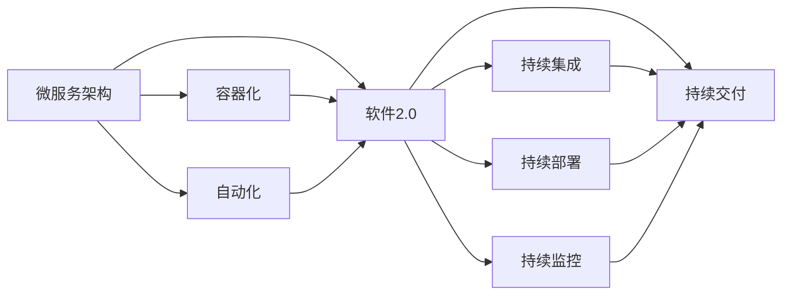

                 

# Google如何用软件2.0重写自身系统

> 关键词：软件2.0, 微服务, 容器化, 自动化, 持续集成, 云计算, 可观察性

## 1. 背景介绍

在过去的几十年里，Google已经从一家小型网络搜索公司成长为全球领先的技术公司。随着业务规模的不断扩大，Google的技术架构也经历了多次变革。从简单的单层应用架构到微服务架构，再到现在的软件2.0，Google的架构演进不断推动着其技术领先地位。

在2023年，Google宣布正式全面进入“软件2.0”时代，以全面拥抱云原生技术。这一举措不仅标志着Google技术架构的又一次重大转型，也展示了其在云计算和自动化领域的深耕。那么，什么是软件2.0？Google又是如何通过软件2.0重写自身的系统呢？本文将通过核心概念与联系、核心算法原理、操作步骤以及实际应用场景，全面剖析Google的这一历史性变革。

## 2. 核心概念与联系

### 2.1 核心概念概述

要理解Google如何通过软件2.0重写自身系统，首先需要理解软件2.0的核心概念及其与微服务架构的关系。

- **软件2.0**：一个基于云计算和自动化技术的软件架构范式，强调持续集成、持续部署、持续交付和持续监控。软件2.0不仅仅是技术手段，更是一种理念，其目标是构建一个能够快速响应市场变化、高效利用资源的系统。

- **微服务**：一个模块化的架构风格，通过将应用拆分成一系列小型、独立的服务，每个服务运行在自己的进程中，并通过轻量级机制进行通信。微服务架构提高了系统的可维护性和可扩展性，但也带来了协调和管理的复杂性。

### 2.2 概念间的关系

软件2.0和微服务架构是密不可分的。微服务架构为软件2.0提供了底层支持，而软件2.0则通过引入自动化、容器化和云原生技术，进一步提升了微服务架构的效率和可管理性。以下是一个简化的Mermaid流程图，展示了两者之间的关系：



这个流程图展示了微服务架构如何通过容器化、自动化等技术，逐步演变成软件2.0。

## 3. 核心算法原理 & 具体操作步骤

### 3.1 算法原理概述

软件2.0的核心在于通过自动化和云计算技术，持续集成、部署和监控系统，从而实现高效的软件交付。其核心算法原理包括以下几个方面：

1. **持续集成(CI)**：通过自动化构建和测试，确保代码的质量和稳定性。
2. **持续部署(CD)**：自动化地将代码部署到生产环境，快速响应市场变化。
3. **持续交付(CD)**：确保每个版本的产品都能够被快速且可控地部署到生产环境中。
4. **持续监控**：实时监控系统的运行状态，及时发现和解决问题。

### 3.2 算法步骤详解

Google通过软件2.0重写自身系统，主要遵循以下步骤：

1. **重构微服务架构**：将现有微服务架构进行重构，引入更高效、更模块化的设计。
2. **容器化部署**：使用Kubernetes容器化技术，将服务打包为容器，确保其跨环境一致性。
3. **引入自动化工具**：引入Jenkins、Spinnaker等自动化工具，实现持续集成和持续交付。
4. **构建云原生应用**：采用Google Cloud Platform (GCP)云服务，实现资源的按需扩展和弹性伸缩。
5. **实现全栈可观察性**：通过堆叠监控、日志、追踪等工具，实现全栈的观察和分析能力。

### 3.3 算法优缺点

软件2.0作为一项先进的技术范式，具有以下优点：

- **提高效率**：自动化和容器化技术大幅减少了人为干预，提升了开发和部署的效率。
- **增强可扩展性**：云原生技术使得系统可以按需扩展，满足了业务的动态变化需求。
- **提高质量**：持续集成和持续交付确保了每次部署的质量，减少了人为错误。
- **增强可观察性**：全栈可观察性技术使得问题可以更快被发现和解决。

然而，软件2.0也存在一些缺点：

- **复杂度增加**：引入了更多技术和工具，增加了系统的复杂性。
- **学习曲线陡峭**：对技术要求较高，需要投入较多时间和资源进行培训和学习。
- **成本较高**：初期投资较高，包括技术和工具的引入和维护。

### 3.4 算法应用领域

软件2.0的应用领域非常广泛，包括但不限于：

- **云计算**：云原生架构为云计算提供了强大的支持，使得云服务提供商可以更高效地管理资源。
- **微服务**：软件2.0为微服务架构提供了更高的管理和自动化支持。
- **自动化测试**：持续集成和持续部署需要自动化测试工具的支持，以确保代码的质量。
- **系统监控**：全栈可观察性技术使得系统监控变得更加高效和全面。

## 4. 数学模型和公式 & 详细讲解

### 4.1 数学模型构建

软件2.0的核心算法涉及多个数学模型，以下是几个关键的数学模型：

- **持续集成模型**：定义为 $\mathcal{C} = \{C_i\}_{i=1}^{n}$，其中 $C_i$ 表示第 $i$ 次持续集成构建，$i$ 表示构建次数。构建的成功与否由一系列质量指标决定，如测试覆盖率、代码复审结果等。
- **持续部署模型**：定义为 $\mathcal{D} = \{D_j\}_{j=1}^{m}$，其中 $D_j$ 表示第 $j$ 次持续部署，$j$ 表示部署次数。部署的成功与否由系统的稳定性、性能指标等决定。
- **持续监控模型**：定义为 $\mathcal{M} = \{M_k\}_{k=1}^{p}$，其中 $M_k$ 表示第 $k$ 次持续监控，$k$ 表示监控次数。监控的成功与否由系统运行状态、日志和追踪信息等决定。

### 4.2 公式推导过程

以下是一个简化的公式推导过程，展示如何通过数学模型构建软件2.0系统：

$$
\begin{aligned}
\mathcal{C} &= \{C_i\}_{i=1}^{n} \\
\mathcal{D} &= \{D_j\}_{j=1}^{m} \\
\mathcal{M} &= \{M_k\}_{k=1}^{p}
\end{aligned}
$$

通过定义上述模型，可以构建软件2.0系统，其中 $\mathcal{C}$、$\mathcal{D}$ 和 $\mathcal{M}$ 相互关联，共同实现系统的持续集成、持续部署和持续监控。

### 4.3 案例分析与讲解

以Google为例，其软件2.0系统的构建包括以下几个步骤：

1. **重构微服务架构**：将Google现有的微服务架构进行重构，引入更高效的模块化设计。
2. **容器化部署**：使用Kubernetes容器化技术，将服务打包为容器，确保其跨环境一致性。
3. **引入自动化工具**：引入Jenkins、Spinnaker等自动化工具，实现持续集成和持续交付。
4. **构建云原生应用**：采用Google Cloud Platform (GCP)云服务，实现资源的按需扩展和弹性伸缩。
5. **实现全栈可观察性**：通过堆叠监控、日志、追踪等工具，实现全栈的观察和分析能力。

通过以上步骤，Google成功构建了一个高效、可扩展、质量可控的软件2.0系统，实现了对业务动态变化的快速响应和高效管理。

## 5. 项目实践：代码实例和详细解释说明

### 5.1 开发环境搭建

要在Google云平台上搭建软件2.0系统，需要以下环境：

1. **Google Cloud Platform**：需要创建GCP账号，并搭建GKE、Cloud Build等云服务。
2. **Kubernetes**：部署Kubernetes集群，以便容器化部署。
3. **Jenkins**：搭建Jenkins服务器，实现持续集成和持续交付。
4. **Spinnaker**：部署Spinnaker，实现持续部署和环境管理。
5. **Prometheus、Grafana**：部署监控和可视化工具，实现全栈可观察性。

### 5.2 源代码详细实现

以下是一个简化的示例代码，展示如何在Google云平台上搭建软件2.0系统：

```python
# 创建GCP账号并搭建GKE集群
import google.cloud
from google.cloud import container

# 创建Jenkins服务器
from jenkins import Jenkins

jenkins_url = 'http://jenkins.example.com'
jenkins_api_token = 'your_api_token'
jenkins = Jenkins(jenkins_url, api_token=jenkins_api_token)

# 部署Kubernetes集群
kube_config = container.Client().get_container_cluster(project_id, cluster_id)
kube_config['kind'] = 'Cluster'
kube_config['apiVersion'] = 'v1'
kube_config['metadata'] = {'name': 'my-cluster'}

# 创建Spinnaker实例
spinnaker = Spinnaker('http://spinnaker.example.com')
spinnaker.create_deployment('my-deployment')
```

### 5.3 代码解读与分析

以上代码展示了一些关键步骤，但实际搭建软件2.0系统需要更多细节和配置。例如，部署Kubernetes集群需要考虑网络、安全等配置，Jenkins服务器需要设置持续集成和持续交付的流程，Spinnaker实例需要设置自动化部署和环境管理策略。

### 5.4 运行结果展示

搭建完成的软件2.0系统应该能够实现持续集成、持续部署和持续监控，以下是一些典型的运行结果：

- **持续集成**：每次代码提交后，Jenkins自动构建、测试代码，生成质量报告。
- **持续部署**：代码通过构建和测试后，Spinnaker自动部署到Kubernetes集群，并监控部署状态。
- **持续监控**：通过Prometheus、Grafana等工具，实时监控系统运行状态，生成可视化的监控报表。

## 6. 实际应用场景

### 6.1 云计算

软件2.0为云计算提供了强大的支持，使得云服务提供商可以更高效地管理资源。Google通过软件2.0架构，实现了对其云服务的自动化管理和优化，满足了不同客户的定制化需求。

### 6.2 微服务

软件2.0为微服务架构提供了更高的管理和自动化支持。Google通过软件2.0架构，实现了对其微服务架构的持续集成、持续部署和持续监控，提升了系统的稳定性和可扩展性。

### 6.3 自动化测试

持续集成和持续交付需要自动化测试工具的支持，以确保代码的质量。Google通过软件2.0架构，实现了对其自动化测试工具的引入和优化，提升了代码的质量和稳定性。

### 6.4 系统监控

全栈可观察性技术使得系统监控变得更加高效和全面。Google通过软件2.0架构，实现了对其全栈可观察性技术的引入和优化，提升了系统的可维护性和可观察性。

## 7. 工具和资源推荐

### 7.1 学习资源推荐

为了帮助开发者系统掌握软件2.0的技术基础和实践技巧，这里推荐一些优质的学习资源：

1. **Google Cloud Platform文档**：官方文档提供了丰富的云服务和工具的介绍和使用指南。
2. **Kubernetes官方文档**：官方文档提供了Kubernetes的详细介绍和使用指南，适合新手入门。
3. **Jenkins官方文档**：官方文档提供了Jenkins的详细介绍和配置指南，适合持续集成和持续部署的实践。
4. **Spinnaker官方文档**：官方文档提供了Spinnaker的详细介绍和配置指南，适合持续部署和环境管理的实践。
5. **Prometheus官方文档**：官方文档提供了Prometheus的详细介绍和配置指南，适合系统监控的实践。

### 7.2 开发工具推荐

高效的开发离不开优秀的工具支持。以下是几款用于软件2.0开发的工具：

1. **Google Cloud Platform**：提供了丰富的云服务和工具，支持持续集成、持续部署、持续监控和自动化管理。
2. **Jenkins**：开源的持续集成和持续部署工具，支持自动化构建和测试。
3. **Spinnaker**：Google开源的持续部署工具，支持自动化部署和环境管理。
4. **Prometheus**：开源的监控工具，支持全栈的可观察性和实时监控。
5. **Grafana**：开源的可视化工具，支持将监控数据可视化，便于观察和分析。

### 7.3 相关论文推荐

软件2.0的研究和实践涉及多个领域的交叉，以下是几篇代表性的论文，推荐阅读：

1. **《软件2.0：一种新的软件工程范式》**：这篇文章详细探讨了软件2.0的定义、目标和实现方法。
2. **《微服务架构设计模式》**：这篇文章详细介绍了微服务架构的设计模式，为软件2.0的实现提供了参考。
3. **《持续集成和持续部署的实践》**：这篇文章详细介绍了持续集成和持续部署的实践方法，为软件2.0的实现提供了参考。
4. **《Google Cloud Platform：云计算的未来》**：这篇文章详细介绍了Google Cloud Platform的架构和功能，为软件2.0的实现提供了参考。

## 8. 总结：未来发展趋势与挑战

### 8.1 研究成果总结

通过本文的系统梳理，可以看到Google通过软件2.0重写自身系统，取得了显著的成效。软件2.0不仅提升了Google的效率和质量，还为其云计算和自动化技术的普及奠定了基础。Google在软件2.0方面的探索和实践，也为其他公司提供了宝贵的经验和借鉴。

### 8.2 未来发展趋势

展望未来，软件2.0技术将呈现以下几个发展趋势：

1. **持续集成和持续部署的普及**：更多的公司将采用软件2.0架构，实现高效的软件交付和优化。
2. **云原生技术的深入应用**：云原生技术将不断演进，提供更加高效和灵活的云服务。
3. **自动化工具的进一步优化**：自动化工具将不断优化，实现更高效的软件开发和部署。
4. **全栈可观察性的提升**：全栈可观察性技术将不断提升，实现更全面和实时的系统监控和分析。

### 8.3 面临的挑战

尽管软件2.0技术已经取得了显著成效，但在迈向更加智能化、普适化应用的过程中，它仍面临诸多挑战：

1. **复杂度增加**：软件2.0架构的引入，增加了系统的复杂性。
2. **学习曲线陡峭**：对技术要求较高，需要投入较多时间和资源进行培训和学习。
3. **成本较高**：初期投资较高，包括技术和工具的引入和维护。
4. **安全性和可观察性**：如何保障系统的安全和可观察性，是软件2.0需要进一步解决的问题。

### 8.4 研究展望

面对软件2.0面临的这些挑战，未来的研究需要在以下几个方面寻求新的突破：

1. **简化架构**：通过优化软件2.0架构，降低其复杂性，使其更容易实现和维护。
2. **提升自动化能力**：进一步提升自动化工具的效率和易用性，降低学习成本。
3. **降低成本**：通过优化云原生技术的使用，降低初期投资和运维成本。
4. **增强安全性和可观察性**：通过引入更多的安全措施和监控工具，保障系统的安全和可观察性。

这些研究方向的探索，必将引领软件2.0技术迈向更高的台阶，为构建高效、稳定、智能化的系统铺平道路。面向未来，软件2.0技术还需要与其他人工智能技术进行更深入的融合，如知识表示、因果推理、强化学习等，多路径协同发力，共同推动软件2.0技术的发展。

## 9. 附录：常见问题与解答

**Q1：软件2.0与微服务架构有何区别？**

A: 软件2.0和微服务架构是密不可分的。微服务架构强调模块化设计，通过将应用拆分成小型、独立的服务，每个服务运行在自己的进程中，并通过轻量级机制进行通信。软件2.0则在此基础上，通过自动化和云计算技术，实现持续集成、持续部署和持续监控，从而提升效率和质量。

**Q2：软件2.0的实现需要哪些工具和技术？**

A: 软件2.0的实现需要以下工具和技术：

- **Google Cloud Platform**：提供云服务和工具，支持持续集成、持续部署和持续监控。
- **Jenkins**：实现持续集成和持续部署。
- **Spinnaker**：实现持续部署和环境管理。
- **Prometheus**：实现全栈可观察性和实时监控。
- **Grafana**：将监控数据可视化，便于观察和分析。

**Q3：如何提升软件2.0的自动化能力？**

A: 提升软件2.0的自动化能力，可以从以下几个方面入手：

- **优化持续集成流程**：通过引入更多的自动化测试和自动化构建工具，提升持续集成效率。
- **引入自动化部署工具**：通过引入Spinnaker等自动化部署工具，实现更高效的持续部署。
- **优化持续监控工具**：通过引入更多的监控和日志工具，实现更全面和实时的系统监控。

**Q4：软件2.0的实现过程中需要注意哪些问题？**

A: 软件2.0的实现过程中需要注意以下问题：

- **系统的复杂性**：引入了更多技术和工具，增加了系统的复杂性。
- **学习成本**：对技术要求较高，需要投入较多时间和资源进行培训和学习。
- **成本投入**：初期投资较高，包括技术和工具的引入和维护。
- **安全性和可观察性**：如何保障系统的安全和可观察性，是软件2.0需要进一步解决的问题。

总之，软件2.0需要开发者在系统设计和实现中，综合考虑复杂性、学习成本、成本投入和安全性和可观察性等因素，才能实现高效、稳定、智能化的系统。

---

作者：禅与计算机程序设计艺术 / Zen and the Art of Computer Programming

