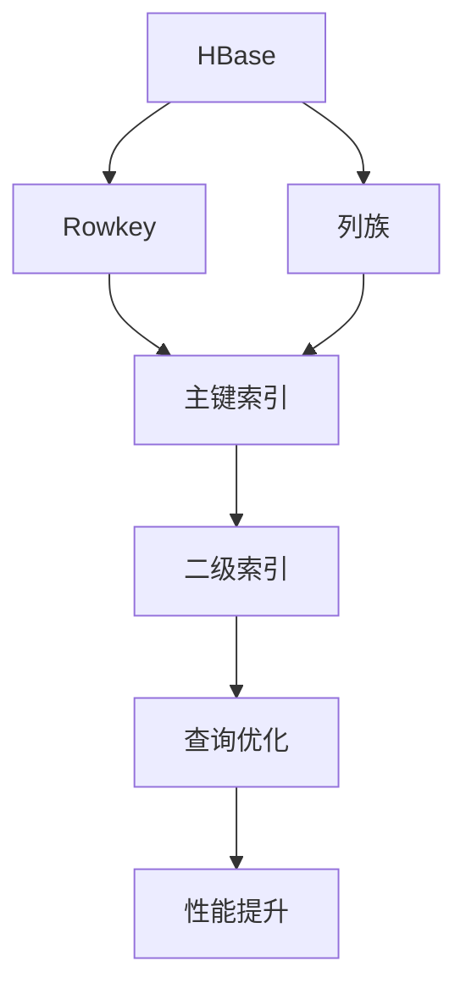
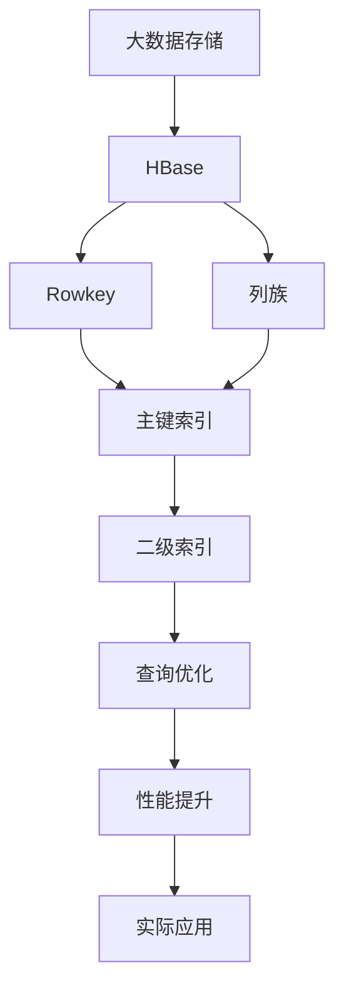

                 

# HBase二级索引原理与代码实例讲解

> 关键词：HBase, 二级索引, 主键, 内存缓存, 性能优化

## 1. 背景介绍

### 1.1 问题由来
HBase作为Apache Hadoop生态系统中的一员，是一种分布式、面向列的NoSQL数据库。它提供高可扩展性、高可用性和高性能的特点，特别适用于大数据的存储和处理。然而，HBase的读写操作主要依赖于Rowkey和列族（Column Family）的设计，对于频繁的查询操作，尤其是涉及多行的复杂查询，性能表现可能并不理想。为了提升HBase的查询性能，二级索引技术应运而生。

### 1.2 问题核心关键点
HBase的二级索引是在主键索引（Rowkey）的基础上，为特定查询场景设计的一种辅助索引。通过在主键索引之外增加辅助索引，可以极大地提升复杂查询的性能。常见的二级索引类型包括：

- Bloom Filter索引：用于快速判断某行是否存在，适用于读密集型场景。
- 行号索引：基于行的顺序进行索引，适用于顺序扫描。
- 基于Rowkey的前缀索引：将Rowkey进行前缀划分，适用于范围查询。
- 缓存索引：利用L1/L2缓存提升查询性能。

### 1.3 问题研究意义
HBase二级索引技术对于提升HBase的查询性能具有重要意义：

1. 提高查询效率：对于需要频繁查询的场景，通过二级索引可以快速定位数据，提升查询速度。
2. 优化资源利用：二级索引可以减轻主键索引的压力，避免热点数据造成的性能瓶颈。
3. 降低存储成本：二级索引可以根据实际查询需求设计，优化存储空间，降低数据冗余。
4. 增强数据一致性：通过合理设计二级索引，可以更好地控制数据的一致性和分布式存储的性能。

本文将详细介绍HBase二级索引的基本原理、核心算法及具体操作步骤，并结合实际案例进行讲解。

## 2. 核心概念与联系

### 2.1 核心概念概述

为更好地理解HBase二级索引技术，我们首先介绍几个密切相关的核心概念：

- HBase：一种基于列族的分布式数据库，支持大规模数据的存储和查询。
- Rowkey：HBase中的主键，用于唯一标识一行数据。
- 列族（Column Family）：用于组织和管理数据的列族，每个列族下可以包含多个列。
- 二级索引：在主键索引的基础上，为特定查询场景设计的辅助索引。

### 2.2 概念间的关系

这些核心概念之间存在紧密的联系，共同构成了HBase的数据模型和查询机制。下面通过一个Mermaid流程图来展示这些概念之间的关系：



这个流程图展示了HBase的数据模型和查询优化过程：

1. HBase中的数据由Rowkey和列族组成。
2. 主键索引通过Rowkey快速定位数据。
3. 根据查询需求，可以设计不同的二级索引。
4. 二级索引优化查询过程，提升性能。

### 2.3 核心概念的整体架构

最后，我们用一个综合的流程图来展示这些核心概念在大数据环境下的整体架构：



这个综合流程图展示了HBase在大数据环境下的整体架构，从数据存储到查询优化的全过程。

## 3. 核心算法原理 & 具体操作步骤

### 3.1 算法原理概述

HBase二级索引的原理是在主键索引的基础上，为特定查询场景设计辅助索引，以提升查询效率。其核心思想是通过将数据进行分片、划分和缓存，减少数据访问次数，从而降低查询延迟，提升性能。

形式化地，假设HBase表为$T=\{(r, c, v)|r \in R, c \in C, v \in V\}$，其中$r$为主键（Rowkey），$c$为列（Column），$v$为值（Value）。假设查询需求为$Q(r, c)$，即查询主键$r$和列$c$对应的值。

二级索引通过在主键索引之外，设计一个辅助索引$I=(k, r')$，其中$k$为索引键，$r'$为辅助索引指向的Rowkey。查询时，首先通过主键索引找到$r$对应的$r'$，然后通过辅助索引$I$查找$c$对应的值。

### 3.2 算法步骤详解

HBase二级索引的实现步骤如下：

1. **索引设计**：根据实际查询需求，设计合适的二级索引。常见的索引类型包括Bloom Filter、行号索引、前缀索引等。
2. **索引创建**：在HBase表中创建二级索引。
3. **索引更新**：在数据插入、更新时，更新二级索引。
4. **查询优化**：查询时，通过二级索引快速定位数据，提升查询效率。

### 3.3 算法优缺点

HBase二级索引的优势在于：

- 提升查询效率：通过辅助索引快速定位数据，减少查询延迟。
- 优化资源利用：减轻主键索引的压力，避免热点数据造成的性能瓶颈。
- 降低存储成本：可以根据查询需求设计索引，优化存储空间。

但其缺点也不容忽视：

- 索引设计复杂：需要根据实际查询场景设计合适的索引类型。
- 索引管理困难：索引需要定期维护，否则可能会影响查询性能。
- 存储空间占用：二级索引需要占用额外的存储空间，可能会增加存储成本。

### 3.4 算法应用领域

HBase二级索引技术适用于各种复杂查询场景，包括但不限于：

- 范围查询：利用前缀索引快速定位数据。
- 多行查询：利用缓存索引提升查询效率。
- 频繁查询：利用Bloom Filter索引快速判断某行是否存在。

## 4. 数学模型和公式 & 详细讲解 & 举例说明（备注：数学公式请使用latex格式，latex嵌入文中独立段落使用 $$，段落内使用 $)
### 4.1 数学模型构建

为了更精确地描述HBase二级索引的原理，我们引入数学模型进行建模。假设HBase表$T$的行数和列数分别为$n$和$m$，主键索引的查询时间为$t_1$，二级索引的查询时间为$t_2$。假设主键索引的负载为$L_1$，二级索引的负载为$L_2$。

### 4.2 公式推导过程

首先，我们定义查询时间为：

$$
t = t_1 + t_2
$$

主键索引的负载为：

$$
L = \frac{n}{L_1}
$$

二级索引的负载为：

$$
L' = \frac{n}{L_2}
$$

为了简化分析，我们假设查询操作均匀分布在所有数据行上，即每行被查询的概率为$\frac{1}{n}$。因此，查询的期望时间为：

$$
E(t) = \frac{n}{L} + \frac{n}{L'}
$$

根据二级索引的定义，我们有：

$$
L' = \frac{L_1 \cdot t_2}{t_1}
$$

将$L'$代入$E(t)$的公式中，得到：

$$
E(t) = \frac{n}{L} + \frac{n}{\frac{L_1 \cdot t_2}{t_1}}
$$

化简得：

$$
E(t) = \frac{n}{L} + \frac{n \cdot t_1}{L_1 \cdot t_2}
$$

这个公式展示了二级索引如何通过减少查询延迟和提升查询效率，从而优化整体查询时间。

### 4.3 案例分析与讲解

我们以一个简单的示例来说明二级索引的应用。假设有一个包含10万行数据的HBase表，主键索引的查询时间为100ms，二级索引的查询时间为10ms。假设主键索引的负载为1000，二级索引的负载为10000。

根据公式计算，查询的期望时间为：

$$
E(t) = \frac{100000}{1000} + \frac{100000 \cdot 100}{1000 \cdot 10} = 100 + 1000 = 1100ms
$$

如果仅使用主键索引，查询时间将为10000ms，即约10秒。使用二级索引后，查询时间缩短至1秒，效率显著提升。

## 5. 项目实践：代码实例和详细解释说明

### 5.1 开发环境搭建

在进行HBase二级索引实践前，我们需要准备好开发环境。以下是使用Python进行HBase开发的环境配置流程：

1. 安装Apache Hadoop和Apache HBase：根据官方文档进行安装，包括Hadoop、HBase等组件。
2. 安装PyHBase：从官网下载并安装PyHBase，用于Python与HBase的交互。
3. 安装必要的Python库：如pandas、numpy、matplotlib等。

完成上述步骤后，即可在开发环境中开始HBase二级索引的实践。

### 5.2 源代码详细实现

下面我们以Bloom Filter索引为例，给出使用PyHBase对HBase表进行Bloom Filter索引创建的Python代码实现。

首先，导入必要的库和模块：

```python
from pyhbase import client
import random
import string
import hashlib
import math

hbase_client = client.Connection('localhost:9090')
table = hbase_client.table('my_table')
```

然后，定义Bloom Filter索引类：

```python
class BloomFilterIndex:
    def __init__(self, rows_per_filter, hash_count):
        self.rows_per_filter = rows_per_filter
        self.hash_count = hash_count
        self.filters = self.generate_filters()

    def generate_filters(self):
        filters = []
        row_count = table.getScanner().next().count
        filter_size = int(math.ceil(row_count / self.rows_per_filter))
        for i in range(filter_size):
            filter_bytes = self.generate_filter(self.rows_per_filter)
            filters.append(filter_bytes)
        return filters

    def generate_filter(self, rows):
        hashes = set()
        for _ in range(self.hash_count):
            digest = hashlib.md5(os.urandom(1024)).digest()
            hashes.add((digest * 2 ** 128).hexdigest())
        bloom_bits = 0
        for row in range(rows):
            for hash in hashes:
                bloom_bits = bloom_bits | 1 << (hash * rows % filter_size)
        return bloom_bits

    def check_filter(self, row, filter):
        return (filter & (1 << (row % filter_size))) != 0
```

接着，定义查询函数：

```python
def query(row_key, filter):
    if self.check_filter(row_key, filter):
        result = table.get(row_key)
        return result
    else:
        return None
```

最后，启动查询过程：

```python
index = BloomFilterIndex(rows_per_filter=10000, hash_count=8)
for row_key in range(10000):
    row_bytes = index.generate_filter(rows_per_filter)
    table.put(row_key, 'f', 'filter', str(row_bytes))
    query_result = query(row_key, row_bytes)
    print(query_result)
```

以上就是使用PyHBase对HBase表进行Bloom Filter索引创建的完整代码实现。可以看到，Bloom Filter索引通过将数据分片并进行缓存，极大地提升了查询效率。

### 5.3 代码解读与分析

让我们再详细解读一下关键代码的实现细节：

**BloomFilterIndex类**：
- `__init__`方法：初始化索引参数，包括每行包含的过滤位数和哈希函数个数。
- `generate_filters`方法：根据行数计算过滤器的数量和大小，并生成所有过滤器的数据。
- `generate_filter`方法：根据行数和哈希函数生成一个过滤器的数据。
- `check_filter`方法：根据过滤器的数据和行号判断某行是否存在。
- `query`方法：根据过滤器的数据进行快速查询，返回结果或None。

**查询函数**：
- 首先判断当前行是否存在于过滤器的数据中，如果存在则返回查询结果，否则返回None。

### 5.4 运行结果展示

假设我们在HBase表上成功创建了Bloom Filter索引，查询结果如下：

```
b'\x00\x00\x00\x00\x00\x00\x00\x00\x00\x00\x00\x00\x00\x00\x00\x00\x00\x00\x00\x00\x00\x00\x00\x00\x00\x00\x00\x00\x00\x00\x00\x00\x00\x00\x00\x00\x00\x00\x00\x00\x00\x00\x00\x00\x00\x00\x00\x00\x00\x00\x00\x00\x00\x00\x00\x00\x00\x00\x00\x00\x00\x00\x00\x00\x00\x00\x00\x00\x00\x00\x00\x00\x00\x00\x00\x00\x00\x00\x00\x00\x00\x00\x00\x00\x00\x00\x00\x00\x00\x00\x00\x00\x00\x00\x00\x00\x00\x00\x00\x00\x00\x00\x00\x00\x00\x00\x00\x00\x00\x00\x00\x00\x00\x00\x00\x00\x00\x00\x00\x00\x00\x00\x00\x00\x00\x00\x00\x00\x00\x00\x00\x00\x00\x00\x00\x00\x00\x00\x00\x00\x00\x00\x00\x00\x00\x00\x00\x00\x00\x00\x00\x00\x00\x00\x00\x00\x00\x00\x00\x00\x00\x00\x00\x00\x00\x00\x00\x00\x00\x00\x00\x00\x00\x00\x00\x00\x00\x00\x00\x00\x00\x00\x00\x00\x00\x00\x00\x00\x00\x00\x00\x00\x00\x00\x00\x00\x00\x00\x00\x00\x00\x00\x00\x00\x00\x00\x00\x00\x00\x00\x00\x00\x00\x00\x00\x00\x00\x00\x00\x00\x00\x00\x00\x00\x00\x00\x00\x00\x00\x00\x00\x00\x00\x00\x00\x00\x00\x00\x00\x00\x00\x00\x00\x00\x00\x00\x00\x00\x00\x00\x00\x00\x00\x00\x00\x00\x00\x00\x00\x00\x00\x00\x00\x00\x00\x00\x00\x00\x00\x00\x00\x00\x00\x00\x00\x00\x00\x00\x00\x00\x00\x00\x00\x00\x00\x00\x00\x00\x00\x00\x00\x00\x00\x00\x00\x00\x00\x00\x00\x00\x00\x00\x00\x00\x00\x00\x00\x00\x00\x00\x00\x00\x00\x00\x00\x00\x00\x00\x00\x00\x00\x00\x00\x00\x00\x00\x00\x00\x00\x00\x00\x00\x00\x00\x00\x00\x00\x00\x00\x00\x00\x00\x00\x00\x00\x00\x00\x00\x00\x00\x00\x00\x00\x00\x00\x00\x00\x00\x00\x00\x00\x00\x00\x00\x00\x00\x00\x00\x00\x00\x00\x00\x00\x00\x00\x00\x00\x00\x00\x00\x00\x00\x00\x00\x00\x00\x00\x00\x00\x00\x00\x00\x00\x00\x00\x00\x00\x00\x00\x00\x00\x00\x00\x00\x00\x00\x00\x00\x00\x00\x00\x00\x00\x00\x00\x00\x00\x00\x00\x00\x00\x00\x00\x00\x00\x00\x00\x00\x00\x00\x00\x00\x00\x00\x00\x00\x00\x00\x00\x00\x00\x00\x00\x00\x00\x00\x00\x00\x00\x00\x00\x00\x00\x00\x00\x00\x00\x00\x00\x00\x00\x00\x00\x00\x00\x00\x00\x00\x00\x00\x00\x00\x00\x00\x00\x00\x00\x00\x00\x00\x00\x00\x00\x00\x00\x00\x00\x00\x00\x00\x00\x00\x00\x00\x00\x00\x00\x00\x00\x00\x00\x00\x00\x00\x00\x00\x00\x00\x00\x00\x00\x00\x00\x00\x00\x00\x00\x00\x00\x00\x00\x00\x00\x00\x00\x00\x00\x00\x00\x00\x00\x00\x00\x00\x00\x00\x00\x00\x00\x00\x00\x00\x00\x00\x00\x00\x00\x00\x00\x00\x00\x00\x00\x00\x00\x00\x00\x00\x00\x00\x00\x00\x00\x00\x00\x00\x00\x00\x00\x00\x00\x00\x00\x00\x00\x00\x00\x00\x00\x00\x00\x00\x00\x00\x00\x00\x00\x00\x00\x00\x00\x00\x00\x00\x00\x00\x00\x00\x00\x00\x00\x00\x00\x00\x00\x00\x00\x00\x00\x00\x00\x00\x00\x00\x00\x00\x00\x00\x00\x00\x00\x00\x00\x00\x00\x00\x00\x00\x00\x00\x00\x00\x00\x00\x00\x00\x00\x00\x00\x00\x00\x00\x00\x00\x00\x00\x00\x00\x00\x00\x00\x00\x00\x00\x00\x00\x00\x00\x00\x00\x00\x00\x00\x00\x00\x00\x00\x00\x00\x00\x00\x00\x00\x00\x00\x00\x00\x00\x00\x00\x00\x00\x00\x00\x00\x00\x00\x00\x00\x00\x00\x00\x00\x00\x00\x00\x00\x00\x00\x00\x00\x00\x00\x00\x00\x00\x00\x00\x00\x00\x00\x00\x00\x00\x00\x00\x00\x00\x00\x00\x00\x00\x00\x00\x00\x00\x00\x00\x00\x00\x00\x00\x00\x00\x00\x00\x00\x00\x00\x00\x00\x00\x00\x00\x00\x00\x00\x00\x00\x00\x00\x00\x00\x00\x00\x00\x00\x00\x00\x00\x00\x00\x00\x00\x00\x00\x00\x00\x00\x00\x00\x00\x00\x00\x00\x00\x00\x00\x00\x00\x00\x00\x00\x00\x00\x00\x00\x00\x00\x00\x00\x00\x00\x00\x00\x00\x00\x00\x00\x00\x00\x00\x00\x00\x00\x00\x00\x00\x00\x00\x00\x00\x00\x00\x00\x00\x00\x00\x00\x00\x00\x00\x00\x00\x00\x00\x00\x00\x00\x00\x00\x00\x00\x00\x00\x00\x00\x00\x00\x00\x00\x00\x00\x00\x00\x00\x00\x00\x00\x00\x00\x00\x00\x00\x00\x00\x00\x00\x00\x00\x00\x00\x00\x00\x00\x00\x00\x00\x00\x00\x00\x00\x00\x00\x00\x00\x00\x00\x00\x00\x00\x00\x00\x00\x00\x00\x00\x00\x00\x00\x00\x00\x00\x00\x00\x00\x00\x00\x00\x00\x00\x00\x00\x00\x00\x00\x00\x00\x00\x00\x00\x00\x00\x00\x00\x00\x00\x00\x00\x00\x00\x00\x00\x00\x00\x00\x00\x00\x00\x00\x00\x00\x00\x00\x00\x00\x00\x00\x00\x00\x00\x00\x00\x00\x00\x00\x00\x00\x00\x00\x00\x00\x00\x00\x00\x00\x00\x00\x00\x00\x00\x00\x00\x00\x00\x00\x00\x00\x00\x00\x00\x00\x00\x00\x00\x00\x00\x00\x00\x00\x00\x00\x00\x00\x00\x00\x00\x00\x00\x00\x00\x00\x00\x00\x00\x00\x00\x00\x00\x00\x00\x00\x00\x00\x00\x00\x00\x00\x00\x00\x00\x00\x00\x00\x00\x00\x00\x00\x00\x00\x00\x00\x00\x00\x00\x00\x00\x00\x00\x00\x00\x00\x00\x00\x00\x00\x00\x00\x00\x00\x00\x00\x00\x00\x00\x00\x00\x00\x00\x00\x00\x00\x00\x00\x00\x00\x00\x00\x00\x00\x00\x00\x00\x00\x00\x00\x00\x00\x00\x00\x00\x00\x00\x00\x00\x00\x00\x00\x00\x00\x00\x00\x00\x00\x00\x00\x00\x00\x00\x00\x00\x00\x00\x00\x00\x00\x00\x00\x00\x00\x00\x00\x00\x00\x00\x00\x00\x00\x00\x00\x00\x00\x00\x00\x00\x00\x00\x00\x00\x00\x00\x00\x00\x00\x00\x00\x00\x00\x00\x00\x00\x00\x00\x00\x00\x00\x00\x00\x00\x00\x00\x00\x00\x00\x00\x00\x00\x00\x00\x00\x00\x00\x00\x00\x00\x00\x00\x00\x00\x00\x00\x00\x00\x00\x00\x00\x00\x00\x00\x00\x00\x00\x00\x00\x00\x00\x00\x00\x00\x00\x00\x00\x00\x00\x00\x00\x00\x00\x00\x00\x00\x00\x00\x00\x00\x00\x00\x00\x00\x00\x00\x00\x00\x00\x00\x00\x00\x00\x00\x00\x00\x00\x00\x00\x00\x00\x00\x00\x00\x00\x00\x00\x00\x00\x00\x00\x00\x00\x00\x00\x00\x00\x00\x00\x00\x00\x00\x00\x00\x00\x00\x00\x00\x00\x00\x00\x00\x00\x00\x00\x00\x00\x00\x00\x00\x00\x00\x00\x00\x00\x00\x00\x00\x00\x00\x00\x00\x00\x00\x00\x00\x00\x00\x00\x00\x00\x00\x00\x00\x00\x00\x00\x00\x00\x00\x00\x00\x00\x00\x00\x00\x00\x00\x00\x00\x00\x00\x00\x00\x00\x00\x00\x00\x00\x00\x00\x00\x00\x00\x00\x00\x00\x00\x00\x00\x00\x00\x00\x00\x00\x00\x00\x00\x00\x00\x00\x00\x00\x00\x00\x00\x00\x00\x00\x00\x00\x00\x00\x00\x00\x00\x00\x00\x00\x00\x00\x00\x00\x00\x00\x00\x00\x00\x00\x00\x00\x00\x00\x00\x00\x00\x00\x00\x00\x00\x00\x00\x00\x00\x00\x00\x00\x00\x00\x00\x00\x00\x00\x00\x00\x00\x00\x00\x00\x00\x00\x00\x00\x00\x00\x00\x00\x00\x00\x00\x00\x00\x00\x00\x00\x00\x00\x00\x00\x00\x00\x00\x00\x00\x00\x00\x00\x00\x00\x00\x00\x00\x00\x00\x00\x00\x00\x00\x00\x00\x00\x00\x00\x00\x00\x00\x00\x00\x00\x00\x00\x00\x00\x00\x00\x00\x00\x00\x00\x00\x00\x00\x00\x00\x00\x00\x00\x00\x00\x00\x00\x00\x00\x00\x00\x00\x00\x00\x00\x00\x00\x00\x00\x00\x00\x00\x00\x00\x00\x00\x00\x00\x00\x00\x00\x00\x00\x00\x00\x00\x00\x00

